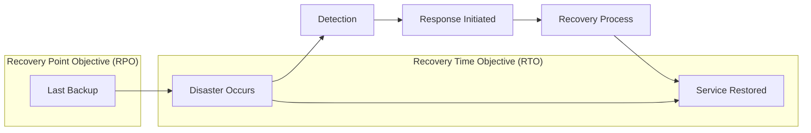
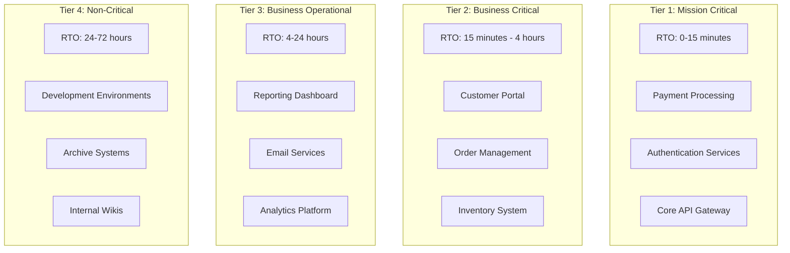
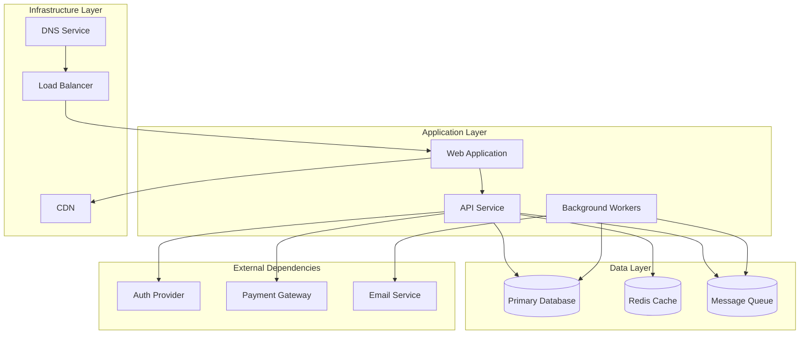
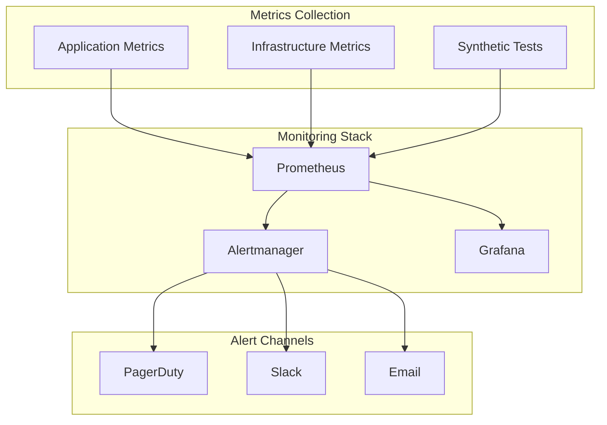
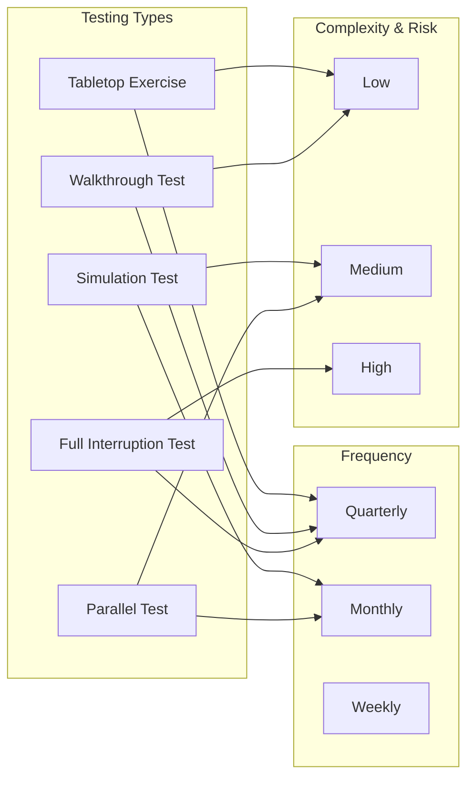

# How to Build Recovery Time Objectives

Author: [nawazdhandala](https://github.com/nawazdhandala)

Tags: Disaster Recovery, RTO, Business Continuity, SRE

Description: Learn how to define and achieve recovery time objectives for critical systems.

---

Recovery Time Objective (RTO) is one of the most critical metrics in disaster recovery planning. It defines the maximum acceptable duration that a system, application, or service can be offline after a failure before the business impact becomes unacceptable. In this guide, we will explore how to build, implement, and monitor RTOs effectively.

## Understanding RTO Fundamentals

Before diving into implementation, let us establish a clear understanding of RTO and its relationship with other disaster recovery metrics.



### Key Definitions

- **RTO (Recovery Time Objective)**: Maximum tolerable downtime for a system
- **RPO (Recovery Point Objective)**: Maximum tolerable data loss measured in time
- **MTTR (Mean Time to Recovery)**: Average time to restore service after failure
- **MTBF (Mean Time Between Failures)**: Average time between system failures

## RTO Tiers and Classification

Not all systems require the same recovery speed. Classifying your systems into tiers helps allocate resources effectively and set realistic expectations.



### Tier Classification Matrix

| Tier | RTO Range | Business Impact | Recovery Strategy |
|------|-----------|-----------------|-------------------|
| 1 | 0-15 min | Immediate revenue loss, regulatory violation | Hot standby, active-active |
| 2 | 15 min - 4 hrs | Significant operational disruption | Warm standby, automated failover |
| 3 | 4-24 hrs | Moderate impact, workarounds available | Cold standby, manual recovery |
| 4 | 24-72 hrs | Minimal immediate impact | Backup restore, rebuild |

## Calculating Your RTO

RTO should be driven by business requirements, not technical capabilities. Here is a systematic approach to calculating RTO for your systems.

### Step 1: Business Impact Analysis

```python
# Business Impact Analysis Calculator
# This script helps quantify the cost of downtime for different systems

from dataclasses import dataclass
from typing import List
from enum import Enum

class ImpactCategory(Enum):
    """Categories of business impact from system downtime."""
    REVENUE = "revenue"
    PRODUCTIVITY = "productivity"
    REPUTATION = "reputation"
    COMPLIANCE = "compliance"
    CUSTOMER_SATISFACTION = "customer_satisfaction"

@dataclass
class SystemImpact:
    """Represents the business impact of a system being down."""
    system_name: str
    hourly_revenue_impact: float  # Direct revenue loss per hour
    affected_employees: int       # Number of employees impacted
    hourly_wage: float           # Average hourly wage of affected employees
    regulatory_penalty_risk: float  # Potential penalty per incident
    customer_churn_rate: float   # Percentage of customers at risk per hour

def calculate_hourly_downtime_cost(impact: SystemImpact) -> dict:
    """
    Calculate the total hourly cost of downtime for a system.

    Args:
        impact: SystemImpact object containing impact metrics

    Returns:
        Dictionary with breakdown of costs by category
    """
    # Calculate productivity loss
    # Formula: affected employees * hourly wage
    productivity_loss = impact.affected_employees * impact.hourly_wage

    # Calculate customer impact cost
    # Assumes $500 lifetime value per customer, 1000 active customers
    customer_lifetime_value = 500
    active_customers = 1000
    customer_loss = (
        impact.customer_churn_rate *
        active_customers *
        customer_lifetime_value
    )

    # Sum all impact categories
    total_hourly_cost = (
        impact.hourly_revenue_impact +
        productivity_loss +
        customer_loss +
        (impact.regulatory_penalty_risk / 24)  # Amortize daily risk to hourly
    )

    return {
        "system": impact.system_name,
        "revenue_loss": impact.hourly_revenue_impact,
        "productivity_loss": productivity_loss,
        "customer_loss": customer_loss,
        "regulatory_risk": impact.regulatory_penalty_risk / 24,
        "total_hourly_cost": total_hourly_cost
    }

def recommend_rto_tier(hourly_cost: float) -> tuple:
    """
    Recommend an RTO tier based on hourly downtime cost.

    Args:
        hourly_cost: Total hourly cost of downtime

    Returns:
        Tuple of (tier number, RTO range string)
    """
    # Thresholds based on industry benchmarks
    if hourly_cost > 100000:
        return (1, "0-15 minutes")
    elif hourly_cost > 25000:
        return (2, "15 minutes - 4 hours")
    elif hourly_cost > 5000:
        return (3, "4-24 hours")
    else:
        return (4, "24-72 hours")

# Example usage
if __name__ == "__main__":
    # Define impact for a payment processing system
    payment_system = SystemImpact(
        system_name="Payment Gateway",
        hourly_revenue_impact=50000,
        affected_employees=25,
        hourly_wage=75,
        regulatory_penalty_risk=100000,
        customer_churn_rate=0.02
    )

    # Calculate costs
    costs = calculate_hourly_downtime_cost(payment_system)
    tier, rto_range = recommend_rto_tier(costs["total_hourly_cost"])

    print(f"System: {costs['system']}")
    print(f"Total Hourly Cost: ${costs['total_hourly_cost']:,.2f}")
    print(f"Recommended Tier: {tier}")
    print(f"Target RTO: {rto_range}")
```

### Step 2: Document Dependencies

Understanding system dependencies is crucial for accurate RTO planning.



## Recovery Strategies by Tier

Each RTO tier requires different recovery strategies. Here are implementation patterns for each tier.

### Tier 1: Hot Standby with Active-Active Configuration

For systems requiring near-zero downtime, implement active-active deployments across multiple regions.

```yaml
# Kubernetes configuration for active-active deployment
# This configuration ensures high availability across two regions

apiVersion: v1
kind: ConfigMap
metadata:
  name: rto-tier1-config
  namespace: production
data:
  # Health check interval in seconds
  # Lower values enable faster failure detection
  HEALTH_CHECK_INTERVAL: "5"

  # Failover threshold - number of failed checks before failover
  FAILOVER_THRESHOLD: "3"

  # Maximum time to wait for graceful shutdown
  GRACEFUL_SHUTDOWN_TIMEOUT: "30"

---
apiVersion: apps/v1
kind: Deployment
metadata:
  name: payment-service
  namespace: production
  labels:
    app: payment-service
    tier: "1"
    rto: "15m"
spec:
  # Run multiple replicas for redundancy
  replicas: 3

  # Rolling update strategy ensures zero-downtime deployments
  strategy:
    type: RollingUpdate
    rollingUpdate:
      maxSurge: 1        # Allow one extra pod during updates
      maxUnavailable: 0  # Never reduce below desired count

  selector:
    matchLabels:
      app: payment-service

  template:
    metadata:
      labels:
        app: payment-service
    spec:
      # Spread pods across availability zones
      topologySpreadConstraints:
        - maxSkew: 1
          topologyKey: topology.kubernetes.io/zone
          whenUnsatisfiable: DoNotSchedule
          labelSelector:
            matchLabels:
              app: payment-service

      # Anti-affinity prevents pods on same node
      affinity:
        podAntiAffinity:
          requiredDuringSchedulingIgnoredDuringExecution:
            - labelSelector:
                matchLabels:
                  app: payment-service
              topologyKey: kubernetes.io/hostname

      containers:
        - name: payment-service
          image: payment-service:latest

          # Resource limits ensure predictable performance
          resources:
            requests:
              memory: "512Mi"
              cpu: "500m"
            limits:
              memory: "1Gi"
              cpu: "1000m"

          # Readiness probe - determines if pod can receive traffic
          readinessProbe:
            httpGet:
              path: /health/ready
              port: 8080
            initialDelaySeconds: 5
            periodSeconds: 5
            failureThreshold: 3

          # Liveness probe - determines if pod should be restarted
          livenessProbe:
            httpGet:
              path: /health/live
              port: 8080
            initialDelaySeconds: 15
            periodSeconds: 10
            failureThreshold: 3

          # Startup probe - allows slow-starting containers
          startupProbe:
            httpGet:
              path: /health/startup
              port: 8080
            failureThreshold: 30
            periodSeconds: 10

---
# Horizontal Pod Autoscaler for handling load spikes
apiVersion: autoscaling/v2
kind: HorizontalPodAutoscaler
metadata:
  name: payment-service-hpa
  namespace: production
spec:
  scaleTargetRef:
    apiVersion: apps/v1
    kind: Deployment
    name: payment-service

  # Minimum replicas ensures availability during low traffic
  minReplicas: 3

  # Maximum replicas prevents runaway scaling
  maxReplicas: 10

  metrics:
    # Scale based on CPU utilization
    - type: Resource
      resource:
        name: cpu
        target:
          type: Utilization
          averageUtilization: 70

    # Scale based on memory utilization
    - type: Resource
      resource:
        name: memory
        target:
          type: Utilization
          averageUtilization: 80
```

### Tier 2: Warm Standby with Automated Failover

```python
# Automated failover manager for Tier 2 systems
# Monitors primary system health and triggers failover when needed

import asyncio
import logging
from dataclasses import dataclass
from datetime import datetime, timedelta
from typing import Optional, Callable, Awaitable
from enum import Enum

# Configure logging for failover events
logging.basicConfig(
    level=logging.INFO,
    format='%(asctime)s - %(name)s - %(levelname)s - %(message)s'
)
logger = logging.getLogger("failover_manager")

class SystemState(Enum):
    """Possible states for a monitored system."""
    HEALTHY = "healthy"
    DEGRADED = "degraded"
    UNHEALTHY = "unhealthy"
    UNKNOWN = "unknown"

@dataclass
class HealthCheckResult:
    """Result of a health check operation."""
    state: SystemState
    latency_ms: float
    timestamp: datetime
    error_message: Optional[str] = None

@dataclass
class FailoverConfig:
    """Configuration for failover behavior."""
    # Number of consecutive failures before triggering failover
    failure_threshold: int = 3

    # Time between health checks in seconds
    check_interval: float = 10.0

    # Maximum latency before considering system degraded
    latency_threshold_ms: float = 500.0

    # Minimum time to wait before failing back to primary
    failback_delay_minutes: int = 15

    # Whether to automatically fail back when primary recovers
    auto_failback: bool = True

class FailoverManager:
    """
    Manages automatic failover between primary and secondary systems.

    This manager continuously monitors the primary system and triggers
    failover to the secondary when the failure threshold is exceeded.
    """

    def __init__(
        self,
        config: FailoverConfig,
        health_check: Callable[[], Awaitable[HealthCheckResult]],
        failover_action: Callable[[], Awaitable[bool]],
        failback_action: Callable[[], Awaitable[bool]]
    ):
        """
        Initialize the failover manager.

        Args:
            config: Failover configuration parameters
            health_check: Async function that checks primary system health
            failover_action: Async function that performs failover to secondary
            failback_action: Async function that fails back to primary
        """
        self.config = config
        self.health_check = health_check
        self.failover_action = failover_action
        self.failback_action = failback_action

        # Track consecutive failures for threshold comparison
        self.consecutive_failures = 0

        # Track when failover occurred for failback delay
        self.failover_timestamp: Optional[datetime] = None

        # Current routing state
        self.is_failed_over = False

        # Running state
        self._running = False

    async def start(self):
        """Start the failover monitoring loop."""
        self._running = True
        logger.info("Failover manager started")

        while self._running:
            try:
                # Perform health check
                result = await self.health_check()

                # Process the result
                await self._process_health_check(result)

            except Exception as e:
                # Treat exceptions as failures
                logger.error(f"Health check error: {e}")
                self.consecutive_failures += 1
                await self._check_failover_threshold()

            # Wait before next check
            await asyncio.sleep(self.config.check_interval)

    async def stop(self):
        """Stop the failover monitoring loop."""
        self._running = False
        logger.info("Failover manager stopped")

    async def _process_health_check(self, result: HealthCheckResult):
        """
        Process a health check result and determine next action.

        Args:
            result: The health check result to process
        """
        if result.state == SystemState.HEALTHY:
            # System is healthy
            if result.latency_ms > self.config.latency_threshold_ms:
                # High latency - count as degraded but not failed
                logger.warning(
                    f"System degraded - latency {result.latency_ms}ms "
                    f"exceeds threshold {self.config.latency_threshold_ms}ms"
                )
            else:
                # Fully healthy - reset failure counter
                self.consecutive_failures = 0

                # Check if we should fail back
                if self.is_failed_over:
                    await self._check_failback()

        elif result.state == SystemState.DEGRADED:
            # Degraded but functional - log but don't count as failure
            logger.warning(f"System degraded: {result.error_message}")

        else:
            # Unhealthy or unknown - count as failure
            logger.error(
                f"System unhealthy: {result.state.value} - "
                f"{result.error_message}"
            )
            self.consecutive_failures += 1
            await self._check_failover_threshold()

    async def _check_failover_threshold(self):
        """Check if failure threshold is exceeded and trigger failover."""
        if (
            not self.is_failed_over and
            self.consecutive_failures >= self.config.failure_threshold
        ):
            logger.critical(
                f"Failure threshold exceeded "
                f"({self.consecutive_failures}/{self.config.failure_threshold}). "
                f"Initiating failover..."
            )

            # Attempt failover
            success = await self.failover_action()

            if success:
                self.is_failed_over = True
                self.failover_timestamp = datetime.now()
                logger.info("Failover completed successfully")
            else:
                logger.error("Failover action failed")

    async def _check_failback(self):
        """Check if conditions are met for failing back to primary."""
        if not self.config.auto_failback:
            return

        if self.failover_timestamp is None:
            return

        # Check if enough time has passed since failover
        elapsed = datetime.now() - self.failover_timestamp
        required_delay = timedelta(minutes=self.config.failback_delay_minutes)

        if elapsed >= required_delay:
            logger.info(
                f"Primary healthy for {elapsed}. "
                f"Initiating failback..."
            )

            success = await self.failback_action()

            if success:
                self.is_failed_over = False
                self.failover_timestamp = None
                self.consecutive_failures = 0
                logger.info("Failback completed successfully")
            else:
                logger.error("Failback action failed")


# Example implementation
async def example_health_check() -> HealthCheckResult:
    """Example health check implementation."""
    # In production, this would check actual system health
    return HealthCheckResult(
        state=SystemState.HEALTHY,
        latency_ms=45.2,
        timestamp=datetime.now()
    )

async def example_failover() -> bool:
    """Example failover action."""
    # In production, this would update load balancer, DNS, etc.
    logger.info("Executing failover: Updating traffic routing to secondary")
    return True

async def example_failback() -> bool:
    """Example failback action."""
    # In production, this would restore routing to primary
    logger.info("Executing failback: Restoring traffic to primary")
    return True

# Usage example
async def main():
    config = FailoverConfig(
        failure_threshold=3,
        check_interval=10.0,
        latency_threshold_ms=500.0,
        failback_delay_minutes=15,
        auto_failback=True
    )

    manager = FailoverManager(
        config=config,
        health_check=example_health_check,
        failover_action=example_failover,
        failback_action=example_failback
    )

    await manager.start()

if __name__ == "__main__":
    asyncio.run(main())
```

### Tier 3: Cold Standby with Scripted Recovery

```bash
#!/bin/bash
# Tier 3 Recovery Script
# Automates the recovery process for cold standby systems
# RTO Target: 4-24 hours

set -euo pipefail

# Configuration
BACKUP_BUCKET="s3://company-backups/tier3-systems"
RECOVERY_REGION="us-west-2"
NOTIFICATION_WEBHOOK="${NOTIFICATION_WEBHOOK:-}"
LOG_FILE="/var/log/recovery/$(date +%Y%m%d-%H%M%S).log"

# Initialize logging
mkdir -p "$(dirname "$LOG_FILE")"
exec 1> >(tee -a "$LOG_FILE")
exec 2>&1

log() {
    # Log messages with timestamp for tracking recovery timeline
    echo "[$(date '+%Y-%m-%d %H:%M:%S')] $1"
}

notify() {
    # Send notification to operations team
    local message="$1"
    local severity="${2:-info}"

    if [[ -n "$NOTIFICATION_WEBHOOK" ]]; then
        curl -s -X POST "$NOTIFICATION_WEBHOOK" \
            -H "Content-Type: application/json" \
            -d "{\"message\": \"$message\", \"severity\": \"$severity\"}" \
            || log "WARNING: Failed to send notification"
    fi

    log "NOTIFICATION [$severity]: $message"
}

check_prerequisites() {
    # Verify required tools are available
    log "Checking prerequisites..."

    local required_tools=("aws" "docker" "psql" "redis-cli")
    local missing_tools=()

    for tool in "${required_tools[@]}"; do
        if ! command -v "$tool" &> /dev/null; then
            missing_tools+=("$tool")
        fi
    done

    if [[ ${#missing_tools[@]} -gt 0 ]]; then
        log "ERROR: Missing required tools: ${missing_tools[*]}"
        exit 1
    fi

    log "All prerequisites satisfied"
}

restore_database() {
    # Restore PostgreSQL database from latest backup
    local db_name="$1"
    local backup_path="$2"

    log "Starting database restoration for $db_name"
    notify "Starting database restoration" "info"

    # Download backup from S3
    log "Downloading backup from $backup_path"
    aws s3 cp "$backup_path" /tmp/db_backup.sql.gz

    # Decompress backup
    log "Decompressing backup..."
    gunzip -f /tmp/db_backup.sql.gz

    # Drop and recreate database
    log "Recreating database..."
    psql -h localhost -U postgres -c "DROP DATABASE IF EXISTS $db_name;"
    psql -h localhost -U postgres -c "CREATE DATABASE $db_name;"

    # Restore from backup
    log "Restoring data..."
    psql -h localhost -U postgres -d "$db_name" < /tmp/db_backup.sql

    # Verify restoration
    local table_count
    table_count=$(psql -h localhost -U postgres -d "$db_name" -t -c \
        "SELECT COUNT(*) FROM information_schema.tables WHERE table_schema = 'public';")

    log "Database restored with $table_count tables"
    notify "Database restoration complete" "info"

    # Cleanup
    rm -f /tmp/db_backup.sql
}

restore_redis_cache() {
    # Restore Redis data from RDB backup
    local backup_path="$1"

    log "Starting Redis cache restoration"

    # Stop Redis to replace data file
    systemctl stop redis

    # Download and place backup
    aws s3 cp "$backup_path" /var/lib/redis/dump.rdb
    chown redis:redis /var/lib/redis/dump.rdb

    # Start Redis
    systemctl start redis

    # Wait for Redis to load data
    log "Waiting for Redis to load data..."
    sleep 10

    # Verify Redis is responding
    if redis-cli ping | grep -q "PONG"; then
        log "Redis cache restored successfully"
    else
        log "ERROR: Redis failed to start"
        return 1
    fi
}

deploy_application() {
    # Deploy application containers
    local version="${1:-latest}"

    log "Deploying application version: $version"
    notify "Starting application deployment" "info"

    # Pull latest images
    log "Pulling container images..."
    docker-compose -f /opt/app/docker-compose.yml pull

    # Start containers
    log "Starting containers..."
    docker-compose -f /opt/app/docker-compose.yml up -d

    # Wait for containers to be healthy
    log "Waiting for containers to become healthy..."
    local max_wait=300
    local waited=0

    while [[ $waited -lt $max_wait ]]; do
        local unhealthy
        unhealthy=$(docker-compose -f /opt/app/docker-compose.yml ps \
            | grep -c "unhealthy" || true)

        if [[ $unhealthy -eq 0 ]]; then
            log "All containers are healthy"
            break
        fi

        sleep 10
        waited=$((waited + 10))
        log "Waiting... ($waited/$max_wait seconds)"
    done

    if [[ $waited -ge $max_wait ]]; then
        log "WARNING: Some containers may not be healthy"
        notify "Container health check timeout" "warning"
    fi
}

run_smoke_tests() {
    # Run basic smoke tests to verify recovery
    log "Running smoke tests..."

    local test_results=()
    local all_passed=true

    # Test 1: API health endpoint
    if curl -sf http://localhost:8080/health > /dev/null; then
        test_results+=("API Health: PASS")
    else
        test_results+=("API Health: FAIL")
        all_passed=false
    fi

    # Test 2: Database connectivity
    if psql -h localhost -U postgres -d app -c "SELECT 1;" > /dev/null 2>&1; then
        test_results+=("Database: PASS")
    else
        test_results+=("Database: FAIL")
        all_passed=false
    fi

    # Test 3: Redis connectivity
    if redis-cli ping | grep -q "PONG"; then
        test_results+=("Redis: PASS")
    else
        test_results+=("Redis: FAIL")
        all_passed=false
    fi

    # Log results
    log "Smoke test results:"
    for result in "${test_results[@]}"; do
        log "  - $result"
    done

    if $all_passed; then
        log "All smoke tests passed"
        notify "Recovery smoke tests passed" "info"
        return 0
    else
        log "ERROR: Some smoke tests failed"
        notify "Recovery smoke tests failed" "critical"
        return 1
    fi
}

main() {
    local start_time
    start_time=$(date +%s)

    log "=========================================="
    log "Starting Tier 3 System Recovery"
    log "=========================================="

    notify "Tier 3 recovery initiated" "warning"

    # Run recovery steps
    check_prerequisites

    # Find latest backups
    local latest_db_backup
    latest_db_backup=$(aws s3 ls "$BACKUP_BUCKET/postgres/" \
        | sort | tail -1 | awk '{print $4}')

    local latest_redis_backup
    latest_redis_backup=$(aws s3 ls "$BACKUP_BUCKET/redis/" \
        | sort | tail -1 | awk '{print $4}')

    log "Latest DB backup: $latest_db_backup"
    log "Latest Redis backup: $latest_redis_backup"

    # Execute recovery
    restore_database "app" "$BACKUP_BUCKET/postgres/$latest_db_backup"
    restore_redis_cache "$BACKUP_BUCKET/redis/$latest_redis_backup"
    deploy_application
    run_smoke_tests

    # Calculate recovery time
    local end_time
    end_time=$(date +%s)
    local duration=$((end_time - start_time))
    local duration_minutes=$((duration / 60))

    log "=========================================="
    log "Recovery completed in $duration_minutes minutes"
    log "=========================================="

    notify "Recovery completed in $duration_minutes minutes" "info"
}

# Execute main function
main "$@"
```

## RTO Monitoring and Alerting

Continuous monitoring ensures your systems can meet their RTO targets when disaster strikes.



### Prometheus Alert Rules for RTO Monitoring

```yaml
# Prometheus alerting rules for RTO monitoring
# These rules track metrics critical to meeting recovery time objectives

groups:
  - name: rto_monitoring
    # Evaluation interval for these rules
    interval: 30s

    rules:
      # Alert when recovery time exceeds tier threshold
      - alert: RTOThresholdExceeded
        expr: |
          # Calculate time since service became unavailable
          (time() - service_last_healthy_timestamp) > on(service)
          group_left(rto_tier)
          (service_rto_threshold_seconds)
        for: 1m
        labels:
          severity: critical
        annotations:
          summary: "RTO threshold exceeded for {{ $labels.service }}"
          description: |
            Service {{ $labels.service }} (Tier {{ $labels.rto_tier }})
            has been unavailable for longer than its RTO threshold.
            Current downtime: {{ $value | humanizeDuration }}
          runbook_url: "https://wiki.company.com/runbooks/rto-exceeded"

      # Alert when approaching RTO threshold
      - alert: RTOThresholdApproaching
        expr: |
          # Alert at 75% of RTO threshold
          (time() - service_last_healthy_timestamp) >
          (0.75 * on(service) group_left() service_rto_threshold_seconds)
          and
          (time() - service_last_healthy_timestamp) <
          on(service) group_left() service_rto_threshold_seconds
        for: 1m
        labels:
          severity: warning
        annotations:
          summary: "Approaching RTO threshold for {{ $labels.service }}"
          description: |
            Service {{ $labels.service }} is at 75% of its RTO threshold.
            Immediate action required to prevent SLA breach.

      # Alert on backup age exceeding RPO
      - alert: BackupAgeExceedsRPO
        expr: |
          # Check if time since last backup exceeds RPO threshold
          (time() - backup_last_successful_timestamp) >
          on(system) group_left() system_rpo_threshold_seconds
        for: 5m
        labels:
          severity: warning
        annotations:
          summary: "Backup age exceeds RPO for {{ $labels.system }}"
          description: |
            Last successful backup for {{ $labels.system }} was
            {{ $value | humanizeDuration }} ago, exceeding the RPO of
            {{ $labels.rpo_hours }} hours.

      # Alert on failover system health
      - alert: FailoverSystemUnhealthy
        expr: |
          # Secondary/failover system should always be healthy
          failover_system_healthy == 0
        for: 5m
        labels:
          severity: critical
        annotations:
          summary: "Failover system unhealthy for {{ $labels.service }}"
          description: |
            The failover system for {{ $labels.service }} is not healthy.
            This compromises the ability to meet RTO if primary fails.

      # Alert on recovery test failures
      - alert: RecoveryTestFailed
        expr: |
          # Track results of periodic recovery tests
          recovery_test_success == 0
        for: 1m
        labels:
          severity: warning
        annotations:
          summary: "Recovery test failed for {{ $labels.service }}"
          description: |
            The automated recovery test for {{ $labels.service }} failed.
            Manual investigation required to ensure RTO can be met.

  - name: rto_metrics_recording
    # Recording rules for efficient querying
    interval: 1m

    rules:
      # Record current downtime for each service
      - record: service:current_downtime_seconds
        expr: |
          time() - service_last_healthy_timestamp

      # Record RTO compliance percentage
      - record: service:rto_compliance_ratio
        expr: |
          1 - (
            (time() - service_last_healthy_timestamp) /
            on(service) group_left() service_rto_threshold_seconds
          )

      # Record mean time to recovery over 30 days
      - record: service:mttr_30d
        expr: |
          avg_over_time(incident_recovery_duration_seconds[30d])
```

### RTO Dashboard Metrics

```python
# RTO Metrics Exporter
# Exposes metrics for Prometheus to enable RTO monitoring

from prometheus_client import Gauge, Counter, Histogram, start_http_server
from dataclasses import dataclass
from typing import Dict, Optional
import time
import threading

# Define Prometheus metrics

# Gauge for current service health status
# 1 = healthy, 0 = unhealthy
service_health = Gauge(
    'service_healthy',
    'Current health status of the service',
    ['service', 'tier']
)

# Gauge for timestamp when service was last healthy
service_last_healthy = Gauge(
    'service_last_healthy_timestamp',
    'Unix timestamp when service was last confirmed healthy',
    ['service']
)

# Gauge for configured RTO threshold
service_rto_threshold = Gauge(
    'service_rto_threshold_seconds',
    'Configured RTO threshold in seconds',
    ['service', 'tier']
)

# Histogram for tracking actual recovery times
recovery_duration = Histogram(
    'incident_recovery_duration_seconds',
    'Time taken to recover from incidents',
    ['service', 'tier', 'incident_type'],
    # Buckets aligned with RTO tiers
    buckets=[60, 300, 900, 3600, 14400, 86400, 259200]
)

# Counter for RTO breaches
rto_breaches = Counter(
    'rto_breaches_total',
    'Total number of RTO threshold breaches',
    ['service', 'tier']
)

# Gauge for failover system health
failover_health = Gauge(
    'failover_system_healthy',
    'Health status of failover/secondary system',
    ['service']
)

# Gauge for last backup timestamp
backup_last_successful = Gauge(
    'backup_last_successful_timestamp',
    'Unix timestamp of last successful backup',
    ['system']
)

# Gauge for recovery test results
recovery_test_success = Gauge(
    'recovery_test_success',
    'Result of last recovery test (1=success, 0=failure)',
    ['service']
)

@dataclass
class ServiceConfig:
    """Configuration for a monitored service."""
    name: str
    tier: int
    rto_seconds: int
    health_check_url: str
    failover_health_url: Optional[str] = None

class RTOMetricsExporter:
    """
    Exports RTO-related metrics to Prometheus.

    This class manages the collection and exposure of metrics
    needed to monitor and alert on RTO compliance.
    """

    def __init__(self, services: Dict[str, ServiceConfig]):
        """
        Initialize the metrics exporter.

        Args:
            services: Dictionary mapping service names to configurations
        """
        self.services = services
        self._running = False

        # Initialize static metrics
        for name, config in services.items():
            # Set RTO threshold (static configuration)
            service_rto_threshold.labels(
                service=name,
                tier=str(config.tier)
            ).set(config.rto_seconds)

            # Initialize last healthy to now (assume healthy at start)
            service_last_healthy.labels(service=name).set(time.time())

    def record_health_check(
        self,
        service_name: str,
        is_healthy: bool
    ):
        """
        Record the result of a health check.

        Args:
            service_name: Name of the service checked
            is_healthy: Whether the service is healthy
        """
        config = self.services[service_name]

        # Update health gauge
        service_health.labels(
            service=service_name,
            tier=str(config.tier)
        ).set(1 if is_healthy else 0)

        # Update last healthy timestamp if healthy
        if is_healthy:
            service_last_healthy.labels(service=service_name).set(time.time())

    def record_recovery(
        self,
        service_name: str,
        duration_seconds: float,
        incident_type: str
    ):
        """
        Record a completed recovery.

        Args:
            service_name: Name of the recovered service
            duration_seconds: How long recovery took
            incident_type: Type of incident (e.g., 'hardware', 'software')
        """
        config = self.services[service_name]

        # Record in histogram
        recovery_duration.labels(
            service=service_name,
            tier=str(config.tier),
            incident_type=incident_type
        ).observe(duration_seconds)

        # Check if RTO was breached
        if duration_seconds > config.rto_seconds:
            rto_breaches.labels(
                service=service_name,
                tier=str(config.tier)
            ).inc()

    def record_failover_health(
        self,
        service_name: str,
        is_healthy: bool
    ):
        """
        Record the health status of a failover system.

        Args:
            service_name: Name of the primary service
            is_healthy: Whether the failover system is healthy
        """
        failover_health.labels(service=service_name).set(1 if is_healthy else 0)

    def record_backup_success(self, system_name: str):
        """
        Record a successful backup.

        Args:
            system_name: Name of the backed up system
        """
        backup_last_successful.labels(system=system_name).set(time.time())

    def record_recovery_test(
        self,
        service_name: str,
        success: bool
    ):
        """
        Record the result of a recovery test.

        Args:
            service_name: Name of the tested service
            success: Whether the test succeeded
        """
        recovery_test_success.labels(service=service_name).set(1 if success else 0)

def start_metrics_server(port: int = 9090):
    """
    Start the Prometheus metrics HTTP server.

    Args:
        port: Port to listen on
    """
    start_http_server(port)
    print(f"Metrics server started on port {port}")

# Example usage
if __name__ == "__main__":
    # Define services to monitor
    services = {
        "payment-gateway": ServiceConfig(
            name="payment-gateway",
            tier=1,
            rto_seconds=900,  # 15 minutes
            health_check_url="http://payment-gateway/health",
            failover_health_url="http://payment-gateway-secondary/health"
        ),
        "order-service": ServiceConfig(
            name="order-service",
            tier=2,
            rto_seconds=14400,  # 4 hours
            health_check_url="http://order-service/health"
        ),
        "reporting-dashboard": ServiceConfig(
            name="reporting-dashboard",
            tier=3,
            rto_seconds=86400,  # 24 hours
            health_check_url="http://reporting/health"
        )
    }

    # Initialize exporter
    exporter = RTOMetricsExporter(services)

    # Start metrics server
    start_metrics_server(9090)

    # Keep running
    while True:
        time.sleep(60)
```

## Testing Your RTO

Regular testing is essential to validate that your recovery procedures can meet RTO targets.



### Automated RTO Testing Framework

```python
# RTO Testing Framework
# Automates disaster recovery testing to validate RTO compliance

import asyncio
import logging
from abc import ABC, abstractmethod
from dataclasses import dataclass, field
from datetime import datetime
from typing import List, Optional, Dict, Any
from enum import Enum
import json

logging.basicConfig(level=logging.INFO)
logger = logging.getLogger("rto_testing")

class TestType(Enum):
    """Types of disaster recovery tests."""
    TABLETOP = "tabletop"           # Discussion-based review
    WALKTHROUGH = "walkthrough"      # Step-by-step procedure review
    SIMULATION = "simulation"        # Simulated failure without actual impact
    PARALLEL = "parallel"            # Recovery to parallel environment
    FULL_INTERRUPTION = "full"       # Actual failover test

class TestResult(Enum):
    """Possible test outcomes."""
    PASSED = "passed"
    FAILED = "failed"
    PARTIAL = "partial"
    SKIPPED = "skipped"

@dataclass
class TestStep:
    """Individual step in a recovery test."""
    name: str
    description: str
    expected_duration_seconds: int
    actual_duration_seconds: Optional[int] = None
    result: TestResult = TestResult.SKIPPED
    notes: str = ""
    error: Optional[str] = None

@dataclass
class RTOTestPlan:
    """Complete test plan for RTO validation."""
    service_name: str
    tier: int
    rto_seconds: int
    test_type: TestType
    steps: List[TestStep] = field(default_factory=list)

    # Test execution tracking
    start_time: Optional[datetime] = None
    end_time: Optional[datetime] = None
    total_duration_seconds: Optional[int] = None
    overall_result: TestResult = TestResult.SKIPPED

    def to_report(self) -> Dict[str, Any]:
        """Generate a test report dictionary."""
        return {
            "service": self.service_name,
            "tier": self.tier,
            "rto_target_seconds": self.rto_seconds,
            "test_type": self.test_type.value,
            "start_time": self.start_time.isoformat() if self.start_time else None,
            "end_time": self.end_time.isoformat() if self.end_time else None,
            "total_duration_seconds": self.total_duration_seconds,
            "rto_met": (
                self.total_duration_seconds <= self.rto_seconds
                if self.total_duration_seconds else None
            ),
            "overall_result": self.overall_result.value,
            "steps": [
                {
                    "name": step.name,
                    "expected_seconds": step.expected_duration_seconds,
                    "actual_seconds": step.actual_duration_seconds,
                    "result": step.result.value,
                    "notes": step.notes,
                    "error": step.error
                }
                for step in self.steps
            ]
        }

class RecoveryStep(ABC):
    """Abstract base class for recovery test steps."""

    @abstractmethod
    async def execute(self) -> tuple[bool, str]:
        """
        Execute the recovery step.

        Returns:
            Tuple of (success, message)
        """
        pass

    @abstractmethod
    async def validate(self) -> tuple[bool, str]:
        """
        Validate the step completed successfully.

        Returns:
            Tuple of (success, message)
        """
        pass

class DatabaseFailoverStep(RecoveryStep):
    """Recovery step for database failover."""

    def __init__(self, primary_host: str, secondary_host: str):
        self.primary_host = primary_host
        self.secondary_host = secondary_host

    async def execute(self) -> tuple[bool, str]:
        """Execute database failover to secondary."""
        logger.info(f"Initiating failover from {self.primary_host} to {self.secondary_host}")

        # In production, this would execute actual failover commands
        # Example: pg_ctl promote, update connection strings, etc.

        await asyncio.sleep(2)  # Simulate failover time

        return True, "Database failover initiated"

    async def validate(self) -> tuple[bool, str]:
        """Validate database is accessible on secondary."""
        logger.info(f"Validating database on {self.secondary_host}")

        # In production, this would run actual connectivity tests

        await asyncio.sleep(1)  # Simulate validation time

        return True, "Database accessible and accepting connections"

class ApplicationRecoveryStep(RecoveryStep):
    """Recovery step for application restart/redeploy."""

    def __init__(self, service_name: str, target_replicas: int):
        self.service_name = service_name
        self.target_replicas = target_replicas

    async def execute(self) -> tuple[bool, str]:
        """Deploy application to recovery environment."""
        logger.info(f"Deploying {self.service_name} with {self.target_replicas} replicas")

        # In production, this would execute kubectl, docker-compose, etc.

        await asyncio.sleep(5)  # Simulate deployment time

        return True, f"Deployed {self.target_replicas} replicas"

    async def validate(self) -> tuple[bool, str]:
        """Validate application is healthy."""
        logger.info(f"Validating {self.service_name} health")

        # In production, this would check health endpoints

        await asyncio.sleep(2)  # Simulate health check time

        return True, "All replicas healthy and serving traffic"

class TrafficSwitchStep(RecoveryStep):
    """Recovery step for switching traffic to recovered system."""

    def __init__(self, load_balancer: str, target_pool: str):
        self.load_balancer = load_balancer
        self.target_pool = target_pool

    async def execute(self) -> tuple[bool, str]:
        """Switch traffic to recovery environment."""
        logger.info(f"Switching {self.load_balancer} to {self.target_pool}")

        # In production, this would update load balancer configuration

        await asyncio.sleep(1)  # Simulate config update time

        return True, "Traffic routing updated"

    async def validate(self) -> tuple[bool, str]:
        """Validate traffic is flowing to new target."""
        logger.info("Validating traffic routing")

        # In production, this would verify traffic metrics

        await asyncio.sleep(1)  # Simulate validation time

        return True, "Traffic confirmed flowing to recovery environment"

class RTOTestRunner:
    """
    Executes RTO tests and generates reports.

    This runner coordinates the execution of recovery test plans,
    tracks timing, and generates compliance reports.
    """

    def __init__(self):
        self.test_history: List[RTOTestPlan] = []

    async def run_test(
        self,
        plan: RTOTestPlan,
        steps: List[tuple[RecoveryStep, TestStep]]
    ) -> RTOTestPlan:
        """
        Execute a complete RTO test.

        Args:
            plan: The test plan to execute
            steps: List of (RecoveryStep implementation, TestStep metadata) tuples

        Returns:
            Updated test plan with results
        """
        logger.info(f"Starting RTO test for {plan.service_name}")
        logger.info(f"Test type: {plan.test_type.value}")
        logger.info(f"RTO target: {plan.rto_seconds} seconds")

        plan.start_time = datetime.now()
        all_passed = True

        for recovery_step, test_step in steps:
            step_start = datetime.now()
            logger.info(f"Executing step: {test_step.name}")

            try:
                # Execute the step
                success, message = await recovery_step.execute()

                if success:
                    # Validate the step
                    valid, validation_message = await recovery_step.validate()

                    if valid:
                        test_step.result = TestResult.PASSED
                        test_step.notes = f"{message}. {validation_message}"
                    else:
                        test_step.result = TestResult.PARTIAL
                        test_step.notes = f"Executed but validation failed: {validation_message}"
                        all_passed = False
                else:
                    test_step.result = TestResult.FAILED
                    test_step.error = message
                    all_passed = False

            except Exception as e:
                test_step.result = TestResult.FAILED
                test_step.error = str(e)
                all_passed = False
                logger.error(f"Step failed with exception: {e}")

            # Record timing
            step_end = datetime.now()
            test_step.actual_duration_seconds = int(
                (step_end - step_start).total_seconds()
            )

            logger.info(
                f"Step {test_step.name}: {test_step.result.value} "
                f"({test_step.actual_duration_seconds}s)"
            )

        # Finalize test results
        plan.end_time = datetime.now()
        plan.total_duration_seconds = int(
            (plan.end_time - plan.start_time).total_seconds()
        )

        # Determine overall result
        if all_passed and plan.total_duration_seconds <= plan.rto_seconds:
            plan.overall_result = TestResult.PASSED
        elif all_passed:
            plan.overall_result = TestResult.PARTIAL  # Steps passed but RTO exceeded
        else:
            plan.overall_result = TestResult.FAILED

        # Log summary
        logger.info("=" * 50)
        logger.info(f"Test completed: {plan.overall_result.value}")
        logger.info(f"Total duration: {plan.total_duration_seconds}s")
        logger.info(f"RTO target: {plan.rto_seconds}s")
        logger.info(
            f"RTO met: {plan.total_duration_seconds <= plan.rto_seconds}"
        )
        logger.info("=" * 50)

        self.test_history.append(plan)
        return plan

    def generate_report(self, plan: RTOTestPlan) -> str:
        """Generate a JSON report from a test plan."""
        return json.dumps(plan.to_report(), indent=2)

# Example usage
async def run_example_test():
    """Run an example RTO test."""

    # Create test plan
    plan = RTOTestPlan(
        service_name="payment-gateway",
        tier=1,
        rto_seconds=900,  # 15 minutes
        test_type=TestType.PARALLEL,
        steps=[
            TestStep(
                name="Database Failover",
                description="Failover PostgreSQL to secondary region",
                expected_duration_seconds=120
            ),
            TestStep(
                name="Application Deployment",
                description="Deploy application to recovery environment",
                expected_duration_seconds=300
            ),
            TestStep(
                name="Traffic Switch",
                description="Update load balancer to route to recovery environment",
                expected_duration_seconds=60
            )
        ]
    )

    # Create step implementations
    steps = [
        (
            DatabaseFailoverStep("db-primary.us-east-1", "db-secondary.us-west-2"),
            plan.steps[0]
        ),
        (
            ApplicationRecoveryStep("payment-gateway", 3),
            plan.steps[1]
        ),
        (
            TrafficSwitchStep("alb-production", "tg-recovery"),
            plan.steps[2]
        )
    ]

    # Run test
    runner = RTOTestRunner()
    result = await runner.run_test(plan, steps)

    # Generate report
    report = runner.generate_report(result)
    print("\nTest Report:")
    print(report)

if __name__ == "__main__":
    asyncio.run(run_example_test())
```

## Best Practices for RTO Success

### 1. Document Everything

Maintain runbooks with step-by-step recovery procedures for each system tier.

### 2. Automate Recovery Steps

Manual processes are slow and error-prone. Automate as much as possible.

### 3. Test Regularly

Schedule recovery tests at least quarterly, with critical systems tested monthly.

### 4. Monitor Continuously

Track metrics that indicate whether you can meet your RTO targets.

### 5. Review and Improve

After each incident or test, conduct a review and update procedures.

### 6. Train Your Team

Ensure all team members understand RTO requirements and recovery procedures.

## Conclusion

Building effective Recovery Time Objectives requires a systematic approach that combines business impact analysis, appropriate technical architecture, comprehensive monitoring, and regular testing. By following the patterns and practices outlined in this guide, you can build a disaster recovery program that protects your business from extended outages.

Remember that RTO is not just a technical metric. It represents a commitment to your customers and stakeholders about service availability. Invest the time to get it right, test it regularly, and continuously improve your recovery capabilities.

### Key Takeaways

1. Classify systems into tiers based on business impact, not technical complexity
2. Match recovery strategies to RTO requirements and budget constraints
3. Implement comprehensive monitoring to track RTO compliance
4. Test recovery procedures regularly in realistic conditions
5. Automate recovery steps to reduce human error and recovery time
6. Document procedures and train team members thoroughly
