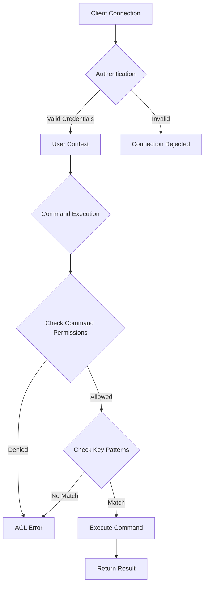
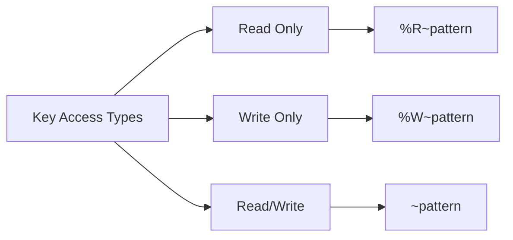
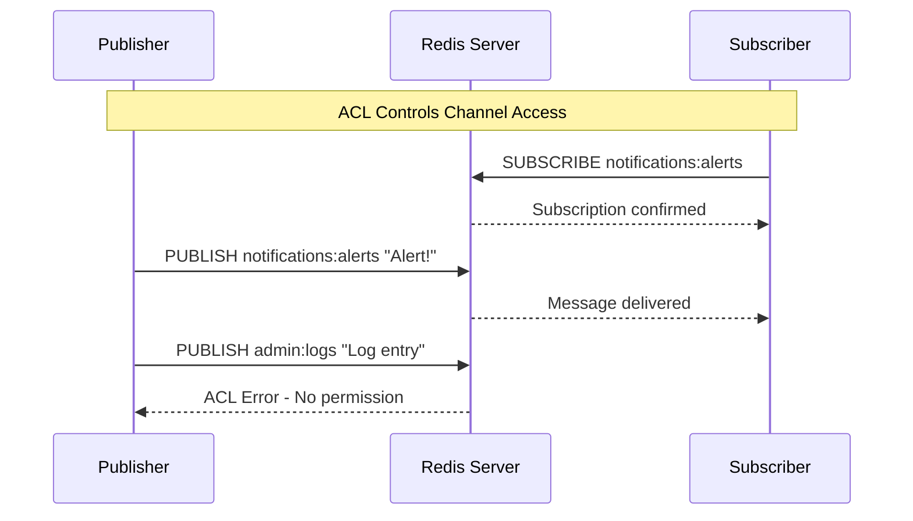
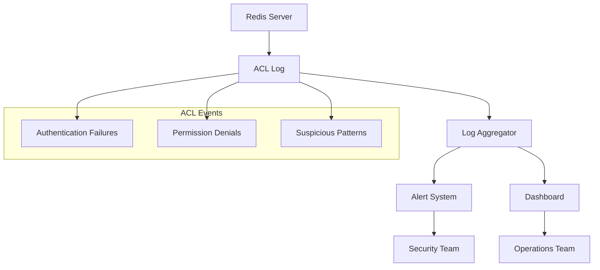
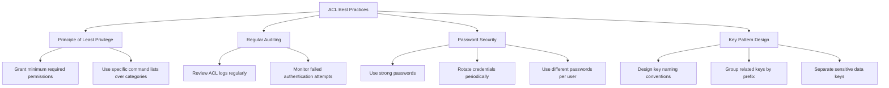
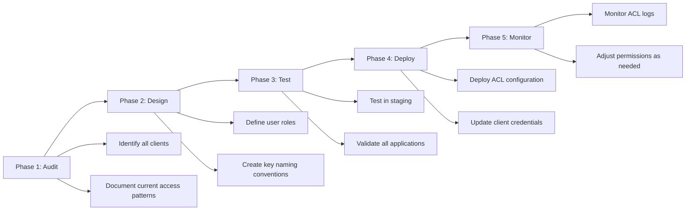

# How to Implement Redis ACL Policies

Author: [nawazdhandala](https://github.com/nawazdhandala)

Tags: Redis, ACL, Security, Access Control

Description: Learn to implement Redis ACL with user management, command restrictions, and key patterns for fine-grained access control.

---

## Introduction

Redis Access Control Lists (ACLs) provide a powerful mechanism to control who can access your Redis server and what operations they can perform. Introduced in Redis 6.0, ACLs allow you to create users with specific permissions, restrict access to certain commands, and limit operations to specific key patterns. This guide will walk you through implementing comprehensive ACL policies for your Redis deployment.

## Understanding Redis ACL Architecture

Before diving into implementation, let us understand how Redis ACL components work together.



## Core ACL Concepts

### ACL Rule Categories

Redis ACL rules fall into several categories:

```mermaid
graph LR
    A[ACL Rules] --> B[User State]
    A --> C[Command Permissions]
    A --> D[Key Patterns]
    A --> E[Pub/Sub Channels]

    B --> B1[on/off]
    C --> C1[+command/-command]
    C --> C2[+@category/-@category]
    D --> D1[~pattern]
    D --> D2[%R~pattern]
    D --> D3[%W~pattern]
    E --> E1[&channel]
```

## Setting Up ACL Users

### Creating Your First ACL User

Let us start by creating a basic user with specific permissions.

```bash
# Connect to Redis CLI as admin
redis-cli

# Create a new user with password and basic permissions
ACL SETUSER appuser on >secretpassword ~app:* +@read +@write -@dangerous
```

This command breaks down as follows:

| Component | Description |
|-----------|-------------|
| `appuser` | Username for the new user |
| `on` | Enable the user account |
| `>secretpassword` | Set the user password |
| `~app:*` | Allow access to keys matching pattern `app:*` |
| `+@read` | Allow all read commands |
| `+@write` | Allow all write commands |
| `-@dangerous` | Deny all dangerous commands |

### Viewing User Permissions

```bash
# List all users
ACL LIST

# Get specific user details
ACL GETUSER appuser
```

Example output:

```
1) "flags"
2) 1) "on"
3) "passwords"
4) 1) "5e884898da28047d91..."
5) "commands"
6) "+@read +@write -@dangerous"
7) "keys"
8) 1) "~app:*"
9) "channels"
10) ""
```

## Command Categories and Permissions

### Understanding Command Categories

Redis organizes commands into categories for easier permission management.

```mermaid
graph TD
    A[Command Categories] --> B[@read]
    A --> C[@write]
    A --> D[@admin]
    A --> E[@dangerous]
    A --> F[@fast]
    A --> G[@slow]
    A --> H[@pubsub]
    A --> I[@transaction]
    A --> J[@scripting]

    B --> B1[GET, MGET, HGET...]
    C --> C1[SET, DEL, HSET...]
    D --> D1[CONFIG, DEBUG...]
    E --> E1[FLUSHALL, KEYS...]
    H --> H1[PUBLISH, SUBSCRIBE...]
    I --> I1[MULTI, EXEC...]
    J --> J1[EVAL, EVALSHA...]
```

### Listing Available Categories

```bash
# List all command categories
ACL CAT

# List commands in a specific category
ACL CAT read
ACL CAT write
ACL CAT dangerous
```

### Creating Role-Based Users

Here is how to create users for different application roles:

```bash
# Read-only user for reporting
ACL SETUSER reporter on >reportpass ~report:* ~analytics:* +@read -@write -@admin -@dangerous

# Cache manager with limited write access
ACL SETUSER cachemanager on >cachepass ~cache:* +GET +SET +DEL +EXPIRE +TTL -@admin -@dangerous

# Admin user with full access
ACL SETUSER admin on >adminpass ~* +@all

# Queue worker with specific command access
ACL SETUSER queueworker on >queuepass ~queue:* +LPUSH +RPUSH +LPOP +RPOP +LRANGE +LLEN -@admin -@dangerous
```

## Key Pattern Restrictions

### Basic Key Patterns

Key patterns use glob-style matching to restrict access:

```bash
# User can only access keys starting with "user:"
ACL SETUSER userservice on >userpass ~user:* +@all -@admin

# User can access multiple key prefixes
ACL SETUSER multiservice on >multipass ~orders:* ~products:* ~inventory:* +@read +@write

# User with read-only access to specific keys
ACL SETUSER readonly on >readpass %R~* +@read
```

### Read and Write Key Patterns

Redis 7.0 introduced separate read and write key permissions:

```bash
# User can read all keys but only write to specific ones
ACL SETUSER mixedaccess on >mixedpass %R~* %W~writable:* +@all -@admin -@dangerous
```



### Practical Key Pattern Examples

```bash
# E-commerce application users
ACL SETUSER checkout on >checkoutpass ~cart:* ~order:* ~payment:* +@read +@write -@dangerous

# Session management service
ACL SETUSER sessionmgr on >sessionpass ~session:* +GET +SET +DEL +EXPIRE +EXISTS -@admin

# Analytics service - read from multiple sources
ACL SETUSER analytics on >analyticspass %R~events:* %R~metrics:* %R~logs:* +@read -@write -@admin
```

## Pub/Sub Channel Restrictions

### Restricting Channel Access

```bash
# User can only subscribe to specific channels
ACL SETUSER subscriber on >subpass &notifications:* +SUBSCRIBE +PSUBSCRIBE +UNSUBSCRIBE +PUNSUBSCRIBE

# Publisher with write access to channels
ACL SETUSER publisher on >pubpass &events:* +PUBLISH

# Full pub/sub access for specific channel patterns
ACL SETUSER pubsubuser on >pubsubpass &app:* +@pubsub
```



## ACL Configuration File

### Creating an ACL File

For production deployments, store ACL rules in a configuration file:

```bash
# /etc/redis/users.acl

# Default user - disabled for security
user default off

# Admin user with full access
user admin on >strongadminpassword ~* &* +@all

# Application user
user appuser on >appsecretpassword ~app:* &app:* +@read +@write -@dangerous -@admin

# Read-only monitoring user
user monitor on >monitorpassword ~* +INFO +DBSIZE +SLOWLOG +CLIENT|LIST +MEMORY|STATS -@write -@admin -@dangerous

# Background job processor
user jobworker on >jobpassword ~jobs:* ~results:* +LPUSH +RPUSH +LPOP +RPOP +BRPOP +BLPOP +LRANGE -@admin -@dangerous
```

### Loading ACL Configuration

```bash
# In redis.conf, add:
aclfile /etc/redis/users.acl

# Or load dynamically
redis-cli ACL LOAD

# Save current ACL rules to file
redis-cli ACL SAVE
```

## Implementing ACL in Applications

### Python Example

```python
import redis

# Connect as application user
app_client = redis.Redis(
    host='localhost',
    port=6379,
    username='appuser',
    password='secretpassword',
    decode_responses=True
)

# This works - key matches pattern app:*
app_client.set('app:user:123', 'John Doe')
user = app_client.get('app:user:123')
print(f"User: {user}")

# This fails - key does not match pattern
try:
    app_client.set('admin:config', 'value')
except redis.exceptions.NoPermissionError as e:
    print(f"ACL Error: {e}")

# Connect as read-only user
readonly_client = redis.Redis(
    host='localhost',
    port=6379,
    username='reporter',
    password='reportpass',
    decode_responses=True
)

# Read operation works
data = readonly_client.get('report:daily:2024-01-15')

# Write operation fails
try:
    readonly_client.set('report:daily:2024-01-15', 'new data')
except redis.exceptions.NoPermissionError as e:
    print(f"Write denied: {e}")
```

### Node.js Example

```javascript
const Redis = require('ioredis');

// Create connection with ACL credentials
const redis = new Redis({
  host: 'localhost',
  port: 6379,
  username: 'appuser',
  password: 'secretpassword'
});

async function demonstrateACL() {
  try {
    // Allowed operation
    await redis.set('app:session:abc123', JSON.stringify({
      userId: 1,
      expires: Date.now() + 3600000
    }));

    const session = await redis.get('app:session:abc123');
    console.log('Session:', JSON.parse(session));

    // Denied operation - wrong key pattern
    await redis.set('system:config', 'value');
  } catch (error) {
    if (error.message.includes('NOPERM')) {
      console.log('ACL denied the operation:', error.message);
    }
  }
}

demonstrateACL();
```

### Go Example

```go
package main

import (
    "context"
    "fmt"
    "github.com/redis/go-redis/v9"
)

func main() {
    ctx := context.Background()

    // Connect with ACL credentials
    rdb := redis.NewClient(&redis.Options{
        Addr:     "localhost:6379",
        Username: "appuser",
        Password: "secretpassword",
    })

    // Allowed operation
    err := rdb.Set(ctx, "app:data:key1", "value1", 0).Err()
    if err != nil {
        fmt.Printf("Error: %v\n", err)
        return
    }

    // Read the value back
    val, err := rdb.Get(ctx, "app:data:key1").Result()
    if err != nil {
        fmt.Printf("Error: %v\n", err)
        return
    }
    fmt.Printf("Value: %s\n", val)

    // Attempt denied operation
    err = rdb.Set(ctx, "admin:secret", "value", 0).Err()
    if err != nil {
        fmt.Printf("ACL Error (expected): %v\n", err)
    }
}
```

## Auditing and Monitoring ACL

### Enabling ACL Logging

```bash
# Enable ACL logging in redis.conf
acllog-max-len 128

# View ACL log entries
redis-cli ACL LOG

# View specific number of entries
redis-cli ACL LOG 10

# Reset the ACL log
redis-cli ACL LOG RESET
```

### Sample ACL Log Output

```
1) 1) "count"
   2) (integer) 1
   3) "reason"
   4) "key"
   5) "context"
   6) "toplevel"
   7) "object"
   8) "admin:config"
   9) "username"
   10) "appuser"
   11) "age-seconds"
   12) "5.432"
   13) "client-info"
   14) "id=5 addr=127.0.0.1:54321..."
```

### Monitoring ACL Events



### Creating an Audit Script

```python
import redis
import json
from datetime import datetime

def audit_acl_events(redis_client):
    """Fetch and process ACL log entries."""
    acl_log = redis_client.execute_command('ACL', 'LOG')

    events = []
    for entry in acl_log:
        event = {
            'count': entry[1],
            'reason': entry[3],
            'context': entry[5],
            'object': entry[7],
            'username': entry[9],
            'age_seconds': float(entry[11]),
            'timestamp': datetime.now().isoformat()
        }
        events.append(event)

    return events

def generate_audit_report(events):
    """Generate a summary report of ACL events."""
    report = {
        'total_events': len(events),
        'by_user': {},
        'by_reason': {},
        'denied_keys': []
    }

    for event in events:
        user = event['username']
        reason = event['reason']

        report['by_user'][user] = report['by_user'].get(user, 0) + event['count']
        report['by_reason'][reason] = report['by_reason'].get(reason, 0) + event['count']

        if reason == 'key':
            report['denied_keys'].append(event['object'])

    return report

# Usage
admin_client = redis.Redis(
    host='localhost',
    port=6379,
    username='admin',
    password='adminpassword'
)

events = audit_acl_events(admin_client)
report = generate_audit_report(events)
print(json.dumps(report, indent=2))
```

## Best Practices

### Security Recommendations



### Common ACL Patterns

```bash
# Microservice pattern - each service gets its own namespace
ACL SETUSER user-service on >pass1 ~users:* +@read +@write -@dangerous
ACL SETUSER order-service on >pass2 ~orders:* +@read +@write -@dangerous
ACL SETUSER inventory-service on >pass3 ~inventory:* +@read +@write -@dangerous

# Read replica pattern - read-only access for replicas
ACL SETUSER replica on >replicapass ~* +@read +PSYNC +REPLCONF -@write -@admin

# Backup pattern - specific commands for backup operations
ACL SETUSER backup on >backuppass ~* +BGSAVE +LASTSAVE +DEBUG|SLEEP -@write -@admin

# Development pattern - broad access with dangerous commands blocked
ACL SETUSER developer on >devpass ~dev:* +@all -@dangerous -FLUSHALL -FLUSHDB -DEBUG
```

### Troubleshooting ACL Issues

```bash
# Test if a user can execute a command
ACL DRYRUN appuser GET app:user:123
# Returns "OK" or describes the permission error

# Check current user
ACL WHOAMI

# Verify user exists and is enabled
ACL GETUSER appuser

# List all commands a user can execute
ACL CAT | while read cat; do
  echo "=== $cat ==="
  ACL DRYRUN appuser $(ACL CAT $cat | head -1) testkey 2>&1
done
```

## Migration Strategy

When implementing ACLs on an existing Redis deployment:



## Conclusion

Redis ACLs provide a robust framework for implementing fine-grained access control in your Redis deployments. By carefully designing user roles, command permissions, and key patterns, you can significantly improve your security posture while maintaining the flexibility Redis is known for.

Key takeaways:

1. Always disable the default user in production
2. Use the principle of least privilege when assigning permissions
3. Design key naming conventions that support ACL patterns
4. Regularly audit ACL logs for security events
5. Test ACL configurations thoroughly before production deployment
6. Keep ACL rules in version-controlled configuration files

With proper ACL implementation, you can confidently deploy Redis in multi-tenant environments and ensure that each application component only accesses the data it needs.

## References

- [Redis ACL Documentation](https://redis.io/docs/management/security/acl/)
- [Redis Security Best Practices](https://redis.io/docs/management/security/)
- [Redis Command Reference](https://redis.io/commands/)
