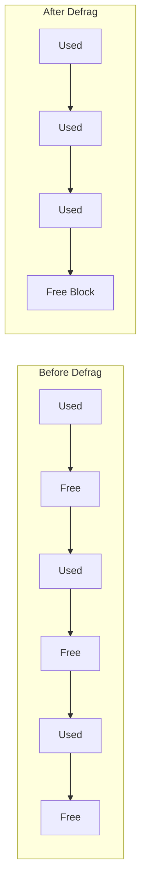
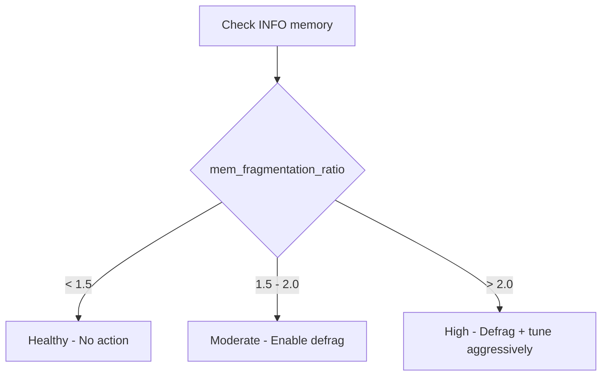
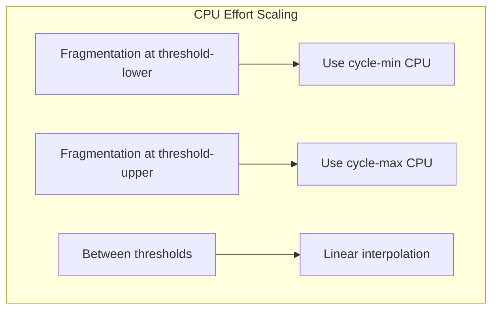
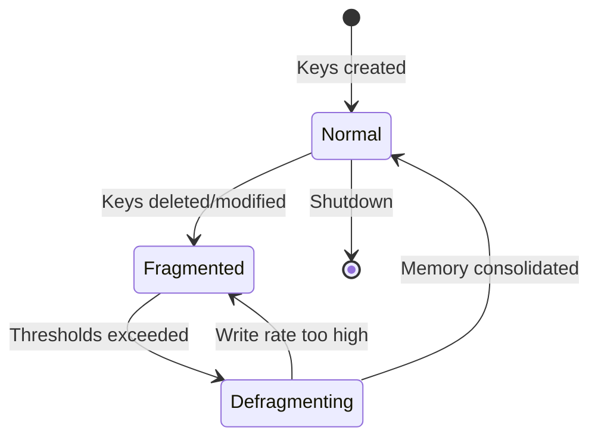

# How to Implement Redis Active Defragmentation

Author: [nawazdhandala](https://github.com/nawazdhandala)

Tags: Redis, Memory, Performance, Operations

Description: A practical guide to enabling, tuning, and monitoring Redis active defragmentation to reclaim wasted memory without restarts.

---

## Why Memory Fragmentation Happens

Redis allocates memory through jemalloc (the default allocator). Over time, as keys are created, modified, and deleted, the allocator ends up with scattered free chunks that cannot be reused for new allocations. This is external fragmentation.

The result: Redis reports high `used_memory_rss` (resident set size) while `used_memory` stays modest. You are paying for RAM that holds nothing useful.



Fragmentation is common when:

- Keys have variable sizes (hashes, lists, streams)
- Workloads delete or expire large volumes of keys
- Frequent updates change value sizes

## Measuring Fragmentation with INFO memory

Run `INFO memory` and look for these fields:

```
127.0.0.1:6379> INFO memory
# Memory
used_memory:1073741824
used_memory_human:1.00G
used_memory_rss:1610612736
used_memory_rss_human:1.50G
mem_fragmentation_ratio:1.50
mem_fragmentation_bytes:536870912
allocator_frag_ratio:1.48
allocator_frag_bytes:515899392
```

### Key Metrics Explained

| Metric | Meaning |
|--------|---------|
| `used_memory` | Bytes requested by Redis for data |
| `used_memory_rss` | Bytes actually held by the OS |
| `mem_fragmentation_ratio` | `used_memory_rss / used_memory` |
| `mem_fragmentation_bytes` | Absolute wasted bytes |
| `allocator_frag_ratio` | jemalloc internal fragmentation |

**Rule of thumb:**

- Ratio 1.0 to 1.5: healthy
- Ratio 1.5 to 2.0: moderate fragmentation, consider defrag
- Ratio above 2.0: significant waste, defrag recommended



## Enabling Active Defragmentation

Active defragmentation was introduced in Redis 4.0 and refined in later versions. It runs in the background, relocating values to consolidate free memory.

### Prerequisites

1. Redis 4.0 or later (6.0+ recommended for stability)
2. jemalloc allocator (default on most builds)
3. Sufficient CPU headroom

Verify your allocator:

```bash
redis-cli INFO server | grep mem_allocator
# mem_allocator:jemalloc-5.2.1
```

If you see `libc` instead of `jemalloc`, you cannot use active defrag. Rebuild or use a different package.

### Basic Configuration

Add these to your `redis.conf` or apply at runtime:

```conf
# Enable the defragmentation engine
activedefrag yes

# Start defrag when fragmentation exceeds 10%
active-defrag-ignore-bytes 100mb
active-defrag-threshold-lower 10

# Stop defrag when fragmentation drops below 5%
active-defrag-threshold-upper 100

# CPU effort: percentage of CPU time (1-25 recommended)
active-defrag-cycle-min 1
active-defrag-cycle-max 25

# Max size of keys to defrag in a single step
active-defrag-max-scan-fields 1000
```

Apply at runtime without restart:

```bash
redis-cli CONFIG SET activedefrag yes
redis-cli CONFIG SET active-defrag-ignore-bytes 100mb
redis-cli CONFIG SET active-defrag-threshold-lower 10
redis-cli CONFIG SET active-defrag-threshold-upper 100
redis-cli CONFIG SET active-defrag-cycle-min 1
redis-cli CONFIG SET active-defrag-cycle-max 25
```

## Configuration Parameters Deep Dive

### Thresholds

| Parameter | Default | Purpose |
|-----------|---------|---------|
| `active-defrag-ignore-bytes` | 100mb | Minimum fragmented bytes before defrag starts |
| `active-defrag-threshold-lower` | 10 | Start defrag when ratio exceeds this % |
| `active-defrag-threshold-upper` | 100 | Stop defrag when ratio drops below this % |

The defragmenter activates only when BOTH conditions are met:

1. `mem_fragmentation_bytes` > `active-defrag-ignore-bytes`
2. `mem_fragmentation_ratio` > `1 + (active-defrag-threshold-lower / 100)`

### CPU Effort

| Parameter | Default | Purpose |
|-----------|---------|---------|
| `active-defrag-cycle-min` | 1 | Minimum CPU % when defrag is active |
| `active-defrag-cycle-max` | 25 | Maximum CPU % (scales with fragmentation severity) |

Higher values reclaim memory faster but may add latency to commands. Start conservative and increase if defrag progress is too slow.



### Scan Fields

| Parameter | Default | Purpose |
|-----------|---------|---------|
| `active-defrag-max-scan-fields` | 1000 | Max hash/set/zset fields processed per defrag step |

Large collections with millions of fields can stall the defrag loop. If you have very large keys, consider increasing this or accept slower defrag progress.

## Monitoring Defragmentation Progress

### INFO memory Fields

After enabling defrag, monitor these additional fields:

```
127.0.0.1:6379> INFO memory
...
active_defrag_running:1
active_defrag_hits:1048576
active_defrag_misses:256000
active_defrag_key_hits:50000
active_defrag_key_misses:10000
```

| Metric | Meaning |
|--------|---------|
| `active_defrag_running` | 1 if defrag is currently active |
| `active_defrag_hits` | Number of values successfully relocated |
| `active_defrag_misses` | Values that could not be moved (in use) |
| `active_defrag_key_hits` | Keys with relocated values |
| `active_defrag_key_misses` | Keys skipped |

### Setting Up Alerts

Track `mem_fragmentation_ratio` over time. Alert when:

- Ratio exceeds 2.0 for more than 15 minutes
- Ratio keeps climbing despite defrag being enabled (may indicate a bug or insufficient CPU budget)

Example Prometheus query:

```promql
redis_memory_fragmentation_ratio > 2
```

### Tracking Defrag Effectiveness

Compare before and after:

```bash
# Capture baseline
redis-cli INFO memory | grep -E "(used_memory_rss|mem_fragmentation)"

# Wait for defrag cycle (hours to days depending on data size)

# Check improvement
redis-cli INFO memory | grep -E "(used_memory_rss|mem_fragmentation)"
```

A successful defrag cycle should show:

- `mem_fragmentation_ratio` dropping toward 1.0
- `used_memory_rss` decreasing while `used_memory` stays constant
- `active_defrag_hits` increasing steadily

## Tuning for Production Workloads

### Low Latency Requirements

If you need sub-millisecond p99 latency, use conservative settings:

```conf
activedefrag yes
active-defrag-ignore-bytes 500mb
active-defrag-threshold-lower 20
active-defrag-cycle-min 1
active-defrag-cycle-max 10
```

Defrag will run slower but impact on command latency is minimal.

### Memory Constrained Environments

When RAM is tight and you need aggressive reclamation:

```conf
activedefrag yes
active-defrag-ignore-bytes 50mb
active-defrag-threshold-lower 5
active-defrag-threshold-upper 50
active-defrag-cycle-min 5
active-defrag-cycle-max 50
```

Monitor latency closely. Back off if p99 degrades.

### Large Keys (Hashes with millions of fields)

Increase scan fields to prevent defrag from skipping large collections:

```conf
active-defrag-max-scan-fields 10000
```

This uses more CPU per step but ensures large keys get defragmented.

## Common Issues and Solutions

### Defrag Not Starting

Check all conditions:

```bash
redis-cli INFO memory | grep -E "(mem_fragmentation_ratio|mem_fragmentation_bytes|active_defrag)"
```

If ratio is above threshold but defrag is not running:

1. Verify `activedefrag yes` is set
2. Check if `mem_fragmentation_bytes` exceeds `active-defrag-ignore-bytes`
3. Confirm jemalloc is the allocator

### Defrag Running But No Improvement

Possible causes:

- Write rate exceeds defrag rate: increase `active-defrag-cycle-max`
- Large keys being skipped: increase `active-defrag-max-scan-fields`
- Keys constantly in use: normal, defrag cannot relocate actively accessed data

### Increased Latency During Defrag

Reduce CPU effort:

```bash
redis-cli CONFIG SET active-defrag-cycle-max 10
```

Or schedule defrag during low traffic periods by toggling:

```bash
# Enable during maintenance window
redis-cli CONFIG SET activedefrag yes

# Disable during peak hours
redis-cli CONFIG SET activedefrag no
```

## Memory Lifecycle Visualization



## Checklist for Implementation

1. **Verify allocator**: Confirm jemalloc via `INFO server`
2. **Baseline metrics**: Record current `mem_fragmentation_ratio` and `used_memory_rss`
3. **Enable defrag**: Start with conservative settings
4. **Monitor**: Track fragmentation ratio and defrag hits over 24-48 hours
5. **Tune thresholds**: Adjust based on observed fragmentation patterns
6. **Set alerts**: Notify when ratio exceeds 2.0 despite defrag running
7. **Document**: Add settings to your configuration management

## Summary

Active defragmentation lets Redis reclaim wasted memory without restarts or failovers. The key steps are:

1. Measure fragmentation with `INFO memory`
2. Enable with `activedefrag yes`
3. Tune thresholds based on your workload profile
4. Monitor `mem_fragmentation_ratio` and defrag stats continuously
5. Adjust CPU effort to balance reclamation speed against latency impact

Start conservative, measure the impact, and iterate. Your future self (and your memory budget) will thank you.
