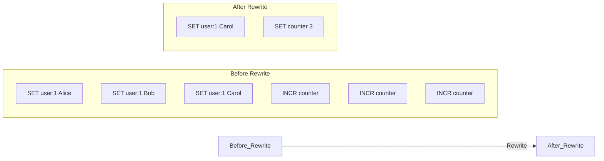
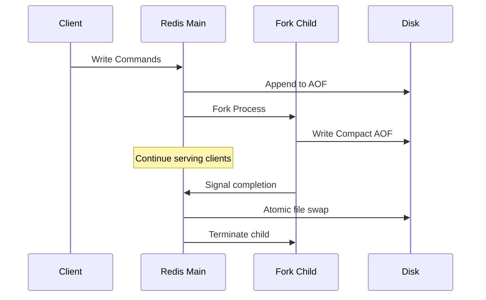
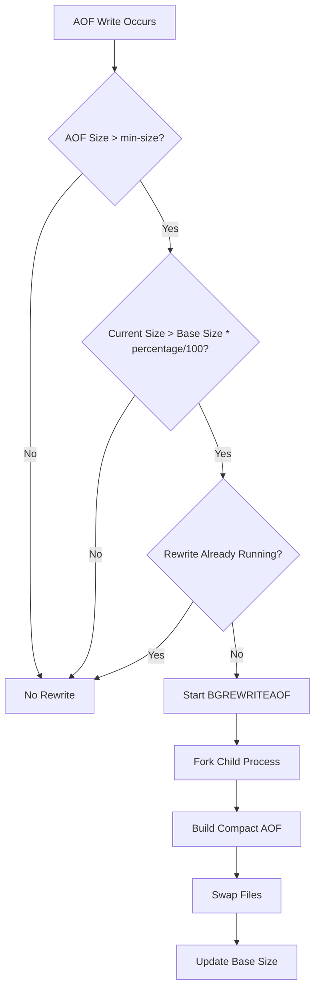
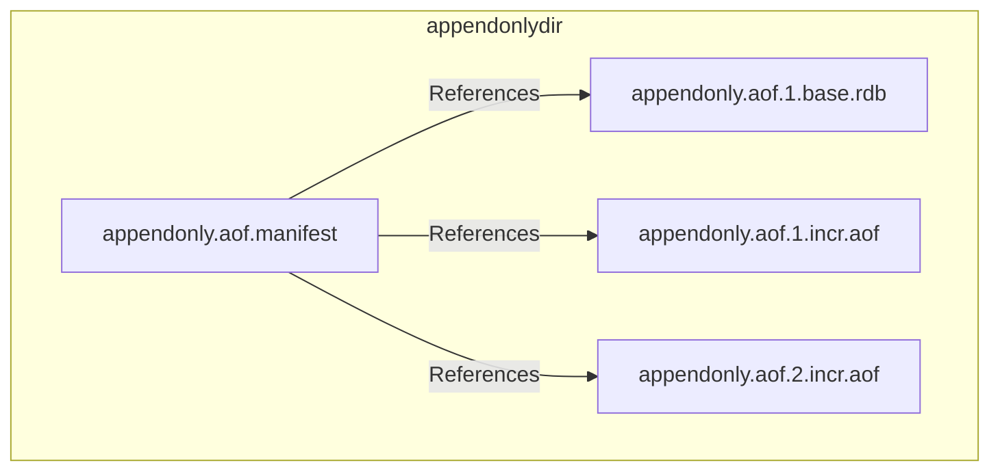
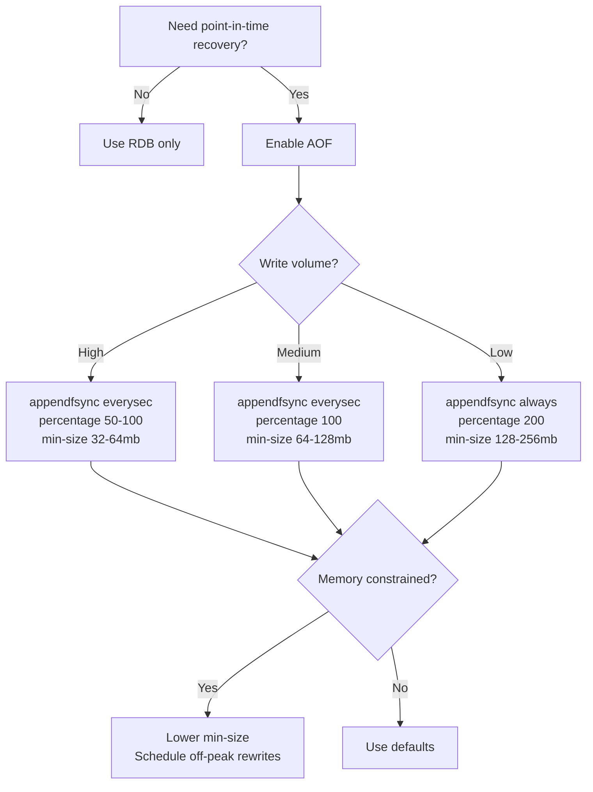

# How to Build Redis AOF Rewrite Strategies

Author: [nawazdhandala](https://github.com/nawazdhandala)

Tags: Redis, Persistence, AOF, Performance

Description: A practical guide to configuring and optimizing Redis AOF rewrite strategies for reliable persistence without killing performance.

---

Redis Append-Only File (AOF) persistence logs every write operation to disk, giving you point-in-time recovery. The catch? That file grows forever unless you manage rewrites. This guide covers how to configure automatic and manual AOF rewrites, tune the settings for your workload, and monitor the whole process.

## How AOF Rewrite Works

AOF logs every command that modifies data. Over time, this creates redundant entries. If you SET a key 1000 times, the AOF file contains 1000 SET commands, but only the last one matters. The rewrite process creates a new, compact AOF file that represents the current dataset state.



The rewrite happens in a child process using fork(). Redis continues serving requests while the child builds the new AOF file. Once complete, Redis swaps the files atomically.



## Enabling AOF Persistence

First, enable AOF in your Redis configuration:

```conf
# Enable AOF persistence
appendonly yes

# AOF filename
appendfilename "appendonly.aof"

# Directory for AOF files (Redis 7+)
appenddirname "appendonlydir"

# Sync policy: always, everysec, or no
appendfsync everysec
```

The `appendfsync` setting controls durability vs. performance:

| Setting | Behavior | Use Case |
|---------|----------|----------|
| `always` | Sync after every write | Maximum durability, slowest |
| `everysec` | Sync once per second | Good balance (default) |
| `no` | Let OS decide when to sync | Fastest, risk of data loss |

## Automatic Rewrite Configuration

Redis triggers automatic rewrites based on file growth. Configure these settings:

```conf
# Trigger rewrite when AOF is 100% larger than after last rewrite
auto-aof-rewrite-percentage 100

# Minimum AOF size to trigger rewrite (prevents rewrites on tiny files)
auto-aof-rewrite-min-size 64mb
```

### How the Trigger Works



The base size is the AOF size immediately after the last rewrite (or server start). With default settings:

- Base size after rewrite: 100MB
- Rewrite triggers at: 200MB (100% growth)
- New base size becomes the compacted file size

### Tuning for Different Workloads

**High-write workloads (caching, sessions):**

```conf
# More aggressive rewrites to keep file size manageable
auto-aof-rewrite-percentage 50
auto-aof-rewrite-min-size 32mb
```

**Low-write workloads (configuration store):**

```conf
# Less frequent rewrites since file grows slowly
auto-aof-rewrite-percentage 200
auto-aof-rewrite-min-size 128mb
```

**Memory-constrained systems:**

```conf
# Smaller threshold to avoid fork memory pressure
auto-aof-rewrite-percentage 100
auto-aof-rewrite-min-size 16mb
```

## Manual Rewrite Commands

Trigger a rewrite manually when you need control over timing:

```bash
# Trigger background rewrite
redis-cli BGREWRITEAOF

# Check if rewrite is in progress
redis-cli INFO persistence | grep aof_rewrite_in_progress

# Wait for rewrite to complete
while [ $(redis-cli INFO persistence | grep aof_rewrite_in_progress | cut -d: -f2 | tr -d '\r') -eq 1 ]; do
    echo "Rewrite in progress..."
    sleep 1
done
echo "Rewrite complete"
```

### Scheduling Rewrites During Low Traffic

Use cron to trigger rewrites during maintenance windows:

```bash
# /etc/cron.d/redis-aof-rewrite
# Run at 3 AM on Sundays when traffic is lowest
0 3 * * 0 redis redis-cli BGREWRITEAOF >> /var/log/redis/aof-rewrite.log 2>&1
```

Or use a script with traffic checks:

```bash
#!/bin/bash
# aof-rewrite-if-quiet.sh

# Get current ops/sec
OPS=$(redis-cli INFO stats | grep instantaneous_ops_per_sec | cut -d: -f2 | tr -d '\r')

# Only rewrite if traffic is below threshold
if [ "$OPS" -lt 100 ]; then
    redis-cli BGREWRITEAOF
    echo "$(date): Started AOF rewrite (ops/sec: $OPS)"
else
    echo "$(date): Skipped rewrite, traffic too high (ops/sec: $OPS)"
fi
```

## Preventing Rewrite Storms

When rewrite completes, the base size resets to the new compact file size. If your write rate is high, this can trigger immediate rewrites repeatedly. Prevent this with proper tuning:

```conf
# Increase percentage to reduce frequency
auto-aof-rewrite-percentage 150

# Raise minimum size threshold
auto-aof-rewrite-min-size 256mb

# Disable automatic rewrites entirely (manual only)
auto-aof-rewrite-percentage 0
```

## Handling Rewrite During High Memory Usage

The fork() system call creates a copy-on-write child process. During heavy writes, memory usage can spike. Configure these safeguards:

```conf
# Don't rewrite if saving RDB would fail
no-appendfsync-on-rewrite yes

# Stop accepting writes if AOF rewrite fails
aof-load-truncated yes

# Use incremental fsync during rewrite (Redis 7+)
aof-rewrite-incremental-fsync yes
```

### Memory Overcommit Settings

On Linux, configure memory overcommit to prevent fork failures:

```bash
# Allow overcommit (recommended for Redis)
echo 1 > /proc/sys/vm/overcommit_memory

# Or add to /etc/sysctl.conf
echo "vm.overcommit_memory = 1" >> /etc/sysctl.conf
sysctl -p
```

## Monitoring AOF Rewrites

### Key Metrics to Track

```bash
# Get AOF statistics
redis-cli INFO persistence
```

Important fields:

| Metric | Description |
|--------|-------------|
| `aof_enabled` | AOF is on (1) or off (0) |
| `aof_rewrite_in_progress` | Rewrite currently running |
| `aof_rewrite_scheduled` | Rewrite will start after RDB save |
| `aof_last_rewrite_time_sec` | Duration of last rewrite |
| `aof_current_rewrite_time_sec` | Duration of current rewrite (if running) |
| `aof_last_bgrewrite_status` | ok or err |
| `aof_current_size` | Current AOF file size |
| `aof_base_size` | Size after last rewrite |

### Prometheus Monitoring

Export Redis metrics and create alerts:

```yaml
# prometheus-rules.yml
groups:
  - name: redis-aof
    rules:
      - alert: RedisAOFRewriteFailed
        expr: redis_aof_last_bgrewrite_status == 0
        for: 5m
        labels:
          severity: critical
        annotations:
          summary: "Redis AOF rewrite failed"

      - alert: RedisAOFTooLarge
        expr: redis_aof_current_size_bytes > 10737418240  # 10GB
        for: 10m
        labels:
          severity: warning
        annotations:
          summary: "Redis AOF file exceeds 10GB"

      - alert: RedisAOFRewriteTooSlow
        expr: redis_aof_current_rewrite_time_sec > 300  # 5 minutes
        for: 1m
        labels:
          severity: warning
        annotations:
          summary: "Redis AOF rewrite running over 5 minutes"
```

### OneUptime Integration

Send AOF metrics to OneUptime for observability:

```bash
#!/bin/bash
# redis-aof-metrics.sh

AOF_SIZE=$(redis-cli INFO persistence | grep aof_current_size | cut -d: -f2 | tr -d '\r')
AOF_BASE=$(redis-cli INFO persistence | grep aof_base_size | cut -d: -f2 | tr -d '\r')
REWRITE_STATUS=$(redis-cli INFO persistence | grep aof_last_bgrewrite_status | cut -d: -f2 | tr -d '\r')

# Calculate growth percentage
if [ "$AOF_BASE" -gt 0 ]; then
    GROWTH=$(echo "scale=2; ($AOF_SIZE - $AOF_BASE) * 100 / $AOF_BASE" | bc)
else
    GROWTH=0
fi

echo "aof_current_size: $AOF_SIZE"
echo "aof_base_size: $AOF_BASE"
echo "aof_growth_percent: $GROWTH"
echo "aof_last_rewrite_status: $REWRITE_STATUS"
```

## Redis 7+ Multi-Part AOF

Redis 7 introduced multi-part AOF files, which improves rewrite reliability:



The manifest file tracks which base and incremental files are active. During rewrite:

1. New base file is created
2. New incremental file starts receiving writes
3. Old files are removed after successful rewrite

Configuration for Redis 7+:

```conf
# Use RDB preamble for faster loading (default in Redis 7)
aof-use-rdb-preamble yes

# Timestamp annotations for point-in-time recovery
aof-timestamp-enabled yes
```

## Troubleshooting Common Issues

### Rewrite Never Completes

Check if BGSAVE is blocking:

```bash
redis-cli INFO persistence | grep -E "(rdb_bgsave|aof_rewrite)"
```

If both are scheduled, BGSAVE takes priority. Wait or disable RDB:

```conf
save ""
```

### Fork Fails with Memory Error

Check system memory and overcommit:

```bash
# Check available memory
free -h

# Check overcommit setting
cat /proc/sys/vm/overcommit_memory

# Check Redis memory usage
redis-cli INFO memory | grep used_memory_human
```

### AOF File Corrupted

Repair with redis-check-aof:

```bash
# Check and repair AOF
redis-check-aof --fix appendonly.aof

# For Redis 7+ multi-part AOF
redis-check-aof --fix appendonlydir/appendonly.aof.manifest
```

### Rewrite Takes Too Long

Large datasets take longer to rewrite. Options:

1. Increase rewrite percentage to trigger less often
2. Schedule rewrites during low traffic
3. Use RDB preamble for faster base file creation
4. Consider RDB-only persistence for very large datasets

## Production Configuration Example

```conf
# AOF Settings
appendonly yes
appendfilename "appendonly.aof"
appenddirname "appendonlydir"
appendfsync everysec

# Rewrite triggers
auto-aof-rewrite-percentage 100
auto-aof-rewrite-min-size 128mb

# Safety settings
no-appendfsync-on-rewrite yes
aof-load-truncated yes
aof-rewrite-incremental-fsync yes

# Redis 7+ features
aof-use-rdb-preamble yes
aof-timestamp-enabled yes
```

## Decision Guide



---

AOF rewrite is the mechanism that keeps your persistence file from growing unbounded. Get the configuration right for your workload, monitor the metrics, and test your recovery procedures. The time to find out your AOF strategy has problems is not during an outage.
