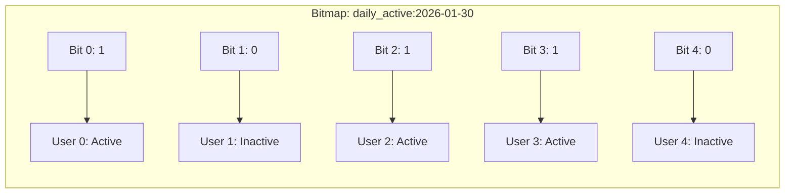
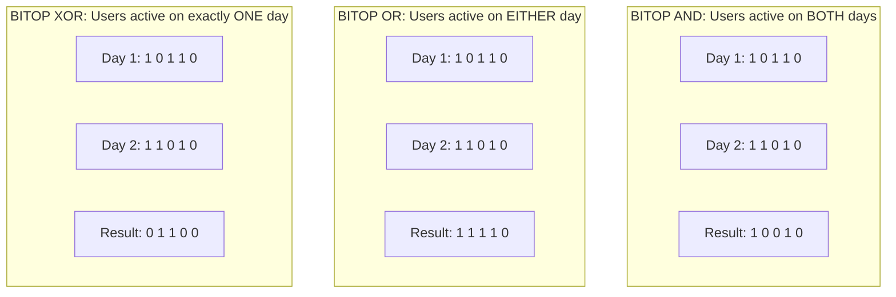
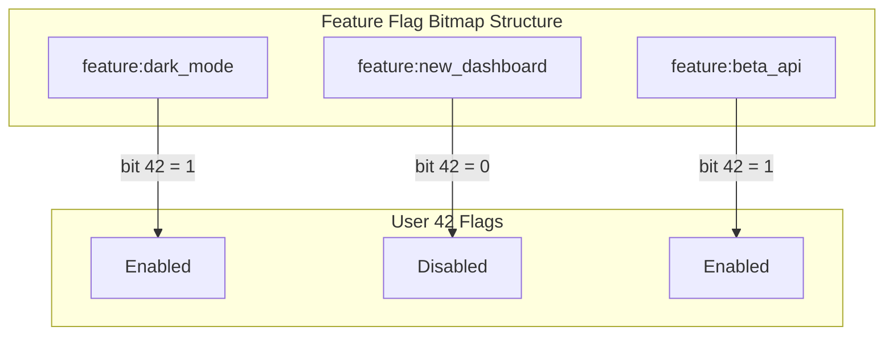

# How to Implement Redis Bitmap Operations Advanced

Author: [nawazdhandala](https://github.com/nawazdhandala)

Tags: Redis, Bitmap, Analytics, Performance

Description: A deep dive into Redis bitmap operations for building memory-efficient user tracking, feature flags, and real-time analytics systems.

---

> Bitmaps let you store millions of boolean states in a few megabytes. When you need to track "did user X do action Y on day Z" across millions of users, bitmaps are often the answer.

Redis bitmaps are not a separate data type. They are strings that Redis lets you manipulate at the bit level. A single Redis string can hold up to 512MB, which means you can address over 4 billion bits in a single key. This makes bitmaps perfect for:

- Daily active user (DAU) tracking
- Feature flag rollouts
- Real-time analytics and cohort analysis
- Presence detection systems
- Bloom filter implementations

This guide covers the core bitmap commands with practical examples, performance considerations, and architectural patterns you can apply today.

---

## Table of Contents

1. Understanding Bitmaps in Redis
2. Core Commands: SETBIT, GETBIT, BITCOUNT
3. Combining Bitmaps with BITOP
4. User Activity Tracking System
5. Feature Flags at Scale
6. Real-Time Analytics Dashboard
7. Memory Optimization Strategies
8. Performance Benchmarks
9. Common Pitfalls and Solutions

---

## 1. Understanding Bitmaps in Redis

A bitmap is fundamentally a string where each bit position represents a boolean value. Think of it as a giant array of 0s and 1s.

```
Position:  0 1 2 3 4 5 6 7 8 9 10 11 12 ...
Value:     1 0 1 1 0 0 1 0 0 1  0  1  0 ...
```

Each position can map to something meaningful in your application:
- Position = User ID (for tracking user states)
- Position = Feature ID (for feature availability)
- Position = Minute offset (for time-series booleans)



Memory efficiency comparison:

| Data Structure | 1M Users | 10M Users | 100M Users |
|---------------|----------|-----------|------------|
| Bitmap | 125 KB | 1.25 MB | 12.5 MB |
| Set (storing IDs) | ~8 MB | ~80 MB | ~800 MB |
| Hash | ~16 MB | ~160 MB | ~1.6 GB |

Bitmaps win when you have dense data (many entries) and boolean values.

---

## 2. Core Commands: SETBIT, GETBIT, BITCOUNT

### SETBIT

Sets or clears the bit at a specific offset. Returns the original bit value.

```bash
# Syntax: SETBIT key offset value
# value must be 0 or 1

# Mark user 42 as active today
SETBIT daily_active:2026-01-30 42 1

# Returns: 0 (the previous value at that position)
```

```javascript
// Node.js example
const Redis = require('ioredis');
const redis = new Redis();

async function markUserActive(userId, date) {
    const key = `daily_active:${date}`;
    const previousValue = await redis.setbit(key, userId, 1);
    return previousValue === 0; // true if this is first activity today
}

// Usage
const isFirstActivity = await markUserActive(42, '2026-01-30');
console.log(isFirstActivity ? 'Welcome back!' : 'Already active today');
```

### GETBIT

Retrieves the bit value at a specific offset. Returns 0 if the bit was never set.

```bash
# Syntax: GETBIT key offset

# Check if user 42 was active today
GETBIT daily_active:2026-01-30 42
# Returns: 1

# Check user who was never active
GETBIT daily_active:2026-01-30 999999
# Returns: 0 (default for unset bits)
```

```javascript
async function isUserActive(userId, date) {
    const key = `daily_active:${date}`;
    const bit = await redis.getbit(key, userId);
    return bit === 1;
}

// Batch check multiple users
async function getActiveUsers(userIds, date) {
    const key = `daily_active:${date}`;
    const pipeline = redis.pipeline();

    userIds.forEach(id => pipeline.getbit(key, id));

    const results = await pipeline.exec();
    return userIds.filter((_, index) => results[index][1] === 1);
}
```

### BITCOUNT

Counts the number of set bits (1s) in a string. Optionally within a byte range.

```bash
# Count all active users today
BITCOUNT daily_active:2026-01-30
# Returns: 847293 (number of users who were active)

# Count bits in byte range [0, 100] (first 808 bit positions)
BITCOUNT daily_active:2026-01-30 0 100
```

```javascript
async function countActiveUsers(date) {
    const key = `daily_active:${date}`;
    return await redis.bitcount(key);
}

// Count active users for a date range
async function countActiveUsersRange(startDate, endDate) {
    const dates = getDateRange(startDate, endDate);
    const pipeline = redis.pipeline();

    dates.forEach(date => {
        pipeline.bitcount(`daily_active:${date}`);
    });

    const results = await pipeline.exec();
    return dates.map((date, index) => ({
        date,
        count: results[index][1]
    }));
}
```

---

## 3. Combining Bitmaps with BITOP

BITOP performs bitwise operations between multiple bitmaps and stores the result. This is where bitmaps become powerful for analytics.

```bash
# Syntax: BITOP operation destkey key [key ...]
# Operations: AND, OR, XOR, NOT
```



### AND Operation: Intersection

Find users who were active on multiple specific days.

```javascript
async function getUsersActiveAllDays(dates) {
    const keys = dates.map(date => `daily_active:${date}`);
    const resultKey = `temp:active_all:${Date.now()}`;

    await redis.bitop('AND', resultKey, ...keys);
    const count = await redis.bitcount(resultKey);

    // Clean up temp key
    await redis.expire(resultKey, 60);

    return count;
}

// Users active every day this week
const weeklyActiveCount = await getUsersActiveAllDays([
    '2026-01-24', '2026-01-25', '2026-01-26',
    '2026-01-27', '2026-01-28', '2026-01-29', '2026-01-30'
]);
```

### OR Operation: Union

Find users who were active on any of the specified days.

```javascript
async function getMonthlyActiveUsers(year, month) {
    const daysInMonth = new Date(year, month, 0).getDate();
    const keys = [];

    for (let day = 1; day <= daysInMonth; day++) {
        const date = `${year}-${String(month).padStart(2, '0')}-${String(day).padStart(2, '0')}`;
        keys.push(`daily_active:${date}`);
    }

    const resultKey = `monthly_active:${year}-${month}`;
    await redis.bitop('OR', resultKey, ...keys);

    return await redis.bitcount(resultKey);
}
```

### XOR Operation: Symmetric Difference

Find users who changed their activity state between days.

```javascript
async function getChurnedUsers(date1, date2) {
    // Users who were active on date1 but not date2
    const activeDay1 = `daily_active:${date1}`;
    const activeDay2 = `daily_active:${date2}`;
    const tempXor = `temp:xor:${Date.now()}`;
    const tempChurn = `temp:churn:${Date.now()}`;

    // XOR gives users active on exactly one day
    await redis.bitop('XOR', tempXor, activeDay1, activeDay2);

    // AND with day1 gives users active day1 but not day2
    await redis.bitop('AND', tempChurn, tempXor, activeDay1);

    const churnedCount = await redis.bitcount(tempChurn);

    // Cleanup
    await redis.del(tempXor, tempChurn);

    return churnedCount;
}
```

### NOT Operation: Complement

Find users who were NOT active.

```javascript
async function getInactiveUsers(date, totalUsers) {
    const activeKey = `daily_active:${date}`;
    const inactiveKey = `temp:inactive:${Date.now()}`;

    // Ensure bitmap covers all user IDs
    await redis.setbit(activeKey, totalUsers - 1, 0);

    await redis.bitop('NOT', inactiveKey, activeKey);
    const inactiveCount = await redis.bitcount(inactiveKey);

    await redis.del(inactiveKey);

    return inactiveCount;
}
```

---

## 4. User Activity Tracking System

Here is a complete implementation for tracking user activity with retention analytics.

```javascript
class UserActivityTracker {
    constructor(redis) {
        this.redis = redis;
    }

    // Track user activity
    async trackActivity(userId, activityType = 'visit') {
        const today = this.getDateKey();
        const hour = new Date().getHours();

        const pipeline = this.redis.pipeline();

        // Daily activity
        pipeline.setbit(`activity:daily:${today}`, userId, 1);

        // Hourly activity (for peak hours analysis)
        pipeline.setbit(`activity:hourly:${today}:${hour}`, userId, 1);

        // Activity type specific
        pipeline.setbit(`activity:${activityType}:${today}`, userId, 1);

        // Rolling 7-day window (for quick WAU)
        pipeline.setbit(`activity:week:${this.getWeekKey()}`, userId, 1);

        await pipeline.exec();
    }

    // Daily Active Users
    async getDAU(date = this.getDateKey()) {
        return await this.redis.bitcount(`activity:daily:${date}`);
    }

    // Weekly Active Users (last 7 days)
    async getWAU() {
        const dates = this.getLastNDays(7);
        const keys = dates.map(d => `activity:daily:${d}`);
        const resultKey = `temp:wau:${Date.now()}`;

        await this.redis.bitop('OR', resultKey, ...keys);
        const count = await this.redis.bitcount(resultKey);
        await this.redis.del(resultKey);

        return count;
    }

    // Monthly Active Users
    async getMAU() {
        const dates = this.getLastNDays(30);
        const keys = dates.map(d => `activity:daily:${d}`);
        const resultKey = `temp:mau:${Date.now()}`;

        await this.redis.bitop('OR', resultKey, ...keys);
        const count = await this.redis.bitcount(resultKey);
        await this.redis.del(resultKey);

        return count;
    }

    // Retention: users active on day X who returned on day Y
    async getRetention(startDate, returnDate) {
        const startKey = `activity:daily:${startDate}`;
        const returnKey = `activity:daily:${returnDate}`;
        const resultKey = `temp:retention:${Date.now()}`;

        await this.redis.bitop('AND', resultKey, startKey, returnKey);

        const retained = await this.redis.bitcount(resultKey);
        const original = await this.redis.bitcount(startKey);

        await this.redis.del(resultKey);

        return {
            retained,
            original,
            rate: original > 0 ? (retained / original * 100).toFixed(2) : 0
        };
    }

    // Cohort retention matrix
    async getCohortRetention(cohortDate, days = 7) {
        const retention = [];

        for (let i = 0; i <= days; i++) {
            const checkDate = this.addDays(cohortDate, i);
            const result = await this.getRetention(cohortDate, checkDate);
            retention.push({
                day: i,
                date: checkDate,
                ...result
            });
        }

        return retention;
    }

    // Peak hours analysis
    async getPeakHours(date) {
        const hours = [];

        for (let hour = 0; hour < 24; hour++) {
            const count = await this.redis.bitcount(
                `activity:hourly:${date}:${hour}`
            );
            hours.push({ hour, count });
        }

        return hours.sort((a, b) => b.count - a.count);
    }

    // Helper methods
    getDateKey(date = new Date()) {
        return date.toISOString().split('T')[0];
    }

    getWeekKey(date = new Date()) {
        const startOfYear = new Date(date.getFullYear(), 0, 1);
        const weekNum = Math.ceil((date - startOfYear) / (7 * 24 * 60 * 60 * 1000));
        return `${date.getFullYear()}-W${weekNum}`;
    }

    getLastNDays(n) {
        const dates = [];
        for (let i = 0; i < n; i++) {
            const date = new Date();
            date.setDate(date.getDate() - i);
            dates.push(this.getDateKey(date));
        }
        return dates;
    }

    addDays(dateStr, days) {
        const date = new Date(dateStr);
        date.setDate(date.getDate() + days);
        return this.getDateKey(date);
    }
}

// Usage
const tracker = new UserActivityTracker(redis);

// Track activity
await tracker.trackActivity(12345, 'login');

// Get metrics
console.log('DAU:', await tracker.getDAU());
console.log('WAU:', await tracker.getWAU());
console.log('MAU:', await tracker.getMAU());

// Retention analysis
const retention = await tracker.getCohortRetention('2026-01-01', 7);
console.log('7-day retention:', retention);
```

---

## 5. Feature Flags at Scale

Bitmaps excel at feature flag systems where you need to check flags for millions of users with minimal latency.



```javascript
class FeatureFlagService {
    constructor(redis) {
        this.redis = redis;
        this.prefix = 'feature:';
    }

    // Enable feature for a user
    async enableForUser(featureName, userId) {
        await this.redis.setbit(`${this.prefix}${featureName}`, userId, 1);
    }

    // Disable feature for a user
    async disableForUser(featureName, userId) {
        await this.redis.setbit(`${this.prefix}${featureName}`, userId, 0);
    }

    // Check if feature is enabled for user
    async isEnabled(featureName, userId) {
        const bit = await this.redis.getbit(`${this.prefix}${featureName}`, userId);
        return bit === 1;
    }

    // Get all enabled features for a user (batch check)
    async getEnabledFeatures(userId, featureNames) {
        const pipeline = this.redis.pipeline();

        featureNames.forEach(name => {
            pipeline.getbit(`${this.prefix}${name}`, userId);
        });

        const results = await pipeline.exec();

        return featureNames.filter((_, index) => results[index][1] === 1);
    }

    // Percentage rollout
    async enablePercentageRollout(featureName, percentage, maxUserId) {
        const targetCount = Math.floor(maxUserId * (percentage / 100));

        // Generate random user IDs to enable
        const userIds = new Set();
        while (userIds.size < targetCount) {
            userIds.add(Math.floor(Math.random() * maxUserId));
        }

        const pipeline = this.redis.pipeline();
        userIds.forEach(id => {
            pipeline.setbit(`${this.prefix}${featureName}`, id, 1);
        });

        await pipeline.exec();

        return targetCount;
    }

    // Gradual rollout based on user ID hash
    async isEnabledWithRollout(featureName, userId, percentage) {
        // Deterministic rollout based on user ID
        const hash = this.hashUserId(userId, featureName);
        const threshold = Math.floor(percentage * 100);

        return hash < threshold;
    }

    // Count users with feature enabled
    async getEnabledCount(featureName) {
        return await this.redis.bitcount(`${this.prefix}${featureName}`);
    }

    // Copy feature flags to a new feature (for A/B test variants)
    async copyFeature(sourceFeature, targetFeature) {
        const sourceKey = `${this.prefix}${sourceFeature}`;
        const targetKey = `${this.prefix}${targetFeature}`;

        await this.redis.copy(sourceKey, targetKey);
    }

    // Get users in feature A but not in feature B
    async getExclusiveUsers(featureA, featureB) {
        const keyA = `${this.prefix}${featureA}`;
        const keyB = `${this.prefix}${featureB}`;
        const tempKey = `temp:exclusive:${Date.now()}`;

        // XOR to find differences, then AND with A
        const xorKey = `temp:xor:${Date.now()}`;
        await this.redis.bitop('XOR', xorKey, keyA, keyB);
        await this.redis.bitop('AND', tempKey, xorKey, keyA);

        const count = await this.redis.bitcount(tempKey);
        await this.redis.del(xorKey, tempKey);

        return count;
    }

    hashUserId(userId, salt) {
        // Simple deterministic hash for rollout
        const str = `${userId}:${salt}`;
        let hash = 0;
        for (let i = 0; i < str.length; i++) {
            hash = ((hash << 5) - hash) + str.charCodeAt(i);
            hash = hash & hash;
        }
        return Math.abs(hash) % 10000;
    }
}

// Usage
const flags = new FeatureFlagService(redis);

// Enable feature for specific users
await flags.enableForUser('new_checkout', 12345);
await flags.enableForUser('new_checkout', 67890);

// Check in application
if (await flags.isEnabled('new_checkout', userId)) {
    // Show new checkout
} else {
    // Show old checkout
}

// 10% rollout
await flags.enablePercentageRollout('dark_mode', 10, 1000000);

// Batch check (single round trip)
const userFeatures = await flags.getEnabledFeatures(userId, [
    'dark_mode', 'new_dashboard', 'beta_api', 'export_v2'
]);
```

---

## 6. Real-Time Analytics Dashboard

Build a real-time analytics system that tracks events and provides instant insights.

```javascript
class RealTimeAnalytics {
    constructor(redis) {
        this.redis = redis;
    }

    // Track page view
    async trackPageView(userId, page) {
        const minute = this.getMinuteKey();
        const hour = this.getHourKey();
        const day = this.getDayKey();

        const pipeline = this.redis.pipeline();

        // Unique visitors per minute (for real-time dashboard)
        pipeline.setbit(`analytics:visitors:minute:${minute}`, userId, 1);
        pipeline.expire(`analytics:visitors:minute:${minute}`, 3600); // 1 hour TTL

        // Unique visitors per hour
        pipeline.setbit(`analytics:visitors:hour:${hour}`, userId, 1);
        pipeline.expire(`analytics:visitors:hour:${hour}`, 86400 * 2); // 2 day TTL

        // Unique visitors per day
        pipeline.setbit(`analytics:visitors:day:${day}`, userId, 1);
        pipeline.expire(`analytics:visitors:day:${day}`, 86400 * 90); // 90 day TTL

        // Page-specific tracking
        pipeline.setbit(`analytics:page:${page}:${day}`, userId, 1);

        await pipeline.exec();
    }

    // Track conversion event
    async trackConversion(userId, conversionType) {
        const day = this.getDayKey();

        await this.redis.setbit(
            `analytics:conversion:${conversionType}:${day}`,
            userId,
            1
        );
    }

    // Get real-time visitors (last N minutes)
    async getRealTimeVisitors(minutes = 5) {
        const keys = [];
        const now = new Date();

        for (let i = 0; i < minutes; i++) {
            const d = new Date(now.getTime() - i * 60000);
            keys.push(`analytics:visitors:minute:${this.getMinuteKey(d)}`);
        }

        // Filter out non-existent keys
        const existingKeys = [];
        for (const key of keys) {
            if (await this.redis.exists(key)) {
                existingKeys.push(key);
            }
        }

        if (existingKeys.length === 0) return 0;

        const resultKey = `temp:realtime:${Date.now()}`;
        await this.redis.bitop('OR', resultKey, ...existingKeys);
        const count = await this.redis.bitcount(resultKey);
        await this.redis.del(resultKey);

        return count;
    }

    // Funnel analysis
    async analyzeFunnel(steps, date) {
        const results = [];
        let previousKey = null;

        for (const step of steps) {
            const stepKey = `analytics:${step}:${date}`;
            let count;

            if (previousKey) {
                // Users who did this step AND previous step
                const tempKey = `temp:funnel:${Date.now()}`;
                await this.redis.bitop('AND', tempKey, previousKey, stepKey);
                count = await this.redis.bitcount(tempKey);
                await this.redis.del(tempKey);
            } else {
                count = await this.redis.bitcount(stepKey);
            }

            results.push({
                step,
                count,
                dropoff: results.length > 0
                    ? ((results[results.length - 1].count - count) / results[results.length - 1].count * 100).toFixed(2)
                    : 0
            });

            previousKey = stepKey;
        }

        return results;
    }

    // Conversion rate: users who converted / users who visited
    async getConversionRate(conversionType, date) {
        const visitorsKey = `analytics:visitors:day:${date}`;
        const conversionKey = `analytics:conversion:${conversionType}:${date}`;
        const tempKey = `temp:converted:${Date.now()}`;

        await this.redis.bitop('AND', tempKey, visitorsKey, conversionKey);

        const converted = await this.redis.bitcount(tempKey);
        const visitors = await this.redis.bitcount(visitorsKey);

        await this.redis.del(tempKey);

        return {
            visitors,
            converted,
            rate: visitors > 0 ? (converted / visitors * 100).toFixed(2) : 0
        };
    }

    // Compare two segments
    async compareSegments(segmentA, segmentB, metric, date) {
        const metricKey = `analytics:${metric}:${date}`;
        const segmentAKey = `segment:${segmentA}`;
        const segmentBKey = `segment:${segmentB}`;

        const tempA = `temp:seg_a:${Date.now()}`;
        const tempB = `temp:seg_b:${Date.now()}`;

        await this.redis.bitop('AND', tempA, metricKey, segmentAKey);
        await this.redis.bitop('AND', tempB, metricKey, segmentBKey);

        const countA = await this.redis.bitcount(tempA);
        const countB = await this.redis.bitcount(tempB);

        await this.redis.del(tempA, tempB);

        return {
            [segmentA]: countA,
            [segmentB]: countB,
            difference: countA - countB,
            ratio: countB > 0 ? (countA / countB).toFixed(2) : 'N/A'
        };
    }

    // Helper methods
    getMinuteKey(date = new Date()) {
        return `${date.toISOString().slice(0, 16).replace('T', ':')}`;
    }

    getHourKey(date = new Date()) {
        return `${date.toISOString().slice(0, 13)}`;
    }

    getDayKey(date = new Date()) {
        return date.toISOString().split('T')[0];
    }
}

// Usage
const analytics = new RealTimeAnalytics(redis);

// Track events
await analytics.trackPageView(userId, 'homepage');
await analytics.trackPageView(userId, 'pricing');
await analytics.trackConversion(userId, 'signup');

// Real-time dashboard
console.log('Active now:', await analytics.getRealTimeVisitors(5));

// Funnel analysis
const funnel = await analytics.analyzeFunnel([
    'page:homepage',
    'page:pricing',
    'page:checkout',
    'conversion:purchase'
], '2026-01-30');
console.log('Funnel:', funnel);

// Conversion rate
const conversion = await analytics.getConversionRate('purchase', '2026-01-30');
console.log('Conversion:', conversion);
```

---

## 7. Memory Optimization Strategies

### Sparse vs Dense Data

Bitmaps are efficient for dense data. If you have 10 million users but only 1000 are active, a Set might be better.

```javascript
async function chooseDataStructure(expectedActiveCount, maxUserId) {
    // Bitmap: maxUserId / 8 bytes
    const bitmapSize = maxUserId / 8;

    // Set: ~64 bytes per member (pointer + object overhead + value)
    const setSize = expectedActiveCount * 64;

    if (bitmapSize < setSize) {
        return 'bitmap';
    }
    return 'set';
}

// Threshold: bitmap wins when density > 0.1% (roughly)
// 10M users * 0.1% = 10K active users threshold
```

### Key Sharding for Very Large Datasets

When dealing with billions of users, shard across multiple keys.

```javascript
class ShardedBitmap {
    constructor(redis, prefix, shardSize = 100000000) {
        this.redis = redis;
        this.prefix = prefix;
        this.shardSize = shardSize;
    }

    getShardKey(offset) {
        const shard = Math.floor(offset / this.shardSize);
        return `${this.prefix}:shard:${shard}`;
    }

    getShardOffset(offset) {
        return offset % this.shardSize;
    }

    async setbit(offset, value) {
        const key = this.getShardKey(offset);
        const localOffset = this.getShardOffset(offset);
        return await this.redis.setbit(key, localOffset, value);
    }

    async getbit(offset) {
        const key = this.getShardKey(offset);
        const localOffset = this.getShardOffset(offset);
        return await this.redis.getbit(key, localOffset);
    }

    async bitcount() {
        const keys = await this.redis.keys(`${this.prefix}:shard:*`);
        let total = 0;

        for (const key of keys) {
            total += await this.redis.bitcount(key);
        }

        return total;
    }
}
```

### Compression with TTL Strategy

```javascript
async function compressOldBitmaps(redis, prefix, daysToKeep, daysToCompress) {
    const now = new Date();

    // Compress daily bitmaps into weekly
    for (let i = daysToCompress; i < daysToKeep; i++) {
        const date = new Date(now);
        date.setDate(date.getDate() - i);
        const dateKey = date.toISOString().split('T')[0];
        const weekKey = getWeekKey(date);

        const dailyKey = `${prefix}:daily:${dateKey}`;
        const weeklyKey = `${prefix}:weekly:${weekKey}`;

        if (await redis.exists(dailyKey)) {
            // Merge into weekly
            await redis.bitop('OR', weeklyKey, weeklyKey, dailyKey);
            // Delete daily
            await redis.del(dailyKey);
        }
    }
}
```

---

## 8. Performance Benchmarks

Typical performance characteristics on a modern server:

| Operation | 1M bits | 10M bits | 100M bits |
|-----------|---------|----------|-----------|
| SETBIT | ~0.01ms | ~0.01ms | ~0.01ms |
| GETBIT | ~0.01ms | ~0.01ms | ~0.01ms |
| BITCOUNT | ~0.5ms | ~5ms | ~50ms |
| BITOP AND (2 keys) | ~1ms | ~10ms | ~100ms |
| BITOP OR (7 keys) | ~3ms | ~30ms | ~300ms |

```javascript
// Benchmark script
async function benchmark(redis) {
    const iterations = 10000;
    const maxOffset = 10000000;

    // SETBIT benchmark
    let start = Date.now();
    for (let i = 0; i < iterations; i++) {
        await redis.setbit('bench:setbit', Math.floor(Math.random() * maxOffset), 1);
    }
    console.log(`SETBIT: ${(Date.now() - start) / iterations}ms avg`);

    // GETBIT benchmark
    start = Date.now();
    for (let i = 0; i < iterations; i++) {
        await redis.getbit('bench:setbit', Math.floor(Math.random() * maxOffset));
    }
    console.log(`GETBIT: ${(Date.now() - start) / iterations}ms avg`);

    // BITCOUNT benchmark
    start = Date.now();
    for (let i = 0; i < 100; i++) {
        await redis.bitcount('bench:setbit');
    }
    console.log(`BITCOUNT: ${(Date.now() - start) / 100}ms avg`);

    // Cleanup
    await redis.del('bench:setbit');
}
```

---

## 9. Common Pitfalls and Solutions

### Pitfall 1: Large Offset Allocation

Setting a bit at a very high offset allocates all the intermediate memory.

```javascript
// BAD: This allocates 125MB!
await redis.setbit('test', 1000000000, 1);

// GOOD: Use hashing or sharding for sparse high IDs
function hashUserId(userId) {
    // Map large IDs to smaller space
    return userId % 10000000;
}
```

### Pitfall 2: BITOP on Mismatched Sizes

BITOP extends all keys to match the longest one.

```javascript
// If key1 is 1MB and key2 is 10MB, result will be 10MB
// Be aware of this for memory planning
```

### Pitfall 3: Forgetting Key Expiration

```javascript
// BAD: Keys accumulate forever
await redis.setbit(`daily:${date}`, userId, 1);

// GOOD: Set TTL
await redis.setbit(`daily:${date}`, userId, 1);
await redis.expire(`daily:${date}`, 86400 * 90); // 90 days
```

### Pitfall 4: Not Using Pipeline for Batch Operations

```javascript
// BAD: N round trips
for (const id of userIds) {
    await redis.setbit(key, id, 1);
}

// GOOD: Single round trip
const pipeline = redis.pipeline();
for (const id of userIds) {
    pipeline.setbit(key, id, 1);
}
await pipeline.exec();
```

### Pitfall 5: BITCOUNT Byte Range Confusion

```javascript
// BITCOUNT range is in BYTES, not bits
// To count bits 0-99, you need bytes 0-12 (100 bits = 12.5 bytes)
await redis.bitcount(key, 0, 12);

// Use BITCOUNT without range for full count
await redis.bitcount(key);
```

---

## Summary

Redis bitmaps provide an elegant solution for tracking boolean states across massive datasets. Key takeaways:

| Use Case | Primary Commands | Memory Efficiency |
|----------|-----------------|-------------------|
| User activity tracking | SETBIT, BITCOUNT, BITOP OR | Excellent for dense data |
| Feature flags | SETBIT, GETBIT | Excellent |
| Real-time analytics | SETBIT, BITOP AND/OR | Excellent |
| Cohort analysis | BITOP AND, BITCOUNT | Good with proper TTL |

Start with simple daily activity tracking, measure your density ratios, and expand to more complex analytics as your needs grow. Bitmaps shine when you have millions of boolean values and need sub-millisecond lookups.

---

**Related Reading:**

- [Redis Data Types Documentation](https://redis.io/docs/data-types/bitmaps/)
- [Building Real-time Analytics with Redis](https://oneuptime.com/blog)
- [Performance Monitoring with OneUptime](https://oneuptime.com)

---

*Need to monitor your Redis performance? OneUptime provides real-time metrics, alerting, and dashboards for your Redis infrastructure. Track bitmap operation latencies, memory usage, and key patterns to keep your analytics running smoothly.*
