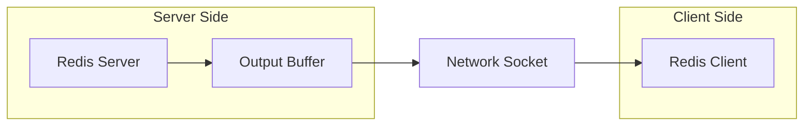
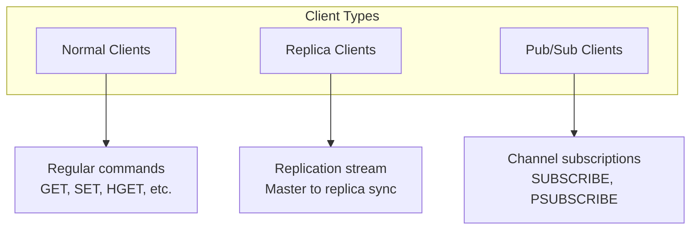
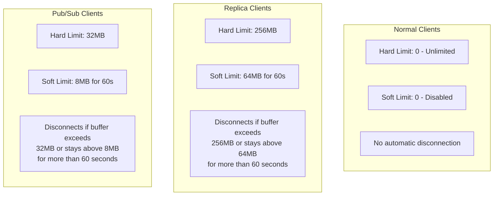
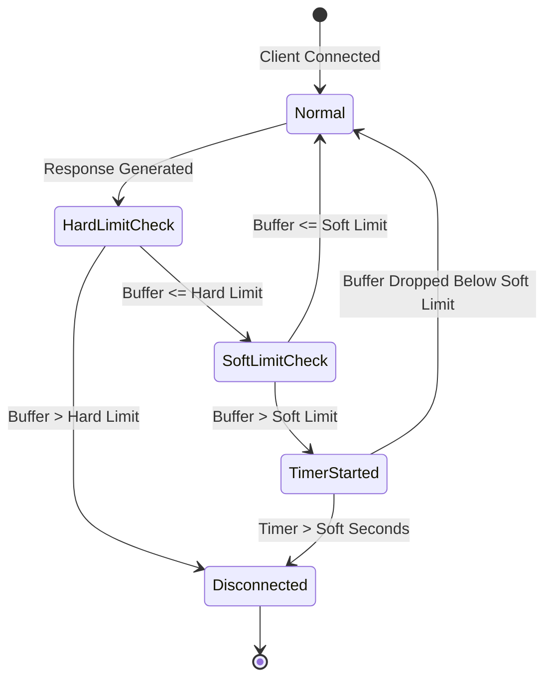
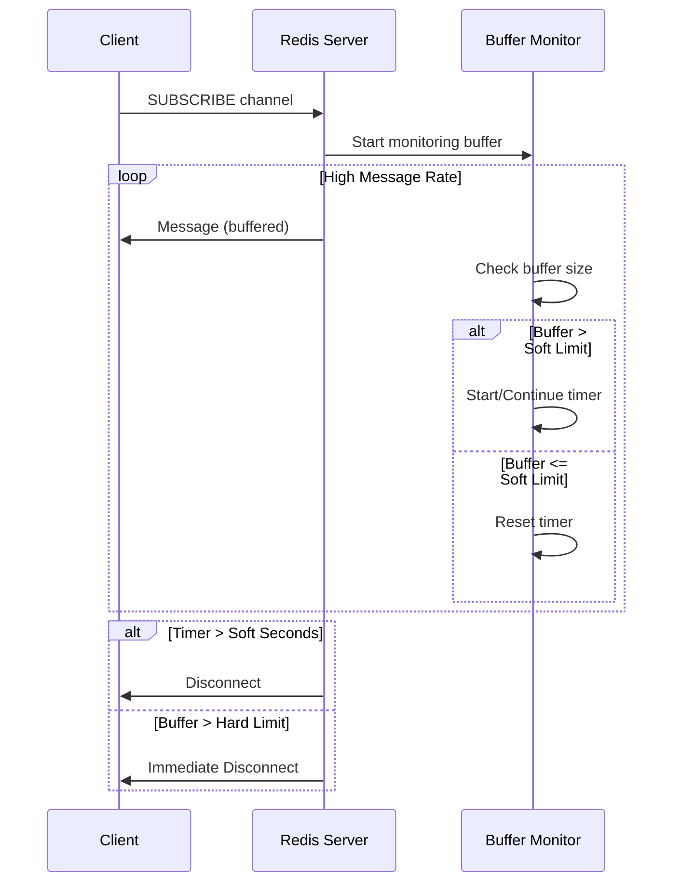
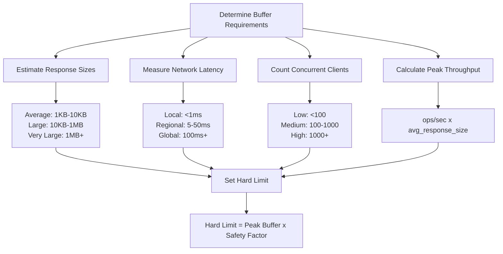

# How to Create Redis Client Output Buffer Management

Author: [nawazdhandala](https://github.com/nawazdhandala)

Tags: Redis, Client Buffer, Connection Management, Memory

Description: Learn to manage Redis client output buffers with limits configuration, monitoring, and tuning for different client types.

---

## Introduction

Redis client output buffers are memory areas that hold data waiting to be sent to connected clients. When a client cannot read data fast enough, or when large responses are generated, these buffers can grow significantly and potentially exhaust server memory. Understanding and properly configuring output buffer limits is essential for maintaining a stable and performant Redis deployment.

This guide covers the fundamentals of client output buffer management, including configuration options, monitoring techniques, and best practices for different client types.

## Understanding Client Output Buffers

Every client connection to Redis has an associated output buffer. When Redis executes a command and generates a response, that response is first written to the client's output buffer before being sent over the network.



### Why Buffers Matter

Output buffers can grow unbounded in several scenarios:

1. **Slow consumers** - Clients that read data slower than Redis produces it
2. **Large responses** - Commands like `KEYS *` or `SMEMBERS` on large sets
3. **Pub/Sub backlog** - Subscribers that cannot keep up with message rates
4. **Replication lag** - Replica servers falling behind the master

Without proper limits, a single misbehaving client can consume all available memory and crash the Redis server.

## Client Types in Redis

Redis categorizes clients into three types, each with independent buffer limit configurations:



### Normal Clients

Normal clients are standard connections that execute Redis commands. This includes application clients using libraries like redis-py, Jedis, or node-redis.

### Replica Clients

Replica clients are Redis servers configured as replicas that receive the replication stream from a master. These connections typically require larger buffers to handle the continuous flow of write operations.

### Pub/Sub Clients

Pub/Sub clients are connections that have subscribed to one or more channels or patterns. These clients can accumulate messages quickly if they cannot process them fast enough.

## Configuring Buffer Limits

Redis provides the `client-output-buffer-limit` directive to control buffer behavior. The syntax is:

```
client-output-buffer-limit <class> <hard limit> <soft limit> <soft seconds>
```

### Parameters Explained

| Parameter | Description |
|-----------|-------------|
| class | Client type: normal, replica, or pubsub |
| hard limit | Maximum buffer size - client disconnected immediately when exceeded |
| soft limit | Threshold that triggers a timer |
| soft seconds | Duration the soft limit can be exceeded before disconnection |

### Default Configuration

```redis
# Default Redis configuration
client-output-buffer-limit normal 0 0 0
client-output-buffer-limit replica 256mb 64mb 60
client-output-buffer-limit pubsub 32mb 8mb 60
```

Let's break down what these defaults mean:



## Setting Buffer Limits

### Via Configuration File

Edit your `redis.conf` file:

```redis
# Strict limits for normal clients
client-output-buffer-limit normal 64mb 32mb 10

# Larger limits for replicas to handle replication bursts
client-output-buffer-limit replica 512mb 128mb 60

# Moderate limits for pub/sub
client-output-buffer-limit pubsub 64mb 16mb 60
```

### Via Runtime Command

Use the `CONFIG SET` command to modify limits without restarting:

```redis
# Set limits for normal clients
CONFIG SET client-output-buffer-limit "normal 64mb 32mb 10"

# Set limits for replica clients
CONFIG SET client-output-buffer-limit "replica 512mb 128mb 60"

# Set limits for pub/sub clients
CONFIG SET client-output-buffer-limit "pubsub 64mb 16mb 60"
```

### Python Example - Checking Current Limits

```python
import redis

def get_buffer_limits(client):
    """Retrieve current client output buffer limits."""
    config = client.config_get('client-output-buffer-limit')
    limits = config.get('client-output-buffer-limit', '')

    print("Current buffer limits:")
    print(f"  {limits}")

    return limits

def set_buffer_limits(client, client_class, hard_limit, soft_limit, soft_seconds):
    """Set client output buffer limits for a specific client class."""
    limit_string = f"{client_class} {hard_limit} {soft_limit} {soft_seconds}"
    client.config_set('client-output-buffer-limit', limit_string)
    print(f"Set buffer limits: {limit_string}")

# Connect to Redis
r = redis.Redis(host='localhost', port=6379, decode_responses=True)

# Get current limits
get_buffer_limits(r)

# Set new limits for normal clients
set_buffer_limits(r, 'normal', '64mb', '32mb', '10')
```

## Monitoring Buffer Usage

### Using CLIENT LIST

The `CLIENT LIST` command provides detailed information about connected clients, including buffer usage:

```redis
CLIENT LIST
```

Example output:

```
id=5 addr=127.0.0.1:52342 fd=8 name= age=120 idle=0 flags=N db=0 sub=0 psub=0 multi=-1 qbuf=26 qbuf-free=32742 obl=0 oll=0 omem=0 events=r cmd=client
```

Key buffer-related fields:

| Field | Description |
|-------|-------------|
| qbuf | Query buffer size (input) |
| qbuf-free | Free space in query buffer |
| obl | Output buffer length (fixed buffer) |
| oll | Output list length (reply list) |
| omem | Output buffer memory usage |

### Python Monitoring Script

```python
import redis
import time

def monitor_client_buffers(client, threshold_mb=10):
    """Monitor client output buffers and alert on high usage."""
    threshold_bytes = threshold_mb * 1024 * 1024

    while True:
        clients = client.client_list()

        for c in clients:
            omem = int(c.get('omem', 0))
            client_id = c.get('id')
            addr = c.get('addr')
            flags = c.get('flags')

            if omem > threshold_bytes:
                print(f"WARNING: High buffer usage detected!")
                print(f"  Client ID: {client_id}")
                print(f"  Address: {addr}")
                print(f"  Flags: {flags}")
                print(f"  Buffer Memory: {omem / 1024 / 1024:.2f} MB")
                print()

        time.sleep(5)

# Connect and start monitoring
r = redis.Redis(host='localhost', port=6379, decode_responses=True)
monitor_client_buffers(r, threshold_mb=10)
```

### Using INFO Command

The `INFO clients` section provides aggregate statistics:

```redis
INFO clients
```

Output includes:

```
# Clients
connected_clients:10
client_recent_max_input_buffer:2
client_recent_max_output_buffer:0
blocked_clients:0
```

## Disconnection Behavior

Understanding when and how Redis disconnects clients is crucial for debugging connection issues.



### Hard Limit Disconnection

When a client's output buffer exceeds the hard limit, Redis immediately closes the connection. This is a protective measure to prevent memory exhaustion.

```python
import redis
import logging

logging.basicConfig(level=logging.INFO)
logger = logging.getLogger(__name__)

def safe_execute_large_command(client, command_func):
    """Execute a command that might produce large output safely."""
    try:
        result = command_func()
        return result
    except redis.ConnectionError as e:
        logger.error(f"Connection lost - possible buffer limit exceeded: {e}")
        return None
    except redis.ResponseError as e:
        logger.error(f"Redis error: {e}")
        return None

# Example usage
r = redis.Redis(host='localhost', port=6379, decode_responses=True)

# This might trigger disconnection if the set is very large
result = safe_execute_large_command(r, lambda: r.smembers('very_large_set'))
```

### Soft Limit Disconnection

The soft limit provides a grace period. If the buffer stays above the soft limit for longer than the specified seconds, the client is disconnected.



## Best Practices by Client Type

### Normal Clients

For normal clients, consider the size of your typical responses:

```redis
# If your application uses large data structures
client-output-buffer-limit normal 128mb 64mb 30

# For applications with small, frequent operations
client-output-buffer-limit normal 32mb 16mb 10

# Disable limits only in controlled environments
client-output-buffer-limit normal 0 0 0
```

### Replica Clients

Replicas need generous limits to handle replication bursts, especially during:

- Initial synchronization
- Recovery after network issues
- High write throughput periods

```redis
# Production recommendation for busy masters
client-output-buffer-limit replica 1gb 256mb 120

# Smaller deployments
client-output-buffer-limit replica 256mb 64mb 60
```

### Pub/Sub Clients

Pub/Sub clients are particularly vulnerable to buffer accumulation:

```python
import redis
import time
import threading

class SafePubSubClient:
    """A pub/sub client with built-in buffer awareness."""

    def __init__(self, host='localhost', port=6379):
        self.client = redis.Redis(host=host, port=port)
        self.pubsub = self.client.pubsub()
        self.running = False

    def subscribe(self, channels, message_handler):
        """Subscribe to channels with a fast message handler."""
        self.pubsub.subscribe(**{ch: message_handler for ch in channels})
        self.running = True

        # Process messages in a dedicated thread
        def process_messages():
            while self.running:
                message = self.pubsub.get_message(timeout=0.1)
                if message and message['type'] == 'message':
                    try:
                        # Process quickly to avoid buffer buildup
                        message_handler(message)
                    except Exception as e:
                        print(f"Error processing message: {e}")

        self.thread = threading.Thread(target=process_messages, daemon=True)
        self.thread.start()

    def unsubscribe(self):
        """Clean unsubscribe to prevent buffer issues."""
        self.running = False
        self.pubsub.unsubscribe()
        self.pubsub.close()

# Usage example
def handle_message(message):
    """Process messages quickly."""
    data = message['data']
    # Fast processing here
    print(f"Received: {data}")

client = SafePubSubClient()
client.subscribe(['notifications', 'updates'], handle_message)
```

## Tuning for High-Throughput Scenarios

### Calculating Buffer Requirements

Consider these factors when setting limits:



### Example Configuration for Different Scenarios

```redis
# Web Application - Many clients, small responses
client-output-buffer-limit normal 16mb 8mb 10
client-output-buffer-limit replica 256mb 64mb 60
client-output-buffer-limit pubsub 32mb 8mb 60

# Analytics Platform - Few clients, large responses
client-output-buffer-limit normal 256mb 128mb 30
client-output-buffer-limit replica 512mb 128mb 120
client-output-buffer-limit pubsub 64mb 16mb 60

# Real-time Messaging - High pub/sub throughput
client-output-buffer-limit normal 32mb 16mb 10
client-output-buffer-limit replica 256mb 64mb 60
client-output-buffer-limit pubsub 128mb 32mb 30

# Caching Layer - Mixed workload
client-output-buffer-limit normal 64mb 32mb 15
client-output-buffer-limit replica 256mb 64mb 60
client-output-buffer-limit pubsub 32mb 8mb 60
```

## Handling Buffer-Related Disconnections

### Implementing Reconnection Logic

```python
import redis
import time
import logging
from functools import wraps

logging.basicConfig(level=logging.INFO)
logger = logging.getLogger(__name__)

class ResilientRedisClient:
    """Redis client with automatic reconnection handling."""

    def __init__(self, host='localhost', port=6379, max_retries=3, retry_delay=1):
        self.host = host
        self.port = port
        self.max_retries = max_retries
        self.retry_delay = retry_delay
        self.client = None
        self.connect()

    def connect(self):
        """Establish connection to Redis."""
        self.client = redis.Redis(
            host=self.host,
            port=self.port,
            decode_responses=True,
            socket_keepalive=True,
            socket_timeout=30
        )
        logger.info(f"Connected to Redis at {self.host}:{self.port}")

    def execute_with_retry(self, func, *args, **kwargs):
        """Execute a Redis command with retry logic."""
        last_error = None

        for attempt in range(self.max_retries):
            try:
                return func(*args, **kwargs)
            except redis.ConnectionError as e:
                last_error = e
                logger.warning(f"Connection error (attempt {attempt + 1}): {e}")
                time.sleep(self.retry_delay * (attempt + 1))
                self.connect()
            except redis.TimeoutError as e:
                last_error = e
                logger.warning(f"Timeout error (attempt {attempt + 1}): {e}")
                time.sleep(self.retry_delay)

        raise last_error

    def get(self, key):
        return self.execute_with_retry(self.client.get, key)

    def set(self, key, value):
        return self.execute_with_retry(self.client.set, key, value)

    def smembers_safe(self, key, chunk_size=1000):
        """Safely retrieve large sets using SSCAN to avoid buffer issues."""
        members = set()
        cursor = 0

        while True:
            cursor, chunk = self.execute_with_retry(
                self.client.sscan, key, cursor, count=chunk_size
            )
            members.update(chunk)
            if cursor == 0:
                break

        return members

# Usage
client = ResilientRedisClient()
```

### Avoiding Large Responses

Instead of commands that return large datasets, use iterative approaches:

```python
import redis

def scan_keys_safely(client, pattern='*', batch_size=100):
    """
    Iterate through keys matching a pattern without overwhelming buffers.
    Prefer this over KEYS command.
    """
    cursor = 0
    while True:
        cursor, keys = client.scan(cursor, match=pattern, count=batch_size)
        for key in keys:
            yield key
        if cursor == 0:
            break

def get_large_hash_safely(client, key, batch_size=100):
    """
    Retrieve a large hash incrementally using HSCAN.
    Prefer this over HGETALL for large hashes.
    """
    cursor = 0
    result = {}

    while True:
        cursor, data = client.hscan(key, cursor, count=batch_size)
        result.update(data)
        if cursor == 0:
            break

    return result

def get_large_list_safely(client, key, batch_size=100):
    """
    Retrieve a large list incrementally using LRANGE.
    Prefer this over LRANGE 0 -1 for large lists.
    """
    result = []
    start = 0

    while True:
        chunk = client.lrange(key, start, start + batch_size - 1)
        if not chunk:
            break
        result.extend(chunk)
        start += batch_size

    return result

# Usage example
r = redis.Redis(host='localhost', port=6379, decode_responses=True)

# Safe iteration through keys
for key in scan_keys_safely(r, pattern='user:*'):
    print(f"Processing key: {key}")

# Safe retrieval of large hash
user_data = get_large_hash_safely(r, 'large_user_hash')
```

## Monitoring and Alerting

### Complete Monitoring Solution

```python
import redis
import time
import json
from datetime import datetime

class RedisBufferMonitor:
    """Comprehensive buffer monitoring for Redis."""

    def __init__(self, host='localhost', port=6379):
        self.client = redis.Redis(host=host, port=port, decode_responses=True)
        self.thresholds = {
            'normal': {'warning': 10 * 1024 * 1024, 'critical': 50 * 1024 * 1024},
            'replica': {'warning': 100 * 1024 * 1024, 'critical': 200 * 1024 * 1024},
            'pubsub': {'warning': 5 * 1024 * 1024, 'critical': 25 * 1024 * 1024}
        }

    def get_client_type(self, flags):
        """Determine client type from flags."""
        if 'S' in flags:
            return 'replica'
        elif 'P' in flags:
            return 'pubsub'
        return 'normal'

    def check_buffers(self):
        """Check all client buffers against thresholds."""
        alerts = []
        clients = self.client.client_list()

        for c in clients:
            omem = int(c.get('omem', 0))
            flags = c.get('flags', '')
            client_type = self.get_client_type(flags)
            threshold = self.thresholds.get(client_type, self.thresholds['normal'])

            status = 'ok'
            if omem >= threshold['critical']:
                status = 'critical'
            elif omem >= threshold['warning']:
                status = 'warning'

            if status != 'ok':
                alerts.append({
                    'timestamp': datetime.now().isoformat(),
                    'client_id': c.get('id'),
                    'address': c.get('addr'),
                    'type': client_type,
                    'buffer_mb': round(omem / 1024 / 1024, 2),
                    'status': status
                })

        return alerts

    def get_buffer_stats(self):
        """Get aggregate buffer statistics."""
        clients = self.client.client_list()

        stats = {
            'total_clients': len(clients),
            'total_buffer_mb': 0,
            'max_buffer_mb': 0,
            'by_type': {
                'normal': {'count': 0, 'total_buffer_mb': 0},
                'replica': {'count': 0, 'total_buffer_mb': 0},
                'pubsub': {'count': 0, 'total_buffer_mb': 0}
            }
        }

        for c in clients:
            omem = int(c.get('omem', 0))
            omem_mb = omem / 1024 / 1024
            flags = c.get('flags', '')
            client_type = self.get_client_type(flags)

            stats['total_buffer_mb'] += omem_mb
            stats['max_buffer_mb'] = max(stats['max_buffer_mb'], omem_mb)
            stats['by_type'][client_type]['count'] += 1
            stats['by_type'][client_type]['total_buffer_mb'] += omem_mb

        return stats

    def run(self, interval=10):
        """Run continuous monitoring."""
        print("Starting Redis buffer monitor...")

        while True:
            alerts = self.check_buffers()
            stats = self.get_buffer_stats()

            print(f"\n--- {datetime.now().isoformat()} ---")
            print(f"Total clients: {stats['total_clients']}")
            print(f"Total buffer: {stats['total_buffer_mb']:.2f} MB")
            print(f"Max buffer: {stats['max_buffer_mb']:.2f} MB")

            if alerts:
                print("\nALERTS:")
                for alert in alerts:
                    print(f"  [{alert['status'].upper()}] {alert['address']} "
                          f"({alert['type']}): {alert['buffer_mb']} MB")

            time.sleep(interval)

# Run the monitor
if __name__ == '__main__':
    monitor = RedisBufferMonitor()
    monitor.run()
```

## Summary

Effective client output buffer management is critical for Redis stability and performance. Key takeaways:

1. **Understand the three client types** - Normal, replica, and pub/sub clients have different buffer requirements and should be configured independently.

2. **Set appropriate limits** - Use hard limits to prevent memory exhaustion and soft limits with timeouts for graceful handling of temporary spikes.

3. **Monitor continuously** - Track buffer usage with `CLIENT LIST` and set up alerts before problems occur.

4. **Avoid large responses** - Use SCAN variants instead of commands that return entire collections.

5. **Implement resilient clients** - Build reconnection logic into your applications to handle buffer-related disconnections gracefully.

6. **Tune based on workload** - There is no one-size-fits-all configuration. Adjust limits based on your specific response sizes, client counts, and throughput requirements.

By following these practices, you can maintain stable Redis connections and prevent buffer-related outages in your production systems.

## Additional Resources

- [Redis Configuration Documentation](https://redis.io/docs/management/config/)
- [Redis CLIENT Command](https://redis.io/commands/client-list/)
- [Redis Pub/Sub Documentation](https://redis.io/docs/interact/pubsub/)
- [Redis Replication](https://redis.io/docs/management/replication/)
