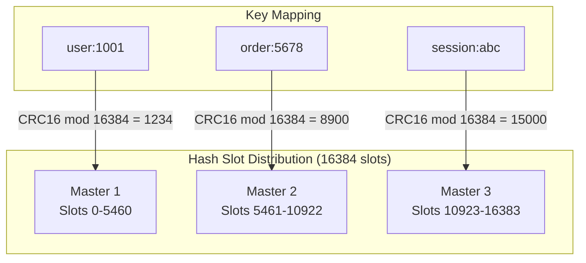
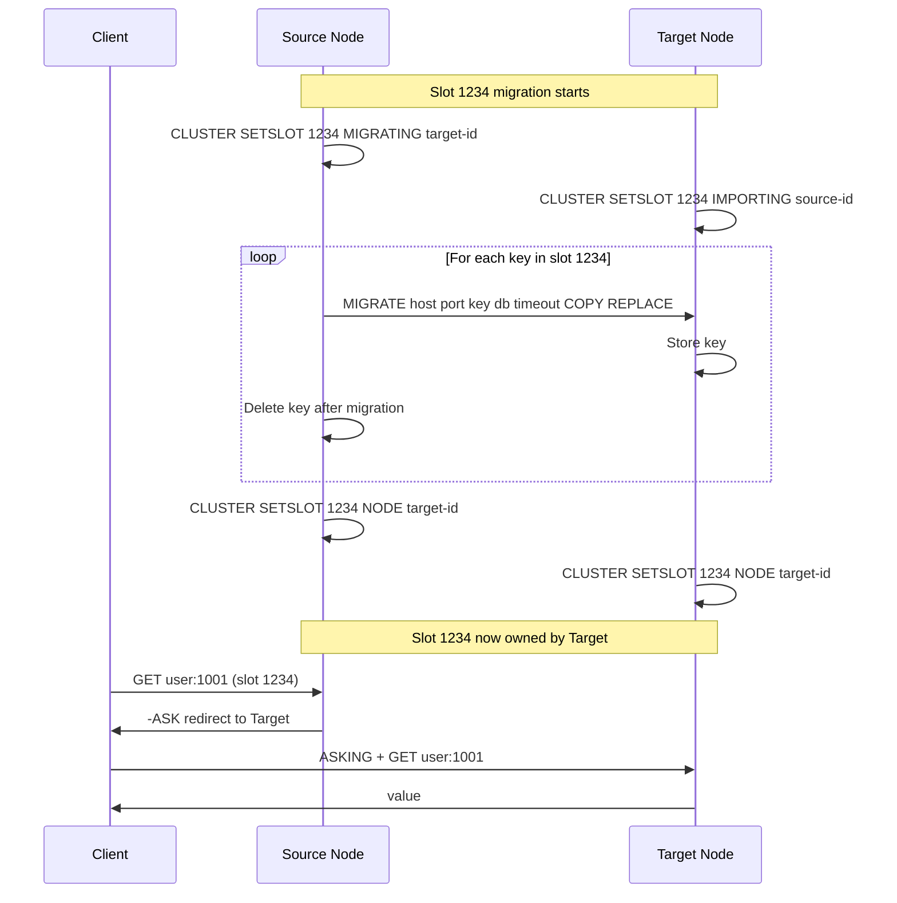
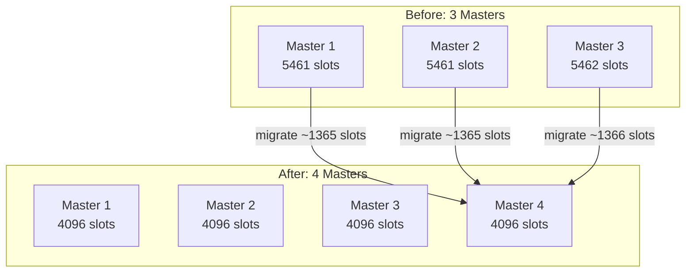

# How to Implement Redis Cluster Slot Migration

Author: [nawazdhandala](https://github.com/nawazdhandala)

Tags: Redis, Clustering, Migration, DevOps

Description: A practical guide to migrating hash slots between Redis Cluster nodes for scaling, rebalancing, and maintenance without downtime.

---

Redis Cluster distributes data across nodes using 16,384 hash slots. When you add nodes, remove nodes, or need to rebalance your cluster, you must migrate slots from one node to another. This guide covers the mechanics of slot migration, the commands involved, and strategies for resharding production clusters.

## How Redis Cluster Hash Slots Work

Redis Cluster uses hash slots to partition data. Every key is hashed using CRC16 and mapped to one of 16,384 slots (0-16383). Each master node owns a subset of these slots.



## Understanding Slot Migration

Slot migration moves hash slots from a source node to a target node. During migration, Redis handles the complexity of moving keys while keeping the cluster operational.



## Prerequisites

Before starting any migration, verify your cluster is healthy:

```bash
# Check cluster status and ensure all nodes are connected
redis-cli -c -h 127.0.0.1 -p 7000 cluster info

# Verify all slots are assigned and cluster state is ok
redis-cli -c -h 127.0.0.1 -p 7000 cluster nodes

# Check for any slots in migrating/importing state (should be empty)
redis-cli -c -h 127.0.0.1 -p 7000 cluster slots | grep -E "migrating|importing"
```

## Manual Slot Migration

### Step 1: Identify Source and Target Nodes

```bash
# List all nodes with their IDs and slot assignments
redis-cli -c -h 127.0.0.1 -p 7000 cluster nodes

# Output example:
# a1b2c3d4... 127.0.0.1:7000 master - 0 1234567890 1 connected 0-5460
# e5f6g7h8... 127.0.0.1:7001 master - 0 1234567890 2 connected 5461-10922
# i9j0k1l2... 127.0.0.1:7002 master - 0 1234567890 3 connected 10923-16383
```

Note down the node IDs. For this example:
- Source node: `a1b2c3d4...` (owns slots 0-5460)
- Target node: `e5f6g7h8...` (owns slots 5461-10922)

### Step 2: Set Slot to Migrating/Importing State

```bash
# On the TARGET node: mark slot as importing from source
redis-cli -h 127.0.0.1 -p 7001 \
  CLUSTER SETSLOT 100 IMPORTING a1b2c3d4e5f6g7h8i9j0k1l2m3n4o5p6

# On the SOURCE node: mark slot as migrating to target
redis-cli -h 127.0.0.1 -p 7000 \
  CLUSTER SETSLOT 100 MIGRATING e5f6g7h8i9j0k1l2m3n4o5p6q7r8s9t0
```

### Step 3: Get Keys in the Slot

```bash
# Get keys belonging to slot 100 on the source node
# Returns up to 100 keys at a time
redis-cli -h 127.0.0.1 -p 7000 CLUSTER GETKEYSINSLOT 100 100

# Count total keys in the slot
redis-cli -h 127.0.0.1 -p 7000 CLUSTER COUNTKEYSINSLOT 100
```

### Step 4: Migrate Keys

```bash
# Migrate each key from source to target
# COPY flag keeps the key on source until migration completes
# REPLACE flag overwrites if key exists on target
redis-cli -h 127.0.0.1 -p 7000 \
  MIGRATE 127.0.0.1 7001 "user:100" 0 5000 COPY REPLACE

# For multiple keys in one command (Redis 3.0.6+)
redis-cli -h 127.0.0.1 -p 7000 \
  MIGRATE 127.0.0.1 7001 "" 0 5000 COPY REPLACE KEYS key1 key2 key3
```

### Step 5: Finalize the Migration

```bash
# Notify ALL nodes about the new slot owner
# This must be done on every node in the cluster for consistency

# On each cluster node, run:
redis-cli -h 127.0.0.1 -p 7000 \
  CLUSTER SETSLOT 100 NODE e5f6g7h8i9j0k1l2m3n4o5p6q7r8s9t0

redis-cli -h 127.0.0.1 -p 7001 \
  CLUSTER SETSLOT 100 NODE e5f6g7h8i9j0k1l2m3n4o5p6q7r8s9t0

redis-cli -h 127.0.0.1 -p 7002 \
  CLUSTER SETSLOT 100 NODE e5f6g7h8i9j0k1l2m3n4o5p6q7r8s9t0
```

## Automated Migration with redis-cli

Redis provides built-in tools for resharding that handle all the complexity:

### Reshard Using redis-cli

```bash
# Interactive resharding
redis-cli --cluster reshard 127.0.0.1:7000

# The tool will ask:
# 1. How many slots to move
# 2. Target node ID
# 3. Source node IDs (or 'all' for even distribution)
```

### Non-Interactive Resharding

```bash
# Move 1000 slots from source to target automatically
redis-cli --cluster reshard 127.0.0.1:7000 \
  --cluster-from a1b2c3d4e5f6g7h8i9j0k1l2m3n4o5p6 \
  --cluster-to e5f6g7h8i9j0k1l2m3n4o5p6q7r8s9t0 \
  --cluster-slots 1000 \
  --cluster-yes
```

### Rebalance the Entire Cluster

```bash
# Automatically balance slots across all master nodes
redis-cli --cluster rebalance 127.0.0.1:7000

# Rebalance with a threshold (only move slots if imbalance exceeds 2%)
redis-cli --cluster rebalance 127.0.0.1:7000 --cluster-threshold 2

# Use weights to give some nodes more slots
redis-cli --cluster rebalance 127.0.0.1:7000 \
  --cluster-weight a1b2c3d4...=2 e5f6g7h8...=1
```

## Adding a New Node and Migrating Slots



### Step-by-Step Process

```bash
# 1. Start the new Redis node
redis-server --port 7003 --cluster-enabled yes \
  --cluster-config-file nodes-7003.conf

# 2. Add the new node to the cluster (as empty master)
redis-cli --cluster add-node 127.0.0.1:7003 127.0.0.1:7000

# 3. Check the new node was added (it has no slots yet)
redis-cli -c -h 127.0.0.1 -p 7000 cluster nodes | grep 7003

# 4. Reshard slots to the new node from all existing masters
redis-cli --cluster reshard 127.0.0.1:7000 \
  --cluster-from all \
  --cluster-to <new-node-id> \
  --cluster-slots 4096 \
  --cluster-yes

# 5. Verify the new distribution
redis-cli --cluster check 127.0.0.1:7000
```

## Removing a Node and Migrating Slots Away

```bash
# 1. Get the node ID of the node to remove
NODE_TO_REMOVE=$(redis-cli -h 127.0.0.1 -p 7003 cluster myid)

# 2. Reshard all slots away from the node
redis-cli --cluster reshard 127.0.0.1:7000 \
  --cluster-from $NODE_TO_REMOVE \
  --cluster-to <target-node-id> \
  --cluster-slots 4096 \
  --cluster-yes

# 3. Verify no slots remain on the node
redis-cli -h 127.0.0.1 -p 7003 cluster slots

# 4. Remove the empty node from the cluster
redis-cli --cluster del-node 127.0.0.1:7000 $NODE_TO_REMOVE
```

## Handling Migration Failures

### Fixing Stuck Migrations

If a migration is interrupted, slots can get stuck in MIGRATING or IMPORTING state:

```bash
# Check for stuck slots
redis-cli --cluster check 127.0.0.1:7000

# Fix stuck slots automatically
redis-cli --cluster fix 127.0.0.1:7000

# Force a specific slot to a node (use carefully)
redis-cli -h 127.0.0.1 -p 7000 CLUSTER SETSLOT 100 STABLE
```

### Migration Script with Error Handling

```bash
#!/bin/bash
# migrate-slot.sh - Safely migrate a single slot

SOURCE_HOST="127.0.0.1"
SOURCE_PORT="7000"
TARGET_HOST="127.0.0.1"
TARGET_PORT="7001"
SLOT=$1

if [ -z "$SLOT" ]; then
    echo "Usage: $0 <slot-number>"
    exit 1
fi

# Get node IDs
SOURCE_ID=$(redis-cli -h $SOURCE_HOST -p $SOURCE_PORT CLUSTER MYID)
TARGET_ID=$(redis-cli -h $TARGET_HOST -p $TARGET_PORT CLUSTER MYID)

echo "Migrating slot $SLOT from $SOURCE_ID to $TARGET_ID"

# Set slot states
redis-cli -h $TARGET_HOST -p $TARGET_PORT \
    CLUSTER SETSLOT $SLOT IMPORTING $SOURCE_ID || exit 1

redis-cli -h $SOURCE_HOST -p $SOURCE_PORT \
    CLUSTER SETSLOT $SLOT MIGRATING $TARGET_ID || exit 1

# Migrate all keys in the slot
while true; do
    KEYS=$(redis-cli -h $SOURCE_HOST -p $SOURCE_PORT \
        CLUSTER GETKEYSINSLOT $SLOT 100)

    if [ -z "$KEYS" ]; then
        echo "All keys migrated"
        break
    fi

    for KEY in $KEYS; do
        redis-cli -h $SOURCE_HOST -p $SOURCE_PORT \
            MIGRATE $TARGET_HOST $TARGET_PORT "$KEY" 0 5000 REPLACE

        if [ $? -ne 0 ]; then
            echo "Failed to migrate key: $KEY"
            exit 1
        fi
    done
done

# Finalize on all nodes
for PORT in 7000 7001 7002; do
    redis-cli -h 127.0.0.1 -p $PORT \
        CLUSTER SETSLOT $SLOT NODE $TARGET_ID
done

echo "Slot $SLOT migration complete"
```

## Monitoring Slot Migration

### Track Migration Progress

```bash
# Watch cluster state during migration
watch -n 1 'redis-cli --cluster check 127.0.0.1:7000 2>/dev/null | head -20'

# Count keys in specific slot during migration
watch -n 1 'redis-cli -h 127.0.0.1 -p 7000 CLUSTER COUNTKEYSINSLOT 100'

# Monitor Redis INFO during migration
redis-cli -h 127.0.0.1 -p 7000 INFO stats | grep -E "migrate|sync"
```

### Prometheus Metrics for Migration

```yaml
# Redis exporter metrics to track
- redis_cluster_slots_assigned
- redis_cluster_slots_ok
- redis_cluster_slots_pfail
- redis_cluster_slots_fail
- redis_cluster_known_nodes
- redis_cluster_size
```

## Best Practices for Production Migrations

### 1. Plan Your Migration Window


### 2. Estimate Migration Time

```bash
# Count total keys across slots to migrate
TOTAL_KEYS=0
for SLOT in $(seq 0 1000); do
    COUNT=$(redis-cli -h 127.0.0.1 -p 7000 CLUSTER COUNTKEYSINSLOT $SLOT)
    TOTAL_KEYS=$((TOTAL_KEYS + COUNT))
done
echo "Total keys to migrate: $TOTAL_KEYS"

# Rough estimate: 1000-5000 keys/second depending on key size and network
```

### 3. Use Pipeline Mode for Large Migrations

```bash
# The --cluster-pipeline option speeds up resharding
redis-cli --cluster reshard 127.0.0.1:7000 \
  --cluster-from a1b2c3d4... \
  --cluster-to e5f6g7h8... \
  --cluster-slots 1000 \
  --cluster-pipeline 100 \
  --cluster-yes
```

### 4. Monitor Client Redirects

During migration, clients receive ASK redirects for keys in migrating slots:

```bash
# Check client connection counts
redis-cli -h 127.0.0.1 -p 7000 CLIENT LIST | wc -l

# Monitor command latency during migration
redis-cli -h 127.0.0.1 -p 7000 --latency-history
```

## Slot Migration Gotchas

**Large Keys Block Migration**: Keys larger than a few MB can cause timeouts. Increase the timeout or migrate during low traffic:

```bash
# Increase timeout for large keys (30 seconds)
redis-cli -h 127.0.0.1 -p 7000 \
  MIGRATE 127.0.0.1 7001 "large-key" 0 30000 REPLACE
```

**Cluster Epoch Conflicts**: If nodes disagree about slot ownership, bump the epoch:

```bash
# Force the cluster to accept current configuration
redis-cli -h 127.0.0.1 -p 7000 CLUSTER BUMPEPOCH
```

**Replica Lag During Migration**: Ensure replicas are caught up before removing a node:

```bash
# Check replication offset
redis-cli -h 127.0.0.1 -p 7000 INFO replication
```

---

Slot migration is fundamental to operating Redis Cluster at scale. While the redis-cli tools handle most common scenarios, understanding the underlying SETSLOT, MIGRATE, and GETKEYSINSLOT commands helps you troubleshoot issues and build custom automation. Always verify cluster health before and after migration, and test your procedures in staging before touching production data.
