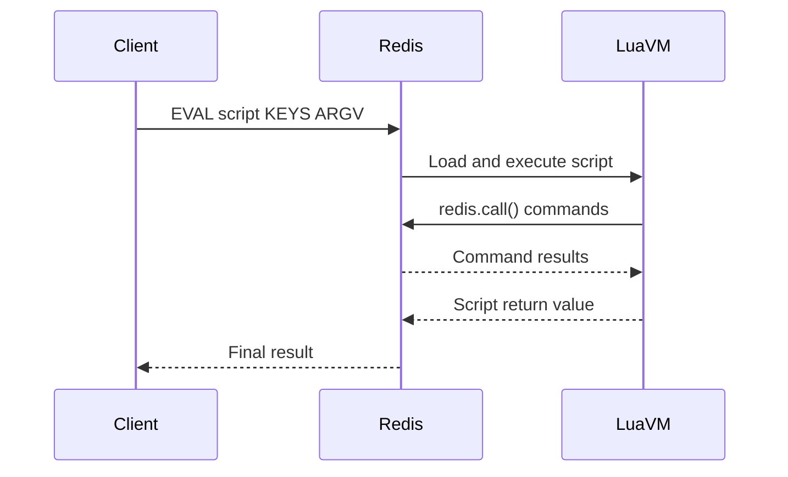
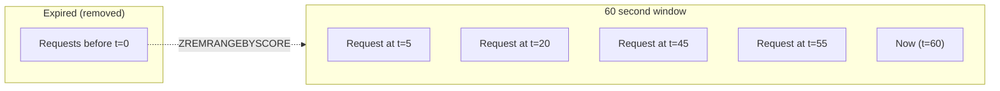
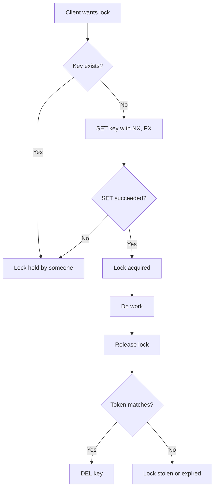

# How to Build Redis Custom Commands with Lua

Author: [nawazdhandala](https://github.com/nawazdhandala)

Tags: Redis, Lua, Performance, Database

Description: Learn to extend Redis with custom Lua scripts for atomic operations, rate limiting, custom aggregations, and more.

---

Redis ships with a powerful set of commands, but real-world applications often need operations that go beyond the basics. Instead of chaining multiple commands from your application (risking race conditions and network overhead), you can push custom logic directly into Redis using Lua scripting. This guide covers the fundamentals, practical patterns, and production-ready examples.

## Why Lua in Redis?

Redis executes Lua scripts atomically. While a script runs, no other command can interrupt it. This eliminates race conditions without requiring explicit locks or transactions.

| Benefit | How Lua Helps |
|---------|---------------|
| Atomicity | Entire script runs without interruption |
| Reduced latency | One round-trip instead of many |
| Complex logic | Conditionals, loops, calculations server-side |
| Reusability | Store scripts once, call by SHA hash |
| No race conditions | No other client can modify data mid-script |

## How Lua Scripts Execute in Redis



The Lua VM runs inside the Redis process. When you call `redis.call()` from Lua, it executes directly against the dataset without network overhead.

## EVAL vs EVALSHA

Redis provides two ways to run Lua scripts:

**EVAL sends the full script every time:**

```bash
EVAL "return redis.call('GET', KEYS[1])" 1 mykey
```

**EVALSHA sends only the SHA1 hash (after loading):**

```bash
# First, load the script
SCRIPT LOAD "return redis.call('GET', KEYS[1])"
# Returns: "a42059b356c875f0717db19a51f6aaa9161e77a0"

# Then call by hash
EVALSHA a42059b356c875f0717db19a51f6aaa9161e77a0 1 mykey
```

For production, always use EVALSHA. Load scripts at application startup and cache the SHA hashes.

## Script Structure Basics

Every Redis Lua script receives two arrays:

- `KEYS` - Redis keys the script will access
- `ARGV` - Additional arguments (values, counts, etc.)

This key-value passing convention for KEYS and ARGV is important. Redis uses it for cluster routing and replication. Always pass keys through KEYS, not hardcoded in the script.

**Basic script structure:**

```lua
-- KEYS[1] = the key to operate on
-- ARGV[1] = some value to use

local current = redis.call('GET', KEYS[1])
if current then
    return redis.call('SET', KEYS[1], current + ARGV[1])
else
    return redis.call('SET', KEYS[1], ARGV[1])
end
```

## Practical Example: Atomic Increment with Cap

This script increments a counter but caps it at a maximum value. Without Lua, you would need GET, check, then SET, which creates a race condition.

**Lua script for capped increment:**

```lua
-- KEYS[1] = counter key
-- ARGV[1] = increment amount
-- ARGV[2] = maximum allowed value

local current = tonumber(redis.call('GET', KEYS[1]) or 0)
local increment = tonumber(ARGV[1])
local max_value = tonumber(ARGV[2])

local new_value = current + increment

if new_value > max_value then
    new_value = max_value
end

redis.call('SET', KEYS[1], new_value)
return new_value
```

**Node.js implementation:**

```javascript
const Redis = require('ioredis');
const redis = new Redis();

const cappedIncrementScript = `
local current = tonumber(redis.call('GET', KEYS[1]) or 0)
local increment = tonumber(ARGV[1])
local max_value = tonumber(ARGV[2])

local new_value = current + increment

if new_value > max_value then
    new_value = max_value
end

redis.call('SET', KEYS[1], new_value)
return new_value
`;

// Define custom command
redis.defineCommand('cappedIncr', {
    numberOfKeys: 1,
    lua: cappedIncrementScript
});

// Usage
async function incrementUserScore(userId, points, maxScore) {
    const newScore = await redis.cappedIncr(
        `user:${userId}:score`,
        points,
        maxScore
    );
    return newScore;
}

// Example: increment by 50, cap at 1000
incrementUserScore('123', 50, 1000).then(console.log);
```

## Rate Limiting with Sliding Window

Rate limiting is a common use case where atomicity matters. This implementation uses the sliding window log algorithm.

**How the sliding window works:**



**Lua script for sliding window rate limiter:**

```lua
-- KEYS[1] = rate limit key (e.g., "ratelimit:user:123")
-- ARGV[1] = current timestamp (milliseconds)
-- ARGV[2] = window size (milliseconds)
-- ARGV[3] = max requests allowed in window

local key = KEYS[1]
local now = tonumber(ARGV[1])
local window = tonumber(ARGV[2])
local max_requests = tonumber(ARGV[3])

local window_start = now - window

-- Remove old entries outside the window
redis.call('ZREMRANGEBYSCORE', key, '-inf', window_start)

-- Count current requests in window
local current_requests = redis.call('ZCARD', key)

if current_requests < max_requests then
    -- Add this request with timestamp as score
    redis.call('ZADD', key, now, now .. ':' .. math.random())
    -- Set expiry on the key
    redis.call('PEXPIRE', key, window)
    return {1, max_requests - current_requests - 1}  -- allowed, remaining
else
    -- Get oldest entry to calculate retry time
    local oldest = redis.call('ZRANGE', key, 0, 0, 'WITHSCORES')
    local retry_after = 0
    if oldest[2] then
        retry_after = window - (now - tonumber(oldest[2]))
    end
    return {0, 0, retry_after}  -- denied, remaining, retry_after_ms
end
```

**Node.js rate limiter implementation:**

```javascript
const Redis = require('ioredis');
const redis = new Redis();

const rateLimitScript = `
local key = KEYS[1]
local now = tonumber(ARGV[1])
local window = tonumber(ARGV[2])
local max_requests = tonumber(ARGV[3])

local window_start = now - window

redis.call('ZREMRANGEBYSCORE', key, '-inf', window_start)

local current_requests = redis.call('ZCARD', key)

if current_requests < max_requests then
    redis.call('ZADD', key, now, now .. ':' .. math.random())
    redis.call('PEXPIRE', key, window)
    return {1, max_requests - current_requests - 1}
else
    local oldest = redis.call('ZRANGE', key, 0, 0, 'WITHSCORES')
    local retry_after = 0
    if oldest[2] then
        retry_after = window - (now - tonumber(oldest[2]))
    end
    return {0, 0, retry_after}
end
`;

redis.defineCommand('rateLimit', {
    numberOfKeys: 1,
    lua: rateLimitScript
});

async function checkRateLimit(identifier, windowMs, maxRequests) {
    const now = Date.now();
    const result = await redis.rateLimit(
        `ratelimit:${identifier}`,
        now,
        windowMs,
        maxRequests
    );

    return {
        allowed: result[0] === 1,
        remaining: result[1],
        retryAfter: result[2] || 0
    };
}

// Express middleware example
function rateLimitMiddleware(windowMs, maxRequests) {
    return async (req, res, next) => {
        const identifier = req.ip;
        const result = await checkRateLimit(identifier, windowMs, maxRequests);

        res.set('X-RateLimit-Remaining', result.remaining);

        if (!result.allowed) {
            res.set('Retry-After', Math.ceil(result.retryAfter / 1000));
            return res.status(429).json({ error: 'Too many requests' });
        }

        next();
    };
}
```

## Custom Aggregations

Sometimes you need to compute aggregations that Redis does not support natively. This script calculates a weighted moving average across multiple hash fields.

**Lua script for weighted average:**

```lua
-- KEYS[1..n] = hash keys containing values
-- ARGV[1..n] = weights for each key

local total_weight = 0
local weighted_sum = 0

for i, key in ipairs(KEYS) do
    local value = tonumber(redis.call('HGET', key, 'value') or 0)
    local weight = tonumber(ARGV[i] or 1)

    weighted_sum = weighted_sum + (value * weight)
    total_weight = total_weight + weight
end

if total_weight == 0 then
    return "0"
end

-- Return as string to preserve decimal precision
return tostring(weighted_sum / total_weight)
```

**More complex aggregation example: percentile calculation from a sorted set:**

```lua
-- KEYS[1] = sorted set key
-- ARGV[1] = percentile (0-100)

local key = KEYS[1]
local percentile = tonumber(ARGV[1])

local count = redis.call('ZCARD', key)

if count == 0 then
    return nil
end

-- Calculate the rank for the percentile
local rank = math.floor((percentile / 100) * count)
if rank == 0 then rank = 1 end
if rank > count then rank = count end

-- Get the value at that rank (0-indexed)
local result = redis.call('ZRANGE', key, rank - 1, rank - 1, 'WITHSCORES')

if result and result[2] then
    return result[2]
end

return nil
```

## Distributed Locking

A robust distributed lock implementation using Lua ensures the lock release is atomic and only releases if the current holder owns it.

**Lock acquisition and release flow:**



**Lua script for safe lock release:**

```lua
-- KEYS[1] = lock key
-- ARGV[1] = lock token (unique to this lock holder)

local key = KEYS[1]
local token = ARGV[1]

local current_token = redis.call('GET', key)

if current_token == token then
    return redis.call('DEL', key)
else
    return 0
end
```

**Full lock implementation in Node.js:**

```javascript
const Redis = require('ioredis');
const crypto = require('crypto');

const redis = new Redis();

const releaseLockScript = `
local key = KEYS[1]
local token = ARGV[1]

local current_token = redis.call('GET', key)

if current_token == token then
    return redis.call('DEL', key)
else
    return 0
end
`;

redis.defineCommand('releaseLock', {
    numberOfKeys: 1,
    lua: releaseLockScript
});

class DistributedLock {
    constructor(redis, lockKey, ttlMs = 10000) {
        this.redis = redis;
        this.lockKey = lockKey;
        this.ttlMs = ttlMs;
        this.token = null;
    }

    async acquire(retryCount = 3, retryDelayMs = 100) {
        this.token = crypto.randomBytes(16).toString('hex');

        for (let i = 0; i < retryCount; i++) {
            const result = await this.redis.set(
                this.lockKey,
                this.token,
                'PX', this.ttlMs,
                'NX'
            );

            if (result === 'OK') {
                return true;
            }

            await new Promise(r => setTimeout(r, retryDelayMs));
        }

        return false;
    }

    async release() {
        if (!this.token) return false;

        const result = await this.redis.releaseLock(
            this.lockKey,
            this.token
        );

        this.token = null;
        return result === 1;
    }

    async extend(additionalMs) {
        if (!this.token) return false;

        const script = `
            if redis.call('GET', KEYS[1]) == ARGV[1] then
                return redis.call('PEXPIRE', KEYS[1], ARGV[2])
            else
                return 0
            end
        `;

        const result = await this.redis.eval(
            script,
            1,
            this.lockKey,
            this.token,
            additionalMs
        );

        return result === 1;
    }
}

// Usage example
async function processWithLock(resourceId, work) {
    const lock = new DistributedLock(redis, `lock:${resourceId}`, 5000);

    if (await lock.acquire()) {
        try {
            return await work();
        } finally {
            await lock.release();
        }
    } else {
        throw new Error('Could not acquire lock');
    }
}
```

## Leaderboard with Composite Scores

Gaming and competitive applications often need leaderboards that rank by multiple criteria (score, then time). This script handles composite scoring.

**Lua script for leaderboard update:**

```lua
-- KEYS[1] = leaderboard sorted set
-- ARGV[1] = user id
-- ARGV[2] = score increment
-- ARGV[3] = current timestamp

local key = KEYS[1]
local user_id = ARGV[1]
local increment = tonumber(ARGV[2])
local timestamp = tonumber(ARGV[3])

-- Get current score or 0
local current = redis.call('ZSCORE', key, user_id)
local base_score = 0

if current then
    -- Extract the base score (integer part)
    base_score = math.floor(current)
end

local new_score = base_score + increment

-- Create composite score: integer score + fractional time component
-- Subtracting normalized time ensures earlier achievements rank higher
local max_timestamp = 9999999999999  -- far future timestamp
local time_component = (max_timestamp - timestamp) / max_timestamp

local composite_score = new_score + time_component

redis.call('ZADD', key, composite_score, user_id)

-- Return rank (1-indexed) and score
local rank = redis.call('ZREVRANK', key, user_id)
return {rank + 1, new_score}
```

## Inventory Reservation

E-commerce systems need atomic inventory checks and reservations. This script handles multi-item reservations with rollback on failure.

**Lua script for atomic inventory reservation:**

```lua
-- KEYS[1..n] = product inventory keys
-- ARGV[1..n] = quantities to reserve

-- First pass: check all inventory levels
for i, key in ipairs(KEYS) do
    local available = tonumber(redis.call('GET', key) or 0)
    local requested = tonumber(ARGV[i])

    if available < requested then
        return {0, key, available, requested}  -- failed, which key, available, requested
    end
end

-- Second pass: perform all decrements
local results = {}
for i, key in ipairs(KEYS) do
    local new_value = redis.call('DECRBY', key, ARGV[i])
    table.insert(results, {key, new_value})
end

return {1, results}  -- success, new inventory levels
```

**Node.js implementation:**

```javascript
const reserveInventoryScript = `
for i, key in ipairs(KEYS) do
    local available = tonumber(redis.call('GET', key) or 0)
    local requested = tonumber(ARGV[i])

    if available < requested then
        return {0, key, available, requested}
    end
end

local results = {}
for i, key in ipairs(KEYS) do
    local new_value = redis.call('DECRBY', key, ARGV[i])
    table.insert(results, {key, new_value})
end

return {1, cjson.encode(results)}
`;

async function reserveInventory(items) {
    // items = [{sku: 'ABC', quantity: 2}, {sku: 'XYZ', quantity: 1}]
    const keys = items.map(item => `inventory:${item.sku}`);
    const quantities = items.map(item => item.quantity);

    const result = await redis.eval(
        reserveInventoryScript,
        keys.length,
        ...keys,
        ...quantities
    );

    if (result[0] === 0) {
        return {
            success: false,
            failedSku: result[1].replace('inventory:', ''),
            available: result[2],
            requested: result[3]
        };
    }

    return {
        success: true,
        newLevels: JSON.parse(result[1])
    };
}
```

## Script Management in Production

**Loading scripts at startup:**

```javascript
const scripts = {
    rateLimit: { numberOfKeys: 1, lua: rateLimitScript },
    releaseLock: { numberOfKeys: 1, lua: releaseLockScript },
    reserveInventory: { numberOfKeys: -1, lua: reserveInventoryScript }
};

async function initializeScripts(redis) {
    for (const [name, config] of Object.entries(scripts)) {
        redis.defineCommand(name, config);
    }

    // Optionally pre-load scripts to get SHA hashes
    const loadPromises = Object.values(scripts).map(s =>
        redis.script('LOAD', s.lua)
    );

    const shas = await Promise.all(loadPromises);
    console.log('Scripts loaded:', shas);
}
```

**Handling NOSCRIPT errors:**

When Redis restarts, cached scripts are lost. Handle this gracefully:

```javascript
async function safeEvalSha(redis, sha, script, keys, args) {
    try {
        return await redis.evalsha(sha, keys.length, ...keys, ...args);
    } catch (err) {
        if (err.message.includes('NOSCRIPT')) {
            // Reload and retry
            await redis.script('LOAD', script);
            return await redis.eval(script, keys.length, ...keys, ...args);
        }
        throw err;
    }
}
```

## Debugging Lua Scripts

**Use redis.log for debugging:**

```lua
redis.log(redis.LOG_WARNING, "Current value: " .. tostring(current))
```

Log levels: `LOG_DEBUG`, `LOG_VERBOSE`, `LOG_NOTICE`, `LOG_WARNING`

**Test scripts in redis-cli:**

```bash
redis-cli EVAL "return redis.call('GET', KEYS[1])" 1 mykey
```

**Check script existence:**

```bash
redis-cli SCRIPT EXISTS <sha1> <sha2> ...
```

## Performance Considerations

| Practice | Why It Matters |
|----------|----------------|
| Keep scripts short | Long scripts block other operations |
| Avoid unbounded loops | Can cause Redis to hang |
| Use KEYS array properly | Required for cluster support |
| Cache SHA hashes | Avoids sending full script each time |
| Batch operations in one script | Reduces round-trips |

**Script time limits:**

Redis has a default `lua-time-limit` of 5 seconds. After this, the script can be killed with `SCRIPT KILL` (if no writes occurred) or `SHUTDOWN NOSAVE` (if writes occurred).

## Common Pitfalls

1. **Hardcoding keys in scripts** - Breaks cluster mode
2. **Using non-deterministic functions** - `TIME`, `math.random` with no seed
3. **Modifying KEYS/ARGV arrays** - Leads to unexpected behavior
4. **Infinite loops** - No built-in protection
5. **Large return values** - Memory overhead on client

## Summary

| Use Case | Why Lua Helps |
|----------|---------------|
| Rate limiting | Atomic check-and-increment |
| Distributed locks | Safe acquire and release |
| Inventory management | Multi-key atomic operations |
| Leaderboards | Complex scoring calculations |
| Caching with logic | Conditional updates, transformations |
| Custom aggregations | Server-side computation |

Lua scripting transforms Redis from a simple key-value store into a programmable data platform. The atomic execution guarantee eliminates entire categories of race conditions, while server-side execution reduces network round-trips. Start with simple scripts for your most common multi-step operations and expand from there.

---

**Related Reading:**

- [How to Implement Rate Limiting in Node.js Without External Services](https://oneuptime.com/blog/post/2026-01-06-nodejs-rate-limiting-no-external-services/view)
- [When Performance Matters, Skip the ORM](https://oneuptime.com/blog/post/2025-11-13-when-performance-matters-skip-the-orm/view)
