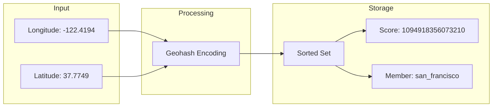
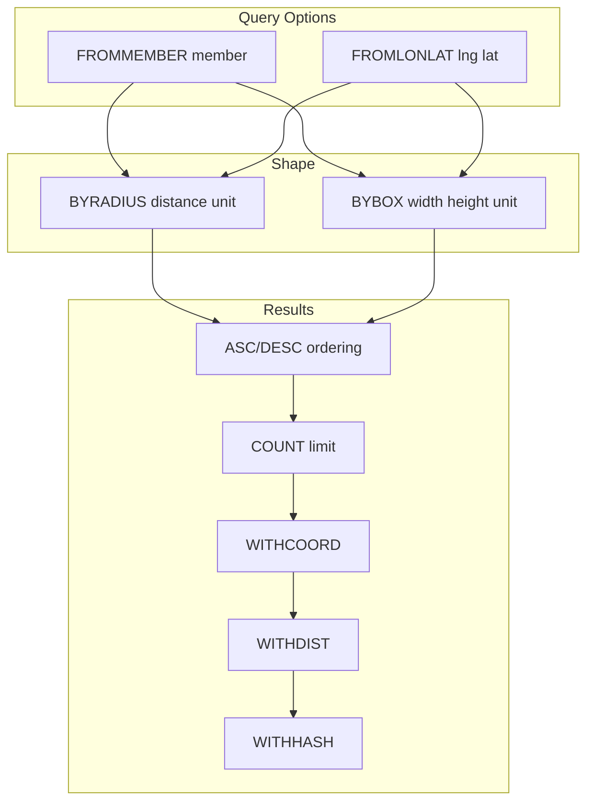
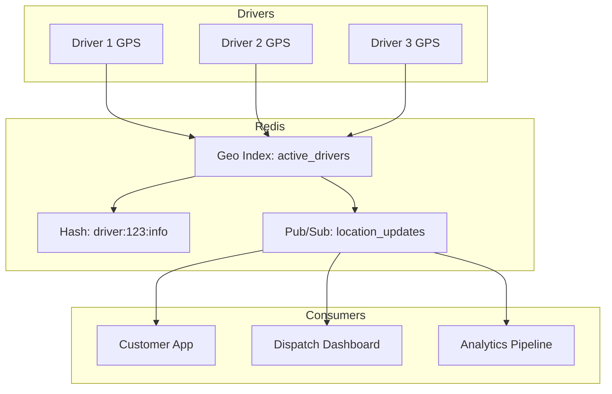

# How to Create Redis Geospatial Queries Advanced

Author: [nawazdhandala](https://github.com/nawazdhandala)

Tags: Redis, Geospatial, Location, Search

Description: Master Redis geospatial commands for building proximity searches, store locators, delivery tracking, and location-based features at scale.

---

Location-aware applications are everywhere: ride-sharing, food delivery, store locators, fleet management, and social check-ins. Redis provides native geospatial indexing through a sorted set structure that makes radius queries and distance calculations fast and simple. This guide covers advanced patterns for production systems.

## How Redis Stores Geospatial Data

Redis uses a sorted set with geohash-encoded coordinates as scores. When you add a location with `GEOADD`, Redis converts latitude and longitude into a 52-bit geohash integer. This encoding preserves spatial locality, so nearby points have similar scores and can be retrieved efficiently.



The geohash structure means:

- Points close together geographically have similar hash values
- Range queries on the sorted set efficiently find nearby points
- No separate spatial index is needed

## GEOADD: Adding Locations

The `GEOADD` command stores geographic coordinates. The format is `GEOADD key longitude latitude member`.

```bash
# Add a single location
GEOADD stores -122.4194 37.7749 "store:sf_downtown"

# Add multiple locations in one command (batch for performance)
GEOADD stores \
    -122.4089 37.7837 "store:sf_marina" \
    -122.4468 37.7235 "store:sf_sunset" \
    -122.3999 37.7956 "store:sf_northbeach" \
    -122.4311 37.7325 "store:sf_castro"
```

Options for `GEOADD`:

- `NX` - Only add new elements, do not update existing ones
- `XX` - Only update existing elements, do not add new ones
- `CH` - Return the number of changed elements (added + updated)

```bash
# Only add if the store does not already exist
GEOADD stores NX -122.4194 37.7749 "store:sf_downtown"

# Update position of an existing store (returns 0 if no change)
GEOADD stores XX CH -122.4195 37.7750 "store:sf_downtown"
```

### Node.js Example

```javascript
const Redis = require('ioredis');
const redis = new Redis(process.env.REDIS_URL);

async function addStoreLocations(stores) {
  // Build arguments array: [lng, lat, member, lng, lat, member, ...]
  const args = stores.flatMap(store => [
    store.longitude,
    store.latitude,
    `store:${store.id}`
  ]);

  // Add all locations in one command
  const added = await redis.geoadd('stores', ...args);
  console.log(`Added ${added} new store locations`);
  return added;
}

// Example usage
await addStoreLocations([
  { id: 'nyc_soho', longitude: -74.0000, latitude: 40.7233 },
  { id: 'nyc_midtown', longitude: -73.9857, latitude: 40.7484 },
  { id: 'nyc_brooklyn', longitude: -73.9442, latitude: 40.6782 },
]);
```

## GEODIST: Calculating Distance Between Points

`GEODIST` returns the distance between two members. Supported units: `m` (meters), `km` (kilometers), `mi` (miles), `ft` (feet).

```bash
# Distance between two stores in kilometers
GEODIST stores "store:sf_downtown" "store:sf_marina" km
# Returns: "2.4851"

# Distance in miles
GEODIST stores "store:sf_downtown" "store:sf_marina" mi
# Returns: "1.5439"
```

### Use Case: Delivery Distance Estimation

```javascript
async function estimateDeliveryDistance(driverId, customerId) {
  // Both driver and customer positions stored in same geo set
  const distanceKm = await redis.geodist(
    'active_positions',
    `driver:${driverId}`,
    `customer:${customerId}`,
    'km'
  );

  if (distanceKm === null) {
    throw new Error('One or both positions not found');
  }

  return {
    distanceKm: parseFloat(distanceKm),
    estimatedMinutes: Math.ceil(parseFloat(distanceKm) * 2.5) // Rough estimate
  };
}
```

## GEOPOS: Retrieving Coordinates

Get the longitude and latitude of stored members:

```bash
GEOPOS stores "store:sf_downtown" "store:sf_marina"
# Returns:
# 1) 1) "-122.41940140724182129"
#    2) "37.77490054093211958"
# 2) 1) "-122.40889936685562134"
#    2) "37.78370038712474543"
```

Useful for displaying stored locations on a map or syncing with external systems.

## GEOSEARCH: The Modern Query Command

`GEOSEARCH` (Redis 6.2+) is the recommended command for spatial queries. It replaces the older `GEORADIUS` and `GEORADIUSBYMEMBER` commands with a cleaner syntax.



### Radius Query from Coordinates

Find all stores within 5 kilometers of a given point:

```bash
GEOSEARCH stores FROMLONLAT -122.4194 37.7749 BYRADIUS 5 km ASC WITHCOORD WITHDIST
# Returns members sorted by distance with coordinates and distance
```

### Radius Query from Existing Member

Find stores near an existing store:

```bash
GEOSEARCH stores FROMMEMBER "store:sf_downtown" BYRADIUS 3 km ASC COUNT 5 WITHDIST
# Returns 5 closest stores within 3km of sf_downtown
```

### Box Query

Search within a rectangular area (useful for map viewport queries):

```bash
GEOSEARCH stores FROMLONLAT -122.4194 37.7749 BYBOX 10 10 km ASC WITHCOORD
# Returns all stores within a 10km x 10km box centered on the point
```

### Node.js Implementation

```javascript
async function findNearbyStores(longitude, latitude, radiusKm, limit = 10) {
  const results = await redis.geosearch(
    'stores',
    'FROMLONLAT', longitude, latitude,
    'BYRADIUS', radiusKm, 'km',
    'ASC',
    'COUNT', limit,
    'WITHCOORD',
    'WITHDIST'
  );

  // Parse results into structured objects
  return results.map(item => ({
    id: item[0].replace('store:', ''),
    distance: parseFloat(item[1]),
    longitude: parseFloat(item[2][0]),
    latitude: parseFloat(item[2][1])
  }));
}

// Find 5 closest stores within 10km
const nearby = await findNearbyStores(-122.4194, 37.7749, 10, 5);
// [
//   { id: 'sf_downtown', distance: 0, longitude: -122.4194, latitude: 37.7749 },
//   { id: 'sf_northbeach', distance: 2.1, longitude: -122.3999, latitude: 37.7956 },
//   ...
// ]
```

## GEOSEARCHSTORE: Storing Query Results

Store the results of a geosearch in a new sorted set for caching or further processing:

```bash
GEOSEARCHSTORE nearby_cache stores FROMLONLAT -122.4194 37.7749 BYRADIUS 5 km ASC COUNT 20
# Creates a new sorted set 'nearby_cache' with matching members
```

This is powerful for:

- Caching frequently requested proximity queries
- Building materialized views of nearby entities
- Pre-computing results for popular locations

```javascript
async function cacheNearbyDrivers(zoneId, centerLng, centerLat, radiusKm, ttlSeconds = 30) {
  const cacheKey = `nearby_drivers:${zoneId}`;

  // Store search results
  await redis.geosearchstore(
    cacheKey,
    'active_drivers',
    'FROMLONLAT', centerLng, centerLat,
    'BYRADIUS', radiusKm, 'km',
    'ASC',
    'COUNT', 100,
    'STOREDIST' // Store distances as scores instead of geohashes
  );

  // Set TTL on the cache
  await redis.expire(cacheKey, ttlSeconds);

  return cacheKey;
}
```

## Building a Store Locator

Here is a complete store locator implementation:

```javascript
class StoreLocator {
  constructor(redis) {
    this.redis = redis;
    this.geoKey = 'store_locations';
    this.dataPrefix = 'store:data:';
  }

  async addStore(store) {
    const memberId = `store:${store.id}`;

    // Store location in geo index
    await this.redis.geoadd(
      this.geoKey,
      store.longitude,
      store.latitude,
      memberId
    );

    // Store additional data in a hash
    await this.redis.hset(this.dataPrefix + store.id, {
      name: store.name,
      address: store.address,
      phone: store.phone,
      hours: JSON.stringify(store.hours),
      services: JSON.stringify(store.services || [])
    });
  }

  async findNearby(longitude, latitude, radiusKm, options = {}) {
    const { limit = 10, services = [] } = options;

    // Get nearby stores with distances
    const results = await this.redis.geosearch(
      this.geoKey,
      'FROMLONLAT', longitude, latitude,
      'BYRADIUS', radiusKm, 'km',
      'ASC',
      'COUNT', limit * 2, // Fetch extra for filtering
      'WITHCOORD',
      'WITHDIST'
    );

    // Enrich with store data
    const stores = await Promise.all(
      results.map(async ([memberId, distance, coords]) => {
        const storeId = memberId.replace('store:', '');
        const data = await this.redis.hgetall(this.dataPrefix + storeId);

        return {
          id: storeId,
          name: data.name,
          address: data.address,
          phone: data.phone,
          hours: JSON.parse(data.hours || '{}'),
          services: JSON.parse(data.services || '[]'),
          distance: parseFloat(distance),
          location: {
            longitude: parseFloat(coords[0]),
            latitude: parseFloat(coords[1])
          }
        };
      })
    );

    // Filter by services if specified
    let filtered = stores;
    if (services.length > 0) {
      filtered = stores.filter(store =>
        services.every(service => store.services.includes(service))
      );
    }

    return filtered.slice(0, limit);
  }

  async removeStore(storeId) {
    await this.redis.zrem(this.geoKey, `store:${storeId}`);
    await this.redis.del(this.dataPrefix + storeId);
  }
}

// Usage
const locator = new StoreLocator(redis);

await locator.addStore({
  id: 'sf_downtown',
  name: 'Downtown SF Store',
  address: '123 Market St, San Francisco, CA',
  phone: '415-555-0100',
  hours: { mon: '9-9', tue: '9-9', wed: '9-9' },
  services: ['pickup', 'returns', 'repairs'],
  longitude: -122.4194,
  latitude: 37.7749
});

const nearby = await locator.findNearby(-122.4089, 37.7837, 5, {
  limit: 5,
  services: ['pickup']
});
```

## Real-Time Delivery Tracking

Track moving entities like delivery drivers with frequent position updates:



```javascript
class DeliveryTracker {
  constructor(redis) {
    this.redis = redis;
    this.geoKey = 'active_drivers';
    this.infoPrefix = 'driver:info:';
  }

  async updateDriverPosition(driverId, longitude, latitude, metadata = {}) {
    const memberId = `driver:${driverId}`;
    const timestamp = Date.now();

    // Update position in geo index
    await this.redis.geoadd(this.geoKey, longitude, latitude, memberId);

    // Update driver metadata
    await this.redis.hset(this.infoPrefix + driverId, {
      lastUpdate: timestamp,
      speed: metadata.speed || 0,
      heading: metadata.heading || 0,
      status: metadata.status || 'available'
    });

    // Publish update for real-time subscribers
    await this.redis.publish('driver_locations', JSON.stringify({
      driverId,
      longitude,
      latitude,
      timestamp,
      ...metadata
    }));
  }

  async findAvailableDrivers(orderLng, orderLat, radiusKm, limit = 5) {
    // Get nearby drivers
    const nearby = await this.redis.geosearch(
      this.geoKey,
      'FROMLONLAT', orderLng, orderLat,
      'BYRADIUS', radiusKm, 'km',
      'ASC',
      'COUNT', limit * 3, // Fetch extra for filtering
      'WITHDIST'
    );

    // Filter by availability and enrich with info
    const available = [];

    for (const [memberId, distance] of nearby) {
      if (available.length >= limit) break;

      const driverId = memberId.replace('driver:', '');
      const info = await this.redis.hgetall(this.infoPrefix + driverId);

      if (info.status === 'available') {
        available.push({
          driverId,
          distance: parseFloat(distance),
          lastUpdate: parseInt(info.lastUpdate),
          speed: parseFloat(info.speed),
          heading: parseFloat(info.heading)
        });
      }
    }

    return available;
  }

  async getDriverPosition(driverId) {
    const positions = await this.redis.geopos(this.geoKey, `driver:${driverId}`);

    if (!positions[0]) {
      return null;
    }

    const info = await this.redis.hgetall(this.infoPrefix + driverId);

    return {
      driverId,
      longitude: parseFloat(positions[0][0]),
      latitude: parseFloat(positions[0][1]),
      lastUpdate: parseInt(info.lastUpdate),
      status: info.status
    };
  }

  async removeDriver(driverId) {
    await this.redis.zrem(this.geoKey, `driver:${driverId}`);
    await this.redis.del(this.infoPrefix + driverId);
  }
}
```

## Geofencing with GEOSEARCH

Detect when entities enter or leave defined areas:

```javascript
class GeofenceMonitor {
  constructor(redis) {
    this.redis = redis;
    this.zonesKey = 'geofence_zones';
    this.entitiesKey = 'tracked_entities';
    this.statePrefix = 'geofence:state:';
  }

  async addZone(zoneId, longitude, latitude, radiusKm) {
    // Store zone center and radius
    await this.redis.geoadd(this.zonesKey, longitude, latitude, zoneId);
    await this.redis.hset(`zone:${zoneId}`, {
      radiusKm,
      longitude,
      latitude
    });
  }

  async checkEntity(entityId, longitude, latitude) {
    // Update entity position
    await this.redis.geoadd(this.entitiesKey, longitude, latitude, entityId);

    // Get all zones
    const zones = await this.redis.zrange(this.zonesKey, 0, -1);

    const events = [];
    const stateKey = this.statePrefix + entityId;
    const previousState = await this.redis.hgetall(stateKey);

    for (const zoneId of zones) {
      const zoneConfig = await this.redis.hgetall(`zone:${zoneId}`);
      const zoneLng = parseFloat(zoneConfig.longitude);
      const zoneLat = parseFloat(zoneConfig.latitude);
      const radiusKm = parseFloat(zoneConfig.radiusKm);

      // Check if entity is within zone radius
      const distance = await this.redis.geodist(
        this.entitiesKey,
        entityId,
        zoneId, // Temporarily add zone center to calculate
        'km'
      );

      // Determine current state
      const wasInside = previousState[zoneId] === 'inside';
      const isInside = distance !== null && parseFloat(distance) <= radiusKm;

      // Detect transitions
      if (isInside && !wasInside) {
        events.push({ type: 'enter', zoneId, entityId, distance: parseFloat(distance) });
      } else if (!isInside && wasInside) {
        events.push({ type: 'exit', zoneId, entityId });
      }

      // Update state
      await this.redis.hset(stateKey, zoneId, isInside ? 'inside' : 'outside');
    }

    return events;
  }
}

// Usage
const monitor = new GeofenceMonitor(redis);

// Define delivery zones
await monitor.addZone('warehouse_a', -122.4194, 37.7749, 2);
await monitor.addZone('warehouse_b', -122.3999, 37.7956, 1.5);

// Check driver position and get geofence events
const events = await monitor.checkEntity('driver_123', -122.4180, 37.7760);
// [{ type: 'enter', zoneId: 'warehouse_a', entityId: 'driver_123', distance: 0.15 }]
```

## Performance Optimization

### Batch Operations

Use pipelines for bulk operations:

```javascript
async function batchUpdatePositions(updates) {
  const pipeline = redis.pipeline();

  for (const { entityId, longitude, latitude } of updates) {
    pipeline.geoadd('positions', longitude, latitude, entityId);
  }

  await pipeline.exec();
}

// Update 1000 positions in one round trip
await batchUpdatePositions(driverUpdates);
```

### Index Partitioning

For large datasets, partition by region:

```javascript
function getGeoKey(latitude) {
  // Partition by latitude bands
  const band = Math.floor(latitude / 10) * 10;
  return `locations:lat_${band}`;
}

async function addLocation(id, lng, lat) {
  const key = getGeoKey(lat);
  await redis.geoadd(key, lng, lat, id);
}

async function searchNearby(lng, lat, radiusKm) {
  // Search in primary band and adjacent bands if radius is large
  const primaryKey = getGeoKey(lat);
  const results = await redis.geosearch(
    primaryKey,
    'FROMLONLAT', lng, lat,
    'BYRADIUS', radiusKm, 'km',
    'ASC',
    'WITHDIST'
  );

  return results;
}
```

### TTL for Stale Data

Remove inactive entities automatically:

```javascript
async function updatePositionWithTTL(entityId, lng, lat, ttlSeconds = 300) {
  const key = `entity:${entityId}:position`;

  // Store position with TTL
  await redis.geoadd('active_entities', lng, lat, entityId);

  // Use a separate key to track activity
  await redis.setex(`entity:${entityId}:active`, ttlSeconds, '1');
}

// Periodic cleanup job
async function cleanupInactiveEntities() {
  const allEntities = await redis.zrange('active_entities', 0, -1);

  const pipeline = redis.pipeline();
  const toRemove = [];

  for (const entityId of allEntities) {
    const isActive = await redis.exists(`entity:${entityId}:active`);
    if (!isActive) {
      toRemove.push(entityId);
    }
  }

  if (toRemove.length > 0) {
    await redis.zrem('active_entities', ...toRemove);
  }

  return toRemove.length;
}
```

## Legacy Commands: GEORADIUS and GEORADIUSBYMEMBER

These commands still work but are deprecated in favor of `GEOSEARCH`:

```bash
# Old way (deprecated)
GEORADIUS stores -122.4194 37.7749 5 km ASC COUNT 10 WITHDIST
GEORADIUSBYMEMBER stores "store:sf_downtown" 5 km ASC COUNT 10 WITHDIST

# New way (recommended)
GEOSEARCH stores FROMLONLAT -122.4194 37.7749 BYRADIUS 5 km ASC COUNT 10 WITHDIST
GEOSEARCH stores FROMMEMBER "store:sf_downtown" BYRADIUS 5 km ASC COUNT 10 WITHDIST
```

Migrate to `GEOSEARCH` for new code. The syntax is clearer and it supports box queries that the old commands lacked.

## Command Reference

| Command | Purpose | Example |
|---------|---------|---------|
| `GEOADD` | Add locations | `GEOADD key lng lat member` |
| `GEODIST` | Distance between members | `GEODIST key member1 member2 km` |
| `GEOPOS` | Get coordinates | `GEOPOS key member` |
| `GEOHASH` | Get geohash string | `GEOHASH key member` |
| `GEOSEARCH` | Query by radius/box | `GEOSEARCH key FROMLONLAT lng lat BYRADIUS r km` |
| `GEOSEARCHSTORE` | Store query results | `GEOSEARCHSTORE dest src FROMLONLAT lng lat BYRADIUS r km` |

## Summary

Redis geospatial commands provide a fast, simple foundation for location-based features:

- **GEOADD** stores coordinates as geohash-encoded sorted set members
- **GEOSEARCH** handles both radius and bounding box queries with distance calculations
- **GEODIST** computes point-to-point distances in any unit
- **GEOSEARCHSTORE** caches results for repeated queries

The combination of O(log N) insertions, O(N+log M) radius queries, and atomic operations makes Redis suitable for real-time tracking, store locators, and proximity matching. For datasets exceeding millions of points, consider partitioning by region or using a dedicated spatial database alongside Redis for complex polygon queries.
