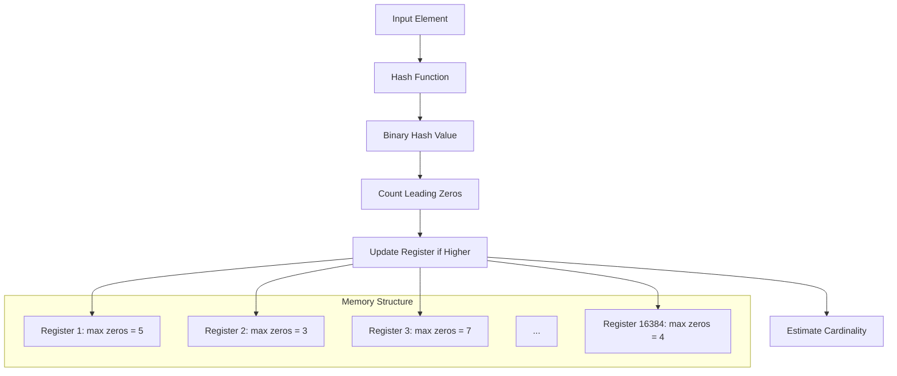
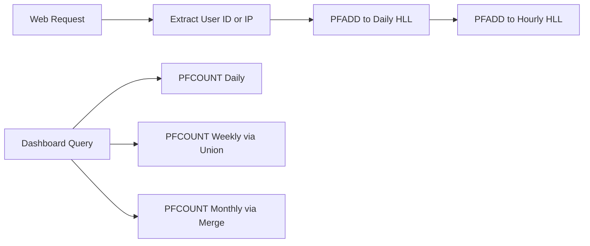
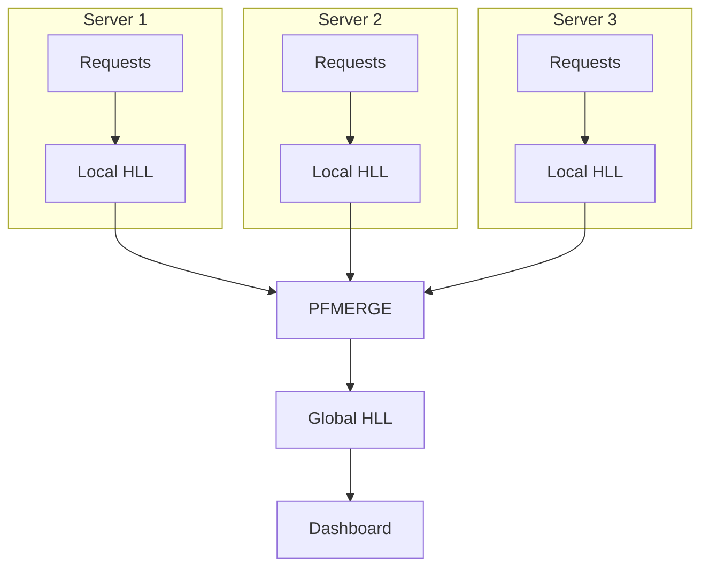

# How to Build Redis HyperLogLog Use Cases

Author: [nawazdhandala](https://github.com/nawazdhandala)

Tags: Redis, HyperLogLog, Analytics, Cardinality

Description: Learn how to use Redis HyperLogLog for memory-efficient cardinality estimation, unique visitor counting, and real-time analytics with practical code examples.

---

Counting unique items sounds simple until you have billions of them. Storing every unique user ID, IP address, or event identifier in a set quickly becomes a memory nightmare. Redis HyperLogLog solves this problem by trading perfect accuracy for massive memory savings, giving you approximate counts with a standard error of just 0.81% while using only 12KB of memory regardless of the number of elements.

This guide walks through real-world HyperLogLog use cases with practical code examples you can deploy today.

---

## Table of Contents

1. What is HyperLogLog?
2. How HyperLogLog Works
3. Core Commands: PFADD, PFCOUNT, PFMERGE
4. Use Case: Unique Visitor Counting
5. Use Case: Feature Usage Analytics
6. Use Case: Distributed Cardinality Estimation
7. Memory Efficiency Compared to Sets
8. When Not to Use HyperLogLog
9. Production Best Practices

---

## 1. What is HyperLogLog?

HyperLogLog (HLL) is a probabilistic data structure designed to estimate the cardinality (count of distinct elements) of a dataset. Instead of storing every element, it uses a clever hashing technique that requires constant memory regardless of how many elements you add.

Key characteristics:

| Property | Value |
|----------|-------|
| Memory per key | ~12KB (fixed) |
| Standard error | 0.81% |
| Max cardinality | 2^64 elements |
| Time complexity | O(1) for all operations |

For context, storing 100 million unique user IDs as strings in a Redis Set would require roughly 5GB of memory. A HyperLogLog storing the same count uses 12KB. That's a 400,000x reduction.

---

## 2. How HyperLogLog Works

HyperLogLog estimates cardinality by observing patterns in hashed values. When you hash random inputs, the probability of seeing a hash with N leading zeros is 1/2^N. By tracking the maximum number of leading zeros seen, you can estimate how many unique items have been added.



Redis uses 16,384 registers (buckets), each storing a 6-bit value representing the maximum number of leading zeros observed. The final estimate combines all registers using harmonic mean, which provides robustness against outliers.

---

## 3. Core Commands: PFADD, PFCOUNT, PFMERGE

Redis provides three commands for HyperLogLog operations.

### PFADD: Add Elements

`PFADD` adds one or more elements to a HyperLogLog. It returns 1 if the internal state changed (the estimated cardinality increased), 0 otherwise.

```redis
PFADD visitors:2026-01-30 "user:1001"
PFADD visitors:2026-01-30 "user:1002" "user:1003" "user:1004"
```

Node.js example:

```javascript
import { createClient } from 'redis';

const redis = createClient();
await redis.connect();

// Add single visitor
await redis.pfAdd('visitors:2026-01-30', 'user:1001');

// Add multiple visitors
await redis.pfAdd('visitors:2026-01-30', ['user:1002', 'user:1003', 'user:1004']);

// Add visitor and check if cardinality changed
const changed = await redis.pfAdd('visitors:2026-01-30', 'user:1001');
console.log(changed); // 0 - already seen this user
```

### PFCOUNT: Get Estimated Cardinality

`PFCOUNT` returns the approximate number of unique elements added. When called with multiple keys, it returns the cardinality of the union.

```redis
PFCOUNT visitors:2026-01-30
PFCOUNT visitors:2026-01-30 visitors:2026-01-29 visitors:2026-01-28
```

Node.js example:

```javascript
// Get unique visitors for one day
const dailyUniques = await redis.pfCount('visitors:2026-01-30');
console.log(`Unique visitors today: ${dailyUniques}`);

// Get unique visitors across multiple days (union)
const weeklyUniques = await redis.pfCount([
  'visitors:2026-01-24',
  'visitors:2026-01-25',
  'visitors:2026-01-26',
  'visitors:2026-01-27',
  'visitors:2026-01-28',
  'visitors:2026-01-29',
  'visitors:2026-01-30'
]);
console.log(`Unique visitors this week: ${weeklyUniques}`);
```

### PFMERGE: Combine HyperLogLogs

`PFMERGE` creates a new HyperLogLog by merging multiple source keys. The resulting HyperLogLog represents the union of all source sets.

```redis
PFMERGE visitors:2026-01 visitors:2026-01-01 visitors:2026-01-02 ... visitors:2026-01-31
```

Node.js example:

```javascript
// Merge daily stats into monthly
const januaryDays = [];
for (let day = 1; day <= 30; day++) {
  januaryDays.push(`visitors:2026-01-${String(day).padStart(2, '0')}`);
}

await redis.pfMerge('visitors:2026-01', januaryDays);

// Now get monthly unique count
const monthlyUniques = await redis.pfCount('visitors:2026-01');
console.log(`Unique visitors in January: ${monthlyUniques}`);
```

---

## 4. Use Case: Unique Visitor Counting

The most common HyperLogLog use case is counting unique website visitors. Here's a production-ready implementation.



### Implementation

```javascript
import { createClient } from 'redis';

const redis = createClient();

class UniqueVisitorTracker {
  constructor(redis) {
    this.redis = redis;
  }

  // Generate time-based keys
  getKeys(timestamp = new Date()) {
    const date = timestamp.toISOString().split('T')[0];
    const hour = timestamp.getUTCHours();
    const yearMonth = date.substring(0, 7);

    return {
      hourly: `visitors:hourly:${date}:${hour}`,
      daily: `visitors:daily:${date}`,
      monthly: `visitors:monthly:${yearMonth}`
    };
  }

  // Track a visitor
  async trackVisitor(visitorId) {
    const keys = this.getKeys();

    // Add to all time granularities in parallel
    await Promise.all([
      this.redis.pfAdd(keys.hourly, visitorId),
      this.redis.pfAdd(keys.daily, visitorId),
      this.redis.pfAdd(keys.monthly, visitorId)
    ]);
  }

  // Get unique count for a specific day
  async getDailyUniques(date) {
    return this.redis.pfCount(`visitors:daily:${date}`);
  }

  // Get unique count for a date range
  async getUniquesBetween(startDate, endDate) {
    const keys = [];
    const current = new Date(startDate);
    const end = new Date(endDate);

    while (current <= end) {
      keys.push(`visitors:daily:${current.toISOString().split('T')[0]}`);
      current.setDate(current.getDate() + 1);
    }

    return this.redis.pfCount(keys);
  }

  // Get hourly breakdown for a day
  async getHourlyBreakdown(date) {
    const breakdown = {};

    for (let hour = 0; hour < 24; hour++) {
      const key = `visitors:hourly:${date}:${hour}`;
      breakdown[hour] = await this.redis.pfCount(key);
    }

    return breakdown;
  }
}

// Usage
const tracker = new UniqueVisitorTracker(redis);

// Track visitors as they arrive
await tracker.trackVisitor('user:1001');
await tracker.trackVisitor('user:1002');
await tracker.trackVisitor('user:1001'); // Duplicate, won't affect count

// Query counts
const todayUniques = await tracker.getDailyUniques('2026-01-30');
const weekUniques = await tracker.getUniquesBetween('2026-01-24', '2026-01-30');
```

### Setting Expiration

For ephemeral data, set TTLs to automatically clean up old keys:

```javascript
async trackVisitorWithExpiry(visitorId) {
  const keys = this.getKeys();

  const pipeline = this.redis.multi();

  // Hourly keys expire after 48 hours
  pipeline.pfAdd(keys.hourly, visitorId);
  pipeline.expire(keys.hourly, 48 * 60 * 60);

  // Daily keys expire after 90 days
  pipeline.pfAdd(keys.daily, visitorId);
  pipeline.expire(keys.daily, 90 * 24 * 60 * 60);

  // Monthly keys expire after 2 years
  pipeline.pfAdd(keys.monthly, visitorId);
  pipeline.expire(keys.monthly, 2 * 365 * 24 * 60 * 60);

  await pipeline.exec();
}
```

---

## 5. Use Case: Feature Usage Analytics

Track how many unique users interact with specific features without storing user lists.

```javascript
class FeatureAnalytics {
  constructor(redis) {
    this.redis = redis;
  }

  async trackFeatureUsage(featureId, userId) {
    const date = new Date().toISOString().split('T')[0];
    const key = `feature:${featureId}:users:${date}`;

    await this.redis.pfAdd(key, userId);
  }

  async getFeatureAdoption(featureId, days = 30) {
    const keys = [];
    const now = new Date();

    for (let i = 0; i < days; i++) {
      const date = new Date(now);
      date.setDate(date.getDate() - i);
      keys.push(`feature:${featureId}:users:${date.toISOString().split('T')[0]}`);
    }

    return this.redis.pfCount(keys);
  }

  async compareFeatureAdoption(featureIds, days = 30) {
    const results = {};

    for (const featureId of featureIds) {
      results[featureId] = await this.getFeatureAdoption(featureId, days);
    }

    return results;
  }

  // Find users who used feature A but not feature B (approximate)
  async getFeatureOverlap(featureA, featureB, days = 30) {
    const uniquesA = await this.getFeatureAdoption(featureA, days);
    const uniquesB = await this.getFeatureAdoption(featureB, days);

    // Get union of both features
    const keysA = this.getKeysForDays(featureA, days);
    const keysB = this.getKeysForDays(featureB, days);

    const union = await this.redis.pfCount([...keysA, ...keysB]);

    // Inclusion-exclusion: A intersect B = A + B - (A union B)
    const intersection = uniquesA + uniquesB - union;

    return {
      featureA: uniquesA,
      featureB: uniquesB,
      both: Math.max(0, intersection),
      onlyA: uniquesA - Math.max(0, intersection),
      onlyB: uniquesB - Math.max(0, intersection)
    };
  }

  getKeysForDays(featureId, days) {
    const keys = [];
    const now = new Date();

    for (let i = 0; i < days; i++) {
      const date = new Date(now);
      date.setDate(date.getDate() - i);
      keys.push(`feature:${featureId}:users:${date.toISOString().split('T')[0]}`);
    }

    return keys;
  }
}

// Usage
const analytics = new FeatureAnalytics(redis);

// Track feature usage
await analytics.trackFeatureUsage('dark-mode', 'user:1001');
await analytics.trackFeatureUsage('export-csv', 'user:1001');
await analytics.trackFeatureUsage('dark-mode', 'user:1002');

// Compare feature adoption
const comparison = await analytics.compareFeatureAdoption([
  'dark-mode',
  'export-csv',
  'api-access'
], 30);

console.log(comparison);
// { 'dark-mode': 45231, 'export-csv': 12453, 'api-access': 8921 }
```

---

## 6. Use Case: Distributed Cardinality Estimation

When running multiple application servers, each can maintain local HyperLogLogs that get merged periodically.



### Implementation with Periodic Merge

```javascript
class DistributedCounter {
  constructor(redis, serverId) {
    this.redis = redis;
    this.serverId = serverId;
  }

  // Each server writes to its own key
  async trackEvent(eventType, entityId) {
    const date = new Date().toISOString().split('T')[0];
    const localKey = `events:${eventType}:${date}:server:${this.serverId}`;

    await this.redis.pfAdd(localKey, entityId);
  }

  // Merge all server keys into a global key (run periodically)
  async mergeServerCounts(eventType, date) {
    // Find all server keys for this event and date
    const pattern = `events:${eventType}:${date}:server:*`;
    const serverKeys = await this.redis.keys(pattern);

    if (serverKeys.length === 0) return 0;

    const globalKey = `events:${eventType}:${date}:global`;
    await this.redis.pfMerge(globalKey, serverKeys);

    return this.redis.pfCount(globalKey);
  }

  // Get global count (uses merged key if available, falls back to real-time merge)
  async getGlobalCount(eventType, date) {
    const globalKey = `events:${eventType}:${date}:global`;

    // Check if merged key exists
    const exists = await this.redis.exists(globalKey);

    if (exists) {
      return this.redis.pfCount(globalKey);
    }

    // Real-time merge if no pre-merged key
    const pattern = `events:${eventType}:${date}:server:*`;
    const serverKeys = await this.redis.keys(pattern);

    if (serverKeys.length === 0) return 0;

    return this.redis.pfCount(serverKeys);
  }
}

// Merge job (run via cron every minute)
async function runMergeJob(redis, eventTypes) {
  const date = new Date().toISOString().split('T')[0];
  const counter = new DistributedCounter(redis, 'merger');

  for (const eventType of eventTypes) {
    const count = await counter.mergeServerCounts(eventType, date);
    console.log(`${eventType} unique count: ${count}`);
  }
}
```

---

## 7. Memory Efficiency Compared to Sets

Here's a concrete comparison of memory usage for different cardinalities:

| Unique Elements | Redis Set (Strings) | HyperLogLog | Savings |
|-----------------|---------------------|-------------|---------|
| 1,000 | ~50 KB | 12 KB | 4x |
| 100,000 | ~5 MB | 12 KB | 400x |
| 10,000,000 | ~500 MB | 12 KB | 40,000x |
| 1,000,000,000 | ~50 GB | 12 KB | 4,000,000x |

The trade-off is accuracy. HyperLogLog provides an estimate with 0.81% standard error, meaning:

- If true count is 1,000,000, HLL estimate will be between ~992,000 and ~1,008,000 (99% of the time)
- For 100 elements, error range is roughly +/- 1 element

For analytics and monitoring, this accuracy is usually sufficient. For billing or compliance where exact counts matter, use Sets or other exact counting methods.

---

## 8. When Not to Use HyperLogLog

HyperLogLog is not suitable for every counting scenario:

| Scenario | Why HLL is Wrong | Alternative |
|----------|------------------|-------------|
| Need exact counts | 0.81% error is unacceptable | Redis Set or database |
| Need to list elements | HLL only stores cardinality | Redis Set |
| Small cardinalities (<1000) | Error rate higher relative to count | Redis Set |
| Need to remove elements | HLL does not support removal | Redis Set or Bloom filter |
| Need intersection queries | HLL only supports union | Redis Set or probabilistic filters |

A common mistake is using HyperLogLog for low-cardinality counts where a simple Set would be more accurate and still memory-efficient.

---

## 9. Production Best Practices

### Use Consistent Hashing for Element IDs

Ensure the same entity always produces the same string representation:

```javascript
// Bad: object order is not guaranteed
await redis.pfAdd('users', JSON.stringify({ name: 'Alice', id: 1 }));

// Good: consistent identifier
await redis.pfAdd('users', `user:${userId}`);
```

### Pipeline Multiple Operations

When tracking many events, use pipelining to reduce round trips:

```javascript
async function trackBatch(events) {
  const pipeline = redis.multi();

  for (const event of events) {
    pipeline.pfAdd(`events:${event.type}:${event.date}`, event.entityId);
  }

  await pipeline.exec();
}
```

### Monitor Memory and Key Count

Even at 12KB per key, thousands of HyperLogLog keys add up:

```javascript
// Check memory usage for HLL keys
const info = await redis.info('memory');
console.log(info);

// Count HLL keys
const keys = await redis.keys('visitors:*');
console.log(`HLL key count: ${keys.length}`);
console.log(`Estimated HLL memory: ${keys.length * 12} KB`);
```

### Use Lua Scripts for Atomic Operations

When you need atomic read-modify-write patterns:

```lua
-- track_and_count.lua
local key = KEYS[1]
local element = ARGV[1]

redis.call('PFADD', key, element)
return redis.call('PFCOUNT', key)
```

```javascript
const trackAndCount = await redis.scriptLoad(`
  local key = KEYS[1]
  local element = ARGV[1]
  redis.call('PFADD', key, element)
  return redis.call('PFCOUNT', key)
`);

const currentCount = await redis.evalSha(trackAndCount, {
  keys: ['visitors:2026-01-30'],
  arguments: ['user:1001']
});
```

---

## Summary

| Command | Use Case | Complexity |
|---------|----------|------------|
| PFADD | Add elements to count | O(1) |
| PFCOUNT | Get estimated unique count | O(1) per key, O(N) for N keys |
| PFMERGE | Combine multiple HyperLogLogs | O(N) for N source keys |

HyperLogLog gives you the ability to count unique items at scale without proportional memory growth. The 0.81% error rate is a reasonable trade-off for most analytics, monitoring, and reporting use cases. For exact counting of small sets or when you need element membership queries, stick with Redis Sets.

Start with daily HyperLogLogs, merge them into weekly and monthly aggregates, and set appropriate TTLs to keep your Redis memory bounded. The result is a real-time unique counting system that handles billions of events without breaking a sweat.

---

**Related Reading:**

- [Redis HyperLogLog Documentation](https://redis.io/docs/data-types/hyperloglogs/)
- [Original HyperLogLog Paper](http://algo.inria.fr/flajolet/Publications/FlFuGaMe07.pdf)
