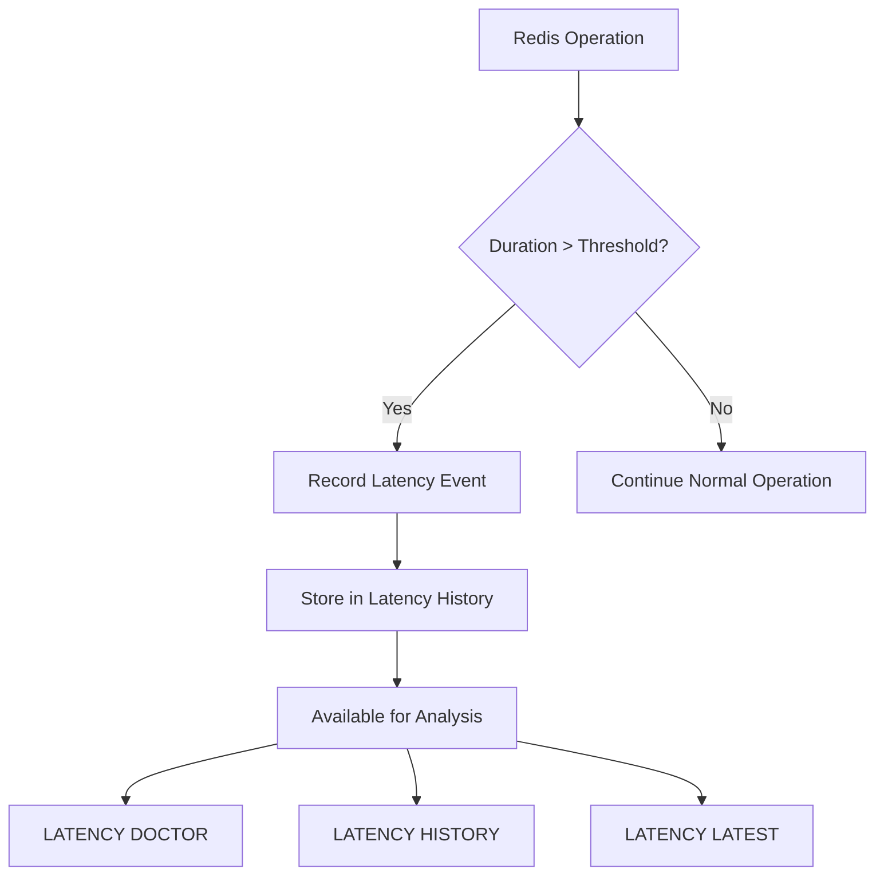
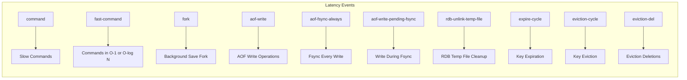
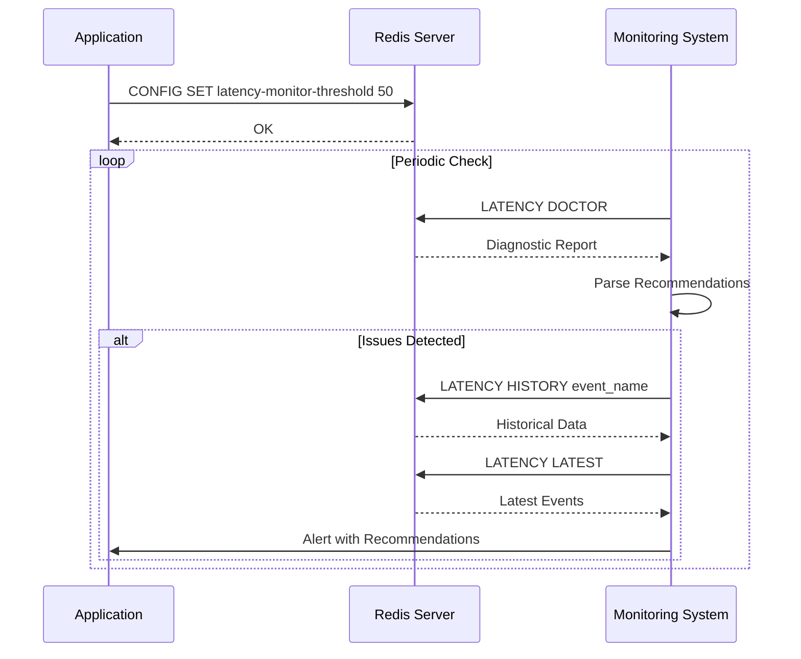
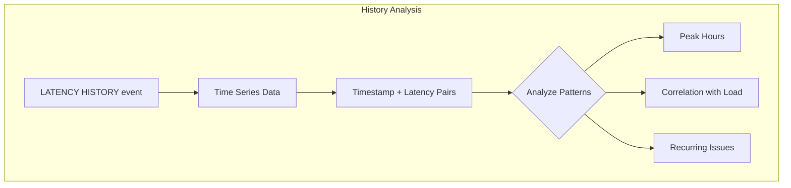
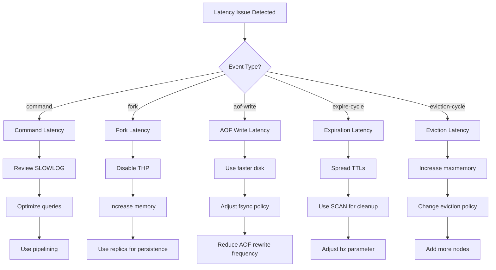
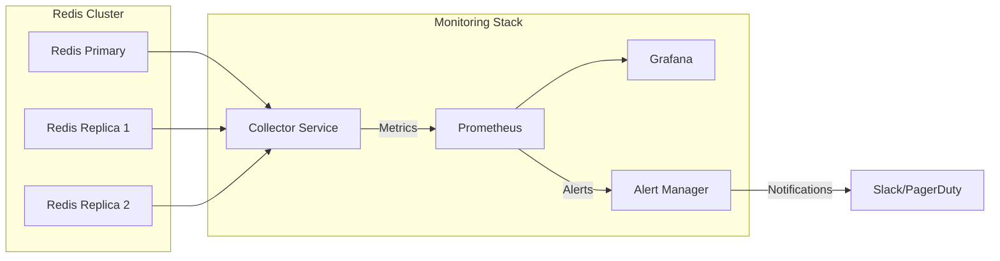

# How to Implement Redis Latency Doctor Usage

Author: [nawazdhandala](https://github.com/nawazdhandala)

Tags: Redis, Latency, Diagnostics, Performance

Description: Learn to use Redis LATENCY DOCTOR for diagnosing latency issues with event monitoring, history analysis, and performance tuning recommendations.

---

## Introduction

Redis is renowned for its exceptional speed, but even the fastest databases can experience latency issues under certain conditions. The Redis Latency Monitoring Framework, introduced in Redis 2.8.13, provides powerful tools for diagnosing performance problems. At the heart of this framework is the `LATENCY DOCTOR` command - an intelligent diagnostic tool that analyzes latency data and provides human-readable recommendations.

This guide will walk you through implementing Redis Latency Doctor for comprehensive performance diagnostics in your applications.

## Understanding the Latency Monitoring Framework

Before diving into the Latency Doctor, it is essential to understand how Redis monitors latency events.



### Enabling Latency Monitoring

First, you need to configure the latency threshold. This threshold determines the minimum latency (in milliseconds) that triggers event recording.

```bash
# Set the latency threshold to 100 milliseconds
redis-cli CONFIG SET latency-monitor-threshold 100

# Verify the setting
redis-cli CONFIG GET latency-monitor-threshold
```

For production environments, you might want to set this in your `redis.conf`:

```conf
# Monitor operations taking longer than 100ms
latency-monitor-threshold 100
```

A value of 0 disables latency monitoring entirely. Choose a threshold that makes sense for your application - typically between 10ms and 100ms depending on your performance requirements.

## Latency Event Types

Redis tracks several types of latency events. Understanding these helps you interpret the Latency Doctor output effectively.



### Common Event Types Explained

| Event Type | Description | Common Causes |
|------------|-------------|---------------|
| `command` | Slow command execution | Large data operations, blocking commands |
| `fast-command` | Unexpectedly slow simple commands | Memory pressure, CPU contention |
| `fork` | Process forking for persistence | Large dataset, insufficient memory |
| `aof-write` | AOF file write operations | Slow disk I/O, large write buffers |
| `aof-fsync-always` | Synchronous AOF fsync | Disk latency, high write volume |
| `expire-cycle` | Expired key cleanup | Many keys expiring simultaneously |
| `eviction-cycle` | Memory eviction process | Memory pressure, maxmemory reached |

## Using LATENCY DOCTOR

The `LATENCY DOCTOR` command analyzes collected latency data and provides actionable recommendations.

### Basic Usage

```bash
redis-cli LATENCY DOCTOR
```

### Sample Output Analysis

```bash
127.0.0.1:6379> LATENCY DOCTOR

Dave, I have observed latency spikes in this Redis instance.

1. command: 5 latency spikes (average 301ms, mean deviation 120ms).
   Worst all time event 597ms.
   Worst event in last 5 minutes: 512ms.

   I have a few advices for you:

   - Check your slow log to find out which commands are causing the spike.
   - Use SLOWLOG GET 10 to see the ten slowest recent commands.
   - Consider using pipelining to reduce round-trip time.

2. fork: 2 latency spikes (average 156ms, mean deviation 23ms).
   Worst all time event 189ms.

   I have a few advices for you:

   - Consider disabling THP (Transparent Huge Pages).
   - If persistence is not needed, disable RDB and AOF.
   - Use a faster storage device for persistence operations.
```

## Implementing a Complete Latency Diagnostics Workflow

Here is a comprehensive workflow for implementing latency diagnostics in your application.



### Python Implementation

```python
import redis
import json
from datetime import datetime
from typing import Dict, List, Optional

class RedisLatencyDoctor:
    """A comprehensive Redis latency diagnostics implementation."""

    def __init__(self, host: str = 'localhost', port: int = 6379,
                 password: Optional[str] = None, threshold_ms: int = 100):
        self.client = redis.Redis(
            host=host,
            port=port,
            password=password,
            decode_responses=True
        )
        self.threshold_ms = threshold_ms
        self._configure_monitoring()

    def _configure_monitoring(self) -> None:
        """Enable latency monitoring with the configured threshold."""
        self.client.config_set('latency-monitor-threshold', self.threshold_ms)
        print(f"Latency monitoring enabled with threshold: {self.threshold_ms}ms")

    def get_doctor_report(self) -> str:
        """Get the LATENCY DOCTOR diagnostic report."""
        return self.client.execute_command('LATENCY', 'DOCTOR')

    def get_latest_events(self) -> List[tuple]:
        """Get the latest latency events for each event type."""
        result = self.client.execute_command('LATENCY', 'LATEST')
        events = []
        for event in result:
            events.append({
                'event_type': event[0],
                'timestamp': datetime.fromtimestamp(event[1]),
                'latency_ms': event[2],
                'max_latency_ms': event[3]
            })
        return events

    def get_event_history(self, event_type: str) -> List[Dict]:
        """Get the latency history for a specific event type."""
        result = self.client.execute_command('LATENCY', 'HISTORY', event_type)
        history = []
        for entry in result:
            history.append({
                'timestamp': datetime.fromtimestamp(entry[0]),
                'latency_ms': entry[1]
            })
        return history

    def get_all_event_types(self) -> List[str]:
        """Get all event types that have recorded latency spikes."""
        latest = self.client.execute_command('LATENCY', 'LATEST')
        return [event[0] for event in latest]

    def reset_events(self, event_types: Optional[List[str]] = None) -> int:
        """Reset latency data for specified events or all events."""
        if event_types:
            return self.client.execute_command('LATENCY', 'RESET', *event_types)
        return self.client.execute_command('LATENCY', 'RESET')

    def generate_diagnostics_report(self) -> Dict:
        """Generate a comprehensive diagnostics report."""
        report = {
            'timestamp': datetime.now().isoformat(),
            'threshold_ms': self.threshold_ms,
            'doctor_analysis': self.get_doctor_report(),
            'latest_events': self.get_latest_events(),
            'event_histories': {}
        }

        # Get history for each event type
        for event_type in self.get_all_event_types():
            report['event_histories'][event_type] = self.get_event_history(event_type)

        return report

    def analyze_and_alert(self, alert_callback=None) -> Dict:
        """Analyze latency and trigger alerts if issues are found."""
        doctor_report = self.get_doctor_report()
        latest_events = self.get_latest_events()

        analysis = {
            'has_issues': 'I have observed latency spikes' in doctor_report,
            'doctor_report': doctor_report,
            'critical_events': [],
            'recommendations': []
        }

        # Identify critical events (latency greater than 2x threshold)
        critical_threshold = self.threshold_ms * 2
        for event in latest_events:
            if event['latency_ms'] > critical_threshold:
                analysis['critical_events'].append(event)

        # Extract recommendations from doctor report
        if analysis['has_issues']:
            analysis['recommendations'] = self._parse_recommendations(doctor_report)

            if alert_callback and analysis['critical_events']:
                alert_callback(analysis)

        return analysis

    def _parse_recommendations(self, doctor_report: str) -> List[str]:
        """Parse recommendations from the doctor report."""
        recommendations = []
        lines = doctor_report.split('\n')
        for line in lines:
            if line.strip().startswith('-'):
                recommendations.append(line.strip()[2:])
        return recommendations


# Usage example
if __name__ == '__main__':
    def alert_handler(analysis):
        print("ALERT: Critical latency detected!")
        print(f"Critical events: {analysis['critical_events']}")
        print(f"Recommendations: {analysis['recommendations']}")

    # Initialize the latency doctor
    doctor = RedisLatencyDoctor(
        host='localhost',
        port=6379,
        threshold_ms=50
    )

    # Generate a full diagnostics report
    report = doctor.generate_diagnostics_report()
    print(json.dumps(report, indent=2, default=str))

    # Analyze and alert on critical issues
    analysis = doctor.analyze_and_alert(alert_callback=alert_handler)
    print(f"\nHas latency issues: {analysis['has_issues']}")
```

### Node.js Implementation

```javascript
const Redis = require('ioredis');

class RedisLatencyDoctor {
    constructor(options = {}) {
        this.client = new Redis({
            host: options.host || 'localhost',
            port: options.port || 6379,
            password: options.password || null
        });
        this.thresholdMs = options.thresholdMs || 100;
    }

    async initialize() {
        await this.client.config('SET', 'latency-monitor-threshold', this.thresholdMs);
        console.log(`Latency monitoring enabled with threshold: ${this.thresholdMs}ms`);
    }

    async getDoctorReport() {
        const result = await this.client.call('LATENCY', 'DOCTOR');
        return result;
    }

    async getLatestEvents() {
        const result = await this.client.call('LATENCY', 'LATEST');
        return result.map(event => ({
            eventType: event[0],
            timestamp: new Date(event[1] * 1000),
            latencyMs: event[2],
            maxLatencyMs: event[3]
        }));
    }

    async getEventHistory(eventType) {
        const result = await this.client.call('LATENCY', 'HISTORY', eventType);
        return result.map(entry => ({
            timestamp: new Date(entry[0] * 1000),
            latencyMs: entry[1]
        }));
    }

    async generateGraph(eventType) {
        // Returns ASCII graph - useful for CLI debugging
        const result = await this.client.call('LATENCY', 'GRAPH', eventType);
        return result;
    }

    async resetEvents(eventTypes = []) {
        if (eventTypes.length > 0) {
            return await this.client.call('LATENCY', 'RESET', ...eventTypes);
        }
        return await this.client.call('LATENCY', 'RESET');
    }

    async runDiagnostics() {
        const diagnostics = {
            timestamp: new Date().toISOString(),
            thresholdMs: this.thresholdMs,
            doctorReport: await this.getDoctorReport(),
            latestEvents: await this.getLatestEvents(),
            histories: {}
        };

        // Get history for each detected event type
        for (const event of diagnostics.latestEvents) {
            diagnostics.histories[event.eventType] =
                await this.getEventHistory(event.eventType);
        }

        return diagnostics;
    }

    parseRecommendations(doctorReport) {
        const recommendations = [];
        const lines = doctorReport.split('\n');

        for (const line of lines) {
            const trimmed = line.trim();
            if (trimmed.startsWith('-')) {
                recommendations.push(trimmed.substring(2));
            }
        }

        return recommendations;
    }

    async monitorContinuously(intervalMs = 60000, callback) {
        const monitor = async () => {
            try {
                const diagnostics = await this.runDiagnostics();
                const hasIssues = diagnostics.doctorReport.includes(
                    'I have observed latency spikes'
                );

                if (hasIssues && callback) {
                    callback({
                        hasIssues,
                        diagnostics,
                        recommendations: this.parseRecommendations(
                            diagnostics.doctorReport
                        )
                    });
                }
            } catch (error) {
                console.error('Monitoring error:', error);
            }
        };

        // Run immediately, then on interval
        await monitor();
        return setInterval(monitor, intervalMs);
    }

    async close() {
        await this.client.quit();
    }
}

// Usage example
async function main() {
    const doctor = new RedisLatencyDoctor({
        host: 'localhost',
        port: 6379,
        thresholdMs: 50
    });

    await doctor.initialize();

    // Run one-time diagnostics
    const diagnostics = await doctor.runDiagnostics();
    console.log('Diagnostics Report:', JSON.stringify(diagnostics, null, 2));

    // Set up continuous monitoring with alerts
    const monitorInterval = await doctor.monitorContinuously(30000, (alert) => {
        console.log('LATENCY ALERT:', alert);
        console.log('Recommendations:', alert.recommendations);
    });

    // Clean up after 5 minutes (for demo purposes)
    setTimeout(async () => {
        clearInterval(monitorInterval);
        await doctor.close();
    }, 300000);
}

main().catch(console.error);
```

## Analyzing Latency History

The `LATENCY HISTORY` command provides detailed historical data for specific event types. This is crucial for identifying patterns and trends.



### Extracting and Visualizing History Data

```python
import matplotlib.pyplot as plt
from datetime import datetime, timedelta

def visualize_latency_history(client, event_type: str):
    """Create a visualization of latency history for an event type."""
    history = client.execute_command('LATENCY', 'HISTORY', event_type)

    if not history:
        print(f"No history data for event type: {event_type}")
        return

    timestamps = [datetime.fromtimestamp(entry[0]) for entry in history]
    latencies = [entry[1] for entry in history]

    plt.figure(figsize=(12, 6))
    plt.plot(timestamps, latencies, marker='o', linestyle='-', linewidth=2)
    plt.fill_between(timestamps, latencies, alpha=0.3)

    plt.xlabel('Time')
    plt.ylabel('Latency (ms)')
    plt.title(f'Redis Latency History - {event_type}')
    plt.grid(True, alpha=0.3)
    plt.xticks(rotation=45)
    plt.tight_layout()

    plt.savefig(f'latency_history_{event_type}.png')
    plt.show()

def calculate_statistics(client, event_type: str) -> dict:
    """Calculate statistical metrics for latency history."""
    history = client.execute_command('LATENCY', 'HISTORY', event_type)

    if not history:
        return {}

    latencies = [entry[1] for entry in history]

    return {
        'event_type': event_type,
        'sample_count': len(latencies),
        'min_latency': min(latencies),
        'max_latency': max(latencies),
        'avg_latency': sum(latencies) / len(latencies),
        'p95_latency': sorted(latencies)[int(len(latencies) * 0.95)] if len(latencies) >= 20 else max(latencies),
        'time_range': {
            'start': datetime.fromtimestamp(history[0][0]).isoformat(),
            'end': datetime.fromtimestamp(history[-1][0]).isoformat()
        }
    }
```

## Remediation Strategies

Based on the Latency Doctor recommendations, here are common remediation strategies for each event type.



### Remediation Code Examples

```bash
# Remediation for fork latency - Disable Transparent Huge Pages
echo never > /sys/kernel/mm/transparent_hugepage/enabled
echo never > /sys/kernel/mm/transparent_hugepage/defrag

# Remediation for AOF write latency - Adjust fsync policy
redis-cli CONFIG SET appendfsync everysec

# Remediation for expiration cycle latency - Adjust active expiration
redis-cli CONFIG SET hz 10

# Remediation for slow commands - Enable slow log
redis-cli CONFIG SET slowlog-log-slower-than 10000
redis-cli CONFIG SET slowlog-max-len 128

# Check slow log for problematic commands
redis-cli SLOWLOG GET 10
```

### Automated Remediation Script

```python
import redis
import subprocess
from typing import Callable, Dict

class RedisLatencyRemediator:
    """Automated remediation based on Latency Doctor recommendations."""

    def __init__(self, client: redis.Redis):
        self.client = client
        self.remediation_handlers: Dict[str, Callable] = {
            'command': self._remediate_command_latency,
            'fork': self._remediate_fork_latency,
            'aof-write': self._remediate_aof_latency,
            'expire-cycle': self._remediate_expire_latency,
            'eviction-cycle': self._remediate_eviction_latency
        }

    def analyze_and_remediate(self, auto_apply: bool = False):
        """Analyze latency issues and suggest or apply remediations."""
        latest_events = self.client.execute_command('LATENCY', 'LATEST')

        for event in latest_events:
            event_type = event[0]
            max_latency = event[3]

            print(f"\nAnalyzing {event_type} (max latency: {max_latency}ms)")

            if event_type in self.remediation_handlers:
                suggestions = self.remediation_handlers[event_type](
                    max_latency,
                    auto_apply
                )
                for suggestion in suggestions:
                    print(f"  - {suggestion}")

    def _remediate_command_latency(self, max_latency: int, auto_apply: bool) -> list:
        """Handle slow command remediation."""
        suggestions = []

        # Check slow log
        slow_log = self.client.slowlog_get(10)
        if slow_log:
            suggestions.append("Slow commands detected in SLOWLOG:")
            for entry in slow_log[:5]:
                cmd = ' '.join(str(arg) for arg in entry['command'][:3])
                suggestions.append(f"    {cmd}... ({entry['duration']}us)")

        # Suggest pipelining
        suggestions.append("Consider using pipelining for batch operations")
        suggestions.append("Review and optimize complex Lua scripts")

        if auto_apply:
            # Enable more detailed slow logging
            self.client.config_set('slowlog-log-slower-than', 5000)
            suggestions.append("Applied: Lowered slowlog threshold to 5ms")

        return suggestions

    def _remediate_fork_latency(self, max_latency: int, auto_apply: bool) -> list:
        """Handle fork operation remediation."""
        suggestions = [
            "Disable Transparent Huge Pages (THP) on the host",
            "Consider using a replica for RDB/AOF persistence",
            "Ensure sufficient free memory for copy-on-write"
        ]

        # Check memory usage
        info = self.client.info('memory')
        used_memory_pct = (info['used_memory'] / info['total_system_memory']) * 100

        if used_memory_pct > 70:
            suggestions.append(
                f"WARNING: Memory usage at {used_memory_pct:.1f}% - "
                "consider scaling"
            )

        return suggestions

    def _remediate_aof_latency(self, max_latency: int, auto_apply: bool) -> list:
        """Handle AOF write remediation."""
        suggestions = []

        current_fsync = self.client.config_get('appendfsync')['appendfsync']
        suggestions.append(f"Current appendfsync policy: {current_fsync}")

        if current_fsync == 'always':
            suggestions.append(
                "Consider changing appendfsync to 'everysec' for better performance"
            )
            if auto_apply:
                self.client.config_set('appendfsync', 'everysec')
                suggestions.append("Applied: Changed appendfsync to 'everysec'")

        suggestions.append("Consider using faster storage (SSD/NVMe)")
        suggestions.append("Review no-appendfsync-on-rewrite setting")

        return suggestions

    def _remediate_expire_latency(self, max_latency: int, auto_apply: bool) -> list:
        """Handle key expiration cycle remediation."""
        suggestions = [
            "Spread key TTLs to avoid thundering herd",
            "Add random jitter to expiration times",
            "Consider lazy expiration for non-critical keys"
        ]

        current_hz = int(self.client.config_get('hz')['hz'])
        if current_hz > 10:
            suggestions.append(
                f"Current hz={current_hz} is high - consider lowering"
            )
            if auto_apply:
                self.client.config_set('hz', 10)
                suggestions.append("Applied: Set hz to 10")

        return suggestions

    def _remediate_eviction_latency(self, max_latency: int, auto_apply: bool) -> list:
        """Handle memory eviction remediation."""
        info = self.client.info('memory')
        suggestions = []

        maxmemory = info.get('maxmemory', 0)
        used_memory = info['used_memory']

        if maxmemory > 0:
            usage_pct = (used_memory / maxmemory) * 100
            suggestions.append(f"Memory usage: {usage_pct:.1f}% of maxmemory")

            if usage_pct > 90:
                suggestions.append("CRITICAL: Memory usage very high")
                suggestions.append("Consider increasing maxmemory or adding nodes")

        policy = self.client.config_get('maxmemory-policy')['maxmemory-policy']
        suggestions.append(f"Current eviction policy: {policy}")
        suggestions.append("Consider using 'volatile-lru' or 'allkeys-lru' policy")

        return suggestions


# Usage
if __name__ == '__main__':
    client = redis.Redis(host='localhost', port=6379, decode_responses=True)
    remediator = RedisLatencyRemediator(client)

    # Analyze and get suggestions (no auto-apply)
    remediator.analyze_and_remediate(auto_apply=False)

    # Or analyze and auto-apply safe remediations
    # remediator.analyze_and_remediate(auto_apply=True)
```

## Integration with Monitoring Systems

Integrate Redis Latency Doctor with your existing monitoring infrastructure.



### Prometheus Metrics Exporter

```python
from prometheus_client import start_http_server, Gauge, Counter
import redis
import time

# Define Prometheus metrics
LATENCY_GAUGE = Gauge(
    'redis_latency_ms',
    'Redis latency in milliseconds',
    ['instance', 'event_type']
)

LATENCY_MAX_GAUGE = Gauge(
    'redis_latency_max_ms',
    'Maximum Redis latency observed',
    ['instance', 'event_type']
)

LATENCY_SPIKE_COUNTER = Counter(
    'redis_latency_spikes_total',
    'Total number of latency spikes',
    ['instance', 'event_type']
)

def collect_latency_metrics(redis_host: str, redis_port: int):
    """Collect and expose latency metrics for Prometheus."""
    client = redis.Redis(host=redis_host, port=redis_port, decode_responses=True)
    instance = f"{redis_host}:{redis_port}"

    # Ensure monitoring is enabled
    client.config_set('latency-monitor-threshold', 50)

    while True:
        try:
            # Get latest latency events
            latest = client.execute_command('LATENCY', 'LATEST')

            for event in latest:
                event_type = event[0]
                current_latency = event[2]
                max_latency = event[3]

                LATENCY_GAUGE.labels(
                    instance=instance,
                    event_type=event_type
                ).set(current_latency)

                LATENCY_MAX_GAUGE.labels(
                    instance=instance,
                    event_type=event_type
                ).set(max_latency)

            # Check doctor for issues
            doctor_report = client.execute_command('LATENCY', 'DOCTOR')
            if 'I have observed latency spikes' in doctor_report:
                for event in latest:
                    LATENCY_SPIKE_COUNTER.labels(
                        instance=instance,
                        event_type=event[0]
                    ).inc()

        except Exception as e:
            print(f"Error collecting metrics: {e}")

        time.sleep(15)  # Collect every 15 seconds


if __name__ == '__main__':
    # Start Prometheus HTTP server
    start_http_server(9121)
    print("Prometheus metrics server started on port 9121")

    # Start collecting metrics
    collect_latency_metrics('localhost', 6379)
```

## Best Practices

### 1. Set Appropriate Thresholds

```bash
# Development environment - more sensitive
redis-cli CONFIG SET latency-monitor-threshold 10

# Production environment - balanced
redis-cli CONFIG SET latency-monitor-threshold 50

# High-throughput systems - less sensitive
redis-cli CONFIG SET latency-monitor-threshold 100
```

### 2. Regular Monitoring Schedule

```python
import schedule
import time

def run_latency_check():
    doctor = RedisLatencyDoctor(host='localhost', port=6379, threshold_ms=50)
    analysis = doctor.analyze_and_alert(alert_callback=send_alert)

    if analysis['has_issues']:
        # Log detailed report
        report = doctor.generate_diagnostics_report()
        save_report_to_storage(report)

# Schedule regular checks
schedule.every(5).minutes.do(run_latency_check)
schedule.every().hour.do(lambda: reset_old_events())
schedule.every().day.at("00:00").do(lambda: generate_daily_report())

while True:
    schedule.run_pending()
    time.sleep(1)
```

### 3. Baseline Your Performance

Before investigating issues, establish a performance baseline:

```python
def establish_baseline(client, duration_hours=24):
    """Collect baseline latency metrics over a period."""
    baseline = {
        'start_time': datetime.now().isoformat(),
        'samples': [],
        'event_types': set()
    }

    sample_interval = 60  # seconds
    samples_needed = (duration_hours * 3600) // sample_interval

    for i in range(samples_needed):
        latest = client.execute_command('LATENCY', 'LATEST')
        for event in latest:
            baseline['event_types'].add(event[0])
            baseline['samples'].append({
                'timestamp': datetime.now().isoformat(),
                'event_type': event[0],
                'latency': event[2],
                'max_latency': event[3]
            })
        time.sleep(sample_interval)

    baseline['end_time'] = datetime.now().isoformat()
    baseline['event_types'] = list(baseline['event_types'])

    return baseline
```

## Conclusion

The Redis Latency Doctor is an invaluable tool for maintaining optimal Redis performance. By implementing comprehensive latency monitoring, you can:

- Detect performance issues before they impact users
- Understand the root causes of latency spikes
- Apply targeted remediations based on event types
- Track performance trends over time
- Integrate latency data with your monitoring infrastructure

Remember that latency monitoring has minimal overhead when configured appropriately, making it safe to enable in production environments. Start with a reasonable threshold, establish your baseline, and iterate on your monitoring strategy as your understanding of your workload patterns grows.

## Additional Resources

- [Redis Latency Monitoring Documentation](https://redis.io/docs/management/optimization/latency-monitor/)
- [Redis SLOWLOG Command](https://redis.io/commands/slowlog/)
- [Redis Performance Optimization Guide](https://redis.io/docs/management/optimization/)
