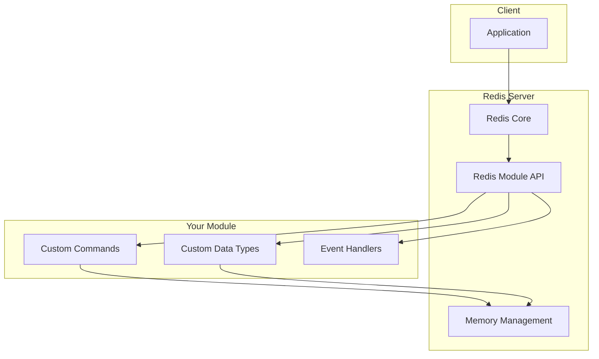
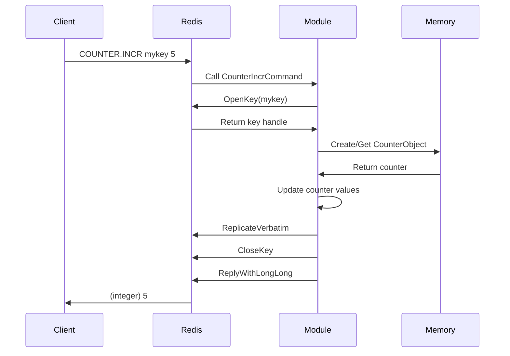
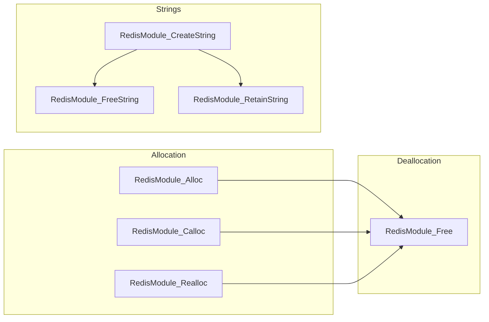

# How to Build Redis Module Development

Author: [nawazdhandala](https://www.github.com/nawazdhandala)

Tags: Redis, Database, Modules, C Programming, Performance, Data Structures

Description: A comprehensive guide to building custom Redis modules in C, covering module architecture, command implementation, data types, and production deployment patterns.

---

Redis modules let you extend Redis with custom commands, data types, and functionality. Instead of working around Redis limitations, you can add exactly what your application needs directly into the database layer.

## Understanding Redis Module Architecture



### Why Build Redis Modules?

| Use Case | Example |
|----------|---------|
| Custom data structures | Time series, graphs, bloom filters |
| Complex operations | Atomic multi-step transactions |
| Integration | Direct database access to external systems |
| Performance | Native C speed for hot paths |
| Domain logic | Business rules at the data layer |

## Setting Up Your Development Environment

### Prerequisites

Before you start, you need the Redis source code for the module API headers.

```bash
# Clone Redis source
git clone https://github.com/redis/redis.git
cd redis

# Build Redis (needed for testing)
make

# The header file you need is at src/redismodule.h
ls src/redismodule.h
```

### Project Structure

Create a clean project structure for your module.

```bash
# Create module project
mkdir my-redis-module && cd my-redis-module

# Set up directory structure
mkdir -p src tests

# Copy the module header
cp /path/to/redis/src/redismodule.h src/
```

Your project layout should look like this:

```
my-redis-module/
├── src/
│   ├── redismodule.h    # Redis module API header
│   ├── module.c         # Main module code
│   └── commands.c       # Command implementations
├── tests/
│   └── test_module.py   # Integration tests
├── Makefile
└── README.md
```

## Creating Your First Module

### Basic Module Template

Start with a minimal module that loads successfully into Redis.

```c
// src/module.c
// This is the entry point for your Redis module.
// Every module needs a RedisModule_OnLoad function that Redis calls at startup.

#include "redismodule.h"
#include <string.h>

// Module initialization function
// Redis calls this when loading the module with MODULE LOAD
int RedisModule_OnLoad(RedisModuleCtx *ctx, RedisModuleString **argv, int argc) {
    // Initialize the module with a name and version
    // REDISMODULE_APIVER_1 ensures API compatibility
    if (RedisModule_Init(ctx, "mymodule", 1, REDISMODULE_APIVER_1) == REDISMODULE_ERR) {
        return REDISMODULE_ERR;
    }

    // Module loaded successfully
    RedisModule_Log(ctx, "notice", "MyModule loaded successfully");
    return REDISMODULE_OK;
}

// Optional: Called when module is unloaded
int RedisModule_OnUnload(RedisModuleCtx *ctx) {
    RedisModule_Log(ctx, "notice", "MyModule unloading");
    return REDISMODULE_OK;
}
```

### Makefile

Create a Makefile to compile your module as a shared library.

```makefile
# Makefile
# Compiles the module as a shared library (.so file)

# Compiler settings
CC = gcc
CFLAGS = -Wall -g -fPIC -std=c99 -O2
LDFLAGS = -shared

# Source files
SRC = src/module.c
OBJ = $(SRC:.c=.o)

# Output
MODULE = mymodule.so

# Build the module
$(MODULE): $(OBJ)
	$(CC) $(LDFLAGS) -o $@ $^

# Compile source files
%.o: %.c
	$(CC) $(CFLAGS) -c $< -o $@

# Clean build artifacts
clean:
	rm -f $(OBJ) $(MODULE)

# Load into Redis for testing
test: $(MODULE)
	redis-server --loadmodule ./$(MODULE)

.PHONY: clean test
```

Build and test the module.

```bash
# Build the module
make

# Test loading (in another terminal, connect with redis-cli)
make test

# In redis-cli, verify the module loaded
redis-cli MODULE LIST
```

## Implementing Custom Commands

### Simple Command

Add a command that performs a basic operation.

```c
// src/commands.c
// Custom command implementations

#include "redismodule.h"
#include <stdlib.h>
#include <string.h>
#include <ctype.h>

// MYMODULE.HELLO - A simple greeting command
// Usage: MYMODULE.HELLO [name]
// Returns a greeting message
int HelloCommand(RedisModuleCtx *ctx, RedisModuleString **argv, int argc) {
    // Validate argument count (command name counts as 1)
    if (argc < 1 || argc > 2) {
        return RedisModule_WrongArity(ctx);
    }

    // Get the name argument or use default
    const char *name = "World";
    if (argc == 2) {
        name = RedisModule_StringPtrLen(argv[1], NULL);
    }

    // Build response string
    char response[256];
    snprintf(response, sizeof(response), "Hello, %s!", name);

    // Return the response
    RedisModule_ReplyWithSimpleString(ctx, response);
    return REDISMODULE_OK;
}

// MYMODULE.MULTIPLY - Multiply two numbers
// Usage: MYMODULE.MULTIPLY num1 num2
// Returns the product as an integer
int MultiplyCommand(RedisModuleCtx *ctx, RedisModuleString **argv, int argc) {
    if (argc != 3) {
        return RedisModule_WrongArity(ctx);
    }

    // Parse arguments as long long integers
    long long num1, num2;
    if (RedisModule_StringToLongLong(argv[1], &num1) != REDISMODULE_OK) {
        return RedisModule_ReplyWithError(ctx, "ERR first argument is not an integer");
    }
    if (RedisModule_StringToLongLong(argv[2], &num2) != REDISMODULE_OK) {
        return RedisModule_ReplyWithError(ctx, "ERR second argument is not an integer");
    }

    // Return the result
    RedisModule_ReplyWithLongLong(ctx, num1 * num2);
    return REDISMODULE_OK;
}
```

### Register Commands in OnLoad

Update your module initialization to register the commands.

```c
// src/module.c (updated)
#include "redismodule.h"

// Declare command functions (defined in commands.c)
int HelloCommand(RedisModuleCtx *ctx, RedisModuleString **argv, int argc);
int MultiplyCommand(RedisModuleCtx *ctx, RedisModuleString **argv, int argc);

int RedisModule_OnLoad(RedisModuleCtx *ctx, RedisModuleString **argv, int argc) {
    if (RedisModule_Init(ctx, "mymodule", 1, REDISMODULE_APIVER_1) == REDISMODULE_ERR) {
        return REDISMODULE_ERR;
    }

    // Register MYMODULE.HELLO command
    // Flags: "readonly" means it doesn't modify data
    //        "fast" means it runs in O(1) time
    if (RedisModule_CreateCommand(ctx, "mymodule.hello",
            HelloCommand, "readonly fast", 0, 0, 0) == REDISMODULE_ERR) {
        return REDISMODULE_ERR;
    }

    // Register MYMODULE.MULTIPLY command
    if (RedisModule_CreateCommand(ctx, "mymodule.multiply",
            MultiplyCommand, "readonly fast", 0, 0, 0) == REDISMODULE_ERR) {
        return REDISMODULE_ERR;
    }

    RedisModule_Log(ctx, "notice", "MyModule loaded with commands");
    return REDISMODULE_OK;
}
```

### Command Flags Reference

| Flag | Description |
|------|-------------|
| write | Command may modify data |
| readonly | Command only reads data |
| fast | Runs in O(1) or O(log N) time |
| slow | May take significant time |
| admin | Administrative command |
| pubsub | Related to pub/sub |
| random | Output may be non-deterministic |
| deny-oom | Reject if out of memory |

## Working with Redis Keys

### Reading and Writing Data

Commands that interact with Redis keys need to handle key operations properly.

```c
// MYMODULE.SETCAPS - Store a string in uppercase
// Usage: MYMODULE.SETCAPS key value
// Stores the uppercase version of value in key
int SetCapsCommand(RedisModuleCtx *ctx, RedisModuleString **argv, int argc) {
    if (argc != 3) {
        return RedisModule_WrongArity(ctx);
    }

    // Open the key for writing
    // RedisModule_OpenKey gives us a handle to work with the key
    RedisModuleKey *key = RedisModule_OpenKey(ctx, argv[1],
        REDISMODULE_READ | REDISMODULE_WRITE);

    // Get the input string
    size_t len;
    const char *input = RedisModule_StringPtrLen(argv[2], &len);

    // Convert to uppercase
    char *upper = RedisModule_Alloc(len + 1);
    for (size_t i = 0; i < len; i++) {
        upper[i] = toupper((unsigned char)input[i]);
    }
    upper[len] = '\0';

    // Create a RedisModuleString from our uppercase string
    RedisModuleString *value = RedisModule_CreateString(ctx, upper, len);

    // Set the key value
    RedisModule_StringSet(key, value);

    // Clean up
    RedisModule_Free(upper);
    RedisModule_CloseKey(key);

    RedisModule_ReplyWithSimpleString(ctx, "OK");
    return REDISMODULE_OK;
}

// MYMODULE.GETCAPS - Get a key and return it in uppercase
// Usage: MYMODULE.GETCAPS key
int GetCapsCommand(RedisModuleCtx *ctx, RedisModuleString **argv, int argc) {
    if (argc != 2) {
        return RedisModule_WrongArity(ctx);
    }

    // Open key for reading only
    RedisModuleKey *key = RedisModule_OpenKey(ctx, argv[1], REDISMODULE_READ);

    // Check if key exists
    if (RedisModule_KeyType(key) == REDISMODULE_KEYTYPE_EMPTY) {
        RedisModule_CloseKey(key);
        return RedisModule_ReplyWithNull(ctx);
    }

    // Check if key is a string
    if (RedisModule_KeyType(key) != REDISMODULE_KEYTYPE_STRING) {
        RedisModule_CloseKey(key);
        return RedisModule_ReplyWithError(ctx, REDISMODULE_ERRORMSG_WRONGTYPE);
    }

    // Get the string value
    size_t len;
    char *value = RedisModule_StringDMA(key, &len, REDISMODULE_READ);

    // Convert to uppercase
    char *upper = RedisModule_Alloc(len + 1);
    for (size_t i = 0; i < len; i++) {
        upper[i] = toupper((unsigned char)value[i]);
    }
    upper[len] = '\0';

    // Reply with the uppercase string
    RedisModule_ReplyWithStringBuffer(ctx, upper, len);

    // Clean up
    RedisModule_Free(upper);
    RedisModule_CloseKey(key);

    return REDISMODULE_OK;
}
```

### Key Type Checking

Always validate key types before operating on them.

```c
// Helper function to validate key type
int ValidateKeyType(RedisModuleCtx *ctx, RedisModuleKey *key, int expected_type) {
    int actual_type = RedisModule_KeyType(key);

    // Empty keys can be used for any type
    if (actual_type == REDISMODULE_KEYTYPE_EMPTY) {
        return REDISMODULE_OK;
    }

    // Check for type mismatch
    if (actual_type != expected_type) {
        RedisModule_ReplyWithError(ctx, REDISMODULE_ERRORMSG_WRONGTYPE);
        return REDISMODULE_ERR;
    }

    return REDISMODULE_OK;
}
```

## Creating Custom Data Types

### Define a Custom Type

Build your own data structure that Redis can store and manage.

```c
// src/counter_type.c
// A custom counter type that tracks increments and decrements separately

#include "redismodule.h"
#include <stdlib.h>

// Our custom data structure
typedef struct CounterObject {
    long long increments;   // Total positive changes
    long long decrements;   // Total negative changes
    long long current;      // Current value
} CounterObject;

// Type handle (set during module load)
static RedisModuleType *CounterType;

// Create a new counter
CounterObject *CreateCounter(void) {
    CounterObject *counter = RedisModule_Alloc(sizeof(CounterObject));
    counter->increments = 0;
    counter->decrements = 0;
    counter->current = 0;
    return counter;
}

// Free a counter
void FreeCounter(void *value) {
    RedisModule_Free(value);
}

// RDB save callback - serialize the counter for persistence
void CounterRdbSave(RedisModuleIO *rdb, void *value) {
    CounterObject *counter = value;
    RedisModule_SaveSigned(rdb, counter->increments);
    RedisModule_SaveSigned(rdb, counter->decrements);
    RedisModule_SaveSigned(rdb, counter->current);
}

// RDB load callback - deserialize the counter from persistence
void *CounterRdbLoad(RedisModuleIO *rdb, int encver) {
    if (encver != 0) {
        return NULL;  // Unknown encoding version
    }

    CounterObject *counter = CreateCounter();
    counter->increments = RedisModule_LoadSigned(rdb);
    counter->decrements = RedisModule_LoadSigned(rdb);
    counter->current = RedisModule_LoadSigned(rdb);
    return counter;
}

// AOF rewrite callback - generate commands to recreate the counter
void CounterAofRewrite(RedisModuleIO *aof, RedisModuleString *key, void *value) {
    CounterObject *counter = value;

    // Emit a command that will recreate this counter
    RedisModule_EmitAOF(aof, "COUNTER.SET", "slll", key,
        counter->current, counter->increments, counter->decrements);
}

// Memory usage callback
size_t CounterMemUsage(const void *value) {
    return sizeof(CounterObject);
}

// Register the type during module load
int RegisterCounterType(RedisModuleCtx *ctx) {
    RedisModuleTypeMethods tm = {
        .version = REDISMODULE_TYPE_METHOD_VERSION,
        .rdb_load = CounterRdbLoad,
        .rdb_save = CounterRdbSave,
        .aof_rewrite = CounterAofRewrite,
        .free = FreeCounter,
        .mem_usage = CounterMemUsage,
    };

    CounterType = RedisModule_CreateDataType(ctx, "counter--", 0, &tm);
    if (CounterType == NULL) {
        return REDISMODULE_ERR;
    }

    return REDISMODULE_OK;
}
```

### Commands for Custom Type

Implement commands that work with your custom type.

```c
// COUNTER.INCR key [amount]
// Increment the counter by amount (default 1)
int CounterIncrCommand(RedisModuleCtx *ctx, RedisModuleString **argv, int argc) {
    if (argc < 2 || argc > 3) {
        return RedisModule_WrongArity(ctx);
    }

    // Get increment amount
    long long amount = 1;
    if (argc == 3) {
        if (RedisModule_StringToLongLong(argv[2], &amount) != REDISMODULE_OK) {
            return RedisModule_ReplyWithError(ctx, "ERR invalid increment");
        }
    }

    // Open the key
    RedisModuleKey *key = RedisModule_OpenKey(ctx, argv[1],
        REDISMODULE_READ | REDISMODULE_WRITE);

    int type = RedisModule_KeyType(key);
    CounterObject *counter;

    if (type == REDISMODULE_KEYTYPE_EMPTY) {
        // Create new counter
        counter = CreateCounter();
        RedisModule_ModuleTypeSetValue(key, CounterType, counter);
    } else if (RedisModule_ModuleTypeGetType(key) == CounterType) {
        // Get existing counter
        counter = RedisModule_ModuleTypeGetValue(key);
    } else {
        RedisModule_CloseKey(key);
        return RedisModule_ReplyWithError(ctx, REDISMODULE_ERRORMSG_WRONGTYPE);
    }

    // Update the counter
    counter->current += amount;
    if (amount > 0) {
        counter->increments += amount;
    } else {
        counter->decrements += (-amount);
    }

    // Notify keyspace
    RedisModule_ReplicateVerbatim(ctx);

    RedisModule_CloseKey(key);
    RedisModule_ReplyWithLongLong(ctx, counter->current);
    return REDISMODULE_OK;
}

// COUNTER.GET key
// Get the current counter value
int CounterGetCommand(RedisModuleCtx *ctx, RedisModuleString **argv, int argc) {
    if (argc != 2) {
        return RedisModule_WrongArity(ctx);
    }

    RedisModuleKey *key = RedisModule_OpenKey(ctx, argv[1], REDISMODULE_READ);

    if (RedisModule_KeyType(key) == REDISMODULE_KEYTYPE_EMPTY) {
        RedisModule_CloseKey(key);
        return RedisModule_ReplyWithNull(ctx);
    }

    if (RedisModule_ModuleTypeGetType(key) != CounterType) {
        RedisModule_CloseKey(key);
        return RedisModule_ReplyWithError(ctx, REDISMODULE_ERRORMSG_WRONGTYPE);
    }

    CounterObject *counter = RedisModule_ModuleTypeGetValue(key);

    RedisModule_CloseKey(key);
    RedisModule_ReplyWithLongLong(ctx, counter->current);
    return REDISMODULE_OK;
}

// COUNTER.STATS key
// Get detailed counter statistics
int CounterStatsCommand(RedisModuleCtx *ctx, RedisModuleString **argv, int argc) {
    if (argc != 2) {
        return RedisModule_WrongArity(ctx);
    }

    RedisModuleKey *key = RedisModule_OpenKey(ctx, argv[1], REDISMODULE_READ);

    if (RedisModule_KeyType(key) == REDISMODULE_KEYTYPE_EMPTY) {
        RedisModule_CloseKey(key);
        return RedisModule_ReplyWithNull(ctx);
    }

    if (RedisModule_ModuleTypeGetType(key) != CounterType) {
        RedisModule_CloseKey(key);
        return RedisModule_ReplyWithError(ctx, REDISMODULE_ERRORMSG_WRONGTYPE);
    }

    CounterObject *counter = RedisModule_ModuleTypeGetValue(key);

    // Reply with an array of field-value pairs
    RedisModule_ReplyWithArray(ctx, 6);
    RedisModule_ReplyWithSimpleString(ctx, "current");
    RedisModule_ReplyWithLongLong(ctx, counter->current);
    RedisModule_ReplyWithSimpleString(ctx, "increments");
    RedisModule_ReplyWithLongLong(ctx, counter->increments);
    RedisModule_ReplyWithSimpleString(ctx, "decrements");
    RedisModule_ReplyWithLongLong(ctx, counter->decrements);

    RedisModule_CloseKey(key);
    return REDISMODULE_OK;
}
```

## Module Data Flow



## Blocking Commands

### Long-Running Operations

For operations that take time, use blocking commands to avoid blocking other clients.

```c
// Blocking command example - wait for a condition
// MYMODULE.WAITFOR key value timeout_ms

typedef struct WaitContext {
    RedisModuleString *key;
    RedisModuleString *expected;
    RedisModuleBlockedClient *bc;
} WaitContext;

// Called when the blocking operation completes
int WaitReply(RedisModuleCtx *ctx, RedisModuleString **argv, int argc) {
    REDISMODULE_NOT_USED(argv);
    REDISMODULE_NOT_USED(argc);

    RedisModule_ReplyWithSimpleString(ctx, "OK");
    return REDISMODULE_OK;
}

// Called when the operation times out
int WaitTimeout(RedisModuleCtx *ctx, RedisModuleString **argv, int argc) {
    REDISMODULE_NOT_USED(argv);
    REDISMODULE_NOT_USED(argc);

    RedisModule_ReplyWithNull(ctx);
    return REDISMODULE_OK;
}

// Free the waiting context
void WaitFreeData(RedisModuleCtx *ctx, void *privdata) {
    REDISMODULE_NOT_USED(ctx);
    WaitContext *wc = privdata;
    RedisModule_FreeString(NULL, wc->key);
    RedisModule_FreeString(NULL, wc->expected);
    RedisModule_Free(wc);
}

// The actual blocking command
int WaitForCommand(RedisModuleCtx *ctx, RedisModuleString **argv, int argc) {
    if (argc != 4) {
        return RedisModule_WrongArity(ctx);
    }

    long long timeout_ms;
    if (RedisModule_StringToLongLong(argv[3], &timeout_ms) != REDISMODULE_OK) {
        return RedisModule_ReplyWithError(ctx, "ERR invalid timeout");
    }

    // Check if condition is already met
    RedisModuleKey *key = RedisModule_OpenKey(ctx, argv[1], REDISMODULE_READ);
    if (RedisModule_KeyType(key) == REDISMODULE_KEYTYPE_STRING) {
        size_t len1, len2;
        const char *val = RedisModule_StringDMA(key, &len1, REDISMODULE_READ);
        const char *expected = RedisModule_StringPtrLen(argv[2], &len2);

        if (len1 == len2 && memcmp(val, expected, len1) == 0) {
            RedisModule_CloseKey(key);
            return RedisModule_ReplyWithSimpleString(ctx, "OK");
        }
    }
    RedisModule_CloseKey(key);

    // Block the client
    WaitContext *wc = RedisModule_Alloc(sizeof(WaitContext));
    wc->key = RedisModule_CreateStringFromString(ctx, argv[1]);
    wc->expected = RedisModule_CreateStringFromString(ctx, argv[2]);

    wc->bc = RedisModule_BlockClient(ctx, WaitReply, WaitTimeout,
        WaitFreeData, timeout_ms);

    // Store context for later (in real code, use a proper data structure)
    // This is simplified - actual implementation needs keyspace notifications

    return REDISMODULE_OK;
}
```

## Memory Management Best Practices



### Memory Allocation Rules

Follow these rules to avoid memory leaks and crashes.

```c
// Always use Redis memory functions, not standard malloc/free
// This ensures Redis can track memory usage

// Good: Use Redis allocator
void *ptr = RedisModule_Alloc(size);
RedisModule_Free(ptr);

// Bad: Don't mix allocators
void *ptr = malloc(size);      // Don't do this
RedisModule_Free(ptr);         // Crash or corruption

// Strings have special handling
RedisModuleString *str = RedisModule_CreateString(ctx, "hello", 5);

// If you need to keep a string beyond the command context
RedisModule_RetainString(ctx, str);

// Later, free it
RedisModule_FreeString(ctx, str);
```

### Avoiding Memory Leaks

Common patterns that cause memory leaks and how to fix them.

```c
// Problem: Early return without cleanup
int LeakyCommand(RedisModuleCtx *ctx, RedisModuleString **argv, int argc) {
    char *buffer = RedisModule_Alloc(1024);

    if (argc != 2) {
        // Memory leak! buffer is never freed
        return RedisModule_WrongArity(ctx);
    }

    RedisModule_Free(buffer);
    return REDISMODULE_OK;
}

// Solution: Clean up before returning
int SafeCommand(RedisModuleCtx *ctx, RedisModuleString **argv, int argc) {
    if (argc != 2) {
        return RedisModule_WrongArity(ctx);
    }

    char *buffer = RedisModule_Alloc(1024);
    // ... use buffer ...
    RedisModule_Free(buffer);

    return REDISMODULE_OK;
}

// Better: Use goto for cleanup (common C pattern)
int BetterCommand(RedisModuleCtx *ctx, RedisModuleString **argv, int argc) {
    char *buffer = NULL;
    RedisModuleKey *key = NULL;
    int result = REDISMODULE_ERR;

    if (argc != 2) {
        RedisModule_WrongArity(ctx);
        goto cleanup;
    }

    buffer = RedisModule_Alloc(1024);
    key = RedisModule_OpenKey(ctx, argv[1], REDISMODULE_READ);

    // ... do work ...

    RedisModule_ReplyWithSimpleString(ctx, "OK");
    result = REDISMODULE_OK;

cleanup:
    if (buffer) RedisModule_Free(buffer);
    if (key) RedisModule_CloseKey(key);
    return result;
}
```

## Testing Your Module

### Integration Tests with Python

Write tests that exercise your module through the Redis protocol.

```python
# tests/test_module.py
# Integration tests for the custom Redis module

import redis
import pytest
import subprocess
import time
import os

@pytest.fixture(scope="module")
def redis_server():
    """Start Redis with our module loaded."""
    module_path = os.path.abspath("./mymodule.so")

    proc = subprocess.Popen([
        "redis-server",
        "--port", "6399",
        "--loadmodule", module_path
    ], stdout=subprocess.PIPE, stderr=subprocess.PIPE)

    time.sleep(1)  # Wait for server to start

    yield proc

    proc.terminate()
    proc.wait()

@pytest.fixture
def client(redis_server):
    """Create a Redis client connected to our test server."""
    r = redis.Redis(host='localhost', port=6399, decode_responses=True)
    r.flushall()
    yield r
    r.close()

class TestHelloCommand:
    def test_hello_default(self, client):
        result = client.execute_command("MYMODULE.HELLO")
        assert result == "Hello, World!"

    def test_hello_with_name(self, client):
        result = client.execute_command("MYMODULE.HELLO", "Redis")
        assert result == "Hello, Redis!"

class TestMultiplyCommand:
    def test_multiply_positive(self, client):
        result = client.execute_command("MYMODULE.MULTIPLY", 6, 7)
        assert result == 42

    def test_multiply_negative(self, client):
        result = client.execute_command("MYMODULE.MULTIPLY", -5, 3)
        assert result == -15

    def test_multiply_invalid_arg(self, client):
        with pytest.raises(redis.ResponseError):
            client.execute_command("MYMODULE.MULTIPLY", "abc", 5)

class TestCounterType:
    def test_counter_incr(self, client):
        result = client.execute_command("COUNTER.INCR", "mycounter", 5)
        assert result == 5

        result = client.execute_command("COUNTER.INCR", "mycounter", 3)
        assert result == 8

    def test_counter_get(self, client):
        client.execute_command("COUNTER.INCR", "mycounter", 10)
        result = client.execute_command("COUNTER.GET", "mycounter")
        assert result == 10

    def test_counter_stats(self, client):
        client.execute_command("COUNTER.INCR", "mycounter", 5)
        client.execute_command("COUNTER.INCR", "mycounter", -2)

        stats = client.execute_command("COUNTER.STATS", "mycounter")
        # Parse the array response
        stats_dict = dict(zip(stats[::2], stats[1::2]))

        assert stats_dict["current"] == 3
        assert stats_dict["increments"] == 5
        assert stats_dict["decrements"] == 2

    def test_counter_persistence(self, client, redis_server):
        """Test that counter survives restart."""
        client.execute_command("COUNTER.INCR", "persistent", 100)
        client.execute_command("BGSAVE")
        time.sleep(0.5)  # Wait for save

        # Restart would be tested here in a full integration test
```

Run the tests.

```bash
# Install pytest and redis-py
pip install pytest redis

# Run tests
pytest tests/ -v
```

## Production Deployment

### Building for Production

Compile with optimizations and without debug symbols.

```makefile
# Production build settings
release:
	$(CC) -Wall -O3 -fPIC -DNDEBUG -shared -o $(MODULE) $(SRC)
	strip $(MODULE)
```

### Loading the Module

There are several ways to load your module into Redis.

```bash
# Option 1: Command line argument
redis-server --loadmodule /path/to/mymodule.so

# Option 2: In redis.conf
loadmodule /path/to/mymodule.so

# Option 3: At runtime (requires enabling in config)
redis-cli MODULE LOAD /path/to/mymodule.so
```

### Configuration with Arguments

Pass configuration to your module at load time.

```c
int RedisModule_OnLoad(RedisModuleCtx *ctx, RedisModuleString **argv, int argc) {
    if (RedisModule_Init(ctx, "mymodule", 1, REDISMODULE_APIVER_1) == REDISMODULE_ERR) {
        return REDISMODULE_ERR;
    }

    // Parse module arguments
    int max_connections = 100;  // default

    for (int i = 0; i < argc; i++) {
        const char *arg = RedisModule_StringPtrLen(argv[i], NULL);

        if (strncmp(arg, "max_connections=", 16) == 0) {
            max_connections = atoi(arg + 16);
        }
    }

    RedisModule_Log(ctx, "notice", "Max connections set to %d", max_connections);
    return REDISMODULE_OK;
}
```

Load with arguments.

```bash
redis-server --loadmodule ./mymodule.so max_connections=500
```

## Debugging Tips

### Enable Debug Logging

Add verbose logging during development.

```c
// Use different log levels for different situations
RedisModule_Log(ctx, "debug", "Processing key: %s", keyname);
RedisModule_Log(ctx, "verbose", "Counter value: %lld", counter->current);
RedisModule_Log(ctx, "notice", "Module initialized");
RedisModule_Log(ctx, "warning", "Deprecated command used");
```

### Use GDB for Debugging

Debug crashes with GDB.

```bash
# Start Redis under GDB
gdb --args redis-server --loadmodule ./mymodule.so

# In GDB
(gdb) run
# When it crashes
(gdb) bt        # Show backtrace
(gdb) info locals   # Show local variables
```

### Valgrind for Memory Issues

Check for memory leaks.

```bash
valgrind --leak-check=full redis-server --loadmodule ./mymodule.so
```

## Real World Example: Rate Limiter Module

A practical module that implements token bucket rate limiting.

```c
// src/ratelimit.c
// Token bucket rate limiter module

#include "redismodule.h"
#include <sys/time.h>

// Get current time in milliseconds
long long CurrentTimeMs(void) {
    struct timeval tv;
    gettimeofday(&tv, NULL);
    return (long long)tv.tv_sec * 1000 + tv.tv_usec / 1000;
}

// RATELIMIT.CHECK key max_tokens refill_rate_per_sec [tokens_to_consume]
// Returns 1 if allowed, 0 if rate limited
int RateLimitCheckCommand(RedisModuleCtx *ctx, RedisModuleString **argv, int argc) {
    if (argc < 4 || argc > 5) {
        return RedisModule_WrongArity(ctx);
    }

    // Parse arguments
    long long max_tokens, refill_rate;
    if (RedisModule_StringToLongLong(argv[2], &max_tokens) != REDISMODULE_OK ||
        RedisModule_StringToLongLong(argv[3], &refill_rate) != REDISMODULE_OK) {
        return RedisModule_ReplyWithError(ctx, "ERR invalid arguments");
    }

    long long tokens_to_consume = 1;
    if (argc == 5) {
        if (RedisModule_StringToLongLong(argv[4], &tokens_to_consume) != REDISMODULE_OK) {
            return RedisModule_ReplyWithError(ctx, "ERR invalid token count");
        }
    }

    long long now = CurrentTimeMs();

    // Open the key
    RedisModuleKey *key = RedisModule_OpenKey(ctx, argv[1],
        REDISMODULE_READ | REDISMODULE_WRITE);

    long long tokens, last_update;

    if (RedisModule_KeyType(key) == REDISMODULE_KEYTYPE_EMPTY) {
        // New bucket starts full
        tokens = max_tokens;
        last_update = now;
    } else {
        // Read existing state from hash
        RedisModuleCallReply *reply;

        reply = RedisModule_Call(ctx, "HGET", "sc", argv[1], "tokens");
        if (RedisModule_CallReplyType(reply) == REDISMODULE_REPLY_STRING) {
            RedisModule_StringToLongLong(
                RedisModule_CreateStringFromCallReply(reply), &tokens);
        } else {
            tokens = max_tokens;
        }

        reply = RedisModule_Call(ctx, "HGET", "sc", argv[1], "last_update");
        if (RedisModule_CallReplyType(reply) == REDISMODULE_REPLY_STRING) {
            RedisModule_StringToLongLong(
                RedisModule_CreateStringFromCallReply(reply), &last_update);
        } else {
            last_update = now;
        }
    }

    // Refill tokens based on elapsed time
    long long elapsed = now - last_update;
    long long refill = (elapsed * refill_rate) / 1000;
    tokens = tokens + refill;
    if (tokens > max_tokens) {
        tokens = max_tokens;
    }

    // Check if we have enough tokens
    int allowed = 0;
    if (tokens >= tokens_to_consume) {
        tokens -= tokens_to_consume;
        allowed = 1;
    }

    // Update state
    RedisModule_Call(ctx, "HSET", "sclcl", argv[1],
        "tokens", tokens,
        "last_update", now);

    RedisModule_CloseKey(key);

    // Reply with result and remaining tokens
    RedisModule_ReplyWithArray(ctx, 2);
    RedisModule_ReplyWithLongLong(ctx, allowed);
    RedisModule_ReplyWithLongLong(ctx, tokens);

    return REDISMODULE_OK;
}
```

Usage example:

```bash
# Allow 100 requests per second, check one request
redis-cli RATELIMIT.CHECK user:123 100 100
# Returns: 1) (integer) 1  <- allowed
#          2) (integer) 99 <- remaining tokens

# After many requests...
redis-cli RATELIMIT.CHECK user:123 100 100
# Returns: 1) (integer) 0  <- rate limited
#          2) (integer) 0  <- no tokens left
```

## Summary

Building Redis modules gives you the power to extend Redis with custom functionality tailored to your application needs. Start with simple commands, then progress to custom data types as you become comfortable with the API. Always use the Redis memory allocator, handle errors properly, and write tests to verify your module works correctly.

Key takeaways:

1. Use the Redis Module API header from the Redis source code
2. Register commands with appropriate flags for read/write behavior
3. Implement RDB and AOF callbacks for persistence of custom types
4. Use Redis memory functions exclusively
5. Test thoroughly with both unit tests and integration tests
6. Profile memory usage and performance before production deployment

---

Redis modules are a powerful way to push logic into your data layer. By writing custom commands and data types, you eliminate round trips between your application and database, reduce complexity, and improve performance for your specific use cases.
