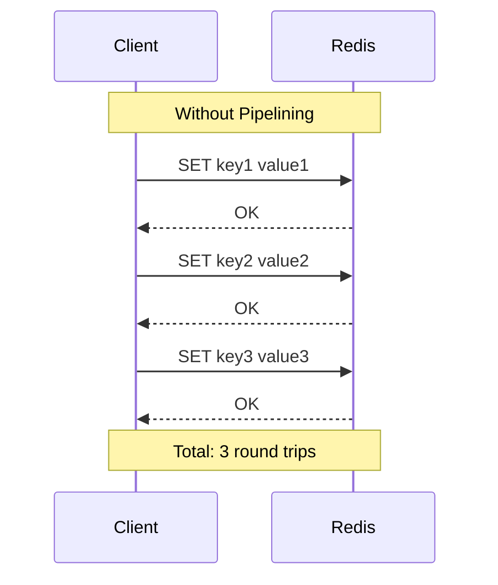
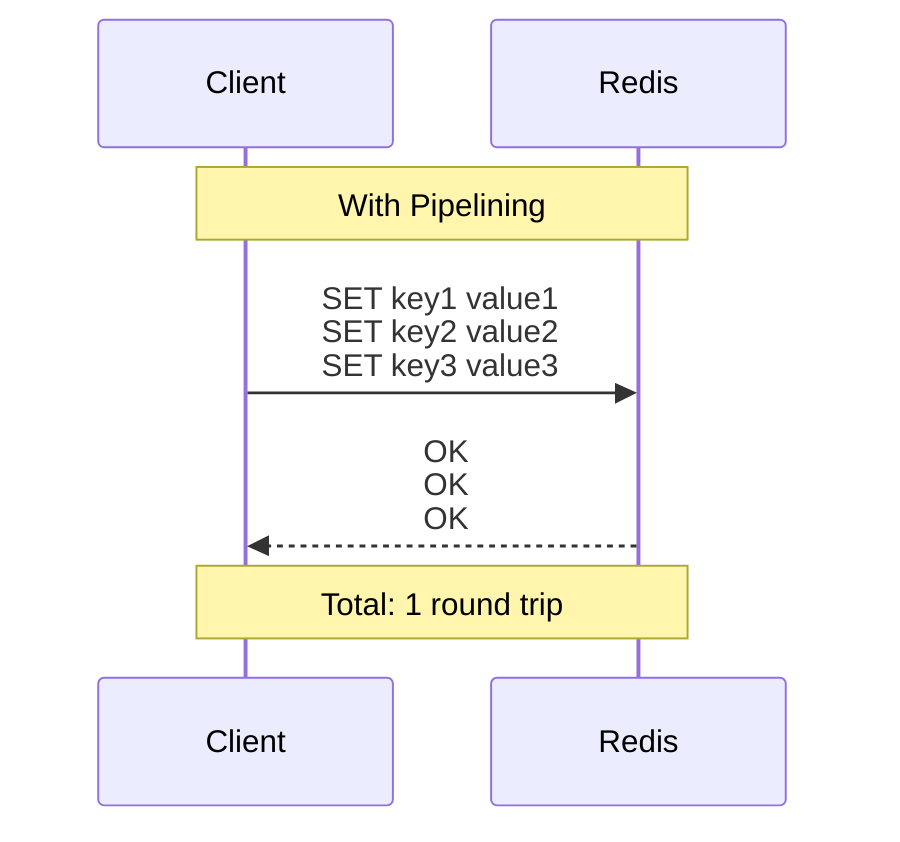
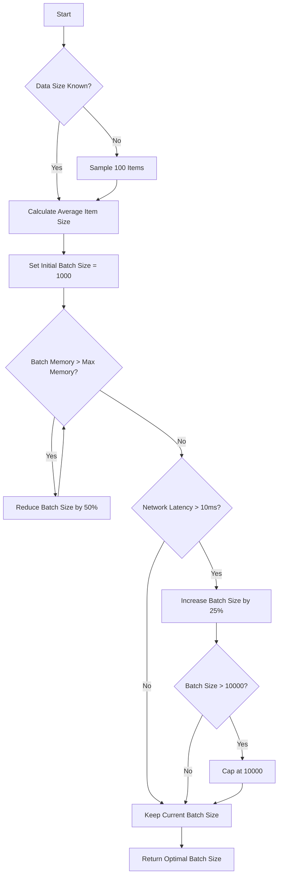
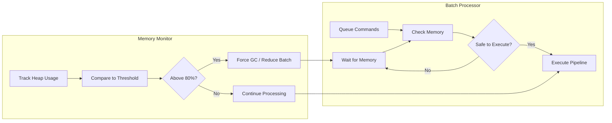
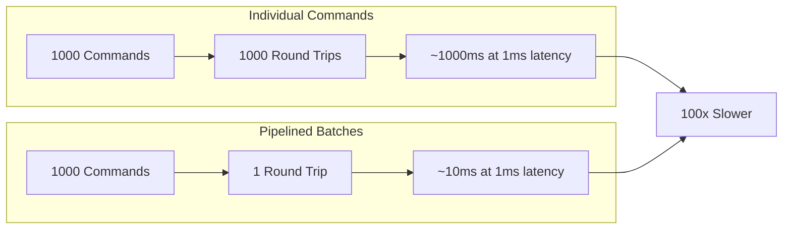

# How to Implement Redis Pipeline Batching

Author: [nawazdhandala](https://github.com/nawazdhandala)

Tags: Redis, Pipelining, Batching, Performance

Description: Learn to implement Redis pipelining for batch operations with optimal batch sizes, memory considerations, and error handling patterns.

---

Redis pipelining is a powerful technique that can dramatically improve the performance of your Redis operations. Instead of sending commands one at a time and waiting for each response, pipelining allows you to send multiple commands in a single network round trip. This article explores how to implement Redis pipeline batching effectively, covering optimal batch sizes, memory considerations, and robust error handling patterns.

## Understanding Redis Pipelining

When you execute Redis commands without pipelining, each command follows a request-response cycle. The client sends a command, waits for the response, then sends the next command. This approach introduces significant network latency, especially when executing many commands.



With pipelining, multiple commands are sent together, and responses are collected in bulk:



## Basic Pipeline Implementation

Let us start with a basic implementation using Node.js and the ioredis library:

```typescript
import Redis from 'ioredis';

const redis = new Redis({
  host: 'localhost',
  port: 6379,
});

async function basicPipeline(): Promise<void> {
  const pipeline = redis.pipeline();

  // Queue multiple commands
  pipeline.set('user:1:name', 'Alice');
  pipeline.set('user:1:email', 'alice@example.com');
  pipeline.set('user:1:age', '30');
  pipeline.get('user:1:name');

  // Execute all commands in one round trip
  const results = await pipeline.exec();

  // Results is an array of [error, result] tuples
  results?.forEach(([err, result], index) => {
    if (err) {
      console.error(`Command ${index} failed:`, err);
    } else {
      console.log(`Command ${index} result:`, result);
    }
  });
}
```

## Implementing Batch Processing

When dealing with large datasets, you need to split operations into manageable batches. Here is a reusable batch processor:

```typescript
interface BatchConfig {
  batchSize: number;
  maxMemoryMB: number;
  onProgress?: (processed: number, total: number) => void;
}

class RedisBatchProcessor {
  private redis: Redis;
  private config: BatchConfig;

  constructor(redis: Redis, config: Partial<BatchConfig> = {}) {
    this.redis = redis;
    this.config = {
      batchSize: 1000,
      maxMemoryMB: 64,
      ...config,
    };
  }

  async batchSet(
    data: Map<string, string>
  ): Promise<{ success: number; failed: number }> {
    const entries = Array.from(data.entries());
    const totalItems = entries.length;
    let processed = 0;
    let success = 0;
    let failed = 0;

    // Process in batches
    for (let i = 0; i < totalItems; i += this.config.batchSize) {
      const batch = entries.slice(i, i + this.config.batchSize);
      const pipeline = this.redis.pipeline();

      // Add commands to pipeline
      for (const [key, value] of batch) {
        pipeline.set(key, value);
      }

      // Execute batch
      const results = await pipeline.exec();

      // Process results
      results?.forEach(([err]) => {
        if (err) {
          failed++;
        } else {
          success++;
        }
      });

      processed += batch.length;
      this.config.onProgress?.(processed, totalItems);
    }

    return { success, failed };
  }

  async batchGet(keys: string[]): Promise<Map<string, string | null>> {
    const results = new Map<string, string | null>();
    const totalKeys = keys.length;

    for (let i = 0; i < totalKeys; i += this.config.batchSize) {
      const batch = keys.slice(i, i + this.config.batchSize);
      const pipeline = this.redis.pipeline();

      for (const key of batch) {
        pipeline.get(key);
      }

      const responses = await pipeline.exec();

      responses?.forEach(([err, value], index) => {
        const key = batch[index];
        if (key) {
          results.set(key, err ? null : (value as string | null));
        }
      });

      this.config.onProgress?.(Math.min(i + this.config.batchSize, totalKeys), totalKeys);
    }

    return results;
  }
}
```

## Choosing the Optimal Batch Size

The ideal batch size depends on several factors including network latency, data size, and available memory. Here is the flow for determining optimal batch size:



Here is a practical implementation of adaptive batch sizing:

```typescript
interface AdaptiveBatchConfig {
  minBatchSize: number;
  maxBatchSize: number;
  targetLatencyMs: number;
  maxMemoryMB: number;
}

class AdaptiveBatchProcessor {
  private redis: Redis;
  private config: AdaptiveBatchConfig;
  private currentBatchSize: number;

  constructor(redis: Redis, config: Partial<AdaptiveBatchConfig> = {}) {
    this.redis = redis;
    this.config = {
      minBatchSize: 100,
      maxBatchSize: 10000,
      targetLatencyMs: 50,
      maxMemoryMB: 64,
      ...config,
    };
    this.currentBatchSize = 1000;
  }

  private estimateMemoryUsage(items: Array<[string, string]>): number {
    // Estimate memory in bytes
    let totalBytes = 0;
    for (const [key, value] of items) {
      totalBytes += Buffer.byteLength(key, 'utf8');
      totalBytes += Buffer.byteLength(value, 'utf8');
    }
    return totalBytes;
  }

  private adjustBatchSize(executionTimeMs: number, memoryUsageMB: number): void {
    const { minBatchSize, maxBatchSize, targetLatencyMs, maxMemoryMB } = this.config;

    // Reduce batch size if memory is too high
    if (memoryUsageMB > maxMemoryMB * 0.8) {
      this.currentBatchSize = Math.max(
        minBatchSize,
        Math.floor(this.currentBatchSize * 0.7)
      );
      return;
    }

    // Adjust based on latency
    if (executionTimeMs > targetLatencyMs * 1.5) {
      // Too slow - reduce batch size
      this.currentBatchSize = Math.max(
        minBatchSize,
        Math.floor(this.currentBatchSize * 0.8)
      );
    } else if (executionTimeMs < targetLatencyMs * 0.5) {
      // Too fast - increase batch size
      this.currentBatchSize = Math.min(
        maxBatchSize,
        Math.floor(this.currentBatchSize * 1.2)
      );
    }
  }

  async processWithAdaptiveBatching(
    data: Map<string, string>
  ): Promise<void> {
    const entries = Array.from(data.entries());
    let processed = 0;

    while (processed < entries.length) {
      const batch = entries.slice(processed, processed + this.currentBatchSize);

      // Check memory before processing
      const memoryUsageMB = this.estimateMemoryUsage(batch) / (1024 * 1024);

      if (memoryUsageMB > this.config.maxMemoryMB) {
        // Reduce batch size for this iteration
        const reducedSize = Math.floor(
          this.currentBatchSize * (this.config.maxMemoryMB / memoryUsageMB)
        );
        const reducedBatch = entries.slice(processed, processed + reducedSize);

        await this.executeBatch(reducedBatch);
        processed += reducedBatch.length;
        continue;
      }

      const startTime = Date.now();
      await this.executeBatch(batch);
      const executionTime = Date.now() - startTime;

      this.adjustBatchSize(executionTime, memoryUsageMB);
      processed += batch.length;

      console.log(
        `Processed ${processed}/${entries.length}, ` +
        `batch size: ${this.currentBatchSize}, ` +
        `execution time: ${executionTime}ms`
      );
    }
  }

  private async executeBatch(batch: Array<[string, string]>): Promise<void> {
    const pipeline = this.redis.pipeline();

    for (const [key, value] of batch) {
      pipeline.set(key, value);
    }

    await pipeline.exec();
  }
}
```

## Memory Management and Limits

When working with large batches, memory management becomes critical. Here is how to implement memory-aware batching:



```typescript
interface MemoryConfig {
  maxHeapUsageMB: number;
  gcThresholdMB: number;
  checkIntervalMs: number;
}

class MemoryAwareBatchProcessor {
  private redis: Redis;
  private memoryConfig: MemoryConfig;
  private isProcessing: boolean = false;

  constructor(redis: Redis, memoryConfig: Partial<MemoryConfig> = {}) {
    this.redis = redis;
    this.memoryConfig = {
      maxHeapUsageMB: 512,
      gcThresholdMB: 400,
      checkIntervalMs: 100,
      ...memoryConfig,
    };
  }

  private getHeapUsageMB(): number {
    const usage = process.memoryUsage();
    return usage.heapUsed / (1024 * 1024);
  }

  private async waitForMemory(): Promise<void> {
    while (this.getHeapUsageMB() > this.memoryConfig.gcThresholdMB) {
      // Suggest garbage collection if available
      if (global.gc) {
        global.gc();
      }

      await new Promise(resolve =>
        setTimeout(resolve, this.memoryConfig.checkIntervalMs)
      );
    }
  }

  async processBatchWithMemoryLimit<T>(
    items: T[],
    batchSize: number,
    processItem: (pipeline: ReturnType<Redis['pipeline']>, item: T) => void
  ): Promise<Array<[Error | null, unknown]>> {
    const allResults: Array<[Error | null, unknown]> = [];

    for (let i = 0; i < items.length; i += batchSize) {
      // Wait if memory is too high
      await this.waitForMemory();

      const batch = items.slice(i, i + batchSize);
      const pipeline = this.redis.pipeline();

      for (const item of batch) {
        processItem(pipeline, item);
      }

      const results = await pipeline.exec();

      if (results) {
        allResults.push(...results);
      }

      // Log memory usage periodically
      if (i % (batchSize * 10) === 0) {
        console.log(
          `Progress: ${i}/${items.length}, ` +
          `Heap usage: ${this.getHeapUsageMB().toFixed(2)}MB`
        );
      }
    }

    return allResults;
  }
}
```

## Error Handling Patterns

Robust error handling is essential for production systems. Here are patterns for handling pipeline errors:

```typescript
interface RetryConfig {
  maxRetries: number;
  baseDelayMs: number;
  maxDelayMs: number;
}

class ResilientBatchProcessor {
  private redis: Redis;
  private retryConfig: RetryConfig;

  constructor(redis: Redis, retryConfig: Partial<RetryConfig> = {}) {
    this.redis = redis;
    this.retryConfig = {
      maxRetries: 3,
      baseDelayMs: 100,
      maxDelayMs: 5000,
      ...retryConfig,
    };
  }

  private async delay(ms: number): Promise<void> {
    return new Promise(resolve => setTimeout(resolve, ms));
  }

  private calculateBackoff(attempt: number): number {
    const delay = this.retryConfig.baseDelayMs * Math.pow(2, attempt);
    return Math.min(delay, this.retryConfig.maxDelayMs);
  }

  async executeBatchWithRetry(
    commands: Array<{ cmd: string; args: (string | number)[] }>
  ): Promise<{
    results: Array<{ success: boolean; value?: unknown; error?: Error }>;
    failedCommands: typeof commands;
  }> {
    let remainingCommands = [...commands];
    const results: Array<{ success: boolean; value?: unknown; error?: Error }> =
      new Array(commands.length);

    // Track original indices
    const indexMap = new Map<number, number>();
    remainingCommands.forEach((_, i) => indexMap.set(i, i));

    for (let attempt = 0; attempt <= this.retryConfig.maxRetries; attempt++) {
      if (remainingCommands.length === 0) break;

      const pipeline = this.redis.pipeline();

      for (const command of remainingCommands) {
        (pipeline as any)[command.cmd](...command.args);
      }

      try {
        const responses = await pipeline.exec();
        const failedIndices: number[] = [];

        responses?.forEach(([err, value], batchIndex) => {
          const originalIndex = indexMap.get(batchIndex);
          if (originalIndex === undefined) return;

          if (err) {
            // Check if error is retryable
            if (this.isRetryableError(err) && attempt < this.retryConfig.maxRetries) {
              failedIndices.push(batchIndex);
            } else {
              results[originalIndex] = { success: false, error: err as Error };
            }
          } else {
            results[originalIndex] = { success: true, value };
          }
        });

        // Prepare for retry
        if (failedIndices.length > 0 && attempt < this.retryConfig.maxRetries) {
          remainingCommands = failedIndices.map(i => remainingCommands[i]!);

          // Update index map
          const newIndexMap = new Map<number, number>();
          failedIndices.forEach((oldIndex, newIndex) => {
            const originalIndex = indexMap.get(oldIndex);
            if (originalIndex !== undefined) {
              newIndexMap.set(newIndex, originalIndex);
            }
          });
          indexMap.clear();
          newIndexMap.forEach((v, k) => indexMap.set(k, v));

          await this.delay(this.calculateBackoff(attempt));
        } else {
          remainingCommands = [];
        }
      } catch (error) {
        // Connection error - retry entire batch
        if (attempt < this.retryConfig.maxRetries) {
          await this.delay(this.calculateBackoff(attempt));
        } else {
          // Mark all remaining as failed
          remainingCommands.forEach((_, batchIndex) => {
            const originalIndex = indexMap.get(batchIndex);
            if (originalIndex !== undefined) {
              results[originalIndex] = {
                success: false,
                error: error as Error
              };
            }
          });
          remainingCommands = [];
        }
      }
    }

    const failedCommands = commands.filter((_, i) => !results[i]?.success);

    return { results, failedCommands };
  }

  private isRetryableError(error: Error): boolean {
    const retryableMessages = [
      'BUSY',
      'LOADING',
      'MASTERDOWN',
      'READONLY',
      'CLUSTERDOWN',
    ];

    return retryableMessages.some(msg =>
      error.message?.includes(msg)
    );
  }
}
```

## Response Handling Strategies

When processing pipeline responses, you need strategies for handling mixed results:

```typescript
interface PipelineResult<T> {
  successful: Array<{ index: number; value: T }>;
  failed: Array<{ index: number; error: Error }>;
}

function processPipelineResults<T>(
  results: Array<[Error | null, unknown]> | null
): PipelineResult<T> {
  const successful: Array<{ index: number; value: T }> = [];
  const failed: Array<{ index: number; error: Error }> = [];

  results?.forEach(([err, value], index) => {
    if (err) {
      failed.push({ index, error: err as Error });
    } else {
      successful.push({ index, value: value as T });
    }
  });

  return { successful, failed };
}

// Example usage with different response handling strategies
async function demonstrateResponseHandling(redis: Redis): Promise<void> {
  const pipeline = redis.pipeline();

  // Mix of different commands
  pipeline.set('key1', 'value1');
  pipeline.get('key1');
  pipeline.incr('counter');
  pipeline.hset('hash', 'field', 'value');
  pipeline.lpush('list', 'item1', 'item2');

  const results = await pipeline.exec();
  const { successful, failed } = processPipelineResults(results);

  // Strategy 1: Fail fast - throw on any error
  if (failed.length > 0) {
    throw new Error(
      `Pipeline had ${failed.length} failures: ${failed[0]?.error.message}`
    );
  }

  // Strategy 2: Partial success - log errors and continue
  if (failed.length > 0) {
    console.warn(`${failed.length} commands failed:`, failed);
  }
  console.log(`${successful.length} commands succeeded`);

  // Strategy 3: Aggregate results by type
  const resultMap = new Map<string, unknown>();
  const commands = ['set', 'get', 'incr', 'hset', 'lpush'];

  successful.forEach(({ index, value }) => {
    resultMap.set(commands[index] || `cmd_${index}`, value);
  });

  console.log('Results:', Object.fromEntries(resultMap));
}
```

## Performance Comparison

Here is a visualization of the performance difference between individual commands and pipelined batches:



## Best Practices Summary

1. **Choose appropriate batch sizes**: Start with 1000 commands and adjust based on your data size and latency requirements.

2. **Monitor memory usage**: Implement memory checks to prevent out-of-memory errors with large batches.

3. **Implement retry logic**: Use exponential backoff for transient failures.

4. **Handle partial failures**: Design your system to handle scenarios where some commands in a batch succeed while others fail.

5. **Use adaptive batching**: Adjust batch sizes dynamically based on execution time and memory usage.

6. **Log and monitor**: Track batch execution times, success rates, and memory usage for optimization.

## Conclusion

Redis pipeline batching is a powerful technique that can significantly improve the performance of your Redis operations. By implementing proper batch sizing, memory management, and error handling, you can build robust systems that efficiently process large volumes of data.

The key is to find the right balance between batch size and resource usage. Start with conservative settings and gradually optimize based on your specific workload characteristics. Remember to always test your implementation under realistic conditions to ensure it performs well in production.

With the patterns and implementations covered in this article, you should have a solid foundation for implementing Redis pipeline batching in your applications.
