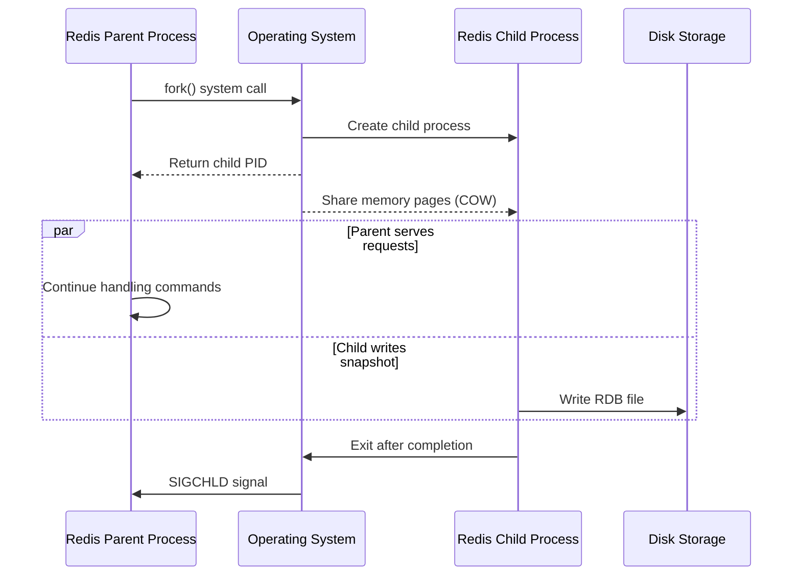
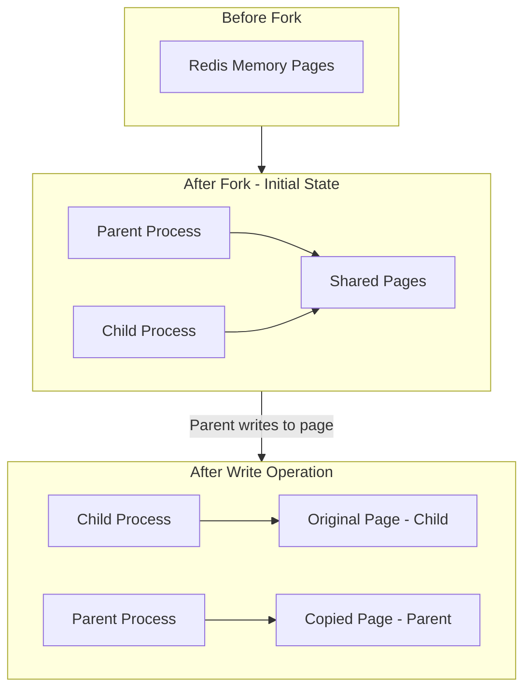
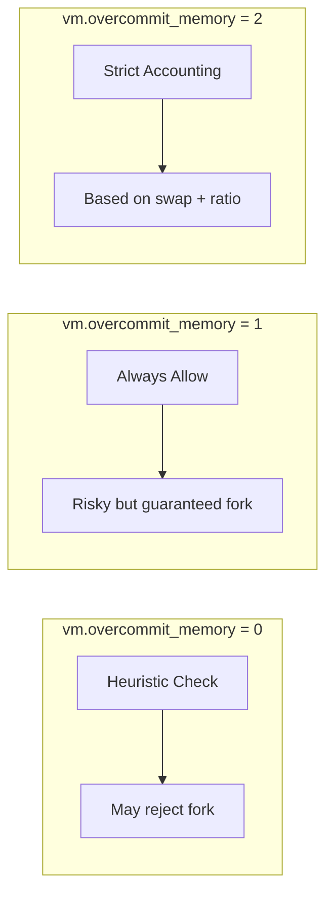
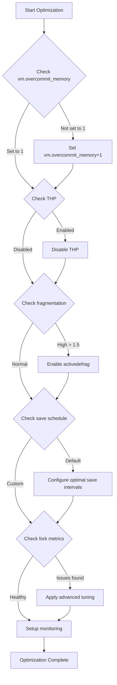

# How to Implement Redis RDB Fork Optimization

Author: [nawazdhandala](https://github.com/nawazdhandala)

Tags: Redis, RDB, Fork, Persistence

Description: Learn to optimize Redis RDB fork operations with memory management, copy-on-write tuning, and scheduling for minimal performance impact.

---

Redis uses RDB (Redis Database) snapshots for persistence, creating point-in-time copies of your dataset. The fork operation that enables this can significantly impact performance if not properly optimized. This guide covers practical strategies to minimize fork overhead and maintain consistent Redis performance.

## Understanding the Fork Process

When Redis creates an RDB snapshot, it uses the `fork()` system call to create a child process. This child process writes the dataset to disk while the parent continues serving requests. The efficiency of this process depends heavily on how the operating system handles memory during the fork.



## Copy-on-Write (COW) Mechanics

Linux uses Copy-on-Write semantics after a fork. Initially, parent and child share the same memory pages. Pages are only copied when one process modifies them.



### Measuring COW Overhead

Monitor copy-on-write behavior using Redis INFO output:

```bash
# Check fork stats in Redis
redis-cli INFO persistence | grep -E "(rdb_|fork)"
```

Example output:
```
rdb_changes_since_last_save:1523
rdb_bgsave_in_progress:0
rdb_last_save_time:1706640000
rdb_last_bgsave_status:ok
rdb_last_bgsave_time_sec:2
rdb_current_bgsave_time_sec:-1
rdb_last_cow_size:52428800
```

The `rdb_last_cow_size` shows bytes copied due to COW during the last fork - lower is better.

## Memory Overcommit Configuration

Linux memory overcommit settings directly affect fork reliability. Without proper configuration, Redis may fail to fork when memory is tight.

### Understanding Overcommit Modes



### Configuring Memory Overcommit

```bash
# Check current setting
cat /proc/sys/vm/overcommit_memory

# Set to always allow overcommit (recommended for Redis)
sudo sysctl vm.overcommit_memory=1

# Make persistent across reboots
echo "vm.overcommit_memory = 1" | sudo tee -a /etc/sysctl.conf
sudo sysctl -p
```

### Redis Configuration for Overcommit Warning

Add to your `redis.conf`:

```conf
# Disable warning about overcommit if you have configured it properly
# Redis will log warnings if vm.overcommit_memory is not set to 1
stop-writes-on-bgsave-error yes
```

## Transparent Huge Pages (THP) Optimization

THP can cause latency spikes during fork operations. Disabling THP is strongly recommended for Redis workloads.

```bash
# Check current THP status
cat /sys/kernel/mm/transparent_hugepage/enabled

# Disable THP
echo never | sudo tee /sys/kernel/mm/transparent_hugepage/enabled
echo never | sudo tee /sys/kernel/mm/transparent_hugepage/defrag

# Make persistent via systemd service
sudo tee /etc/systemd/system/disable-thp.service << 'EOF'
[Unit]
Description=Disable Transparent Huge Pages
DefaultDependencies=no
After=sysinit.target local-fs.target
Before=redis.service

[Service]
Type=oneshot
ExecStart=/bin/sh -c 'echo never > /sys/kernel/mm/transparent_hugepage/enabled && echo never > /sys/kernel/mm/transparent_hugepage/defrag'

[Install]
WantedBy=basic.target
EOF

sudo systemctl daemon-reload
sudo systemctl enable disable-thp
```

## Scheduling RDB Saves

Strategic scheduling reduces the impact of fork operations on your application.

### Time-Based Scheduling

```mermaid
gantt
    title RDB Save Schedule - Low Traffic Window
    dateFormat HH:mm
    axisFormat %H:%M

    section Traffic Pattern
    High Traffic     :active, 09:00, 12:00
    Medium Traffic   :12:00, 14:00
    High Traffic     :active, 14:00, 18:00
    Low Traffic      :18:00, 09:00

    section RDB Saves
    Primary Save     :crit, 02:00, 00:15
    Secondary Save   :crit, 06:00, 00:15
```



### Redis Configuration for Save Intervals

```conf
# redis.conf - Configure save points
# save <seconds> <changes>

# Save after 900 seconds if at least 1 key changed
save 900 1

# Save after 300 seconds if at least 10 keys changed
save 300 10

# Save after 60 seconds if at least 10000 keys changed
save 60 10000

# For write-heavy workloads, consider less frequent saves
# save 3600 1
# save 300 100
# save 60 50000
```

### Manual Save Scheduling with Cron

```bash
# Schedule BGSAVE during low-traffic hours
# Edit crontab
crontab -e

# Add scheduled saves at 2 AM and 6 AM
0 2 * * * /usr/bin/redis-cli BGSAVE >> /var/log/redis-bgsave.log 2>&1
0 6 * * * /usr/bin/redis-cli BGSAVE >> /var/log/redis-bgsave.log 2>&1
```

### Programmatic Save Control

```python
import redis
import time
from datetime import datetime

class RDBScheduler:
    def __init__(self, host='localhost', port=6379):
        self.client = redis.Redis(host=host, port=port)

    def is_low_traffic_window(self):
        """Check if current time is within low traffic window."""
        hour = datetime.now().hour
        # Low traffic: 1 AM to 6 AM
        return 1 <= hour < 6

    def get_memory_usage_ratio(self):
        """Get current memory usage ratio."""
        info = self.client.info('memory')
        used = info['used_memory']
        max_mem = info.get('maxmemory', 0)
        if max_mem == 0:
            return 0.5  # Default assumption
        return used / max_mem

    def should_trigger_save(self):
        """Determine if conditions are right for BGSAVE."""
        # Check if a save is already in progress
        info = self.client.info('persistence')
        if info['rdb_bgsave_in_progress']:
            return False

        # Prefer low traffic windows
        if not self.is_low_traffic_window():
            return False

        # Avoid saving when memory pressure is high
        if self.get_memory_usage_ratio() > 0.8:
            return False

        return True

    def trigger_bgsave(self):
        """Trigger background save with monitoring."""
        if not self.should_trigger_save():
            print("Conditions not optimal for BGSAVE")
            return False

        print(f"Starting BGSAVE at {datetime.now()}")
        self.client.bgsave()

        # Monitor progress
        while True:
            info = self.client.info('persistence')
            if not info['rdb_bgsave_in_progress']:
                break
            time.sleep(1)

        # Report results
        info = self.client.info('persistence')
        print(f"BGSAVE completed in {info['rdb_last_bgsave_time_sec']} seconds")
        print(f"COW size: {info['rdb_last_cow_size'] / 1024 / 1024:.2f} MB")

        return info['rdb_last_bgsave_status'] == 'ok'

# Usage
scheduler = RDBScheduler()
scheduler.trigger_bgsave()
```

## Advanced Fork Optimization Techniques

### 1. Memory Fragmentation Management

High fragmentation increases COW overhead. Monitor and manage it:

```bash
# Check fragmentation ratio
redis-cli INFO memory | grep fragmentation

# Active defragmentation settings in redis.conf
activedefrag yes
active-defrag-ignore-bytes 100mb
active-defrag-threshold-lower 10
active-defrag-threshold-upper 100
active-defrag-cycle-min 1
active-defrag-cycle-max 25
```

### 2. Jemalloc Tuning

Redis uses jemalloc for memory allocation. Configure it for better fork performance:

```bash
# Set jemalloc options before starting Redis
export MALLOC_CONF="background_thread:true,dirty_decay_ms:0,muzzy_decay_ms:0"

# Or in systemd service file
Environment="MALLOC_CONF=background_thread:true,dirty_decay_ms:0,muzzy_decay_ms:0"
```

### 3. Process Priority and CPU Affinity

```bash
# Set Redis to higher priority
sudo renice -n -10 $(pgrep redis-server)

# Pin Redis to specific CPU cores to reduce context switching
taskset -cp 0-3 $(pgrep redis-server)

# In systemd service file
[Service]
Nice=-10
CPUAffinity=0 1 2 3
```

### 4. IO Priority for Child Process

Configure Redis to set IO priority for the child process:

```conf
# redis.conf
# Set IO scheduling class and priority for RDB/AOF child processes
# Linux only - uses ioprio_set()
oom-score-adj -500
oom-score-adj-values 0 200 800
```

## Monitoring Fork Performance

Create a comprehensive monitoring setup:

```python
import redis
import time
from dataclasses import dataclass
from typing import Optional

@dataclass
class ForkMetrics:
    fork_duration_us: int
    cow_size_bytes: int
    save_duration_sec: int
    status: str

class RedisForMonitor:
    def __init__(self, host='localhost', port=6379):
        self.client = redis.Redis(host=host, port=port)
        self.last_fork_time = 0

    def get_fork_metrics(self) -> Optional[ForkMetrics]:
        """Collect fork-related metrics."""
        info = self.client.info('persistence')
        stats = self.client.info('stats')

        return ForkMetrics(
            fork_duration_us=stats.get('latest_fork_usec', 0),
            cow_size_bytes=info.get('rdb_last_cow_size', 0),
            save_duration_sec=info.get('rdb_last_bgsave_time_sec', 0),
            status=info.get('rdb_last_bgsave_status', 'unknown')
        )

    def check_fork_health(self) -> dict:
        """Evaluate fork health and return recommendations."""
        metrics = self.get_fork_metrics()
        memory_info = self.client.info('memory')

        issues = []
        recommendations = []

        # Check fork duration (should be under 1 second for most cases)
        if metrics.fork_duration_us > 1_000_000:
            issues.append(f"Fork duration too high: {metrics.fork_duration_us / 1000:.2f}ms")
            recommendations.append("Consider reducing dataset size or upgrading hardware")

        # Check COW ratio
        used_memory = memory_info['used_memory']
        if used_memory > 0:
            cow_ratio = metrics.cow_size_bytes / used_memory
            if cow_ratio > 0.5:
                issues.append(f"High COW ratio: {cow_ratio:.2%}")
                recommendations.append("Reduce write rate during saves or schedule during low traffic")

        # Check fragmentation
        frag_ratio = memory_info.get('mem_fragmentation_ratio', 1.0)
        if frag_ratio > 1.5:
            issues.append(f"High memory fragmentation: {frag_ratio:.2f}")
            recommendations.append("Enable active defragmentation")

        return {
            'healthy': len(issues) == 0,
            'metrics': metrics,
            'issues': issues,
            'recommendations': recommendations
        }

    def continuous_monitor(self, interval=60):
        """Continuously monitor fork metrics."""
        print("Starting fork monitoring...")
        while True:
            health = self.check_fork_health()

            print(f"\n--- Fork Health Check at {time.strftime('%Y-%m-%d %H:%M:%S')} ---")
            print(f"Status: {'Healthy' if health['healthy'] else 'Issues Detected'}")
            print(f"Last fork duration: {health['metrics'].fork_duration_us / 1000:.2f}ms")
            print(f"Last COW size: {health['metrics'].cow_size_bytes / 1024 / 1024:.2f}MB")
            print(f"Last save duration: {health['metrics'].save_duration_sec}s")

            if health['issues']:
                print("\nIssues:")
                for issue in health['issues']:
                    print(f"  - {issue}")
                print("\nRecommendations:")
                for rec in health['recommendations']:
                    print(f"  - {rec}")

            time.sleep(interval)

# Usage
monitor = RedisForMonitor()
health = monitor.check_fork_health()
print(health)
```

## Complete Optimization Checklist



## Summary

Optimizing Redis RDB fork operations requires attention to several system and application-level configurations:

1. **Memory Overcommit** - Set `vm.overcommit_memory=1` to ensure fork operations succeed
2. **Transparent Huge Pages** - Disable THP to prevent latency spikes
3. **Save Scheduling** - Configure save intervals based on your write patterns and schedule manual saves during low-traffic periods
4. **COW Monitoring** - Track `rdb_last_cow_size` to understand write amplification during saves
5. **Memory Management** - Enable active defragmentation and tune jemalloc for better memory locality
6. **Process Tuning** - Adjust process priority and CPU affinity for consistent performance

By implementing these optimizations, you can achieve reliable RDB persistence with minimal impact on Redis performance. Regular monitoring ensures early detection of any degradation in fork behavior.
