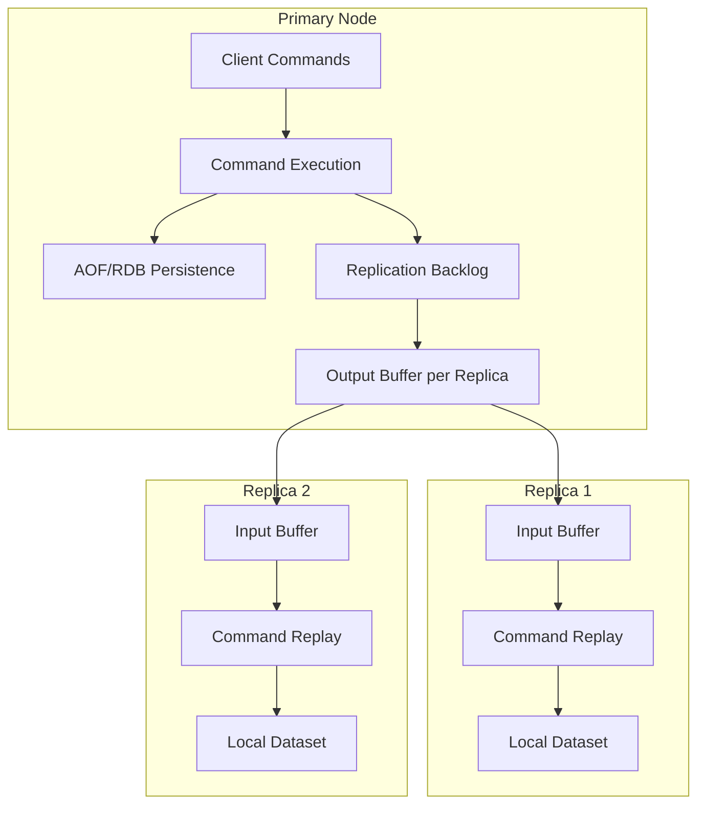
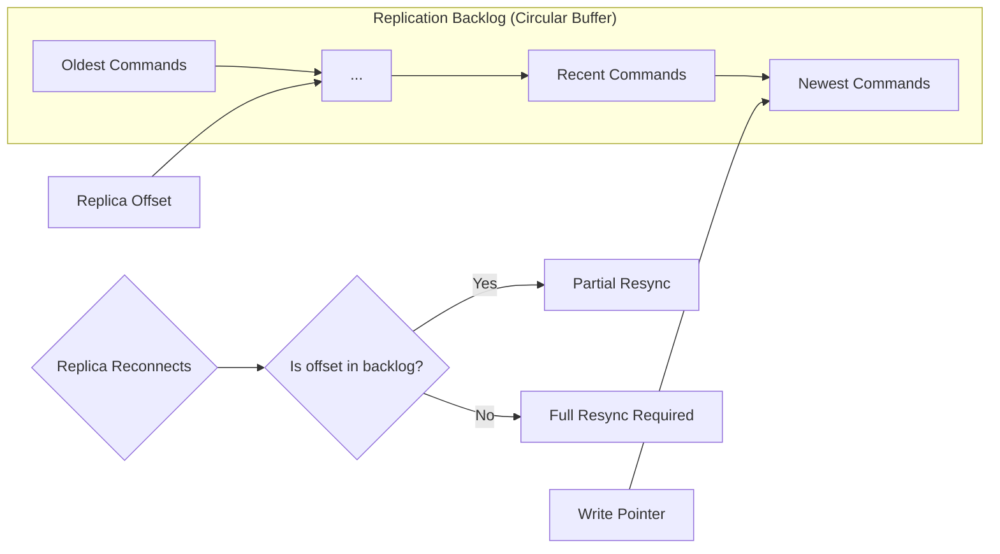
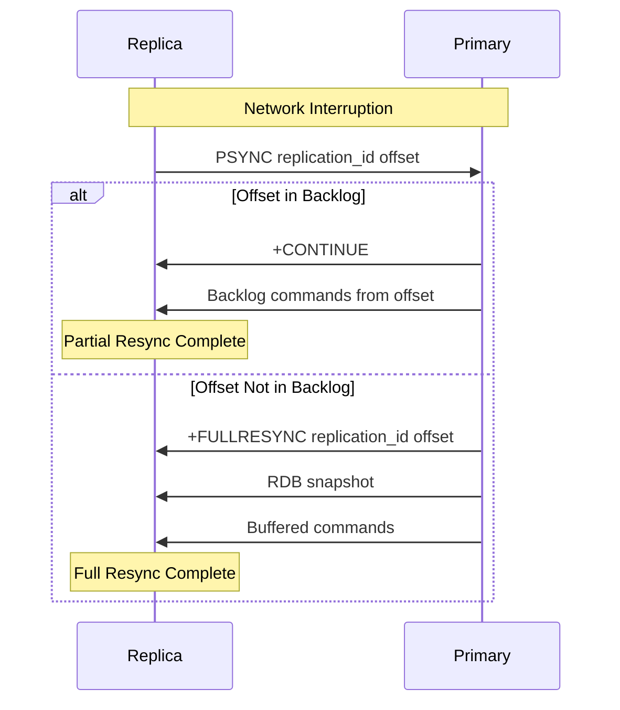
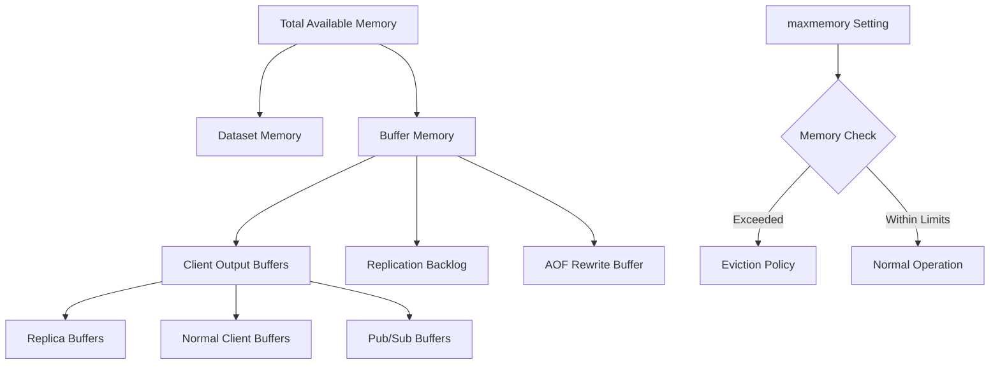
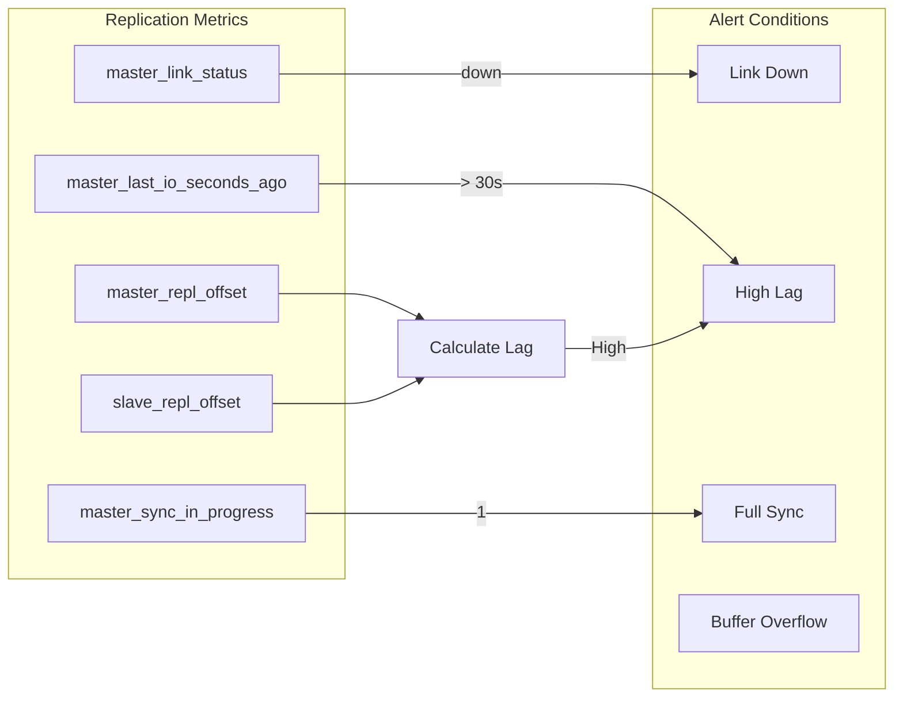
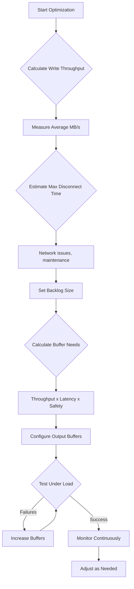

# How to Create Redis Replication Buffer Optimization

Author: [nawazdhandala](https://github.com/nawazdhandala)

Tags: Redis, Replication, Buffer, Performance

Description: Learn to optimize Redis replication buffers with client-output-buffer-limit configuration, backlog sizing, and partial resync for efficient replication.

---

Redis replication is a fundamental feature for building highly available and scalable Redis deployments. However, poorly configured replication buffers can lead to performance degradation, full resynchronizations, and increased memory consumption. This guide walks you through optimizing Redis replication buffers to achieve efficient and reliable replica performance.

## Understanding Redis Replication Architecture

Before diving into optimization, let us understand how Redis replication works at a high level.



When a primary node receives write commands, it propagates them to connected replicas through two key buffer mechanisms:

1. **Replication Backlog** - A circular buffer storing recent write commands
2. **Client Output Buffer** - Per-replica buffers holding commands pending delivery

## Client Output Buffer Configuration

The client output buffer for replicas is one of the most critical settings for replication performance. This buffer holds commands that need to be sent to each replica.

### Configuration Syntax

```bash
client-output-buffer-limit replica <hard-limit> <soft-limit> <soft-seconds>
```

- **hard-limit** - Maximum buffer size; exceeding this disconnects the replica immediately
- **soft-limit** - Threshold that triggers disconnection if exceeded for soft-seconds
- **soft-seconds** - Duration the soft-limit can be exceeded before disconnection

### Default vs Optimized Configuration

```bash
# Default configuration (often too restrictive)
client-output-buffer-limit replica 256mb 64mb 60

# Optimized for high-throughput workloads
client-output-buffer-limit replica 512mb 256mb 120

# Aggressive configuration for very high write volumes
client-output-buffer-limit replica 1gb 512mb 300
```

### Calculating Optimal Buffer Size

The optimal buffer size depends on your write throughput and network latency. Use this formula:

```
Buffer Size = Write Throughput (MB/s) x Maximum Network Latency (s) x Safety Factor
```

For example, with 50 MB/s write throughput, 2 second maximum latency, and a safety factor of 3:

```
Buffer Size = 50 x 2 x 3 = 300 MB
```

### Applying Configuration

You can apply the configuration dynamically without restart:

```bash
# Connect to Redis
redis-cli -h primary-host -p 6379

# Set the buffer limit
CONFIG SET client-output-buffer-limit "replica 512mb 256mb 120"

# Verify the configuration
CONFIG GET client-output-buffer-limit
```

For persistent configuration, add to your `redis.conf`:

```conf
# Redis configuration file
client-output-buffer-limit replica 512mb 256mb 120
```

## Replication Backlog Sizing

The replication backlog is a circular buffer that enables partial resynchronization when replicas briefly disconnect.



### Configuring Backlog Size

```bash
# Set replication backlog size (default is 1mb)
repl-backlog-size 256mb

# Time to release backlog after last replica disconnects
repl-backlog-ttl 3600
```

### Calculating Optimal Backlog Size

The backlog should be large enough to hold commands during expected disconnection periods:

```
Backlog Size = Write Throughput (MB/s) x Maximum Disconnection Time (s)
```

For a system with 20 MB/s write throughput and 60 second maximum acceptable disconnection:

```
Backlog Size = 20 x 60 = 1200 MB (approximately 1.2 GB)
```

### Dynamic Backlog Configuration

```bash
# Check current backlog configuration
redis-cli INFO replication | grep repl_backlog

# Output example:
# repl_backlog_active:1
# repl_backlog_size:268435456
# repl_backlog_first_byte_offset:1073741824
# repl_backlog_histlen:268435456

# Update backlog size dynamically
redis-cli CONFIG SET repl-backlog-size 536870912
```

## Partial Resync Optimization

Partial resynchronization (PSYNC) allows replicas to reconnect and resume replication without a full data transfer. Optimizing for partial resync reduces bandwidth usage and recovery time.



### Enabling Diskless Replication

For faster full resyncs when they do occur:

```bash
# Enable diskless replication (sends RDB directly over socket)
repl-diskless-sync yes

# Delay before starting diskless transfer (allows multiple replicas to connect)
repl-diskless-sync-delay 5

# Maximum replicas to serve in parallel during diskless sync
repl-diskless-sync-max-replicas 3
```

### Replica Configuration for Resilience

Configure replicas to handle disconnections gracefully:

```bash
# Replica configuration
replica-serve-stale-data yes
replica-read-only yes

# Replica priority for failover (lower = higher priority)
replica-priority 100

# Timeout for replica to consider primary unreachable
repl-timeout 60

# Disable TCP_NODELAY for better bandwidth efficiency
repl-disable-tcp-nodelay no
```

## Memory Management for Buffers

Proper memory management prevents out-of-memory conditions during replication.



### Memory Configuration Best Practices

```bash
# Set maximum memory (leave room for buffers)
maxmemory 10gb

# Calculate buffer overhead
# Assume: 3 replicas, 512mb buffer each = 1.5gb
# Backlog: 256mb
# Safety margin: 20%

# Formula: maxmemory = Total RAM - Buffer Overhead - OS Overhead
# Example: 16gb RAM - 2gb buffers - 2gb OS = 12gb maxmemory
```

### Monitoring Memory Usage

Create a script to monitor buffer memory:

```bash
#!/bin/bash
# monitor-replication-buffers.sh

REDIS_CLI="redis-cli -h localhost -p 6379"

while true; do
    echo "=== $(date) ==="

    # Get client list and filter replicas
    echo "Replica Output Buffers:"
    $REDIS_CLI CLIENT LIST | grep "flags=S" | while read line; do
        name=$(echo $line | grep -o 'addr=[^ ]*')
        omem=$(echo $line | grep -o 'omem=[^ ]*')
        echo "  $name $omem"
    done

    # Get replication info
    echo ""
    echo "Replication Backlog:"
    $REDIS_CLI INFO replication | grep -E "repl_backlog_(size|histlen|first_byte_offset)"

    echo ""
    echo "Memory Usage:"
    $REDIS_CLI INFO memory | grep -E "used_memory_human|used_memory_overhead_human"

    sleep 10
done
```

## Comprehensive Monitoring Setup

Effective monitoring is essential for maintaining optimal replication performance.

### Key Metrics to Monitor



### Prometheus Metrics Collection

Use Redis Exporter to expose metrics for Prometheus:

```yaml
# prometheus.yml
scrape_configs:
  - job_name: 'redis'
    static_configs:
      - targets: ['redis-exporter:9121']
    metrics_path: /metrics

# Alert rules
groups:
  - name: redis-replication
    rules:
      - alert: RedisReplicationLag
        expr: redis_connected_slave_lag_seconds > 30
        for: 5m
        labels:
          severity: warning
        annotations:
          summary: "Redis replication lag detected"

      - alert: RedisReplicationBroken
        expr: redis_connected_slaves < 1
        for: 1m
        labels:
          severity: critical
        annotations:
          summary: "Redis replication is broken"

      - alert: RedisOutputBufferHigh
        expr: redis_client_output_buffer_bytes{type="slave"} > 268435456
        for: 2m
        labels:
          severity: warning
        annotations:
          summary: "Redis replica output buffer is high"
```

### Real-time Monitoring Commands

```bash
# Monitor replication status
redis-cli INFO replication

# Watch for replication events
redis-cli MONITOR | grep -E "PSYNC|SYNC|REPLCONF"

# Check replica lag
redis-cli DEBUG SLEEP 0 # Forces processing of pending commands
redis-cli INFO replication | grep offset

# Monitor client connections
redis-cli CLIENT LIST | grep "flags=S"
```

### Custom Lua Script for Buffer Analysis

```lua
-- buffer_analysis.lua
-- Run with: redis-cli EVAL "$(cat buffer_analysis.lua)" 0

local info = redis.call('INFO', 'replication')
local clients = redis.call('CLIENT', 'LIST')

local result = {}

-- Parse replication info
for line in info:gmatch("[^\r\n]+") do
    if line:match("^repl_backlog") or line:match("^master_repl_offset") then
        table.insert(result, line)
    end
end

-- Count replica buffers
local replica_count = 0
local total_buffer = 0
for line in clients:gmatch("[^\n]+") do
    if line:match("flags=S") then
        replica_count = replica_count + 1
        local omem = line:match("omem=(%d+)")
        if omem then
            total_buffer = total_buffer + tonumber(omem)
        end
    end
end

table.insert(result, "replica_count:" .. replica_count)
table.insert(result, "total_output_buffer:" .. total_buffer)

return table.concat(result, "\n")
```

## Performance Tuning Checklist

Use this checklist to ensure optimal replication buffer configuration:



### Configuration Summary

Here is a complete optimized configuration for a high-performance Redis primary:

```conf
# redis.conf - Optimized Replication Configuration

# Network settings
tcp-backlog 511
tcp-keepalive 300
timeout 0

# Replication buffer settings
client-output-buffer-limit replica 512mb 256mb 120
client-output-buffer-limit normal 0 0 0
client-output-buffer-limit pubsub 32mb 8mb 60

# Replication backlog
repl-backlog-size 256mb
repl-backlog-ttl 3600

# Diskless replication
repl-diskless-sync yes
repl-diskless-sync-delay 5
repl-diskless-sync-max-replicas 3

# Replication timeouts
repl-timeout 60
repl-ping-replica-period 10

# TCP optimization
repl-disable-tcp-nodelay no

# Memory management
maxmemory 10gb
maxmemory-policy volatile-lru
```

### Replica Configuration

```conf
# redis-replica.conf

# Connect to primary
replicaof primary-host 6379

# Replica behavior
replica-serve-stale-data yes
replica-read-only yes
replica-priority 100

# Replication timeouts
repl-timeout 60

# Memory settings (can be lower than primary)
maxmemory 8gb
maxmemory-policy volatile-lru
```

## Troubleshooting Common Issues

### Issue 1: Frequent Full Resyncs

**Symptoms:** Replicas frequently perform full resyncs instead of partial resyncs.

**Diagnosis:**
```bash
# Check for full resync events
redis-cli INFO replication | grep sync_full
```

**Solution:** Increase backlog size to accommodate longer disconnection periods.

### Issue 2: Replica Disconnections

**Symptoms:** Replicas disconnect and reconnect frequently.

**Diagnosis:**
```bash
# Check output buffer usage
redis-cli CLIENT LIST | grep "flags=S" | grep omem
```

**Solution:** Increase client-output-buffer-limit for replicas.

### Issue 3: High Memory Usage

**Symptoms:** Memory usage spikes during replication.

**Diagnosis:**
```bash
redis-cli INFO memory | grep -E "used_memory|overhead"
```

**Solution:** Balance buffer sizes with available memory; consider reducing maxmemory to leave headroom.

## Conclusion

Optimizing Redis replication buffers is essential for maintaining reliable and efficient data replication. Key takeaways include:

1. **Size buffers based on workload** - Calculate buffer sizes using your actual write throughput and expected network conditions
2. **Enable partial resync** - Configure adequate backlog size to minimize full resyncs
3. **Monitor continuously** - Set up alerts for buffer overflow and replication lag
4. **Leave memory headroom** - Account for buffer memory when setting maxmemory
5. **Test under load** - Validate configuration under realistic conditions before production deployment

By following these guidelines and regularly reviewing your replication metrics, you can achieve stable and performant Redis replication that scales with your application needs.
