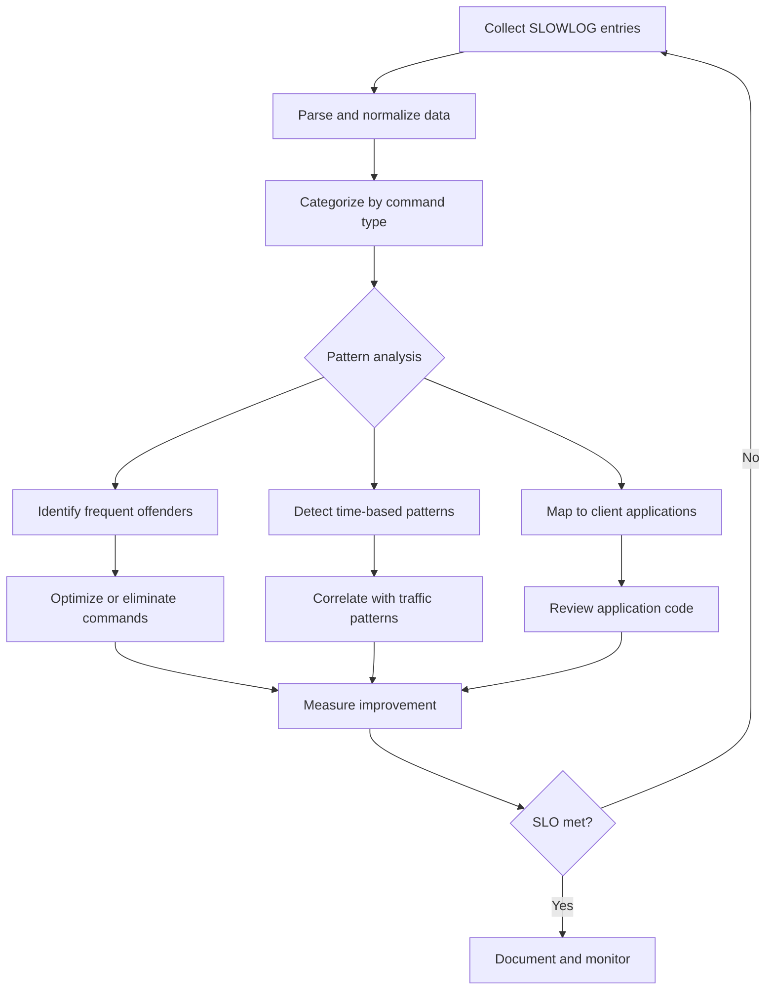
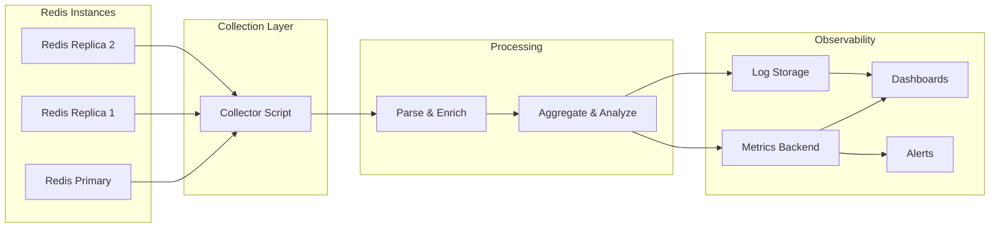
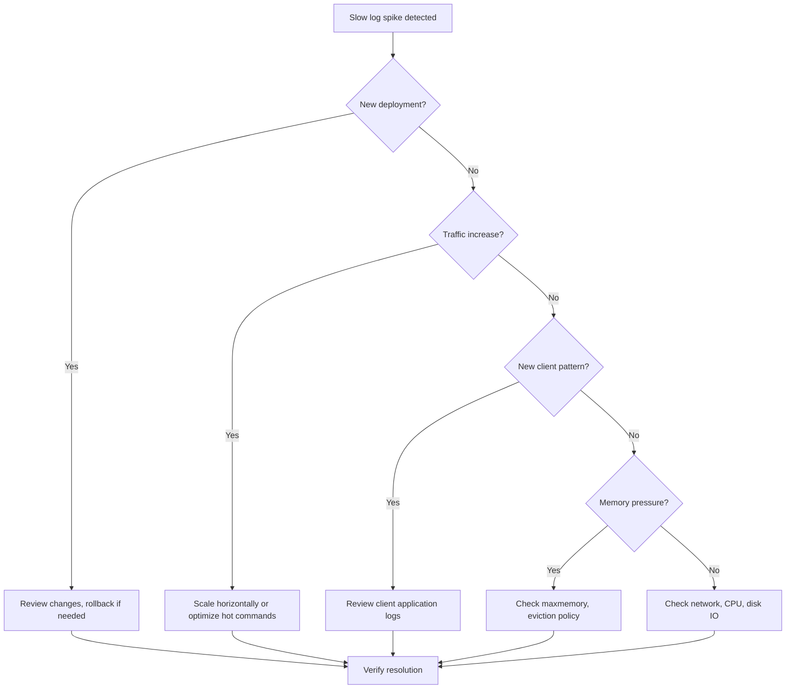

# How to Build Redis Slow Log Analysis

Author: [nawazdhandala](https://github.com/nawazdhandala)

Tags: Redis, Performance, Debugging, Operations

Description: A practical guide to configuring, collecting, and analyzing Redis slow logs to identify performance bottlenecks and optimize your cache layer.

---

Redis is fast. Really fast. But when your application latency spikes and you suspect the cache layer, you need hard data. That's where the Redis SLOWLOG comes in. It captures commands that exceed a configurable execution time threshold, giving you visibility into what's actually happening inside your Redis instance.

This guide covers everything from basic configuration to building an automated analysis pipeline that surfaces slow commands before they become incidents.

## What Is Redis SLOWLOG?

The SLOWLOG is an in-memory log that Redis maintains to track commands exceeding a specified execution time. Unlike external monitoring that measures round-trip latency, SLOWLOG measures actual server-side execution time. This distinction matters because network latency, client-side serialization, and connection overhead are excluded.

Key characteristics:

- Stored entirely in memory (no disk I/O)
- Configurable threshold (microseconds)
- Configurable maximum entries (FIFO eviction)
- Zero performance impact when commands are fast
- Minimal overhead even when logging slow commands

## Configuring the Slow Log

Two configuration parameters control SLOWLOG behavior:

```bash
# Threshold in microseconds (default: 10000 = 10ms)
# Commands taking longer than this are logged
CONFIG SET slowlog-log-slower-than 10000

# Maximum number of entries to keep (default: 128)
# Older entries are evicted when limit is reached
CONFIG SET slowlog-max-len 1024
```

### Choosing the Right Threshold

The default 10ms threshold is reasonable for most workloads, but you should tune it based on your SLOs:

| Use Case | Recommended Threshold | Rationale |
|----------|----------------------|-----------|
| Low-latency trading | 1000 (1ms) | Sub-millisecond response required |
| Web application cache | 10000 (10ms) | Standard web latency tolerance |
| Background job queue | 50000 (50ms) | Less latency sensitive |
| Bulk data processing | 100000 (100ms) | Throughput over latency |

To make these settings persistent across restarts, add them to your redis.conf:

```conf
slowlog-log-slower-than 10000
slowlog-max-len 1024
```

### Setting Threshold to Zero for Debugging

During incident investigation, you might want to log every command temporarily:

```bash
# Log all commands (use sparingly, memory impact)
CONFIG SET slowlog-log-slower-than 0

# After investigation, restore normal threshold
CONFIG SET slowlog-log-slower-than 10000
```

Setting the threshold to -1 disables the slow log entirely.

## Reading the Slow Log

The SLOWLOG command has several subcommands:

```bash
# Get the last 10 slow log entries
SLOWLOG GET 10

# Get all entries (up to slowlog-max-len)
SLOWLOG GET

# Get the current length of the slow log
SLOWLOG LEN

# Clear all entries
SLOWLOG RESET
```

### Understanding SLOWLOG Output

Each entry contains:

```bash
127.0.0.1:6379> SLOWLOG GET 1
1) 1) (integer) 14              # Unique ID
   2) (integer) 1706612345      # Unix timestamp
   3) (integer) 15432           # Execution time in microseconds
   4) 1) "KEYS"                 # Command
      2) "*session*"            # Arguments
   5) "192.168.1.100:52431"     # Client IP:port
   6) "web-app-01"              # Client name (if set)
```

The fields in order:
1. **ID**: Unique identifier, incrementing for each entry
2. **Timestamp**: When the command was logged (Unix epoch)
3. **Duration**: Execution time in microseconds
4. **Command**: The full command with arguments
5. **Client Address**: IP and port of the client
6. **Client Name**: Set via CLIENT SETNAME (useful for identifying applications)

## Analysis Workflow

Building effective slow log analysis requires a systematic approach. Here's a workflow that moves from detection to resolution:



## Common Slow Commands and Fixes

Certain Redis commands are notorious for causing slow log entries. Understanding why they're slow helps you avoid them:

### KEYS Pattern Matching

```bash
# The problem: O(N) scan of all keys
KEYS *session*

# The solution: Use SCAN for iteration
SCAN 0 MATCH *session* COUNT 100
```

KEYS blocks Redis entirely during execution. With millions of keys, this can take seconds. SCAN iterates incrementally without blocking.

### Large Collection Operations

```bash
# The problem: O(N) operations on large sets/lists
SMEMBERS large_set           # Returns all members
LRANGE large_list 0 -1       # Returns entire list
HGETALL large_hash           # Returns all fields

# The solution: Paginate or restructure
SSCAN large_set 0 COUNT 100  # Iterate in batches
LRANGE large_list 0 99       # Paginate
HSCAN large_hash 0 COUNT 100 # Iterate in batches
```

### Blocking Operations with Long Timeouts

```bash
# The problem: Long blocking waits
BLPOP queue 300              # 5 minute timeout

# The solution: Use shorter timeouts with retry logic
BLPOP queue 5                # 5 second timeout, retry in application
```

### Lua Scripts Without Bounds

```lua
-- The problem: Unbounded iteration in Lua
local keys = redis.call('KEYS', ARGV[1])
for i, key in ipairs(keys) do
    redis.call('DEL', key)
end

-- The solution: Batch with limits
local cursor = "0"
repeat
    local result = redis.call('SCAN', cursor, 'MATCH', ARGV[1], 'COUNT', 100)
    cursor = result[1]
    for i, key in ipairs(result[2]) do
        redis.call('DEL', key)
    end
until cursor == "0"
```

### DEL on Large Keys

```bash
# The problem: DEL blocks when key is large
DEL large_hash_with_millions_of_fields

# The solution: Use UNLINK for async deletion (Redis 4.0+)
UNLINK large_hash_with_millions_of_fields
```

## Building an Automated Analysis Pipeline

Here's a practical pipeline for continuous slow log monitoring:



### Collection Script (Python)

```python
import redis
import json
import time
from datetime import datetime

def collect_slowlog(host, port, password=None, count=100):
    """Collect and normalize slow log entries from Redis."""
    client = redis.Redis(
        host=host,
        port=port,
        password=password,
        decode_responses=True
    )

    entries = client.slowlog_get(count)
    normalized = []

    for entry in entries:
        # Extract command name (first element of args)
        command = entry['command'].upper() if entry.get('command') else 'UNKNOWN'

        normalized.append({
            'id': entry['id'],
            'timestamp': datetime.fromtimestamp(entry['start_time']).isoformat(),
            'duration_us': entry['duration'],
            'duration_ms': entry['duration'] / 1000,
            'command': command,
            'full_command': entry.get('command', ''),
            'client_address': entry.get('client_address', ''),
            'client_name': entry.get('client_name', ''),
            'redis_host': host,
            'redis_port': port
        })

    return normalized

def analyze_slowlog(entries):
    """Generate analysis summary from collected entries."""
    if not entries:
        return {'message': 'No slow log entries found'}

    # Group by command
    by_command = {}
    for entry in entries:
        cmd = entry['command']
        if cmd not in by_command:
            by_command[cmd] = {
                'count': 0,
                'total_duration_ms': 0,
                'max_duration_ms': 0,
                'examples': []
            }
        by_command[cmd]['count'] += 1
        by_command[cmd]['total_duration_ms'] += entry['duration_ms']
        by_command[cmd]['max_duration_ms'] = max(
            by_command[cmd]['max_duration_ms'],
            entry['duration_ms']
        )
        if len(by_command[cmd]['examples']) < 3:
            by_command[cmd]['examples'].append(entry['full_command'])

    # Sort by total duration
    sorted_commands = sorted(
        by_command.items(),
        key=lambda x: x[1]['total_duration_ms'],
        reverse=True
    )

    return {
        'total_entries': len(entries),
        'unique_commands': len(by_command),
        'top_offenders': [
            {
                'command': cmd,
                'count': stats['count'],
                'total_duration_ms': round(stats['total_duration_ms'], 2),
                'avg_duration_ms': round(stats['total_duration_ms'] / stats['count'], 2),
                'max_duration_ms': round(stats['max_duration_ms'], 2),
                'examples': stats['examples']
            }
            for cmd, stats in sorted_commands[:10]
        ]
    }

# Usage
if __name__ == '__main__':
    entries = collect_slowlog('localhost', 6379)
    analysis = analyze_slowlog(entries)
    print(json.dumps(analysis, indent=2))
```

### Exposing Metrics

Convert slow log data into metrics for your observability stack:

```python
from prometheus_client import Counter, Histogram, Gauge

# Metrics definitions
slowlog_commands_total = Counter(
    'redis_slowlog_commands_total',
    'Total slow commands by type',
    ['redis_instance', 'command']
)

slowlog_duration_seconds = Histogram(
    'redis_slowlog_duration_seconds',
    'Slow command duration distribution',
    ['redis_instance', 'command'],
    buckets=[0.001, 0.005, 0.01, 0.025, 0.05, 0.1, 0.25, 0.5, 1.0, 2.5, 5.0]
)

slowlog_entries_total = Gauge(
    'redis_slowlog_entries_total',
    'Current number of entries in slow log',
    ['redis_instance']
)

def export_metrics(entries, redis_instance):
    """Export slow log entries as Prometheus metrics."""
    for entry in entries:
        slowlog_commands_total.labels(
            redis_instance=redis_instance,
            command=entry['command']
        ).inc()

        slowlog_duration_seconds.labels(
            redis_instance=redis_instance,
            command=entry['command']
        ).observe(entry['duration_ms'] / 1000)  # Convert to seconds
```

## Alerting Strategy

Set up alerts based on slow log patterns rather than individual entries:

| Alert | Condition | Severity | Action |
|-------|-----------|----------|--------|
| Slow command spike | >50 entries in 5 minutes | Warning | Investigate traffic pattern |
| KEYS command detected | Any KEYS command logged | Critical | Immediate code review |
| Sustained high latency | Avg duration >100ms for 10 minutes | Critical | Scale or optimize |
| Client concentration | >80% from single client | Warning | Review application behavior |

Example alert rule for Prometheus:

```yaml
groups:
  - name: redis_slowlog
    rules:
      - alert: RedisSlowlogSpike
        expr: increase(redis_slowlog_commands_total[5m]) > 50
        for: 5m
        labels:
          severity: warning
        annotations:
          summary: "Redis slow log spike detected"
          description: "Instance {{ $labels.redis_instance }} has logged {{ $value }} slow commands in the last 5 minutes"

      - alert: RedisKeysCommandDetected
        expr: redis_slowlog_commands_total{command="KEYS"} > 0
        for: 1m
        labels:
          severity: critical
        annotations:
          summary: "KEYS command detected in Redis"
          description: "The KEYS command was executed on {{ $labels.redis_instance }}. This blocks Redis and should be replaced with SCAN."
```

## Best Practices

1. **Set slowlog-max-len appropriately**: Too low and you lose data during incidents. Too high and you consume memory. 1024-4096 is reasonable for most cases.

2. **Use CLIENT SETNAME**: Have your applications identify themselves so you can trace slow commands back to the source.

```python
# In your application
redis_client.client_setname('order-service-prod-01')
```

3. **Collect before resetting**: Always collect slow log entries before calling SLOWLOG RESET or restarting Redis.

4. **Monitor across replicas**: Slow logs are instance-specific. Collect from all instances in your cluster.

5. **Correlate with application metrics**: Match slow log timestamps with application latency spikes to confirm causation.

6. **Review after deployments**: Check the slow log after every deployment to catch regressions early.

7. **Document baseline**: Know what "normal" looks like for your slow log so you can detect anomalies.

## Troubleshooting Checklist

When slow log entries spike:



## Conclusion

Redis SLOWLOG is your first line of defense against cache layer performance issues. By configuring appropriate thresholds, building automated collection pipelines, and establishing alerting around slow command patterns, you can catch problems before they impact users.

The key insights:
- SLOWLOG measures server-side execution, not network round-trip
- KEYS, large collection scans, and blocking operations are common offenders
- Automate collection and analysis to enable proactive optimization
- Use CLIENT SETNAME to trace commands back to applications
- Correlate slow log data with application metrics for root cause analysis

Start with basic collection and gradually build toward a full observability pipeline. The investment pays off the first time you catch a problematic query before it becomes an incident.

---

**Related Reading:**

- [How to reduce noise in OpenTelemetry](https://oneuptime.com/blog/post/2025-08-25-how-to-reduce-noise-in-opentelemetry/view)
- [Basics of profiling: Turning CPU and Memory Hotspots into Action](https://oneuptime.com/blog/post/2025-09-09-basics-of-profiling/view)
- [Three Pillars of Observability: Logs, Metrics, Traces](https://oneuptime.com/blog/post/2025-08-20-three-pillars-of-observability-logs-metrics-traces/view)
