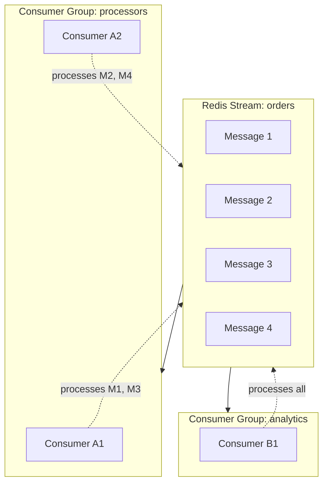

# How to Implement Redis Streams Consumer Groups

Author: [nawazdhandala](https://www.github.com/nawazdhandala)

Tags: Redis, Streams, Consumer Groups, Message Queue, Event Processing

Description: Deep dive into Redis Streams consumer groups for building reliable message processing systems with acknowledgments, pending entries, and failure recovery.

---

Consumer groups in Redis Streams let multiple consumers work together to process messages from a stream. Each message gets delivered to exactly one consumer in the group, making it straightforward to scale your processing horizontally. This guide covers the advanced patterns you need to build production-ready message processing systems.

## How Consumer Groups Work

When you create a consumer group, Redis tracks which messages have been delivered and acknowledged. This tracking happens at the group level, so different groups can process the same stream independently.



## Creating and Managing Consumer Groups

The first step is creating a consumer group. You specify where in the stream to start reading from.

```javascript
// consumer-group-setup.js
// Setting up Redis Streams consumer groups
const Redis = require('ioredis');
const redis = new Redis();

async function createConsumerGroup(stream, groupName, startId = '$') {
  try {
    // startId options:
    // '$' - only new messages from this point forward
    // '0' - read all existing messages from the beginning
    // '1234567890123-0' - specific message ID
    await redis.xgroup('CREATE', stream, groupName, startId, 'MKSTREAM');
    console.log(`Created group "${groupName}" on stream "${stream}"`);
  } catch (error) {
    // BUSYGROUP means the group already exists
    if (error.message.includes('BUSYGROUP')) {
      console.log(`Group "${groupName}" already exists`);
    } else {
      throw error;
    }
  }
}

// Get information about all consumer groups on a stream
async function getGroupInfo(stream) {
  const groups = await redis.xinfo('GROUPS', stream);

  return groups.map(group => {
    const info = arrayToObject(group);
    return {
      name: info.name,
      consumers: info.consumers,
      pending: info.pending,
      lastDeliveredId: info['last-delivered-id'],
      entriesRead: info['entries-read'],
      lag: info.lag,
    };
  });
}

// Helper to convert Redis array response to object
function arrayToObject(arr) {
  const obj = {};
  for (let i = 0; i < arr.length; i += 2) {
    obj[arr[i]] = arr[i + 1];
  }
  return obj;
}

module.exports = { createConsumerGroup, getGroupInfo, arrayToObject };
```

## Reading Messages with XREADGROUP

The `XREADGROUP` command is where consumer groups shine. It delivers messages to consumers while tracking delivery.

```javascript
// consumer-reader.js
// Reading messages using consumer groups
const Redis = require('ioredis');
const { arrayToObject } = require('./consumer-group-setup');

class GroupConsumer {
  constructor(options) {
    this.redis = new Redis(options.redis);
    this.stream = options.stream;
    this.group = options.group;
    // Each consumer needs a unique name within the group
    this.consumer = options.consumer || `consumer-${process.pid}-${Date.now()}`;
    this.batchSize = options.batchSize || 10;
    this.blockMs = options.blockMs || 5000;
    this.running = false;
  }

  async start(handler) {
    this.running = true;
    console.log(`Starting consumer "${this.consumer}" in group "${this.group}"`);

    while (this.running) {
      try {
        // The ">" ID means: give me messages never delivered to any consumer
        const response = await this.redis.xreadgroup(
          'GROUP', this.group, this.consumer,
          'COUNT', this.batchSize,
          'BLOCK', this.blockMs,
          'STREAMS', this.stream,
          '>'
        );

        if (response) {
          await this.processMessages(response, handler);
        }
      } catch (error) {
        console.error('Error reading from stream:', error.message);
        await this.sleep(1000);
      }
    }
  }

  async processMessages(response, handler) {
    // Response format: [[streamName, [[id, [field, value, ...]], ...]]]
    const [streamName, messages] = response[0];

    for (const [messageId, fields] of messages) {
      const data = arrayToObject(fields);

      try {
        // Call the handler with parsed message data
        await handler(messageId, data);

        // Acknowledge successful processing
        await this.acknowledge(messageId);
      } catch (error) {
        console.error(`Failed to process ${messageId}:`, error.message);
        // Message stays in pending list for retry
      }
    }
  }

  async acknowledge(messageId) {
    // XACK removes the message from the pending entries list
    const result = await this.redis.xack(this.stream, this.group, messageId);
    if (result === 1) {
      console.log(`Acknowledged: ${messageId}`);
    }
  }

  async stop() {
    this.running = false;
  }

  sleep(ms) {
    return new Promise(resolve => setTimeout(resolve, ms));
  }
}

module.exports = GroupConsumer;
```

## Managing the Pending Entries List

When a message is delivered but not acknowledged, it goes into the Pending Entries List (PEL). This is how Redis tracks messages that might need reprocessing.

```javascript
// pending-manager.js
// Managing pending messages in consumer groups
const Redis = require('ioredis');

class PendingManager {
  constructor(redis, stream, group) {
    this.redis = redis;
    this.stream = stream;
    this.group = group;
  }

  // Get summary of pending messages
  async getPendingSummary() {
    // XPENDING returns: [total, smallest-id, largest-id, [[consumer, count], ...]]
    const result = await this.redis.xpending(this.stream, this.group);

    if (!result || result[0] === 0) {
      return { total: 0, consumers: [] };
    }

    const [total, smallestId, largestId, consumerCounts] = result;

    return {
      total,
      smallestId,
      largestId,
      consumers: consumerCounts.map(([name, count]) => ({ name, count })),
    };
  }

  // Get detailed info about specific pending messages
  async getPendingDetails(count = 10, consumer = null) {
    const args = [this.stream, this.group, '-', '+', count];

    if (consumer) {
      args.push(consumer);
    }

    const entries = await this.redis.xpending(...args);

    return entries.map(([id, consumerName, idleTime, deliveryCount]) => ({
      id,
      consumer: consumerName,
      idleTimeMs: idleTime,
      deliveryCount,
    }));
  }

  // Find messages that have been pending too long
  async findStaleMessages(maxIdleMs = 60000, count = 100) {
    const pending = await this.getPendingDetails(count);
    return pending.filter(entry => entry.idleTimeMs > maxIdleMs);
  }
}

module.exports = PendingManager;
```

## Claiming and Recovering Failed Messages

When a consumer crashes, its messages remain in the pending list. Other consumers can claim these messages using `XCLAIM` or `XAUTOCLAIM`.

```javascript
// message-recovery.js
// Recovering messages from failed consumers
const Redis = require('ioredis');
const { arrayToObject } = require('./consumer-group-setup');

class MessageRecovery {
  constructor(options) {
    this.redis = new Redis(options.redis);
    this.stream = options.stream;
    this.group = options.group;
    this.consumer = options.consumer;
    // Minimum idle time before claiming (default 5 minutes)
    this.minIdleMs = options.minIdleMs || 300000;
    // Maximum retries before moving to dead letter
    this.maxRetries = options.maxRetries || 3;
  }

  // Claim specific messages from other consumers
  async claimMessages(messageIds) {
    if (messageIds.length === 0) return [];

    // XCLAIM transfers ownership to this consumer
    const claimed = await this.redis.xclaim(
      this.stream,
      this.group,
      this.consumer,
      this.minIdleMs,
      ...messageIds
    );

    return claimed.map(([id, fields]) => ({
      id,
      data: arrayToObject(fields),
    }));
  }

  // Automatically claim and process abandoned messages
  async autoClaimAndProcess(handler) {
    // XAUTOCLAIM is more efficient than XPENDING + XCLAIM
    // It finds and claims messages in one command
    const result = await this.redis.xautoclaim(
      this.stream,
      this.group,
      this.consumer,
      this.minIdleMs,
      '0-0',  // Start scanning from the beginning
      'COUNT', 10
    );

    if (!result || !result[1] || result[1].length === 0) {
      return 0;
    }

    const [nextId, messages, deletedIds] = result;
    let processed = 0;

    for (const [messageId, fields] of messages) {
      if (!fields) continue;  // Message was deleted

      const data = arrayToObject(fields);
      const deliveryCount = await this.getDeliveryCount(messageId);

      if (deliveryCount > this.maxRetries) {
        // Move to dead letter queue after too many retries
        await this.moveToDeadLetter(messageId, data, deliveryCount);
        continue;
      }

      try {
        await handler(messageId, data);
        await this.redis.xack(this.stream, this.group, messageId);
        processed++;
      } catch (error) {
        console.error(`Recovery failed for ${messageId}:`, error.message);
      }
    }

    return processed;
  }

  // Get the delivery count for a message
  async getDeliveryCount(messageId) {
    const pending = await this.redis.xpending(
      this.stream, this.group, messageId, messageId, 1
    );

    if (pending && pending.length > 0) {
      return pending[0][3];  // Fourth element is delivery count
    }
    return 0;
  }

  // Move a message to the dead letter stream
  async moveToDeadLetter(messageId, data, deliveryCount) {
    const dlqStream = `${this.stream}:dlq`;

    // Add to dead letter queue with metadata
    await this.redis.xadd(dlqStream, '*',
      'originalId', messageId,
      'originalStream', this.stream,
      'group', this.group,
      'deliveryCount', deliveryCount.toString(),
      'failedAt', new Date().toISOString(),
      'data', JSON.stringify(data)
    );

    // Acknowledge the original message to remove from PEL
    await this.redis.xack(this.stream, this.group, messageId);

    console.log(`Moved ${messageId} to dead letter queue after ${deliveryCount} attempts`);
  }
}

module.exports = MessageRecovery;
```

## Building a Resilient Consumer

Here is a complete consumer implementation that handles failures, recovers messages, and processes them reliably.

```javascript
// resilient-consumer.js
// Production-ready consumer with recovery
const Redis = require('ioredis');
const GroupConsumer = require('./consumer-reader');
const MessageRecovery = require('./message-recovery');
const PendingManager = require('./pending-manager');

class ResilientConsumer {
  constructor(options) {
    this.redis = new Redis(options.redis);
    this.stream = options.stream;
    this.group = options.group;
    this.consumer = options.consumer || `worker-${process.pid}`;

    // Main consumer for new messages
    this.groupConsumer = new GroupConsumer({
      redis: options.redis,
      stream: this.stream,
      group: this.group,
      consumer: this.consumer,
      batchSize: options.batchSize || 10,
    });

    // Recovery for abandoned messages
    this.recovery = new MessageRecovery({
      redis: options.redis,
      stream: this.stream,
      group: this.group,
      consumer: this.consumer,
      minIdleMs: options.minIdleMs || 60000,
      maxRetries: options.maxRetries || 3,
    });

    this.pendingManager = new PendingManager(
      this.redis, this.stream, this.group
    );

    this.recoveryInterval = options.recoveryInterval || 30000;
    this.running = false;
  }

  async start(handler) {
    this.running = true;

    // Start the recovery loop in the background
    this.startRecoveryLoop(handler);

    // Start processing new messages
    await this.groupConsumer.start(handler);
  }

  startRecoveryLoop(handler) {
    const runRecovery = async () => {
      while (this.running) {
        try {
          const recovered = await this.recovery.autoClaimAndProcess(handler);
          if (recovered > 0) {
            console.log(`Recovered and processed ${recovered} messages`);
          }
        } catch (error) {
          console.error('Recovery loop error:', error.message);
        }

        await this.sleep(this.recoveryInterval);
      }
    };

    // Run recovery in background
    runRecovery().catch(console.error);
  }

  async getHealth() {
    const pending = await this.pendingManager.getPendingSummary();
    const stale = await this.pendingManager.findStaleMessages(this.recovery.minIdleMs);

    return {
      consumer: this.consumer,
      group: this.group,
      pendingTotal: pending.total,
      staleMessages: stale.length,
      healthy: stale.length < 100,
    };
  }

  async stop() {
    this.running = false;
    await this.groupConsumer.stop();
    await this.redis.quit();
  }

  sleep(ms) {
    return new Promise(resolve => setTimeout(resolve, ms));
  }
}

module.exports = ResilientConsumer;
```

## Monitoring Consumer Group Health

Track the health of your consumer groups to catch issues before they become problems.

```javascript
// consumer-monitor.js
// Monitoring consumer group metrics
const Redis = require('ioredis');
const { arrayToObject } = require('./consumer-group-setup');

class ConsumerGroupMonitor {
  constructor(redis) {
    this.redis = redis;
  }

  async getMetrics(stream, group) {
    // Get stream length
    const streamLength = await this.redis.xlen(stream);

    // Get group info
    const groups = await this.redis.xinfo('GROUPS', stream);
    const groupInfo = groups
      .map(g => arrayToObject(g))
      .find(g => g.name === group);

    if (!groupInfo) {
      throw new Error(`Group "${group}" not found`);
    }

    // Get consumer details
    const consumers = await this.redis.xinfo('CONSUMERS', stream, group);
    const consumerDetails = consumers.map(c => {
      const info = arrayToObject(c);
      return {
        name: info.name,
        pending: info.pending,
        idleMs: info.idle,
      };
    });

    // Calculate lag (messages waiting to be processed)
    const lag = groupInfo.lag !== undefined
      ? groupInfo.lag
      : streamLength - (groupInfo['entries-read'] || 0);

    return {
      stream,
      group,
      streamLength,
      lag,
      pendingMessages: groupInfo.pending,
      consumerCount: groupInfo.consumers,
      consumers: consumerDetails,
      lastDeliveredId: groupInfo['last-delivered-id'],
    };
  }

  // Check for problems
  async healthCheck(stream, group, thresholds = {}) {
    const metrics = await this.getMetrics(stream, group);
    const issues = [];

    const maxLag = thresholds.maxLag || 1000;
    const maxPending = thresholds.maxPending || 500;
    const maxIdleMs = thresholds.maxIdleMs || 300000;

    if (metrics.lag > maxLag) {
      issues.push(`High lag: ${metrics.lag} messages behind`);
    }

    if (metrics.pendingMessages > maxPending) {
      issues.push(`Too many pending: ${metrics.pendingMessages} unacknowledged`);
    }

    // Check for idle consumers that might be stuck
    for (const consumer of metrics.consumers) {
      if (consumer.idleMs > maxIdleMs && consumer.pending > 0) {
        issues.push(`Consumer "${consumer.name}" idle for ${Math.round(consumer.idleMs / 1000)}s with ${consumer.pending} pending`);
      }
    }

    return {
      healthy: issues.length === 0,
      issues,
      metrics,
    };
  }
}

module.exports = ConsumerGroupMonitor;
```

## Key Takeaways

Consumer groups solve the coordination problem of distributed message processing. Here are the essential points to remember:

1. **Use unique consumer names** within each group to enable proper tracking and recovery
2. **Always acknowledge messages** after successful processing to remove them from the pending list
3. **Implement recovery** to handle messages from crashed consumers using XAUTOCLAIM
4. **Set up dead letter queues** for messages that fail repeatedly
5. **Monitor lag and pending counts** to detect processing bottlenecks early

Redis Streams consumer groups provide a solid foundation for building reliable event processing systems. The built-in tracking of pending messages and support for message claiming make it much easier to build fault-tolerant consumers compared to rolling your own coordination logic.
