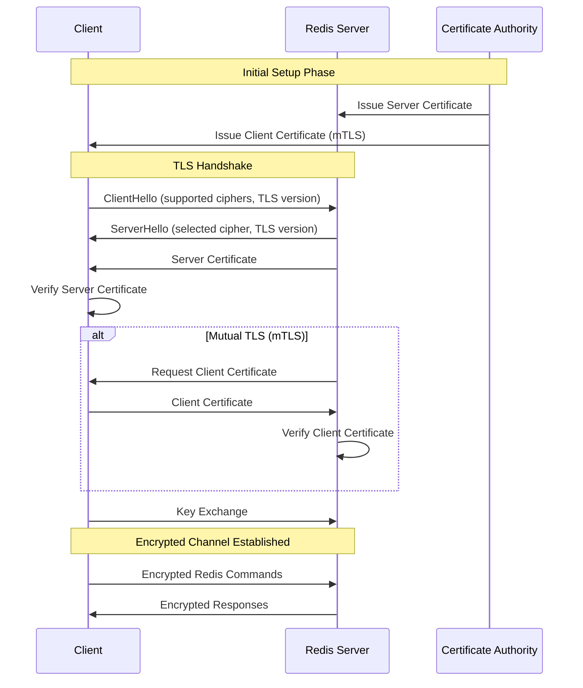
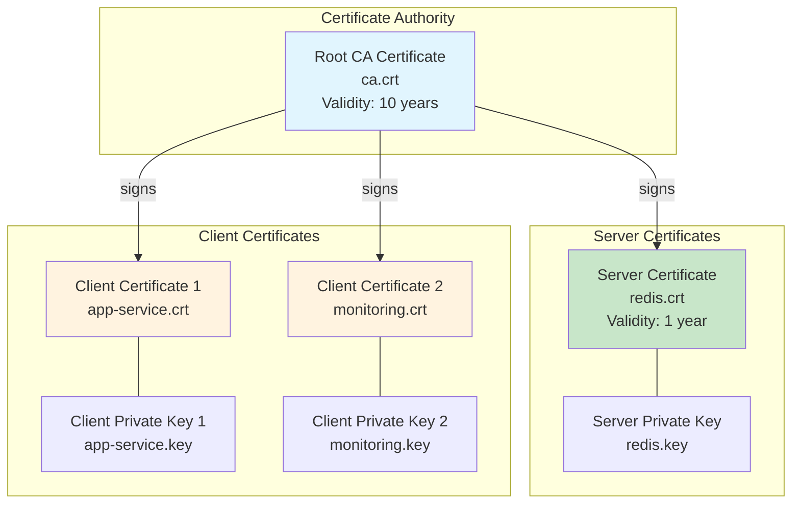
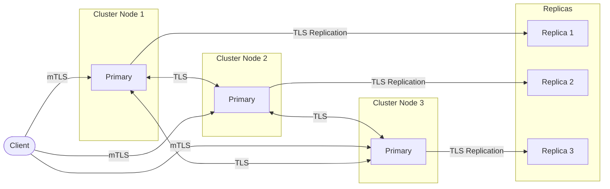
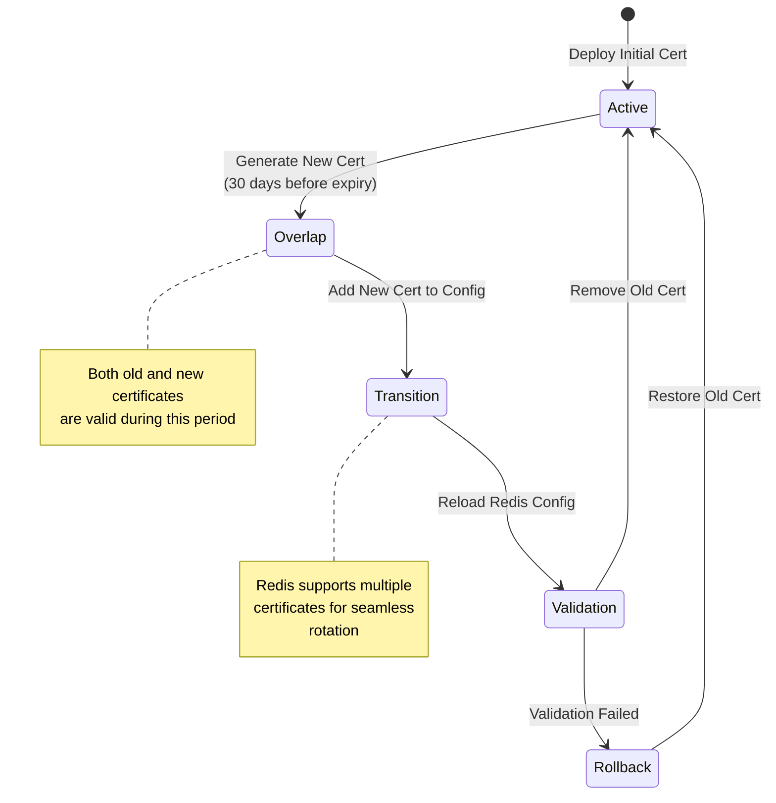
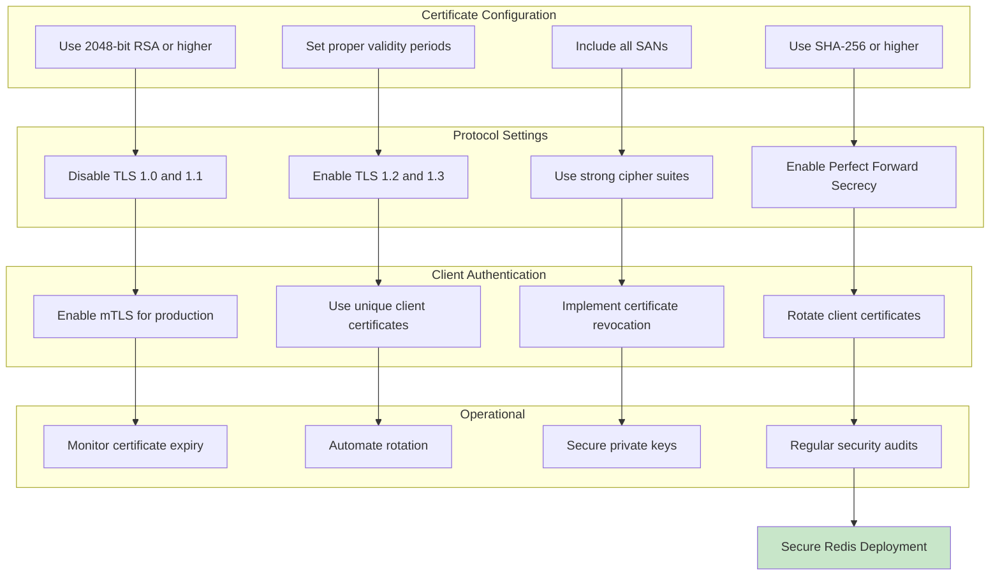

# How to Build Redis TLS Configuration Best Practices

Author: [nawazdhandala](https://github.com/nawazdhandala)

Tags: Redis, TLS, Security, Encryption

Description: Learn to configure Redis TLS with certificate management, cipher selection, and client authentication for encrypted connections.

---

## Introduction

Redis is widely used as an in-memory data store, cache, and message broker. By default, Redis communicates over unencrypted connections, which can expose sensitive data to eavesdropping and man-in-the-middle attacks. Transport Layer Security (TLS) provides encryption, authentication, and data integrity for Redis connections.

This guide covers best practices for configuring Redis TLS, including certificate management, cipher selection, client authentication, and certificate rotation strategies.

## TLS Architecture Overview

Before diving into configuration, let us understand how TLS works with Redis.



## Certificate Setup

### Generating a Certificate Authority

First, create a private Certificate Authority (CA) for signing your certificates.

```bash
#!/bin/bash
# generate-ca.sh - Create a private Certificate Authority

# Set variables
CA_DIR="/etc/redis/tls"
CA_DAYS=3650  # 10 years validity
CA_KEY_SIZE=4096

# Create directory structure
mkdir -p ${CA_DIR}/{ca,server,client}
cd ${CA_DIR}

# Generate CA private key
openssl genrsa -aes256 -out ca/ca.key ${CA_KEY_SIZE}

# Generate CA certificate
openssl req -new -x509 -days ${CA_DAYS} \
    -key ca/ca.key \
    -sha256 \
    -out ca/ca.crt \
    -subj "/C=US/ST=California/L=San Francisco/O=MyOrg/OU=Infrastructure/CN=Redis CA"

# Set secure permissions
chmod 400 ca/ca.key
chmod 444 ca/ca.crt

echo "CA certificate generated at ${CA_DIR}/ca/ca.crt"
```

### Generating Server Certificates

Create certificates for your Redis server with proper Subject Alternative Names (SANs).

```bash
#!/bin/bash
# generate-server-cert.sh - Generate Redis server certificate

CA_DIR="/etc/redis/tls"
SERVER_DAYS=365
SERVER_KEY_SIZE=2048
REDIS_HOST="redis.example.com"

cd ${CA_DIR}

# Create server private key
openssl genrsa -out server/redis.key ${SERVER_KEY_SIZE}

# Create certificate signing request (CSR)
openssl req -new \
    -key server/redis.key \
    -out server/redis.csr \
    -subj "/C=US/ST=California/L=San Francisco/O=MyOrg/OU=Redis/CN=${REDIS_HOST}"

# Create extension file for SANs
cat > server/redis.ext << EOF
authorityKeyIdentifier=keyid,issuer
basicConstraints=CA:FALSE
keyUsage = digitalSignature, keyEncipherment
extendedKeyUsage = serverAuth
subjectAltName = @alt_names

[alt_names]
DNS.1 = ${REDIS_HOST}
DNS.2 = localhost
DNS.3 = redis-primary
DNS.4 = redis-replica-1
DNS.5 = redis-replica-2
IP.1 = 127.0.0.1
IP.2 = 10.0.0.10
EOF

# Sign the certificate with CA
openssl x509 -req \
    -in server/redis.csr \
    -CA ca/ca.crt \
    -CAkey ca/ca.key \
    -CAcreateserial \
    -out server/redis.crt \
    -days ${SERVER_DAYS} \
    -sha256 \
    -extfile server/redis.ext

# Create certificate chain
cat server/redis.crt ca/ca.crt > server/redis-chain.crt

# Set permissions
chmod 400 server/redis.key
chmod 444 server/redis.crt server/redis-chain.crt

echo "Server certificate generated at ${CA_DIR}/server/redis.crt"
```

### Generating Client Certificates for mTLS

For mutual TLS authentication, generate client certificates.

```bash
#!/bin/bash
# generate-client-cert.sh - Generate client certificate for mTLS

CA_DIR="/etc/redis/tls"
CLIENT_NAME="app-service"
CLIENT_DAYS=365

cd ${CA_DIR}

# Generate client private key
openssl genrsa -out client/${CLIENT_NAME}.key 2048

# Create CSR
openssl req -new \
    -key client/${CLIENT_NAME}.key \
    -out client/${CLIENT_NAME}.csr \
    -subj "/C=US/ST=California/L=San Francisco/O=MyOrg/OU=Applications/CN=${CLIENT_NAME}"

# Create extension file
cat > client/${CLIENT_NAME}.ext << EOF
authorityKeyIdentifier=keyid,issuer
basicConstraints=CA:FALSE
keyUsage = digitalSignature
extendedKeyUsage = clientAuth
EOF

# Sign with CA
openssl x509 -req \
    -in client/${CLIENT_NAME}.csr \
    -CA ca/ca.crt \
    -CAkey ca/ca.key \
    -CAcreateserial \
    -out client/${CLIENT_NAME}.crt \
    -days ${CLIENT_DAYS} \
    -sha256 \
    -extfile client/${CLIENT_NAME}.ext

chmod 400 client/${CLIENT_NAME}.key
chmod 444 client/${CLIENT_NAME}.crt

echo "Client certificate generated for ${CLIENT_NAME}"
```

## Certificate Hierarchy

Understanding the certificate chain is essential for proper TLS configuration.



## Redis Server TLS Configuration

### Basic TLS Configuration

Configure Redis to use TLS in your `redis.conf` file.

```conf
# redis.conf - TLS Configuration

# Enable TLS on the standard port
port 0
tls-port 6379

# Certificate and key files
tls-cert-file /etc/redis/tls/server/redis.crt
tls-key-file /etc/redis/tls/server/redis.key
tls-ca-cert-file /etc/redis/tls/ca/ca.crt

# Require client authentication (mTLS)
tls-auth-clients yes

# TLS protocol versions (disable older versions)
tls-protocols "TLSv1.2 TLSv1.3"

# Prefer server cipher order
tls-prefer-server-ciphers yes
```

### Cipher Suite Configuration

Selecting appropriate cipher suites is critical for security.

```conf
# redis.conf - Cipher Configuration

# TLS 1.2 cipher suites (ordered by preference)
tls-ciphers ECDHE-ECDSA-AES256-GCM-SHA384:ECDHE-RSA-AES256-GCM-SHA384:ECDHE-ECDSA-AES128-GCM-SHA256:ECDHE-RSA-AES128-GCM-SHA256

# TLS 1.3 cipher suites
tls-ciphersuites TLS_AES_256_GCM_SHA384:TLS_CHACHA20_POLY1305_SHA256:TLS_AES_128_GCM_SHA256
```

Here is a breakdown of cipher selection criteria:

| Cipher Component | Recommendation | Reason |
|------------------|----------------|--------|
| Key Exchange | ECDHE | Perfect Forward Secrecy |
| Authentication | ECDSA or RSA | ECDSA is faster, RSA more compatible |
| Encryption | AES-GCM | AEAD cipher with hardware acceleration |
| Key Size | 256-bit preferred | Stronger security margin |
| Hash | SHA384/SHA256 | SHA-1 is deprecated |

### Replication and Cluster TLS

For Redis replication and cluster setups, configure TLS for inter-node communication.

```conf
# redis.conf - Replication TLS

# Enable TLS for replication
tls-replication yes

# For Redis Cluster
tls-cluster yes

# Session caching for better performance
tls-session-caching yes
tls-session-cache-size 20480
tls-session-cache-timeout 300
```



## Client Configuration Examples

### Python with redis-py

```python
import redis
import ssl

def create_redis_client():
    """Create a Redis client with TLS and mTLS authentication."""

    # Create SSL context
    ssl_context = ssl.create_default_context(
        purpose=ssl.Purpose.SERVER_AUTH,
        cafile='/etc/redis/tls/ca/ca.crt'
    )

    # Load client certificate for mTLS
    ssl_context.load_cert_chain(
        certfile='/etc/redis/tls/client/app-service.crt',
        keyfile='/etc/redis/tls/client/app-service.key'
    )

    # Set minimum TLS version
    ssl_context.minimum_version = ssl.TLSVersion.TLSv1_2

    # Verify server certificate
    ssl_context.check_hostname = True
    ssl_context.verify_mode = ssl.CERT_REQUIRED

    # Create Redis client
    client = redis.Redis(
        host='redis.example.com',
        port=6379,
        ssl=True,
        ssl_context=ssl_context,
        decode_responses=True
    )

    return client


def main():
    client = create_redis_client()

    # Test connection
    try:
        client.ping()
        print("Successfully connected to Redis with TLS")

        # Example operations
        client.set('test_key', 'secure_value')
        value = client.get('test_key')
        print(f"Retrieved value: {value}")

    except redis.ConnectionError as e:
        print(f"Connection failed: {e}")
    finally:
        client.close()


if __name__ == "__main__":
    main()
```

### Node.js with ioredis

```javascript
const Redis = require('ioredis');
const fs = require('fs');
const tls = require('tls');

function createRedisClient() {
    const tlsOptions = {
        // CA certificate to verify server
        ca: fs.readFileSync('/etc/redis/tls/ca/ca.crt'),

        // Client certificate and key for mTLS
        cert: fs.readFileSync('/etc/redis/tls/client/app-service.crt'),
        key: fs.readFileSync('/etc/redis/tls/client/app-service.key'),

        // Verify server certificate
        rejectUnauthorized: true,

        // Server hostname for SNI
        servername: 'redis.example.com',

        // Minimum TLS version
        minVersion: 'TLSv1.2'
    };

    const client = new Redis({
        host: 'redis.example.com',
        port: 6379,
        tls: tlsOptions,

        // Retry strategy
        retryStrategy: (times) => {
            const delay = Math.min(times * 50, 2000);
            return delay;
        },

        // Connection timeout
        connectTimeout: 10000
    });

    client.on('connect', () => {
        console.log('Connected to Redis with TLS');
    });

    client.on('error', (err) => {
        console.error('Redis connection error:', err.message);
    });

    return client;
}

async function main() {
    const client = createRedisClient();

    try {
        await client.ping();
        console.log('PING successful');

        await client.set('test_key', 'secure_value');
        const value = await client.get('test_key');
        console.log(`Retrieved value: ${value}`);

    } catch (error) {
        console.error('Error:', error.message);
    } finally {
        await client.quit();
    }
}

main();
```

### Go with go-redis

```go
package main

import (
    "context"
    "crypto/tls"
    "crypto/x509"
    "fmt"
    "log"
    "os"

    "github.com/redis/go-redis/v9"
)

func createTLSConfig() (*tls.Config, error) {
    // Load CA certificate
    caCert, err := os.ReadFile("/etc/redis/tls/ca/ca.crt")
    if err != nil {
        return nil, fmt.Errorf("failed to read CA cert: %w", err)
    }

    caCertPool := x509.NewCertPool()
    if !caCertPool.AppendCertsFromPEM(caCert) {
        return nil, fmt.Errorf("failed to parse CA cert")
    }

    // Load client certificate for mTLS
    clientCert, err := tls.LoadX509KeyPair(
        "/etc/redis/tls/client/app-service.crt",
        "/etc/redis/tls/client/app-service.key",
    )
    if err != nil {
        return nil, fmt.Errorf("failed to load client cert: %w", err)
    }

    tlsConfig := &tls.Config{
        RootCAs:      caCertPool,
        Certificates: []tls.Certificate{clientCert},
        MinVersion:   tls.VersionTLS12,
        ServerName:   "redis.example.com",
    }

    return tlsConfig, nil
}

func main() {
    ctx := context.Background()

    tlsConfig, err := createTLSConfig()
    if err != nil {
        log.Fatalf("TLS config error: %v", err)
    }

    client := redis.NewClient(&redis.Options{
        Addr:      "redis.example.com:6379",
        TLSConfig: tlsConfig,
        PoolSize:  10,
    })
    defer client.Close()

    // Test connection
    if err := client.Ping(ctx).Err(); err != nil {
        log.Fatalf("Failed to connect: %v", err)
    }
    fmt.Println("Connected to Redis with TLS")

    // Example operations
    if err := client.Set(ctx, "test_key", "secure_value", 0).Err(); err != nil {
        log.Fatalf("Set failed: %v", err)
    }

    value, err := client.Get(ctx, "test_key").Result()
    if err != nil {
        log.Fatalf("Get failed: %v", err)
    }
    fmt.Printf("Retrieved value: %s\n", value)
}
```

## Certificate Rotation

Certificate rotation is essential for maintaining security. Here is a strategy for zero-downtime rotation.



### Automated Rotation Script

```bash
#!/bin/bash
# rotate-certificates.sh - Automated certificate rotation

set -euo pipefail

CA_DIR="/etc/redis/tls"
REDIS_CONFIG="/etc/redis/redis.conf"
BACKUP_DIR="/etc/redis/tls/backup"
LOG_FILE="/var/log/redis/cert-rotation.log"

log() {
    echo "[$(date '+%Y-%m-%d %H:%M:%S')] $1" | tee -a ${LOG_FILE}
}

check_cert_expiry() {
    local cert_file=$1
    local days_threshold=$2

    expiry_date=$(openssl x509 -enddate -noout -in ${cert_file} | cut -d= -f2)
    expiry_epoch=$(date -d "${expiry_date}" +%s)
    current_epoch=$(date +%s)
    days_remaining=$(( (expiry_epoch - current_epoch) / 86400 ))

    if [ ${days_remaining} -lt ${days_threshold} ]; then
        return 0  # Needs rotation
    fi
    return 1  # Still valid
}

backup_certificates() {
    local timestamp=$(date +%Y%m%d_%H%M%S)
    mkdir -p ${BACKUP_DIR}/${timestamp}
    cp ${CA_DIR}/server/redis.crt ${BACKUP_DIR}/${timestamp}/
    cp ${CA_DIR}/server/redis.key ${BACKUP_DIR}/${timestamp}/
    log "Certificates backed up to ${BACKUP_DIR}/${timestamp}"
}

generate_new_certificate() {
    log "Generating new server certificate..."

    # Generate new key
    openssl genrsa -out ${CA_DIR}/server/redis-new.key 2048

    # Create CSR
    openssl req -new \
        -key ${CA_DIR}/server/redis-new.key \
        -out ${CA_DIR}/server/redis-new.csr \
        -subj "/C=US/ST=California/L=San Francisco/O=MyOrg/OU=Redis/CN=redis.example.com"

    # Sign with CA
    openssl x509 -req \
        -in ${CA_DIR}/server/redis-new.csr \
        -CA ${CA_DIR}/ca/ca.crt \
        -CAkey ${CA_DIR}/ca/ca.key \
        -CAcreateserial \
        -out ${CA_DIR}/server/redis-new.crt \
        -days 365 \
        -sha256 \
        -extfile ${CA_DIR}/server/redis.ext

    log "New certificate generated"
}

validate_new_certificate() {
    log "Validating new certificate..."

    # Verify certificate chain
    if ! openssl verify -CAfile ${CA_DIR}/ca/ca.crt ${CA_DIR}/server/redis-new.crt; then
        log "ERROR: Certificate validation failed"
        return 1
    fi

    # Check key matches certificate
    cert_modulus=$(openssl x509 -noout -modulus -in ${CA_DIR}/server/redis-new.crt | md5sum)
    key_modulus=$(openssl rsa -noout -modulus -in ${CA_DIR}/server/redis-new.key | md5sum)

    if [ "${cert_modulus}" != "${key_modulus}" ]; then
        log "ERROR: Key does not match certificate"
        return 1
    fi

    log "Certificate validation successful"
    return 0
}

rotate_certificate() {
    log "Starting certificate rotation..."

    # Backup current certificates
    backup_certificates

    # Generate new certificate
    generate_new_certificate

    # Validate new certificate
    if ! validate_new_certificate; then
        log "Rotation aborted due to validation failure"
        exit 1
    fi

    # Swap certificates
    mv ${CA_DIR}/server/redis.crt ${CA_DIR}/server/redis-old.crt
    mv ${CA_DIR}/server/redis.key ${CA_DIR}/server/redis-old.key
    mv ${CA_DIR}/server/redis-new.crt ${CA_DIR}/server/redis.crt
    mv ${CA_DIR}/server/redis-new.key ${CA_DIR}/server/redis.key

    # Set permissions
    chmod 400 ${CA_DIR}/server/redis.key
    chmod 444 ${CA_DIR}/server/redis.crt

    log "Certificates swapped"

    # Reload Redis configuration
    log "Reloading Redis configuration..."
    redis-cli CONFIG SET tls-cert-file ${CA_DIR}/server/redis.crt
    redis-cli CONFIG SET tls-key-file ${CA_DIR}/server/redis.key

    # Verify Redis is still accepting connections
    if redis-cli --tls \
        --cert ${CA_DIR}/client/app-service.crt \
        --key ${CA_DIR}/client/app-service.key \
        --cacert ${CA_DIR}/ca/ca.crt \
        PING | grep -q PONG; then
        log "Certificate rotation completed successfully"
        rm -f ${CA_DIR}/server/redis-old.crt ${CA_DIR}/server/redis-old.key
    else
        log "ERROR: Redis health check failed, rolling back"
        mv ${CA_DIR}/server/redis-old.crt ${CA_DIR}/server/redis.crt
        mv ${CA_DIR}/server/redis-old.key ${CA_DIR}/server/redis.key
        redis-cli CONFIG SET tls-cert-file ${CA_DIR}/server/redis.crt
        redis-cli CONFIG SET tls-key-file ${CA_DIR}/server/redis.key
        exit 1
    fi
}

# Main execution
if check_cert_expiry "${CA_DIR}/server/redis.crt" 30; then
    log "Certificate expires within 30 days, starting rotation"
    rotate_certificate
else
    log "Certificate still valid, no rotation needed"
fi
```

### Cron Job for Automated Rotation

```bash
# Add to crontab: crontab -e
# Run daily at 2 AM
0 2 * * * /usr/local/bin/rotate-certificates.sh >> /var/log/redis/cert-rotation.log 2>&1
```

## Monitoring and Validation

### TLS Connection Verification

```bash
#!/bin/bash
# verify-tls.sh - Verify Redis TLS configuration

REDIS_HOST="redis.example.com"
REDIS_PORT=6379
CA_CERT="/etc/redis/tls/ca/ca.crt"
CLIENT_CERT="/etc/redis/tls/client/app-service.crt"
CLIENT_KEY="/etc/redis/tls/client/app-service.key"

echo "=== Redis TLS Verification ==="

# Check server certificate
echo -e "\n[1] Server Certificate Info:"
echo | openssl s_client -connect ${REDIS_HOST}:${REDIS_PORT} \
    -CAfile ${CA_CERT} \
    -cert ${CLIENT_CERT} \
    -key ${CLIENT_KEY} \
    2>/dev/null | openssl x509 -noout -subject -issuer -dates

# Check TLS version and cipher
echo -e "\n[2] TLS Protocol and Cipher:"
echo | openssl s_client -connect ${REDIS_HOST}:${REDIS_PORT} \
    -CAfile ${CA_CERT} \
    -cert ${CLIENT_CERT} \
    -key ${CLIENT_KEY} \
    2>/dev/null | grep -E "Protocol|Cipher"

# Verify certificate chain
echo -e "\n[3] Certificate Chain Verification:"
openssl s_client -connect ${REDIS_HOST}:${REDIS_PORT} \
    -CAfile ${CA_CERT} \
    -cert ${CLIENT_CERT} \
    -key ${CLIENT_KEY} \
    -verify_return_error \
    2>&1 | grep -E "Verify|verify"

# Test Redis connection with TLS
echo -e "\n[4] Redis PING Test:"
redis-cli --tls \
    --cert ${CLIENT_CERT} \
    --key ${CLIENT_KEY} \
    --cacert ${CA_CERT} \
    -h ${REDIS_HOST} \
    -p ${REDIS_PORT} \
    PING

echo -e "\n=== Verification Complete ==="
```

### Monitoring Certificate Expiry

```python
#!/usr/bin/env python3
"""Monitor Redis TLS certificate expiry and send alerts."""

import ssl
import socket
import datetime
import smtplib
from email.mime.text import MIMEText


def get_certificate_expiry(host: str, port: int, ca_cert: str) -> datetime.datetime:
    """Get the expiry date of the server certificate."""
    context = ssl.create_default_context(cafile=ca_cert)
    context.check_hostname = False
    context.verify_mode = ssl.CERT_REQUIRED

    with socket.create_connection((host, port), timeout=10) as sock:
        with context.wrap_socket(sock, server_hostname=host) as ssock:
            cert = ssock.getpeercert()
            expiry_str = cert['notAfter']
            # Parse the date format: 'Mar 15 12:00:00 2025 GMT'
            expiry_date = datetime.datetime.strptime(
                expiry_str, '%b %d %H:%M:%S %Y %Z'
            )
            return expiry_date


def send_alert(subject: str, message: str, recipient: str):
    """Send email alert for certificate expiry."""
    msg = MIMEText(message)
    msg['Subject'] = subject
    msg['From'] = 'alerts@example.com'
    msg['To'] = recipient

    with smtplib.SMTP('localhost') as smtp:
        smtp.send_message(msg)


def check_certificate(host: str, port: int, ca_cert: str,
                      warning_days: int = 30, critical_days: int = 7):
    """Check certificate expiry and alert if needed."""
    try:
        expiry = get_certificate_expiry(host, port, ca_cert)
        days_remaining = (expiry - datetime.datetime.now()).days

        print(f"Certificate for {host}:{port}")
        print(f"  Expires: {expiry}")
        print(f"  Days remaining: {days_remaining}")

        if days_remaining <= critical_days:
            send_alert(
                f"[CRITICAL] Redis TLS Certificate Expiring",
                f"Certificate for {host}:{port} expires in {days_remaining} days!",
                "ops-team@example.com"
            )
            return "CRITICAL"
        elif days_remaining <= warning_days:
            send_alert(
                f"[WARNING] Redis TLS Certificate Expiring Soon",
                f"Certificate for {host}:{port} expires in {days_remaining} days.",
                "ops-team@example.com"
            )
            return "WARNING"

        return "OK"

    except Exception as e:
        print(f"Error checking certificate: {e}")
        return "ERROR"


if __name__ == "__main__":
    status = check_certificate(
        host="redis.example.com",
        port=6379,
        ca_cert="/etc/redis/tls/ca/ca.crt",
        warning_days=30,
        critical_days=7
    )
    print(f"Status: {status}")
```

## Security Checklist

Use this checklist to verify your Redis TLS configuration.



### Quick Reference Checklist

- [ ] **Certificates**
  - [ ] CA certificate has long validity (5-10 years)
  - [ ] Server certificates have shorter validity (1 year or less)
  - [ ] All required SANs are included
  - [ ] Private keys are protected with proper permissions (400)

- [ ] **Protocol Configuration**
  - [ ] TLS 1.0 and 1.1 are disabled
  - [ ] Only strong cipher suites are enabled
  - [ ] Server cipher preference is enabled
  - [ ] Session caching is configured for performance

- [ ] **Authentication**
  - [ ] mTLS is enabled for production environments
  - [ ] Each client application has unique certificates
  - [ ] Client certificates have appropriate validity periods

- [ ] **Operations**
  - [ ] Certificate expiry monitoring is in place
  - [ ] Automated rotation is configured
  - [ ] Backup procedures exist for certificates
  - [ ] Incident response plan includes certificate issues

## Troubleshooting Common Issues

### Certificate Verification Failed

```bash
# Check if certificate is signed by the CA
openssl verify -CAfile /etc/redis/tls/ca/ca.crt /etc/redis/tls/server/redis.crt

# Check certificate dates
openssl x509 -noout -dates -in /etc/redis/tls/server/redis.crt

# Verify hostname in certificate
openssl x509 -noout -text -in /etc/redis/tls/server/redis.crt | grep -A1 "Subject Alternative Name"
```

### Connection Timeout with TLS

```bash
# Test TLS handshake with verbose output
openssl s_client -connect redis.example.com:6379 \
    -CAfile /etc/redis/tls/ca/ca.crt \
    -cert /etc/redis/tls/client/app-service.crt \
    -key /etc/redis/tls/client/app-service.key \
    -debug

# Check if Redis is listening on TLS port
netstat -tlnp | grep 6379
```

### Permission Denied Errors

```bash
# Verify file permissions
ls -la /etc/redis/tls/server/

# Redis should be able to read these files
# Correct permissions:
# -r-------- (400) for private keys
# -r--r--r-- (444) for certificates

# Fix ownership if needed
chown redis:redis /etc/redis/tls/server/*
```

## Conclusion

Configuring TLS for Redis is essential for securing data in transit. By following these best practices, you can ensure that your Redis deployment is protected against eavesdropping and unauthorized access.

Key takeaways:

1. **Always use TLS 1.2 or higher** - Older versions have known vulnerabilities
2. **Implement mTLS for production** - Client certificates provide strong authentication
3. **Automate certificate rotation** - Manual rotation is error-prone and risky
4. **Monitor certificate expiry** - Prevent outages from expired certificates
5. **Use strong cipher suites** - Prefer ECDHE for key exchange and AES-GCM for encryption

Regular security audits and keeping up with TLS best practices will help maintain a secure Redis infrastructure.

## References

- [Redis TLS Documentation](https://redis.io/docs/management/security/encryption/)
- [OpenSSL Certificate Authority](https://jamielinux.com/docs/openssl-certificate-authority/)
- [Mozilla TLS Configuration](https://wiki.mozilla.org/Security/Server_Side_TLS)
- [NIST TLS Guidelines](https://nvlpubs.nist.gov/nistpubs/SpecialPublications/NIST.SP.800-52r2.pdf)
