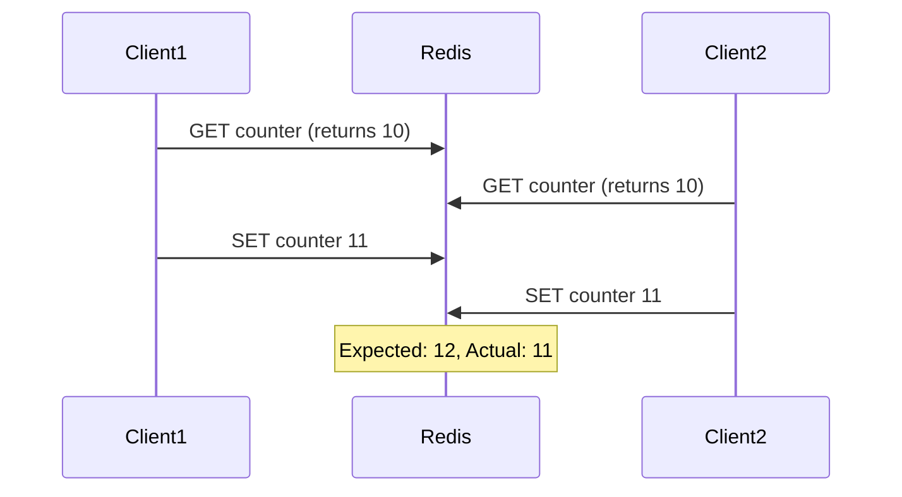
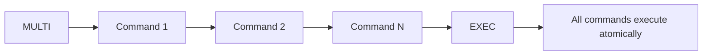
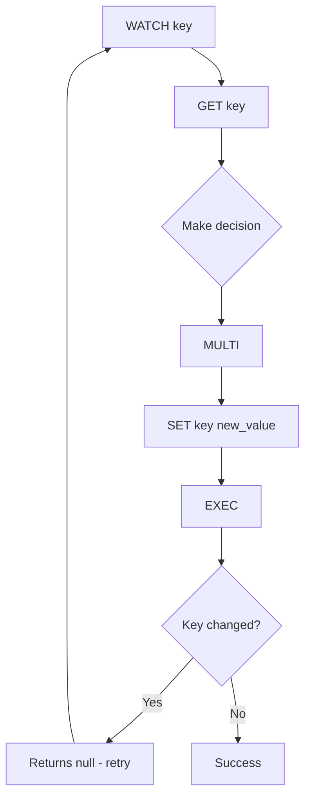
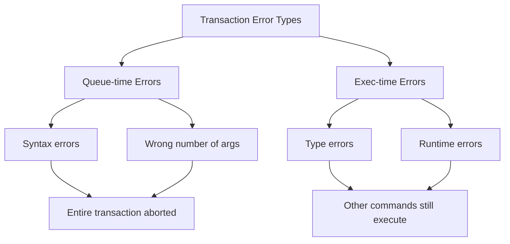
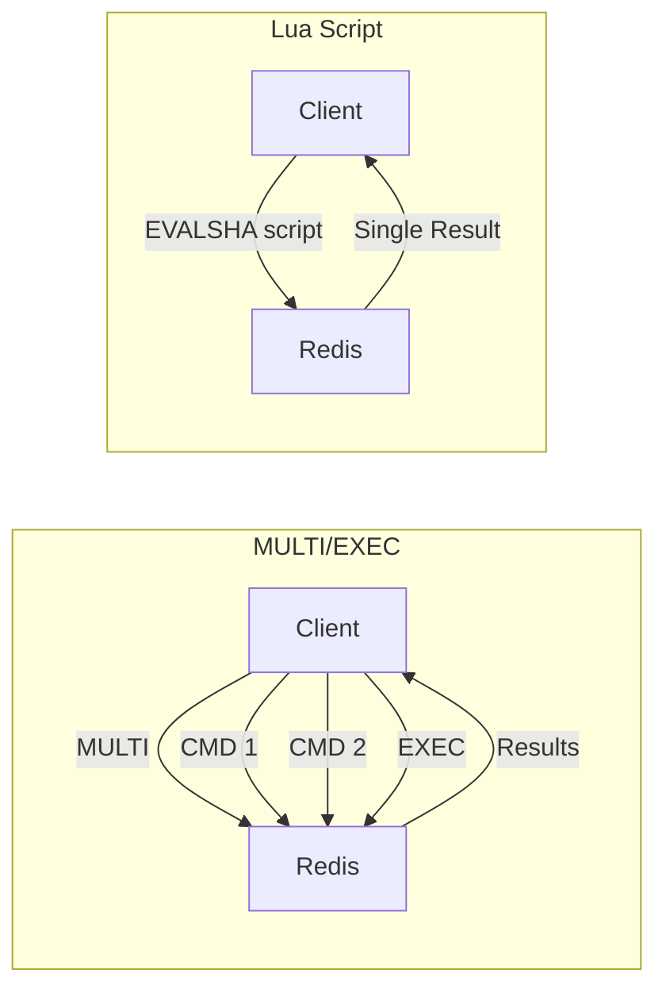

# How to Build Redis Transaction Patterns

Author: [nawazdhandala](https://github.com/nawazdhandala)

Tags: Redis, Transactions, MULTI EXEC, Atomic Operations

Description: Learn to implement Redis transactions with MULTI/EXEC, WATCH for optimistic locking, and Lua scripts for complex atomic operations.

---

Redis is known for its blazing-fast performance and simplicity, but when you need to execute multiple commands as a single atomic unit, you need transactions. In this post, we will explore how to build robust Redis transaction patterns that ensure data consistency in concurrent environments.

## Why Redis Transactions Matter

In distributed systems, race conditions can corrupt your data. Consider a simple counter increment - without atomicity, two concurrent clients might read the same value and both write the same incremented result, losing one update.



Redis transactions solve this problem by guaranteeing that a group of commands executes as a single isolated operation.

## Understanding MULTI/EXEC

The foundation of Redis transactions is the MULTI/EXEC block. When you issue MULTI, Redis starts queuing commands instead of executing them immediately. When you issue EXEC, all queued commands execute atomically.



### Basic MULTI/EXEC Example

Here is a simple example using Node.js with the ioredis library:

```javascript
const Redis = require('ioredis');
const redis = new Redis();

async function transferFunds(fromAccount, toAccount, amount) {
    // Start a transaction
    const pipeline = redis.multi();

    // Queue the debit and credit operations
    pipeline.decrby(`balance:${fromAccount}`, amount);
    pipeline.incrby(`balance:${toAccount}`, amount);

    // Execute all commands atomically
    const results = await pipeline.exec();

    // Check results - each result is [error, value]
    for (const [error, value] of results) {
        if (error) {
            throw new Error(`Transaction failed: ${error.message}`);
        }
    }

    return results;
}

// Usage
await transferFunds('alice', 'bob', 100);
```

### Python Example with redis-py

```python
import redis

r = redis.Redis(host='localhost', port=6379, db=0)

def transfer_funds(from_account, to_account, amount):
    # Create a pipeline with transaction=True (default)
    pipe = r.pipeline()

    # Queue commands
    pipe.decrby(f'balance:{from_account}', amount)
    pipe.incrby(f'balance:{to_account}', amount)

    # Execute atomically
    results = pipe.execute()
    return results

# Usage
transfer_funds('alice', 'bob', 100)
```

## Optimistic Locking with WATCH

MULTI/EXEC guarantees atomicity but not isolation from reads. If you need to read a value, make a decision, and then update based on that decision, you need WATCH for optimistic locking.



### WATCH Example - Safe Counter Increment

```javascript
const Redis = require('ioredis');
const redis = new Redis();

async function safeIncrement(key, maxRetries = 3) {
    for (let attempt = 0; attempt < maxRetries; attempt++) {
        try {
            // Watch the key for changes
            await redis.watch(key);

            // Read current value
            const currentValue = await redis.get(key);
            const newValue = parseInt(currentValue || '0', 10) + 1;

            // Start transaction
            const result = await redis
                .multi()
                .set(key, newValue)
                .exec();

            // If exec returns null, the watched key was modified
            if (result === null) {
                console.log(`Attempt ${attempt + 1}: Key was modified, retrying...`);
                continue;
            }

            return newValue;
        } catch (error) {
            await redis.unwatch();
            throw error;
        }
    }

    throw new Error('Max retries exceeded');
}
```

### Compare-and-Set Pattern

A common pattern is to update a value only if it matches an expected state:

```python
import redis

def compare_and_set(key, expected_value, new_value, max_retries=3):
    r = redis.Redis()

    for attempt in range(max_retries):
        # Watch the key
        r.watch(key)

        # Get current value
        current = r.get(key)

        if current != expected_value:
            r.unwatch()
            return False  # Value doesn't match expected

        try:
            # Attempt the update
            pipe = r.pipeline()
            pipe.set(key, new_value)
            result = pipe.execute()
            return True  # Success
        except redis.WatchError:
            # Key was modified, retry
            continue

    return False  # Max retries exceeded

# Usage - only update if current value is 'pending'
success = compare_and_set('order:123:status', b'pending', 'confirmed')
```

## Error Handling in Transactions

Redis transactions have specific error behaviors you need to understand:



### Handling Different Error Types

```javascript
const Redis = require('ioredis');
const redis = new Redis();

async function robustTransaction() {
    const pipeline = redis.multi();

    // Queue commands
    pipeline.set('key1', 'value1');
    pipeline.incr('key1');  // This will fail - key1 is not a number
    pipeline.set('key2', 'value2');

    const results = await pipeline.exec();

    // Results array contains [error, result] for each command
    results.forEach(([err, result], index) => {
        if (err) {
            console.error(`Command ${index} failed:`, err.message);
        } else {
            console.log(`Command ${index} succeeded:`, result);
        }
    });

    // Output:
    // Command 0 succeeded: OK
    // Command 1 failed: ERR value is not an integer...
    // Command 2 succeeded: OK
}
```

### Validation Before Transaction

To avoid partial failures, validate before executing:

```javascript
async function validateAndTransfer(fromAccount, toAccount, amount) {
    // Validate before starting transaction
    const balance = await redis.get(`balance:${fromAccount}`);

    if (!balance || parseInt(balance, 10) < amount) {
        throw new Error('Insufficient funds');
    }

    // Use WATCH to ensure balance hasn't changed
    await redis.watch(`balance:${fromAccount}`);

    // Re-check after watch
    const confirmedBalance = await redis.get(`balance:${fromAccount}`);
    if (parseInt(confirmedBalance, 10) < amount) {
        await redis.unwatch();
        throw new Error('Insufficient funds');
    }

    const result = await redis
        .multi()
        .decrby(`balance:${fromAccount}`, amount)
        .incrby(`balance:${toAccount}`, amount)
        .exec();

    if (result === null) {
        throw new Error('Transaction aborted - concurrent modification');
    }

    return result;
}
```

## Lua Scripts - The Better Alternative

For complex atomic operations, Lua scripts are often superior to MULTI/EXEC. They execute atomically on the server, reducing round trips and allowing conditional logic.



### Lua Script for Safe Transfer

```lua
-- transfer.lua
-- KEYS[1] = from account key
-- KEYS[2] = to account key
-- ARGV[1] = amount

local from_balance = tonumber(redis.call('GET', KEYS[1]) or '0')
local amount = tonumber(ARGV[1])

if from_balance < amount then
    return {err = 'Insufficient funds'}
end

redis.call('DECRBY', KEYS[1], amount)
redis.call('INCRBY', KEYS[2], amount)

return {ok = 'Transfer complete'}
```

### Using Lua Scripts in Node.js

```javascript
const Redis = require('ioredis');
const redis = new Redis();

// Define the Lua script
const transferScript = `
local from_balance = tonumber(redis.call('GET', KEYS[1]) or '0')
local amount = tonumber(ARGV[1])

if from_balance < amount then
    return redis.error_reply('Insufficient funds')
end

redis.call('DECRBY', KEYS[1], amount)
redis.call('INCRBY', KEYS[2], amount)

return 'OK'
`;

// Register the script
redis.defineCommand('transfer', {
    numberOfKeys: 2,
    lua: transferScript
});

// Use it like a native command
async function transferWithLua(fromAccount, toAccount, amount) {
    try {
        const result = await redis.transfer(
            `balance:${fromAccount}`,
            `balance:${toAccount}`,
            amount
        );
        return result;
    } catch (error) {
        if (error.message.includes('Insufficient funds')) {
            throw new Error('Transfer failed: insufficient funds');
        }
        throw error;
    }
}
```

### Lua Script for Rate Limiting

A practical example - implementing a sliding window rate limiter:

```lua
-- rate_limiter.lua
-- KEYS[1] = rate limit key
-- ARGV[1] = window size in seconds
-- ARGV[2] = max requests
-- ARGV[3] = current timestamp

local key = KEYS[1]
local window = tonumber(ARGV[1])
local max_requests = tonumber(ARGV[2])
local now = tonumber(ARGV[3])
local window_start = now - window

-- Remove old entries
redis.call('ZREMRANGEBYSCORE', key, '-inf', window_start)

-- Count current requests
local current_requests = redis.call('ZCARD', key)

if current_requests >= max_requests then
    return 0  -- Rate limited
end

-- Add new request
redis.call('ZADD', key, now, now .. '-' .. math.random())
redis.call('EXPIRE', key, window)

return 1  -- Allowed
```

```javascript
// Using the rate limiter
const rateLimiterScript = `...`; // Script from above

redis.defineCommand('rateLimit', {
    numberOfKeys: 1,
    lua: rateLimiterScript
});

async function checkRateLimit(userId, windowSeconds = 60, maxRequests = 100) {
    const key = `ratelimit:${userId}`;
    const now = Date.now() / 1000;

    const allowed = await redis.rateLimit(key, windowSeconds, maxRequests, now);
    return allowed === 1;
}
```

## Transaction Patterns Summary

| Pattern | Use Case | Pros | Cons |
|---------|----------|------|------|
| MULTI/EXEC | Simple atomic writes | Easy to use | No conditional logic |
| WATCH + MULTI | Read-modify-write | Optimistic locking | Requires retry logic |
| Lua Scripts | Complex atomic ops | Full conditional logic | Debugging harder |

## Best Practices

1. **Keep transactions short** - Long transactions block other clients from accessing watched keys.

2. **Use Lua for complex logic** - If you need conditionals or loops, Lua scripts are cleaner than WATCH retry loops.

3. **Always handle WATCH failures** - Build retry logic with exponential backoff:

```javascript
async function withRetry(operation, maxRetries = 5) {
    for (let i = 0; i < maxRetries; i++) {
        try {
            return await operation();
        } catch (error) {
            if (error.message.includes('WATCHERROR') || error.message.includes('aborted')) {
                const delay = Math.min(100 * Math.pow(2, i), 1000);
                await new Promise(resolve => setTimeout(resolve, delay));
                continue;
            }
            throw error;
        }
    }
    throw new Error('Max retries exceeded');
}
```

4. **Test concurrent scenarios** - Use tools like Redis benchmark or write integration tests that simulate concurrent access.

5. **Monitor transaction performance** - Use Redis SLOWLOG to identify slow transactions.

## Conclusion

Redis transactions provide powerful primitives for building atomic operations. Start with simple MULTI/EXEC for basic batching, add WATCH when you need optimistic locking, and graduate to Lua scripts for complex conditional logic.

Remember that Redis transactions are not the same as traditional database transactions - there is no rollback. Design your operations to be idempotent when possible, and always handle the case where a WATCH-based transaction needs to retry.

By mastering these patterns, you can build robust, high-performance systems that maintain data consistency even under heavy concurrent load.
