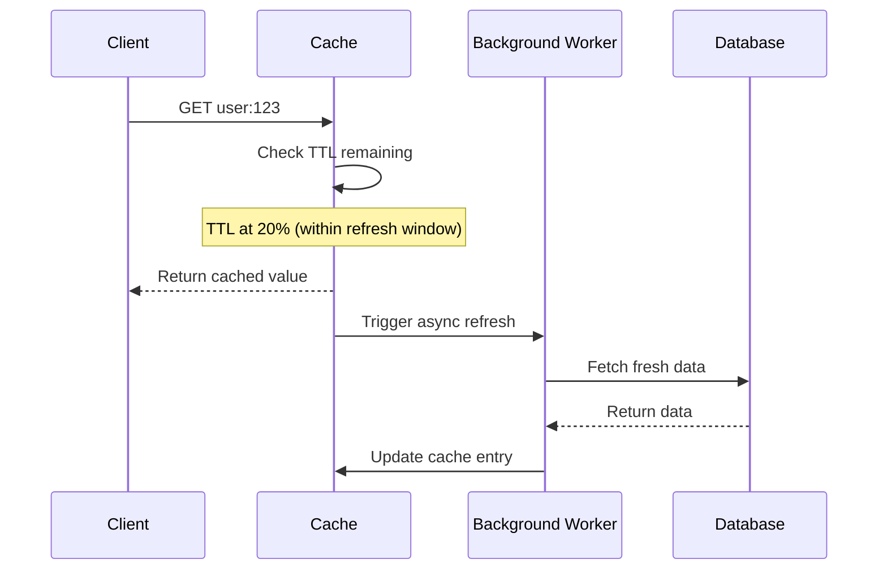
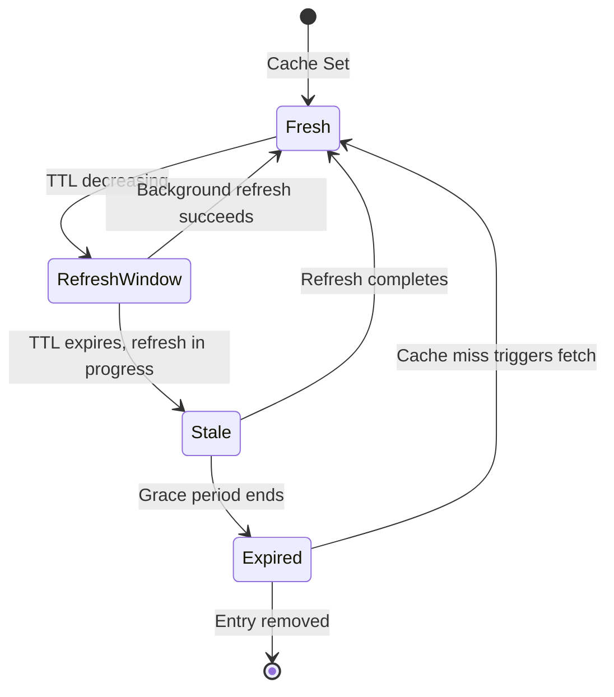

# How to Build Refresh-Ahead Pattern

Author: [nawazdhandala](https://github.com/nawazdhandala)

Tags: Caching, Refresh-Ahead, Performance, Proactive

Description: Learn to build the refresh-ahead caching pattern for proactive cache updates before expiration.

---

Cache misses hurt performance. When a cache entry expires, the first request to access it must wait for the data to be fetched from the source, causing latency spikes. The refresh-ahead pattern solves this by proactively refreshing cache entries before they expire, ensuring users always get fast cached responses.

## What is Refresh-Ahead Caching?

Traditional caching strategies like cache-aside wait for entries to expire before refreshing them. This creates a "cold cache" problem where the first request after expiration experiences the full latency of fetching from the source. Refresh-ahead takes a proactive approach by refreshing entries before they expire.

| Strategy | When Data is Fetched | User Experience |
|----------|---------------------|-----------------|
| **Cache-Aside** | After cache miss | Latency spike on miss |
| **Write-Through** | On every write | Consistent but write-heavy |
| **Write-Behind** | Async after write | Fast writes, eventual consistency |
| **Refresh-Ahead** | Before expiration | Consistently fast reads |

## How Refresh-Ahead Works

The pattern tracks when each cache entry should be refreshed based on a configurable threshold. When a request arrives and the entry is within the refresh window, the cache returns the current value immediately while triggering a background refresh.



## Basic Implementation

This implementation uses a refresh threshold to determine when to trigger background refreshes. When a cache entry has less than the threshold percentage of its TTL remaining, a refresh is triggered asynchronously.

```javascript
// RefreshAheadCache: proactively refreshes entries before expiration
// refreshThreshold: percentage of TTL remaining to trigger refresh (0.2 = 20%)
class RefreshAheadCache {
  constructor(options = {}) {
    this.cache = new Map();
    this.refreshThreshold = options.refreshThreshold || 0.2;
    this.defaultTTL = options.defaultTTL || 60000;
    this.refreshing = new Set();
  }

  set(key, value, ttl = this.defaultTTL) {
    const now = Date.now();
    this.cache.set(key, {
      value,
      createdAt: now,
      expiresAt: now + ttl,
      ttl,
    });
  }

  async get(key, fetchFn) {
    const entry = this.cache.get(key);
    const now = Date.now();

    // Cache miss: fetch and store
    if (!entry || now >= entry.expiresAt) {
      const value = await fetchFn();
      this.set(key, value);
      return value;
    }

    // Check if within refresh window
    const timeRemaining = entry.expiresAt - now;
    const refreshPoint = entry.ttl * this.refreshThreshold;

    if (timeRemaining <= refreshPoint && !this.refreshing.has(key)) {
      this.refreshInBackground(key, fetchFn, entry.ttl);
    }

    return entry.value;
  }

  async refreshInBackground(key, fetchFn, ttl) {
    this.refreshing.add(key);
    try {
      const value = await fetchFn();
      this.set(key, value, ttl);
    } catch (error) {
      console.error(`Background refresh failed for ${key}:`, error.message);
    } finally {
      this.refreshing.delete(key);
    }
  }
}

// Usage
const cache = new RefreshAheadCache({
  refreshThreshold: 0.25,
  defaultTTL: 300000,
});

const userData = await cache.get('user:123', async () => {
  return await database.query('SELECT * FROM users WHERE id = ?', [123]);
});
```

## Refresh Window Visualization

The refresh window determines when proactive refreshes occur. Setting this correctly balances between unnecessary refreshes (too early) and cache misses (too late).

```mermaid
gantt
    title Cache Entry Lifecycle with Refresh-Ahead
    dateFormat X
    axisFormat %s

    section Normal Zone
    Fresh data served    :active, 0, 80

    section Refresh Window
    Trigger background refresh :crit, 80, 100

    section Expired
    Cache miss occurs    :done, 100, 120
```



## Choosing the Right Refresh Threshold

The refresh threshold affects both cache hit rate and backend load. A lower threshold means more proactive refreshes but increased backend queries. A higher threshold risks more cache misses during traffic spikes.

| Threshold | Refresh Window | Trade-off |
|-----------|---------------|-----------|
| **10%** | Last 10% of TTL | Higher miss risk during spikes |
| **20%** | Last 20% of TTL | Balanced for most workloads |
| **30%** | Last 30% of TTL | More refreshes, fewer misses |
| **50%** | Last 50% of TTL | Heavy backend load |

Factors to consider when setting the threshold:

- **Traffic patterns**: High traffic needs earlier refresh windows
- **Backend latency**: Slow backends need larger refresh windows
- **Data freshness requirements**: Strict freshness needs shorter TTLs
- **Cost of cache miss**: High-latency APIs need aggressive refresh

## Handling Refresh Failures

When background refreshes fail, the cache should serve stale data rather than returning nothing. This implementation adds a grace period that extends the usable lifetime of cache entries when refreshes fail.

```javascript
// Extended cache with stale-while-revalidate behavior
class ResilientRefreshAheadCache {
  constructor(options = {}) {
    this.cache = new Map();
    this.refreshThreshold = options.refreshThreshold || 0.2;
    this.defaultTTL = options.defaultTTL || 60000;
    this.gracePeriod = options.gracePeriod || 30000;
    this.refreshing = new Set();
  }

  set(key, value, ttl = this.defaultTTL) {
    const now = Date.now();
    this.cache.set(key, {
      value,
      createdAt: now,
      expiresAt: now + ttl,
      staleAt: now + ttl + this.gracePeriod,
      ttl,
    });
  }

  async get(key, fetchFn) {
    const entry = this.cache.get(key);
    const now = Date.now();

    if (!entry) {
      const value = await fetchFn();
      this.set(key, value);
      return value;
    }

    // Within grace period but expired: serve stale, trigger refresh
    if (now >= entry.expiresAt && now < entry.staleAt) {
      this.refreshInBackground(key, fetchFn, entry.ttl);
      return entry.value;
    }

    // Beyond grace period: must fetch fresh
    if (now >= entry.staleAt) {
      const value = await fetchFn();
      this.set(key, value);
      return value;
    }

    // Check refresh window
    const timeRemaining = entry.expiresAt - now;
    const refreshPoint = entry.ttl * this.refreshThreshold;

    if (timeRemaining <= refreshPoint && !this.refreshing.has(key)) {
      this.refreshInBackground(key, fetchFn, entry.ttl);
    }

    return entry.value;
  }

  async refreshInBackground(key, fetchFn, ttl) {
    if (this.refreshing.has(key)) return;
    this.refreshing.add(key);

    try {
      const value = await fetchFn();
      this.set(key, value, ttl);
    } catch (error) {
      console.error(`Refresh failed for ${key}:`, error.message);
    } finally {
      this.refreshing.delete(key);
    }
  }
}
```

## Cache Entry Lifecycle

Understanding the full lifecycle helps in debugging and monitoring cache behavior.



## When to Use Refresh-Ahead

Refresh-ahead is not suitable for every caching scenario. It works best when read latency is critical and data access patterns are predictable.

**Good fit:**
- API responses with high read traffic
- Database queries that are expensive to compute
- External service calls with variable latency
- User session data accessed frequently

**Not ideal for:**
- Data that changes unpredictably
- Low-traffic cache entries (wastes resources)
- Data with very short TTLs (constant refreshing)
- Write-heavy workloads (use write-through instead)

## Summary

The refresh-ahead pattern eliminates latency spikes caused by cache misses by proactively refreshing entries before they expire. Key implementation considerations include:

| Aspect | Recommendation |
|--------|----------------|
| **Refresh threshold** | Start with 20%, adjust based on traffic |
| **Distributed locking** | Required for multi-instance deployments |
| **Failure handling** | Serve stale data within grace period |
| **Monitoring** | Track hit rate, refresh latency, and failures |

Combined with proper monitoring and failure handling, refresh-ahead caching provides consistently fast read performance for applications where latency matters.
