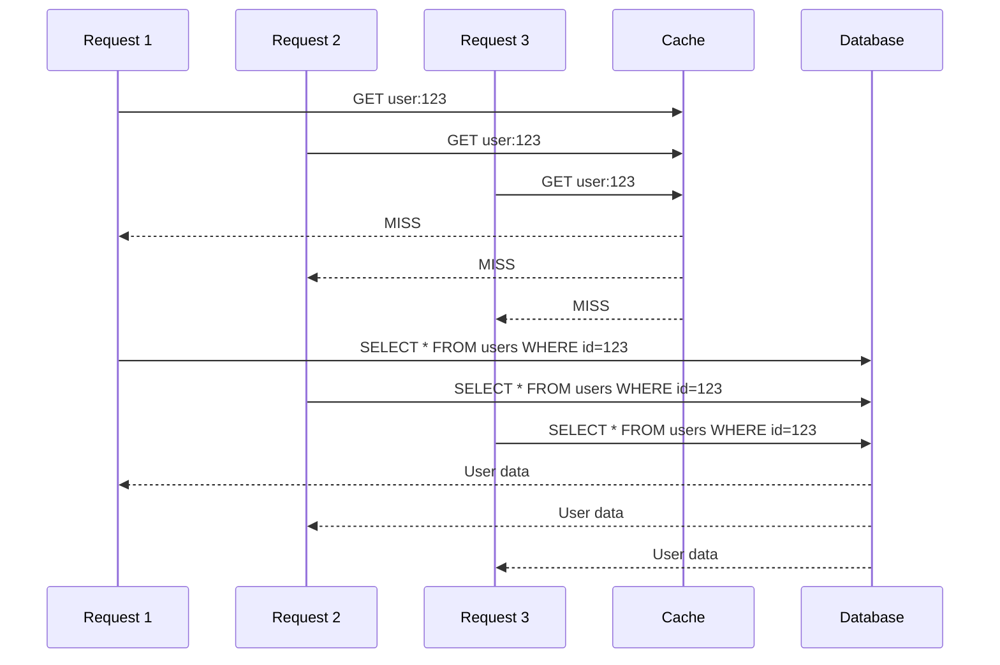
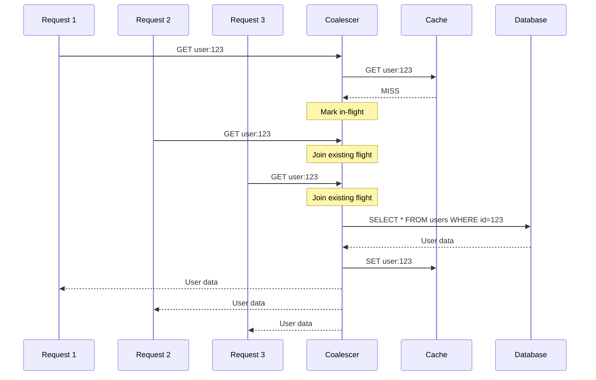

# How to Create Request Coalescing Implementation

Author: [nawazdhandala](https://github.com/nawazdhandala)

Tags: Caching, Request Coalescing, Performance, Concurrency

Description: Learn to create request coalescing to prevent duplicate backend calls during cache misses.

---

When your cache expires, hundreds of concurrent requests might all miss the cache simultaneously. Each request triggers an identical backend call, overwhelming your database or upstream service. Request coalescing solves this by ensuring only one request fetches the data while others wait for the result.

## The Thundering Herd Problem

Without request coalescing, a cache miss during high traffic creates a stampede of identical requests.



With 1000 concurrent requests, you get 1000 identical database queries. This pattern causes:

| Problem | Impact |
|---------|--------|
| Database overload | Connection pool exhaustion |
| Increased latency | All requests wait for DB |
| Wasted resources | Redundant computation |
| Cascade failures | Backend services crash |

## How Request Coalescing Works

Request coalescing groups concurrent requests for the same resource. Only the first request fetches the data, while others subscribe to the result.



Now 1000 concurrent requests result in exactly one database query.

## Basic Implementation in Node.js

The simplest implementation uses a Map to track in-flight requests. Each key stores a Promise that all concurrent requests await.

```javascript
class RequestCoalescer {
  constructor() {
    // Map of key -> Promise for in-flight requests
    this.inFlight = new Map();
  }

  async get(key, fetchFn) {
    // Check if request is already in flight
    if (this.inFlight.has(key)) {
      // Wait for the existing request to complete
      return this.inFlight.get(key);
    }

    // Create a new request and store the promise
    const promise = this.executeRequest(key, fetchFn);
    this.inFlight.set(key, promise);

    try {
      return await promise;
    } finally {
      // Clean up after completion
      this.inFlight.delete(key);
    }
  }

  async executeRequest(key, fetchFn) {
    // Execute the actual fetch
    return fetchFn(key);
  }
}

// Usage
const coalescer = new RequestCoalescer();

async function getUser(userId) {
  return coalescer.get(`user:${userId}`, async (key) => {
    // This only runs once per key, even with concurrent calls
    const response = await fetch(`/api/users/${userId}`);
    return response.json();
  });
}

// These three concurrent calls result in one fetch
const [user1, user2, user3] = await Promise.all([
  getUser(123),
  getUser(123),
  getUser(123),
]);
```

## Adding Cache Integration

A production implementation needs cache integration. Check the cache first, coalesce on miss, then populate the cache.

```javascript
class CachedCoalescer {
  constructor(options = {}) {
    this.cache = options.cache || new Map();
    this.inFlight = new Map();
    this.defaultTtl = options.ttl || 60000; // 1 minute default
  }

  async get(key, fetchFn, options = {}) {
    const ttl = options.ttl || this.defaultTtl;

    // Step 1: Check cache
    const cached = this.getFromCache(key);
    if (cached !== undefined) {
      return cached;
    }

    // Step 2: Coalesce concurrent requests
    if (this.inFlight.has(key)) {
      return this.inFlight.get(key);
    }

    // Step 3: Fetch and cache
    const promise = this.fetchAndCache(key, fetchFn, ttl);
    this.inFlight.set(key, promise);

    try {
      return await promise;
    } finally {
      this.inFlight.delete(key);
    }
  }

  getFromCache(key) {
    const entry = this.cache.get(key);
    if (!entry) return undefined;

    // Check if expired
    if (Date.now() > entry.expiresAt) {
      this.cache.delete(key);
      return undefined;
    }

    return entry.value;
  }

  async fetchAndCache(key, fetchFn, ttl) {
    const value = await fetchFn(key);

    // Store in cache with expiration
    this.cache.set(key, {
      value,
      expiresAt: Date.now() + ttl,
    });

    return value;
  }

  invalidate(key) {
    this.cache.delete(key);
  }

  clear() {
    this.cache.clear();
    this.inFlight.clear();
  }
}
```

## Python Implementation

Request coalescing in Python uses asyncio locks and futures for coordination.

```python
import asyncio
from typing import Any, Callable, Dict, Optional
from dataclasses import dataclass
from time import time

@dataclass
class CacheEntry:
    value: Any
    expires_at: float

class RequestCoalescer:
    def __init__(self, ttl: int = 60):
        self.cache: Dict[str, CacheEntry] = {}
        self.in_flight: Dict[str, asyncio.Future] = {}
        self.locks: Dict[str, asyncio.Lock] = {}
        self.default_ttl = ttl

    def _get_lock(self, key: str) -> asyncio.Lock:
        # Get or create a lock for this key
        if key not in self.locks:
            self.locks[key] = asyncio.Lock()
        return self.locks[key]

    async def get(
        self,
        key: str,
        fetch_fn: Callable,
        ttl: Optional[int] = None
    ) -> Any:
        ttl = ttl or self.default_ttl

        # Check cache first (no lock needed for read)
        cached = self._get_from_cache(key)
        if cached is not None:
            return cached

        # Use lock to coordinate coalescing
        lock = self._get_lock(key)

        async with lock:
            # Double-check cache after acquiring lock
            cached = self._get_from_cache(key)
            if cached is not None:
                return cached

            # Check if request is already in flight
            if key in self.in_flight:
                # Wait for existing request
                return await self.in_flight[key]

            # Create future for this request
            future = asyncio.get_event_loop().create_future()
            self.in_flight[key] = future

        # Execute fetch outside the lock
        try:
            value = await fetch_fn(key)

            # Cache the result
            self.cache[key] = CacheEntry(
                value=value,
                expires_at=time() + ttl
            )

            # Resolve the future for waiting requests
            future.set_result(value)
            return value

        except Exception as e:
            # Propagate error to waiting requests
            future.set_exception(e)
            raise

        finally:
            # Clean up
            del self.in_flight[key]

    def _get_from_cache(self, key: str) -> Optional[Any]:
        entry = self.cache.get(key)
        if entry is None:
            return None

        if time() > entry.expires_at:
            del self.cache[key]
            return None

        return entry.value

    def invalidate(self, key: str):
        self.cache.pop(key, None)


# Usage example
coalescer = RequestCoalescer(ttl=300)

async def get_user(user_id: int) -> dict:
    async def fetch(key: str) -> dict:
        # Simulate database query
        await asyncio.sleep(0.1)
        return {"id": user_id, "name": f"User {user_id}"}

    return await coalescer.get(f"user:{user_id}", fetch)

# Concurrent calls result in one fetch
async def main():
    results = await asyncio.gather(
        get_user(123),
        get_user(123),
        get_user(123),
    )
    print(f"All results identical: {results[0] == results[1] == results[2]}")
```

## Handling Errors

Error handling is critical. When the fetch fails, all waiting requests must receive the error.

```javascript
class RobustCoalescer {
  constructor(options = {}) {
    this.inFlight = new Map();
    this.cache = options.cache || new Map();
    this.ttl = options.ttl || 60000;
    this.errorTtl = options.errorTtl || 5000; // Cache errors briefly
  }

  async get(key, fetchFn) {
    // Check cache (including error cache)
    const cached = this.cache.get(key);
    if (cached && Date.now() < cached.expiresAt) {
      if (cached.error) {
        throw cached.error;
      }
      return cached.value;
    }

    // Coalesce
    if (this.inFlight.has(key)) {
      return this.inFlight.get(key);
    }

    const promise = this.execute(key, fetchFn);
    this.inFlight.set(key, promise);

    try {
      return await promise;
    } finally {
      this.inFlight.delete(key);
    }
  }

  async execute(key, fetchFn) {
    try {
      const value = await fetchFn(key);

      this.cache.set(key, {
        value,
        error: null,
        expiresAt: Date.now() + this.ttl,
      });

      return value;
    } catch (error) {
      // Cache the error briefly to prevent retry storms
      this.cache.set(key, {
        value: null,
        error,
        expiresAt: Date.now() + this.errorTtl,
      });

      throw error;
    }
  }
}
```

## Stale-While-Revalidate Pattern

Return stale data immediately while refreshing in the background. This provides instant responses while keeping data fresh.

```javascript
class StaleWhileRevalidateCoalescer {
  constructor(options = {}) {
    this.cache = new Map();
    this.inFlight = new Map();
    this.ttl = options.ttl || 60000;
    this.staleTtl = options.staleTtl || 300000; // Serve stale for 5 minutes
  }

  async get(key, fetchFn) {
    const cached = this.cache.get(key);
    const now = Date.now();

    // Fresh cache hit
    if (cached && now < cached.freshUntil) {
      return cached.value;
    }

    // Stale cache hit - return stale, refresh in background
    if (cached && now < cached.staleUntil) {
      // Trigger background refresh if not already in flight
      if (!this.inFlight.has(key)) {
        this.refreshInBackground(key, fetchFn);
      }
      return cached.value;
    }

    // Cache miss or expired - must wait for fresh data
    return this.fetchWithCoalescing(key, fetchFn);
  }

  async fetchWithCoalescing(key, fetchFn) {
    if (this.inFlight.has(key)) {
      return this.inFlight.get(key);
    }

    const promise = this.fetch(key, fetchFn);
    this.inFlight.set(key, promise);

    try {
      return await promise;
    } finally {
      this.inFlight.delete(key);
    }
  }

  async fetch(key, fetchFn) {
    const value = await fetchFn(key);
    const now = Date.now();

    this.cache.set(key, {
      value,
      freshUntil: now + this.ttl,
      staleUntil: now + this.staleTtl,
    });

    return value;
  }

  refreshInBackground(key, fetchFn) {
    const promise = this.fetch(key, fetchFn).catch((err) => {
      console.error(`Background refresh failed for ${key}:`, err);
    });
    this.inFlight.set(key, promise);
    promise.finally(() => this.inFlight.delete(key));
  }
}
```

## Redis-Based Distributed Coalescing

For distributed systems, use Redis to coordinate across multiple instances.

```javascript
const Redis = require('ioredis');

class DistributedCoalescer {
  constructor(options = {}) {
    this.redis = new Redis(options.redis);
    this.localCache = new Map();
    this.inFlight = new Map();
    this.ttl = options.ttl || 60;
    this.lockTtl = options.lockTtl || 10;
    this.instanceId = options.instanceId || process.pid;
  }

  async get(key, fetchFn) {
    // Check local cache
    const local = this.localCache.get(key);
    if (local && Date.now() < local.expiresAt) {
      return local.value;
    }

    // Check Redis cache
    const cached = await this.redis.get(`cache:${key}`);
    if (cached) {
      const value = JSON.parse(cached);
      this.localCache.set(key, {
        value,
        expiresAt: Date.now() + 5000, // Short local TTL
      });
      return value;
    }

    // Try to acquire distributed lock
    return this.fetchWithLock(key, fetchFn);
  }

  async fetchWithLock(key, fetchFn) {
    const lockKey = `lock:${key}`;
    const lockValue = `${this.instanceId}:${Date.now()}`;

    // Try to acquire lock
    const acquired = await this.redis.set(
      lockKey,
      lockValue,
      'EX',
      this.lockTtl,
      'NX'
    );

    if (acquired) {
      // We got the lock, fetch the data
      try {
        const value = await fetchFn(key);

        // Store in Redis
        await this.redis.setex(
          `cache:${key}`,
          this.ttl,
          JSON.stringify(value)
        );

        // Update local cache
        this.localCache.set(key, {
          value,
          expiresAt: Date.now() + 5000,
        });

        return value;
      } finally {
        // Release lock
        await this.redis.del(lockKey);
      }
    }

    // Another instance is fetching, wait and retry
    return this.waitForResult(key, fetchFn);
  }

  async waitForResult(key, fetchFn, attempts = 10) {
    for (let i = 0; i < attempts; i++) {
      await new Promise((r) => setTimeout(r, 100 * (i + 1)));

      const cached = await this.redis.get(`cache:${key}`);
      if (cached) {
        return JSON.parse(cached);
      }
    }

    // Timeout waiting, try fetching ourselves
    return this.fetchWithLock(key, fetchFn);
  }
}
```

## Comparison of Approaches

| Approach | Use Case | Trade-offs |
|----------|----------|------------|
| **In-memory Map** | Single process | Simple, no external dependencies |
| **Promise-based** | Node.js async | Natural async handling |
| **Lock-based** | Python asyncio | Explicit synchronization |
| **Redis locks** | Distributed systems | Network overhead, complexity |
| **Stale-while-revalidate** | Low latency requirements | May serve outdated data |

## Best Practices

When implementing request coalescing:

1. **Set appropriate TTLs** - Balance freshness against load reduction
2. **Handle errors gracefully** - Cache errors briefly to prevent retry storms
3. **Monitor coalescing ratio** - Track how many requests are coalesced
4. **Consider memory limits** - Bound cache size to prevent memory exhaustion
5. **Use stale-while-revalidate** - Provide instant responses for better user experience

## Summary

Request coalescing prevents the thundering herd problem by ensuring only one request fetches data while others wait. This reduces backend load, improves response times, and prevents cascade failures during cache misses. Start with a simple in-memory implementation and add distributed coordination when scaling across multiple instances.
