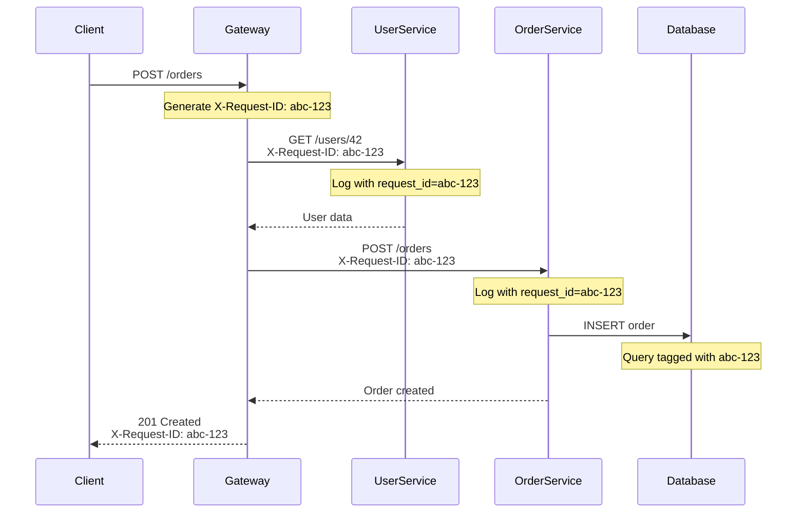
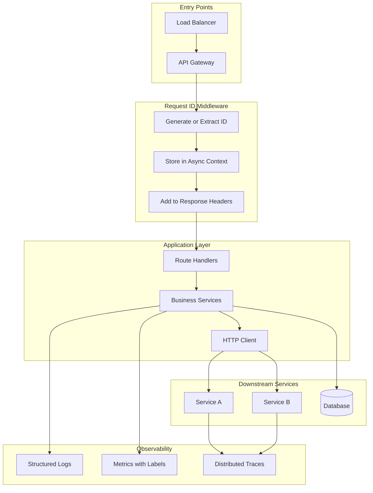

# How to Build Request ID Propagation

Author: [nawazdhandala](https://github.com/nawazdhandala)

Tags: Logging, Request ID, Middleware, Tracing

Description: Learn to build request ID propagation for tracing requests across microservices.

---

When a user reports an error, the first question is always: "What happened?" In a monolithic application, you can search logs by timestamp. In a distributed system with dozens of services, that approach falls apart. You need a way to trace a single request as it travels through multiple services, databases, and queues.

Request ID propagation solves this problem. Every incoming request gets a unique identifier that travels with it across service boundaries. When something breaks, you search for that ID and instantly see the complete picture.

## How Request ID Propagation Works

The concept is straightforward. When a request enters your system, generate a unique ID. Pass that ID to every service the request touches. Include the ID in every log line. When debugging, filter logs by that ID.

The following diagram shows the flow of a request ID through a typical microservices architecture.



The key insight is that every component in the chain uses the same ID. This turns a distributed system into something you can reason about as a single unit.

## Building the Middleware

Start with middleware that handles request ID generation and extraction. The middleware checks for an existing ID in incoming headers. If one exists (from an upstream service), it uses that. Otherwise, it generates a new one.

Here is middleware for an Express.js application that handles both cases.

```javascript
// middleware/requestId.js
const crypto = require('crypto');

// Header name - X-Request-ID is the de facto standard
const REQUEST_ID_HEADER = 'x-request-id';

function requestIdMiddleware(req, res, next) {
  // Check if request already has an ID (from upstream service or load balancer)
  let requestId = req.headers[REQUEST_ID_HEADER];

  // Generate new ID if none exists
  if (!requestId) {
    requestId = crypto.randomUUID();
  }

  // Attach to request object for easy access in handlers
  req.requestId = requestId;

  // Include in response headers so clients can reference it
  res.setHeader(REQUEST_ID_HEADER, requestId);

  next();
}

module.exports = { requestIdMiddleware, REQUEST_ID_HEADER };
```

Register this middleware early in your application, before route handlers.

```javascript
// app.js
const express = require('express');
const { requestIdMiddleware } = require('./middleware/requestId');

const app = express();

// Register request ID middleware first
app.use(requestIdMiddleware);

// Your routes go here
app.get('/health', (req, res) => {
  res.json({ status: 'ok', requestId: req.requestId });
});

app.listen(3000);
```

## Integrating with Logging

The request ID becomes useful only when it appears in your logs. Configure your logger to include the request ID in every log entry.

The following example uses a simple logging wrapper that automatically includes context.

```javascript
// lib/logger.js
const { AsyncLocalStorage } = require('async_hooks');

// Store request context across async boundaries
const asyncLocalStorage = new AsyncLocalStorage();

// Logger that automatically includes request ID
const logger = {
  info: (message, data = {}) => {
    const context = asyncLocalStorage.getStore() || {};
    console.log(JSON.stringify({
      level: 'info',
      message,
      request_id: context.requestId,
      timestamp: new Date().toISOString(),
      ...data
    }));
  },

  error: (message, data = {}) => {
    const context = asyncLocalStorage.getStore() || {};
    console.log(JSON.stringify({
      level: 'error',
      message,
      request_id: context.requestId,
      timestamp: new Date().toISOString(),
      ...data
    }));
  }
};

// Middleware to set up async context
function contextMiddleware(req, res, next) {
  const store = { requestId: req.requestId };
  asyncLocalStorage.run(store, () => next());
}

module.exports = { logger, contextMiddleware, asyncLocalStorage };
```

Now every log entry includes the request ID without passing it explicitly.

```javascript
// routes/orders.js
const { logger } = require('../lib/logger');

async function createOrder(req, res) {
  logger.info('Creating order', { userId: req.body.userId });

  try {
    const order = await orderService.create(req.body);
    logger.info('Order created successfully', { orderId: order.id });
    res.status(201).json(order);
  } catch (error) {
    logger.error('Order creation failed', { error: error.message });
    res.status(500).json({ error: 'Failed to create order' });
  }
}
```

## Propagating to Downstream Services

When your service calls another service, include the request ID in outgoing headers. This creates a chain of correlation across your entire system.

The following HTTP client wrapper handles this automatically.

```javascript
// lib/httpClient.js
const { asyncLocalStorage } = require('./logger');
const { REQUEST_ID_HEADER } = require('../middleware/requestId');

async function request(url, options = {}) {
  const context = asyncLocalStorage.getStore() || {};

  // Merge request ID into headers
  const headers = {
    'Content-Type': 'application/json',
    ...options.headers
  };

  // Propagate request ID if available
  if (context.requestId) {
    headers[REQUEST_ID_HEADER] = context.requestId;
  }

  const response = await fetch(url, {
    ...options,
    headers
  });

  return response;
}

module.exports = { request };
```

Use this client for all service-to-service communication.

```javascript
// services/userService.js
const { request } = require('../lib/httpClient');
const { logger } = require('../lib/logger');

async function getUser(userId) {
  logger.info('Fetching user from user service', { userId });

  const response = await request(`http://user-service/users/${userId}`);

  if (!response.ok) {
    logger.error('User service returned error', { status: response.status });
    throw new Error('Failed to fetch user');
  }

  return response.json();
}

module.exports = { getUser };
```

## Architecture Overview

The complete system looks like this, with request IDs flowing through every component.



## Adding Database Query Tagging

For complete visibility, tag database queries with the request ID. This helps when debugging slow queries or identifying which request caused a problematic query.

PostgreSQL supports query comments that appear in logs and monitoring tools.

```javascript
// lib/database.js
const { Pool } = require('pg');
const { asyncLocalStorage } = require('./logger');

const pool = new Pool({
  connectionString: process.env.DATABASE_URL
});

async function query(text, params) {
  const context = asyncLocalStorage.getStore() || {};

  // Add request ID as a SQL comment
  // This appears in pg_stat_statements and slow query logs
  const taggedQuery = context.requestId
    ? `/* request_id=${context.requestId} */ ${text}`
    : text;

  const start = Date.now();
  const result = await pool.query(taggedQuery, params);
  const duration = Date.now() - start;

  // Log slow queries with request context
  if (duration > 100) {
    logger.info('Slow query detected', {
      duration_ms: duration,
      query: text.substring(0, 100)
    });
  }

  return result;
}

module.exports = { query };
```

## Handling Message Queues

Asynchronous processing through message queues requires special handling. Include the request ID in the message payload so workers can continue the trace.

```javascript
// producers/orderProducer.js
const { asyncLocalStorage } = require('../lib/logger');

async function publishOrderEvent(order, eventType) {
  const context = asyncLocalStorage.getStore() || {};

  const message = {
    type: eventType,
    payload: order,
    metadata: {
      request_id: context.requestId,
      published_at: new Date().toISOString()
    }
  };

  await messageQueue.publish('orders', message);
}

// consumers/orderConsumer.js
const { logger, asyncLocalStorage } = require('../lib/logger');

async function handleOrderMessage(message) {
  // Restore request context from message metadata
  const store = { requestId: message.metadata.request_id };

  await asyncLocalStorage.run(store, async () => {
    logger.info('Processing order event', { type: message.type });
    // Process the message - all logs will include the original request ID
    await processOrder(message.payload);
  });
}
```

## Production Considerations

Several practical concerns matter in production deployments.

**ID Format**: UUIDs work well, but some teams prefer shorter formats like ULIDs or custom schemes. Choose something that balances uniqueness with readability.

**Header Naming**: Stick with `X-Request-ID` since most tools and load balancers recognize it. Some systems use `X-Correlation-ID` or `X-Trace-ID` for similar purposes.

**Performance**: Request ID generation and propagation add minimal overhead. The async context storage has some cost, but it is negligible compared to actual I/O operations.

**Security**: Request IDs should not contain sensitive information. They are often exposed in response headers and logs that might be visible to users or third parties.

## Summary

Request ID propagation transforms debugging in distributed systems from guesswork into targeted investigation. By generating a unique ID at the entry point and carrying it through every service, database query, and message queue, you create a thread that connects all the pieces of a request.

The implementation requires three components: middleware to generate and extract IDs, logging integration to include IDs automatically, and HTTP client wrappers to propagate IDs to downstream services. With these in place, you can trace any request from start to finish.

For more advanced distributed tracing with timing information and automatic instrumentation, consider adopting OpenTelemetry. Request ID propagation provides the foundation that makes OpenTelemetry tracing even more powerful.
