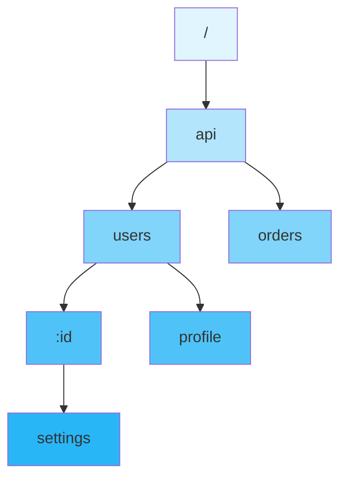
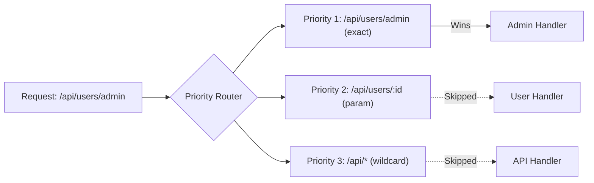
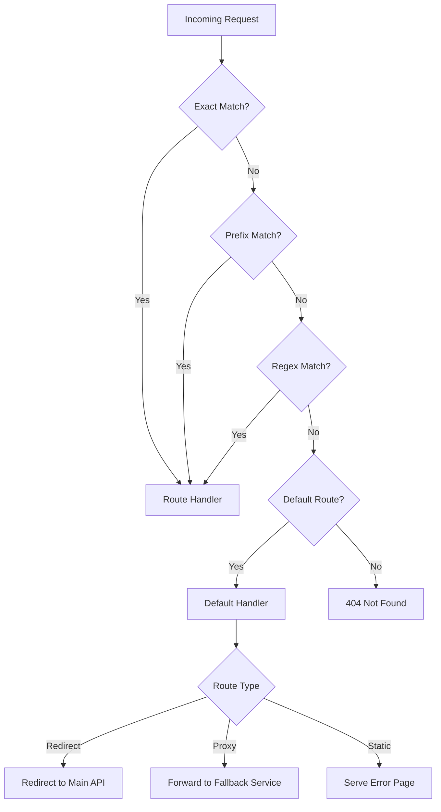
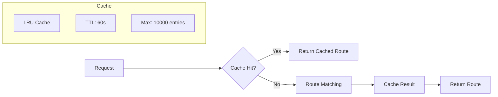
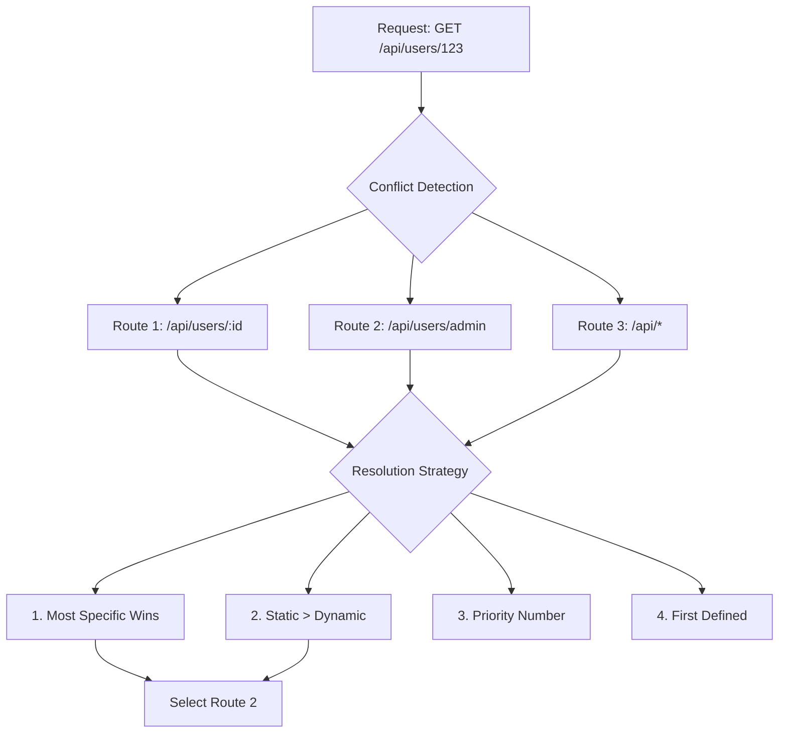

# How to Implement Request Routing Details

Author: [nawazdhandala](https://github.com/nawazdhandala)

Tags: API Gateway, Routing, Microservices, Traffic Management

Description: Learn detailed request routing strategies for API gateways.

---

Request routing is the backbone of any API gateway. It determines how incoming requests are matched, prioritized, and forwarded to the appropriate backend services. Getting routing right means faster responses, fewer errors, and a system that scales gracefully.

## Understanding Route Matching Algorithms

Route matching determines which backend service handles an incoming request. The algorithm you choose affects both performance and flexibility.

```mermaid
flowchart TD
    A[Incoming Request] --> B{Route Matcher}
    B -->|Exact Match| C[/api/users]
    B -->|Prefix Match| D[/api/users/*]
    B -->|Regex Match| E[/api/users/\d+]
    B -->|No Match| F[Default Route]

    C --> G[User Service]
    D --> G
    E --> G
    F --> H[404 Handler]
```

### Exact Path Matching

The simplest and fastest matching strategy. The request path must exactly match the configured route.

```javascript
// Route configuration
const routes = [
  { path: '/api/users', service: 'user-service' },
  { path: '/api/orders', service: 'order-service' },
  { path: '/api/products', service: 'product-service' }
];

// Exact match implementation
function exactMatch(requestPath, routes) {
  for (const route of routes) {
    if (requestPath === route.path) {
      return route;
    }
  }
  return null;
}

// Usage
const request = { path: '/api/users' };
const matched = exactMatch(request.path, routes);
// Returns: { path: '/api/users', service: 'user-service' }
```

**Time Complexity:** O(n) for linear search, O(1) with hash map.

```javascript
// Optimized with hash map - O(1) lookup
class ExactMatcher {
  constructor() {
    this.routes = new Map();
  }

  addRoute(path, service) {
    this.routes.set(path, { path, service });
  }

  match(requestPath) {
    return this.routes.get(requestPath) || null;
  }
}

const matcher = new ExactMatcher();
matcher.addRoute('/api/users', 'user-service');
matcher.addRoute('/api/orders', 'order-service');

console.log(matcher.match('/api/users'));
// Returns: { path: '/api/users', service: 'user-service' }
```

### Prefix Matching

Matches routes that start with a specific path prefix. Useful for routing entire API namespaces.

```javascript
class PrefixMatcher {
  constructor() {
    this.routes = [];
  }

  addRoute(prefix, service, stripPrefix = false) {
    this.routes.push({ prefix, service, stripPrefix });
    // Sort by prefix length descending for longest match first
    this.routes.sort((a, b) => b.prefix.length - a.prefix.length);
  }

  match(requestPath) {
    for (const route of this.routes) {
      if (requestPath.startsWith(route.prefix)) {
        return {
          ...route,
          remainingPath: route.stripPrefix
            ? requestPath.slice(route.prefix.length) || '/'
            : requestPath
        };
      }
    }
    return null;
  }
}

const matcher = new PrefixMatcher();
matcher.addRoute('/api/v2/users', 'user-service-v2', true);
matcher.addRoute('/api/v1', 'legacy-gateway', true);
matcher.addRoute('/api', 'api-gateway', false);

console.log(matcher.match('/api/v2/users/123'));
// Returns: { prefix: '/api/v2/users', service: 'user-service-v2',
//            stripPrefix: true, remainingPath: '/123' }
```

### Trie-Based Matching

For large route tables, a trie (prefix tree) provides efficient O(m) lookups where m is the path length.



```javascript
class TrieNode {
  constructor() {
    this.children = new Map();
    this.handler = null;
    this.paramName = null;
    this.isParam = false;
  }
}

class TrieRouter {
  constructor() {
    this.root = new TrieNode();
  }

  addRoute(path, handler) {
    const segments = path.split('/').filter(Boolean);
    let node = this.root;

    for (const segment of segments) {
      const isParam = segment.startsWith(':');
      const key = isParam ? ':param' : segment;

      if (!node.children.has(key)) {
        const child = new TrieNode();
        if (isParam) {
          child.isParam = true;
          child.paramName = segment.slice(1);
        }
        node.children.set(key, child);
      }
      node = node.children.get(key);
    }
    node.handler = handler;
  }

  match(path) {
    const segments = path.split('/').filter(Boolean);
    const params = {};
    let node = this.root;

    for (const segment of segments) {
      if (node.children.has(segment)) {
        node = node.children.get(segment);
      } else if (node.children.has(':param')) {
        node = node.children.get(':param');
        params[node.paramName] = segment;
      } else {
        return null;
      }
    }

    return node.handler ? { handler: node.handler, params } : null;
  }
}

const router = new TrieRouter();
router.addRoute('/api/users/:userId', 'get-user');
router.addRoute('/api/users/:userId/orders', 'get-user-orders');
router.addRoute('/api/products/:productId', 'get-product');

console.log(router.match('/api/users/123'));
// Returns: { handler: 'get-user', params: { userId: '123' } }

console.log(router.match('/api/users/456/orders'));
// Returns: { handler: 'get-user-orders', params: { userId: '456' } }
```

## Priority-Based Routing

When multiple routes could match a request, priority determines which one wins.



### Implementing Priority Routing

```javascript
class PriorityRouter {
  constructor() {
    this.routes = [];
  }

  addRoute(config) {
    const { path, method, service, priority = 100, conditions = {} } = config;

    this.routes.push({
      path,
      method,
      service,
      priority,
      conditions,
      matcher: this.createMatcher(path)
    });

    // Sort by priority (lower number = higher priority)
    this.routes.sort((a, b) => a.priority - b.priority);
  }

  createMatcher(path) {
    // Convert path pattern to regex
    const pattern = path
      .replace(/\//g, '\\/')
      .replace(/:(\w+)/g, '(?<$1>[^/]+)')
      .replace(/\*/g, '.*');
    return new RegExp(`^${pattern}$`);
  }

  match(request) {
    const { path, method, headers } = request;

    for (const route of this.routes) {
      // Check method
      if (route.method && route.method !== method) continue;

      // Check path pattern
      const pathMatch = route.matcher.exec(path);
      if (!pathMatch) continue;

      // Check additional conditions
      if (!this.checkConditions(route.conditions, request)) continue;

      return {
        service: route.service,
        params: pathMatch.groups || {},
        priority: route.priority
      };
    }
    return null;
  }

  checkConditions(conditions, request) {
    // Header conditions
    if (conditions.headers) {
      for (const [key, value] of Object.entries(conditions.headers)) {
        if (request.headers[key] !== value) return false;
      }
    }

    // Query parameter conditions
    if (conditions.query) {
      for (const [key, value] of Object.entries(conditions.query)) {
        if (request.query[key] !== value) return false;
      }
    }

    return true;
  }
}

// Usage
const router = new PriorityRouter();

// Exact match for admin - highest priority
router.addRoute({
  path: '/api/users/admin',
  method: 'GET',
  service: 'admin-service',
  priority: 10
});

// Parameter match - medium priority
router.addRoute({
  path: '/api/users/:userId',
  method: 'GET',
  service: 'user-service',
  priority: 50
});

// Header-based routing - conditional priority
router.addRoute({
  path: '/api/users/:userId',
  method: 'GET',
  service: 'user-service-v2',
  priority: 40,
  conditions: {
    headers: { 'X-API-Version': '2' }
  }
});

// Wildcard fallback - lowest priority
router.addRoute({
  path: '/api/*',
  method: 'GET',
  service: 'api-gateway',
  priority: 100
});

console.log(router.match({
  path: '/api/users/admin',
  method: 'GET',
  headers: {}
}));
// Returns: { service: 'admin-service', params: {}, priority: 10 }

console.log(router.match({
  path: '/api/users/123',
  method: 'GET',
  headers: { 'X-API-Version': '2' }
}));
// Returns: { service: 'user-service-v2', params: { userId: '123' }, priority: 40 }
```

## Regex Pattern Matching

Regular expressions provide powerful pattern matching for complex routing requirements.

```javascript
class RegexRouter {
  constructor() {
    this.routes = [];
  }

  addRoute(pattern, service, options = {}) {
    const regex = pattern instanceof RegExp
      ? pattern
      : new RegExp(pattern);

    this.routes.push({
      regex,
      service,
      ...options
    });
  }

  match(path) {
    for (const route of this.routes) {
      const match = route.regex.exec(path);
      if (match) {
        return {
          service: route.service,
          params: match.groups || {},
          captures: match.slice(1)
        };
      }
    }
    return null;
  }
}

const router = new RegexRouter();

// Match user IDs that are numeric
router.addRoute(
  /^\/api\/users\/(?<userId>\d+)$/,
  'user-service'
);

// Match user IDs that are UUIDs
router.addRoute(
  /^\/api\/users\/(?<userId>[0-9a-f]{8}-[0-9a-f]{4}-[0-9a-f]{4}-[0-9a-f]{4}-[0-9a-f]{12})$/i,
  'user-service-uuid'
);

// Match versioned API paths
router.addRoute(
  /^\/api\/v(?<version>\d+)\/(?<resource>\w+)(?:\/(?<id>\w+))?$/,
  'versioned-api'
);

// Match file extensions
router.addRoute(
  /^\/files\/.*\.(?<extension>pdf|doc|docx)$/,
  'document-service'
);

console.log(router.match('/api/users/12345'));
// Returns: { service: 'user-service', params: { userId: '12345' }, captures: ['12345'] }

console.log(router.match('/api/users/550e8400-e29b-41d4-a716-446655440000'));
// Returns: { service: 'user-service-uuid', params: { userId: '550e8400-...' }, captures: [...] }

console.log(router.match('/api/v2/products/abc123'));
// Returns: { service: 'versioned-api', params: { version: '2', resource: 'products', id: 'abc123' } }
```

### Regex Performance Optimization

```javascript
class OptimizedRegexRouter {
  constructor() {
    this.compiledRoutes = [];
    this.staticRoutes = new Map(); // Fast path for static routes
  }

  addRoute(pattern, service) {
    // Check if pattern is static (no regex special chars)
    if (typeof pattern === 'string' && !/[.*+?^${}()|[\]\\]/.test(pattern)) {
      this.staticRoutes.set(pattern, { service, pattern });
      return;
    }

    const regex = pattern instanceof RegExp
      ? pattern
      : new RegExp(pattern);

    // Pre-compile and store
    this.compiledRoutes.push({
      regex,
      service,
      // Cache the source for debugging
      source: regex.source
    });
  }

  match(path) {
    // Try static routes first (O(1) lookup)
    const staticMatch = this.staticRoutes.get(path);
    if (staticMatch) {
      return { service: staticMatch.service, params: {} };
    }

    // Fall back to regex matching
    for (const route of this.compiledRoutes) {
      const match = route.regex.exec(path);
      if (match) {
        return {
          service: route.service,
          params: match.groups || {}
        };
      }
    }
    return null;
  }
}
```

## Default Route Handling

Every API gateway needs a fallback strategy for unmatched requests.



```javascript
class RouterWithDefaults {
  constructor(options = {}) {
    this.routes = [];
    this.defaultRoute = options.defaultRoute || null;
    this.notFoundHandler = options.notFoundHandler || this.default404;
    this.methodNotAllowedHandler = options.methodNotAllowedHandler || this.default405;
  }

  default404(request) {
    return {
      status: 404,
      body: {
        error: 'Not Found',
        message: `No route matches ${request.method} ${request.path}`,
        timestamp: new Date().toISOString()
      }
    };
  }

  default405(request, allowedMethods) {
    return {
      status: 405,
      headers: {
        'Allow': allowedMethods.join(', ')
      },
      body: {
        error: 'Method Not Allowed',
        message: `${request.method} is not allowed for ${request.path}`,
        allowedMethods
      }
    };
  }

  addRoute(method, path, handler) {
    this.routes.push({ method, path, handler });
  }

  setDefaultRoute(handler) {
    this.defaultRoute = handler;
  }

  match(request) {
    const { method, path } = request;
    const pathMatches = [];

    // Find all routes matching the path
    for (const route of this.routes) {
      if (this.pathMatches(path, route.path)) {
        pathMatches.push(route);
        if (route.method === method || route.method === '*') {
          return { handler: route.handler, route };
        }
      }
    }

    // Path matched but method didn't - return 405
    if (pathMatches.length > 0) {
      const allowedMethods = [...new Set(pathMatches.map(r => r.method))];
      return {
        handler: () => this.methodNotAllowedHandler(request, allowedMethods),
        status: 405
      };
    }

    // Try default route
    if (this.defaultRoute) {
      return { handler: this.defaultRoute, isDefault: true };
    }

    // No match - return 404
    return {
      handler: () => this.notFoundHandler(request),
      status: 404
    };
  }

  pathMatches(requestPath, routePath) {
    // Simplified matching - extend as needed
    if (routePath === '*') return true;
    if (routePath === requestPath) return true;
    if (routePath.endsWith('*')) {
      return requestPath.startsWith(routePath.slice(0, -1));
    }
    return false;
  }
}

// Usage
const router = new RouterWithDefaults({
  notFoundHandler: (req) => ({
    status: 404,
    body: {
      error: 'Resource not found',
      path: req.path,
      suggestion: 'Check API documentation at /docs'
    }
  })
});

router.addRoute('GET', '/api/users', () => ({ users: [] }));
router.addRoute('POST', '/api/users', () => ({ created: true }));
router.addRoute('GET', '/api/health', () => ({ status: 'healthy' }));

// Default route catches everything else
router.setDefaultRoute((req) => ({
  status: 200,
  body: {
    message: 'Handled by default route',
    originalPath: req.path
  }
}));

console.log(router.match({ method: 'GET', path: '/api/users' }));
// Returns: { handler: [Function], route: {...} }

console.log(router.match({ method: 'DELETE', path: '/api/users' }));
// Returns: { handler: [Function], status: 405 }

console.log(router.match({ method: 'GET', path: '/unknown' }));
// Returns: { handler: [Function], isDefault: true }
```

## Route Caching

Caching route resolution results dramatically improves performance for repeated requests.



```javascript
class LRUCache {
  constructor(maxSize = 1000) {
    this.maxSize = maxSize;
    this.cache = new Map();
  }

  get(key) {
    if (!this.cache.has(key)) return undefined;

    // Move to end (most recently used)
    const value = this.cache.get(key);
    this.cache.delete(key);
    this.cache.set(key, value);
    return value;
  }

  set(key, value) {
    if (this.cache.has(key)) {
      this.cache.delete(key);
    } else if (this.cache.size >= this.maxSize) {
      // Delete oldest (first) entry
      const firstKey = this.cache.keys().next().value;
      this.cache.delete(firstKey);
    }
    this.cache.set(key, value);
  }

  clear() {
    this.cache.clear();
  }

  get size() {
    return this.cache.size;
  }
}

class CachedRouter {
  constructor(options = {}) {
    this.routes = [];
    this.cache = new LRUCache(options.cacheSize || 10000);
    this.stats = {
      hits: 0,
      misses: 0,
      evictions: 0
    };
  }

  addRoute(method, path, handler) {
    this.routes.push({ method, path, handler });
    // Invalidate cache when routes change
    this.cache.clear();
  }

  getCacheKey(request) {
    // Create a unique key for the request
    return `${request.method}:${request.path}`;
  }

  match(request) {
    const cacheKey = this.getCacheKey(request);

    // Try cache first
    const cached = this.cache.get(cacheKey);
    if (cached) {
      this.stats.hits++;
      return cached;
    }

    this.stats.misses++;

    // Perform actual route matching
    const result = this.doMatch(request);

    // Cache the result
    this.cache.set(cacheKey, result);

    return result;
  }

  doMatch(request) {
    for (const route of this.routes) {
      if (route.method === request.method &&
          this.pathMatches(request.path, route.path)) {
        return { handler: route.handler, route };
      }
    }
    return null;
  }

  pathMatches(requestPath, routePath) {
    return requestPath === routePath;
  }

  getStats() {
    const total = this.stats.hits + this.stats.misses;
    return {
      ...this.stats,
      hitRate: total > 0 ? (this.stats.hits / total * 100).toFixed(2) + '%' : '0%',
      cacheSize: this.cache.size
    };
  }
}

// Usage
const router = new CachedRouter({ cacheSize: 5000 });

router.addRoute('GET', '/api/users', () => ({ users: [] }));
router.addRoute('GET', '/api/products', () => ({ products: [] }));

// Simulate traffic
for (let i = 0; i < 1000; i++) {
  router.match({ method: 'GET', path: '/api/users' });
}

console.log(router.getStats());
// Returns: { hits: 999, misses: 1, hitRate: '99.90%', cacheSize: 1 }
```

### Cache with TTL and Parameter Support

```javascript
class AdvancedRouteCache {
  constructor(options = {}) {
    this.maxSize = options.maxSize || 10000;
    this.defaultTTL = options.ttl || 60000; // 60 seconds
    this.cache = new Map();
    this.parameterizedRoutes = new Map();
  }

  generateKey(method, path, params = {}) {
    const paramString = Object.keys(params).length > 0
      ? ':' + JSON.stringify(params)
      : '';
    return `${method}:${path}${paramString}`;
  }

  get(method, path, params) {
    const key = this.generateKey(method, path, params);
    const entry = this.cache.get(key);

    if (!entry) return null;

    // Check TTL
    if (Date.now() > entry.expiresAt) {
      this.cache.delete(key);
      return null;
    }

    // Update access time for LRU
    entry.lastAccess = Date.now();
    return entry.value;
  }

  set(method, path, params, value, ttl = this.defaultTTL) {
    const key = this.generateKey(method, path, params);

    // Evict if at capacity
    if (this.cache.size >= this.maxSize) {
      this.evictOldest();
    }

    this.cache.set(key, {
      value,
      createdAt: Date.now(),
      expiresAt: Date.now() + ttl,
      lastAccess: Date.now()
    });
  }

  evictOldest() {
    let oldestKey = null;
    let oldestTime = Infinity;

    for (const [key, entry] of this.cache) {
      if (entry.lastAccess < oldestTime) {
        oldestTime = entry.lastAccess;
        oldestKey = key;
      }
    }

    if (oldestKey) {
      this.cache.delete(oldestKey);
    }
  }

  invalidatePattern(pattern) {
    const regex = new RegExp(pattern);
    for (const key of this.cache.keys()) {
      if (regex.test(key)) {
        this.cache.delete(key);
      }
    }
  }

  clear() {
    this.cache.clear();
  }
}

// Usage with router
class CachedParameterizedRouter {
  constructor() {
    this.routes = [];
    this.cache = new AdvancedRouteCache({
      maxSize: 10000,
      ttl: 30000
    });
  }

  addRoute(method, pattern, handler, options = {}) {
    this.routes.push({
      method,
      pattern,
      regex: this.patternToRegex(pattern),
      handler,
      cacheTTL: options.cacheTTL
    });
  }

  patternToRegex(pattern) {
    const regexPattern = pattern
      .replace(/\//g, '\\/')
      .replace(/:(\w+)/g, '(?<$1>[^/]+)');
    return new RegExp(`^${regexPattern}$`);
  }

  match(request) {
    const { method, path } = request;

    // Check cache
    const cached = this.cache.get(method, path, {});
    if (cached) {
      return cached;
    }

    // Find matching route
    for (const route of this.routes) {
      if (route.method !== method) continue;

      const match = route.regex.exec(path);
      if (match) {
        const result = {
          handler: route.handler,
          params: match.groups || {}
        };

        // Cache the result
        this.cache.set(method, path, {}, result, route.cacheTTL);
        return result;
      }
    }

    return null;
  }

  // Invalidate cache for a specific resource
  invalidate(pattern) {
    this.cache.invalidatePattern(pattern);
  }
}
```

## Route Conflict Resolution

When multiple routes could match, you need clear rules for resolution.



```javascript
class ConflictResolvingRouter {
  constructor(strategy = 'specificity') {
    this.routes = [];
    this.strategy = strategy;
  }

  addRoute(config) {
    const { method, path, handler, priority = 100 } = config;

    const route = {
      method,
      path,
      handler,
      priority,
      specificity: this.calculateSpecificity(path),
      segments: path.split('/').filter(Boolean),
      hasParams: path.includes(':'),
      hasWildcard: path.includes('*')
    };

    this.routes.push(route);
  }

  calculateSpecificity(path) {
    const segments = path.split('/').filter(Boolean);
    let score = 0;

    for (const segment of segments) {
      if (segment === '*') {
        score += 1;  // Wildcard - lowest specificity
      } else if (segment.startsWith(':')) {
        score += 10; // Parameter - medium specificity
      } else {
        score += 100; // Static segment - highest specificity
      }
    }

    return score;
  }

  findMatches(request) {
    const matches = [];

    for (const route of this.routes) {
      if (route.method !== request.method && route.method !== '*') {
        continue;
      }

      const match = this.matchPath(request.path, route);
      if (match) {
        matches.push({ route, params: match.params });
      }
    }

    return matches;
  }

  matchPath(requestPath, route) {
    const requestSegments = requestPath.split('/').filter(Boolean);
    const routeSegments = route.segments;
    const params = {};

    // Handle wildcard at end
    if (route.hasWildcard) {
      const wildcardIndex = routeSegments.indexOf('*');
      if (wildcardIndex >= 0) {
        const beforeWildcard = routeSegments.slice(0, wildcardIndex);
        for (let i = 0; i < beforeWildcard.length; i++) {
          if (!this.segmentMatches(requestSegments[i], beforeWildcard[i], params)) {
            return null;
          }
        }
        return { params };
      }
    }

    // Exact segment count match required
    if (requestSegments.length !== routeSegments.length) {
      return null;
    }

    for (let i = 0; i < routeSegments.length; i++) {
      if (!this.segmentMatches(requestSegments[i], routeSegments[i], params)) {
        return null;
      }
    }

    return { params };
  }

  segmentMatches(requestSegment, routeSegment, params) {
    if (routeSegment === '*') return true;
    if (routeSegment.startsWith(':')) {
      params[routeSegment.slice(1)] = requestSegment;
      return true;
    }
    return requestSegment === routeSegment;
  }

  resolve(matches) {
    if (matches.length === 0) return null;
    if (matches.length === 1) return matches[0];

    switch (this.strategy) {
      case 'specificity':
        return this.resolveBySpecificity(matches);
      case 'priority':
        return this.resolveByPriority(matches);
      case 'first':
        return matches[0];
      default:
        return this.resolveBySpecificity(matches);
    }
  }

  resolveBySpecificity(matches) {
    return matches.sort((a, b) => {
      // Higher specificity wins
      if (b.route.specificity !== a.route.specificity) {
        return b.route.specificity - a.route.specificity;
      }
      // Static routes beat parameterized routes
      if (a.route.hasParams !== b.route.hasParams) {
        return a.route.hasParams ? 1 : -1;
      }
      // Fall back to priority
      return a.route.priority - b.route.priority;
    })[0];
  }

  resolveByPriority(matches) {
    return matches.sort((a, b) => a.route.priority - b.route.priority)[0];
  }

  match(request) {
    const matches = this.findMatches(request);

    if (matches.length > 1) {
      console.warn(`Multiple routes match ${request.method} ${request.path}:`,
        matches.map(m => m.route.path));
    }

    const resolved = this.resolve(matches);

    if (!resolved) return null;

    return {
      handler: resolved.route.handler,
      params: resolved.params,
      route: resolved.route
    };
  }
}

// Usage
const router = new ConflictResolvingRouter('specificity');

// These routes could all match /api/users/admin
router.addRoute({ method: 'GET', path: '/api/users/admin', handler: 'admin-handler' });
router.addRoute({ method: 'GET', path: '/api/users/:userId', handler: 'user-handler' });
router.addRoute({ method: 'GET', path: '/api/*', handler: 'catch-all' });

console.log(router.match({ method: 'GET', path: '/api/users/admin' }));
// Returns: { handler: 'admin-handler', params: {}, route: {...} }
// The static path /api/users/admin wins over the parameterized :userId

console.log(router.match({ method: 'GET', path: '/api/users/123' }));
// Returns: { handler: 'user-handler', params: { userId: '123' }, route: {...} }
// The parameterized route wins over the wildcard
```

### Conflict Detection at Registration Time

```javascript
class SafeRouter extends ConflictResolvingRouter {
  constructor(options = {}) {
    super(options.strategy);
    this.strict = options.strict || false;
  }

  addRoute(config) {
    // Check for potential conflicts before adding
    const conflicts = this.detectConflicts(config);

    if (conflicts.length > 0) {
      const conflictInfo = conflicts.map(c =>
        `  - ${c.route.method} ${c.route.path} (${c.type})`
      ).join('\n');

      const message = `Route ${config.method} ${config.path} conflicts with:\n${conflictInfo}`;

      if (this.strict) {
        throw new Error(message);
      } else {
        console.warn(`Warning: ${message}`);
      }
    }

    super.addRoute(config);
  }

  detectConflicts(newRoute) {
    const conflicts = [];

    for (const existing of this.routes) {
      if (existing.method !== newRoute.method &&
          existing.method !== '*' &&
          newRoute.method !== '*') {
        continue;
      }

      const conflict = this.checkConflict(newRoute, existing);
      if (conflict) {
        conflicts.push({ route: existing, type: conflict });
      }
    }

    return conflicts;
  }

  checkConflict(route1, route2) {
    const segments1 = route1.path.split('/').filter(Boolean);
    const segments2 = route2.path.split('/').filter(Boolean);

    // Exact duplicate
    if (route1.path === route2.path) {
      return 'exact-duplicate';
    }

    // Check if paths could match same requests
    if (this.couldOverlap(segments1, segments2)) {
      return 'potential-overlap';
    }

    return null;
  }

  couldOverlap(segments1, segments2) {
    const maxLen = Math.max(segments1.length, segments2.length);

    for (let i = 0; i < maxLen; i++) {
      const s1 = segments1[i];
      const s2 = segments2[i];

      // One path is shorter (unless it ends with wildcard)
      if (!s1 || !s2) {
        return s1 === '*' || s2 === '*';
      }

      // Both are static and different
      if (!s1.startsWith(':') && !s2.startsWith(':') && s1 !== s2 && s1 !== '*' && s2 !== '*') {
        return false;
      }
    }

    return true;
  }
}

// Usage with strict mode
const strictRouter = new SafeRouter({ strict: true });

strictRouter.addRoute({ method: 'GET', path: '/api/users/:id', handler: 'handler1' });

try {
  strictRouter.addRoute({ method: 'GET', path: '/api/users/admin', handler: 'handler2' });
  // Warning logged: potential overlap detected
} catch (e) {
  console.error(e.message);
}
```

## Putting It All Together

Here is a complete API gateway router implementation combining all the concepts.

```javascript
class APIGatewayRouter {
  constructor(options = {}) {
    this.routes = [];
    this.cache = new LRUCache(options.cacheSize || 10000);
    this.defaultHandler = options.defaultHandler;
    this.notFoundHandler = options.notFoundHandler || this.defaultNotFound;
    this.conflictStrategy = options.conflictStrategy || 'specificity';
    this.middleware = [];
  }

  use(middleware) {
    this.middleware.push(middleware);
  }

  addRoute(config) {
    const route = {
      ...config,
      regex: this.buildRegex(config.path),
      specificity: this.calculateSpecificity(config.path),
      priority: config.priority || 100
    };

    this.routes.push(route);
    this.routes.sort((a, b) => b.specificity - a.specificity || a.priority - b.priority);
    this.cache.clear();
  }

  buildRegex(path) {
    const pattern = path
      .replace(/\//g, '\\/')
      .replace(/:(\w+)/g, '(?<$1>[^/]+)')
      .replace(/\*/g, '.*');
    return new RegExp(`^${pattern}$`);
  }

  calculateSpecificity(path) {
    return path.split('/').reduce((score, segment) => {
      if (segment === '*') return score + 1;
      if (segment.startsWith(':')) return score + 10;
      return score + 100;
    }, 0);
  }

  async handle(request) {
    // Apply middleware
    for (const mw of this.middleware) {
      const result = await mw(request);
      if (result) return result;
    }

    // Try cache
    const cacheKey = `${request.method}:${request.path}`;
    let routeMatch = this.cache.get(cacheKey);

    if (!routeMatch) {
      routeMatch = this.findRoute(request);
      if (routeMatch) {
        this.cache.set(cacheKey, routeMatch);
      }
    }

    if (!routeMatch) {
      if (this.defaultHandler) {
        return this.defaultHandler(request);
      }
      return this.notFoundHandler(request);
    }

    return routeMatch.handler(request, routeMatch.params);
  }

  findRoute(request) {
    for (const route of this.routes) {
      if (route.method !== request.method && route.method !== '*') {
        continue;
      }

      const match = route.regex.exec(request.path);
      if (match) {
        return {
          handler: route.handler,
          params: match.groups || {},
          route
        };
      }
    }
    return null;
  }

  defaultNotFound(request) {
    return {
      status: 404,
      body: {
        error: 'Not Found',
        path: request.path,
        method: request.method
      }
    };
  }
}

// Complete usage example
const router = new APIGatewayRouter({
  cacheSize: 5000,
  conflictStrategy: 'specificity'
});

// Add logging middleware
router.use(async (request) => {
  console.log(`${new Date().toISOString()} ${request.method} ${request.path}`);
  return null; // Continue to route matching
});

// Add authentication middleware
router.use(async (request) => {
  if (request.path.startsWith('/api/admin') && !request.headers['Authorization']) {
    return { status: 401, body: { error: 'Unauthorized' } };
  }
  return null;
});

// Define routes
router.addRoute({
  method: 'GET',
  path: '/api/health',
  handler: () => ({ status: 200, body: { healthy: true } })
});

router.addRoute({
  method: 'GET',
  path: '/api/users/:userId',
  handler: (req, params) => ({
    status: 200,
    body: { userId: params.userId }
  })
});

router.addRoute({
  method: 'GET',
  path: '/api/users/:userId/orders/:orderId',
  handler: (req, params) => ({
    status: 200,
    body: { userId: params.userId, orderId: params.orderId }
  })
});

router.addRoute({
  method: '*',
  path: '/api/*',
  handler: (req) => ({
    status: 200,
    body: { message: 'Caught by wildcard', path: req.path }
  }),
  priority: 1000
});

// Test the router
async function test() {
  console.log(await router.handle({ method: 'GET', path: '/api/health', headers: {} }));
  console.log(await router.handle({ method: 'GET', path: '/api/users/123', headers: {} }));
  console.log(await router.handle({ method: 'GET', path: '/api/users/456/orders/789', headers: {} }));
  console.log(await router.handle({ method: 'GET', path: '/api/unknown', headers: {} }));
}

test();
```

## Performance Benchmarks

Understanding the performance characteristics of different routing strategies helps you make informed decisions.

| Strategy | Lookup Time | Memory | Best For |
|----------|-------------|--------|----------|
| Hash Map (Exact) | O(1) | O(n) | Static routes |
| Trie | O(m) | O(n*m) | Many routes with shared prefixes |
| Linear + Regex | O(n) | O(n) | Few routes, complex patterns |
| Cached Linear | O(1) amortized | O(n + cache) | Repeated requests |

Where n = number of routes, m = path length.

## Best Practices

1. **Order routes by specificity**: Static paths before parameters, parameters before wildcards.

2. **Use caching**: Route matching is repeated constantly. Cache the results.

3. **Validate at registration**: Catch conflicts and errors when routes are added, not at runtime.

4. **Document your routing rules**: Make the priority and conflict resolution strategy explicit.

5. **Monitor cache hit rates**: If your cache hit rate drops below 90%, investigate why.

6. **Test edge cases**: Empty paths, trailing slashes, encoded characters, and very long URLs.

7. **Plan for versioning**: Design your routing to support API versioning from the start.

---

Request routing is where API gateway performance is won or lost. A well-designed router handles millions of requests efficiently while providing the flexibility to express complex routing rules. Start simple, measure everything, and optimize based on your actual traffic patterns.
