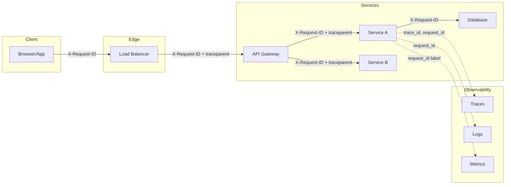
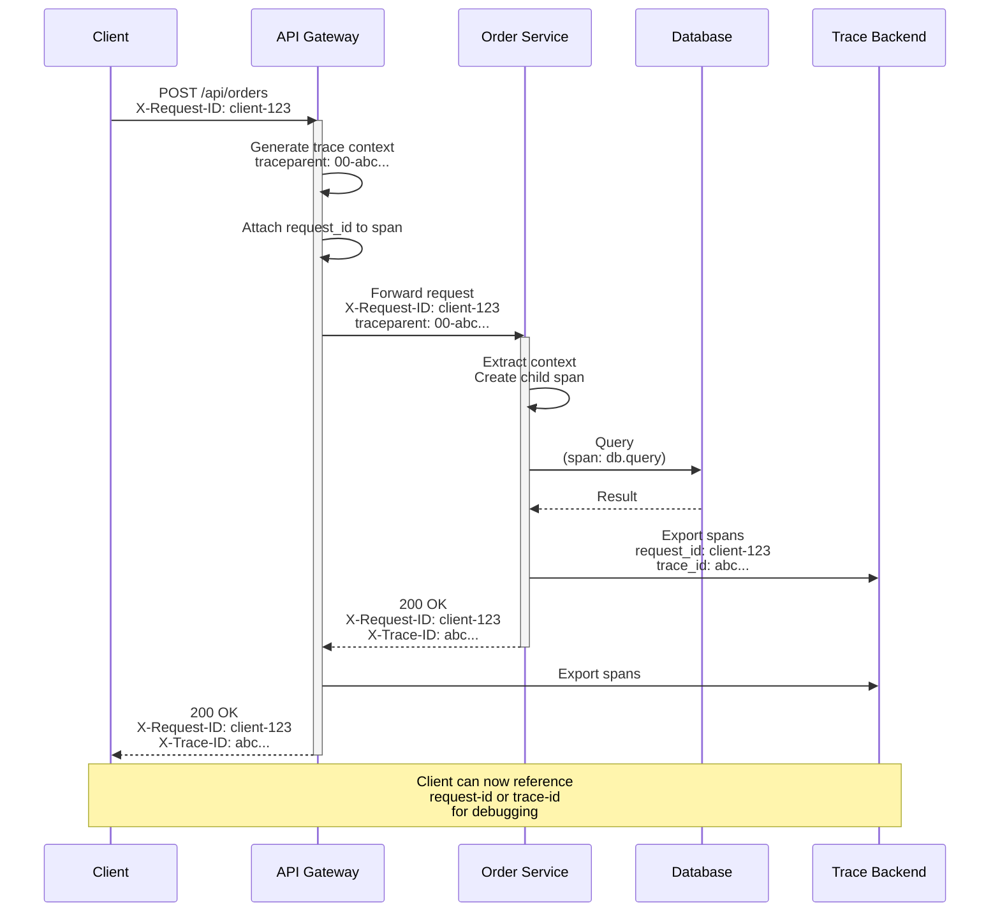

# How to Implement Request-Trace Correlation

Author: [nawazdhandala](https://github.com/nawazdhandala)

Tags: Observability, Tracing, HTTP, Monitoring

Description: Learn how to correlate HTTP requests with distributed traces for debugging and analysis.

---

> When a user reports "the checkout page was slow 10 minutes ago," can you find exactly which request they experienced and trace the full journey through your system?

Request-trace correlation is the practice of linking every HTTP request to its distributed trace, making it possible to jump from a user complaint, a log entry, or an error report directly to the full causal context of what happened. This guide walks through practical patterns for generating request IDs, propagating trace context, and connecting everything so debugging becomes surgical rather than archaeological.

---

## Table of Contents

1. Why Request-Trace Correlation Matters
2. Request ID Generation
3. X-Request-ID Header Patterns
4. W3C Trace Context Integration
5. Request-to-Trace Mapping
6. Response Header Injection
7. Client-Side Correlation
8. Complete Implementation Example
9. Common Pitfalls
10. Summary

---

## 1. Why Request-Trace Correlation Matters

Without correlation, debugging distributed systems often looks like this:

```
User: "I got an error at 2:34 PM"
You: *searches 50GB of logs* *finds 10,000 requests around that time*
You: "Which one was yours?"
```

With correlation:

```
User: "I got an error, the request ID was abc-123"
You: *clicks link* *sees full trace with all service calls, timing, and errors*
You: "Found it. The payment service timed out after 30s."
```

The key insight: **every request needs a unique identifier that travels through all systems and appears in logs, traces, metrics, and error reports.**



---

## 2. Request ID Generation

A request ID should be:
- **Unique**: No collisions across all requests, ever
- **Short enough**: To include in error messages shown to users
- **Sortable** (optional): Helps with time-based queries

### UUID v4 (Simple and Universal)

```typescript
import { randomUUID } from 'crypto';

function generateRequestId(): string {
  return randomUUID();
  // Example: "550e8400-e29b-41d4-a716-446655440000"
}
```

### ULID (Sortable, URL-Safe)

```typescript
import { ulid } from 'ulid';

function generateRequestId(): string {
  return ulid();
  // Example: "01ARZ3NDEKTSV4RRFFQ69G5FAV"
  // Lexicographically sortable by timestamp
}
```

### Nano ID (Short, URL-Safe)

```typescript
import { nanoid } from 'nanoid';

function generateRequestId(): string {
  return nanoid(21);
  // Example: "V1StGXR8_Z5jdHi6B-myT"
}
```

### Comparison Table

| Format | Length | Sortable | URL-Safe | Collision Risk |
|--------|--------|----------|----------|----------------|
| UUID v4 | 36 chars | No | No (hyphens) | ~1 in 2^122 |
| ULID | 26 chars | Yes | Yes | ~1 in 2^80 per ms |
| Nano ID (21) | 21 chars | No | Yes | ~1 in 2^126 |

**Recommendation**: Use ULID if you want time-sortable IDs, UUID v4 if you want maximum compatibility, Nano ID if you want shorter strings.

---

## 3. X-Request-ID Header Patterns

The `X-Request-ID` header (sometimes `X-Correlation-ID`) carries the request identifier across service boundaries.

### Pattern 1: Generate If Missing

The most common pattern: accept an incoming request ID or generate one if not present.

```typescript
import express, { Request, Response, NextFunction } from 'express';
import { randomUUID } from 'crypto';

const REQUEST_ID_HEADER = 'x-request-id';

function requestIdMiddleware(req: Request, res: Response, next: NextFunction) {
  // Use existing request ID from upstream or generate new one
  const requestId = req.get(REQUEST_ID_HEADER) || randomUUID();

  // Attach to request for use in handlers
  req.requestId = requestId;

  // Include in response headers so clients can reference it
  res.set(REQUEST_ID_HEADER, requestId);

  next();
}

// Extend Express Request type
declare global {
  namespace Express {
    interface Request {
      requestId?: string;
    }
  }
}

const app = express();
app.use(requestIdMiddleware);
```

### Pattern 2: Always Generate at Edge

Some architectures always generate the request ID at the edge (load balancer or API gateway) and reject requests without one from internal services.

```typescript
// At edge/gateway - always generate
function edgeRequestIdMiddleware(req: Request, res: Response, next: NextFunction) {
  const requestId = randomUUID();
  req.requestId = requestId;
  res.set(REQUEST_ID_HEADER, requestId);
  next();
}

// At internal services - require it
function internalRequestIdMiddleware(req: Request, res: Response, next: NextFunction) {
  const requestId = req.get(REQUEST_ID_HEADER);

  if (!requestId) {
    return res.status(400).json({
      error: 'Missing X-Request-ID header',
      message: 'Internal services require X-Request-ID from upstream'
    });
  }

  req.requestId = requestId;
  res.set(REQUEST_ID_HEADER, requestId);
  next();
}
```

### Pattern 3: Composite ID (Edge + Service)

For complex debugging, some systems create composite IDs that show the request path.

```typescript
function compositeRequestIdMiddleware(serviceName: string) {
  return (req: Request, res: Response, next: NextFunction) => {
    const upstreamId = req.get(REQUEST_ID_HEADER);
    const localId = randomUUID().slice(0, 8);

    // Creates: "abc123/gateway/user-service" style IDs
    const requestId = upstreamId
      ? `${upstreamId}/${serviceName}`
      : `${localId}/${serviceName}`;

    req.requestId = requestId;
    res.set(REQUEST_ID_HEADER, requestId);
    next();
  };
}
```

---

## 4. W3C Trace Context Integration

W3C Trace Context is the standard for distributed tracing propagation. It uses two headers:

- **traceparent**: Contains version, trace-id, parent-id, and trace-flags
- **tracestate**: Vendor-specific key-value pairs

```
traceparent: 00-4bf92f3577b34da6a3ce929d0e0e4736-00f067aa0ba902b7-01
             |  |                                |                |
             v  |                                |                |
          version                                |                |
                |                                |                |
                v                                |                |
             trace-id (32 hex chars)             |                |
                                                 v                |
                                           parent-id (16 hex)     |
                                                                  v
                                                            trace-flags
```

### Linking Request ID to Trace ID

The key insight: **your request ID and trace ID can be the same thing**, or you can maintain a mapping between them.

#### Option A: Use Trace ID as Request ID

```typescript
import { trace, context } from '@opentelemetry/api';

function getRequestIdFromTrace(): string {
  const span = trace.getSpan(context.active());
  if (span) {
    const spanContext = span.spanContext();
    return spanContext.traceId;
  }
  return randomUUID();
}

function traceAwareRequestMiddleware(req: Request, res: Response, next: NextFunction) {
  const span = trace.getSpan(context.active());

  if (span) {
    const traceId = span.spanContext().traceId;
    req.requestId = traceId;
    res.set('x-request-id', traceId);
    res.set('x-trace-id', traceId);
  }

  next();
}
```

#### Option B: Maintain Separate IDs with Mapping

```typescript
function dualIdMiddleware(req: Request, res: Response, next: NextFunction) {
  const span = trace.getSpan(context.active());
  const requestId = req.get('x-request-id') || randomUUID();

  req.requestId = requestId;
  res.set('x-request-id', requestId);

  if (span) {
    const traceId = span.spanContext().traceId;
    res.set('x-trace-id', traceId);

    // Add request ID as span attribute for correlation
    span.setAttribute('http.request_id', requestId);
  }

  next();
}
```

### Full W3C Trace Context Propagation

```typescript
import { propagation, context, trace, SpanKind } from '@opentelemetry/api';

// Extracting context from incoming request
function extractTraceContext(req: Request): void {
  const carrier = {
    traceparent: req.get('traceparent'),
    tracestate: req.get('tracestate'),
  };

  const extractedContext = propagation.extract(context.active(), carrier);
  // Now extractedContext contains the parent span context
}

// Injecting context into outgoing request
async function makeTracedRequest(url: string, options: RequestInit = {}): Promise<Response> {
  const tracer = trace.getTracer('http-client');

  return tracer.startActiveSpan('http.request', { kind: SpanKind.CLIENT }, async (span) => {
    try {
      const headers: Record<string, string> = { ...(options.headers as Record<string, string>) };

      // Inject trace context into outgoing headers
      propagation.inject(context.active(), headers);

      span.setAttribute('http.url', url);
      span.setAttribute('http.method', options.method || 'GET');

      const response = await fetch(url, { ...options, headers });

      span.setAttribute('http.status_code', response.status);
      return response;
    } finally {
      span.end();
    }
  });
}
```

---

## 5. Request-to-Trace Mapping

For systems that need to query traces by request ID (or vice versa), you need a mapping strategy.

### Strategy 1: Span Attributes

The simplest approach: store the request ID as a span attribute.

```typescript
import { trace, context } from '@opentelemetry/api';

function addRequestIdToSpan(requestId: string): void {
  const span = trace.getSpan(context.active());
  if (span) {
    span.setAttribute('http.request_id', requestId);
    span.setAttribute('correlation.id', requestId);
  }
}
```

Now you can query your trace backend:
```
http.request_id = "550e8400-e29b-41d4-a716-446655440000"
```

### Strategy 2: Structured Logging with Both IDs

```typescript
import { trace, context } from '@opentelemetry/api';

interface CorrelationIds {
  requestId: string;
  traceId: string | undefined;
  spanId: string | undefined;
}

function getCorrelationIds(requestId: string): CorrelationIds {
  const span = trace.getSpan(context.active());

  if (span) {
    const spanContext = span.spanContext();
    return {
      requestId,
      traceId: spanContext.traceId,
      spanId: spanContext.spanId,
    };
  }

  return {
    requestId,
    traceId: undefined,
    spanId: undefined,
  };
}

// Usage in logging
function logWithCorrelation(requestId: string, message: string, data?: object): void {
  const ids = getCorrelationIds(requestId);

  console.log(JSON.stringify({
    timestamp: new Date().toISOString(),
    message,
    request_id: ids.requestId,
    trace_id: ids.traceId,
    span_id: ids.spanId,
    ...data,
  }));
}
```

Example log output:
```json
{
  "timestamp": "2026-01-30T10:15:30.123Z",
  "message": "Payment processed",
  "request_id": "550e8400-e29b-41d4-a716-446655440000",
  "trace_id": "4bf92f3577b34da6a3ce929d0e0e4736",
  "span_id": "00f067aa0ba902b7",
  "amount": 99.99,
  "currency": "USD"
}
```

### Strategy 3: Correlation Index Service

For high-volume systems, maintain a lightweight index:

```typescript
interface CorrelationEntry {
  requestId: string;
  traceId: string;
  timestamp: Date;
  service: string;
  endpoint: string;
}

class CorrelationIndex {
  private cache: Map<string, CorrelationEntry> = new Map();
  private ttlMs: number = 24 * 60 * 60 * 1000; // 24 hours

  record(entry: CorrelationEntry): void {
    this.cache.set(entry.requestId, entry);
    // In production, also persist to Redis/database
  }

  findByRequestId(requestId: string): CorrelationEntry | undefined {
    return this.cache.get(requestId);
  }

  findByTraceId(traceId: string): CorrelationEntry[] {
    return Array.from(this.cache.values())
      .filter(entry => entry.traceId === traceId);
  }
}
```

---

## 6. Response Header Injection

Always return correlation IDs in response headers so clients can reference them.

```typescript
import express, { Request, Response, NextFunction } from 'express';
import { trace, context } from '@opentelemetry/api';

function correlationHeadersMiddleware(req: Request, res: Response, next: NextFunction) {
  // Capture original end to inject headers before response completes
  const originalEnd = res.end.bind(res);

  res.end = function(chunk?: any, encoding?: any, callback?: any) {
    const span = trace.getSpan(context.active());

    // Always set request ID
    if (req.requestId) {
      res.set('x-request-id', req.requestId);
    }

    // Set trace ID if available
    if (span) {
      const spanContext = span.spanContext();
      res.set('x-trace-id', spanContext.traceId);
      res.set('x-span-id', spanContext.spanId);
    }

    return originalEnd(chunk, encoding, callback);
  } as typeof res.end;

  next();
}
```

### Standard Response Headers

```http
HTTP/1.1 200 OK
Content-Type: application/json
X-Request-ID: 550e8400-e29b-41d4-a716-446655440000
X-Trace-ID: 4bf92f3577b34da6a3ce929d0e0e4736
X-Span-ID: 00f067aa0ba902b7

{"status": "success", "data": {...}}
```

### Error Responses with Correlation

```typescript
interface ErrorResponse {
  error: string;
  message: string;
  requestId: string;
  traceId?: string;
  timestamp: string;
}

function errorHandler(err: Error, req: Request, res: Response, next: NextFunction) {
  const span = trace.getSpan(context.active());
  const traceId = span?.spanContext().traceId;

  // Record error in span
  if (span) {
    span.recordException(err);
    span.setStatus({ code: 2, message: err.message }); // ERROR status
  }

  const errorResponse: ErrorResponse = {
    error: err.name,
    message: err.message,
    requestId: req.requestId || 'unknown',
    traceId,
    timestamp: new Date().toISOString(),
  };

  // Log with correlation
  console.error(JSON.stringify({
    level: 'error',
    ...errorResponse,
    stack: err.stack,
  }));

  res.status(500).json(errorResponse);
}
```

---

## 7. Client-Side Correlation

For full end-to-end correlation, clients should generate and send request IDs.

### Browser JavaScript

```typescript
// correlation.ts - Browser client
class RequestCorrelation {
  private sessionId: string;
  private requestCounter: number = 0;

  constructor() {
    this.sessionId = this.generateSessionId();
  }

  private generateSessionId(): string {
    return crypto.randomUUID().slice(0, 8);
  }

  generateRequestId(): string {
    this.requestCounter++;
    return `${this.sessionId}-${Date.now()}-${this.requestCounter}`;
  }

  async fetch(url: string, options: RequestInit = {}): Promise<Response> {
    const requestId = this.generateRequestId();

    const headers = new Headers(options.headers);
    headers.set('X-Request-ID', requestId);
    headers.set('X-Client-Session', this.sessionId);

    const startTime = performance.now();

    try {
      const response = await fetch(url, { ...options, headers });

      // Log correlation info
      const serverRequestId = response.headers.get('X-Request-ID');
      const traceId = response.headers.get('X-Trace-ID');

      console.debug('Request correlation:', {
        clientRequestId: requestId,
        serverRequestId,
        traceId,
        duration: performance.now() - startTime,
        status: response.status,
      });

      return response;
    } catch (error) {
      console.error('Request failed:', {
        requestId,
        error: error instanceof Error ? error.message : 'Unknown error',
      });
      throw error;
    }
  }
}

// Usage
const api = new RequestCorrelation();
const response = await api.fetch('/api/checkout', {
  method: 'POST',
  body: JSON.stringify({ items: [...] }),
});
```

### React Hook Example

```typescript
import { useCallback, useRef } from 'react';

interface CorrelatedResponse<T> {
  data: T;
  requestId: string;
  traceId?: string;
}

function useCorrelatedFetch() {
  const sessionId = useRef(crypto.randomUUID().slice(0, 8));
  const requestCounter = useRef(0);

  const correlatedFetch = useCallback(async <T>(
    url: string,
    options: RequestInit = {}
  ): Promise<CorrelatedResponse<T>> => {
    requestCounter.current++;
    const requestId = `${sessionId.current}-${requestCounter.current}`;

    const headers = new Headers(options.headers);
    headers.set('X-Request-ID', requestId);

    const response = await fetch(url, { ...options, headers });
    const data = await response.json();

    return {
      data,
      requestId: response.headers.get('X-Request-ID') || requestId,
      traceId: response.headers.get('X-Trace-ID') || undefined,
    };
  }, []);

  return correlatedFetch;
}

// Usage in component
function CheckoutButton() {
  const correlatedFetch = useCorrelatedFetch();

  const handleCheckout = async () => {
    try {
      const { data, requestId, traceId } = await correlatedFetch('/api/checkout', {
        method: 'POST',
        body: JSON.stringify({ items: cart }),
      });

      console.log(`Checkout complete. Request: ${requestId}, Trace: ${traceId}`);
    } catch (error) {
      // Error already has correlation info attached
    }
  };

  return <button onClick={handleCheckout}>Checkout</button>;
}
```

### Mobile SDK Pattern

```typescript
// For React Native / Mobile apps
class MobileCorrelation {
  private deviceId: string;
  private sessionId: string;
  private appVersion: string;

  constructor(deviceId: string, appVersion: string) {
    this.deviceId = deviceId;
    this.sessionId = this.generateSessionId();
    this.appVersion = appVersion;
  }

  getCorrelationHeaders(): Record<string, string> {
    return {
      'X-Request-ID': this.generateRequestId(),
      'X-Device-ID': this.deviceId,
      'X-Session-ID': this.sessionId,
      'X-App-Version': this.appVersion,
    };
  }

  private generateRequestId(): string {
    return `${this.deviceId.slice(0, 8)}-${Date.now()}`;
  }

  private generateSessionId(): string {
    return crypto.randomUUID();
  }
}
```

---

## 8. Complete Implementation Example

Here's a complete Express application with full request-trace correlation:

```typescript
// telemetry.ts
import { NodeSDK } from '@opentelemetry/sdk-node';
import { getNodeAutoInstrumentations } from '@opentelemetry/auto-instrumentations-node';
import { OTLPTraceExporter } from '@opentelemetry/exporter-trace-otlp-http';
import { Resource } from '@opentelemetry/resources';
import { ATTR_SERVICE_NAME, ATTR_SERVICE_VERSION } from '@opentelemetry/semantic-conventions';

const sdk = new NodeSDK({
  resource: new Resource({
    [ATTR_SERVICE_NAME]: 'api-gateway',
    [ATTR_SERVICE_VERSION]: '1.0.0',
  }),
  traceExporter: new OTLPTraceExporter({
    url: process.env.OTLP_ENDPOINT || 'http://localhost:4318/v1/traces',
  }),
  instrumentations: [getNodeAutoInstrumentations()],
});

export async function startTelemetry() {
  await sdk.start();
  console.log('Telemetry initialized');
}

export async function shutdownTelemetry() {
  await sdk.shutdown();
}
```

```typescript
// correlation.ts
import { Request, Response, NextFunction } from 'express';
import { trace, context, SpanStatusCode } from '@opentelemetry/api';
import { randomUUID } from 'crypto';

declare global {
  namespace Express {
    interface Request {
      requestId: string;
      correlationIds: {
        requestId: string;
        traceId?: string;
        spanId?: string;
      };
    }
  }
}

export function correlationMiddleware(req: Request, res: Response, next: NextFunction) {
  // Get or generate request ID
  const requestId = req.get('x-request-id') || randomUUID();
  req.requestId = requestId;

  // Get trace context
  const span = trace.getSpan(context.active());
  const traceId = span?.spanContext().traceId;
  const spanId = span?.spanContext().spanId;

  // Store correlation IDs
  req.correlationIds = {
    requestId,
    traceId,
    spanId,
  };

  // Add request ID to span attributes
  if (span) {
    span.setAttribute('http.request_id', requestId);
  }

  // Set response headers
  res.set('x-request-id', requestId);
  if (traceId) res.set('x-trace-id', traceId);
  if (spanId) res.set('x-span-id', spanId);

  next();
}

export function correlatedLogger(req: Request) {
  return {
    info: (message: string, data?: object) => log('info', message, req, data),
    warn: (message: string, data?: object) => log('warn', message, req, data),
    error: (message: string, data?: object) => log('error', message, req, data),
  };
}

function log(level: string, message: string, req: Request, data?: object) {
  console.log(JSON.stringify({
    timestamp: new Date().toISOString(),
    level,
    message,
    ...req.correlationIds,
    ...data,
  }));
}
```

```typescript
// server.ts
import express from 'express';
import { correlationMiddleware, correlatedLogger } from './correlation';
import { startTelemetry, shutdownTelemetry } from './telemetry';
import { trace, SpanStatusCode } from '@opentelemetry/api';

const app = express();
app.use(express.json());
app.use(correlationMiddleware);

// Example endpoint with full correlation
app.post('/api/orders', async (req, res, next) => {
  const log = correlatedLogger(req);
  const tracer = trace.getTracer('order-service');

  log.info('Order request received', {
    itemCount: req.body.items?.length
  });

  try {
    // Create a child span for business logic
    await tracer.startActiveSpan('order.process', async (span) => {
      span.setAttribute('order.item_count', req.body.items?.length || 0);

      // Validate
      await tracer.startActiveSpan('order.validate', async (validateSpan) => {
        log.info('Validating order');
        // ... validation logic
        validateSpan.end();
      });

      // Process payment
      await tracer.startActiveSpan('order.payment', async (paymentSpan) => {
        log.info('Processing payment');
        paymentSpan.setAttribute('payment.amount', req.body.total);
        // ... payment logic
        paymentSpan.end();
      });

      span.end();
    });

    log.info('Order processed successfully');

    res.json({
      success: true,
      orderId: 'ord_123',
      correlation: req.correlationIds,
    });
  } catch (error) {
    const span = trace.getSpan(require('@opentelemetry/api').context.active());
    if (span) {
      span.recordException(error as Error);
      span.setStatus({ code: SpanStatusCode.ERROR });
    }

    log.error('Order processing failed', {
      error: (error as Error).message
    });

    res.status(500).json({
      error: 'Order processing failed',
      requestId: req.requestId,
      traceId: req.correlationIds.traceId,
    });
  }
});

// Health check with correlation
app.get('/health', (req, res) => {
  res.json({
    status: 'healthy',
    correlation: req.correlationIds,
  });
});

// Start server
async function main() {
  await startTelemetry();

  app.listen(3000, () => {
    console.log('Server running on port 3000');
  });

  process.on('SIGTERM', async () => {
    await shutdownTelemetry();
    process.exit(0);
  });
}

main();
```

### Architecture Flow



---

## 9. Common Pitfalls

### Pitfall 1: Request ID Collisions

**Problem**: Using sequential IDs or timestamp-only IDs that can collide.

```typescript
// BAD: Collisions likely under load
const requestId = `req-${Date.now()}`;

// GOOD: UUID has negligible collision probability
const requestId = randomUUID();
```

### Pitfall 2: Not Propagating Headers

**Problem**: Downstream services don't receive correlation headers.

```typescript
// BAD: Headers lost in downstream call
const response = await fetch('http://service-b/api');

// GOOD: Propagate both request ID and trace context
const headers: Record<string, string> = {
  'x-request-id': req.requestId,
};
propagation.inject(context.active(), headers);
const response = await fetch('http://service-b/api', { headers });
```

### Pitfall 3: Missing Error Correlation

**Problem**: Error responses don't include correlation IDs.

```typescript
// BAD: No way to trace this error
res.status(500).json({ error: 'Something went wrong' });

// GOOD: Always include correlation in errors
res.status(500).json({
  error: 'Something went wrong',
  requestId: req.requestId,
  traceId: req.correlationIds.traceId,
  timestamp: new Date().toISOString(),
});
```

### Pitfall 4: Inconsistent Header Names

**Problem**: Different services use different header names.

```typescript
// Inconsistent (confusing)
// Service A: X-Request-ID
// Service B: X-Correlation-ID
// Service C: Request-Id

// GOOD: Standardize across all services
const REQUEST_ID_HEADER = 'x-request-id';
const TRACE_ID_HEADER = 'x-trace-id';
```

### Pitfall 5: Not Logging Correlation IDs

**Problem**: Logs exist but can't be connected to traces.

```typescript
// BAD: No correlation
console.log('Payment processed');

// GOOD: Always include correlation
console.log(JSON.stringify({
  message: 'Payment processed',
  request_id: req.requestId,
  trace_id: req.correlationIds.traceId,
  span_id: req.correlationIds.spanId,
}));
```

---

## 10. Summary

| Concept | Implementation | Benefit |
|---------|---------------|---------|
| Request ID Generation | UUID/ULID/NanoID at edge | Unique identifier for every request |
| X-Request-ID Header | Middleware that generates/forwards | Correlation across services |
| W3C Trace Context | traceparent/tracestate headers | Standard distributed tracing |
| Span Attributes | `span.setAttribute('http.request_id', id)` | Query traces by request ID |
| Response Headers | Return X-Request-ID and X-Trace-ID | Clients can report issues with IDs |
| Structured Logging | Include request_id and trace_id | Connect logs to traces |
| Client Correlation | Generate request ID in browser/app | End-to-end traceability |

The key insight is that request-trace correlation turns debugging from "needle in a haystack" into "click this link." When a user reports a problem, you should be able to go from their error message to the full distributed trace in seconds, not hours.

---

*Want to see your correlated traces visualized? Send them to [OneUptime](https://oneuptime.com) via OTLP and instantly connect requests, traces, logs, and metrics for complete observability.*

---

### Related Reading

- [What are Traces and Spans in OpenTelemetry](/blog/post/2025-08-27-traces-and-spans-in-opentelemetry) - Deep dive into trace structure
- [How to Structure Logs Properly in OpenTelemetry](/blog/post/2025-08-28-how-to-structure-logs-properly-in-opentelemetry) - Logging with trace correlation
- [How to Reduce Noise in OpenTelemetry](/blog/post/2025-08-25-how-to-reduce-noise-in-opentelemetry) - Sampling strategies
