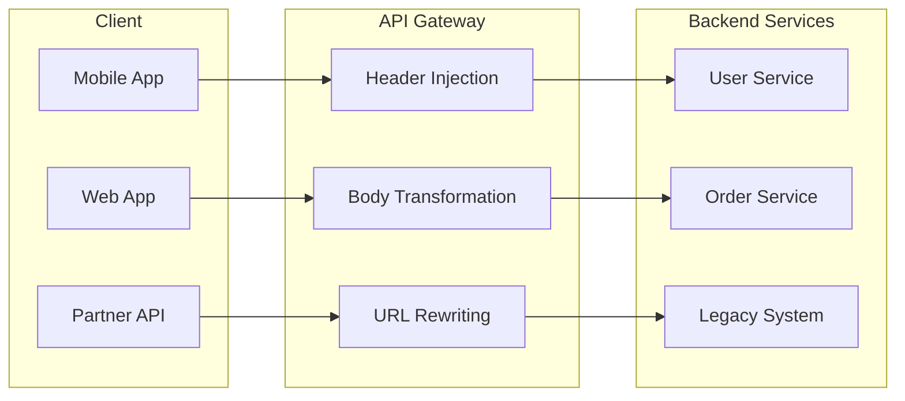
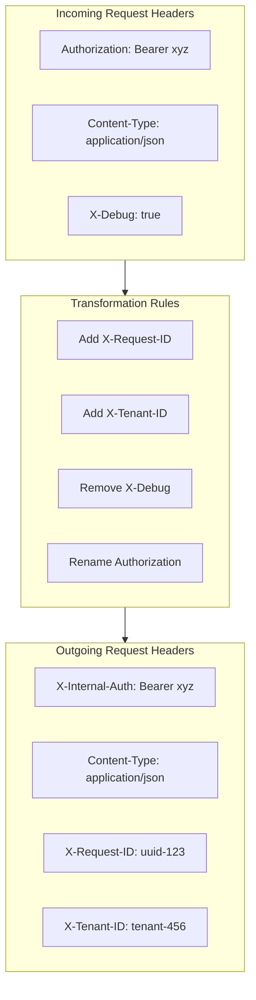
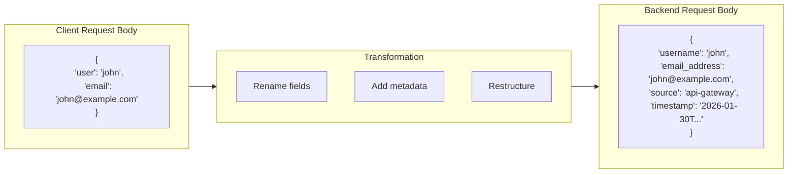
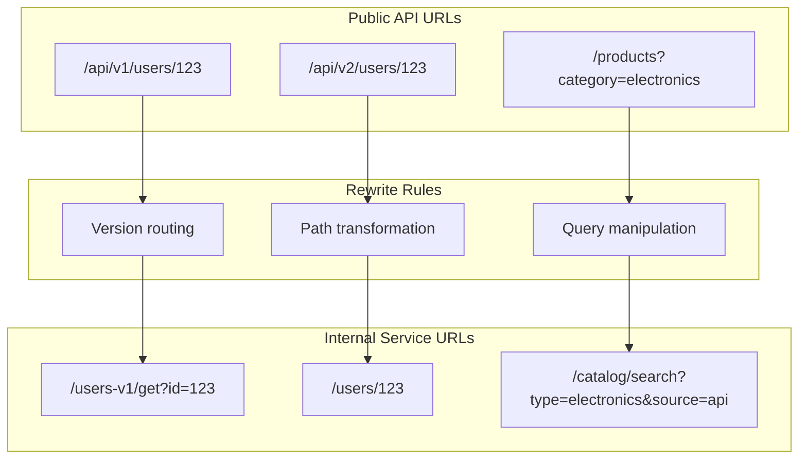
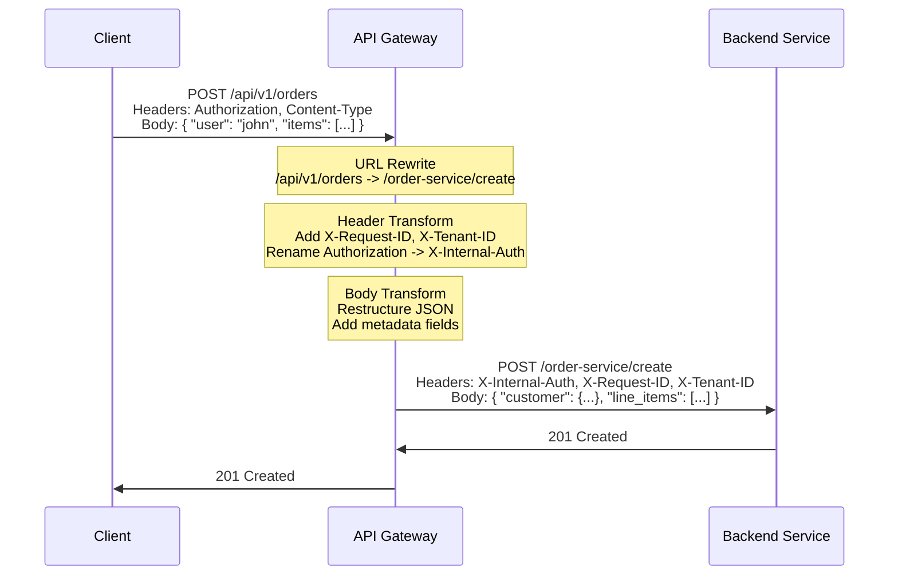

# How to Implement Request Transformation

Author: [nawazdhandala](https://github.com/nawazdhandala)

Tags: API Gateway, Microservices, Transformation, Backend

Description: Learn how to transform API requests with header manipulation, body transformation, and URL rewriting.

---

Request transformation is one of the most powerful capabilities of an API gateway. It allows you to modify incoming requests before they reach your backend services, enabling cleaner APIs, backward compatibility, and decoupled architectures. This guide covers the three pillars of request transformation: header injection, body modification, and URL rewriting.

## Why Request Transformation Matters

When clients send requests to your API gateway, the format they use may not match what your backend services expect. Request transformation bridges this gap without requiring changes to either the client or the backend.



Common use cases include:

- **API versioning**: Transform requests from old API versions to work with new backends
- **Multi-tenancy**: Inject tenant identifiers into requests
- **Security**: Add authentication tokens or strip sensitive headers
- **Protocol translation**: Convert between different API formats (REST to GraphQL, etc.)
- **Legacy integration**: Adapt modern API calls to work with older systems

---

## Header Injection and Manipulation

Headers carry metadata about requests. Transforming headers allows you to inject authentication tokens, add tracing information, or remove headers that should not reach your backend.

### Common Header Transformation Patterns



### Kong Header Transformation

Kong provides the `request-transformer` plugin for header manipulation. Here is how to configure it:

```yaml
# kong.yaml - Declarative configuration for header transformation
_format_version: "3.0"

services:
  - name: user-service
    url: http://user-service:8080
    routes:
      - name: user-route
        paths:
          - /api/v1/users

plugins:
  - name: request-transformer
    service: user-service
    config:
      # Add new headers to every request
      add:
        headers:
          - "X-Request-ID:$(uuid)"           # Generate unique request ID
          - "X-Gateway-Time:$(timestamp)"     # Add gateway timestamp
          - "X-Service-Version:2.0"           # Inject service version

      # Remove headers that should not reach backend
      remove:
        headers:
          - "X-Debug"                         # Strip debug headers
          - "X-Forwarded-Secret"              # Remove sensitive data

      # Rename headers for backend compatibility
      rename:
        headers:
          - "Authorization:X-Internal-Auth"   # Rename auth header
          - "X-Client-ID:X-Consumer-ID"       # Standardize naming

      # Replace header values conditionally
      replace:
        headers:
          - "Host:user-service.internal"      # Override host header
```

For more advanced transformations, use the `request-transformer-advanced` plugin:

```yaml
# Advanced header transformation with conditionals
plugins:
  - name: request-transformer-advanced
    service: user-service
    config:
      add:
        headers:
          # Conditionally add headers based on request properties
          - "X-Premium-User:true:$(headers.X-Subscription) == 'premium'"
          - "X-Rate-Limit-Tier:high:$(headers.X-API-Key) matches '^premium-.*'"
```

### NGINX Header Transformation

NGINX uses directives within location blocks to transform headers:

```nginx
# /etc/nginx/conf.d/api-gateway.conf

upstream user_backend {
    server user-service:8080;
    keepalive 32;
}

server {
    listen 80;
    server_name api.example.com;

    # Generate unique request ID if not present
    map $request_id $final_request_id {
        ""      $request_id;
        default $http_x_request_id;
    }

    location /api/v1/users {
        # Add new headers to proxied request
        proxy_set_header X-Request-ID $final_request_id;
        proxy_set_header X-Real-IP $remote_addr;
        proxy_set_header X-Forwarded-For $proxy_add_x_forwarded_for;
        proxy_set_header X-Forwarded-Proto $scheme;
        proxy_set_header X-Gateway-Time $msec;

        # Override host header for internal routing
        proxy_set_header Host user-service.internal;

        # Remove headers before proxying (set to empty string)
        proxy_set_header X-Debug "";
        proxy_set_header X-Forwarded-Secret "";

        # Rename header by copying and clearing original
        # Copy Authorization to X-Internal-Auth
        set $internal_auth $http_authorization;
        proxy_set_header X-Internal-Auth $internal_auth;
        proxy_set_header Authorization "";

        proxy_pass http://user_backend;
        proxy_http_version 1.1;
        proxy_set_header Connection "";
    }
}
```

For conditional header injection using NGINX with Lua (OpenResty):

```nginx
# Advanced header transformation with Lua
location /api/v1/orders {
    access_by_lua_block {
        -- Extract tenant from JWT token
        local jwt = require "resty.jwt"
        local auth_header = ngx.var.http_authorization

        if auth_header then
            local token = string.match(auth_header, "Bearer%s+(.+)")
            if token then
                local jwt_obj = jwt:load_jwt(token)
                if jwt_obj.valid then
                    -- Inject tenant ID from JWT claims
                    ngx.req.set_header("X-Tenant-ID", jwt_obj.payload.tenant_id)
                    ngx.req.set_header("X-User-ID", jwt_obj.payload.sub)
                end
            end
        end

        -- Add correlation ID for distributed tracing
        local correlation_id = ngx.var.http_x_correlation_id
        if not correlation_id or correlation_id == "" then
            correlation_id = ngx.var.request_id
        end
        ngx.req.set_header("X-Correlation-ID", correlation_id)
    }

    proxy_pass http://order_backend;
}
```

---

## Body Transformation

Body transformation modifies the request payload before it reaches your backend. This is essential for API versioning, format conversion, and data enrichment.

### Body Transformation Flow



### Kong Body Transformation

Kong's `request-transformer` plugin handles JSON body transformation:

```yaml
# kong.yaml - Body transformation configuration
plugins:
  - name: request-transformer
    service: order-service
    config:
      # Add new fields to JSON body
      add:
        body:
          - "source:api-gateway"
          - "api_version:v2"
          - "processed_at:$(timestamp)"

      # Remove fields from body
      remove:
        body:
          - "internal_notes"
          - "debug_info"

      # Rename fields for backend compatibility
      rename:
        body:
          - "user:username"
          - "email:email_address"
          - "phone:phone_number"

      # Replace field values
      replace:
        body:
          - "status:pending"  # Always set status to pending
```

For complex transformations, use the `jq` plugin or a custom plugin:

```lua
-- /usr/local/share/lua/5.1/kong/plugins/body-transformer/handler.lua
-- Custom Kong plugin for advanced body transformation

local cjson = require "cjson.safe"
local BasePlugin = require "kong.plugins.base_plugin"

local BodyTransformer = BasePlugin:extend()

function BodyTransformer:new()
    BodyTransformer.super.new(self, "body-transformer")
end

function BodyTransformer:access(conf)
    BodyTransformer.super.access(self)

    -- Read the request body
    ngx.req.read_body()
    local body = ngx.req.get_body_data()

    if body then
        local data, err = cjson.decode(body)
        if data then
            -- Transform the body structure
            local transformed = {
                -- Flatten nested objects
                username = data.user and data.user.name,
                user_email = data.user and data.user.email,

                -- Rename and restructure order items
                line_items = {},

                -- Add gateway metadata
                metadata = {
                    gateway_version = "2.0",
                    transformed_at = ngx.time(),
                    original_ip = ngx.var.remote_addr
                }
            }

            -- Transform order items array
            if data.items then
                for i, item in ipairs(data.items) do
                    table.insert(transformed.line_items, {
                        sku = item.product_id,
                        quantity = item.qty,
                        unit_price = item.price
                    })
                end
            end

            -- Calculate totals
            local total = 0
            for _, item in ipairs(transformed.line_items) do
                total = total + (item.quantity * item.unit_price)
            end
            transformed.order_total = total

            -- Set the transformed body
            local new_body = cjson.encode(transformed)
            ngx.req.set_body_data(new_body)
            ngx.req.set_header("Content-Length", #new_body)
        end
    end
end

return BodyTransformer
```

### NGINX Body Transformation with Lua

```nginx
# /etc/nginx/conf.d/body-transform.conf

location /api/v1/orders {
    # Enable request body buffering for transformation
    lua_need_request_body on;
    client_body_buffer_size 1m;

    access_by_lua_block {
        local cjson = require "cjson.safe"

        -- Read and parse the request body
        ngx.req.read_body()
        local body = ngx.req.get_body_data()

        if not body then
            return  -- No body to transform
        end

        local data, err = cjson.decode(body)
        if not data then
            ngx.log(ngx.ERR, "Failed to parse JSON: ", err)
            return ngx.exit(400)
        end

        -- API v1 to v2 transformation
        -- v1 format: { "user": "john", "items": [...] }
        -- v2 format: { "customer": { "id": "john" }, "order_items": [...] }

        local transformed = {
            customer = {
                id = data.user or data.customer_id,
                email = data.email,
                tier = data.membership or "standard"
            },
            order_items = {},
            order_metadata = {
                source = "api-gateway",
                api_version = "v2",
                original_version = data.api_version or "v1",
                transformed_at = os.date("!%Y-%m-%dT%H:%M:%SZ")
            }
        }

        -- Transform items array with field renaming
        if data.items then
            for _, item in ipairs(data.items) do
                table.insert(transformed.order_items, {
                    product_sku = item.product_id or item.sku,
                    quantity = item.qty or item.quantity,
                    unit_price_cents = math.floor((item.price or 0) * 100),
                    notes = item.special_instructions
                })
            end
        end

        -- Add shipping information with defaults
        transformed.shipping = {
            address = data.shipping_address or data.address,
            method = data.shipping_method or "standard",
            expedited = data.rush_order == true
        }

        -- Encode and set the new body
        local new_body = cjson.encode(transformed)
        ngx.req.set_body_data(new_body)
        ngx.req.set_header("Content-Type", "application/json")
        ngx.req.set_header("Content-Length", tostring(#new_body))

        -- Log transformation for debugging
        ngx.log(ngx.DEBUG, "Transformed body: ", new_body)
    }

    proxy_pass http://order_backend;
}
```

### JSON to XML Transformation

Some legacy backends require XML. Here is how to transform JSON to XML:

```lua
-- JSON to XML transformation function
local function json_to_xml(data, root_name)
    local function serialize(tbl, name)
        local result = {}

        if type(tbl) == "table" then
            if #tbl > 0 then
                -- Array: wrap each element
                for _, v in ipairs(tbl) do
                    table.insert(result, "<" .. name .. ">")
                    table.insert(result, serialize(v, "item"))
                    table.insert(result, "</" .. name .. ">")
                end
                return table.concat(result)
            else
                -- Object: process key-value pairs
                for k, v in pairs(tbl) do
                    table.insert(result, "<" .. k .. ">")
                    table.insert(result, serialize(v, k))
                    table.insert(result, "</" .. k .. ">")
                end
                return table.concat(result)
            end
        else
            -- Primitive value: escape and return
            local str = tostring(tbl)
            str = str:gsub("&", "&amp;")
            str = str:gsub("<", "&lt;")
            str = str:gsub(">", "&gt;")
            return str
        end
    end

    return '<?xml version="1.0" encoding="UTF-8"?>' ..
           "<" .. root_name .. ">" ..
           serialize(data, root_name) ..
           "</" .. root_name .. ">"
end

-- Usage in NGINX Lua block
access_by_lua_block {
    local cjson = require "cjson.safe"

    ngx.req.read_body()
    local body = ngx.req.get_body_data()
    local data = cjson.decode(body)

    if data then
        local xml_body = json_to_xml(data, "request")
        ngx.req.set_body_data(xml_body)
        ngx.req.set_header("Content-Type", "application/xml")
        ngx.req.set_header("Content-Length", tostring(#xml_body))
    end
}
```

---

## URL Rewriting

URL rewriting modifies the request path and query parameters. This enables clean public APIs while routing to complex internal service structures.

### URL Rewriting Patterns



### Kong URL Rewriting

Kong offers multiple plugins for URL manipulation:

```yaml
# kong.yaml - URL rewriting configuration
_format_version: "3.0"

services:
  - name: user-service-v1
    url: http://user-service-legacy:8080
    routes:
      - name: users-v1
        paths:
          - /api/v1/users
        strip_path: true  # Remove /api/v1/users prefix

  - name: user-service-v2
    url: http://user-service:8080
    routes:
      - name: users-v2
        paths:
          - /api/v2/users
        strip_path: true

plugins:
  # Request Transformer for query parameter manipulation
  - name: request-transformer
    service: user-service-v1
    config:
      add:
        querystring:
          - "format:legacy"
          - "source:api-gateway"
      rename:
        querystring:
          - "user_id:id"
          - "page_num:page"

  # Route by header for canary deployments
  - name: route-by-header
    service: user-service-v2
    config:
      rules:
        - condition:
            header_name: X-Canary
            header_value: "true"
          upstream_name: user-service-canary

# Use regex routes for complex URL patterns
services:
  - name: resource-service
    url: http://resource-service:8080
    routes:
      - name: resource-by-id
        # Match /resources/{type}/{id} and transform to /v2/{type}/item/{id}
        paths:
          - "~/resources/(?<type>[^/]+)/(?<id>[^/]+)"
        strip_path: false

plugins:
  - name: request-transformer
    route: resource-by-id
    config:
      replace:
        uri: "/v2/$(uri_captures.type)/item/$(uri_captures.id)"
```

For advanced URL rewriting, use the `pre-function` plugin with Lua:

```yaml
plugins:
  - name: pre-function
    service: legacy-service
    config:
      access:
        - |
          -- Complex URL rewriting logic
          local path = kong.request.get_path()
          local method = kong.request.get_method()

          -- Transform REST paths to legacy query-based API
          -- /users/123 -> /api.php?action=getUser&id=123
          local user_id = path:match("/users/(%d+)")
          if user_id then
            local new_path = "/api.php"
            local new_query = "action=getUser&id=" .. user_id

            if method == "PUT" then
              new_query = "action=updateUser&id=" .. user_id
            elseif method == "DELETE" then
              new_query = "action=deleteUser&id=" .. user_id
            end

            kong.service.request.set_path(new_path)
            kong.service.request.set_raw_query(new_query)
          end

          -- Transform nested resources
          -- /users/123/orders/456 -> /order-service/get?user=123&order=456
          local user_id, order_id = path:match("/users/(%d+)/orders/(%d+)")
          if user_id and order_id then
            kong.service.request.set_path("/order-service/get")
            kong.service.request.set_raw_query(
              "user=" .. user_id .. "&order=" .. order_id
            )
          end
```

### NGINX URL Rewriting

NGINX provides powerful URL rewriting with the `rewrite` directive and `location` blocks:

```nginx
# /etc/nginx/conf.d/url-rewrite.conf

# Map for version-based routing
map $uri $backend_version {
    ~^/api/v1/  "legacy";
    ~^/api/v2/  "current";
    ~^/api/v3/  "beta";
    default     "current";
}

# Upstream definitions for different versions
upstream user_legacy {
    server user-service-v1:8080;
}

upstream user_current {
    server user-service-v2:8080;
}

upstream user_beta {
    server user-service-v3:8080;
}

server {
    listen 80;
    server_name api.example.com;

    # Simple path prefix stripping
    location /api/v2/users {
        # Strip /api/v2 prefix
        rewrite ^/api/v2/(.*)$ /$1 break;
        proxy_pass http://user_current;
    }

    # Regex-based URL transformation
    location ~ ^/api/v1/users/(\d+)$ {
        # Transform /api/v1/users/123 to /legacy/user?id=123
        set $user_id $1;
        rewrite ^ /legacy/user break;

        # Add query parameters
        set $args "id=$user_id&format=json";

        proxy_pass http://user_legacy;
    }

    # Complex nested resource rewriting
    location ~ ^/api/v2/users/(\d+)/orders/(\d+)$ {
        set $user_id $1;
        set $order_id $2;

        # Rewrite to internal service path
        rewrite ^ /orders/$order_id break;

        # Inject user context as header
        proxy_set_header X-User-ID $user_id;

        proxy_pass http://order_backend;
    }

    # Query parameter transformation
    location /api/v2/search {
        # Capture and transform query parameters
        set_by_lua_block $transformed_query {
            local args = ngx.req.get_uri_args()
            local new_args = {}

            -- Rename parameters
            new_args["q"] = args["query"] or args["q"]
            new_args["limit"] = args["page_size"] or args["limit"] or "20"
            new_args["offset"] = args["page"] and
                                 tostring((tonumber(args["page"]) - 1) * 20) or
                                 args["offset"] or "0"

            -- Add default parameters
            new_args["source"] = "api"
            new_args["format"] = "json"

            -- Build query string
            local parts = {}
            for k, v in pairs(new_args) do
                if v then
                    table.insert(parts, k .. "=" .. ngx.escape_uri(v))
                end
            end
            return table.concat(parts, "&")
        }

        rewrite ^ /search break;
        set $args $transformed_query;

        proxy_pass http://search_backend;
    }

    # Versioned API with fallback
    location ~ ^/api/(?<version>v\d+)/(?<path>.*)$ {
        # Dynamic upstream selection based on version
        set $upstream "";

        if ($version = "v1") {
            set $upstream "user_legacy";
        }
        if ($version = "v2") {
            set $upstream "user_current";
        }
        if ($version = "v3") {
            set $upstream "user_beta";
        }

        # Default to current if version not recognized
        if ($upstream = "") {
            set $upstream "user_current";
        }

        rewrite ^ /$path break;
        proxy_pass http://$upstream;
    }
}
```

### Advanced URL Rewriting with OpenResty

```nginx
# Complex routing logic with Lua
location /api {
    access_by_lua_block {
        local uri = ngx.var.uri
        local method = ngx.req.get_method()
        local headers = ngx.req.get_headers()

        -- Route based on Accept header
        local accept = headers["Accept"] or "application/json"
        local is_xml = accept:find("application/xml")

        -- Build routing table
        local routes = {
            -- RESTful to RPC transformation
            {
                pattern = "^/api/v1/users/(%d+)$",
                methods = {"GET"},
                transform = function(matches)
                    return "/rpc/user.get", "id=" .. matches[1]
                end
            },
            {
                pattern = "^/api/v1/users/(%d+)$",
                methods = {"PUT", "PATCH"},
                transform = function(matches)
                    return "/rpc/user.update", "id=" .. matches[1]
                end
            },
            {
                pattern = "^/api/v1/users/(%d+)/orders$",
                methods = {"GET"},
                transform = function(matches)
                    return "/rpc/order.list", "user_id=" .. matches[1]
                end
            },
            {
                pattern = "^/api/v1/users/(%d+)/orders$",
                methods = {"POST"},
                transform = function(matches)
                    ngx.req.set_header("X-User-ID", matches[1])
                    return "/rpc/order.create", ""
                end
            }
        }

        -- Find matching route
        for _, route in ipairs(routes) do
            local matches = {uri:match(route.pattern)}
            if #matches > 0 then
                -- Check method
                local method_ok = false
                for _, m in ipairs(route.methods) do
                    if m == method then
                        method_ok = true
                        break
                    end
                end

                if method_ok then
                    local new_path, new_query = route.transform(matches)
                    ngx.req.set_uri(new_path)

                    -- Merge with existing query string
                    local existing_args = ngx.req.get_uri_args()
                    if new_query and new_query ~= "" then
                        for pair in new_query:gmatch("[^&]+") do
                            local k, v = pair:match("([^=]+)=?(.*)")
                            existing_args[k] = v
                        end
                    end
                    ngx.req.set_uri_args(existing_args)

                    -- Set format header for backend
                    if is_xml then
                        ngx.req.set_header("X-Response-Format", "xml")
                    end

                    return  -- Route matched
                end
            end
        end

        -- No route matched
        ngx.status = 404
        ngx.say('{"error": "Route not found"}')
        return ngx.exit(404)
    }

    proxy_pass http://rpc_backend;
}
```

---

## Combining All Three Transformations

Real-world scenarios often require all three types of transformation working together. Here is a complete example:



### Complete Kong Configuration

```yaml
# kong.yaml - Complete transformation pipeline
_format_version: "3.0"

services:
  - name: order-service
    url: http://order-service:8080
    routes:
      - name: create-order
        paths:
          - /api/v1/orders
        methods:
          - POST
        strip_path: true

plugins:
  # Step 1: Pre-function for complex logic
  - name: pre-function
    service: order-service
    config:
      access:
        - |
          -- Generate correlation ID
          local uuid = require "kong.tools.uuid"
          local correlation_id = kong.request.get_header("X-Correlation-ID")
          if not correlation_id then
            correlation_id = uuid()
          end
          kong.service.request.set_header("X-Correlation-ID", correlation_id)

          -- Extract tenant from path or header
          local path = kong.request.get_path()
          local tenant = path:match("/tenants/([^/]+)/") or
                         kong.request.get_header("X-Tenant-ID") or
                         "default"
          kong.service.request.set_header("X-Tenant-ID", tenant)

          -- URL transformation
          kong.service.request.set_path("/order-service/create")

  # Step 2: Request transformer for headers and body
  - name: request-transformer
    service: order-service
    config:
      remove:
        headers:
          - "X-Debug"
          - "X-Test-Mode"
      rename:
        headers:
          - "Authorization:X-Internal-Auth"
      add:
        headers:
          - "X-Gateway-Version:2.0"
          - "X-Request-Time:$(timestamp)"
        body:
          - "source:api-gateway"
          - "api_version:v1"
      rename:
        body:
          - "user:customer_id"
          - "items:line_items"

  # Step 3: Rate limiting per tenant
  - name: rate-limiting
    service: order-service
    config:
      minute: 100
      policy: local
      header_name: X-Tenant-ID
```

### Complete NGINX Configuration

```nginx
# /etc/nginx/conf.d/complete-transform.conf

upstream order_backend {
    server order-service:8080;
    keepalive 64;
}

# Lua shared dict for rate limiting
lua_shared_dict rate_limit 10m;

server {
    listen 80;
    server_name api.example.com;

    # Buffer settings for body transformation
    client_body_buffer_size 1m;
    client_max_body_size 10m;

    location /api/v1/orders {
        # Enable Lua body reading
        lua_need_request_body on;

        access_by_lua_block {
            local cjson = require "cjson.safe"
            local uuid = require "resty.jit-uuid"

            -- Initialize UUID generator
            uuid.seed()

            -- STEP 1: Generate and set correlation ID
            local correlation_id = ngx.var.http_x_correlation_id
            if not correlation_id or correlation_id == "" then
                correlation_id = uuid()
            end
            ngx.req.set_header("X-Correlation-ID", correlation_id)

            -- STEP 2: Extract tenant from JWT or header
            local tenant_id = ngx.var.http_x_tenant_id
            if not tenant_id then
                local auth = ngx.var.http_authorization
                if auth then
                    local token = auth:match("Bearer%s+(.+)")
                    if token then
                        -- Decode JWT (simplified - use proper JWT lib in production)
                        local parts = {}
                        for part in token:gmatch("[^.]+") do
                            table.insert(parts, part)
                        end
                        if #parts >= 2 then
                            local payload = ngx.decode_base64(parts[2])
                            local claims = cjson.decode(payload)
                            if claims then
                                tenant_id = claims.tenant_id
                            end
                        end
                    end
                end
            end
            tenant_id = tenant_id or "default"
            ngx.req.set_header("X-Tenant-ID", tenant_id)

            -- STEP 3: Header transformation
            -- Rename Authorization to X-Internal-Auth
            local auth = ngx.var.http_authorization
            if auth then
                ngx.req.set_header("X-Internal-Auth", auth)
                ngx.req.clear_header("Authorization")
            end

            -- Remove debug headers
            ngx.req.clear_header("X-Debug")
            ngx.req.clear_header("X-Test-Mode")

            -- Add gateway metadata headers
            ngx.req.set_header("X-Gateway-Version", "2.0")
            ngx.req.set_header("X-Request-Time", tostring(ngx.time()))
            ngx.req.set_header("X-Real-IP", ngx.var.remote_addr)

            -- STEP 4: Body transformation
            local body = ngx.req.get_body_data()
            if body then
                local data, err = cjson.decode(body)
                if data then
                    -- Transform body structure
                    local transformed = {
                        -- Rename fields
                        customer_id = data.user or data.customer_id,
                        line_items = data.items or data.line_items,

                        -- Preserve other fields
                        shipping_address = data.shipping_address,
                        payment_method = data.payment_method,

                        -- Add metadata
                        source = "api-gateway",
                        api_version = "v1",
                        tenant_id = tenant_id,
                        received_at = os.date("!%Y-%m-%dT%H:%M:%SZ"),
                        correlation_id = correlation_id
                    }

                    -- Transform line items if present
                    if transformed.line_items then
                        for i, item in ipairs(transformed.line_items) do
                            transformed.line_items[i] = {
                                sku = item.product_id or item.sku,
                                quantity = item.qty or item.quantity,
                                unit_price = item.price or item.unit_price
                            }
                        end
                    end

                    local new_body = cjson.encode(transformed)
                    ngx.req.set_body_data(new_body)
                    ngx.req.set_header("Content-Length", tostring(#new_body))
                end
            end

            -- STEP 5: URL rewrite
            ngx.req.set_uri("/order-service/create")
        }

        proxy_pass http://order_backend;
        proxy_http_version 1.1;
        proxy_set_header Connection "";
    }
}
```

---

## Performance Considerations

Request transformation adds latency. Here are strategies to minimize impact:

### Caching Transformation Results

```lua
-- Cache compiled patterns and transformations
local transform_cache = ngx.shared.transform_cache

local function get_cached_transform(key, compute_fn)
    local cached = transform_cache:get(key)
    if cached then
        return cached
    end

    local result = compute_fn()
    transform_cache:set(key, result, 300)  -- Cache for 5 minutes
    return result
end
```

### Lazy Body Parsing

```lua
-- Only parse body when transformation is needed
local function should_transform_body(uri, method)
    -- Skip body transformation for GET/DELETE
    if method == "GET" or method == "DELETE" then
        return false
    end

    -- Skip for specific paths
    local skip_paths = {"/health", "/metrics", "/ready"}
    for _, path in ipairs(skip_paths) do
        if uri == path then
            return false
        end
    end

    return true
end
```

### Async Transformation for Large Payloads

```lua
-- Use cosockets for non-blocking I/O
local function transform_async(body)
    local thread = ngx.thread.spawn(function()
        -- Heavy transformation work
        return transform_body(body)
    end)

    local ok, result = ngx.thread.wait(thread)
    return result
end
```

---

## Testing Transformations

Always test your transformations thoroughly:

```bash
#!/bin/bash
# test-transformations.sh

# Test header injection
echo "Testing header injection..."
curl -i http://localhost/api/v1/users \
  -H "Authorization: Bearer test-token" \
  -H "X-Debug: true" | grep -E "X-Request-ID|X-Tenant-ID"

# Test body transformation
echo "Testing body transformation..."
curl -X POST http://localhost/api/v1/orders \
  -H "Content-Type: application/json" \
  -d '{"user": "john", "items": [{"product_id": "SKU-1", "qty": 2}]}' \
  | jq .

# Test URL rewriting
echo "Testing URL rewriting..."
curl -v http://localhost/api/v1/users/123 2>&1 | grep "< HTTP"

# Test query parameter transformation
echo "Testing query transformation..."
curl "http://localhost/api/v1/search?query=test&page_size=10" \
  -H "X-Debug: true" | jq .
```

---

## Summary

Request transformation is essential for building flexible, maintainable API gateways. The three pillars work together:

| Transformation Type | Use Case | Gateway Feature |
|---------------------|----------|-----------------|
| Header Injection | Authentication, tracing, tenant context | `proxy_set_header`, `request-transformer` |
| Body Modification | API versioning, format conversion | Lua scripting, custom plugins |
| URL Rewriting | Path normalization, legacy routing | `rewrite`, regex routes |

Start with simple transformations and add complexity only when needed. Monitor transformation latency and cache results where possible. Test thoroughly before deploying to production.

---

**Related Reading:**

- [What is an API Gateway?](https://oneuptime.com/blog/post/what-is-an-api-gateway)
- [Monitoring Microservices with OneUptime](https://oneuptime.com/blog/post/monitoring-microservices)
- [Rate Limiting Best Practices](https://oneuptime.com/blog/post/rate-limiting-best-practices)
