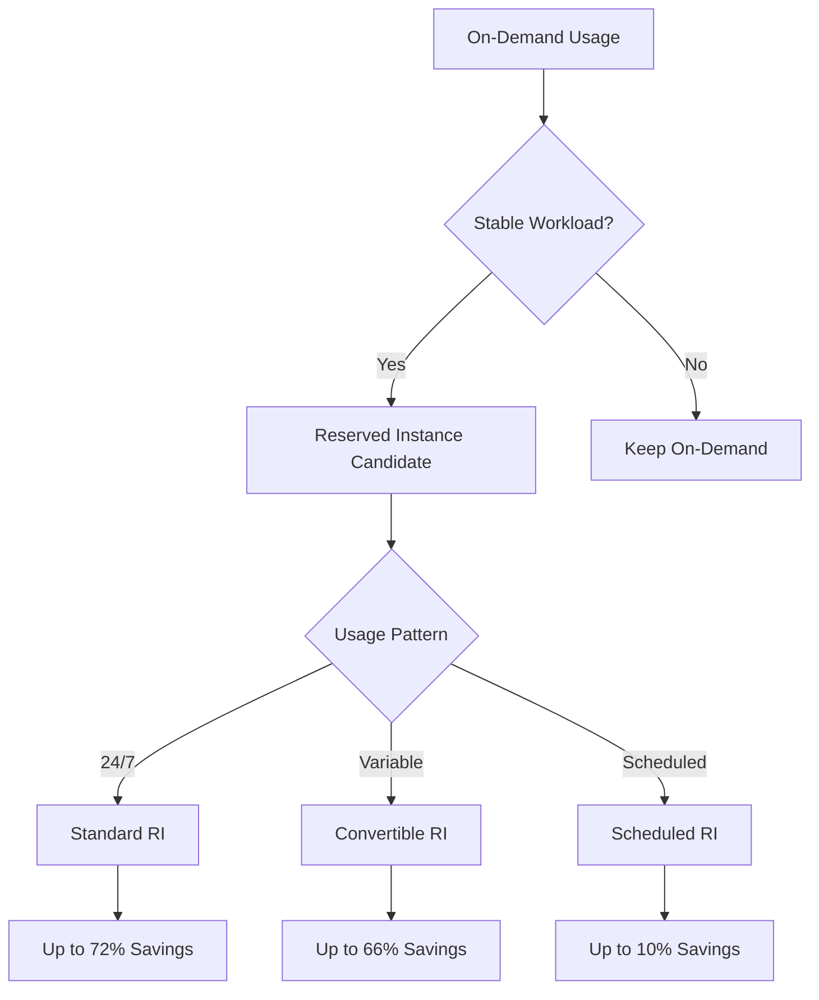
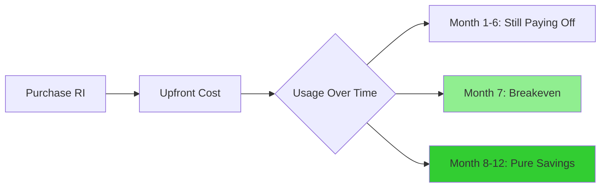
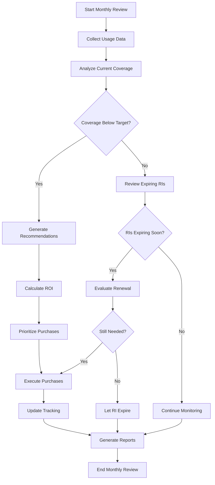
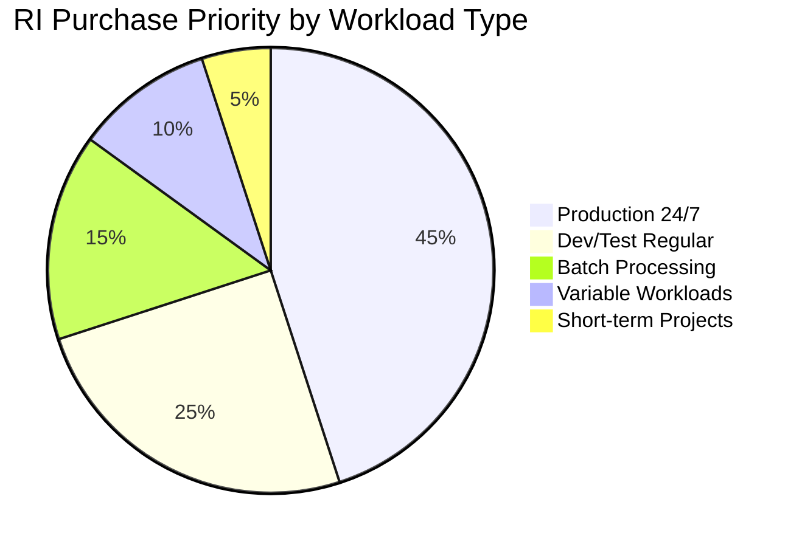

# How to Build Reserved Instance Planning

Author: [nawazdhandala](https://github.com/nawazdhandala)

Tags: FinOps, Cloud, Cost Optimization, AWS

Description: Learn how to plan reserved instance purchases for significant cloud cost savings.

---

Cloud computing offers incredible flexibility, but that flexibility comes at a cost. On-demand pricing, while convenient, can quickly drain your budget if you are running stable workloads. Reserved Instances (RIs) offer a way to reduce costs by up to 72% compared to on-demand pricing, but only if you plan them correctly.

In this comprehensive guide, we will walk through building a robust Reserved Instance planning strategy that maximizes savings while minimizing risk.

## Understanding Reserved Instances

Reserved Instances are a billing discount applied to the use of on-demand instances in your account. When you purchase a Reserved Instance, you commit to a specific:

- **Instance type** (e.g., m5.xlarge)
- **Region** (e.g., us-east-1)
- **Tenancy** (shared or dedicated)
- **Platform** (Linux, Windows, etc.)
- **Term** (1 year or 3 years)
- **Payment option** (All Upfront, Partial Upfront, or No Upfront)



## Step 1: Analyze Your Current RI Coverage

Before purchasing any Reserved Instances, you need to understand your current coverage and utilization. Here is a Python script to analyze your RI coverage using AWS Cost Explorer:

```python
import boto3
from datetime import datetime, timedelta
import json

def get_ri_coverage(days_back=30):
    """
    Fetch Reserved Instance coverage data from AWS Cost Explorer.

    This function retrieves RI coverage metrics to help identify
    opportunities for purchasing new reservations.

    Args:
        days_back: Number of days to analyze (default: 30)

    Returns:
        Dictionary containing coverage data by service and instance type
    """

    # Initialize the Cost Explorer client
    ce_client = boto3.client('ce')

    # Calculate the date range for analysis
    end_date = datetime.now()
    start_date = end_date - timedelta(days=days_back)

    # Format dates as required by AWS API
    time_period = {
        'Start': start_date.strftime('%Y-%m-%d'),
        'End': end_date.strftime('%Y-%m-%d')
    }

    # Request RI coverage grouped by instance type
    response = ce_client.get_reservation_coverage(
        TimePeriod=time_period,
        Granularity='MONTHLY',
        GroupBy=[
            {
                'Type': 'DIMENSION',
                'Key': 'INSTANCE_TYPE'
            }
        ],
        Metrics=['Hour']
    )

    # Process and structure the coverage data
    coverage_data = []
    for group in response.get('CoveragesByTime', []):
        for item in group.get('Groups', []):
            instance_type = item['Attributes'].get('instanceType', 'Unknown')
            coverage = item['Coverage']['CoverageHours']

            coverage_data.append({
                'instance_type': instance_type,
                'total_running_hours': float(coverage['TotalRunningHours']),
                'reserved_hours': float(coverage['ReservedHours']),
                'on_demand_hours': float(coverage['OnDemandHours']),
                'coverage_percentage': float(coverage['CoverageHoursPercentage'])
            })

    return coverage_data


def identify_ri_opportunities(coverage_data, min_coverage_gap=20):
    """
    Identify instances that could benefit from Reserved Instance purchases.

    Instances with low RI coverage and high on-demand usage are
    prime candidates for reservation.

    Args:
        coverage_data: Output from get_ri_coverage()
        min_coverage_gap: Minimum gap percentage to flag as opportunity

    Returns:
        List of instance types recommended for RI purchase
    """

    opportunities = []

    for item in coverage_data:
        # Calculate the coverage gap (how much is NOT covered by RIs)
        coverage_gap = 100 - item['coverage_percentage']

        # Flag instances with significant on-demand usage
        if coverage_gap >= min_coverage_gap and item['on_demand_hours'] > 100:
            opportunities.append({
                'instance_type': item['instance_type'],
                'coverage_gap': coverage_gap,
                'on_demand_hours': item['on_demand_hours'],
                'potential_savings': estimate_potential_savings(
                    item['instance_type'],
                    item['on_demand_hours']
                )
            })

    # Sort by potential savings (highest first)
    opportunities.sort(key=lambda x: x['potential_savings'], reverse=True)

    return opportunities


def estimate_potential_savings(instance_type, on_demand_hours, ri_discount=0.40):
    """
    Estimate potential savings from converting on-demand to RI.

    This is a simplified calculation. Actual savings depend on
    the specific RI terms and payment options chosen.

    Args:
        instance_type: AWS instance type
        on_demand_hours: Hours of on-demand usage
        ri_discount: Expected discount rate (default: 40%)

    Returns:
        Estimated monthly savings in dollars
    """

    # Simplified pricing lookup (in production, use AWS Pricing API)
    # These are approximate hourly rates for common instance types
    hourly_rates = {
        'm5.large': 0.096,
        'm5.xlarge': 0.192,
        'm5.2xlarge': 0.384,
        'c5.large': 0.085,
        'c5.xlarge': 0.170,
        'r5.large': 0.126,
        'r5.xlarge': 0.252,
    }

    # Get the hourly rate or use a default
    hourly_rate = hourly_rates.get(instance_type, 0.15)

    # Calculate potential monthly savings
    monthly_on_demand_cost = on_demand_hours * hourly_rate
    potential_savings = monthly_on_demand_cost * ri_discount

    return round(potential_savings, 2)


# Example usage
if __name__ == '__main__':
    # Fetch coverage data for the last 30 days
    coverage = get_ri_coverage(days_back=30)

    print("Current RI Coverage Summary:")
    print("-" * 60)
    for item in coverage:
        print(f"Instance Type: {item['instance_type']}")
        print(f"  Coverage: {item['coverage_percentage']:.1f}%")
        print(f"  On-Demand Hours: {item['on_demand_hours']:.0f}")
        print()

    # Identify opportunities for new RI purchases
    opportunities = identify_ri_opportunities(coverage)

    print("\nRI Purchase Opportunities:")
    print("-" * 60)
    for opp in opportunities:
        print(f"Instance Type: {opp['instance_type']}")
        print(f"  Coverage Gap: {opp['coverage_gap']:.1f}%")
        print(f"  Potential Monthly Savings: ${opp['potential_savings']:.2f}")
        print()
```

## Step 2: Calculate Breakeven Points

Understanding breakeven points is critical for RI planning. You need to know how long an instance must run before the RI investment pays off.



Here is how to calculate breakeven points for different payment options:

```python
from dataclasses import dataclass
from typing import Optional
import math

@dataclass
class RIPricingOption:
    """
    Represents pricing for a Reserved Instance option.

    Attributes:
        name: Payment option name (All Upfront, Partial Upfront, No Upfront)
        upfront_cost: One-time upfront payment
        hourly_cost: Recurring hourly cost (if any)
        term_months: Commitment term in months
    """
    name: str
    upfront_cost: float
    hourly_cost: float
    term_months: int


def calculate_breakeven_point(
    on_demand_hourly: float,
    ri_option: RIPricingOption,
    hours_per_month: int = 730
) -> dict:
    """
    Calculate the breakeven point for a Reserved Instance purchase.

    The breakeven point is when cumulative RI costs equal what you
    would have paid with on-demand pricing for the same usage.

    Args:
        on_demand_hourly: On-demand hourly rate
        ri_option: Reserved Instance pricing option
        hours_per_month: Average hours in a month (default: 730)

    Returns:
        Dictionary with breakeven analysis results
    """

    # Calculate monthly costs for each pricing model
    monthly_on_demand = on_demand_hourly * hours_per_month
    monthly_ri_recurring = ri_option.hourly_cost * hours_per_month

    # Monthly savings from RI (excluding upfront amortization)
    monthly_savings = monthly_on_demand - monthly_ri_recurring

    # Handle edge case where RI is more expensive (should not happen)
    if monthly_savings <= 0:
        return {
            'breakeven_months': float('inf'),
            'message': 'RI is more expensive than on-demand',
            'total_savings': 0
        }

    # Calculate breakeven point
    # Breakeven occurs when: upfront_cost = monthly_savings * months
    if ri_option.upfront_cost > 0:
        breakeven_months = ri_option.upfront_cost / monthly_savings
    else:
        # No upfront means immediate savings
        breakeven_months = 0

    # Calculate total savings over the term
    total_on_demand_cost = monthly_on_demand * ri_option.term_months
    total_ri_cost = ri_option.upfront_cost + (monthly_ri_recurring * ri_option.term_months)
    total_savings = total_on_demand_cost - total_ri_cost

    # Calculate effective discount percentage
    effective_discount = (total_savings / total_on_demand_cost) * 100

    return {
        'payment_option': ri_option.name,
        'breakeven_months': round(breakeven_months, 1),
        'total_term_savings': round(total_savings, 2),
        'effective_discount': round(effective_discount, 1),
        'monthly_on_demand_cost': round(monthly_on_demand, 2),
        'monthly_ri_cost': round(monthly_ri_recurring + (ri_option.upfront_cost / ri_option.term_months), 2)
    }


def compare_ri_options(on_demand_hourly: float, instance_type: str) -> list:
    """
    Compare all RI payment options for a given instance type.

    This helps determine which payment option offers the best
    balance of savings versus cash flow requirements.

    Args:
        on_demand_hourly: On-demand hourly rate
        instance_type: Instance type for reporting

    Returns:
        List of breakeven analysis for each payment option
    """

    # Define typical RI pricing options (1-year term)
    # These discount rates are approximate and vary by instance type
    ri_options = [
        RIPricingOption(
            name="1-Year All Upfront",
            upfront_cost=on_demand_hourly * 730 * 12 * 0.60,  # 40% discount
            hourly_cost=0,
            term_months=12
        ),
        RIPricingOption(
            name="1-Year Partial Upfront",
            upfront_cost=on_demand_hourly * 730 * 12 * 0.30,  # Half upfront
            hourly_cost=on_demand_hourly * 0.65,  # 35% discount on hourly
            term_months=12
        ),
        RIPricingOption(
            name="1-Year No Upfront",
            upfront_cost=0,
            hourly_cost=on_demand_hourly * 0.70,  # 30% discount
            term_months=12
        ),
        RIPricingOption(
            name="3-Year All Upfront",
            upfront_cost=on_demand_hourly * 730 * 36 * 0.40,  # 60% discount
            hourly_cost=0,
            term_months=36
        ),
    ]

    results = []
    for option in ri_options:
        analysis = calculate_breakeven_point(on_demand_hourly, option)
        analysis['instance_type'] = instance_type
        results.append(analysis)

    return results


# Example: Analyze breakeven for m5.xlarge
if __name__ == '__main__':
    instance_type = 'm5.xlarge'
    on_demand_rate = 0.192  # USD per hour

    print(f"Breakeven Analysis for {instance_type}")
    print(f"On-Demand Rate: ${on_demand_rate}/hour")
    print("=" * 70)

    comparisons = compare_ri_options(on_demand_rate, instance_type)

    for result in comparisons:
        print(f"\n{result['payment_option']}")
        print(f"  Breakeven Point: {result['breakeven_months']} months")
        print(f"  Total Term Savings: ${result['total_term_savings']:,.2f}")
        print(f"  Effective Discount: {result['effective_discount']}%")
        print(f"  Monthly Cost (amortized): ${result['monthly_ri_cost']:.2f}")
```

## Step 3: Analyze AWS RI Recommendations

AWS Cost Explorer provides built-in RI recommendations. Here is how to fetch and analyze them programmatically:

```python
import boto3
from datetime import datetime
import pandas as pd

def get_aws_ri_recommendations(
    service: str = 'Amazon Elastic Compute Cloud - Compute',
    lookback_period: str = 'SIXTY_DAYS',
    term: str = 'ONE_YEAR',
    payment_option: str = 'PARTIAL_UPFRONT'
) -> dict:
    """
    Fetch RI recommendations from AWS Cost Explorer.

    AWS analyzes your usage patterns and provides recommendations
    for RI purchases that would reduce costs.

    Args:
        service: AWS service to get recommendations for
        lookback_period: Historical period to analyze (SEVEN_DAYS, THIRTY_DAYS, SIXTY_DAYS)
        term: RI term (ONE_YEAR, THREE_YEARS)
        payment_option: Payment type (NO_UPFRONT, PARTIAL_UPFRONT, ALL_UPFRONT)

    Returns:
        Dictionary containing recommendations and metadata
    """

    ce_client = boto3.client('ce')

    response = ce_client.get_reservation_purchase_recommendation(
        Service=service,
        LookbackPeriodInDays=lookback_period,
        TermInYears=term,
        PaymentOption=payment_option
    )

    return response


def parse_ri_recommendations(response: dict) -> list:
    """
    Parse AWS RI recommendations into a structured format.

    Extracts key metrics from each recommendation including
    expected savings, utilization, and ROI.

    Args:
        response: Raw response from get_reservation_purchase_recommendation

    Returns:
        List of parsed recommendation dictionaries
    """

    recommendations = []

    for rec in response.get('Recommendations', []):
        for detail in rec.get('RecommendationDetails', []):
            instance_details = detail.get('InstanceDetails', {}).get('EC2InstanceDetails', {})

            recommendations.append({
                # Instance specifications
                'instance_type': instance_details.get('InstanceType'),
                'region': instance_details.get('Region'),
                'platform': instance_details.get('Platform'),
                'tenancy': instance_details.get('Tenancy'),

                # Recommendation metrics
                'recommended_quantity': int(detail.get('RecommendedNumberOfInstancesToPurchase', 0)),
                'expected_utilization': float(detail.get('EstimatedMonthlySavingsPercentage', 0)),

                # Financial metrics
                'upfront_cost': float(detail.get('UpfrontCost', 0)),
                'recurring_monthly_cost': float(detail.get('RecurringStandardMonthlyCost', 0)),
                'estimated_monthly_savings': float(detail.get('EstimatedMonthlySavingsAmount', 0)),
                'estimated_breakeven_months': float(detail.get('EstimatedBreakEvenInMonths', 0)),

                # Current usage context
                'current_monthly_spend': float(detail.get('CurrentOnDemandSpend', 0)),
                'average_utilization': float(detail.get('AverageUtilization', 0))
            })

    return recommendations


def prioritize_recommendations(recommendations: list, budget: float = None) -> list:
    """
    Prioritize RI recommendations based on ROI and risk factors.

    Higher utilization and faster breakeven times indicate lower risk.
    This function helps allocate a limited budget to the best opportunities.

    Args:
        recommendations: List of parsed recommendations
        budget: Optional maximum budget for RI purchases

    Returns:
        Prioritized and optionally budget-constrained recommendations
    """

    # Calculate ROI score for each recommendation
    for rec in recommendations:
        # Annual savings projection
        annual_savings = rec['estimated_monthly_savings'] * 12

        # Total cost (upfront + 12 months recurring)
        total_cost = rec['upfront_cost'] + (rec['recurring_monthly_cost'] * 12)

        # ROI as a percentage
        if total_cost > 0:
            roi = (annual_savings / total_cost) * 100
        else:
            roi = 0

        # Risk score based on utilization (higher is better)
        utilization_score = rec['average_utilization'] / 100

        # Combined priority score
        # Weights: ROI (40%), Utilization (40%), Fast Breakeven (20%)
        breakeven_score = max(0, 1 - (rec['estimated_breakeven_months'] / 12))

        rec['roi_percentage'] = round(roi, 1)
        rec['priority_score'] = round(
            (roi * 0.4) + (utilization_score * 40) + (breakeven_score * 20),
            2
        )

    # Sort by priority score (highest first)
    prioritized = sorted(recommendations, key=lambda x: x['priority_score'], reverse=True)

    # Apply budget constraint if specified
    if budget is not None:
        selected = []
        remaining_budget = budget

        for rec in prioritized:
            total_cost = rec['upfront_cost'] + rec['recurring_monthly_cost']
            if total_cost <= remaining_budget:
                selected.append(rec)
                remaining_budget -= rec['upfront_cost']

        return selected

    return prioritized


def generate_ri_purchase_plan(recommendations: list) -> dict:
    """
    Generate a structured RI purchase plan from recommendations.

    Creates a phased approach to RI purchases to manage risk
    and cash flow while maximizing savings.

    Args:
        recommendations: Prioritized list of recommendations

    Returns:
        Dictionary containing the purchase plan
    """

    plan = {
        'immediate_purchases': [],   # High confidence, buy now
        'short_term_purchases': [],  # Buy within 30 days
        'monitor_list': [],          # Need more data
        'summary': {}
    }

    total_upfront = 0
    total_monthly_savings = 0

    for rec in recommendations:
        # High priority: utilization > 90% and breakeven < 7 months
        if rec['average_utilization'] > 90 and rec['estimated_breakeven_months'] < 7:
            plan['immediate_purchases'].append(rec)
            total_upfront += rec['upfront_cost']
            total_monthly_savings += rec['estimated_monthly_savings']

        # Medium priority: utilization > 80% and breakeven < 9 months
        elif rec['average_utilization'] > 80 and rec['estimated_breakeven_months'] < 9:
            plan['short_term_purchases'].append(rec)
            total_upfront += rec['upfront_cost']
            total_monthly_savings += rec['estimated_monthly_savings']

        # Low priority: needs monitoring
        else:
            plan['monitor_list'].append(rec)

    plan['summary'] = {
        'total_upfront_investment': total_upfront,
        'estimated_monthly_savings': total_monthly_savings,
        'estimated_annual_savings': total_monthly_savings * 12,
        'simple_payback_months': total_upfront / total_monthly_savings if total_monthly_savings > 0 else 0
    }

    return plan


# Example usage
if __name__ == '__main__':
    # Fetch recommendations from AWS
    raw_recommendations = get_aws_ri_recommendations(
        lookback_period='SIXTY_DAYS',
        term='ONE_YEAR',
        payment_option='PARTIAL_UPFRONT'
    )

    # Parse into structured format
    recommendations = parse_ri_recommendations(raw_recommendations)

    # Prioritize based on ROI
    prioritized = prioritize_recommendations(recommendations, budget=50000)

    # Generate purchase plan
    plan = generate_ri_purchase_plan(prioritized)

    print("RI Purchase Plan")
    print("=" * 70)

    print(f"\nImmediate Purchases ({len(plan['immediate_purchases'])} items):")
    for rec in plan['immediate_purchases']:
        print(f"  - {rec['recommended_quantity']}x {rec['instance_type']} in {rec['region']}")
        print(f"    Upfront: ${rec['upfront_cost']:,.2f}, Monthly Savings: ${rec['estimated_monthly_savings']:,.2f}")

    print(f"\nShort-term Purchases ({len(plan['short_term_purchases'])} items):")
    for rec in plan['short_term_purchases']:
        print(f"  - {rec['recommended_quantity']}x {rec['instance_type']} in {rec['region']}")

    print(f"\nMonitor List ({len(plan['monitor_list'])} items):")
    for rec in plan['monitor_list']:
        print(f"  - {rec['instance_type']} (Utilization: {rec['average_utilization']}%)")

    print(f"\nSummary:")
    print(f"  Total Upfront Investment: ${plan['summary']['total_upfront_investment']:,.2f}")
    print(f"  Estimated Monthly Savings: ${plan['summary']['estimated_monthly_savings']:,.2f}")
    print(f"  Estimated Annual Savings: ${plan['summary']['estimated_annual_savings']:,.2f}")
    print(f"  Payback Period: {plan['summary']['simple_payback_months']:.1f} months")
```

## Step 4: Build a Continuous Planning Process

Reserved Instance planning is not a one-time activity. You need a continuous process to maximize savings:



## Step 5: Create a RI Tracking Dashboard

Track your RI portfolio to maintain visibility into coverage and expiration:

```python
import boto3
from datetime import datetime, timedelta
from collections import defaultdict

def get_ri_inventory():
    """
    Retrieve all active Reserved Instances from AWS.

    Returns a comprehensive view of your RI portfolio including
    expiration dates and utilization status.

    Returns:
        List of RI details with enriched metadata
    """

    ec2_client = boto3.client('ec2')

    # Get all Reserved Instances
    response = ec2_client.describe_reserved_instances(
        Filters=[
            {
                'Name': 'state',
                'Values': ['active']
            }
        ]
    )

    inventory = []

    for ri in response['ReservedInstances']:
        # Calculate days until expiration
        end_date = ri['End']
        if isinstance(end_date, str):
            end_date = datetime.fromisoformat(end_date.replace('Z', '+00:00'))

        days_remaining = (end_date - datetime.now(end_date.tzinfo)).days

        # Determine urgency level
        if days_remaining <= 30:
            urgency = 'CRITICAL'
        elif days_remaining <= 60:
            urgency = 'WARNING'
        elif days_remaining <= 90:
            urgency = 'ATTENTION'
        else:
            urgency = 'OK'

        inventory.append({
            'ri_id': ri['ReservedInstancesId'],
            'instance_type': ri['InstanceType'],
            'instance_count': ri['InstanceCount'],
            'availability_zone': ri.get('AvailabilityZone', 'Regional'),
            'scope': ri['Scope'],
            'offering_type': ri['OfferingType'],
            'start_date': ri['Start'].isoformat(),
            'end_date': end_date.isoformat(),
            'days_remaining': days_remaining,
            'urgency': urgency,
            'fixed_price': ri['FixedPrice'],
            'usage_price': ri['UsagePrice'],
            'state': ri['State']
        })

    return inventory


def generate_expiration_report(inventory: list) -> dict:
    """
    Generate a report of upcoming RI expirations.

    Groups RIs by expiration timeframe to help with
    renewal planning and budget forecasting.

    Args:
        inventory: List of RI details from get_ri_inventory()

    Returns:
        Dictionary with expiration timeline and actions needed
    """

    report = {
        'expiring_30_days': [],
        'expiring_60_days': [],
        'expiring_90_days': [],
        'total_action_required': 0,
        'estimated_cost_impact': 0
    }

    # Approximate on-demand rates for cost impact estimation
    on_demand_rates = {
        'm5.large': 0.096,
        'm5.xlarge': 0.192,
        'm5.2xlarge': 0.384,
        'c5.large': 0.085,
        'c5.xlarge': 0.170,
        'r5.large': 0.126,
        'r5.xlarge': 0.252,
    }

    for ri in inventory:
        if ri['days_remaining'] <= 30:
            report['expiring_30_days'].append(ri)
        elif ri['days_remaining'] <= 60:
            report['expiring_60_days'].append(ri)
        elif ri['days_remaining'] <= 90:
            report['expiring_90_days'].append(ri)

        # Estimate cost impact if RI is not renewed
        if ri['days_remaining'] <= 90:
            hourly_rate = on_demand_rates.get(ri['instance_type'], 0.15)
            # Monthly cost increase if RI expires
            monthly_impact = hourly_rate * 730 * ri['instance_count'] * 0.40
            report['estimated_cost_impact'] += monthly_impact

    report['total_action_required'] = (
        len(report['expiring_30_days']) +
        len(report['expiring_60_days']) +
        len(report['expiring_90_days'])
    )

    return report


def calculate_portfolio_metrics(inventory: list) -> dict:
    """
    Calculate aggregate metrics for the RI portfolio.

    Provides high-level visibility into RI investments
    and their distribution across instance types.

    Args:
        inventory: List of RI details

    Returns:
        Dictionary of portfolio metrics
    """

    metrics = {
        'total_ris': len(inventory),
        'total_instance_count': 0,
        'by_instance_type': defaultdict(int),
        'by_offering_type': defaultdict(int),
        'total_upfront_invested': 0,
        'average_remaining_days': 0
    }

    total_days = 0

    for ri in inventory:
        metrics['total_instance_count'] += ri['instance_count']
        metrics['by_instance_type'][ri['instance_type']] += ri['instance_count']
        metrics['by_offering_type'][ri['offering_type']] += ri['instance_count']
        metrics['total_upfront_invested'] += ri['fixed_price'] * ri['instance_count']
        total_days += ri['days_remaining']

    if inventory:
        metrics['average_remaining_days'] = total_days / len(inventory)

    # Convert defaultdicts to regular dicts for JSON serialization
    metrics['by_instance_type'] = dict(metrics['by_instance_type'])
    metrics['by_offering_type'] = dict(metrics['by_offering_type'])

    return metrics


# Example dashboard output
if __name__ == '__main__':
    # Get current RI inventory
    inventory = get_ri_inventory()

    # Generate reports
    expiration_report = generate_expiration_report(inventory)
    portfolio_metrics = calculate_portfolio_metrics(inventory)

    print("Reserved Instance Portfolio Dashboard")
    print("=" * 70)

    print(f"\nPortfolio Overview:")
    print(f"  Total RIs: {portfolio_metrics['total_ris']}")
    print(f"  Total Instance Count: {portfolio_metrics['total_instance_count']}")
    print(f"  Total Upfront Investment: ${portfolio_metrics['total_upfront_invested']:,.2f}")
    print(f"  Average Days Remaining: {portfolio_metrics['average_remaining_days']:.0f}")

    print(f"\nBy Instance Type:")
    for instance_type, count in portfolio_metrics['by_instance_type'].items():
        print(f"  {instance_type}: {count}")

    print(f"\nExpiration Report:")
    print(f"  Expiring in 30 days: {len(expiration_report['expiring_30_days'])}")
    print(f"  Expiring in 60 days: {len(expiration_report['expiring_60_days'])}")
    print(f"  Expiring in 90 days: {len(expiration_report['expiring_90_days'])}")
    print(f"  Estimated Monthly Cost Impact: ${expiration_report['estimated_cost_impact']:,.2f}")

    if expiration_report['expiring_30_days']:
        print(f"\nURGENT - RIs Expiring Within 30 Days:")
        for ri in expiration_report['expiring_30_days']:
            print(f"  - {ri['instance_count']}x {ri['instance_type']} (ID: {ri['ri_id'][:8]}...)")
            print(f"    Expires: {ri['end_date'][:10]} ({ri['days_remaining']} days)")
```

## Best Practices for Reserved Instance Planning

### 1. Start with High-Utilization Workloads



Focus your RI purchases on workloads that run consistently:

- **Production environments** running 24/7
- **Database servers** with predictable load
- **CI/CD infrastructure** with regular usage patterns
- **Core services** that rarely change

### 2. Use a Phased Approach

Do not purchase all your RIs at once. Instead:

1. **Month 1**: Purchase RIs for the most stable, predictable workloads
2. **Month 2-3**: Monitor utilization and expand coverage
3. **Quarterly**: Review and adjust based on changing needs

### 3. Consider Convertible RIs for Flexibility

Convertible RIs offer less savings but more flexibility:

| Feature | Standard RI | Convertible RI |
|---------|-------------|----------------|
| Discount | Up to 72% | Up to 66% |
| Instance Type Change | No | Yes |
| OS/Tenancy Change | No | Yes |
| Exchange Allowed | No | Yes |

### 4. Set Coverage Targets

Establish clear targets for your organization:

```python
# Recommended RI coverage targets by environment
COVERAGE_TARGETS = {
    'production': {
        'target_coverage': 80,  # Aim for 80% RI coverage
        'min_coverage': 70,     # Alert if below 70%
        'max_coverage': 90      # Avoid over-commitment
    },
    'staging': {
        'target_coverage': 60,
        'min_coverage': 50,
        'max_coverage': 75
    },
    'development': {
        'target_coverage': 40,
        'min_coverage': 30,
        'max_coverage': 60
    }
}
```

### 5. Implement Governance

Create a governance framework for RI purchases:

- **Approval thresholds**: Require approval for purchases above certain amounts
- **Review cadence**: Monthly review of RI utilization and coverage
- **Expiration alerts**: Automated notifications 90, 60, and 30 days before expiration
- **Budget allocation**: Dedicated budget for RI investments

## Common Pitfalls to Avoid

1. **Over-committing**: Do not buy RIs for 100% of your capacity. Leave room for flexibility.

2. **Ignoring regional distribution**: RIs are region-specific. Ensure you are buying in the right regions.

3. **Forgetting about Savings Plans**: AWS Savings Plans offer similar discounts with more flexibility. Consider them as an alternative.

4. **Not tracking expirations**: Set up automated alerts for RI expirations to avoid sudden cost increases.

5. **Buying for short-term projects**: Only purchase RIs for workloads you expect to run for the full term.

## Conclusion

Reserved Instance planning is a powerful tool for cloud cost optimization, but it requires careful analysis, ongoing monitoring, and disciplined execution. By following the frameworks and code examples in this guide, you can build a robust RI planning process that delivers significant savings while managing risk.

Key takeaways:

- Analyze your current coverage before making purchases
- Calculate breakeven points for different payment options
- Use AWS recommendations as a starting point, not a final answer
- Implement continuous monitoring and governance
- Start conservative and expand coverage over time

With proper planning and execution, Reserved Instances can reduce your cloud compute costs by 40-72%, freeing up budget for innovation and growth.

## Additional Resources

- [AWS Reserved Instances Documentation](https://docs.aws.amazon.com/AWSEC2/latest/UserGuide/ec2-reserved-instances.html)
- [AWS Cost Explorer RI Recommendations](https://docs.aws.amazon.com/cost-management/latest/userguide/ri-recommendations.html)
- [AWS Savings Plans vs Reserved Instances](https://docs.aws.amazon.com/savingsplans/latest/userguide/what-is-savings-plans.html)
