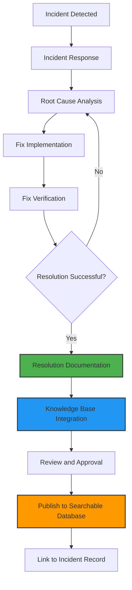
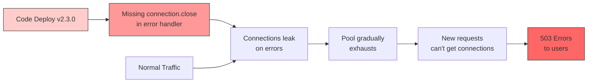
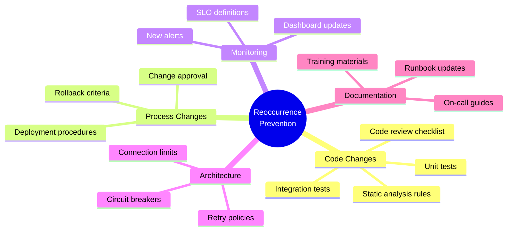
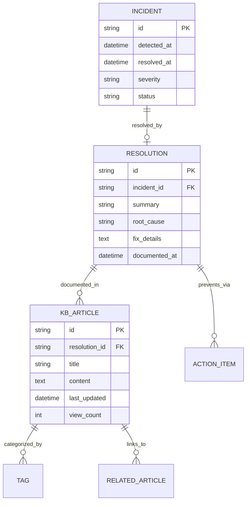

# How to Create Resolution Documentation

Author: [nawazdhandala](https://github.com/nawazdhandala)

Tags: Incident Management, Documentation, SRE, Knowledge Base

Description: Learn how to document incident resolutions for future reference.

When an incident strikes, your team springs into action, diagnoses the problem, and implements a fix. But what happens next is equally important: documenting that resolution so future incidents can be resolved faster. Resolution documentation is the bridge between solving a problem once and building institutional knowledge that benefits your entire organization.

This guide covers practical approaches to creating resolution documentation that is useful, searchable, and helps prevent incidents from recurring.

## Why Resolution Documentation Matters

Resolution documentation serves several critical purposes:

- **Faster Future Resolution**: When similar issues arise, teams can quickly find and apply proven solutions.
- **Knowledge Transfer**: New team members can learn from past incidents without relying on tribal knowledge.
- **Pattern Recognition**: Well-documented resolutions help identify systemic issues and recurring problems.
- **Compliance and Auditing**: Many industries require documented evidence of how incidents were resolved.
- **Reduced Mean Time to Resolution (MTTR)**: Direct access to working solutions dramatically cuts resolution time.

## Resolution Documentation Workflow

Before diving into the specifics, let's understand where resolution documentation fits in the incident management lifecycle.



## Resolution Summary Writing

The resolution summary is the first thing responders will read when they encounter a similar issue. It needs to be concise yet informative enough to determine if this documentation applies to their situation.

### Structure of an Effective Resolution Summary

A good resolution summary answers these questions in 2-3 sentences:

1. What was the symptom or error?
2. What was the root cause?
3. What fixed it?

### Example Resolution Summary Template

```yaml
# Resolution Summary Template
title: "Database Connection Pool Exhaustion"
symptom: "Application returning 503 errors with 'Connection pool exhausted' in logs"
root_cause: "Memory leak in connection handling causing connections to not be released"
resolution: "Applied connection timeout configuration and deployed memory leak fix in v2.3.1"
severity: "High"
services_affected:
  - api-gateway
  - user-service
  - payment-service
resolution_time: "45 minutes"
resolved_by: "platform-team"
date: "2026-01-30"
```

### Writing Tips for Resolution Summaries

**Be Specific About Symptoms**

Instead of writing:
> "Database was slow"

Write:
> "PostgreSQL queries exceeding 30s timeout, causing HTTP 504 errors on /api/users endpoint"

**Include Error Messages**

```markdown
## Symptom
Users unable to login. Error in application logs:
```
ERROR: SQLSTATE[HY000] [2002] Connection refused
```
```

**Quantify the Impact**

```markdown
## Impact
- 15% of login attempts failed over 2 hours
- Approximately 3,200 users affected
- $12,000 estimated revenue impact
```

## Root Cause Documentation

Root cause documentation goes deeper than the summary, explaining the chain of events that led to the incident. This section helps teams understand not just what broke, but why it broke.

### The Five Whys in Documentation

Document your root cause analysis using the Five Whys technique:

```markdown
## Root Cause Analysis

### The Five Whys

1. **Why did users see 503 errors?**
   - The API gateway couldn't connect to the user service.

2. **Why couldn't the API gateway connect?**
   - All database connection pool slots were exhausted.

3. **Why were connection pool slots exhausted?**
   - Connections were being created but not released properly.

4. **Why weren't connections being released?**
   - A code change in v2.3.0 removed the connection.close() call in the error handler.

5. **Why wasn't this caught in testing?**
   - Integration tests don't run long enough to exhaust the pool (100 connections).

### Root Cause Statement
A missing connection.close() call in the error handling path of user-service v2.3.0
caused database connections to leak, eventually exhausting the connection pool
after approximately 4 hours of normal traffic.
```

### Root Cause Diagram

Visual representations help future responders quickly understand the failure chain.



### Technical Root Cause Details

Include code snippets showing the problematic code and the fix:

```javascript
// BEFORE (Problematic Code)
async function getUserData(userId) {
  const connection = await pool.getConnection();
  try {
    const result = await connection.query('SELECT * FROM users WHERE id = ?', [userId]);
    connection.release();
    return result;
  } catch (error) {
    // BUG: Connection not released on error path
    logger.error('Database query failed:', error);
    throw error;
  }
}

// AFTER (Fixed Code)
async function getUserData(userId) {
  const connection = await pool.getConnection();
  try {
    const result = await connection.query('SELECT * FROM users WHERE id = ?', [userId]);
    return result;
  } catch (error) {
    logger.error('Database query failed:', error);
    throw error;
  } finally {
    // FIX: Always release connection, regardless of success or failure
    connection.release();
  }
}
```

## Fix Verification Steps

Documentation must include how to verify that the fix actually works. This prevents teams from closing incidents prematurely and helps validate fixes in similar future situations.

### Verification Checklist Template

```markdown
## Fix Verification Checklist

### Immediate Verification (During Incident)
- [ ] Error rate returned to baseline (<0.1%)
- [ ] Connection pool utilization dropped below 50%
- [ ] No new error logs matching the incident pattern
- [ ] Synthetic monitors passing (login flow, checkout flow)

### Extended Verification (24-48 Hours)
- [ ] Connection pool stable over 24 hours
- [ ] Memory usage on user-service pods stable
- [ ] No customer complaints related to login failures
- [ ] SLA metrics recovered to target levels

### Load Test Verification
- [ ] Simulated error conditions don't exhaust pool
- [ ] System handles 2x normal traffic without pool exhaustion
```

### Automated Verification Scripts

Include scripts that can be reused to verify similar fixes:

```bash
#!/bin/bash
# verify-connection-pool.sh
# Verifies database connection pool health

SERVICE_NAME=${1:-"user-service"}
THRESHOLD=${2:-80}

echo "Checking connection pool for $SERVICE_NAME..."

# Get current pool utilization via metrics endpoint
POOL_USAGE=$(curl -s "http://$SERVICE_NAME:9090/metrics" | \
  grep 'db_pool_connections_active' | \
  awk '{print $2}')

POOL_MAX=$(curl -s "http://$SERVICE_NAME:9090/metrics" | \
  grep 'db_pool_connections_max' | \
  awk '{print $2}')

UTILIZATION=$(echo "scale=2; ($POOL_USAGE / $POOL_MAX) * 100" | bc)

echo "Pool utilization: $UTILIZATION% ($POOL_USAGE / $POOL_MAX connections)"

if (( $(echo "$UTILIZATION > $THRESHOLD" | bc -l) )); then
  echo "WARNING: Pool utilization above threshold ($THRESHOLD%)"
  exit 1
else
  echo "OK: Pool utilization within acceptable range"
  exit 0
fi
```

### Verification Metrics Dashboard

Document which metrics to monitor for verification:

```yaml
# Datadog/Grafana Query Examples for Verification

connection_pool_health:
  query: "avg:postgresql.connections.active{service:user-service} / avg:postgresql.connections.max{service:user-service} * 100"
  threshold: "< 80%"
  alert_if: "> 90% for 5 minutes"

error_rate:
  query: "sum:http.requests.errors{service:user-service}.as_rate() / sum:http.requests.total{service:user-service}.as_rate() * 100"
  threshold: "< 0.1%"
  alert_if: "> 1% for 2 minutes"

response_time_p99:
  query: "p99:http.request.duration{service:user-service}"
  threshold: "< 500ms"
  alert_if: "> 2000ms for 3 minutes"
```

## Reoccurrence Prevention

Prevention documentation ensures the same issue doesn't happen again. This section outlines systemic changes beyond the immediate fix.

### Prevention Categories



### Prevention Action Items Template

```markdown
## Prevention Action Items

### Immediate (This Sprint)
| Action | Owner | Due Date | Status |
|--------|-------|----------|--------|
| Add connection leak detection to CI pipeline | @devops | 2026-02-05 | In Progress |
| Create alert for pool utilization > 80% | @sre-team | 2026-02-03 | Done |
| Update code review checklist with resource cleanup | @tech-lead | 2026-02-07 | Pending |

### Short-term (This Quarter)
| Action | Owner | Due Date | Status |
|--------|-------|----------|--------|
| Implement connection pool metrics dashboard | @platform | 2026-03-15 | Planned |
| Add chaos testing for connection exhaustion | @qa | 2026-03-30 | Planned |
| Document connection handling best practices | @docs | 2026-02-28 | Planned |

### Long-term (Roadmap)
| Action | Owner | Target | Status |
|--------|-------|--------|--------|
| Migrate to connection-pooling middleware | @architecture | Q3 2026 | Proposed |
| Implement automatic pool scaling | @platform | Q4 2026 | Under Review |
```

### Testing for Prevention

```python
# test_connection_handling.py
# Tests to prevent connection leak regression

import pytest
from unittest.mock import Mock, patch
from user_service.database import get_user_data

class TestConnectionHandling:
    """Tests ensuring proper connection lifecycle management."""

    def test_connection_released_on_success(self, mock_pool):
        """Verify connection is released after successful query."""
        mock_connection = Mock()
        mock_pool.getConnection.return_value = mock_connection

        get_user_data("user-123")

        mock_connection.release.assert_called_once()

    def test_connection_released_on_error(self, mock_pool):
        """Verify connection is released even when query fails."""
        mock_connection = Mock()
        mock_connection.query.side_effect = Exception("DB Error")
        mock_pool.getConnection.return_value = mock_connection

        with pytest.raises(Exception):
            get_user_data("user-123")

        # CRITICAL: Connection must be released on error path
        mock_connection.release.assert_called_once()

    def test_connection_released_on_timeout(self, mock_pool):
        """Verify connection is released on query timeout."""
        mock_connection = Mock()
        mock_connection.query.side_effect = TimeoutError("Query timeout")
        mock_pool.getConnection.return_value = mock_connection

        with pytest.raises(TimeoutError):
            get_user_data("user-123")

        mock_connection.release.assert_called_once()
```

## Knowledge Base Integration

Resolution documentation is only valuable if teams can find it. Integration with your knowledge base ensures discoverability.

### Knowledge Base Entry Structure

```markdown
# KB-2026-0130: Database Connection Pool Exhaustion

## Quick Reference
- **Symptoms**: 503 errors, "Connection pool exhausted" in logs
- **Services**: user-service, api-gateway, payment-service
- **Resolution Time**: 45 minutes (typical)
- **Last Updated**: 2026-01-30

## Related Articles
- [KB-2025-0892: PostgreSQL Connection Tuning](/kb/2025-0892)
- [KB-2025-0756: Implementing Connection Timeouts](/kb/2025-0756)
- [Runbook: Database Connectivity Issues](/runbooks/db-connectivity)

## Tags
`database` `connection-pool` `503-error` `postgresql` `memory-leak`

## See Also
- Incident INC-2026-0130
- Post-mortem PM-2026-0130
- Jira PLAT-4521
```

### Automated Knowledge Base Sync

```yaml
# .github/workflows/sync-resolution-docs.yml
name: Sync Resolution Documentation to Knowledge Base

on:
  push:
    paths:
      - 'incident-resolutions/**/*.md'

jobs:
  sync-to-kb:
    runs-on: ubuntu-latest
    steps:
      - uses: actions/checkout@v4

      - name: Parse Resolution Document
        id: parse
        run: |
          # Extract metadata from resolution document
          TITLE=$(grep -m1 "^# " ${{ github.event.head_commit.modified[0] }} | sed 's/# //')
          TAGS=$(grep -m1 "^Tags:" ${{ github.event.head_commit.modified[0] }} | sed 's/Tags: //')
          echo "title=$TITLE" >> $GITHUB_OUTPUT
          echo "tags=$TAGS" >> $GITHUB_OUTPUT

      - name: Create Knowledge Base Entry
        uses: company/kb-sync-action@v2
        with:
          title: ${{ steps.parse.outputs.title }}
          content-file: ${{ github.event.head_commit.modified[0] }}
          tags: ${{ steps.parse.outputs.tags }}
          category: "Incident Resolutions"
          api-token: ${{ secrets.KB_API_TOKEN }}
```

### Linking Incidents to Resolutions



## Searchable Resolution Database

The value of resolution documentation multiplies when it is easily searchable. Here's how to structure your database for optimal discoverability.

### Search Index Design

```typescript
// resolution-search-index.ts
// Elasticsearch mapping for resolution documents

interface ResolutionDocument {
  id: string;
  title: string;
  summary: string;
  symptoms: string[];
  errorMessages: string[];
  rootCause: string;
  fixSteps: string[];
  services: string[];
  tags: string[];
  severity: 'low' | 'medium' | 'high' | 'critical';
  resolvedAt: Date;
  resolvedBy: string;
  mttr: number; // minutes
  relatedIncidents: string[];
}

const resolutionMapping = {
  mappings: {
    properties: {
      title: {
        type: 'text',
        analyzer: 'english',
        boost: 2.0
      },
      summary: {
        type: 'text',
        analyzer: 'english'
      },
      symptoms: {
        type: 'text',
        analyzer: 'english',
        boost: 1.5
      },
      errorMessages: {
        type: 'text',
        analyzer: 'keyword_lowercase',
        boost: 3.0  // Exact error matches are highly valuable
      },
      rootCause: {
        type: 'text',
        analyzer: 'english'
      },
      services: {
        type: 'keyword'
      },
      tags: {
        type: 'keyword'
      },
      severity: {
        type: 'keyword'
      },
      resolvedAt: {
        type: 'date'
      },
      mttr: {
        type: 'integer'
      }
    }
  }
};
```

### Search Query Examples

```python
# resolution_search.py
# Search functions for finding relevant resolutions

from elasticsearch import Elasticsearch
from typing import List, Optional

class ResolutionSearch:
    def __init__(self, es_client: Elasticsearch):
        self.es = es_client
        self.index = "incident-resolutions"

    def search_by_error_message(self, error_message: str, limit: int = 5) -> List[dict]:
        """Find resolutions matching a specific error message."""
        query = {
            "query": {
                "bool": {
                    "should": [
                        {
                            "match_phrase": {
                                "errorMessages": {
                                    "query": error_message,
                                    "boost": 3.0
                                }
                            }
                        },
                        {
                            "match": {
                                "symptoms": {
                                    "query": error_message,
                                    "boost": 1.5
                                }
                            }
                        },
                        {
                            "match": {
                                "summary": error_message
                            }
                        }
                    ]
                }
            },
            "size": limit
        }

        results = self.es.search(index=self.index, body=query)
        return [hit["_source"] for hit in results["hits"]["hits"]]

    def search_by_service(
        self,
        service: str,
        severity: Optional[str] = None
    ) -> List[dict]:
        """Find resolutions for a specific service."""
        must_clauses = [
            {"term": {"services": service}}
        ]

        if severity:
            must_clauses.append({"term": {"severity": severity}})

        query = {
            "query": {
                "bool": {
                    "must": must_clauses
                }
            },
            "sort": [
                {"resolvedAt": {"order": "desc"}}
            ]
        }

        results = self.es.search(index=self.index, body=query)
        return [hit["_source"] for hit in results["hits"]["hits"]]

    def find_similar_resolutions(self, incident_description: str) -> List[dict]:
        """Use ML-based similarity to find related resolutions."""
        query = {
            "query": {
                "more_like_this": {
                    "fields": ["summary", "symptoms", "rootCause"],
                    "like": incident_description,
                    "min_term_freq": 1,
                    "max_query_terms": 25
                }
            }
        }

        results = self.es.search(index=self.index, body=query)
        return [hit["_source"] for hit in results["hits"]["hits"]]


# Usage example
if __name__ == "__main__":
    es = Elasticsearch(["http://localhost:9200"])
    search = ResolutionSearch(es)

    # Search by error message from logs
    results = search.search_by_error_message(
        "SQLSTATE[HY000] [2002] Connection refused"
    )

    for result in results:
        print(f"Found: {result['title']}")
        print(f"  Resolution: {result['summary']}")
        print(f"  MTTR: {result['mttr']} minutes")
```

### CLI Tool for Quick Resolution Lookup

```bash
#!/bin/bash
# resolve-search - Quick resolution lookup from command line

SEARCH_API="https://internal.company.com/api/resolutions/search"

function search_resolutions() {
    local query="$1"
    local service="$2"

    curl -s "${SEARCH_API}" \
        -H "Content-Type: application/json" \
        -d "{\"query\": \"$query\", \"service\": \"$service\"}" | \
    jq -r '.results[] | "[\(.severity)] \(.title)\n  Resolution: \(.summary)\n  KB: \(.kbUrl)\n"'
}

function search_by_error() {
    local error_log="$1"

    # Extract key error patterns
    local error_pattern=$(echo "$error_log" | grep -oE '[A-Z_]+Error|Exception|SQLSTATE\[[^\]]+\]' | head -1)

    echo "Searching for resolutions matching: $error_pattern"
    search_resolutions "$error_pattern" ""
}

# Main
case "$1" in
    -e|--error)
        search_by_error "$2"
        ;;
    -s|--service)
        search_resolutions "" "$2"
        ;;
    -q|--query)
        search_resolutions "$2" ""
        ;;
    *)
        echo "Usage: resolve-search [-e error_log] [-s service_name] [-q query]"
        exit 1
        ;;
esac
```

## Complete Resolution Document Template

Here's a comprehensive template you can use for your resolution documentation:

```markdown
# Resolution: [Brief Title]

## Metadata
- **Incident ID**: INC-YYYY-XXXX
- **Date Resolved**: YYYY-MM-DD
- **Severity**: [Critical/High/Medium/Low]
- **Services Affected**: [service-1, service-2]
- **Resolution Time**: XX minutes
- **Resolved By**: [team/person]

## Summary
[2-3 sentence summary covering symptom, root cause, and fix]

## Symptoms
- [Symptom 1 - be specific]
- [Symptom 2]
- Error messages observed:
  ```
  [Exact error message from logs]
  ```

## Root Cause
### Analysis
[Detailed explanation of what caused the incident]

### Contributing Factors
- [Factor 1]
- [Factor 2]

## Resolution Steps
1. [Step 1 - what was done]
2. [Step 2]
3. [Step 3]

### Code Changes
```[language]
// Before
[problematic code]

// After
[fixed code]
```

### Configuration Changes
```yaml
# [config file name]
[relevant configuration]
```

## Verification
### Immediate Checks
- [ ] [Check 1]
- [ ] [Check 2]

### Monitoring Queries
```
[Query to verify fix]
```

## Prevention
### Action Items
| Action | Owner | Due | Status |
|--------|-------|-----|--------|
| [Action 1] | @owner | YYYY-MM-DD | [Status] |

### Tests Added
- [Test 1 description]
- [Test 2 description]

## Related Documentation
- [Link to runbook]
- [Link to architecture doc]
- [Link to similar incidents]

## Tags
`tag1` `tag2` `tag3`
```

## Conclusion

Resolution documentation transforms individual incident responses into organizational learning. By investing time in thorough documentation immediately after resolving incidents, you build a knowledge base that reduces future incident resolution times, enables faster onboarding, and helps identify systemic issues before they become critical.

The key principles to remember:

1. **Document while details are fresh** - Write resolution docs within 24-48 hours of resolution
2. **Be specific about symptoms and errors** - Include exact error messages and metrics
3. **Explain the why, not just the what** - Root cause understanding prevents recurrence
4. **Make it searchable** - Use consistent tagging and structure
5. **Link everything** - Connect resolutions to incidents, postmortems, and knowledge bases
6. **Include verification steps** - Help future responders confirm their fix works
7. **Track prevention actions** - Close the loop on systemic improvements

Start with a simple template and evolve it as your team's needs grow. The best resolution documentation is the one your team actually uses.
