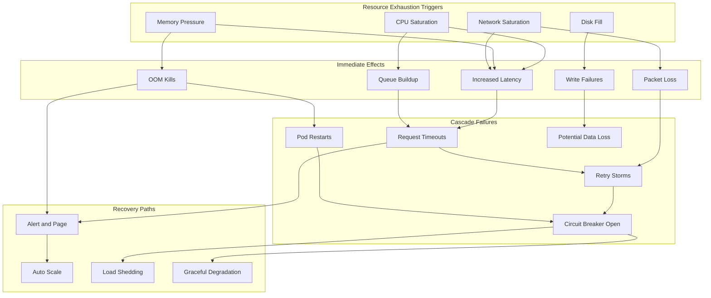

# How to Create Resource Exhaustion Testing

Author: [nawazdhandala](https://github.com/nawazdhandala)

Tags: Testing, ChaosEngineering, Resources, Capacity

Description: A practical guide to stress testing your systems by deliberately exhausting CPU, memory, disk, and network resources to validate capacity limits and recovery behavior.

---

## Why Resource Exhaustion Testing Matters

Production systems fail in predictable ways when resources run out. CPU saturation causes request timeouts. Memory exhaustion triggers OOM kills. Disk fills cause write failures. Network saturation drops packets.

The question is not whether these will happen, but when. Resource exhaustion testing lets you discover breaking points, validate alerts, and verify recovery behavior before your users do.

This guide covers practical techniques for exhausting each resource type, observing system behavior under pressure, and building confidence in your capacity planning.

---

## How Resource Pressure Propagates

When one resource becomes constrained, the effects cascade through your system. Understanding this flow helps you design better tests and interpret results.



---

## CPU Exhaustion Testing

CPU saturation is the most common resource constraint. When CPU is fully utilized, requests queue up and latency increases linearly with load.

### Using stress-ng for CPU Load

stress-ng is the standard tool for CPU stress testing. It provides fine-grained control over load intensity and duration.

```bash
#!/bin/bash
# cpu-stress-test.sh
# Generate CPU load to test system behavior under saturation

# Number of CPU workers (match your core count for 100% load)
CPU_WORKERS=4

# Duration of the stress test in seconds
DURATION=300

# Verify stress-ng is installed
if ! command -v stress-ng &> /dev/null; then
    echo "Installing stress-ng..."
    apt-get update && apt-get install -y stress-ng
fi

echo "Starting CPU stress test with $CPU_WORKERS workers for $DURATION seconds"
echo "Monitor with: top, htop, or kubectl top pods"

# Run CPU stress test
# --cpu spawns workers doing CPU-intensive operations
# --timeout sets test duration
# --metrics-brief shows summary at end
stress-ng --cpu $CPU_WORKERS \
          --timeout ${DURATION}s \
          --metrics-brief

echo "CPU stress test complete"
```

### Kubernetes CPU Stress Pod

For containerized environments, deploy a stress pod with resource limits to test how Kubernetes handles CPU contention.

```yaml
# cpu-stress-pod.yaml
# Deploy this pod to stress test CPU in your cluster
apiVersion: v1
kind: Pod
metadata:
  name: cpu-stress-test
  labels:
    app: stress-test
    resource: cpu
spec:
  containers:
  - name: stress
    image: polinux/stress-ng:latest
    # Request more CPU than available to test throttling
    resources:
      requests:
        cpu: "2000m"      # Request 2 full cores
        memory: "256Mi"
      limits:
        cpu: "4000m"      # Allow burst to 4 cores
        memory: "512Mi"
    command:
    - "/usr/bin/stress-ng"
    args:
    - "--cpu"
    - "4"                 # 4 CPU workers
    - "--cpu-load"
    - "90"                # Target 90% CPU utilization
    - "--timeout"
    - "600s"              # Run for 10 minutes
    - "--metrics-brief"
  restartPolicy: Never
  # Schedule on specific node for controlled testing
  # nodeSelector:
  #   stress-test: "true"
```

### What to Observe During CPU Tests

Monitor these metrics during CPU exhaustion:

```bash
#!/bin/bash
# monitor-cpu-stress.sh
# Collect metrics during CPU stress test

# Start monitoring in background
echo "Starting metric collection..."

# Collect CPU metrics every 5 seconds
while true; do
    TIMESTAMP=$(date +%Y-%m-%dT%H:%M:%S)

    # System load average (1, 5, 15 minute)
    LOAD=$(cat /proc/loadavg | awk '{print $1, $2, $3}')

    # CPU utilization per core
    CPU_UTIL=$(mpstat -P ALL 1 1 | tail -n +4 | head -n -1)

    # Process queue length
    PROCS_RUNNING=$(cat /proc/stat | grep procs_running | awk '{print $2}')
    PROCS_BLOCKED=$(cat /proc/stat | grep procs_blocked | awk '{print $2}')

    echo "$TIMESTAMP load=$LOAD running=$PROCS_RUNNING blocked=$PROCS_BLOCKED"

    sleep 5
done
```

Key metrics to watch:
- Load average exceeding CPU count indicates saturation
- Process run queue length shows waiting work
- Context switch rate indicates scheduling overhead
- Application request latency percentiles (p50, p95, p99)

---

## Memory Exhaustion Testing

Memory pressure testing validates OOM killer behavior, swap performance, and application memory limits. Unlike CPU, memory exhaustion often causes sudden failures rather than gradual degradation.

### Controlled Memory Allocation

```python
#!/usr/bin/env python3
"""
memory_stress.py
Gradually allocate memory to test system behavior under memory pressure.
Allows controlled ramp-up to observe thresholds and alert triggers.
"""

import time
import sys
import argparse
import os

def get_memory_info():
    """Read current memory usage from /proc/meminfo"""
    meminfo = {}
    with open('/proc/meminfo', 'r') as f:
        for line in f:
            parts = line.split()
            key = parts[0].rstrip(':')
            value = int(parts[1]) * 1024  # Convert KB to bytes
            meminfo[key] = value
    return meminfo

def allocate_memory(target_mb, chunk_mb=100, delay_seconds=5):
    """
    Allocate memory in chunks to target size.

    Args:
        target_mb: Total memory to allocate in megabytes
        chunk_mb: Size of each allocation chunk
        delay_seconds: Pause between allocations for observation
    """
    allocated_chunks = []
    total_allocated = 0
    chunk_size = chunk_mb * 1024 * 1024  # Convert to bytes

    print(f"Target allocation: {target_mb} MB")
    print(f"Chunk size: {chunk_mb} MB")
    print(f"Delay between chunks: {delay_seconds} seconds")
    print("-" * 50)

    try:
        while total_allocated < target_mb * 1024 * 1024:
            # Allocate a chunk of memory
            # Using bytearray ensures memory is actually committed
            chunk = bytearray(chunk_size)

            # Touch all pages to ensure allocation
            for i in range(0, len(chunk), 4096):
                chunk[i] = 1

            allocated_chunks.append(chunk)
            total_allocated += chunk_size

            # Report current state
            meminfo = get_memory_info()
            available_mb = meminfo.get('MemAvailable', 0) / (1024 * 1024)

            print(f"Allocated: {total_allocated / (1024*1024):.0f} MB | "
                  f"System available: {available_mb:.0f} MB | "
                  f"PID: {os.getpid()}")

            # Pause to allow observation and alerting systems to react
            time.sleep(delay_seconds)

    except MemoryError:
        print(f"\nMemoryError hit at {total_allocated / (1024*1024):.0f} MB")
        print("System memory limit reached")
    except KeyboardInterrupt:
        print(f"\nInterrupted. Holding {total_allocated / (1024*1024):.0f} MB")

    # Hold memory for observation
    print("\nHolding allocated memory. Press Ctrl+C to release and exit.")
    try:
        while True:
            time.sleep(10)
    except KeyboardInterrupt:
        print("\nReleasing memory and exiting.")

if __name__ == "__main__":
    parser = argparse.ArgumentParser(
        description="Controlled memory allocation for stress testing"
    )
    parser.add_argument(
        "--target-mb",
        type=int,
        default=1024,
        help="Target memory to allocate in MB (default: 1024)"
    )
    parser.add_argument(
        "--chunk-mb",
        type=int,
        default=100,
        help="Allocation chunk size in MB (default: 100)"
    )
    parser.add_argument(
        "--delay",
        type=int,
        default=5,
        help="Delay between chunks in seconds (default: 5)"
    )

    args = parser.parse_args()
    allocate_memory(args.target_mb, args.chunk_mb, args.delay)
```

### Kubernetes Memory Pressure Pod

```yaml
# memory-stress-pod.yaml
# Test container memory limits and OOM behavior
apiVersion: v1
kind: Pod
metadata:
  name: memory-stress-test
  labels:
    app: stress-test
    resource: memory
spec:
  containers:
  - name: stress
    image: polinux/stress-ng:latest
    resources:
      requests:
        memory: "512Mi"
        cpu: "100m"
      limits:
        # Set limit below what the test will try to allocate
        # to trigger OOM kill and test recovery
        memory: "1Gi"
        cpu: "500m"
    command:
    - "/usr/bin/stress-ng"
    args:
    - "--vm"
    - "2"                 # 2 memory workers
    - "--vm-bytes"
    - "80%"               # Try to allocate 80% of available memory
    - "--vm-hang"
    - "60"                # Hold allocation for 60 seconds
    - "--timeout"
    - "300s"
    - "--metrics-brief"
  restartPolicy: Never
```

### Observing Memory Behavior

```bash
#!/bin/bash
# monitor-memory.sh
# Track memory metrics during stress test

echo "Timestamp,MemTotal,MemFree,MemAvailable,Buffers,Cached,SwapUsed"

while true; do
    TIMESTAMP=$(date +%Y-%m-%dT%H:%M:%S)

    # Parse /proc/meminfo for key metrics
    MEM_TOTAL=$(grep MemTotal /proc/meminfo | awk '{print $2}')
    MEM_FREE=$(grep "MemFree:" /proc/meminfo | awk '{print $2}')
    MEM_AVAIL=$(grep MemAvailable /proc/meminfo | awk '{print $2}')
    BUFFERS=$(grep "Buffers:" /proc/meminfo | awk '{print $2}')
    CACHED=$(grep "^Cached:" /proc/meminfo | awk '{print $2}')
    SWAP_USED=$(grep SwapTotal /proc/meminfo | awk '{print $2}')

    echo "$TIMESTAMP,$MEM_TOTAL,$MEM_FREE,$MEM_AVAIL,$BUFFERS,$CACHED,$SWAP_USED"

    # Check for memory pressure indicators
    if [ "$MEM_AVAIL" -lt 102400 ]; then  # Less than 100MB available
        echo "WARNING: Memory critically low at $TIMESTAMP"
    fi

    sleep 5
done
```

---

## Disk Exhaustion Testing

Disk exhaustion tests validate filesystem behavior, application error handling, and cleanup automation. Full disks cause cascading failures in logging, databases, and temporary file operations.

### Controlled Disk Fill Script

```bash
#!/bin/bash
# disk-fill-test.sh
# Fill disk to specified percentage to test behavior at capacity

set -e

# Configuration
TARGET_PATH="${1:-/tmp/stress-test}"
TARGET_PERCENT="${2:-90}"
CHUNK_SIZE_MB=100

# Create test directory
mkdir -p "$TARGET_PATH"

# Get filesystem info
DF_OUTPUT=$(df -BM "$TARGET_PATH" | tail -1)
TOTAL_MB=$(echo "$DF_OUTPUT" | awk '{print $2}' | tr -d 'M')
USED_MB=$(echo "$DF_OUTPUT" | awk '{print $3}' | tr -d 'M')
AVAIL_MB=$(echo "$DF_OUTPUT" | awk '{print $4}' | tr -d 'M')
CURRENT_PERCENT=$(echo "$DF_OUTPUT" | awk '{print $5}' | tr -d '%')

echo "Filesystem: $(echo "$DF_OUTPUT" | awk '{print $1}')"
echo "Total: ${TOTAL_MB}MB | Used: ${USED_MB}MB | Available: ${AVAIL_MB}MB"
echo "Current usage: ${CURRENT_PERCENT}% | Target: ${TARGET_PERCENT}%"
echo "---------------------------------------------------------"

# Calculate how much to write
TARGET_USED_MB=$((TOTAL_MB * TARGET_PERCENT / 100))
TO_WRITE_MB=$((TARGET_USED_MB - USED_MB))

if [ "$TO_WRITE_MB" -le 0 ]; then
    echo "Already at or above target percentage. Exiting."
    exit 0
fi

echo "Will write approximately ${TO_WRITE_MB}MB to reach ${TARGET_PERCENT}%"
echo "Press Ctrl+C to abort, or wait 5 seconds to continue..."
sleep 5

# Write files in chunks
FILE_COUNT=0
WRITTEN_MB=0

while [ "$WRITTEN_MB" -lt "$TO_WRITE_MB" ]; do
    FILE_NAME="${TARGET_PATH}/stress_file_${FILE_COUNT}.dat"

    # Write a chunk using dd with direct I/O to bypass cache
    dd if=/dev/zero of="$FILE_NAME" bs=1M count=$CHUNK_SIZE_MB \
       conv=fdatasync status=none 2>/dev/null || {
        echo "Write failed at ${WRITTEN_MB}MB. Disk likely full."
        break
    }

    WRITTEN_MB=$((WRITTEN_MB + CHUNK_SIZE_MB))
    FILE_COUNT=$((FILE_COUNT + 1))

    # Report progress
    CURRENT_USAGE=$(df -BM "$TARGET_PATH" | tail -1 | awk '{print $5}')
    echo "Written: ${WRITTEN_MB}MB | Files: ${FILE_COUNT} | Usage: ${CURRENT_USAGE}"

    # Safety check
    if [ "$(df "$TARGET_PATH" | tail -1 | awk '{print $5}' | tr -d '%')" -ge 98 ]; then
        echo "Safety stop: Reached 98% disk usage"
        break
    fi
done

echo "---------------------------------------------------------"
echo "Disk fill complete. Test files in: $TARGET_PATH"
echo "Final usage: $(df -h "$TARGET_PATH" | tail -1 | awk '{print $5}')"
echo ""
echo "To clean up: rm -rf $TARGET_PATH"
```

### Kubernetes Persistent Volume Stress

```yaml
# disk-stress-job.yaml
# Fill a PersistentVolume to test storage alerts and application behavior
apiVersion: batch/v1
kind: Job
metadata:
  name: disk-stress-test
  labels:
    app: stress-test
    resource: disk
spec:
  backoffLimit: 0
  template:
    spec:
      containers:
      - name: disk-stress
        image: ubuntu:22.04
        command:
        - "/bin/bash"
        - "-c"
        - |
          # Install tools
          apt-get update && apt-get install -y coreutils

          TARGET_DIR="/data/stress"
          mkdir -p $TARGET_DIR

          echo "Starting disk fill test..."

          # Write 100MB chunks until 90% full or error
          COUNT=0
          while true; do
            FILE="$TARGET_DIR/chunk_${COUNT}.dat"

            # Check current usage
            USAGE=$(df /data | tail -1 | awk '{print $5}' | tr -d '%')
            echo "Current usage: ${USAGE}%"

            if [ "$USAGE" -ge 90 ]; then
              echo "Reached 90% usage. Stopping."
              break
            fi

            # Write 100MB chunk
            dd if=/dev/zero of="$FILE" bs=1M count=100 conv=fdatasync 2>/dev/null

            if [ $? -ne 0 ]; then
              echo "Write failed. Disk full."
              break
            fi

            COUNT=$((COUNT + 1))
            sleep 2
          done

          echo "Final disk usage:"
          df -h /data

          # Hold for observation
          echo "Holding state for 5 minutes..."
          sleep 300

          # Cleanup
          echo "Cleaning up test files..."
          rm -rf $TARGET_DIR
          echo "Done."
        volumeMounts:
        - name: test-volume
          mountPath: /data
        resources:
          limits:
            cpu: "500m"
            memory: "256Mi"
      volumes:
      - name: test-volume
        persistentVolumeClaim:
          claimName: stress-test-pvc
      restartPolicy: Never
---
# PVC for disk stress test
apiVersion: v1
kind: PersistentVolumeClaim
metadata:
  name: stress-test-pvc
spec:
  accessModes:
    - ReadWriteOnce
  resources:
    requests:
      storage: 10Gi
  # Specify storage class for your environment
  # storageClassName: standard
```

---

## Network Exhaustion Testing

Network saturation tests reveal timeout configurations, retry behavior, and connection pool limits. Network issues often manifest as latency increases before complete failure.

### Bandwidth Saturation with iperf3

```bash
#!/bin/bash
# network-stress-test.sh
# Saturate network bandwidth to test application behavior

# Configuration
SERVER_IP="${1:-localhost}"
DURATION="${2:-60}"
PARALLEL="${3:-10}"

echo "Network Stress Test Configuration:"
echo "  Target Server: $SERVER_IP"
echo "  Duration: ${DURATION}s"
echo "  Parallel Streams: $PARALLEL"
echo "-----------------------------------------"

# Verify iperf3 is available
if ! command -v iperf3 &> /dev/null; then
    echo "Installing iperf3..."
    apt-get update && apt-get install -y iperf3
fi

# Start iperf3 server if testing locally
if [ "$SERVER_IP" = "localhost" ]; then
    echo "Starting local iperf3 server..."
    iperf3 -s -D  # Run server in daemon mode
    sleep 2
fi

echo "Starting bandwidth saturation test..."

# Run bidirectional test with multiple streams
# This generates maximum network load
iperf3 -c "$SERVER_IP" \
       -t "$DURATION" \
       -P "$PARALLEL" \
       --bidir \
       -J > /tmp/iperf_results.json

# Parse and display results
echo ""
echo "Test Results:"
echo "-----------------------------------------"

# Extract key metrics from JSON output
python3 << 'EOF'
import json
import sys

try:
    with open('/tmp/iperf_results.json', 'r') as f:
        data = json.load(f)

    # Get summary data
    end = data.get('end', {})

    # Sender stats
    sent = end.get('sum_sent', {})
    print(f"Sent: {sent.get('bits_per_second', 0) / 1e9:.2f} Gbps")
    print(f"  Bytes: {sent.get('bytes', 0) / 1e9:.2f} GB")
    print(f"  Retransmits: {sent.get('retransmits', 'N/A')}")

    # Receiver stats
    recv = end.get('sum_received', {})
    print(f"Received: {recv.get('bits_per_second', 0) / 1e9:.2f} Gbps")
    print(f"  Bytes: {recv.get('bytes', 0) / 1e9:.2f} GB")

except Exception as e:
    print(f"Error parsing results: {e}")
    sys.exit(1)
EOF

# Cleanup server if we started it
if [ "$SERVER_IP" = "localhost" ]; then
    pkill iperf3 || true
fi
```

### Connection Exhaustion Test

```python
#!/usr/bin/env python3
"""
connection_exhaust.py
Open many TCP connections to test connection limits and pool behavior.
"""

import socket
import time
import argparse
import threading
from concurrent.futures import ThreadPoolExecutor, as_completed

def open_connection(host, port, timeout=10):
    """Open a TCP connection and hold it open."""
    try:
        sock = socket.socket(socket.AF_INET, socket.SOCK_STREAM)
        sock.settimeout(timeout)
        sock.connect((host, port))
        return sock
    except Exception as e:
        return None

def connection_stress_test(host, port, max_connections, hold_seconds):
    """
    Open connections up to max_connections and hold them.

    Args:
        host: Target host
        port: Target port
        max_connections: Maximum connections to attempt
        hold_seconds: How long to hold connections open
    """
    connections = []
    failed = 0

    print(f"Opening connections to {host}:{port}")
    print(f"Target: {max_connections} connections")
    print("-" * 50)

    start_time = time.time()

    # Open connections with progress reporting
    for i in range(max_connections):
        sock = open_connection(host, port)

        if sock:
            connections.append(sock)
        else:
            failed += 1

        # Progress update every 100 connections
        if (i + 1) % 100 == 0:
            elapsed = time.time() - start_time
            rate = (i + 1) / elapsed
            print(f"Opened: {len(connections)} | Failed: {failed} | "
                  f"Rate: {rate:.0f}/sec")

        # Small delay to avoid overwhelming the network stack
        if (i + 1) % 50 == 0:
            time.sleep(0.01)

    print("-" * 50)
    print(f"Final: {len(connections)} open | {failed} failed")
    print(f"Holding connections for {hold_seconds} seconds...")

    # Hold connections and monitor
    try:
        for remaining in range(hold_seconds, 0, -10):
            print(f"  {remaining} seconds remaining...")
            time.sleep(min(10, remaining))
    except KeyboardInterrupt:
        print("\nInterrupted.")

    # Close all connections
    print("Closing connections...")
    for sock in connections:
        try:
            sock.close()
        except:
            pass

    print("Done.")

if __name__ == "__main__":
    parser = argparse.ArgumentParser(
        description="TCP connection exhaustion test"
    )
    parser.add_argument("--host", default="localhost", help="Target host")
    parser.add_argument("--port", type=int, default=80, help="Target port")
    parser.add_argument(
        "--connections",
        type=int,
        default=1000,
        help="Number of connections to open"
    )
    parser.add_argument(
        "--hold",
        type=int,
        default=60,
        help="Seconds to hold connections"
    )

    args = parser.parse_args()
    connection_stress_test(args.host, args.port, args.connections, args.hold)
```

### Network Latency Injection with tc

```bash
#!/bin/bash
# inject-network-latency.sh
# Add artificial latency to network interface for testing

INTERFACE="${1:-eth0}"
LATENCY_MS="${2:-100}"
JITTER_MS="${3:-20}"
DURATION="${4:-60}"

echo "Network Latency Injection"
echo "  Interface: $INTERFACE"
echo "  Latency: ${LATENCY_MS}ms (+/- ${JITTER_MS}ms jitter)"
echo "  Duration: ${DURATION}s"
echo "-----------------------------------------"

# Check for root privileges
if [ "$EUID" -ne 0 ]; then
    echo "Error: This script requires root privileges"
    exit 1
fi

# Clear any existing rules
tc qdisc del dev "$INTERFACE" root 2>/dev/null || true

# Add latency with jitter and correlation
# The 25% correlation means latency values are somewhat consistent
tc qdisc add dev "$INTERFACE" root netem \
   delay ${LATENCY_MS}ms ${JITTER_MS}ms 25%

echo "Latency injection active. Current rules:"
tc qdisc show dev "$INTERFACE"

# Wait for specified duration
echo ""
echo "Running for ${DURATION} seconds. Press Ctrl+C to stop early."

cleanup() {
    echo ""
    echo "Removing latency rules..."
    tc qdisc del dev "$INTERFACE" root 2>/dev/null || true
    echo "Network restored to normal."
}

trap cleanup EXIT INT TERM

sleep "$DURATION"
```

---

## Stress Testing Tools Configuration

### stress-ng Comprehensive Configuration

```yaml
# stress-ng-config.yaml
# Configuration file for stress-ng (use with --yaml option)
# This exercises multiple resource types simultaneously

# Global settings
globals:
  timeout: 600s              # Total test duration
  metrics-brief: true        # Show summary at end
  times: true                # Show timing info
  verbose: true              # Detailed output

# CPU stress configuration
cpu:
  instances: 0               # 0 = match CPU count
  load: 80                   # Target 80% CPU utilization
  method: all                # Use all CPU stress methods

# Memory stress configuration
vm:
  instances: 2               # Number of memory workers
  bytes: 75%                 # Use 75% of available memory
  hang: 10                   # Hold allocation for 10 seconds
  madvise: normal            # Memory advice hint

# I/O stress configuration
io:
  instances: 4               # Number of I/O workers

hdd:
  instances: 2               # Disk I/O workers
  bytes: 1G                  # Write 1GB per worker
  write-size: 64K            # Write block size

# Network stress (loopback)
sock:
  instances: 4               # Socket workers

# File descriptor stress
open:
  instances: 2               # File open workers

# Process/thread stress
fork:
  instances: 2               # Fork workers
  max: 100                   # Max child processes
```

### Running stress-ng with Configuration

```bash
#!/bin/bash
# run-stress-ng.sh
# Execute comprehensive stress test using configuration file

CONFIG_FILE="${1:-stress-ng-config.yaml}"
LOG_DIR="/var/log/stress-tests"
TIMESTAMP=$(date +%Y%m%d_%H%M%S)

mkdir -p "$LOG_DIR"

echo "Starting comprehensive stress test"
echo "Configuration: $CONFIG_FILE"
echo "Log directory: $LOG_DIR"
echo "-----------------------------------------"

# Run stress-ng with YAML configuration
# Output metrics to JSON for analysis
stress-ng --yaml "$CONFIG_FILE" \
          --log-file "$LOG_DIR/stress_${TIMESTAMP}.log" \
          --metrics "$LOG_DIR/metrics_${TIMESTAMP}.json" \
          2>&1 | tee "$LOG_DIR/output_${TIMESTAMP}.txt"

echo "-----------------------------------------"
echo "Test complete. Logs saved to $LOG_DIR"
```

### Kubernetes LitmusChaos Resource Stress

```yaml
# litmus-resource-chaos.yaml
# LitmusChaos experiment for resource stress testing
apiVersion: litmuschaos.io/v1alpha1
kind: ChaosEngine
metadata:
  name: resource-stress-engine
  namespace: default
spec:
  appinfo:
    appns: default
    applabel: "app=target-application"
    appkind: deployment
  chaosServiceAccount: litmus-admin
  experiments:
  - name: pod-cpu-hog
    spec:
      components:
        env:
        # Number of CPU cores to stress
        - name: CPU_CORES
          value: "2"
        # Percentage load on each core
        - name: CPU_LOAD
          value: "80"
        # Duration of CPU stress
        - name: TOTAL_CHAOS_DURATION
          value: "300"
        # Chaos interval
        - name: RAMP_TIME
          value: "30"
  - name: pod-memory-hog
    spec:
      components:
        env:
        # Memory to consume in MB
        - name: MEMORY_CONSUMPTION
          value: "1000"
        # Duration of memory stress
        - name: TOTAL_CHAOS_DURATION
          value: "300"
        # Ramp time for gradual increase
        - name: RAMP_TIME
          value: "60"
```

---

## Recovery and Degradation Behavior

Testing is only valuable if you verify recovery. Document expected behavior for each resource exhaustion scenario.

### Recovery Behavior Matrix

| Resource | Exhaustion Signal | Expected Behavior | Recovery Action | Acceptable Time |
|----------|-------------------|-------------------|-----------------|-----------------|
| CPU | Load average > 2x cores | Latency increase, no errors | Auto-scale or load shed | < 5 minutes |
| Memory | Available < 10% | OOM kills lowest priority | Pod restart, scale up | < 2 minutes |
| Disk | Usage > 90% | Write failures, log loss | Alert, cleanup job | < 15 minutes |
| Network | Packet loss > 5% | Timeouts, retry storms | Circuit breaker open | < 30 seconds |

### Graceful Degradation Test Script

```python
#!/usr/bin/env python3
"""
degradation_test.py
Verify application degrades gracefully under resource pressure.
"""

import requests
import time
import statistics
import subprocess
import sys
from concurrent.futures import ThreadPoolExecutor

def measure_latency(url, timeout=30):
    """Measure response time for a single request."""
    try:
        start = time.time()
        response = requests.get(url, timeout=timeout)
        latency = (time.time() - start) * 1000  # Convert to ms
        return {
            "status": response.status_code,
            "latency_ms": latency,
            "error": None
        }
    except requests.exceptions.Timeout:
        return {"status": None, "latency_ms": None, "error": "timeout"}
    except requests.exceptions.RequestException as e:
        return {"status": None, "latency_ms": None, "error": str(e)}

def run_load_test(url, requests_per_second, duration_seconds):
    """
    Run continuous load test and collect metrics.

    Returns metrics summary for comparison before/during/after stress.
    """
    results = []
    interval = 1.0 / requests_per_second
    end_time = time.time() + duration_seconds

    print(f"Running load test: {requests_per_second} RPS for {duration_seconds}s")

    with ThreadPoolExecutor(max_workers=min(requests_per_second * 2, 50)) as executor:
        futures = []

        while time.time() < end_time:
            futures.append(executor.submit(measure_latency, url))
            time.sleep(interval)

        for future in futures:
            results.append(future.result())

    # Calculate metrics
    latencies = [r["latency_ms"] for r in results if r["latency_ms"] is not None]
    errors = [r for r in results if r["error"] is not None]

    if latencies:
        metrics = {
            "total_requests": len(results),
            "successful": len(latencies),
            "failed": len(errors),
            "error_rate": len(errors) / len(results) * 100,
            "latency_p50": statistics.median(latencies),
            "latency_p95": statistics.quantiles(latencies, n=20)[18] if len(latencies) > 20 else max(latencies),
            "latency_p99": statistics.quantiles(latencies, n=100)[98] if len(latencies) > 100 else max(latencies),
        }
    else:
        metrics = {
            "total_requests": len(results),
            "successful": 0,
            "failed": len(errors),
            "error_rate": 100,
            "latency_p50": None,
            "latency_p95": None,
            "latency_p99": None,
        }

    return metrics

def degradation_test(url, stress_command, baseline_rps=10, test_duration=30):
    """
    Test application behavior before, during, and after stress.

    Args:
        url: Endpoint to test
        stress_command: Shell command to induce resource stress
        baseline_rps: Requests per second for load test
        test_duration: Duration of each test phase
    """
    print("=" * 60)
    print("GRACEFUL DEGRADATION TEST")
    print("=" * 60)
    print(f"Target URL: {url}")
    print(f"Stress command: {stress_command}")
    print("")

    # Phase 1: Baseline measurement
    print("PHASE 1: Baseline (no stress)")
    print("-" * 40)
    baseline = run_load_test(url, baseline_rps, test_duration)
    print_metrics("Baseline", baseline)
    print("")

    # Phase 2: Start stress and measure
    print("PHASE 2: Under stress")
    print("-" * 40)
    print(f"Starting stress: {stress_command}")

    # Start stress in background
    stress_proc = subprocess.Popen(
        stress_command,
        shell=True,
        stdout=subprocess.DEVNULL,
        stderr=subprocess.DEVNULL
    )

    # Wait for stress to ramp up
    time.sleep(5)

    under_stress = run_load_test(url, baseline_rps, test_duration)
    print_metrics("Under stress", under_stress)
    print("")

    # Phase 3: Stop stress and measure recovery
    print("PHASE 3: Recovery (stress stopped)")
    print("-" * 40)
    stress_proc.terminate()
    stress_proc.wait(timeout=10)

    # Wait for recovery
    time.sleep(10)

    recovery = run_load_test(url, baseline_rps, test_duration)
    print_metrics("Recovery", recovery)
    print("")

    # Analysis
    print("=" * 60)
    print("ANALYSIS")
    print("=" * 60)

    # Check degradation was graceful
    if under_stress["error_rate"] < 50:
        print("[PASS] Error rate under stress < 50%")
    else:
        print(f"[FAIL] Error rate under stress: {under_stress['error_rate']:.1f}%")

    if baseline["latency_p50"] and under_stress["latency_p50"]:
        latency_increase = under_stress["latency_p50"] / baseline["latency_p50"]
        if latency_increase < 10:
            print(f"[PASS] Latency increase: {latency_increase:.1f}x (< 10x)")
        else:
            print(f"[FAIL] Latency increase: {latency_increase:.1f}x (>= 10x)")

    # Check recovery
    if recovery["error_rate"] < 5:
        print("[PASS] Recovery error rate < 5%")
    else:
        print(f"[FAIL] Recovery error rate: {recovery['error_rate']:.1f}%")

    if baseline["latency_p50"] and recovery["latency_p50"]:
        recovery_latency_ratio = recovery["latency_p50"] / baseline["latency_p50"]
        if recovery_latency_ratio < 1.5:
            print(f"[PASS] Recovery latency within 1.5x baseline")
        else:
            print(f"[FAIL] Recovery latency: {recovery_latency_ratio:.1f}x baseline")

def print_metrics(phase, metrics):
    """Print metrics in readable format."""
    print(f"  Requests: {metrics['total_requests']} "
          f"(success: {metrics['successful']}, failed: {metrics['failed']})")
    print(f"  Error rate: {metrics['error_rate']:.1f}%")
    if metrics["latency_p50"]:
        print(f"  Latency P50: {metrics['latency_p50']:.0f}ms")
        print(f"  Latency P95: {metrics['latency_p95']:.0f}ms")
        print(f"  Latency P99: {metrics['latency_p99']:.0f}ms")

if __name__ == "__main__":
    # Example usage
    TARGET_URL = sys.argv[1] if len(sys.argv) > 1 else "http://localhost:8080/health"
    STRESS_CMD = "stress-ng --cpu 4 --timeout 60s"

    degradation_test(TARGET_URL, STRESS_CMD)
```

---

## Integrating with Observability

Resource exhaustion tests should trigger your monitoring and alerting systems. Verify alerts fire at expected thresholds.

### Alert Verification Checklist

```yaml
# alert-verification.yaml
# Checklist for verifying alerts during resource exhaustion tests

cpu_exhaustion:
  test_command: "stress-ng --cpu 4 --timeout 300s"
  expected_alerts:
    - name: "HighCPUUtilization"
      threshold: "> 80% for 5m"
      expected_fire_time: "< 6 minutes"
      verified: false
    - name: "HighLoadAverage"
      threshold: "> 2x CPU count for 5m"
      expected_fire_time: "< 6 minutes"
      verified: false

memory_exhaustion:
  test_command: "stress-ng --vm 2 --vm-bytes 80% --timeout 300s"
  expected_alerts:
    - name: "HighMemoryUtilization"
      threshold: "> 85% for 2m"
      expected_fire_time: "< 3 minutes"
      verified: false
    - name: "OOMKillDetected"
      threshold: "any OOM event"
      expected_fire_time: "< 1 minute"
      verified: false

disk_exhaustion:
  test_command: "dd if=/dev/zero of=/tmp/fill bs=1G count=100"
  expected_alerts:
    - name: "DiskSpaceLow"
      threshold: "> 80% used"
      expected_fire_time: "< 5 minutes"
      verified: false
    - name: "DiskSpaceCritical"
      threshold: "> 90% used"
      expected_fire_time: "< 2 minutes"
      verified: false

network_saturation:
  test_command: "iperf3 -c target -t 300 -P 10"
  expected_alerts:
    - name: "HighNetworkUtilization"
      threshold: "> 80% bandwidth for 5m"
      expected_fire_time: "< 6 minutes"
      verified: false
    - name: "HighPacketLoss"
      threshold: "> 1% packet loss"
      expected_fire_time: "< 2 minutes"
      verified: false
```

### Prometheus Alert Rules for Resource Exhaustion

```yaml
# prometheus-resource-alerts.yaml
# Alert rules to detect resource exhaustion conditions

groups:
- name: resource-exhaustion-alerts
  rules:
  # CPU exhaustion alerts
  - alert: HighCPUUtilization
    expr: |
      100 - (avg by(instance) (rate(node_cpu_seconds_total{mode="idle"}[5m])) * 100) > 80
    for: 5m
    labels:
      severity: warning
      resource: cpu
    annotations:
      summary: "High CPU utilization on {{ $labels.instance }}"
      description: "CPU utilization is above 80% for more than 5 minutes."
      runbook_url: "https://runbooks.example.com/cpu-exhaustion"

  - alert: CPUThrottling
    expr: |
      rate(container_cpu_cfs_throttled_seconds_total[5m]) > 0.1
    for: 5m
    labels:
      severity: warning
      resource: cpu
    annotations:
      summary: "Container CPU throttling detected"
      description: "Container {{ $labels.container }} is being CPU throttled."

  # Memory exhaustion alerts
  - alert: HighMemoryUtilization
    expr: |
      (1 - (node_memory_MemAvailable_bytes / node_memory_MemTotal_bytes)) * 100 > 85
    for: 2m
    labels:
      severity: warning
      resource: memory
    annotations:
      summary: "High memory utilization on {{ $labels.instance }}"
      description: "Memory utilization is above 85%."

  - alert: OOMKillDetected
    expr: |
      increase(node_vmstat_oom_kill[5m]) > 0
    labels:
      severity: critical
      resource: memory
    annotations:
      summary: "OOM kill detected on {{ $labels.instance }}"
      description: "The OOM killer has terminated processes due to memory pressure."

  # Disk exhaustion alerts
  - alert: DiskSpaceWarning
    expr: |
      (1 - (node_filesystem_avail_bytes{fstype!="tmpfs"} / node_filesystem_size_bytes)) * 100 > 80
    for: 5m
    labels:
      severity: warning
      resource: disk
    annotations:
      summary: "Disk space warning on {{ $labels.instance }}"
      description: "Disk {{ $labels.mountpoint }} is more than 80% full."

  - alert: DiskSpaceCritical
    expr: |
      (1 - (node_filesystem_avail_bytes{fstype!="tmpfs"} / node_filesystem_size_bytes)) * 100 > 90
    for: 2m
    labels:
      severity: critical
      resource: disk
    annotations:
      summary: "Disk space critical on {{ $labels.instance }}"
      description: "Disk {{ $labels.mountpoint }} is more than 90% full."

  # Network exhaustion alerts
  - alert: HighNetworkUtilization
    expr: |
      rate(node_network_transmit_bytes_total[5m]) * 8 / 1e9 > 0.8 * node_network_speed_bytes * 8 / 1e9
    for: 5m
    labels:
      severity: warning
      resource: network
    annotations:
      summary: "High network utilization on {{ $labels.instance }}"
      description: "Network interface {{ $labels.device }} is above 80% utilization."

  - alert: HighNetworkErrors
    expr: |
      rate(node_network_receive_errs_total[5m]) + rate(node_network_transmit_errs_total[5m]) > 10
    for: 2m
    labels:
      severity: warning
      resource: network
    annotations:
      summary: "High network errors on {{ $labels.instance }}"
      description: "Network interface {{ $labels.device }} is experiencing errors."
```

---

## Summary

Resource exhaustion testing is essential for understanding how your systems behave at capacity limits. Key practices:

1. **Test each resource type independently** before combining stressors
2. **Start with controlled, repeatable tests** using tools like stress-ng
3. **Monitor system metrics** throughout tests to establish baselines and thresholds
4. **Verify alerts fire** at expected thresholds and within acceptable time
5. **Document recovery behavior** and acceptable degradation levels
6. **Run tests regularly** as part of chaos engineering practice

The goal is not to break production, but to build confidence that your systems degrade gracefully and recover quickly when resources become constrained.

For comprehensive observability during resource exhaustion tests, use a platform like OneUptime that correlates metrics, logs, and traces to help you understand system behavior under pressure.
