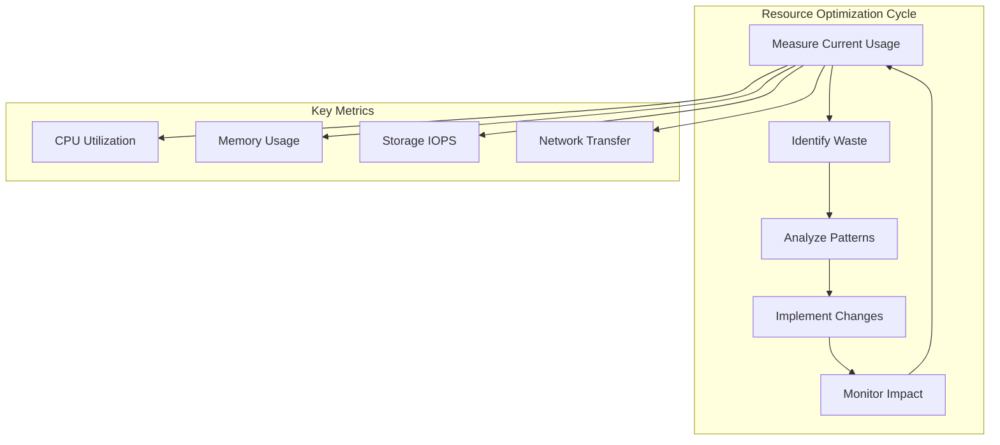
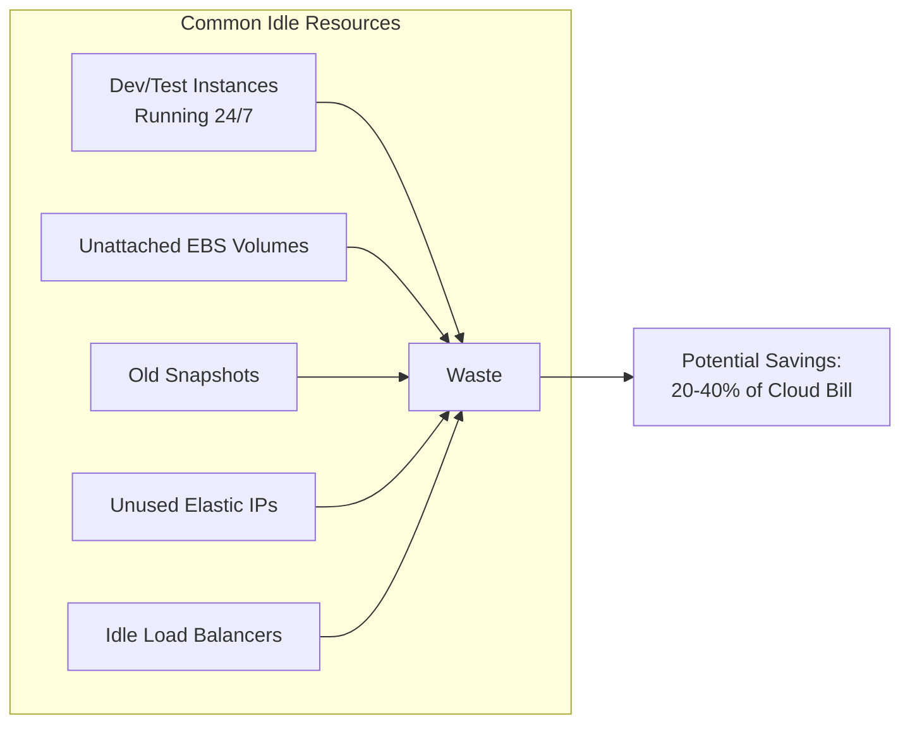
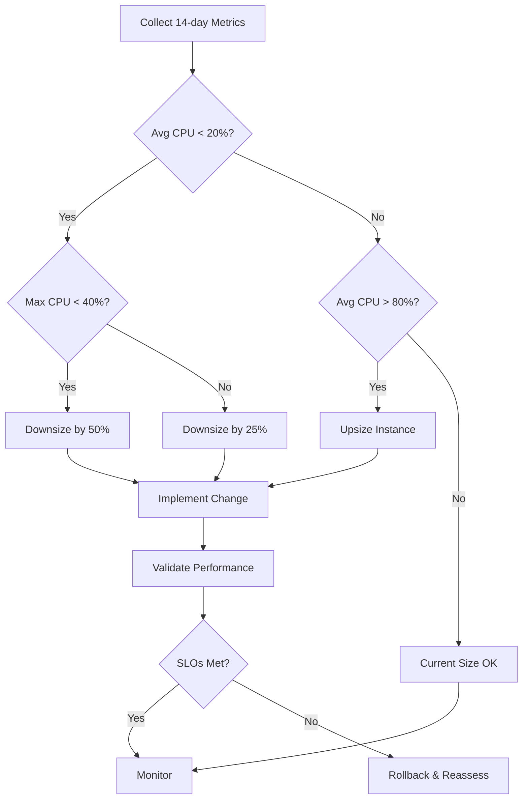
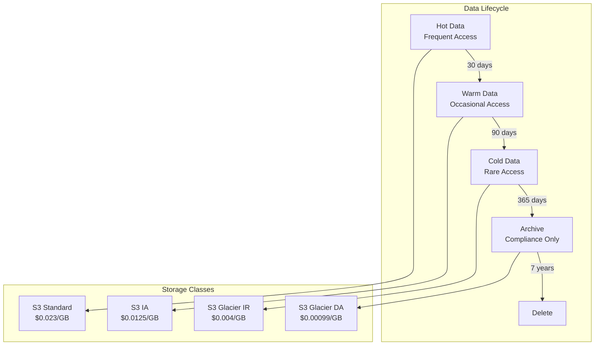
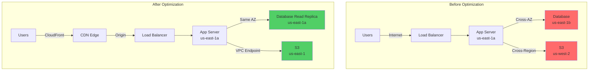
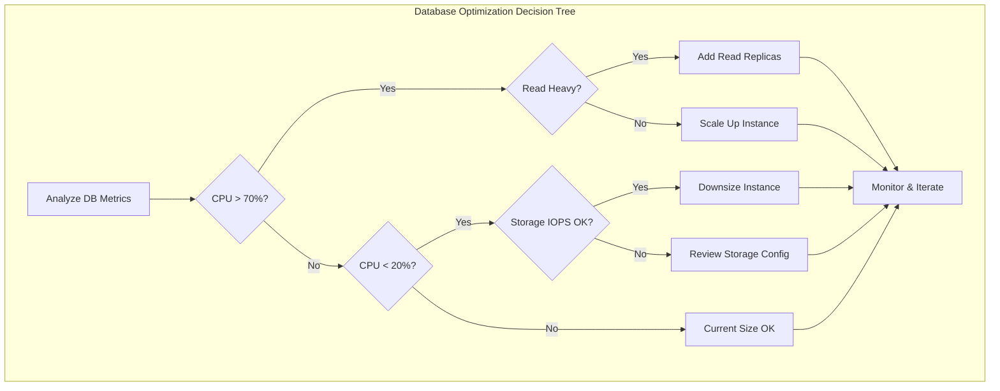
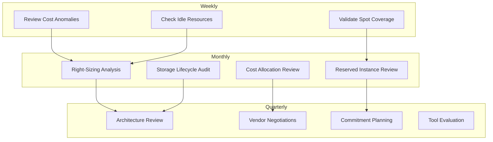
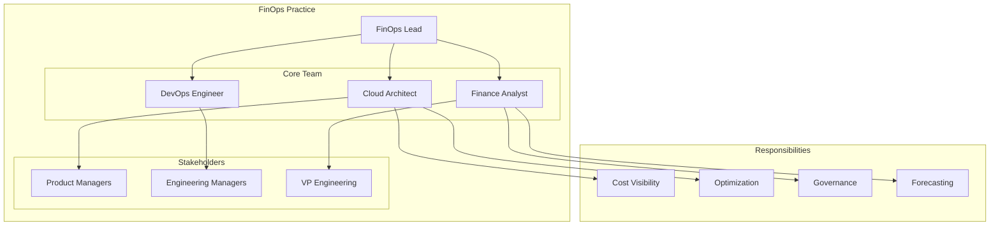

# How to Implement Resource Optimization

Author: [nawazdhandala](https://github.com/nawazdhandala)

Tags: Cost Optimization, FinOps, Cloud, Performance

Description: Learn systematic approaches to optimizing cloud resource usage and costs.

---

Cloud spending often spirals out of control without deliberate optimization strategies. This guide covers practical techniques to identify waste, right-size resources, and build a continuous optimization culture that keeps costs aligned with actual needs.

## Understanding Resource Optimization

Resource optimization is the practice of matching your cloud infrastructure to actual workload requirements. Over-provisioning wastes money; under-provisioning hurts performance. The goal is finding the sweet spot where you pay only for what you truly need.



## 1. Optimization Opportunity Identification

Before optimizing, you need visibility into where waste exists. Start by collecting utilization data across all resources.

### Resource Utilization Analysis Script

This Python script analyzes AWS EC2 instance utilization using CloudWatch metrics to identify optimization candidates.

```python
import boto3
from datetime import datetime, timedelta
from dataclasses import dataclass
from typing import List, Dict
import json

@dataclass
class InstanceMetrics:
    instance_id: str
    instance_type: str
    avg_cpu: float
    max_cpu: float
    avg_memory: float
    avg_network_in: float
    avg_network_out: float
    recommendation: str

class ResourceAnalyzer:
    def __init__(self, region: str = 'us-east-1'):
        self.ec2 = boto3.client('ec2', region_name=region)
        self.cloudwatch = boto3.client('cloudwatch', region_name=region)
        self.period_days = 14  # Analyze last 14 days

    def get_running_instances(self) -> List[Dict]:
        """Fetch all running EC2 instances with their metadata."""
        response = self.ec2.describe_instances(
            Filters=[{'Name': 'instance-state-name', 'Values': ['running']}]
        )

        instances = []
        for reservation in response['Reservations']:
            for instance in reservation['Instances']:
                instances.append({
                    'instance_id': instance['InstanceId'],
                    'instance_type': instance['InstanceType'],
                    'launch_time': instance['LaunchTime'],
                    'tags': {t['Key']: t['Value'] for t in instance.get('Tags', [])}
                })
        return instances

    def get_cpu_metrics(self, instance_id: str) -> Dict[str, float]:
        """Retrieve CPU utilization metrics from CloudWatch."""
        end_time = datetime.utcnow()
        start_time = end_time - timedelta(days=self.period_days)

        response = self.cloudwatch.get_metric_statistics(
            Namespace='AWS/EC2',
            MetricName='CPUUtilization',
            Dimensions=[{'Name': 'InstanceId', 'Value': instance_id}],
            StartTime=start_time,
            EndTime=end_time,
            Period=3600,  # 1-hour intervals
            Statistics=['Average', 'Maximum']
        )

        if not response['Datapoints']:
            return {'avg': 0, 'max': 0}

        avg_values = [dp['Average'] for dp in response['Datapoints']]
        max_values = [dp['Maximum'] for dp in response['Datapoints']]

        return {
            'avg': sum(avg_values) / len(avg_values),
            'max': max(max_values)
        }

    def analyze_instance(self, instance: Dict) -> InstanceMetrics:
        """Analyze a single instance and generate recommendations."""
        cpu_metrics = self.get_cpu_metrics(instance['instance_id'])

        # Determine optimization recommendation
        if cpu_metrics['avg'] < 5 and cpu_metrics['max'] < 20:
            recommendation = "TERMINATE - Consistently idle"
        elif cpu_metrics['avg'] < 20 and cpu_metrics['max'] < 40:
            recommendation = "DOWNSIZE - Significantly over-provisioned"
        elif cpu_metrics['avg'] < 40:
            recommendation = "REVIEW - Potentially over-provisioned"
        elif cpu_metrics['avg'] > 80:
            recommendation = "UPSIZE - Resource constrained"
        else:
            recommendation = "OPTIMAL - Well-sized"

        return InstanceMetrics(
            instance_id=instance['instance_id'],
            instance_type=instance['instance_type'],
            avg_cpu=round(cpu_metrics['avg'], 2),
            max_cpu=round(cpu_metrics['max'], 2),
            avg_memory=0,  # Requires CloudWatch agent
            avg_network_in=0,
            avg_network_out=0,
            recommendation=recommendation
        )

    def generate_report(self) -> Dict:
        """Generate a full optimization report."""
        instances = self.get_running_instances()
        results = []

        for instance in instances:
            metrics = self.analyze_instance(instance)
            results.append(metrics)

        # Categorize recommendations
        report = {
            'timestamp': datetime.utcnow().isoformat(),
            'total_instances': len(results),
            'summary': {
                'terminate': len([r for r in results if 'TERMINATE' in r.recommendation]),
                'downsize': len([r for r in results if 'DOWNSIZE' in r.recommendation]),
                'review': len([r for r in results if 'REVIEW' in r.recommendation]),
                'optimal': len([r for r in results if 'OPTIMAL' in r.recommendation]),
                'upsize': len([r for r in results if 'UPSIZE' in r.recommendation])
            },
            'instances': [vars(r) for r in results]
        }

        return report

# Run the analysis
if __name__ == '__main__':
    analyzer = ResourceAnalyzer(region='us-east-1')
    report = analyzer.generate_report()
    print(json.dumps(report, indent=2))
```

### Identifying Idle Resources

Resources that sit idle represent pure waste. Common culprits include:



This script identifies unattached EBS volumes that are generating charges without providing value:

```bash
#!/bin/bash
# find-unattached-volumes.sh
# Identifies EBS volumes not attached to any instance

echo "Scanning for unattached EBS volumes..."
echo "======================================="

aws ec2 describe-volumes \
    --filters Name=status,Values=available \
    --query 'Volumes[*].{
        VolumeId:VolumeId,
        Size:Size,
        Type:VolumeType,
        Created:CreateTime,
        AZ:AvailabilityZone
    }' \
    --output table

# Calculate potential monthly savings
TOTAL_GB=$(aws ec2 describe-volumes \
    --filters Name=status,Values=available \
    --query 'sum(Volumes[*].Size)' \
    --output text)

# Approximate gp3 pricing at $0.08/GB-month
MONTHLY_COST=$(echo "$TOTAL_GB * 0.08" | bc)

echo ""
echo "Total unattached storage: ${TOTAL_GB} GB"
echo "Estimated monthly waste: \$${MONTHLY_COST}"
```

## 2. Compute Optimization Strategies

Compute resources typically represent 60-70% of cloud spending. Right-sizing instances delivers the biggest impact.

### Right-Sizing Framework



### Kubernetes Resource Optimization

For containerized workloads, setting appropriate resource requests and limits is critical:

```yaml
# optimized-deployment.yaml
# This deployment uses resource requests based on actual measured usage
# rather than arbitrary high values that waste cluster capacity

apiVersion: apps/v1
kind: Deployment
metadata:
  name: api-server
  namespace: production
spec:
  replicas: 3
  selector:
    matchLabels:
      app: api-server
  template:
    metadata:
      labels:
        app: api-server
    spec:
      containers:
        - name: api
          image: myregistry/api:v2.1.0
          resources:
            # Requests based on P95 observed usage + 20% buffer
            requests:
              cpu: 250m      # Measured P95: 200m
              memory: 512Mi  # Measured P95: 420Mi
            # Limits set to handle traffic spikes
            limits:
              cpu: 1000m     # Allow 4x burst
              memory: 1Gi    # 2x request for safety

          # Vertical Pod Autoscaler annotation for recommendations
          # Run: kubectl describe vpa api-server-vpa

---
# Vertical Pod Autoscaler to continuously recommend optimal resources
apiVersion: autoscaling.k8s.io/v1
kind: VerticalPodAutoscaler
metadata:
  name: api-server-vpa
  namespace: production
spec:
  targetRef:
    apiVersion: apps/v1
    kind: Deployment
    name: api-server
  updatePolicy:
    updateMode: "Off"  # Start with recommendations only
  resourcePolicy:
    containerPolicies:
      - containerName: api
        minAllowed:
          cpu: 100m
          memory: 256Mi
        maxAllowed:
          cpu: 2
          memory: 4Gi
```

### Spot and Preemptible Instances

Using spot instances for fault-tolerant workloads can reduce compute costs by 60-90%:

```python
# spot-instance-launcher.py
# Launches spot instances with automatic fallback to on-demand

import boto3
from botocore.exceptions import ClientError

class SpotInstanceManager:
    def __init__(self, region: str = 'us-east-1'):
        self.ec2 = boto3.client('ec2', region_name=region)

    def get_spot_price(self, instance_type: str, az: str) -> float:
        """Get current spot price for an instance type."""
        response = self.ec2.describe_spot_price_history(
            InstanceTypes=[instance_type],
            ProductDescriptions=['Linux/UNIX'],
            AvailabilityZone=az,
            MaxResults=1
        )

        if response['SpotPriceHistory']:
            return float(response['SpotPriceHistory'][0]['SpotPrice'])
        return None

    def launch_spot_fleet(self, config: dict) -> str:
        """Launch a spot fleet with diversified instance types."""

        # Define multiple instance types for better availability
        instance_types = ['m5.large', 'm5a.large', 'm5n.large', 'm4.large']

        launch_specs = []
        for instance_type in instance_types:
            launch_specs.append({
                'ImageId': config['ami_id'],
                'InstanceType': instance_type,
                'KeyName': config.get('key_name'),
                'SecurityGroups': [{'GroupId': sg} for sg in config['security_groups']],
                'SubnetId': config['subnet_id'],
                'TagSpecifications': [{
                    'ResourceType': 'instance',
                    'Tags': [
                        {'Key': 'Name', 'Value': config['name']},
                        {'Key': 'Environment', 'Value': config.get('environment', 'production')},
                        {'Key': 'ManagedBy', 'Value': 'spot-fleet'}
                    ]
                }]
            })

        response = self.ec2.request_spot_fleet(
            SpotFleetRequestConfig={
                'IamFleetRole': config['fleet_role_arn'],
                'TargetCapacity': config['target_capacity'],
                'TerminateInstancesWithExpiration': True,
                'Type': 'maintain',  # Automatically replace interrupted instances
                'AllocationStrategy': 'lowestPrice',  # or 'diversified' for reliability
                'LaunchSpecifications': launch_specs,
                # Set max price at on-demand rate for cost protection
                'SpotPrice': str(config.get('max_price', '0.10')),
                'OnDemandTargetCapacity': config.get('on_demand_base', 0),
                'OnDemandAllocationStrategy': 'lowestPrice'
            }
        )

        return response['SpotFleetRequestId']

    def estimate_savings(self, instance_type: str, hours_per_month: int = 730) -> dict:
        """Calculate potential savings from spot vs on-demand."""

        # Get on-demand pricing (simplified - use AWS Price List API for accuracy)
        on_demand_prices = {
            'm5.large': 0.096,
            'm5.xlarge': 0.192,
            'm5.2xlarge': 0.384,
        }

        on_demand = on_demand_prices.get(instance_type, 0.10)
        spot = self.get_spot_price(instance_type, 'us-east-1a') or on_demand * 0.3

        monthly_on_demand = on_demand * hours_per_month
        monthly_spot = spot * hours_per_month
        savings = monthly_on_demand - monthly_spot
        savings_percent = (savings / monthly_on_demand) * 100

        return {
            'instance_type': instance_type,
            'on_demand_hourly': on_demand,
            'spot_hourly': spot,
            'monthly_on_demand': round(monthly_on_demand, 2),
            'monthly_spot': round(monthly_spot, 2),
            'monthly_savings': round(savings, 2),
            'savings_percent': round(savings_percent, 1)
        }
```

## 3. Storage Optimization Techniques

Storage costs accumulate silently. Implementing lifecycle policies and choosing appropriate storage tiers prevents waste.

### Storage Tiering Strategy



### Automated Lifecycle Policy

```json
{
  "Rules": [
    {
      "ID": "OptimizeStorageCosts",
      "Status": "Enabled",
      "Filter": {
        "Prefix": "data/"
      },
      "Transitions": [
        {
          "Days": 30,
          "StorageClass": "STANDARD_IA"
        },
        {
          "Days": 90,
          "StorageClass": "GLACIER_IR"
        },
        {
          "Days": 365,
          "StorageClass": "DEEP_ARCHIVE"
        }
      ],
      "Expiration": {
        "Days": 2555
      },
      "NoncurrentVersionTransitions": [
        {
          "NoncurrentDays": 30,
          "StorageClass": "GLACIER_IR"
        }
      ],
      "NoncurrentVersionExpiration": {
        "NoncurrentDays": 90
      }
    },
    {
      "ID": "CleanupIncompleteUploads",
      "Status": "Enabled",
      "Filter": {},
      "AbortIncompleteMultipartUpload": {
        "DaysAfterInitiation": 7
      }
    }
  ]
}
```

### EBS Volume Optimization

```bash
#!/bin/bash
# optimize-ebs-volumes.sh
# Analyzes and optimizes EBS volumes

set -e

echo "EBS Volume Optimization Report"
echo "=============================="
echo ""

# Find gp2 volumes that should be migrated to gp3
echo "GP2 volumes (should migrate to GP3 for 20% savings):"
aws ec2 describe-volumes \
    --filters Name=volume-type,Values=gp2 \
    --query 'Volumes[*].{
        VolumeId:VolumeId,
        Size:Size,
        State:State,
        IOPS:Iops
    }' \
    --output table

echo ""
echo "Oversized volumes (less than 20% used):"

# Get all volumes attached to instances
for vol in $(aws ec2 describe-volumes --query 'Volumes[?State==`in-use`].VolumeId' --output text); do
    # Get volume size
    size=$(aws ec2 describe-volumes --volume-ids $vol --query 'Volumes[0].Size' --output text)

    # Get CloudWatch metrics for volume
    used_bytes=$(aws cloudwatch get-metric-statistics \
        --namespace AWS/EBS \
        --metric-name VolumeReadBytes \
        --dimensions Name=VolumeId,Value=$vol \
        --start-time $(date -u -d '7 days ago' +%Y-%m-%dT%H:%M:%SZ) \
        --end-time $(date -u +%Y-%m-%dT%H:%M:%SZ) \
        --period 604800 \
        --statistics Sum \
        --query 'Datapoints[0].Sum' \
        --output text 2>/dev/null || echo "0")

    echo "Volume $vol: ${size}GB allocated"
done

echo ""
echo "Recommendations:"
echo "1. Migrate all gp2 volumes to gp3 (same performance, 20% cheaper)"
echo "2. Enable EBS volume auto-scaling or reduce oversized volumes"
echo "3. Delete unattached volumes after backup verification"
```

## 4. Network Cost Reduction

Data transfer costs are often overlooked but can represent 10-15% of cloud bills.

### Network Cost Optimization Architecture



### VPC Endpoint Configuration

VPC endpoints eliminate NAT Gateway data processing charges for AWS service traffic:

```hcl
# vpc-endpoints.tf
# Creates VPC endpoints to reduce data transfer costs

# S3 Gateway Endpoint (free)
resource "aws_vpc_endpoint" "s3" {
  vpc_id            = aws_vpc.main.id
  service_name      = "com.amazonaws.${var.region}.s3"
  vpc_endpoint_type = "Gateway"

  route_table_ids = [
    aws_route_table.private_a.id,
    aws_route_table.private_b.id,
    aws_route_table.private_c.id,
  ]

  tags = {
    Name        = "s3-endpoint"
    Environment = var.environment
    Purpose     = "cost-optimization"
  }
}

# DynamoDB Gateway Endpoint (free)
resource "aws_vpc_endpoint" "dynamodb" {
  vpc_id            = aws_vpc.main.id
  service_name      = "com.amazonaws.${var.region}.dynamodb"
  vpc_endpoint_type = "Gateway"

  route_table_ids = [
    aws_route_table.private_a.id,
    aws_route_table.private_b.id,
    aws_route_table.private_c.id,
  ]

  tags = {
    Name        = "dynamodb-endpoint"
    Environment = var.environment
  }
}

# ECR Interface Endpoints (reduces NAT costs for container pulls)
resource "aws_vpc_endpoint" "ecr_api" {
  vpc_id              = aws_vpc.main.id
  service_name        = "com.amazonaws.${var.region}.ecr.api"
  vpc_endpoint_type   = "Interface"
  private_dns_enabled = true
  subnet_ids          = aws_subnet.private[*].id
  security_group_ids  = [aws_security_group.vpc_endpoints.id]

  tags = {
    Name = "ecr-api-endpoint"
  }
}

resource "aws_vpc_endpoint" "ecr_dkr" {
  vpc_id              = aws_vpc.main.id
  service_name        = "com.amazonaws.${var.region}.ecr.dkr"
  vpc_endpoint_type   = "Interface"
  private_dns_enabled = true
  subnet_ids          = aws_subnet.private[*].id
  security_group_ids  = [aws_security_group.vpc_endpoints.id]

  tags = {
    Name = "ecr-dkr-endpoint"
  }
}

# CloudWatch Logs Endpoint (reduces logging traffic through NAT)
resource "aws_vpc_endpoint" "logs" {
  vpc_id              = aws_vpc.main.id
  service_name        = "com.amazonaws.${var.region}.logs"
  vpc_endpoint_type   = "Interface"
  private_dns_enabled = true
  subnet_ids          = aws_subnet.private[*].id
  security_group_ids  = [aws_security_group.vpc_endpoints.id]

  tags = {
    Name = "cloudwatch-logs-endpoint"
  }
}

# Security group for interface endpoints
resource "aws_security_group" "vpc_endpoints" {
  name        = "vpc-endpoints-sg"
  description = "Security group for VPC endpoints"
  vpc_id      = aws_vpc.main.id

  ingress {
    from_port   = 443
    to_port     = 443
    protocol    = "tcp"
    cidr_blocks = [aws_vpc.main.cidr_block]
  }

  tags = {
    Name = "vpc-endpoints-sg"
  }
}
```

### Data Transfer Cost Calculator

```python
# network-cost-analyzer.py
# Analyzes and projects network transfer costs

from dataclasses import dataclass
from typing import List, Dict
import boto3
from datetime import datetime, timedelta

@dataclass
class TransferCost:
    category: str
    gb_transferred: float
    cost_per_gb: float
    total_cost: float
    optimization_potential: str

class NetworkCostAnalyzer:
    # AWS data transfer pricing (simplified, varies by region)
    PRICING = {
        'internet_out_first_10tb': 0.09,
        'internet_out_next_40tb': 0.085,
        'internet_out_next_100tb': 0.07,
        'cross_az': 0.01,  # Each direction
        'cross_region': 0.02,
        'vpc_endpoint': 0.01,  # Per GB processed
        'nat_gateway': 0.045,  # Per GB processed
        'cloudfront_out': 0.085,  # First 10TB
    }

    def __init__(self, region: str = 'us-east-1'):
        self.ce = boto3.client('ce', region_name=region)
        self.cloudwatch = boto3.client('cloudwatch', region_name=region)

    def get_data_transfer_costs(self, days: int = 30) -> Dict:
        """Retrieve data transfer costs from Cost Explorer."""
        end_date = datetime.now().strftime('%Y-%m-%d')
        start_date = (datetime.now() - timedelta(days=days)).strftime('%Y-%m-%d')

        response = self.ce.get_cost_and_usage(
            TimePeriod={'Start': start_date, 'End': end_date},
            Granularity='MONTHLY',
            Filter={
                'Dimensions': {
                    'Key': 'USAGE_TYPE_GROUP',
                    'Values': ['EC2: Data Transfer - Internet (Out)',
                               'EC2: Data Transfer - Inter AZ',
                               'EC2: Data Transfer - Region to Region']
                }
            },
            Metrics=['UnblendedCost', 'UsageQuantity'],
            GroupBy=[{'Type': 'DIMENSION', 'Key': 'USAGE_TYPE_GROUP'}]
        )

        return response

    def analyze_nat_gateway_usage(self, nat_gateway_id: str) -> Dict:
        """Analyze NAT Gateway data processing."""
        end_time = datetime.utcnow()
        start_time = end_time - timedelta(days=30)

        response = self.cloudwatch.get_metric_statistics(
            Namespace='AWS/NATGateway',
            MetricName='BytesOutToDestination',
            Dimensions=[{'Name': 'NatGatewayId', 'Value': nat_gateway_id}],
            StartTime=start_time,
            EndTime=end_time,
            Period=86400,  # Daily
            Statistics=['Sum']
        )

        total_bytes = sum(dp['Sum'] for dp in response['Datapoints'])
        total_gb = total_bytes / (1024**3)
        cost = total_gb * self.PRICING['nat_gateway']

        return {
            'nat_gateway_id': nat_gateway_id,
            'total_gb': round(total_gb, 2),
            'estimated_cost': round(cost, 2),
            'recommendation': self._nat_recommendation(total_gb, cost)
        }

    def _nat_recommendation(self, gb: float, cost: float) -> str:
        """Generate NAT Gateway optimization recommendation."""
        if cost > 100:
            return (
                f"High NAT costs (${cost:.2f}/month). Consider:\n"
                "1. Add VPC endpoints for S3, DynamoDB, ECR\n"
                "2. Move S3-heavy workloads to same region\n"
                "3. Use S3 Gateway endpoints (free)"
            )
        return "NAT costs within normal range"

    def calculate_cdn_savings(self, monthly_internet_gb: float) -> Dict:
        """Calculate potential savings from CDN implementation."""
        # Assume 60% of traffic is cacheable
        cacheable_gb = monthly_internet_gb * 0.6

        # Current cost (direct from origin)
        current_cost = monthly_internet_gb * self.PRICING['internet_out_first_10tb']

        # With CDN (lower egress + CDN costs)
        origin_traffic = monthly_internet_gb * 0.2  # 80% cache hit rate
        cdn_traffic = monthly_internet_gb
        cdn_cost = (origin_traffic * self.PRICING['internet_out_first_10tb'] +
                    cdn_traffic * self.PRICING['cloudfront_out'])

        savings = current_cost - cdn_cost

        return {
            'current_monthly_cost': round(current_cost, 2),
            'projected_cdn_cost': round(cdn_cost, 2),
            'monthly_savings': round(savings, 2),
            'cache_hit_assumption': '80%',
            'recommendation': 'Implement CDN' if savings > 50 else 'CDN may not be cost-effective'
        }

# Example usage
if __name__ == '__main__':
    analyzer = NetworkCostAnalyzer()

    # Analyze CDN savings potential
    cdn_analysis = analyzer.calculate_cdn_savings(monthly_internet_gb=5000)
    print("CDN Savings Analysis:")
    print(f"  Current cost: ${cdn_analysis['current_monthly_cost']}")
    print(f"  With CDN: ${cdn_analysis['projected_cdn_cost']}")
    print(f"  Monthly savings: ${cdn_analysis['monthly_savings']}")
```

## 5. Database Optimization

Database services often run oversized instances with inefficient configurations.

### Database Right-Sizing



### RDS Optimization Script

```python
# rds-optimizer.py
# Analyzes RDS instances and provides optimization recommendations

import boto3
from datetime import datetime, timedelta
from typing import Dict, List
import json

class RDSOptimizer:
    # Instance pricing (simplified - use AWS Price List API for accuracy)
    INSTANCE_PRICING = {
        'db.t3.micro': 0.017,
        'db.t3.small': 0.034,
        'db.t3.medium': 0.068,
        'db.t3.large': 0.136,
        'db.r5.large': 0.24,
        'db.r5.xlarge': 0.48,
        'db.r5.2xlarge': 0.96,
    }

    # Downsize mapping
    DOWNSIZE_MAP = {
        'db.r5.2xlarge': 'db.r5.xlarge',
        'db.r5.xlarge': 'db.r5.large',
        'db.r5.large': 'db.t3.large',
        'db.t3.large': 'db.t3.medium',
        'db.t3.medium': 'db.t3.small',
    }

    def __init__(self, region: str = 'us-east-1'):
        self.rds = boto3.client('rds', region_name=region)
        self.cloudwatch = boto3.client('cloudwatch', region_name=region)

    def get_instances(self) -> List[Dict]:
        """Get all RDS instances."""
        response = self.rds.describe_db_instances()
        return response['DBInstances']

    def get_instance_metrics(self, instance_id: str, days: int = 14) -> Dict:
        """Retrieve CloudWatch metrics for an RDS instance."""
        end_time = datetime.utcnow()
        start_time = end_time - timedelta(days=days)

        metrics = {}
        metric_names = ['CPUUtilization', 'FreeableMemory', 'ReadIOPS',
                        'WriteIOPS', 'DatabaseConnections']

        for metric_name in metric_names:
            response = self.cloudwatch.get_metric_statistics(
                Namespace='AWS/RDS',
                MetricName=metric_name,
                Dimensions=[{'Name': 'DBInstanceIdentifier', 'Value': instance_id}],
                StartTime=start_time,
                EndTime=end_time,
                Period=3600,
                Statistics=['Average', 'Maximum']
            )

            if response['Datapoints']:
                avg_values = [dp['Average'] for dp in response['Datapoints']]
                max_values = [dp['Maximum'] for dp in response['Datapoints']]
                metrics[metric_name] = {
                    'avg': sum(avg_values) / len(avg_values),
                    'max': max(max_values)
                }
            else:
                metrics[metric_name] = {'avg': 0, 'max': 0}

        return metrics

    def analyze_instance(self, instance: Dict) -> Dict:
        """Analyze a single RDS instance."""
        instance_id = instance['DBInstanceIdentifier']
        instance_class = instance['DBInstanceClass']
        multi_az = instance['MultiAZ']
        storage_type = instance['StorageType']
        allocated_storage = instance['AllocatedStorage']

        metrics = self.get_instance_metrics(instance_id)

        recommendations = []
        potential_savings = 0

        # CPU Analysis
        if metrics['CPUUtilization']['avg'] < 20 and metrics['CPUUtilization']['max'] < 40:
            if instance_class in self.DOWNSIZE_MAP:
                new_class = self.DOWNSIZE_MAP[instance_class]
                current_cost = self.INSTANCE_PRICING.get(instance_class, 0.5) * 730
                new_cost = self.INSTANCE_PRICING.get(new_class, 0.25) * 730
                savings = current_cost - new_cost
                if multi_az:
                    savings *= 2  # Multi-AZ doubles the instance cost
                potential_savings += savings
                recommendations.append({
                    'type': 'DOWNSIZE',
                    'message': f'Downsize from {instance_class} to {new_class}',
                    'monthly_savings': round(savings, 2)
                })

        # Multi-AZ Analysis for non-production
        tags = {tag['Key']: tag['Value'] for tag in instance.get('TagList', [])}
        env = tags.get('Environment', 'production').lower()

        if multi_az and env in ['dev', 'development', 'test', 'staging']:
            current_cost = self.INSTANCE_PRICING.get(instance_class, 0.5) * 730
            potential_savings += current_cost
            recommendations.append({
                'type': 'DISABLE_MULTI_AZ',
                'message': f'Disable Multi-AZ for {env} environment',
                'monthly_savings': round(current_cost, 2)
            })

        # Storage Analysis
        if storage_type == 'io1' and metrics['ReadIOPS']['avg'] + metrics['WriteIOPS']['avg'] < 1000:
            recommendations.append({
                'type': 'STORAGE_TYPE',
                'message': 'Consider switching from io1 to gp3 (low IOPS usage)',
                'monthly_savings': 'Varies based on IOPS provisioned'
            })

        # Reserved Instance Check
        recommendations.append({
            'type': 'RESERVED_INSTANCE',
            'message': 'Check if Reserved Instance coverage would save costs',
            'potential_savings': '30-60% vs on-demand'
        })

        return {
            'instance_id': instance_id,
            'instance_class': instance_class,
            'multi_az': multi_az,
            'storage_type': storage_type,
            'metrics': {
                'avg_cpu': round(metrics['CPUUtilization']['avg'], 2),
                'max_cpu': round(metrics['CPUUtilization']['max'], 2),
                'avg_connections': round(metrics['DatabaseConnections']['avg'], 0)
            },
            'recommendations': recommendations,
            'potential_monthly_savings': round(potential_savings, 2)
        }

    def generate_report(self) -> Dict:
        """Generate optimization report for all RDS instances."""
        instances = self.get_instances()
        results = []
        total_savings = 0

        for instance in instances:
            analysis = self.analyze_instance(instance)
            results.append(analysis)
            total_savings += analysis['potential_monthly_savings']

        return {
            'timestamp': datetime.utcnow().isoformat(),
            'total_instances': len(results),
            'total_potential_savings': round(total_savings, 2),
            'instances': results
        }

if __name__ == '__main__':
    optimizer = RDSOptimizer()
    report = optimizer.generate_report()
    print(json.dumps(report, indent=2))
```

### Query Optimization for Cost Reduction

Inefficient queries waste compute resources. Monitor and optimize slow queries:

```sql
-- PostgreSQL: Find expensive queries
SELECT
    round((total_exec_time / 1000 / 60)::numeric, 2) as total_minutes,
    calls,
    round((mean_exec_time / 1000)::numeric, 2) as avg_seconds,
    round((total_exec_time / calls / 1000)::numeric, 2) as per_call_seconds,
    query
FROM pg_stat_statements
WHERE total_exec_time > 60000  -- More than 1 minute total
ORDER BY total_exec_time DESC
LIMIT 20;

-- Find missing indexes
SELECT
    schemaname,
    relname as table_name,
    seq_scan,
    seq_tup_read,
    idx_scan,
    seq_tup_read / NULLIF(seq_scan, 0) as avg_rows_per_scan
FROM pg_stat_user_tables
WHERE seq_scan > 100  -- Tables with many sequential scans
  AND seq_tup_read / NULLIF(seq_scan, 0) > 1000  -- Reading many rows
  AND idx_scan < seq_scan  -- Fewer index scans than seq scans
ORDER BY seq_tup_read DESC
LIMIT 20;

-- Analyze table bloat (wasted storage)
SELECT
    schemaname,
    tablename,
    pg_size_pretty(pg_total_relation_size(schemaname || '.' || tablename)) as total_size,
    pg_size_pretty(pg_relation_size(schemaname || '.' || tablename)) as table_size,
    n_dead_tup,
    n_live_tup,
    round(100.0 * n_dead_tup / NULLIF(n_live_tup + n_dead_tup, 0), 2) as dead_pct
FROM pg_stat_user_tables
WHERE n_dead_tup > 10000
ORDER BY n_dead_tup DESC
LIMIT 20;
```

## 6. Continuous Optimization Process

Resource optimization is not a one-time activity. Build it into your operational rhythm.

### Optimization Governance Framework



### Automated Cost Monitoring

```python
# cost-monitor.py
# Automated cost monitoring with anomaly detection and alerts

import boto3
from datetime import datetime, timedelta
from typing import Dict, List
import statistics

class CostMonitor:
    def __init__(self, region: str = 'us-east-1'):
        self.ce = boto3.client('ce', region_name=region)
        self.sns = boto3.client('sns', region_name=region)

    def get_daily_costs(self, days: int = 30) -> List[Dict]:
        """Retrieve daily costs for the specified period."""
        end_date = datetime.now().strftime('%Y-%m-%d')
        start_date = (datetime.now() - timedelta(days=days)).strftime('%Y-%m-%d')

        response = self.ce.get_cost_and_usage(
            TimePeriod={'Start': start_date, 'End': end_date},
            Granularity='DAILY',
            Metrics=['UnblendedCost'],
            GroupBy=[{'Type': 'DIMENSION', 'Key': 'SERVICE'}]
        )

        daily_costs = []
        for result in response['ResultsByTime']:
            date = result['TimePeriod']['Start']
            total = sum(
                float(group['Metrics']['UnblendedCost']['Amount'])
                for group in result['Groups']
            )
            daily_costs.append({'date': date, 'cost': total})

        return daily_costs

    def detect_anomalies(self, threshold_std: float = 2.0) -> List[Dict]:
        """Detect cost anomalies using statistical analysis."""
        costs = self.get_daily_costs(days=30)

        if len(costs) < 7:
            return []

        cost_values = [c['cost'] for c in costs]
        mean_cost = statistics.mean(cost_values[:-1])  # Exclude today
        std_cost = statistics.stdev(cost_values[:-1])

        anomalies = []
        for day in costs[-7:]:  # Check last 7 days
            if abs(day['cost'] - mean_cost) > threshold_std * std_cost:
                anomaly_type = 'SPIKE' if day['cost'] > mean_cost else 'DROP'
                anomalies.append({
                    'date': day['date'],
                    'cost': round(day['cost'], 2),
                    'expected': round(mean_cost, 2),
                    'deviation': round(day['cost'] - mean_cost, 2),
                    'type': anomaly_type
                })

        return anomalies

    def get_cost_by_service(self, days: int = 7) -> Dict:
        """Get cost breakdown by AWS service."""
        end_date = datetime.now().strftime('%Y-%m-%d')
        start_date = (datetime.now() - timedelta(days=days)).strftime('%Y-%m-%d')

        response = self.ce.get_cost_and_usage(
            TimePeriod={'Start': start_date, 'End': end_date},
            Granularity='MONTHLY',
            Metrics=['UnblendedCost'],
            GroupBy=[{'Type': 'DIMENSION', 'Key': 'SERVICE'}]
        )

        services = {}
        for result in response['ResultsByTime']:
            for group in result['Groups']:
                service = group['Keys'][0]
                cost = float(group['Metrics']['UnblendedCost']['Amount'])
                services[service] = services.get(service, 0) + cost

        # Sort by cost descending
        sorted_services = dict(sorted(services.items(), key=lambda x: x[1], reverse=True))
        return {k: round(v, 2) for k, v in sorted_services.items()}

    def send_alert(self, topic_arn: str, subject: str, message: str):
        """Send SNS alert for cost anomalies."""
        self.sns.publish(
            TopicArn=topic_arn,
            Subject=subject,
            Message=message
        )

    def run_monitoring(self, sns_topic_arn: str = None) -> Dict:
        """Run complete cost monitoring analysis."""
        anomalies = self.detect_anomalies()
        cost_by_service = self.get_cost_by_service()

        report = {
            'timestamp': datetime.utcnow().isoformat(),
            'anomalies_detected': len(anomalies),
            'anomalies': anomalies,
            'top_services': dict(list(cost_by_service.items())[:10])
        }

        # Send alert if anomalies detected
        if anomalies and sns_topic_arn:
            message = f"Cost anomalies detected:\n\n"
            for anomaly in anomalies:
                message += (
                    f"Date: {anomaly['date']}\n"
                    f"Type: {anomaly['type']}\n"
                    f"Cost: ${anomaly['cost']} (expected: ${anomaly['expected']})\n"
                    f"Deviation: ${anomaly['deviation']}\n\n"
                )

            self.send_alert(
                sns_topic_arn,
                f"Cloud Cost Alert: {len(anomalies)} anomalies detected",
                message
            )

        return report

if __name__ == '__main__':
    monitor = CostMonitor()
    report = monitor.run_monitoring()

    print("Cost Monitoring Report")
    print("=" * 50)
    print(f"Anomalies detected: {report['anomalies_detected']}")

    if report['anomalies']:
        print("\nAnomalies:")
        for anomaly in report['anomalies']:
            print(f"  {anomaly['date']}: ${anomaly['cost']} ({anomaly['type']})")

    print("\nTop Services by Cost:")
    for service, cost in report['top_services'].items():
        print(f"  {service}: ${cost}")
```

### FinOps Team Structure



## Summary

Resource optimization requires a systematic approach combining visibility, analysis, and continuous improvement. The key strategies covered include:

1. **Identification**: Use metrics and analysis to find waste
2. **Compute**: Right-size instances and leverage spot/preemptible resources
3. **Storage**: Implement lifecycle policies and appropriate tiering
4. **Network**: Reduce transfer costs with VPC endpoints and CDNs
5. **Database**: Optimize instance sizes and query performance
6. **Process**: Build optimization into ongoing operations

Start with quick wins like identifying idle resources, then build toward a mature FinOps practice that treats cost as a first-class engineering concern.

**Related Reading:**

- [How moving from AWS to Bare-Metal saved us $230,000 /yr.](https://oneuptime.com/blog/post/2023-10-30-moving-from-aws-to-bare-metal/view)
- [Datadog Dollars: Why Monitoring Is Breaking the Bank](https://oneuptime.com/blog/post/2025-02-01-datadog-dollars-why-monitoring-is-breaking-the-bank/view)
- [How to Autoscale Deployments with the Horizontal Pod Autoscaler](https://oneuptime.com/blog/post/2025-11-27-hpa-autoscale/view)
