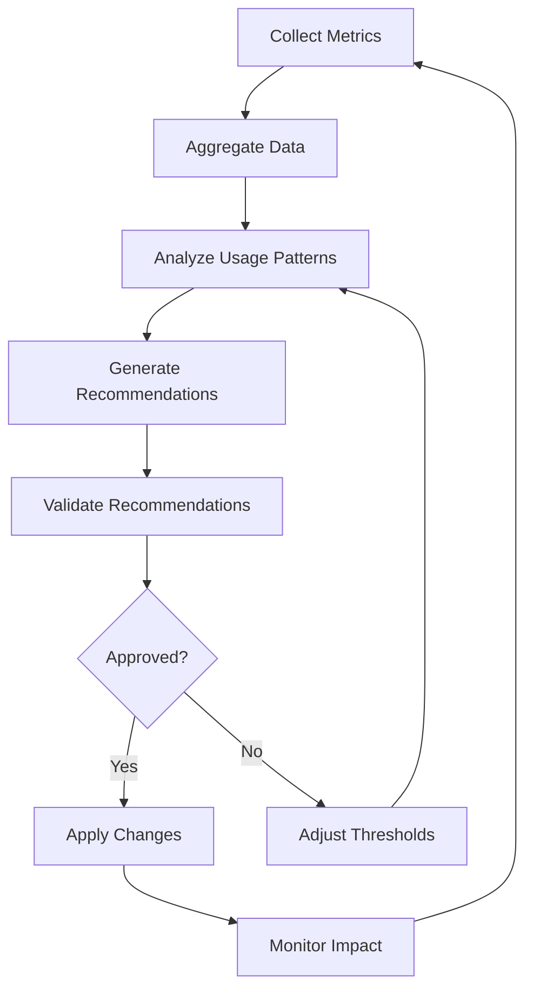
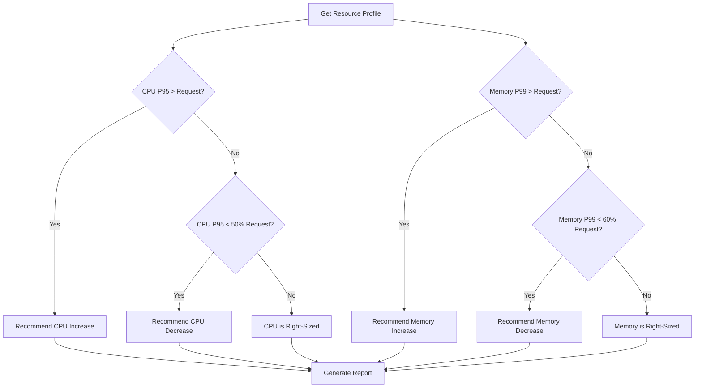
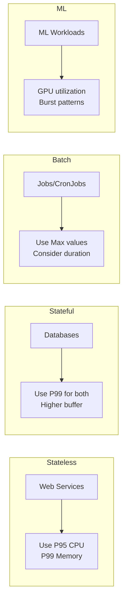
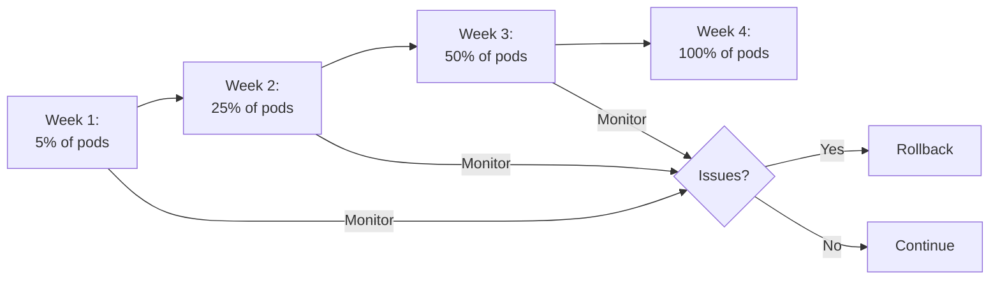
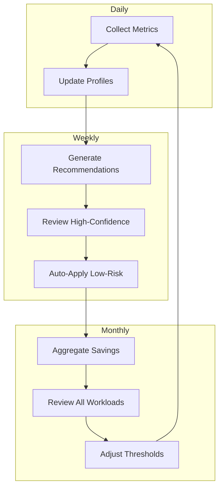

# How to Build Resource Right-Sizing

Author: [nawazdhandala](https://github.com/nawazdhandala)

Tags: Cost Optimization, FinOps, Cloud, Infrastructure

Description: Learn systematic approaches to right-sizing cloud resources.

---

Resource right-sizing is the process of matching cloud resource allocations to actual workload requirements. Over-provisioned resources waste money; under-provisioned resources hurt performance. This guide walks you through building a comprehensive right-sizing system.

## Right-Sizing Analysis Workflow

Before diving into implementation, understand the complete workflow for resource right-sizing.



### Key Metrics to Collect

Right-sizing depends on accurate, long-term metrics. Collect at minimum:

- **CPU utilization** (average, P50, P95, P99)
- **Memory utilization** (used, cached, available)
- **Network I/O** (bytes in/out, packets)
- **Disk I/O** (read/write IOPS, throughput)
- **Request latency** (for application workloads)

### Collection Period

Short observation windows lead to bad recommendations. Collect data for:

- **Minimum**: 14 days
- **Recommended**: 30 days
- **Ideal**: Full business cycle (quarterly for seasonal workloads)

## CPU and Memory Profiling

### Setting Up Metrics Collection

Deploy a metrics collection system that captures granular resource usage. Here's a Prometheus-based setup:

`prometheus-config.yaml`

This ConfigMap configures Prometheus to scrape Kubernetes pod metrics every 15 seconds. The `kubernetes-pods` job auto-discovers pods with Prometheus annotations and collects CPU, memory, and custom metrics.

```yaml
apiVersion: v1
kind: ConfigMap
metadata:
  name: prometheus-config
  namespace: monitoring
data:
  prometheus.yml: |
    global:
      scrape_interval: 15s
      evaluation_interval: 15s

    scrape_configs:
      - job_name: 'kubernetes-pods'
        kubernetes_sd_configs:
          - role: pod
        relabel_configs:
          - source_labels: [__meta_kubernetes_pod_annotation_prometheus_io_scrape]
            action: keep
            regex: true
          - source_labels: [__meta_kubernetes_pod_annotation_prometheus_io_path]
            action: replace
            target_label: __metrics_path__
            regex: (.+)
```

### CPU Profiling Queries

Use these PromQL queries to understand CPU usage patterns:

```promql
# Average CPU usage over 7 days
avg_over_time(
  rate(container_cpu_usage_seconds_total{
    namespace="production",
    container!=""
  }[5m])[7d:1h]
)

# P95 CPU usage - shows peak demand
quantile_over_time(0.95,
  rate(container_cpu_usage_seconds_total{
    namespace="production",
    container!=""
  }[5m])[7d:1h]
)

# CPU request vs actual usage ratio
sum by (pod, container) (
  rate(container_cpu_usage_seconds_total[5m])
) / sum by (pod, container) (
  kube_pod_container_resource_requests{resource="cpu"}
)
```

### Memory Profiling Queries

Memory patterns differ from CPU - look for both working set and total usage:

```promql
# Working set memory (what the container actively uses)
avg_over_time(
  container_memory_working_set_bytes{
    namespace="production",
    container!=""
  }[7d:1h]
)

# P99 memory usage - for setting limits
quantile_over_time(0.99,
  container_memory_working_set_bytes{
    namespace="production",
    container!=""
  }[7d:1h]
)

# Memory utilization vs requests
sum by (pod, container) (
  container_memory_working_set_bytes
) / sum by (pod, container) (
  kube_pod_container_resource_requests{resource="memory"}
)
```

### Profiling Script

This Python script collects and aggregates metrics for right-sizing analysis:

`resource_profiler.py`

This script queries Prometheus for historical CPU and memory metrics, calculates statistical percentiles (P50, P95, P99), and identifies workloads that are over-provisioned (using less than 50% of requests) or under-provisioned (P95 exceeds requests).

```python
import requests
from datetime import datetime, timedelta
from dataclasses import dataclass
from typing import List, Dict
import statistics

@dataclass
class ResourceProfile:
    """Holds resource usage statistics for a workload."""
    name: str
    namespace: str
    cpu_avg: float
    cpu_p50: float
    cpu_p95: float
    cpu_p99: float
    cpu_request: float
    memory_avg: int
    memory_p50: int
    memory_p95: int
    memory_p99: int
    memory_request: int

class ResourceProfiler:
    """Collects and analyzes resource usage from Prometheus."""

    def __init__(self, prometheus_url: str):
        self.prometheus_url = prometheus_url

    def query_range(self, query: str, start: datetime,
                    end: datetime, step: str = "1h") -> List[float]:
        """Execute a range query against Prometheus."""
        response = requests.get(
            f"{self.prometheus_url}/api/v1/query_range",
            params={
                "query": query,
                "start": start.isoformat(),
                "end": end.isoformat(),
                "step": step
            }
        )
        response.raise_for_status()

        results = response.json()["data"]["result"]
        if not results:
            return []

        # Extract values from the first result
        return [float(v[1]) for v in results[0]["values"]]

    def profile_workload(self, namespace: str,
                         pod_selector: str,
                         days: int = 14) -> ResourceProfile:
        """Generate a resource profile for a workload."""
        end = datetime.now()
        start = end - timedelta(days=days)

        # CPU metrics
        cpu_query = f'''
            rate(container_cpu_usage_seconds_total{{
                namespace="{namespace}",
                pod=~"{pod_selector}.*",
                container!=""
            }}[5m])
        '''
        cpu_values = self.query_range(cpu_query, start, end)

        # Memory metrics
        memory_query = f'''
            container_memory_working_set_bytes{{
                namespace="{namespace}",
                pod=~"{pod_selector}.*",
                container!=""
            }}
        '''
        memory_values = self.query_range(memory_query, start, end)

        # Get current requests
        cpu_request = self._get_cpu_request(namespace, pod_selector)
        memory_request = self._get_memory_request(namespace, pod_selector)

        return ResourceProfile(
            name=pod_selector,
            namespace=namespace,
            cpu_avg=statistics.mean(cpu_values) if cpu_values else 0,
            cpu_p50=self._percentile(cpu_values, 50),
            cpu_p95=self._percentile(cpu_values, 95),
            cpu_p99=self._percentile(cpu_values, 99),
            cpu_request=cpu_request,
            memory_avg=int(statistics.mean(memory_values)) if memory_values else 0,
            memory_p50=int(self._percentile(memory_values, 50)),
            memory_p95=int(self._percentile(memory_values, 95)),
            memory_p99=int(self._percentile(memory_values, 99)),
            memory_request=memory_request
        )

    def _percentile(self, values: List[float], p: int) -> float:
        """Calculate percentile from a list of values."""
        if not values:
            return 0
        sorted_values = sorted(values)
        index = int(len(sorted_values) * p / 100)
        return sorted_values[min(index, len(sorted_values) - 1)]

    def _get_cpu_request(self, namespace: str, pod_selector: str) -> float:
        """Get current CPU request for a workload."""
        query = f'''
            kube_pod_container_resource_requests{{
                namespace="{namespace}",
                pod=~"{pod_selector}.*",
                resource="cpu"
            }}
        '''
        response = requests.get(
            f"{self.prometheus_url}/api/v1/query",
            params={"query": query}
        )
        results = response.json()["data"]["result"]
        if results:
            return float(results[0]["value"][1])
        return 0

    def _get_memory_request(self, namespace: str, pod_selector: str) -> int:
        """Get current memory request for a workload."""
        query = f'''
            kube_pod_container_resource_requests{{
                namespace="{namespace}",
                pod=~"{pod_selector}.*",
                resource="memory"
            }}
        '''
        response = requests.get(
            f"{self.prometheus_url}/api/v1/query",
            params={"query": query}
        )
        results = response.json()["data"]["result"]
        if results:
            return int(float(results[0]["value"][1]))
        return 0
```

## Recommendation Algorithms

### Right-Sizing Decision Framework



### Recommendation Engine

`recommendation_engine.py`

This module implements the core right-sizing logic. It takes resource profiles and generates actionable recommendations with confidence scores based on data quality and variance in usage patterns.

```python
from dataclasses import dataclass
from enum import Enum
from typing import List, Optional
import math

class RecommendationType(Enum):
    INCREASE = "increase"
    DECREASE = "decrease"
    NO_CHANGE = "no_change"

@dataclass
class Recommendation:
    """A single right-sizing recommendation."""
    workload_name: str
    namespace: str
    resource_type: str  # "cpu" or "memory"
    recommendation_type: RecommendationType
    current_value: float
    recommended_value: float
    potential_savings: float  # Monthly USD
    confidence: float  # 0-1
    reason: str

class RightSizingEngine:
    """Generates right-sizing recommendations from resource profiles."""

    def __init__(self, config: dict = None):
        # Default configuration
        self.config = config or {
            # Thresholds for recommendations
            "cpu_underutil_threshold": 0.5,    # Below 50% = overprovisioned
            "cpu_overutil_threshold": 0.9,     # Above 90% = underprovisioned
            "memory_underutil_threshold": 0.6, # Below 60% = overprovisioned
            "memory_overutil_threshold": 0.85, # Above 85% = underprovisioned

            # Buffer for recommendations
            "cpu_buffer": 0.2,     # Add 20% to P95 for CPU recommendations
            "memory_buffer": 0.25, # Add 25% to P99 for memory recommendations

            # Minimum resource values
            "min_cpu_millicores": 50,
            "min_memory_mb": 64,

            # Cost assumptions (USD per core-hour, GB-hour)
            "cpu_cost_per_core_hour": 0.031,
            "memory_cost_per_gb_hour": 0.004,
        }

    def analyze(self, profile: 'ResourceProfile') -> List[Recommendation]:
        """Analyze a resource profile and generate recommendations."""
        recommendations = []

        # Analyze CPU
        cpu_rec = self._analyze_cpu(profile)
        if cpu_rec:
            recommendations.append(cpu_rec)

        # Analyze memory
        memory_rec = self._analyze_memory(profile)
        if memory_rec:
            recommendations.append(memory_rec)

        return recommendations

    def _analyze_cpu(self, profile: 'ResourceProfile') -> Optional[Recommendation]:
        """Generate CPU right-sizing recommendation."""
        if profile.cpu_request == 0:
            return None

        # Calculate utilization based on P95
        utilization = profile.cpu_p95 / profile.cpu_request

        if utilization > self.config["cpu_overutil_threshold"]:
            # Under-provisioned: recommend increase
            recommended = profile.cpu_p95 * (1 + self.config["cpu_buffer"])
            return Recommendation(
                workload_name=profile.name,
                namespace=profile.namespace,
                resource_type="cpu",
                recommendation_type=RecommendationType.INCREASE,
                current_value=profile.cpu_request,
                recommended_value=recommended,
                potential_savings=0,  # No savings, this is for performance
                confidence=self._calculate_confidence(profile, "cpu"),
                reason=f"P95 CPU ({profile.cpu_p95:.3f} cores) exceeds "
                       f"{self.config['cpu_overutil_threshold']*100}% of request"
            )

        elif utilization < self.config["cpu_underutil_threshold"]:
            # Over-provisioned: recommend decrease
            recommended = max(
                profile.cpu_p95 * (1 + self.config["cpu_buffer"]),
                self.config["min_cpu_millicores"] / 1000
            )
            savings = self._calculate_cpu_savings(
                profile.cpu_request, recommended
            )
            return Recommendation(
                workload_name=profile.name,
                namespace=profile.namespace,
                resource_type="cpu",
                recommendation_type=RecommendationType.DECREASE,
                current_value=profile.cpu_request,
                recommended_value=recommended,
                potential_savings=savings,
                confidence=self._calculate_confidence(profile, "cpu"),
                reason=f"P95 CPU ({profile.cpu_p95:.3f} cores) is only "
                       f"{utilization*100:.1f}% of request"
            )

        return None  # Already right-sized

    def _analyze_memory(self, profile: 'ResourceProfile') -> Optional[Recommendation]:
        """Generate memory right-sizing recommendation."""
        if profile.memory_request == 0:
            return None

        # Calculate utilization based on P99 (memory is less forgiving)
        utilization = profile.memory_p99 / profile.memory_request

        if utilization > self.config["memory_overutil_threshold"]:
            # Under-provisioned: recommend increase
            recommended = profile.memory_p99 * (1 + self.config["memory_buffer"])
            return Recommendation(
                workload_name=profile.name,
                namespace=profile.namespace,
                resource_type="memory",
                recommendation_type=RecommendationType.INCREASE,
                current_value=profile.memory_request,
                recommended_value=int(recommended),
                potential_savings=0,
                confidence=self._calculate_confidence(profile, "memory"),
                reason=f"P99 memory ({self._format_bytes(profile.memory_p99)}) "
                       f"exceeds {self.config['memory_overutil_threshold']*100}% "
                       f"of request"
            )

        elif utilization < self.config["memory_underutil_threshold"]:
            # Over-provisioned: recommend decrease
            recommended = max(
                profile.memory_p99 * (1 + self.config["memory_buffer"]),
                self.config["min_memory_mb"] * 1024 * 1024
            )
            savings = self._calculate_memory_savings(
                profile.memory_request, int(recommended)
            )
            return Recommendation(
                workload_name=profile.name,
                namespace=profile.namespace,
                resource_type="memory",
                recommendation_type=RecommendationType.DECREASE,
                current_value=profile.memory_request,
                recommended_value=int(recommended),
                potential_savings=savings,
                confidence=self._calculate_confidence(profile, "memory"),
                reason=f"P99 memory ({self._format_bytes(profile.memory_p99)}) "
                       f"is only {utilization*100:.1f}% of request"
            )

        return None

    def _calculate_confidence(self, profile: 'ResourceProfile',
                              resource_type: str) -> float:
        """Calculate confidence score based on data variance."""
        if resource_type == "cpu":
            # Higher variance = lower confidence
            if profile.cpu_avg == 0:
                return 0.5
            variance_ratio = (profile.cpu_p99 - profile.cpu_p50) / profile.cpu_avg
        else:
            if profile.memory_avg == 0:
                return 0.5
            variance_ratio = (profile.memory_p99 - profile.memory_p50) / profile.memory_avg

        # Convert variance ratio to confidence (0-1)
        # Low variance = high confidence
        confidence = max(0.3, 1 - (variance_ratio * 0.5))
        return min(1.0, confidence)

    def _calculate_cpu_savings(self, current: float,
                               recommended: float) -> float:
        """Calculate monthly CPU savings in USD."""
        cores_saved = current - recommended
        hours_per_month = 730
        return cores_saved * self.config["cpu_cost_per_core_hour"] * hours_per_month

    def _calculate_memory_savings(self, current: int,
                                  recommended: int) -> float:
        """Calculate monthly memory savings in USD."""
        gb_saved = (current - recommended) / (1024 * 1024 * 1024)
        hours_per_month = 730
        return gb_saved * self.config["memory_cost_per_gb_hour"] * hours_per_month

    def _format_bytes(self, bytes_val: int) -> str:
        """Format bytes as human-readable string."""
        for unit in ['B', 'KB', 'MB', 'GB']:
            if abs(bytes_val) < 1024:
                return f"{bytes_val:.1f}{unit}"
            bytes_val /= 1024
        return f"{bytes_val:.1f}TB"
```

### Workload-Specific Algorithms

Different workload types need different right-sizing approaches:



`workload_specific.py`

This module provides workload-aware right-sizing configurations. Databases need more headroom than web services, batch jobs care about completion time, and ML workloads have unique GPU requirements.

```python
from enum import Enum
from typing import Dict

class WorkloadType(Enum):
    WEB_SERVICE = "web_service"
    DATABASE = "database"
    BATCH_JOB = "batch_job"
    ML_TRAINING = "ml_training"
    CACHE = "cache"

# Workload-specific configurations
WORKLOAD_CONFIGS: Dict[WorkloadType, dict] = {
    WorkloadType.WEB_SERVICE: {
        "cpu_percentile": 95,      # P95 for CPU
        "memory_percentile": 99,   # P99 for memory
        "cpu_buffer": 0.2,         # 20% headroom
        "memory_buffer": 0.25,     # 25% headroom
        "min_observation_days": 7,
    },
    WorkloadType.DATABASE: {
        "cpu_percentile": 99,      # More conservative
        "memory_percentile": 99,
        "cpu_buffer": 0.3,         # 30% headroom
        "memory_buffer": 0.4,      # 40% headroom (caching)
        "min_observation_days": 14,
    },
    WorkloadType.BATCH_JOB: {
        "cpu_percentile": 100,     # Use max
        "memory_percentile": 100,
        "cpu_buffer": 0.1,         # Less headroom needed
        "memory_buffer": 0.15,
        "min_observation_days": 3, # Based on job runs
    },
    WorkloadType.ML_TRAINING: {
        "cpu_percentile": 95,
        "memory_percentile": 99,
        "cpu_buffer": 0.15,
        "memory_buffer": 0.3,
        "gpu_percentile": 95,
        "gpu_buffer": 0.1,
        "min_observation_days": 5,
    },
    WorkloadType.CACHE: {
        "cpu_percentile": 95,
        "memory_percentile": 99,
        "cpu_buffer": 0.2,
        "memory_buffer": 0.1,      # Caches should use most memory
        "min_observation_days": 7,
    },
}

def detect_workload_type(labels: dict, annotations: dict) -> WorkloadType:
    """Detect workload type from Kubernetes metadata."""

    # Check for explicit annotation
    if "rightsizing.io/workload-type" in annotations:
        type_str = annotations["rightsizing.io/workload-type"]
        return WorkloadType(type_str)

    # Infer from common patterns
    app_name = labels.get("app", "").lower()

    if any(db in app_name for db in ["postgres", "mysql", "mongo", "redis"]):
        return WorkloadType.DATABASE

    if any(cache in app_name for cache in ["redis", "memcached", "cache"]):
        return WorkloadType.CACHE

    if any(ml in app_name for ml in ["training", "jupyter", "notebook"]):
        return WorkloadType.ML_TRAINING

    # Default to web service
    return WorkloadType.WEB_SERVICE
```

## Implementation Strategies

### Kubernetes Vertical Pod Autoscaler

Use VPA in recommendation mode to gather insights without automatic changes:

`vpa-recommendation.yaml`

This VPA resource monitors the api-server Deployment and generates recommendations without applying them automatically. The "Off" update mode means you review and apply changes manually.

```yaml
apiVersion: autoscaling.k8s.io/v1
kind: VerticalPodAutoscaler
metadata:
  name: api-server-vpa
  namespace: production
spec:
  targetRef:
    apiVersion: apps/v1
    kind: Deployment
    name: api-server
  updatePolicy:
    updateMode: "Off"  # Only recommend, don't auto-apply
  resourcePolicy:
    containerPolicies:
      - containerName: api-server
        minAllowed:
          cpu: 100m
          memory: 128Mi
        maxAllowed:
          cpu: 4
          memory: 8Gi
        controlledResources: ["cpu", "memory"]
```

Query VPA recommendations:

```bash
# Get VPA recommendations
kubectl get vpa api-server-vpa -n production -o yaml

# Extract just the recommendations
kubectl get vpa api-server-vpa -n production \
  -o jsonpath='{.status.recommendation.containerRecommendations[*]}'
```

### Gradual Rollout Strategy

Never apply right-sizing changes all at once. Use a phased approach:



`gradual_rollout.py`

This module implements a canary-style rollout for resource changes. It creates a modified deployment with new resource settings for a percentage of replicas, monitors for issues, and either proceeds or rolls back.

```python
from kubernetes import client, config
from typing import Optional
import time

class GradualRightSizing:
    """Implements gradual rollout of right-sizing changes."""

    def __init__(self):
        config.load_incluster_config()
        self.apps_v1 = client.AppsV1Api()
        self.core_v1 = client.CoreV1Api()

    def apply_with_canary(
        self,
        namespace: str,
        deployment_name: str,
        new_cpu_request: str,
        new_memory_request: str,
        canary_percentage: int = 10,
        monitoring_duration_minutes: int = 30
    ) -> bool:
        """Apply right-sizing with canary deployment."""

        # Get current deployment
        deployment = self.apps_v1.read_namespaced_deployment(
            deployment_name, namespace
        )

        # Calculate canary replicas
        total_replicas = deployment.spec.replicas
        canary_replicas = max(1, int(total_replicas * canary_percentage / 100))

        # Create canary deployment
        canary_name = f"{deployment_name}-canary"
        canary_deployment = self._create_canary(
            deployment, canary_name, new_cpu_request,
            new_memory_request, canary_replicas
        )

        # Apply canary
        self.apps_v1.create_namespaced_deployment(
            namespace, canary_deployment
        )

        print(f"Created canary deployment with {canary_replicas} replicas")

        # Monitor for issues
        success = self._monitor_canary(
            namespace, canary_name, monitoring_duration_minutes
        )

        if success:
            print("Canary successful, applying to main deployment")
            self._apply_to_main(
                namespace, deployment_name,
                new_cpu_request, new_memory_request
            )
            self._delete_canary(namespace, canary_name)
            return True
        else:
            print("Canary failed, rolling back")
            self._delete_canary(namespace, canary_name)
            return False

    def _create_canary(
        self,
        original: client.V1Deployment,
        canary_name: str,
        cpu_request: str,
        memory_request: str,
        replicas: int
    ) -> client.V1Deployment:
        """Create a canary deployment with new resource settings."""

        canary = client.V1Deployment(
            metadata=client.V1ObjectMeta(
                name=canary_name,
                namespace=original.metadata.namespace,
                labels={
                    **original.metadata.labels,
                    "rightsizing.io/canary": "true"
                }
            ),
            spec=client.V1DeploymentSpec(
                replicas=replicas,
                selector=client.V1LabelSelector(
                    match_labels={
                        **original.spec.selector.match_labels,
                        "rightsizing.io/canary": "true"
                    }
                ),
                template=client.V1PodTemplateSpec(
                    metadata=client.V1ObjectMeta(
                        labels={
                            **original.spec.template.metadata.labels,
                            "rightsizing.io/canary": "true"
                        }
                    ),
                    spec=original.spec.template.spec
                )
            )
        )

        # Update resource requests
        for container in canary.spec.template.spec.containers:
            container.resources.requests = {
                "cpu": cpu_request,
                "memory": memory_request
            }

        return canary

    def _monitor_canary(
        self,
        namespace: str,
        canary_name: str,
        duration_minutes: int
    ) -> bool:
        """Monitor canary for OOMs, crashes, and latency issues."""

        end_time = time.time() + (duration_minutes * 60)
        check_interval = 60  # Check every minute

        while time.time() < end_time:
            # Check for pod issues
            pods = self.core_v1.list_namespaced_pod(
                namespace,
                label_selector=f"rightsizing.io/canary=true"
            )

            for pod in pods.items:
                # Check for OOMKilled
                for status in pod.status.container_statuses or []:
                    if status.last_state.terminated:
                        if status.last_state.terminated.reason == "OOMKilled":
                            print(f"OOMKilled detected in {pod.metadata.name}")
                            return False

                # Check for CrashLoopBackOff
                for status in pod.status.container_statuses or []:
                    if status.state.waiting:
                        if status.state.waiting.reason == "CrashLoopBackOff":
                            print(f"CrashLoopBackOff in {pod.metadata.name}")
                            return False

            time.sleep(check_interval)

        return True

    def _apply_to_main(
        self,
        namespace: str,
        deployment_name: str,
        cpu_request: str,
        memory_request: str
    ):
        """Apply new resource settings to main deployment."""

        deployment = self.apps_v1.read_namespaced_deployment(
            deployment_name, namespace
        )

        for container in deployment.spec.template.spec.containers:
            container.resources.requests["cpu"] = cpu_request
            container.resources.requests["memory"] = memory_request

        self.apps_v1.patch_namespaced_deployment(
            deployment_name, namespace, deployment
        )

    def _delete_canary(self, namespace: str, canary_name: str):
        """Delete the canary deployment."""
        self.apps_v1.delete_namespaced_deployment(canary_name, namespace)
```

## Validation and Testing

### Pre-Implementation Validation

Before applying any recommendations, validate them:

`validation.py`

This module performs safety checks on recommendations before they are applied. It verifies that recommendations do not violate node capacity limits, that changes are not too aggressive, and that sufficient data backs each recommendation.

```python
from dataclasses import dataclass
from typing import List, Tuple

@dataclass
class ValidationResult:
    """Result of validating a recommendation."""
    is_valid: bool
    warnings: List[str]
    errors: List[str]

class RecommendationValidator:
    """Validates right-sizing recommendations before application."""

    def __init__(self, config: dict = None):
        self.config = config or {
            "max_cpu_change_percent": 50,     # Max 50% change at once
            "max_memory_change_percent": 50,
            "min_cpu_millicores": 50,
            "min_memory_mb": 64,
            "max_cpu_cores": 16,
            "max_memory_gb": 64,
        }

    def validate(self, recommendation: 'Recommendation',
                 profile: 'ResourceProfile') -> ValidationResult:
        """Validate a single recommendation."""
        warnings = []
        errors = []

        if recommendation.resource_type == "cpu":
            # Check minimum CPU
            if recommendation.recommended_value < self.config["min_cpu_millicores"] / 1000:
                errors.append(
                    f"Recommended CPU ({recommendation.recommended_value} cores) "
                    f"below minimum ({self.config['min_cpu_millicores']}m)"
                )

            # Check maximum CPU
            if recommendation.recommended_value > self.config["max_cpu_cores"]:
                errors.append(
                    f"Recommended CPU exceeds maximum ({self.config['max_cpu_cores']} cores)"
                )

            # Check change magnitude
            change_percent = abs(
                recommendation.recommended_value - recommendation.current_value
            ) / recommendation.current_value * 100

            if change_percent > self.config["max_cpu_change_percent"]:
                warnings.append(
                    f"CPU change of {change_percent:.1f}% exceeds "
                    f"recommended {self.config['max_cpu_change_percent']}%"
                )

            # Check confidence
            if recommendation.confidence < 0.7:
                warnings.append(
                    f"Low confidence ({recommendation.confidence:.2f}) - "
                    f"consider collecting more data"
                )

        elif recommendation.resource_type == "memory":
            recommended_mb = recommendation.recommended_value / (1024 * 1024)

            # Check minimum memory
            if recommended_mb < self.config["min_memory_mb"]:
                errors.append(
                    f"Recommended memory ({recommended_mb:.0f}MB) "
                    f"below minimum ({self.config['min_memory_mb']}MB)"
                )

            # Check maximum memory
            max_gb = self.config["max_memory_gb"]
            if recommended_mb > max_gb * 1024:
                errors.append(
                    f"Recommended memory exceeds maximum ({max_gb}GB)"
                )

            # Check change magnitude
            change_percent = abs(
                recommendation.recommended_value - recommendation.current_value
            ) / recommendation.current_value * 100

            if change_percent > self.config["max_memory_change_percent"]:
                warnings.append(
                    f"Memory change of {change_percent:.1f}% exceeds "
                    f"recommended {self.config['max_memory_change_percent']}%"
                )

        return ValidationResult(
            is_valid=len(errors) == 0,
            warnings=warnings,
            errors=errors
        )

    def validate_batch(
        self,
        recommendations: List[Tuple['Recommendation', 'ResourceProfile']]
    ) -> List[ValidationResult]:
        """Validate a batch of recommendations."""
        return [
            self.validate(rec, profile)
            for rec, profile in recommendations
        ]
```

### Load Testing After Changes

Always verify right-sizing changes under load:

`load_test_validator.sh`

This script runs load tests against a service after right-sizing changes and compares performance metrics to baseline values. It uses k6 for load generation and Prometheus for metric collection.

```bash
#!/bin/bash
# Validate right-sizing changes with load testing

set -e

NAMESPACE=$1
SERVICE=$2
BASELINE_FILE=$3

echo "Starting load test validation for $SERVICE in $NAMESPACE"

# Run load test with k6
k6 run --out json=results.json - <<EOF
import http from 'k6/http';
import { check, sleep } from 'k6';

export const options = {
  stages: [
    { duration: '2m', target: 50 },   // Ramp up
    { duration: '5m', target: 50 },   // Steady state
    { duration: '2m', target: 100 },  // Peak load
    { duration: '2m', target: 50 },   // Back to steady
    { duration: '1m', target: 0 },    // Ramp down
  ],
  thresholds: {
    http_req_duration: ['p(95)<500'],  // 95% of requests under 500ms
    http_req_failed: ['rate<0.01'],    // Less than 1% errors
  },
};

export default function () {
  const res = http.get('http://${SERVICE}.${NAMESPACE}.svc.cluster.local/health');
  check(res, {
    'status is 200': (r) => r.status === 200,
    'response time < 500ms': (r) => r.timings.duration < 500,
  });
  sleep(1);
}
EOF

# Check for OOMKilled or restarts during test
echo "Checking for pod issues during load test..."
RESTARTS=$(kubectl get pods -n $NAMESPACE -l app=$SERVICE \
  -o jsonpath='{.items[*].status.containerStatuses[*].restartCount}' | \
  awk '{sum=0; for(i=1;i<=NF;i++) sum+=$i; print sum}')

if [ "$RESTARTS" -gt "0" ]; then
  echo "ERROR: Pods restarted during load test"
  exit 1
fi

# Compare metrics to baseline
echo "Comparing to baseline..."
python3 - <<PYTHON
import json

# Load results
with open('results.json', 'r') as f:
    results = [json.loads(line) for line in f if line.strip()]

# Load baseline
with open('$BASELINE_FILE', 'r') as f:
    baseline = json.load(f)

# Compare P95 latency
current_p95 = [r['data']['value'] for r in results
               if r['metric'] == 'http_req_duration' and
               r['data'].get('percentile') == 95][-1]
baseline_p95 = baseline['p95_latency_ms']

if current_p95 > baseline_p95 * 1.1:  # Allow 10% degradation
    print(f"WARNING: P95 latency increased from {baseline_p95}ms to {current_p95}ms")
    exit(1)

print(f"Validation passed: P95 {current_p95}ms (baseline: {baseline_p95}ms)")
PYTHON

echo "Load test validation complete"
```

## Continuous Right-Sizing

Right-sizing is not a one-time activity. Implement continuous monitoring and adjustment:



### Continuous Right-Sizing Controller

`controller.py`

This Kubernetes controller implements continuous right-sizing as a control loop. It watches for workloads with right-sizing annotations, collects metrics, generates recommendations, and optionally auto-applies changes that meet confidence thresholds.

```python
import time
import logging
from datetime import datetime, timedelta
from kubernetes import client, config, watch

logging.basicConfig(level=logging.INFO)
logger = logging.getLogger("rightsizing-controller")

class ContinuousRightSizingController:
    """Controller for continuous right-sizing operations."""

    def __init__(
        self,
        profiler: 'ResourceProfiler',
        engine: 'RightSizingEngine',
        validator: 'RecommendationValidator'
    ):
        config.load_incluster_config()
        self.apps_v1 = client.AppsV1Api()
        self.profiler = profiler
        self.engine = engine
        self.validator = validator

        # Configuration
        self.auto_apply_threshold = 0.85  # Confidence threshold for auto-apply
        self.check_interval_hours = 24
        self.last_check = {}

    def run(self):
        """Main controller loop."""
        logger.info("Starting continuous right-sizing controller")

        while True:
            try:
                self._reconcile_all_namespaces()
            except Exception as e:
                logger.error(f"Reconciliation error: {e}")

            time.sleep(3600)  # Check every hour

    def _reconcile_all_namespaces(self):
        """Check all deployments for right-sizing opportunities."""

        namespaces = self.apps_v1.list_namespace()

        for ns in namespaces.items:
            namespace = ns.metadata.name

            # Skip system namespaces
            if namespace.startswith("kube-"):
                continue

            deployments = self.apps_v1.list_namespaced_deployment(namespace)

            for deployment in deployments.items:
                self._reconcile_deployment(deployment)

    def _reconcile_deployment(self, deployment: client.V1Deployment):
        """Check and potentially right-size a deployment."""

        name = deployment.metadata.name
        namespace = deployment.metadata.namespace
        annotations = deployment.metadata.annotations or {}

        # Check if right-sizing is enabled
        if annotations.get("rightsizing.io/enabled") != "true":
            return

        # Check if it's time to re-evaluate
        key = f"{namespace}/{name}"
        last_check = self.last_check.get(key)

        if last_check and datetime.now() - last_check < timedelta(
            hours=self.check_interval_hours
        ):
            return

        logger.info(f"Evaluating {key}")
        self.last_check[key] = datetime.now()

        # Get resource profile
        profile = self.profiler.profile_workload(namespace, name)

        # Generate recommendations
        recommendations = self.engine.analyze(profile)

        if not recommendations:
            logger.info(f"{key} is already right-sized")
            return

        for rec in recommendations:
            # Validate
            validation = self.validator.validate(rec, profile)

            if not validation.is_valid:
                logger.warning(
                    f"Invalid recommendation for {key}: {validation.errors}"
                )
                continue

            # Log warnings
            for warning in validation.warnings:
                logger.warning(f"{key}: {warning}")

            # Check auto-apply mode
            auto_apply = annotations.get("rightsizing.io/auto-apply") == "true"

            if auto_apply and rec.confidence >= self.auto_apply_threshold:
                logger.info(
                    f"Auto-applying {rec.resource_type} change for {key}: "
                    f"{rec.current_value} -> {rec.recommended_value}"
                )
                self._apply_recommendation(deployment, rec)
            else:
                logger.info(
                    f"Recommendation for {key} ({rec.resource_type}): "
                    f"{rec.current_value} -> {rec.recommended_value} "
                    f"(confidence: {rec.confidence:.2f}, savings: ${rec.potential_savings:.2f}/mo)"
                )
                # Create event or notification
                self._create_recommendation_event(deployment, rec)

    def _apply_recommendation(
        self,
        deployment: client.V1Deployment,
        recommendation: 'Recommendation'
    ):
        """Apply a validated recommendation."""

        name = deployment.metadata.name
        namespace = deployment.metadata.namespace

        # Update resource requests
        for container in deployment.spec.template.spec.containers:
            if recommendation.resource_type == "cpu":
                container.resources.requests["cpu"] = f"{int(recommendation.recommended_value * 1000)}m"
            else:
                container.resources.requests["memory"] = f"{int(recommendation.recommended_value / (1024*1024))}Mi"

        # Add annotation with change history
        if not deployment.metadata.annotations:
            deployment.metadata.annotations = {}

        deployment.metadata.annotations["rightsizing.io/last-change"] = datetime.now().isoformat()
        deployment.metadata.annotations["rightsizing.io/last-change-reason"] = recommendation.reason

        # Apply
        self.apps_v1.patch_namespaced_deployment(name, namespace, deployment)

    def _create_recommendation_event(
        self,
        deployment: client.V1Deployment,
        recommendation: 'Recommendation'
    ):
        """Create a Kubernetes event for the recommendation."""

        core_v1 = client.CoreV1Api()

        event = client.CoreV1Event(
            metadata=client.V1ObjectMeta(
                generate_name=f"{deployment.metadata.name}-rightsizing-",
                namespace=deployment.metadata.namespace
            ),
            involved_object=client.V1ObjectReference(
                api_version="apps/v1",
                kind="Deployment",
                name=deployment.metadata.name,
                namespace=deployment.metadata.namespace,
                uid=deployment.metadata.uid
            ),
            reason="RightSizingRecommendation",
            message=(
                f"{recommendation.resource_type.upper()}: "
                f"{recommendation.current_value} -> {recommendation.recommended_value} "
                f"(saves ${recommendation.potential_savings:.2f}/mo)"
            ),
            type="Normal",
            first_timestamp=datetime.now().isoformat() + "Z",
            last_timestamp=datetime.now().isoformat() + "Z"
        )

        core_v1.create_namespaced_event(deployment.metadata.namespace, event)
```

### Enabling Continuous Right-Sizing

Add annotations to enable automatic right-sizing for deployments:

```yaml
apiVersion: apps/v1
kind: Deployment
metadata:
  name: api-server
  namespace: production
  annotations:
    rightsizing.io/enabled: "true"
    rightsizing.io/auto-apply: "true"  # Enable auto-apply
    rightsizing.io/workload-type: "web_service"
spec:
  # ... deployment spec
```

### Monitoring Right-Sizing Impact

Track the effectiveness of your right-sizing program:

```promql
# Total monthly savings from right-sizing
sum(rightsizing_monthly_savings_usd)

# Recommendations pending review
count(rightsizing_recommendations_pending)

# Auto-applied changes in last 30 days
sum(increase(rightsizing_changes_applied_total[30d]))

# Rollbacks due to issues
sum(increase(rightsizing_rollbacks_total[30d]))
```

### Alerting on Right-Sizing Issues

```yaml
apiVersion: monitoring.coreos.com/v1
kind: PrometheusRule
metadata:
  name: rightsizing-alerts
spec:
  groups:
    - name: rightsizing
      rules:
        - alert: RightSizingRollback
          expr: increase(rightsizing_rollbacks_total[1h]) > 0
          for: 0m
          labels:
            severity: warning
          annotations:
            summary: "Right-sizing change was rolled back"
            description: "A recent right-sizing change caused issues and was rolled back"

        - alert: HighSavingsOpportunity
          expr: sum(rightsizing_potential_savings_usd) > 1000
          for: 24h
          labels:
            severity: info
          annotations:
            summary: "Significant right-sizing savings available"
            description: "Over $1000/month in potential savings from right-sizing"
```

---

Resource right-sizing is a continuous journey, not a destination. Start by collecting metrics across your workloads, use statistical analysis to generate recommendations, validate changes thoroughly before and after implementation, and build automation to keep resources optimized as workloads evolve. The compound effect of consistent right-sizing can reduce cloud costs by 30-50% while maintaining or improving application performance.
