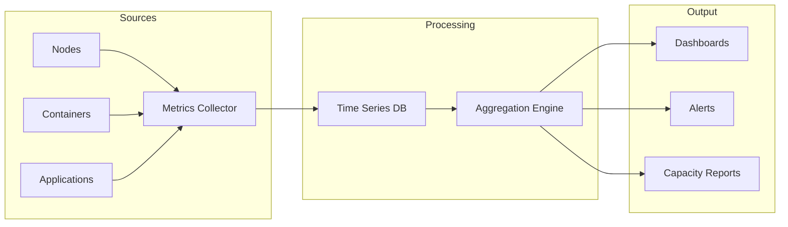
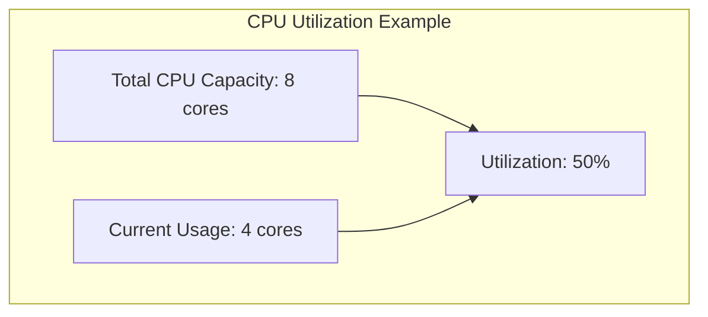
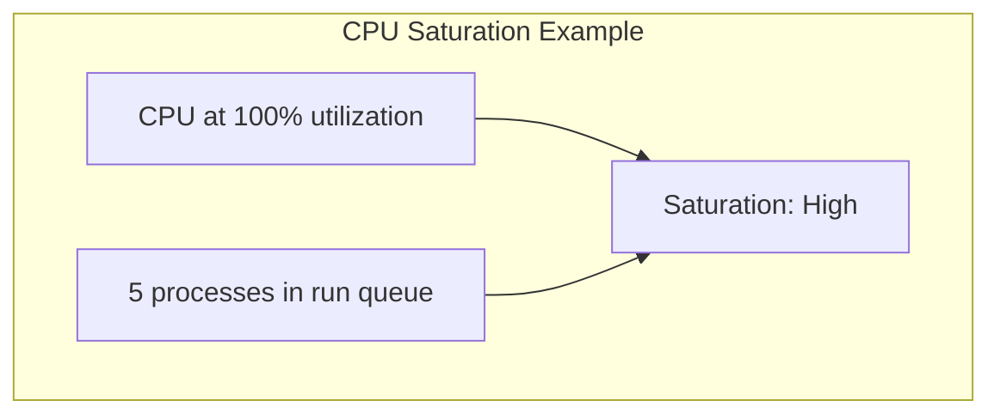
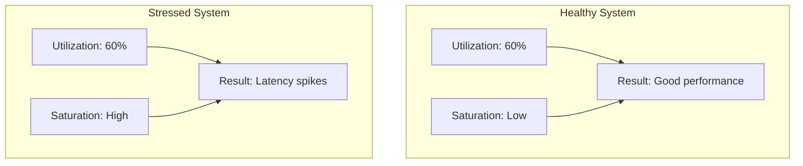
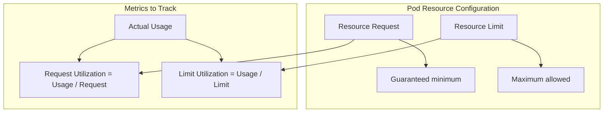
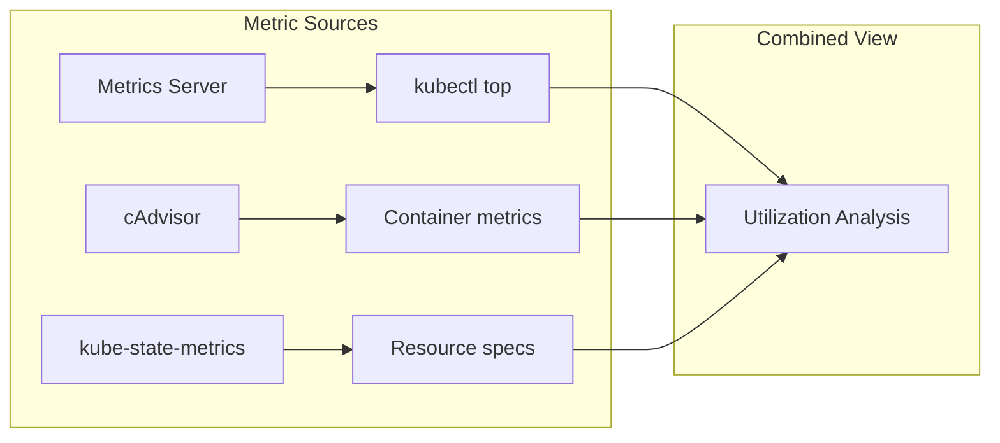
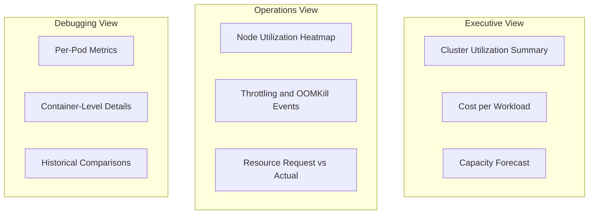

# How to Implement Resource Utilization Tracking

Author: [nawazdhandala](https://github.com/nawazdhandala)

Tags: Capacity Planning, Monitoring, SRE, Infrastructure

Description: Learn how to track resource utilization across infrastructure for effective capacity management.

---

## Introduction

Effective capacity planning requires understanding how your infrastructure resources are being consumed. Resource utilization tracking provides the data foundation for scaling decisions, cost optimization, and preventing performance degradation before it impacts users.

This guide covers the fundamentals of utilization tracking, explains the critical difference between utilization and saturation metrics, and provides practical implementation examples with a focus on Kubernetes environments.

## Why Resource Utilization Tracking Matters

Without visibility into resource consumption patterns, teams often:

- Over-provision infrastructure "just in case," wasting money
- Under-provision and discover capacity issues during peak traffic
- Make scaling decisions based on intuition rather than data
- Miss gradual resource consumption trends until they become critical

Resource utilization tracking transforms capacity planning from reactive firefighting into proactive optimization.

## The Resource Tracking Pipeline

The following diagram illustrates how utilization data flows from infrastructure to actionable insights:



## Utilization vs Saturation: A Critical Distinction

Understanding the difference between utilization and saturation is fundamental to effective resource tracking.

### Utilization

Utilization measures the proportion of a resource's capacity that is actively being used. It answers: "How much of this resource is in use?"



**Characteristics of utilization metrics:**

- Expressed as a percentage (0-100%)
- Measured at a point in time or averaged over an interval
- Does not indicate whether work is waiting

### Saturation

Saturation measures the degree to which a resource has extra work it cannot service. It answers: "Is work queuing up because this resource is a bottleneck?"



**Characteristics of saturation metrics:**

- Often measured as queue depth or wait time
- Can increase even when utilization is below 100%
- A leading indicator of performance degradation

### Why Both Matter

Consider this scenario:

| Metric | Value | Interpretation |
|--------|-------|----------------|
| CPU Utilization | 70% | Seems healthy |
| CPU Run Queue | 15 processes | Work is backing up |

A system can show moderate utilization while being saturated. This happens because:

- Resources may have internal bottlenecks
- Workloads may be uneven across cores
- Short bursts of demand are averaged out in utilization metrics



## Core Resource Metrics to Track

### CPU Metrics

Track both utilization and saturation for CPU:

```yaml
# Prometheus recording rules for CPU metrics
groups:
  - name: cpu_metrics
    rules:
      # CPU utilization as a percentage (0-1)
      # This calculates the rate of non-idle CPU time
      - record: instance:cpu_utilization:ratio
        expr: |
          1 - avg by (instance) (
            rate(node_cpu_seconds_total{mode="idle"}[5m])
          )

      # CPU saturation measured by load average
      # Normalized by the number of CPUs
      - record: instance:cpu_saturation:load_per_cpu
        expr: |
          node_load1 / count by (instance) (
            node_cpu_seconds_total{mode="idle"}
          )

      # CPU run queue length (processes waiting for CPU)
      # Values > 0 indicate saturation
      - record: instance:cpu_saturation:runqueue
        expr: |
          node_procs_running - 1
```

**Key thresholds:**

| Metric | Warning | Critical |
|--------|---------|----------|
| CPU Utilization | > 70% | > 85% |
| Load per CPU | > 0.7 | > 1.0 |
| Run Queue | > 2 per CPU | > 5 per CPU |

### Memory Metrics

Memory requires tracking both usage and pressure indicators:

```yaml
groups:
  - name: memory_metrics
    rules:
      # Memory utilization (used / total)
      # Excludes buffers and cache which can be reclaimed
      - record: instance:memory_utilization:ratio
        expr: |
          1 - (
            (node_memory_MemAvailable_bytes or
             (node_memory_MemFree_bytes + node_memory_Buffers_bytes + node_memory_Cached_bytes))
            / node_memory_MemTotal_bytes
          )

      # Memory saturation via page fault rate
      # High major page faults indicate memory pressure
      - record: instance:memory_saturation:major_faults
        expr: |
          rate(node_vmstat_pgmajfault[5m])

      # Swap usage as a saturation indicator
      # Any swap activity suggests memory pressure
      - record: instance:memory_saturation:swap_activity
        expr: |
          rate(node_vmstat_pswpin[5m]) + rate(node_vmstat_pswpout[5m])
```

### Disk I/O Metrics

Disk performance depends heavily on queue depth:

```yaml
groups:
  - name: disk_metrics
    rules:
      # Disk utilization (percentage of time disk is busy)
      # Based on the weighted time spent doing I/O
      - record: instance:disk_utilization:ratio
        expr: |
          rate(node_disk_io_time_seconds_total[5m])

      # Disk saturation via average queue size
      # Shows how many I/O operations are waiting
      - record: instance:disk_saturation:queue_size
        expr: |
          rate(node_disk_io_time_weighted_seconds_total[5m])
          / rate(node_disk_io_time_seconds_total[5m])

      # I/O wait percentage (CPU time waiting for I/O)
      # Indicates disk bottleneck affecting CPU
      - record: instance:disk_saturation:iowait
        expr: |
          avg by (instance) (
            rate(node_cpu_seconds_total{mode="iowait"}[5m])
          )
```

### Network Metrics

Network utilization and drops indicate capacity issues:

```yaml
groups:
  - name: network_metrics
    rules:
      # Network bandwidth utilization
      # Requires knowing interface speed for percentage
      - record: instance:network_utilization:bytes
        expr: |
          sum by (instance) (
            rate(node_network_receive_bytes_total{device!~"lo|veth.*|docker.*"}[5m])
            + rate(node_network_transmit_bytes_total{device!~"lo|veth.*|docker.*"}[5m])
          )

      # Network saturation via dropped packets
      # Drops indicate buffer overflow
      - record: instance:network_saturation:drops
        expr: |
          sum by (instance) (
            rate(node_network_receive_drop_total[5m])
            + rate(node_network_transmit_drop_total[5m])
          )

      # TCP retransmissions indicate network congestion
      - record: instance:network_saturation:retransmits
        expr: |
          rate(node_netstat_Tcp_RetransSegs[5m])
```

## Kubernetes Resource Tracking

Kubernetes adds layers of complexity with resource requests, limits, and cluster-wide scheduling. Here is how to track resources effectively in Kubernetes environments.

### The Kubernetes Resource Model



### Collecting Kubernetes Metrics

Kubernetes exposes resource metrics through multiple sources:



### Pod-Level Utilization Tracking

Track how pods use their allocated resources:

```yaml
# Prometheus rules for Kubernetes pod metrics
groups:
  - name: kubernetes_pod_metrics
    rules:
      # CPU utilization relative to requests
      # Shows if pods are using what they asked for
      - record: pod:cpu_utilization_vs_request:ratio
        expr: |
          sum by (namespace, pod) (
            rate(container_cpu_usage_seconds_total{container!=""}[5m])
          )
          /
          sum by (namespace, pod) (
            kube_pod_container_resource_requests{resource="cpu"}
          )

      # CPU utilization relative to limits
      # Approaching 1.0 means throttling will occur
      - record: pod:cpu_utilization_vs_limit:ratio
        expr: |
          sum by (namespace, pod) (
            rate(container_cpu_usage_seconds_total{container!=""}[5m])
          )
          /
          sum by (namespace, pod) (
            kube_pod_container_resource_limits{resource="cpu"}
          )

      # Memory utilization relative to requests
      - record: pod:memory_utilization_vs_request:ratio
        expr: |
          sum by (namespace, pod) (
            container_memory_working_set_bytes{container!=""}
          )
          /
          sum by (namespace, pod) (
            kube_pod_container_resource_requests{resource="memory"}
          )

      # Memory utilization relative to limits
      # Approaching 1.0 means OOMKill risk
      - record: pod:memory_utilization_vs_limit:ratio
        expr: |
          sum by (namespace, pod) (
            container_memory_working_set_bytes{container!=""}
          )
          /
          sum by (namespace, pod) (
            kube_pod_container_resource_limits{resource="memory"}
          )
```

### Node-Level Capacity Tracking

Monitor cluster-wide resource availability:

```yaml
groups:
  - name: kubernetes_node_metrics
    rules:
      # Allocatable CPU used by requests
      # Shows scheduling pressure
      - record: node:cpu_request_utilization:ratio
        expr: |
          sum by (node) (
            kube_pod_container_resource_requests{resource="cpu"}
          )
          /
          sum by (node) (
            kube_node_status_allocatable{resource="cpu"}
          )

      # Allocatable memory used by requests
      - record: node:memory_request_utilization:ratio
        expr: |
          sum by (node) (
            kube_pod_container_resource_requests{resource="memory"}
          )
          /
          sum by (node) (
            kube_node_status_allocatable{resource="memory"}
          )

      # Actual CPU utilization on nodes
      - record: node:cpu_actual_utilization:ratio
        expr: |
          sum by (node) (
            rate(container_cpu_usage_seconds_total{container!=""}[5m])
          )
          /
          sum by (node) (
            kube_node_status_allocatable{resource="cpu"}
          )

      # Actual memory utilization on nodes
      - record: node:memory_actual_utilization:ratio
        expr: |
          sum by (node) (
            container_memory_working_set_bytes{container!=""}
          )
          /
          sum by (node) (
            kube_node_status_allocatable{resource="memory"}
          )
```

### Kubernetes CPU Throttling Detection

CPU throttling is a key saturation metric in Kubernetes:

```yaml
groups:
  - name: kubernetes_cpu_throttling
    rules:
      # CPU throttling percentage
      # High throttling indicates the container needs more CPU
      - record: container:cpu_throttling:ratio
        expr: |
          sum by (namespace, pod, container) (
            rate(container_cpu_cfs_throttled_periods_total[5m])
          )
          /
          sum by (namespace, pod, container) (
            rate(container_cpu_cfs_periods_total[5m])
          )
```

### Complete Kubernetes Monitoring Stack

Here is a deployment for comprehensive Kubernetes resource monitoring:

```yaml
# kube-state-metrics deployment for resource specs
apiVersion: apps/v1
kind: Deployment
metadata:
  name: kube-state-metrics
  namespace: monitoring
  labels:
    app: kube-state-metrics
spec:
  replicas: 1
  selector:
    matchLabels:
      app: kube-state-metrics
  template:
    metadata:
      labels:
        app: kube-state-metrics
    spec:
      serviceAccountName: kube-state-metrics
      containers:
        - name: kube-state-metrics
          image: registry.k8s.io/kube-state-metrics/kube-state-metrics:v2.10.0
          ports:
            - name: http-metrics
              containerPort: 8080
            - name: telemetry
              containerPort: 8081
          # Only expose metrics we need for capacity planning
          args:
            - --metric-labels-allowlist=pods=[app,component],nodes=[topology.kubernetes.io/zone]
          resources:
            requests:
              cpu: 100m
              memory: 128Mi
            limits:
              cpu: 200m
              memory: 256Mi
          livenessProbe:
            httpGet:
              path: /healthz
              port: 8080
            initialDelaySeconds: 5
            timeoutSeconds: 5
          readinessProbe:
            httpGet:
              path: /
              port: 8080
            initialDelaySeconds: 5
            timeoutSeconds: 5
---
# ServiceMonitor for Prometheus to scrape kube-state-metrics
apiVersion: monitoring.coreos.com/v1
kind: ServiceMonitor
metadata:
  name: kube-state-metrics
  namespace: monitoring
  labels:
    app: kube-state-metrics
spec:
  selector:
    matchLabels:
      app: kube-state-metrics
  endpoints:
    - port: http-metrics
      interval: 30s
      scrapeTimeout: 10s
    - port: telemetry
      interval: 30s
```

### Namespace-Level Resource Quotas Tracking

Monitor resource quota utilization:

```yaml
groups:
  - name: kubernetes_quota_metrics
    rules:
      # CPU quota utilization by namespace
      - record: namespace:cpu_quota_utilization:ratio
        expr: |
          sum by (namespace) (
            kube_resourcequota{type="used", resource="requests.cpu"}
          )
          /
          sum by (namespace) (
            kube_resourcequota{type="hard", resource="requests.cpu"}
          )

      # Memory quota utilization by namespace
      - record: namespace:memory_quota_utilization:ratio
        expr: |
          sum by (namespace) (
            kube_resourcequota{type="used", resource="requests.memory"}
          )
          /
          sum by (namespace) (
            kube_resourcequota{type="hard", resource="requests.memory"}
          )
```

## Building Capacity Planning Dashboards

Effective dashboards surface the right metrics at the right time:



### Key Dashboard Panels

**Cluster capacity overview:**

```yaml
# Grafana dashboard panel configuration
panels:
  - title: "Cluster CPU Utilization"
    type: gauge
    targets:
      - expr: |
          sum(rate(container_cpu_usage_seconds_total{container!=""}[5m]))
          /
          sum(kube_node_status_allocatable{resource="cpu"})
        legendFormat: "CPU Usage"
    thresholds:
      - value: 0.7
        color: yellow
      - value: 0.85
        color: red

  - title: "Cluster Memory Utilization"
    type: gauge
    targets:
      - expr: |
          sum(container_memory_working_set_bytes{container!=""})
          /
          sum(kube_node_status_allocatable{resource="memory"})
        legendFormat: "Memory Usage"
    thresholds:
      - value: 0.75
        color: yellow
      - value: 0.9
        color: red
```

**Resource efficiency analysis:**

```yaml
panels:
  - title: "Request vs Actual Usage"
    type: timeseries
    targets:
      # CPU requests
      - expr: |
          sum(kube_pod_container_resource_requests{resource="cpu"})
        legendFormat: "CPU Requested"
      # Actual CPU usage
      - expr: |
          sum(rate(container_cpu_usage_seconds_total{container!=""}[5m]))
        legendFormat: "CPU Used"
      # Memory requests
      - expr: |
          sum(kube_pod_container_resource_requests{resource="memory"})
        legendFormat: "Memory Requested"
      # Actual memory usage
      - expr: |
          sum(container_memory_working_set_bytes{container!=""})
        legendFormat: "Memory Used"
```

## Alerting on Capacity Issues

Configure alerts for both utilization and saturation:

```yaml
# Prometheus alerting rules for capacity planning
groups:
  - name: capacity_alerts
    rules:
      # Alert when cluster CPU is consistently high
      - alert: ClusterCPUUtilizationHigh
        expr: |
          (
            sum(rate(container_cpu_usage_seconds_total{container!=""}[5m]))
            /
            sum(kube_node_status_allocatable{resource="cpu"})
          ) > 0.8
        for: 15m
        labels:
          severity: warning
        annotations:
          summary: "Cluster CPU utilization above 80%"
          description: "Consider adding nodes or optimizing workloads"

      # Alert when pods are being throttled
      - alert: HighCPUThrottling
        expr: |
          (
            sum by (namespace, pod) (
              rate(container_cpu_cfs_throttled_periods_total[5m])
            )
            /
            sum by (namespace, pod) (
              rate(container_cpu_cfs_periods_total[5m])
            )
          ) > 0.25
        for: 10m
        labels:
          severity: warning
        annotations:
          summary: "Pod {{ $labels.pod }} is being CPU throttled"
          description: "More than 25% of CPU periods are throttled. Consider increasing CPU limits."

      # Alert when memory is approaching limits
      - alert: PodMemoryApproachingLimit
        expr: |
          (
            sum by (namespace, pod) (container_memory_working_set_bytes{container!=""})
            /
            sum by (namespace, pod) (kube_pod_container_resource_limits{resource="memory"})
          ) > 0.9
        for: 5m
        labels:
          severity: warning
        annotations:
          summary: "Pod {{ $labels.pod }} memory at 90% of limit"
          description: "OOMKill risk is high. Consider increasing memory limits."

      # Alert on scheduling pressure
      - alert: NodeSchedulingPressure
        expr: |
          (
            sum by (node) (kube_pod_container_resource_requests{resource="cpu"})
            /
            sum by (node) (kube_node_status_allocatable{resource="cpu"})
          ) > 0.9
        for: 30m
        labels:
          severity: warning
        annotations:
          summary: "Node {{ $labels.node }} has high CPU request allocation"
          description: "90% of allocatable CPU is requested. New pods may not schedule."
```

## Capacity Forecasting

Use historical data to predict future capacity needs:


### Linear Regression for Forecasting

```yaml
groups:
  - name: capacity_forecasting
    rules:
      # Predict when CPU will reach 100% based on 7-day trend
      - record: cluster:cpu_exhaustion_days:prediction
        expr: |
          (
            (1 - (
              sum(rate(container_cpu_usage_seconds_total{container!=""}[5m]))
              /
              sum(kube_node_status_allocatable{resource="cpu"})
            ))
            /
            deriv(
              sum(rate(container_cpu_usage_seconds_total{container!=""}[5m]))
              /
              sum(kube_node_status_allocatable{resource="cpu"})
              [7d]
            )
          ) / 86400

      # Predict when memory will reach 100%
      - record: cluster:memory_exhaustion_days:prediction
        expr: |
          (
            (1 - (
              sum(container_memory_working_set_bytes{container!=""})
              /
              sum(kube_node_status_allocatable{resource="memory"})
            ))
            /
            deriv(
              sum(container_memory_working_set_bytes{container!=""})
              /
              sum(kube_node_status_allocatable{resource="memory"})
              [7d]
            )
          ) / 86400
```

## Right-Sizing Recommendations

Use utilization data to optimize resource requests:

```python
# right_sizing.py
"""
Analyze pod resource usage and generate right-sizing recommendations.

This script queries Prometheus for historical resource usage and compares
it against resource requests to identify over-provisioned workloads.
"""

import requests
from dataclasses import dataclass
from typing import List

@dataclass
class ResourceRecommendation:
    """Represents a resource right-sizing recommendation."""
    namespace: str
    pod: str
    resource_type: str
    current_request: float
    p95_usage: float
    recommended_request: float
    savings_percent: float

def query_prometheus(query: str, prometheus_url: str) -> dict:
    """
    Execute a PromQL query against Prometheus.

    Args:
        query: The PromQL query string
        prometheus_url: Base URL of the Prometheus server

    Returns:
        The query result as a dictionary
    """
    response = requests.get(
        f"{prometheus_url}/api/v1/query",
        params={"query": query}
    )
    response.raise_for_status()
    return response.json()

def get_cpu_recommendations(
    prometheus_url: str,
    namespace: str = None,
    threshold: float = 0.5
) -> List[ResourceRecommendation]:
    """
    Generate CPU right-sizing recommendations.

    Args:
        prometheus_url: Base URL of the Prometheus server
        namespace: Optional namespace filter
        threshold: Minimum request/usage ratio to flag (default 0.5 = 50% unused)

    Returns:
        List of ResourceRecommendation objects
    """
    # Query for P95 CPU usage over the past 7 days
    usage_query = """
    quantile_over_time(0.95,
      sum by (namespace, pod) (
        rate(container_cpu_usage_seconds_total{container!=""}[5m])
      )[7d:5m]
    )
    """

    # Query for current CPU requests
    request_query = """
    sum by (namespace, pod) (
      kube_pod_container_resource_requests{resource="cpu"}
    )
    """

    usage_result = query_prometheus(usage_query, prometheus_url)
    request_result = query_prometheus(request_query, prometheus_url)

    # Build lookup of requests by namespace/pod
    requests_map = {}
    for item in request_result["data"]["result"]:
        key = (item["metric"]["namespace"], item["metric"]["pod"])
        requests_map[key] = float(item["value"][1])

    recommendations = []

    for item in usage_result["data"]["result"]:
        ns = item["metric"]["namespace"]
        pod = item["metric"]["pod"]

        # Skip if namespace filter is set and does not match
        if namespace and ns != namespace:
            continue

        p95_usage = float(item["value"][1])
        current_request = requests_map.get((ns, pod), 0)

        if current_request == 0:
            continue

        usage_ratio = p95_usage / current_request

        # Flag if usage is below threshold
        if usage_ratio < threshold:
            # Recommend request at 120% of P95 usage for headroom
            recommended = p95_usage * 1.2
            savings = (1 - (recommended / current_request)) * 100

            recommendations.append(ResourceRecommendation(
                namespace=ns,
                pod=pod,
                resource_type="cpu",
                current_request=current_request,
                p95_usage=p95_usage,
                recommended_request=recommended,
                savings_percent=savings
            ))

    return sorted(recommendations, key=lambda x: x.savings_percent, reverse=True)

def generate_report(recommendations: List[ResourceRecommendation]) -> str:
    """
    Generate a human-readable report from recommendations.

    Args:
        recommendations: List of ResourceRecommendation objects

    Returns:
        Formatted report string
    """
    if not recommendations:
        return "No right-sizing recommendations found."

    lines = ["Resource Right-Sizing Recommendations", "=" * 40, ""]

    total_current = 0
    total_recommended = 0

    for rec in recommendations:
        total_current += rec.current_request
        total_recommended += rec.recommended_request

        lines.append(f"Namespace: {rec.namespace}")
        lines.append(f"Pod: {rec.pod}")
        lines.append(f"Resource: {rec.resource_type}")
        lines.append(f"Current Request: {rec.current_request:.3f}")
        lines.append(f"P95 Usage: {rec.p95_usage:.3f}")
        lines.append(f"Recommended: {rec.recommended_request:.3f}")
        lines.append(f"Potential Savings: {rec.savings_percent:.1f}%")
        lines.append("-" * 40)

    overall_savings = (1 - (total_recommended / total_current)) * 100 if total_current > 0 else 0

    lines.append("")
    lines.append(f"Total Current Requests: {total_current:.3f}")
    lines.append(f"Total Recommended: {total_recommended:.3f}")
    lines.append(f"Overall Potential Savings: {overall_savings:.1f}%")

    return "\n".join(lines)

# Example usage:
# recommendations = get_cpu_recommendations("http://prometheus:9090")
# print(generate_report(recommendations))
```

## Implementing Resource Tracking with OpenTelemetry

For custom applications, use OpenTelemetry to expose utilization metrics:

```python
# resource_metrics.py
"""
OpenTelemetry metrics for application resource tracking.

This module sets up custom metrics to track resource utilization
within your application, complementing system-level metrics.
"""

from opentelemetry import metrics
from opentelemetry.sdk.metrics import MeterProvider
from opentelemetry.sdk.metrics.export import PeriodicExportingMetricReader
from opentelemetry.exporter.otlp.proto.grpc.metric_exporter import OTLPMetricExporter
import psutil
import threading
import time

def setup_metrics(service_name: str, otlp_endpoint: str):
    """
    Initialize OpenTelemetry metrics with OTLP exporter.

    Args:
        service_name: Name of the service for metric labels
        otlp_endpoint: OTLP collector endpoint

    Returns:
        Configured Meter instance
    """
    # Configure the OTLP exporter
    exporter = OTLPMetricExporter(endpoint=otlp_endpoint, insecure=True)

    # Create a metric reader that exports every 60 seconds
    reader = PeriodicExportingMetricReader(exporter, export_interval_millis=60000)

    # Set up the meter provider
    provider = MeterProvider(metric_readers=[reader])
    metrics.set_meter_provider(provider)

    return metrics.get_meter(service_name)

class ResourceTracker:
    """
    Tracks and reports resource utilization metrics.

    This class creates gauges for CPU, memory, and custom application
    metrics, updating them periodically in a background thread.
    """

    def __init__(self, meter, update_interval: int = 30):
        """
        Initialize the resource tracker.

        Args:
            meter: OpenTelemetry Meter instance
            update_interval: Seconds between metric updates
        """
        self.meter = meter
        self.update_interval = update_interval
        self._stop_event = threading.Event()

        # Create gauge instruments for resource metrics
        self.cpu_gauge = meter.create_observable_gauge(
            name="app.cpu.utilization",
            description="Application CPU utilization ratio",
            unit="1",
            callbacks=[self._get_cpu_utilization]
        )

        self.memory_gauge = meter.create_observable_gauge(
            name="app.memory.utilization",
            description="Application memory utilization ratio",
            unit="1",
            callbacks=[self._get_memory_utilization]
        )

        self.memory_bytes_gauge = meter.create_observable_gauge(
            name="app.memory.bytes",
            description="Application memory usage in bytes",
            unit="By",
            callbacks=[self._get_memory_bytes]
        )

        # Track open file descriptors as a saturation indicator
        self.fd_gauge = meter.create_observable_gauge(
            name="app.file_descriptors.count",
            description="Number of open file descriptors",
            unit="1",
            callbacks=[self._get_fd_count]
        )

    def _get_cpu_utilization(self, options):
        """Callback to get current CPU utilization."""
        process = psutil.Process()
        # Get CPU percent over a short interval
        cpu_percent = process.cpu_percent(interval=0.1) / 100.0
        yield metrics.Observation(cpu_percent)

    def _get_memory_utilization(self, options):
        """Callback to get current memory utilization."""
        process = psutil.Process()
        memory_info = process.memory_info()
        total_memory = psutil.virtual_memory().total
        utilization = memory_info.rss / total_memory
        yield metrics.Observation(utilization)

    def _get_memory_bytes(self, options):
        """Callback to get memory usage in bytes."""
        process = psutil.Process()
        memory_info = process.memory_info()
        yield metrics.Observation(memory_info.rss)

    def _get_fd_count(self, options):
        """Callback to get open file descriptor count."""
        process = psutil.Process()
        try:
            fd_count = process.num_fds()
        except AttributeError:
            # Windows does not support num_fds
            fd_count = len(process.open_files())
        yield metrics.Observation(fd_count)

# Example usage:
# meter = setup_metrics("my-service", "localhost:4317")
# tracker = ResourceTracker(meter)
# The metrics will be automatically collected and exported
```

## Best Practices Summary

### 1. Track Both Utilization and Saturation

Utilization alone can be misleading. Always pair it with saturation metrics:

| Resource | Utilization Metric | Saturation Metric |
|----------|-------------------|-------------------|
| CPU | Usage percentage | Run queue, throttling |
| Memory | Usage percentage | Page faults, swap activity |
| Disk | I/O time percentage | Queue depth, I/O wait |
| Network | Bandwidth usage | Dropped packets, retransmits |

### 2. Set Appropriate Time Windows

Different decisions require different time windows:

- **Alerting**: 5-15 minute averages to avoid noise
- **Dashboards**: 1-5 minute resolution for current state
- **Capacity planning**: 7-30 day trends for forecasting

### 3. Use Request-Based Metrics in Kubernetes

In Kubernetes, track usage relative to requests and limits:

- Usage / Request shows if pods are getting what they asked for
- Usage / Limit shows risk of throttling or OOMKill
- Request / Allocatable shows scheduling pressure

### 4. Automate Right-Sizing Reviews

Schedule regular reviews of resource efficiency:

- Weekly: Review top 10 over-provisioned workloads
- Monthly: Analyze cluster-wide request vs usage ratios
- Quarterly: Adjust capacity plans based on growth trends

## Conclusion

Effective resource utilization tracking is the foundation of capacity planning. By measuring both utilization and saturation across CPU, memory, disk, and network, you gain the visibility needed to make informed scaling decisions.

In Kubernetes environments, the additional layer of resource requests and limits requires tracking multiple dimensions of utilization. Use the metrics, alerts, and dashboards described in this guide to build a comprehensive view of your infrastructure capacity.

Start with the core metrics, add alerting for critical thresholds, and gradually build toward automated right-sizing recommendations. Your future self will thank you when the next traffic spike arrives and your systems handle it gracefully.

For a unified platform that combines resource metrics with traces, logs, and incident management, consider using OneUptime to correlate capacity signals with application performance and reliability data.
