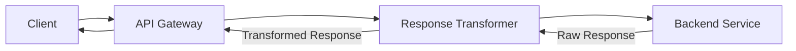
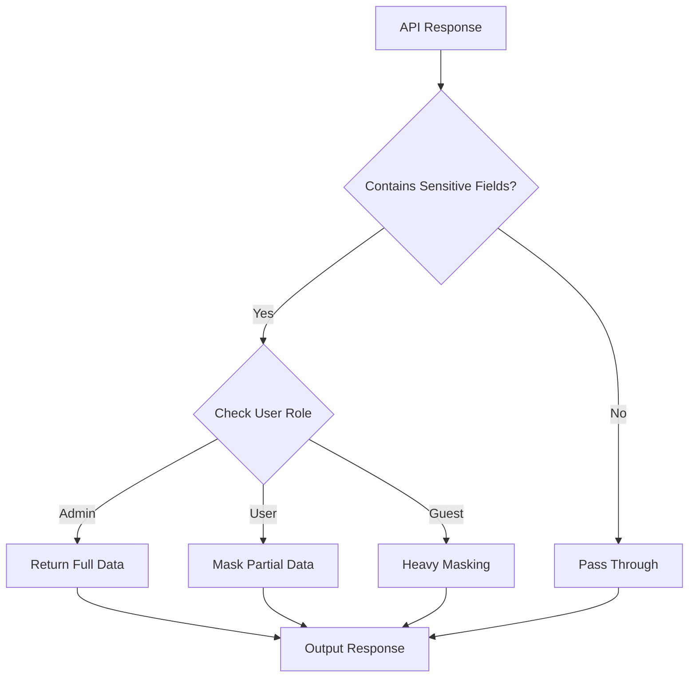
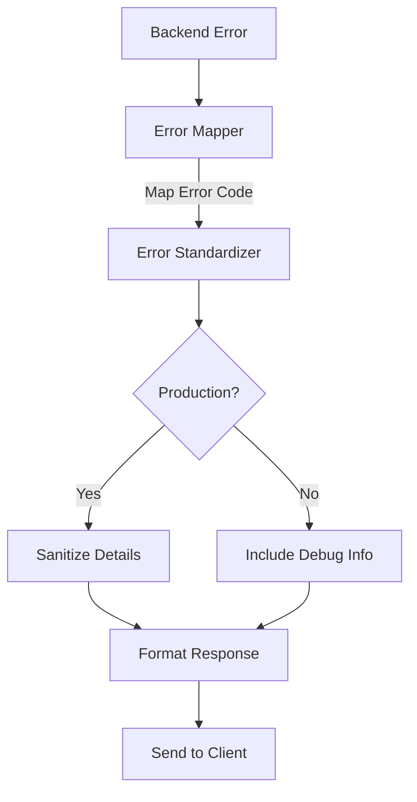
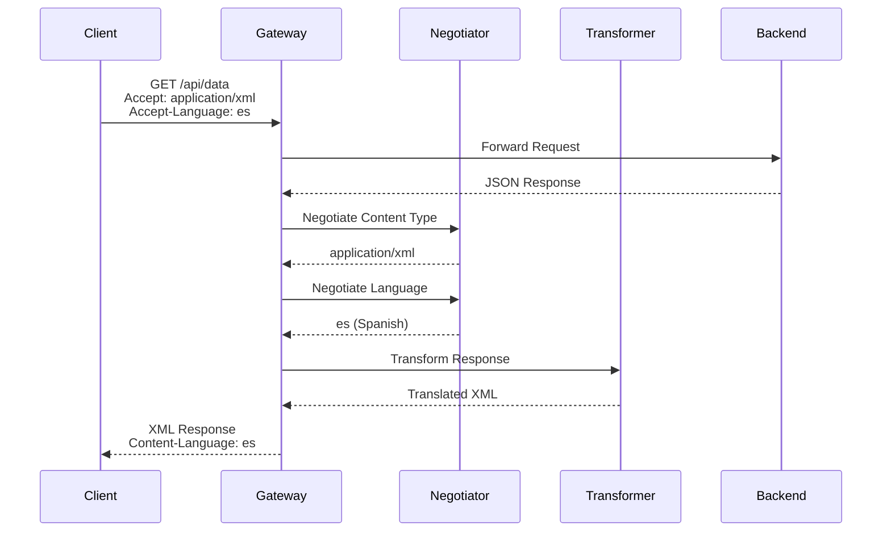

# How to Create Response Transformation

Author: [nawazdhandala](https://github.com/nawazdhandala)

Tags: API Gateway, Transformation, Response, Middleware

Description: Learn how to transform API responses in the gateway layer.

---

Response transformation is a fundamental capability of API gateways that allows you to modify, filter, and restructure API responses before they reach the client. This decouples your backend services from client requirements and enables consistent response formats across diverse microservices.

## Why Transform Responses at the Gateway

API gateways sit between clients and backend services, making them the ideal location for response transformations:

- **Backend isolation**: Modify responses without changing service code
- **Client customization**: Tailor responses for different client types (mobile, web, third-party)
- **Security**: Remove sensitive data before responses leave your infrastructure
- **Consistency**: Standardize response formats across heterogeneous backends



## Response Modification Patterns

Response modification involves changing the structure, content, or format of API responses. Here are common patterns implemented in Node.js gateway middleware.

### Basic Response Wrapper

Wrap all responses in a consistent envelope:

```javascript
function responseWrapper(req, res, next) {
  const originalJson = res.json.bind(res);

  res.json = function(data) {
    const wrapped = {
      success: res.statusCode < 400,
      timestamp: new Date().toISOString(),
      requestId: req.headers['x-request-id'] || crypto.randomUUID(),
      data: data,
    };

    if (res.statusCode >= 400) {
      wrapped.error = data;
      delete wrapped.data;
    }

    return originalJson(wrapped);
  };

  next();
}

app.use(responseWrapper);
```

### Response Body Modification

Transform specific fields in the response:

```javascript
function transformUserResponse(req, res, next) {
  const originalJson = res.json.bind(res);

  res.json = function(data) {
    if (req.path.startsWith('/api/users') && data.user) {
      // Add computed fields
      data.user.fullName = `${data.user.firstName} ${data.user.lastName}`;

      // Convert timestamps to ISO format
      if (data.user.createdAt) {
        data.user.createdAt = new Date(data.user.createdAt).toISOString();
      }

      // Add hypermedia links
      data.user._links = {
        self: `/api/users/${data.user.id}`,
        orders: `/api/users/${data.user.id}/orders`,
        profile: `/api/users/${data.user.id}/profile`,
      };
    }

    return originalJson(data);
  };

  next();
}
```

### Conditional Transformation Based on Client

Different clients may need different response formats:

```javascript
function clientAwareTransformer(req, res, next) {
  const originalJson = res.json.bind(res);
  const clientType = req.headers['x-client-type'] || 'web';

  res.json = function(data) {
    let transformed = data;

    switch (clientType) {
      case 'mobile':
        // Mobile clients get minimal data
        transformed = minimizePayload(data);
        break;

      case 'admin':
        // Admin clients get extra metadata
        transformed = enrichWithMetadata(data, req);
        break;

      case 'legacy':
        // Legacy clients need old format
        transformed = convertToLegacyFormat(data);
        break;
    }

    return originalJson(transformed);
  };

  next();
}

function minimizePayload(data) {
  if (Array.isArray(data)) {
    return data.map(item => ({
      id: item.id,
      name: item.name,
      thumbnail: item.images?.[0]?.thumbnail,
    }));
  }
  return data;
}
```

## Field Filtering and Masking

Field filtering removes unnecessary data, while masking obscures sensitive information.

### Dynamic Field Selection

Allow clients to specify which fields they want:

```javascript
function fieldSelector(req, res, next) {
  const originalJson = res.json.bind(res);
  const requestedFields = req.query.fields?.split(',') || null;

  res.json = function(data) {
    if (!requestedFields) {
      return originalJson(data);
    }

    const filtered = filterFields(data, requestedFields);
    return originalJson(filtered);
  };

  next();
}

function filterFields(data, fields) {
  if (Array.isArray(data)) {
    return data.map(item => filterFields(item, fields));
  }

  if (typeof data !== 'object' || data === null) {
    return data;
  }

  const result = {};

  for (const field of fields) {
    if (field.includes('.')) {
      // Handle nested fields like "user.address.city"
      const [parent, ...rest] = field.split('.');
      if (data[parent]) {
        result[parent] = result[parent] || {};
        Object.assign(result[parent], filterFields(data[parent], [rest.join('.')]));
      }
    } else if (data.hasOwnProperty(field)) {
      result[field] = data[field];
    }
  }

  return result;
}

// Usage: GET /api/users/123?fields=id,name,email,address.city
```

### Sensitive Data Masking

Mask sensitive fields based on user roles:

```javascript
const MASKING_RULES = {
  email: (value, role) => {
    if (role === 'admin') return value;
    const [local, domain] = value.split('@');
    return `${local[0]}***@${domain}`;
  },

  phone: (value, role) => {
    if (role === 'admin') return value;
    return value.replace(/(\d{3})\d{4}(\d{4})/, '$1****$2');
  },

  ssn: (value, role) => {
    if (role === 'admin') return value;
    return '***-**-' + value.slice(-4);
  },

  creditCard: (value, role) => {
    return '**** **** **** ' + value.slice(-4);
  },
};

function dataMasker(req, res, next) {
  const originalJson = res.json.bind(res);
  const userRole = req.user?.role || 'guest';

  res.json = function(data) {
    const masked = maskSensitiveData(data, userRole);
    return originalJson(masked);
  };

  next();
}

function maskSensitiveData(data, role, depth = 0) {
  if (depth > 10) return data; // Prevent infinite recursion

  if (Array.isArray(data)) {
    return data.map(item => maskSensitiveData(item, role, depth + 1));
  }

  if (typeof data !== 'object' || data === null) {
    return data;
  }

  const result = {};

  for (const [key, value] of Object.entries(data)) {
    if (MASKING_RULES[key]) {
      result[key] = MASKING_RULES[key](value, role);
    } else if (typeof value === 'object') {
      result[key] = maskSensitiveData(value, role, depth + 1);
    } else {
      result[key] = value;
    }
  }

  return result;
}
```



### Field Exclusion for Security

Remove fields that should never be exposed:

```javascript
const EXCLUDED_FIELDS = [
  'password',
  'passwordHash',
  'salt',
  'internalId',
  'apiKey',
  'secretToken',
  '__v',
  '_metadata',
];

function fieldExcluder(req, res, next) {
  const originalJson = res.json.bind(res);

  res.json = function(data) {
    const sanitized = removeExcludedFields(data);
    return originalJson(sanitized);
  };

  next();
}

function removeExcludedFields(data) {
  if (Array.isArray(data)) {
    return data.map(removeExcludedFields);
  }

  if (typeof data !== 'object' || data === null) {
    return data;
  }

  const result = {};

  for (const [key, value] of Object.entries(data)) {
    if (EXCLUDED_FIELDS.includes(key)) {
      continue;
    }

    if (typeof value === 'object') {
      result[key] = removeExcludedFields(value);
    } else {
      result[key] = value;
    }
  }

  return result;
}
```

## Format Conversion

API gateways can convert response formats to match client expectations.

### JSON to XML Conversion

```javascript
const js2xmlparser = require('js2xmlparser');

function formatNegotiator(req, res, next) {
  const originalJson = res.json.bind(res);
  const acceptHeader = req.headers['accept'] || 'application/json';

  res.json = function(data) {
    if (acceptHeader.includes('application/xml')) {
      res.type('application/xml');
      const xml = js2xmlparser.parse('response', data);
      return res.send(xml);
    }

    if (acceptHeader.includes('text/csv') && Array.isArray(data)) {
      res.type('text/csv');
      const csv = convertToCSV(data);
      return res.send(csv);
    }

    return originalJson(data);
  };

  next();
}

function convertToCSV(data) {
  if (!data.length) return '';

  const headers = Object.keys(data[0]);
  const rows = data.map(row =>
    headers.map(header => {
      const value = row[header];
      // Escape quotes and wrap in quotes if contains comma
      if (typeof value === 'string' && (value.includes(',') || value.includes('"'))) {
        return `"${value.replace(/"/g, '""')}"`;
      }
      return value;
    }).join(',')
  );

  return [headers.join(','), ...rows].join('\n');
}
```

### Version-Based Format Transformation

Support multiple API versions through response transformation:

```javascript
function versionTransformer(req, res, next) {
  const originalJson = res.json.bind(res);
  const apiVersion = req.headers['api-version'] || 'v2';

  res.json = function(data) {
    let transformed = data;

    if (apiVersion === 'v1') {
      transformed = transformToV1(data, req.path);
    }

    return originalJson(transformed);
  };

  next();
}

function transformToV1(data, path) {
  // V1 used snake_case, V2 uses camelCase
  const snakeCased = toSnakeCase(data);

  // V1 had different field names
  if (path.includes('/users')) {
    return {
      user_id: snakeCased.id,
      user_name: snakeCased.username,
      email_address: snakeCased.email,
      created_date: snakeCased.created_at,
    };
  }

  return snakeCased;
}

function toSnakeCase(obj) {
  if (Array.isArray(obj)) {
    return obj.map(toSnakeCase);
  }

  if (typeof obj !== 'object' || obj === null) {
    return obj;
  }

  const result = {};
  for (const [key, value] of Object.entries(obj)) {
    const snakeKey = key.replace(/[A-Z]/g, letter => `_${letter.toLowerCase()}`);
    result[snakeKey] = toSnakeCase(value);
  }

  return result;
}
```

## Error Response Standardization

Consistent error responses improve client-side error handling and debugging.

### Unified Error Format

```javascript
class APIError extends Error {
  constructor(message, statusCode, code, details = null) {
    super(message);
    this.statusCode = statusCode;
    this.code = code;
    this.details = details;
  }
}

function errorStandardizer(err, req, res, next) {
  // Default error values
  let statusCode = err.statusCode || 500;
  let code = err.code || 'INTERNAL_ERROR';
  let message = err.message || 'An unexpected error occurred';
  let details = err.details || null;

  // Map common error types
  if (err.name === 'ValidationError') {
    statusCode = 400;
    code = 'VALIDATION_ERROR';
    details = err.errors;
  } else if (err.name === 'UnauthorizedError') {
    statusCode = 401;
    code = 'UNAUTHORIZED';
    message = 'Authentication required';
  } else if (err.code === 'ECONNREFUSED') {
    statusCode = 503;
    code = 'SERVICE_UNAVAILABLE';
    message = 'Service temporarily unavailable';
  }

  // Standardized error response
  const errorResponse = {
    success: false,
    error: {
      code,
      message: process.env.NODE_ENV === 'production' && statusCode === 500
        ? 'An unexpected error occurred'
        : message,
      details: process.env.NODE_ENV === 'production' ? null : details,
      timestamp: new Date().toISOString(),
      requestId: req.headers['x-request-id'],
      path: req.path,
    },
  };

  // Add stack trace in development
  if (process.env.NODE_ENV !== 'production') {
    errorResponse.error.stack = err.stack;
  }

  res.status(statusCode).json(errorResponse);
}

app.use(errorStandardizer);
```

### Error Code Mapping

Map backend errors to client-friendly error codes:

```javascript
const ERROR_CODE_MAP = {
  'ER_DUP_ENTRY': {
    code: 'DUPLICATE_RESOURCE',
    message: 'A resource with this identifier already exists',
    statusCode: 409,
  },
  'ER_NO_REFERENCED_ROW': {
    code: 'INVALID_REFERENCE',
    message: 'Referenced resource does not exist',
    statusCode: 400,
  },
  'ECONNRESET': {
    code: 'UPSTREAM_TIMEOUT',
    message: 'Upstream service connection was reset',
    statusCode: 504,
  },
  'ETIMEDOUT': {
    code: 'UPSTREAM_TIMEOUT',
    message: 'Upstream service request timed out',
    statusCode: 504,
  },
};

function errorMapper(err, req, res, next) {
  const mapping = ERROR_CODE_MAP[err.code] || ERROR_CODE_MAP[err.errno];

  if (mapping) {
    err.code = mapping.code;
    err.message = mapping.message;
    err.statusCode = mapping.statusCode;
  }

  next(err);
}

app.use(errorMapper);
app.use(errorStandardizer);
```



## Header Injection

Headers communicate metadata about responses, caching policies, and security controls.

### Security Headers

```javascript
function securityHeaders(req, res, next) {
  // Prevent clickjacking
  res.setHeader('X-Frame-Options', 'DENY');

  // XSS protection
  res.setHeader('X-Content-Type-Options', 'nosniff');
  res.setHeader('X-XSS-Protection', '1; mode=block');

  // Content Security Policy
  res.setHeader('Content-Security-Policy', "default-src 'self'");

  // HSTS
  res.setHeader('Strict-Transport-Security', 'max-age=31536000; includeSubDomains');

  // Remove server fingerprinting
  res.removeHeader('X-Powered-By');

  next();
}

app.use(securityHeaders);
```

### Response Metadata Headers

```javascript
function metadataHeaders(req, res, next) {
  const originalJson = res.json.bind(res);
  const startTime = Date.now();

  res.json = function(data) {
    // Response timing
    res.setHeader('X-Response-Time', `${Date.now() - startTime}ms`);

    // Request tracking
    res.setHeader('X-Request-Id', req.headers['x-request-id'] || crypto.randomUUID());

    // Pagination metadata
    if (data.pagination) {
      res.setHeader('X-Total-Count', data.pagination.total);
      res.setHeader('X-Page', data.pagination.page);
      res.setHeader('X-Per-Page', data.pagination.perPage);
      res.setHeader('X-Total-Pages', Math.ceil(data.pagination.total / data.pagination.perPage));

      // Link header for pagination navigation
      const links = buildPaginationLinks(req, data.pagination);
      if (links) {
        res.setHeader('Link', links);
      }
    }

    // Rate limit info
    if (req.rateLimit) {
      res.setHeader('X-RateLimit-Limit', req.rateLimit.limit);
      res.setHeader('X-RateLimit-Remaining', req.rateLimit.remaining);
      res.setHeader('X-RateLimit-Reset', req.rateLimit.reset);
    }

    return originalJson(data);
  };

  next();
}

function buildPaginationLinks(req, pagination) {
  const baseUrl = `${req.protocol}://${req.get('host')}${req.baseUrl}${req.path}`;
  const links = [];

  if (pagination.page > 1) {
    links.push(`<${baseUrl}?page=${pagination.page - 1}>; rel="prev"`);
    links.push(`<${baseUrl}?page=1>; rel="first"`);
  }

  const totalPages = Math.ceil(pagination.total / pagination.perPage);
  if (pagination.page < totalPages) {
    links.push(`<${baseUrl}?page=${pagination.page + 1}>; rel="next"`);
    links.push(`<${baseUrl}?page=${totalPages}>; rel="last"`);
  }

  return links.join(', ');
}
```

### Caching Headers

```javascript
const CACHE_RULES = {
  '/api/products': { maxAge: 3600, public: true },
  '/api/categories': { maxAge: 86400, public: true },
  '/api/users/:id': { maxAge: 0, private: true },
  '/api/orders': { maxAge: 0, noStore: true },
};

function cacheHeaders(req, res, next) {
  const originalJson = res.json.bind(res);

  res.json = function(data) {
    // Find matching cache rule
    const rule = findCacheRule(req.path);

    if (rule) {
      const directives = [];

      if (rule.noStore) {
        directives.push('no-store');
      } else {
        directives.push(rule.public ? 'public' : 'private');
        directives.push(`max-age=${rule.maxAge}`);

        if (rule.staleWhileRevalidate) {
          directives.push(`stale-while-revalidate=${rule.staleWhileRevalidate}`);
        }
      }

      res.setHeader('Cache-Control', directives.join(', '));

      // ETag for conditional requests
      if (rule.maxAge > 0) {
        const etag = generateETag(data);
        res.setHeader('ETag', etag);

        if (req.headers['if-none-match'] === etag) {
          return res.status(304).end();
        }
      }
    }

    return originalJson(data);
  };

  next();
}

function generateETag(data) {
  const hash = crypto
    .createHash('md5')
    .update(JSON.stringify(data))
    .digest('hex');
  return `"${hash}"`;
}
```

## Content Negotiation

Content negotiation allows clients to request their preferred response format.

### Accept Header Handling

```javascript
const contentTypes = {
  'application/json': serializeJson,
  'application/xml': serializeXml,
  'text/csv': serializeCsv,
  'application/yaml': serializeYaml,
  'text/html': serializeHtml,
};

function contentNegotiator(req, res, next) {
  const originalJson = res.json.bind(res);

  res.json = function(data) {
    const acceptHeader = req.headers['accept'] || '*/*';
    const preferredType = negotiateContentType(acceptHeader);

    if (!preferredType) {
      return res.status(406).json({
        error: 'Not Acceptable',
        message: `Supported formats: ${Object.keys(contentTypes).join(', ')}`,
      });
    }

    const serializer = contentTypes[preferredType];
    const serialized = serializer(data);

    res.type(preferredType);
    return res.send(serialized);
  };

  next();
}

function negotiateContentType(acceptHeader) {
  const accepted = acceptHeader.split(',').map(type => {
    const [mime, ...params] = type.trim().split(';');
    const quality = params.find(p => p.trim().startsWith('q='));
    return {
      type: mime.trim(),
      quality: quality ? parseFloat(quality.split('=')[1]) : 1,
    };
  }).sort((a, b) => b.quality - a.quality);

  for (const { type } of accepted) {
    if (type === '*/*') return 'application/json';
    if (contentTypes[type]) return type;

    // Handle wildcards like application/*
    if (type.endsWith('/*')) {
      const prefix = type.slice(0, -1);
      const match = Object.keys(contentTypes).find(ct => ct.startsWith(prefix));
      if (match) return match;
    }
  }

  return null;
}

function serializeJson(data) {
  return JSON.stringify(data, null, 2);
}

function serializeXml(data) {
  return js2xmlparser.parse('response', data);
}

function serializeCsv(data) {
  if (!Array.isArray(data)) {
    data = [data];
  }
  const headers = Object.keys(data[0] || {});
  const rows = data.map(row =>
    headers.map(h => JSON.stringify(row[h] ?? '')).join(',')
  );
  return [headers.join(','), ...rows].join('\n');
}

function serializeYaml(data) {
  const yaml = require('js-yaml');
  return yaml.dump(data);
}

function serializeHtml(data) {
  return `<!DOCTYPE html>
<html>
<head><title>API Response</title></head>
<body><pre>${JSON.stringify(data, null, 2)}</pre></body>
</html>`;
}
```

### Language-Based Content

```javascript
const translations = {
  en: {
    'error.not_found': 'Resource not found',
    'error.unauthorized': 'Authentication required',
    'success.created': 'Resource created successfully',
  },
  es: {
    'error.not_found': 'Recurso no encontrado',
    'error.unauthorized': 'Autenticacion requerida',
    'success.created': 'Recurso creado exitosamente',
  },
  fr: {
    'error.not_found': 'Ressource non trouvee',
    'error.unauthorized': 'Authentification requise',
    'success.created': 'Ressource creee avec succes',
  },
};

function languageNegotiator(req, res, next) {
  const originalJson = res.json.bind(res);
  const acceptLanguage = req.headers['accept-language'] || 'en';
  const preferredLanguage = negotiateLanguage(acceptLanguage);

  res.json = function(data) {
    const translated = translateResponse(data, preferredLanguage);
    res.setHeader('Content-Language', preferredLanguage);
    return originalJson(translated);
  };

  next();
}

function negotiateLanguage(acceptLanguage) {
  const languages = acceptLanguage.split(',').map(lang => {
    const [code, ...params] = lang.trim().split(';');
    const quality = params.find(p => p.trim().startsWith('q='));
    return {
      code: code.trim().split('-')[0], // Get primary language tag
      quality: quality ? parseFloat(quality.split('=')[1]) : 1,
    };
  }).sort((a, b) => b.quality - a.quality);

  for (const { code } of languages) {
    if (translations[code]) return code;
  }

  return 'en';
}

function translateResponse(data, lang) {
  if (typeof data !== 'object' || data === null) {
    return data;
  }

  const result = Array.isArray(data) ? [] : {};

  for (const [key, value] of Object.entries(data)) {
    if (key === 'message' && typeof value === 'string') {
      // Check if it is a translation key
      const translationKey = value.startsWith('error.') || value.startsWith('success.')
        ? value
        : null;

      if (translationKey && translations[lang]?.[translationKey]) {
        result[key] = translations[lang][translationKey];
      } else {
        result[key] = value;
      }
    } else if (typeof value === 'object') {
      result[key] = translateResponse(value, lang);
    } else {
      result[key] = value;
    }
  }

  return result;
}
```



## Complete Response Transformation Pipeline

Here is a complete example combining all transformation patterns:

```javascript
const express = require('express');
const crypto = require('crypto');

const app = express();

// Transformation pipeline
class ResponseTransformer {
  constructor() {
    this.transformers = [];
  }

  use(transformer) {
    this.transformers.push(transformer);
    return this;
  }

  async transform(data, context) {
    let result = data;

    for (const transformer of this.transformers) {
      result = await transformer(result, context);
    }

    return result;
  }
}

// Create transformer instance
const transformer = new ResponseTransformer();

// Add transformers
transformer
  .use(excludeSensitiveFields)
  .use(maskPII)
  .use(addHypermediaLinks)
  .use(wrapResponse);

// Middleware
function transformResponse(req, res, next) {
  const originalJson = res.json.bind(res);

  res.json = async function(data) {
    const context = {
      req,
      res,
      user: req.user,
      path: req.path,
      method: req.method,
    };

    try {
      const transformed = await transformer.transform(data, context);
      return originalJson(transformed);
    } catch (error) {
      console.error('Transformation error:', error);
      return originalJson(data);
    }
  };

  next();
}

// Individual transformer functions
function excludeSensitiveFields(data, context) {
  const exclude = ['password', 'passwordHash', 'salt', 'apiKey', '__v'];
  return removeFields(data, exclude);
}

function maskPII(data, context) {
  if (context.user?.role === 'admin') return data;

  return applyMasking(data, {
    email: (v) => v.replace(/(.{2}).*(@.*)/, '$1***$2'),
    phone: (v) => v.replace(/(\d{3})\d{4}(\d{4})/, '$1****$2'),
    ssn: (v) => '***-**-' + v.slice(-4),
  });
}

function addHypermediaLinks(data, context) {
  if (Array.isArray(data)) {
    return data.map((item, index) => addLinks(item, context));
  }
  return addLinks(data, context);
}

function addLinks(item, context) {
  if (!item.id) return item;

  return {
    ...item,
    _links: {
      self: { href: `${context.path}/${item.id}` },
    },
  };
}

function wrapResponse(data, context) {
  return {
    success: true,
    timestamp: new Date().toISOString(),
    requestId: context.req.headers['x-request-id'] || crypto.randomUUID(),
    data,
  };
}

// Apply middleware
app.use(transformResponse);

// Routes
app.get('/api/users', async (req, res) => {
  const users = await fetchUsers();
  res.json(users);
});

app.listen(3000);
```

## Summary

| Transformation Type | Use Case | Implementation |
|---------------------|----------|----------------|
| **Response Modification** | Consistent envelope, computed fields | Wrap res.json |
| **Field Filtering** | Client-specified fields, minimal payloads | Query param parsing |
| **Data Masking** | PII protection, role-based visibility | Recursive field masking |
| **Format Conversion** | XML, CSV, YAML output | Content-Type negotiation |
| **Error Standardization** | Consistent error format | Error middleware |
| **Header Injection** | Caching, security, metadata | Response header setting |
| **Content Negotiation** | Multi-format, multi-language | Accept header parsing |

Response transformation at the API gateway layer provides a powerful abstraction between your backend services and clients. By implementing these patterns, you can maintain clean backend code while delivering tailored responses that meet diverse client requirements, security policies, and API versioning needs.
