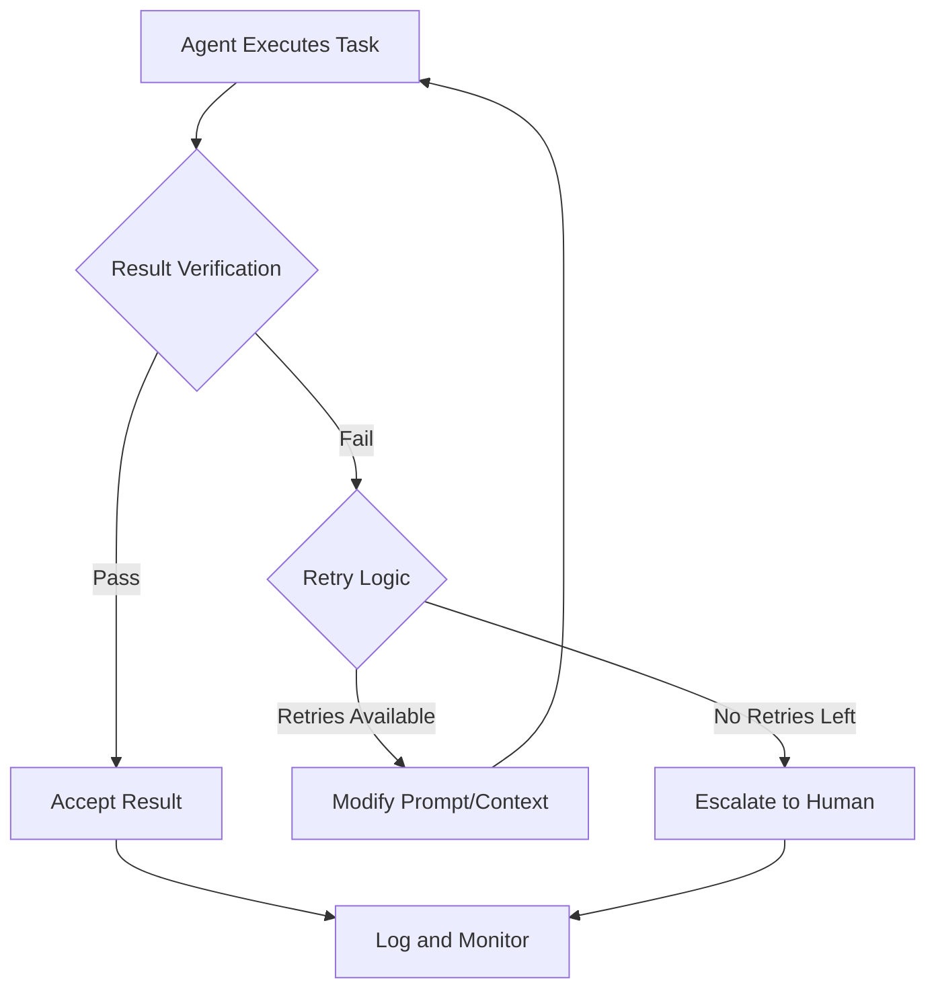
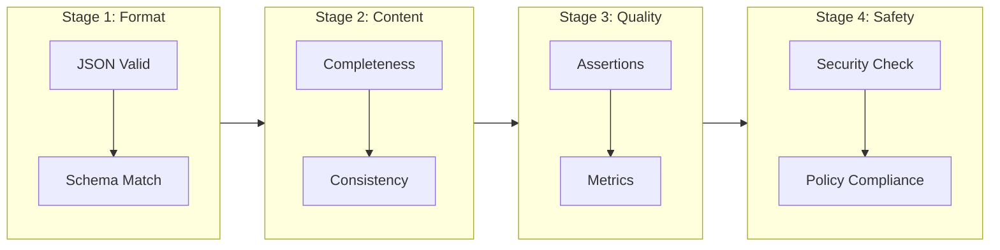
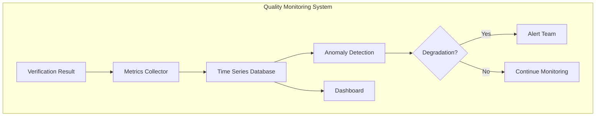

# How to Build Result Verification

Author: [nawazdhandala](https://github.com/nawazdhandala)

Tags: AI Agents, Result Verification, Quality Assurance, Testing

Description: Learn to implement result verification for AI agents with output validation, assertion checking, and automated quality gates for reliable agent execution.

---

AI agents are becoming increasingly powerful, but with that power comes the critical need for robust result verification. When an agent performs tasks autonomously - whether generating code, analyzing data, or making decisions - you need confidence that the outputs are correct, safe, and meet your quality standards. This post explores practical strategies for building comprehensive result verification systems.

## Why Result Verification Matters

AI agents can fail in subtle ways. They might return syntactically correct but semantically wrong results, hallucinate information, or produce outputs that work in testing but fail in production. Result verification acts as a safety net that catches these issues before they cause problems.



## Core Verification Strategies

### 1. Schema Validation

The first line of defense is ensuring outputs conform to expected structures. Schema validation catches malformed responses before they enter your system.

```python
from pydantic import BaseModel, Field, validator
from typing import List, Optional
from enum import Enum

class TaskStatus(str, Enum):
    PENDING = "pending"
    IN_PROGRESS = "in_progress"
    COMPLETED = "completed"
    FAILED = "failed"

class AgentResult(BaseModel):
    """Schema for validating agent task results."""

    task_id: str = Field(..., min_length=1, max_length=64)
    status: TaskStatus
    output: str = Field(..., min_length=1)
    confidence_score: float = Field(..., ge=0.0, le=1.0)
    reasoning_steps: List[str] = Field(default_factory=list)
    metadata: Optional[dict] = None

    @validator('output')
    def output_not_empty_or_placeholder(cls, v):
        placeholder_patterns = ['TODO', 'PLACEHOLDER', 'INSERT HERE']
        for pattern in placeholder_patterns:
            if pattern in v.upper():
                raise ValueError(f'Output contains placeholder text: {pattern}')
        return v

    @validator('confidence_score')
    def confidence_must_be_reasonable(cls, v, values):
        # Flag suspiciously high confidence for complex tasks
        if v > 0.99 and len(values.get('reasoning_steps', [])) < 3:
            raise ValueError('High confidence requires detailed reasoning')
        return v

def validate_agent_result(raw_result: dict) -> AgentResult:
    """Validate and parse agent result with detailed error reporting."""
    try:
        return AgentResult(**raw_result)
    except Exception as e:
        raise ValidationError(f"Result validation failed: {e}")
```

This schema enforces structure while also catching semantic issues like placeholder text or unreasonable confidence scores.

### 2. Assertion-Based Verification

Assertions check specific properties that must hold true for valid results. Think of them as unit tests for agent outputs.

```python
from typing import Callable, List, Any
from dataclasses import dataclass

@dataclass
class Assertion:
    name: str
    check: Callable[[Any], bool]
    error_message: str
    severity: str = "error"  # "error", "warning", "info"

class AssertionEngine:
    """Engine for running assertions against agent results."""

    def __init__(self):
        self.assertions: List[Assertion] = []
        self.results: List[dict] = []

    def add_assertion(self, assertion: Assertion):
        self.assertions.append(assertion)
        return self

    def verify(self, result: Any) -> dict:
        """Run all assertions and return verification report."""
        passed = []
        failed = []
        warnings = []

        for assertion in self.assertions:
            try:
                if assertion.check(result):
                    passed.append(assertion.name)
                else:
                    if assertion.severity == "error":
                        failed.append({
                            "name": assertion.name,
                            "message": assertion.error_message
                        })
                    else:
                        warnings.append({
                            "name": assertion.name,
                            "message": assertion.error_message,
                            "severity": assertion.severity
                        })
            except Exception as e:
                failed.append({
                    "name": assertion.name,
                    "message": f"Assertion raised exception: {e}"
                })

        return {
            "passed": passed,
            "failed": failed,
            "warnings": warnings,
            "is_valid": len(failed) == 0,
            "pass_rate": len(passed) / len(self.assertions) if self.assertions else 0
        }

# Example usage for code generation verification
code_assertions = AssertionEngine()

code_assertions.add_assertion(Assertion(
    name="no_syntax_errors",
    check=lambda r: is_valid_syntax(r.output),
    error_message="Generated code has syntax errors"
))

code_assertions.add_assertion(Assertion(
    name="no_dangerous_imports",
    check=lambda r: not any(imp in r.output for imp in ['os.system', 'subprocess', 'eval(']),
    error_message="Code contains potentially dangerous operations"
))

code_assertions.add_assertion(Assertion(
    name="has_docstrings",
    check=lambda r: '"""' in r.output or "'''" in r.output,
    error_message="Code lacks documentation",
    severity="warning"
))
```

### 3. Multi-Stage Verification Pipeline

Complex tasks benefit from a staged verification approach where each stage builds on the previous.



```python
from abc import ABC, abstractmethod
from typing import Tuple, Optional

class VerificationStage(ABC):
    """Base class for verification pipeline stages."""

    @abstractmethod
    def verify(self, result: Any, context: dict) -> Tuple[bool, Optional[str]]:
        """Return (passed, error_message)."""
        pass

class FormatVerificationStage(VerificationStage):
    def __init__(self, schema_class):
        self.schema_class = schema_class

    def verify(self, result: Any, context: dict) -> Tuple[bool, Optional[str]]:
        try:
            validated = self.schema_class(**result)
            context['validated_result'] = validated
            return True, None
        except Exception as e:
            return False, f"Format verification failed: {e}"

class ContentVerificationStage(VerificationStage):
    def __init__(self, required_fields: List[str]):
        self.required_fields = required_fields

    def verify(self, result: Any, context: dict) -> Tuple[bool, Optional[str]]:
        validated = context.get('validated_result')
        if not validated:
            return False, "No validated result from previous stage"

        missing = []
        for field in self.required_fields:
            value = getattr(validated, field, None)
            if value is None or (isinstance(value, str) and not value.strip()):
                missing.append(field)

        if missing:
            return False, f"Missing required content: {missing}"
        return True, None

class QualityVerificationStage(VerificationStage):
    def __init__(self, assertion_engine: AssertionEngine, min_pass_rate: float = 0.8):
        self.assertion_engine = assertion_engine
        self.min_pass_rate = min_pass_rate

    def verify(self, result: Any, context: dict) -> Tuple[bool, Optional[str]]:
        validated = context.get('validated_result')
        report = self.assertion_engine.verify(validated)
        context['quality_report'] = report

        if not report['is_valid']:
            return False, f"Quality assertions failed: {report['failed']}"
        if report['pass_rate'] < self.min_pass_rate:
            return False, f"Pass rate {report['pass_rate']:.1%} below threshold {self.min_pass_rate:.1%}"
        return True, None

class VerificationPipeline:
    """Orchestrates multi-stage verification."""

    def __init__(self):
        self.stages: List[Tuple[str, VerificationStage]] = []

    def add_stage(self, name: str, stage: VerificationStage):
        self.stages.append((name, stage))
        return self

    def run(self, result: Any) -> dict:
        context = {}
        stage_results = []

        for name, stage in self.stages:
            passed, error = stage.verify(result, context)
            stage_results.append({
                "stage": name,
                "passed": passed,
                "error": error
            })

            if not passed:
                return {
                    "overall_passed": False,
                    "failed_at_stage": name,
                    "stage_results": stage_results,
                    "context": context
                }

        return {
            "overall_passed": True,
            "stage_results": stage_results,
            "context": context
        }
```

## Quality Metrics and Monitoring

Beyond pass/fail verification, tracking quality metrics over time helps identify degradation patterns and optimization opportunities.

```python
from datetime import datetime
from collections import defaultdict
import statistics

class QualityMetricsCollector:
    """Collects and analyzes verification metrics over time."""

    def __init__(self):
        self.metrics = defaultdict(list)
        self.verification_history = []

    def record_verification(self, task_type: str, result: dict, duration_ms: float):
        """Record a verification result with metadata."""
        record = {
            "timestamp": datetime.utcnow().isoformat(),
            "task_type": task_type,
            "passed": result.get("overall_passed", False),
            "duration_ms": duration_ms,
            "stage_results": result.get("stage_results", []),
            "quality_report": result.get("context", {}).get("quality_report", {})
        }
        self.verification_history.append(record)

        # Update aggregate metrics
        self.metrics[f"{task_type}_pass_rate"].append(1 if record["passed"] else 0)
        self.metrics[f"{task_type}_duration"].append(duration_ms)

        if "quality_report" in record and record["quality_report"]:
            self.metrics[f"{task_type}_assertion_pass_rate"].append(
                record["quality_report"].get("pass_rate", 0)
            )

    def get_summary(self, task_type: str = None) -> dict:
        """Generate summary statistics for metrics."""
        summary = {}

        for metric_name, values in self.metrics.items():
            if task_type and not metric_name.startswith(task_type):
                continue
            if not values:
                continue

            summary[metric_name] = {
                "count": len(values),
                "mean": statistics.mean(values),
                "median": statistics.median(values),
                "std_dev": statistics.stdev(values) if len(values) > 1 else 0,
                "min": min(values),
                "max": max(values)
            }

        return summary

    def detect_degradation(self, task_type: str, window_size: int = 100) -> dict:
        """Detect if recent verification performance has degraded."""
        key = f"{task_type}_pass_rate"
        values = self.metrics.get(key, [])

        if len(values) < window_size * 2:
            return {"degradation_detected": False, "reason": "Insufficient data"}

        older_window = values[-window_size*2:-window_size]
        recent_window = values[-window_size:]

        older_rate = statistics.mean(older_window)
        recent_rate = statistics.mean(recent_window)

        threshold = 0.1  # 10% degradation threshold
        degraded = (older_rate - recent_rate) > threshold

        return {
            "degradation_detected": degraded,
            "older_pass_rate": older_rate,
            "recent_pass_rate": recent_rate,
            "change": recent_rate - older_rate
        }
```



## Intelligent Retry Logic

When verification fails, smart retry logic can often recover by adjusting the agent's approach.

```python
from enum import Enum
from typing import Callable, Optional
import time
import random

class RetryStrategy(Enum):
    IMMEDIATE = "immediate"
    LINEAR_BACKOFF = "linear_backoff"
    EXPONENTIAL_BACKOFF = "exponential_backoff"
    JITTERED_BACKOFF = "jittered_backoff"

class RetryConfig:
    def __init__(
        self,
        max_retries: int = 3,
        strategy: RetryStrategy = RetryStrategy.EXPONENTIAL_BACKOFF,
        base_delay_seconds: float = 1.0,
        max_delay_seconds: float = 60.0
    ):
        self.max_retries = max_retries
        self.strategy = strategy
        self.base_delay = base_delay_seconds
        self.max_delay = max_delay_seconds

    def get_delay(self, attempt: int) -> float:
        if self.strategy == RetryStrategy.IMMEDIATE:
            return 0
        elif self.strategy == RetryStrategy.LINEAR_BACKOFF:
            delay = self.base_delay * attempt
        elif self.strategy == RetryStrategy.EXPONENTIAL_BACKOFF:
            delay = self.base_delay * (2 ** attempt)
        elif self.strategy == RetryStrategy.JITTERED_BACKOFF:
            delay = self.base_delay * (2 ** attempt)
            delay = delay * (0.5 + random.random())

        return min(delay, self.max_delay)

class VerificationRetryHandler:
    """Handles retries with verification-informed prompt modification."""

    def __init__(
        self,
        config: RetryConfig,
        pipeline: VerificationPipeline,
        agent_executor: Callable
    ):
        self.config = config
        self.pipeline = pipeline
        self.agent_executor = agent_executor

    def build_retry_context(self, original_prompt: str, verification_result: dict) -> str:
        """Build an enhanced prompt based on verification failures."""
        failed_stage = verification_result.get("failed_at_stage", "unknown")
        stage_results = verification_result.get("stage_results", [])

        # Find the specific failure
        failure_details = None
        for stage in stage_results:
            if not stage["passed"]:
                failure_details = stage["error"]
                break

        retry_guidance = f"""
Previous attempt failed verification at stage: {failed_stage}
Failure details: {failure_details}

Please address the following issues in your response:
- Ensure output matches the expected schema exactly
- Verify all required fields are present and non-empty
- Double-check the response meets quality requirements

Original request:
{original_prompt}
"""
        return retry_guidance

    def execute_with_retry(self, prompt: str, task_context: dict) -> dict:
        """Execute agent task with verification and automatic retry."""
        attempts = []
        current_prompt = prompt

        for attempt in range(self.config.max_retries + 1):
            # Execute the agent
            try:
                result = self.agent_executor(current_prompt, task_context)
            except Exception as e:
                attempts.append({
                    "attempt": attempt + 1,
                    "error": f"Execution failed: {e}",
                    "passed": False
                })
                continue

            # Verify the result
            verification = self.pipeline.run(result)
            attempts.append({
                "attempt": attempt + 1,
                "verification": verification,
                "passed": verification["overall_passed"]
            })

            if verification["overall_passed"]:
                return {
                    "success": True,
                    "result": result,
                    "attempts": attempts,
                    "total_attempts": attempt + 1
                }

            # Prepare for retry
            if attempt < self.config.max_retries:
                delay = self.config.get_delay(attempt)
                time.sleep(delay)
                current_prompt = self.build_retry_context(prompt, verification)

        return {
            "success": False,
            "result": None,
            "attempts": attempts,
            "total_attempts": len(attempts),
            "final_error": "Max retries exceeded"
        }
```

## Putting It All Together

Here is a complete example that combines all the verification components into a production-ready system.

```python
class AgentVerificationSystem:
    """Complete verification system for AI agent results."""

    def __init__(self, agent_executor: Callable):
        self.agent_executor = agent_executor
        self.metrics = QualityMetricsCollector()

        # Build the verification pipeline
        self.pipeline = self._build_pipeline()

        # Configure retry handling
        self.retry_handler = VerificationRetryHandler(
            config=RetryConfig(
                max_retries=3,
                strategy=RetryStrategy.JITTERED_BACKOFF,
                base_delay_seconds=2.0
            ),
            pipeline=self.pipeline,
            agent_executor=agent_executor
        )

    def _build_pipeline(self) -> VerificationPipeline:
        # Create assertion engine
        assertions = AssertionEngine()
        assertions.add_assertion(Assertion(
            name="output_length",
            check=lambda r: len(r.output) >= 10,
            error_message="Output too short"
        ))
        assertions.add_assertion(Assertion(
            name="confidence_threshold",
            check=lambda r: r.confidence_score >= 0.7,
            error_message="Confidence below threshold"
        ))

        # Build pipeline
        pipeline = VerificationPipeline()
        pipeline.add_stage("format", FormatVerificationStage(AgentResult))
        pipeline.add_stage("content", ContentVerificationStage(["output", "reasoning_steps"]))
        pipeline.add_stage("quality", QualityVerificationStage(assertions, min_pass_rate=0.8))

        return pipeline

    def execute_task(self, task_type: str, prompt: str, context: dict = None) -> dict:
        """Execute an agent task with full verification."""
        context = context or {}
        start_time = time.time()

        # Execute with retry logic
        result = self.retry_handler.execute_with_retry(prompt, context)

        duration_ms = (time.time() - start_time) * 1000

        # Record metrics
        self.metrics.record_verification(
            task_type=task_type,
            result=result.get("attempts", [{}])[-1].get("verification", {}),
            duration_ms=duration_ms
        )

        # Check for degradation
        degradation = self.metrics.detect_degradation(task_type)
        if degradation["degradation_detected"]:
            self._handle_degradation_alert(task_type, degradation)

        return result

    def _handle_degradation_alert(self, task_type: str, degradation: dict):
        """Handle quality degradation detection."""
        print(f"ALERT: Quality degradation detected for {task_type}")
        print(f"Pass rate changed from {degradation['older_pass_rate']:.1%} "
              f"to {degradation['recent_pass_rate']:.1%}")
        # In production: send alerts, create tickets, etc.

# Usage example
def my_agent_executor(prompt: str, context: dict) -> dict:
    # Your agent implementation here
    pass

verification_system = AgentVerificationSystem(my_agent_executor)

result = verification_system.execute_task(
    task_type="code_generation",
    prompt="Generate a Python function that calculates fibonacci numbers",
    context={"language": "python", "style": "functional"}
)

if result["success"]:
    print("Task completed successfully!")
    print(f"Completed in {result['total_attempts']} attempt(s)")
else:
    print(f"Task failed after {result['total_attempts']} attempts")
    print(f"Error: {result['final_error']}")
```

## Best Practices

1. **Start with schema validation** - Catch structural issues early before running expensive checks
2. **Layer your assertions** - Use severity levels to distinguish between blocking errors and warnings
3. **Make verification fast** - Slow verification negates the benefits of automation
4. **Track metrics over time** - Single verification results matter less than trends
5. **Build feedback loops** - Use verification failures to improve prompts and agent design
6. **Test your verification** - Verification logic can have bugs too - write tests for your assertions
7. **Plan for graceful degradation** - Always have a human escalation path for persistent failures

## Conclusion

Result verification transforms AI agents from experimental tools into production-ready systems. By combining schema validation, assertion-based checking, multi-stage pipelines, quality metrics, and intelligent retry logic, you can build agents that not only perform tasks but do so with measurable reliability.

The investment in verification infrastructure pays dividends in reduced debugging time, increased user trust, and the ability to safely expand agent capabilities. Start with basic schema validation, add assertions for your specific domain, and gradually build toward comprehensive verification pipelines as your agent systems mature.
