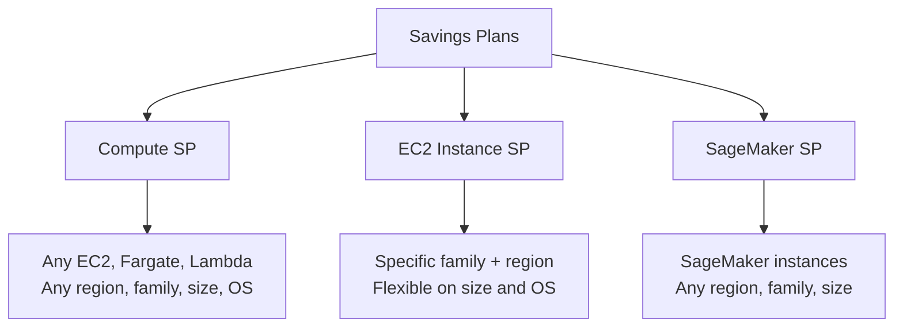
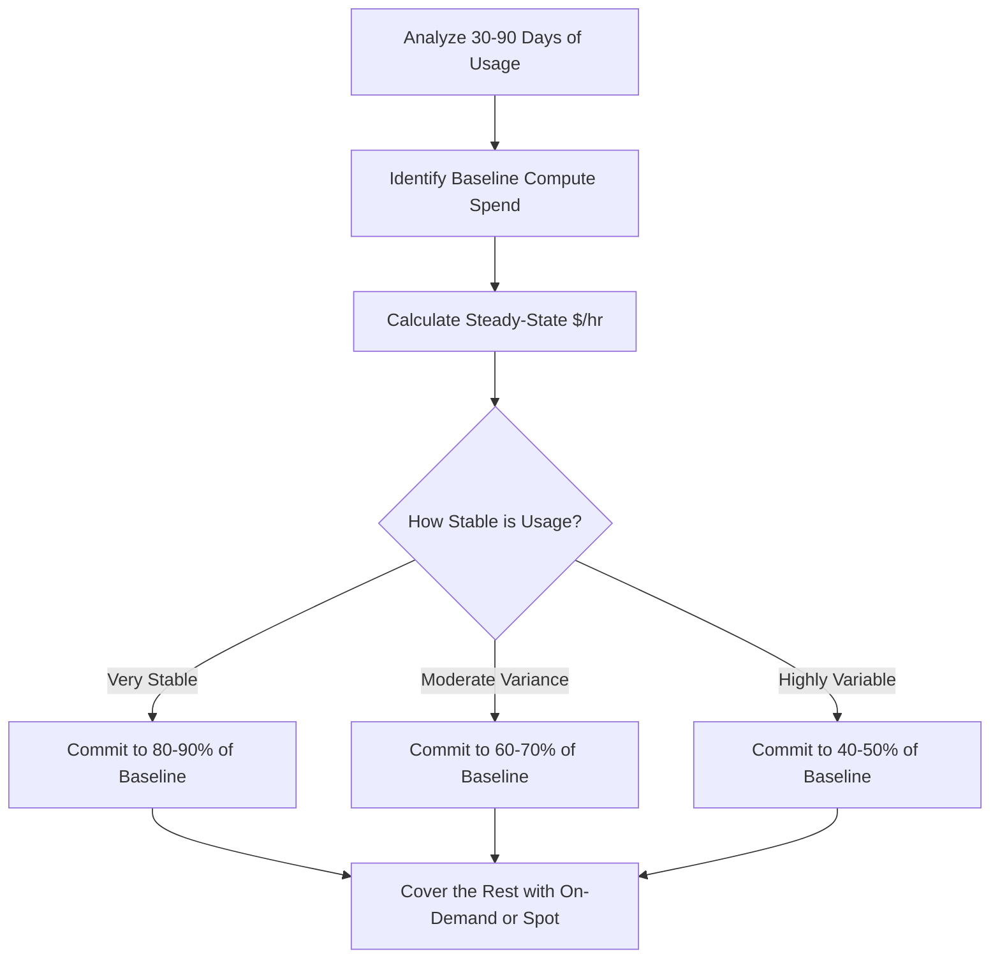
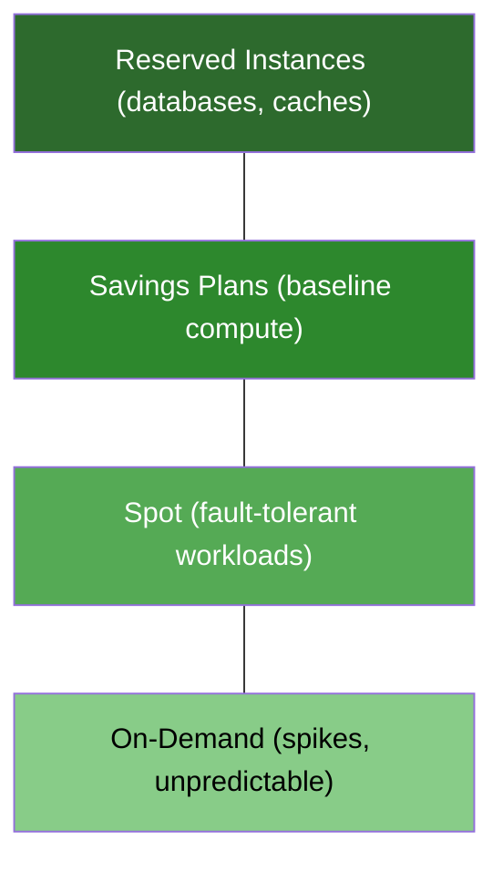

# Reserved Instances vs Savings Plans - Which One Should You Choose

Author: [nawazdhandala](https://github.com/nawazdhandala)

Tags: AWS, Cost Optimization, Reserved Instances, Savings Plans, FinOps

Description: A detailed comparison of AWS Reserved Instances and Savings Plans covering flexibility, discount levels, commitment types, and when each option makes sense.

---

AWS gives you two primary mechanisms for reducing compute costs through commitment: Reserved Instances (RIs) and Savings Plans (SPs). Both involve committing to a certain level of usage in exchange for a discount over on-demand pricing. But they differ in flexibility, scope, and how they apply to your workloads. Picking the wrong one, or not picking either, leaves money on the table.

## How Reserved Instances Work

A Reserved Instance is a billing discount applied to instances that match specific attributes. You are not reserving a physical machine. You are committing to pay for a certain instance type in a certain region for one or three years, and AWS discounts any matching usage.

The attributes that must match depend on the RI type:

**Standard RIs** are locked to a specific instance family, size, operating system, tenancy, and region (or availability zone). A `c5.xlarge` Linux Standard RI in `us-east-1` only discounts `c5.xlarge` Linux instances in `us-east-1`.

**Convertible RIs** can be exchanged for a different instance family, size, OS, or tenancy, as long as the new RI has equal or greater value. This provides more flexibility at the cost of a smaller discount.

Payment options for both types:

| Payment Option | Discount Level | Cash Flow Impact |
|---|---|---|
| All Upfront | Highest (up to 72%) | Large upfront payment |
| Partial Upfront | Medium (up to 66%) | Some upfront, monthly payments |
| No Upfront | Lowest (up to 36%) | Monthly payments only |

The three-year term provides larger discounts than one-year, but locks you in for longer.

## How Savings Plans Work

Savings Plans were introduced in 2019 as a simpler, more flexible alternative to RIs. Instead of committing to a specific instance type, you commit to a dollar amount of compute usage per hour.

There are three types:

**Compute Savings Plans** apply to any EC2 instance regardless of region, family, size, OS, or tenancy. They also cover AWS Fargate and AWS Lambda usage. This is the most flexible option.

**EC2 Instance Savings Plans** are scoped to a specific instance family and region (like `c5` in `us-east-1`), but are flexible on size, OS, and tenancy within that scope.

**SageMaker Savings Plans** apply specifically to SageMaker ML instance usage.



The commitment is expressed as dollars per hour. If you commit to $10/hour of compute, AWS applies the savings plan discount to up to $10/hour of eligible usage (measured at on-demand rates). Any usage beyond that commitment is billed at on-demand.

## Head-to-Head Comparison

Here is how the two options compare across the dimensions that matter:

| Dimension | Reserved Instances | Savings Plans |
|---|---|---|
| **Flexibility** | Standard: none. Convertible: exchange allowed | Compute SP: fully flexible. EC2 SP: family + region locked |
| **Discount depth** | Standard 3yr all upfront: up to 72% | Compute SP 3yr all upfront: up to 66% |
| **Scope** | EC2 only (RDS, ElastiCache have separate RIs) | EC2, Fargate, Lambda (Compute SP) |
| **Size flexibility** | Within same family in a region (for regional RIs) | Compute SP: any size. EC2 SP: any size |
| **Region flexibility** | No (locked to region or AZ) | Compute SP: any region. EC2 SP: locked |
| **Marketplace resale** | Standard RIs: yes. Convertible: no | No |
| **Expiration behavior** | Reverts to on-demand | Reverts to on-demand |

The discount difference between Standard RIs and Compute Savings Plans is typically 3-6 percentage points. You trade that small discount premium for significantly more flexibility.

## When Reserved Instances Make Sense

RIs still have valid use cases despite being the older mechanism:

**Stable, predictable workloads on a fixed instance type**: If you run a fleet of `m5.2xlarge` instances in `us-east-1` and have no plans to change that for three years, Standard RIs give you the deepest discount.

**Database and cache services**: RDS Reserved Instances, ElastiCache Reserved Nodes, and Redshift Reserved Nodes are separate products from EC2 RIs and have no Savings Plan equivalent. If you have a stable RDS fleet, RIs are your only commitment option.

**Marketplace resale**: If your needs change, you can sell unused Standard RIs on the AWS Marketplace. This provides an escape hatch that Savings Plans do not offer.

## When Savings Plans Make Sense

For most organizations, Savings Plans are the better default choice:

**Workloads that change instance types**: If you are migrating from `m5` to `m6i` or `m7g` (Graviton), a Compute Savings Plan keeps applying discounts through the migration. A Standard RI does not.

**Multi-service compute**: If you use EC2, Fargate, and Lambda together, a Compute Savings Plan discounts all three with a single commitment.

**Growth and uncertainty**: If your workload is growing and you are not sure exactly which instance types you will use next year, the flexibility of a Savings Plan reduces risk.

**Organizational simplicity**: Managing a portfolio of hundreds of RIs across multiple instance types and regions is complex. Savings Plans simplify this to "commit X dollars per hour of compute."

## Calculating Your Commitment Level

The worst outcome is over-committing: paying for reserved capacity you do not use. The second worst is under-committing: leaving discounts on the table.

AWS provides Savings Plans recommendations in the Cost Explorer based on your historical usage. Here is how to think about it:



A conservative approach: commit to covering your minimum sustained usage (the floor that your spending never drops below), and handle everything above that with on-demand or spot instances.

Here is how to pull the data you need:

```python
# Calculate your average hourly compute spend over the past 90 days
# to determine a safe Savings Plan commitment level
import boto3
from datetime import datetime, timedelta

ce = boto3.client('ce')

def get_daily_compute_cost(days: int = 90) -> list[float]:
    """Fetch daily EC2 compute costs for the given period."""
    end = datetime.utcnow().strftime('%Y-%m-%d')
    start = (datetime.utcnow() - timedelta(days=days)).strftime('%Y-%m-%d')

    response = ce.get_cost_and_usage(
        TimePeriod={'Start': start, 'End': end},
        Granularity='DAILY',
        Metrics=['UnblendedCost'],
        Filter={
            'Dimensions': {
                'Key': 'SERVICE',
                'Values': ['Amazon Elastic Compute Cloud - Compute']
            }
        }
    )

    costs = []
    for result in response['ResultsByTime']:
        amount = float(result['Total']['UnblendedCost']['Amount'])
        costs.append(amount)

    return costs

daily_costs = get_daily_compute_cost()

# Convert daily costs to hourly for Savings Plan commitment
hourly_costs = [c / 24 for c in daily_costs]

# The minimum hourly cost is your safest commitment level
min_hourly = min(hourly_costs)
avg_hourly = sum(hourly_costs) / len(hourly_costs)
p10_hourly = sorted(hourly_costs)[int(len(hourly_costs) * 0.1)]

print(f"Minimum hourly: ${min_hourly:.2f}")
print(f"10th percentile hourly: ${p10_hourly:.2f}")
print(f"Average hourly: ${avg_hourly:.2f}")
print(f"Recommended commitment (conservative): ${p10_hourly:.2f}/hr")
```

## Layering Commitments

The best strategy usually combines multiple commitment types:

1. **Savings Plans for baseline EC2/Fargate/Lambda compute**: Cover your predictable, flexible compute baseline.
2. **RIs for databases and caches**: RDS, ElastiCache, and Redshift only offer RIs.
3. **Spot Instances for fault-tolerant workloads**: Batch processing, CI/CD runners, and stateless workers can use spot for 60-90% discounts with the trade-off of possible interruption.
4. **On-demand for the rest**: Spiky, unpredictable, or short-term workloads stay on-demand.



## Common Mistakes

**Over-committing early**: Teams buy three-year commitments based on current usage before understanding their growth trajectory. Start with a one-year term at a conservative level. You can always buy more.

**Ignoring Convertible RIs entirely**: The discount difference between Standard and Convertible RIs is small (a few percentage points). The flexibility of Convertible RIs to exchange for newer instance families is often worth more than that small extra discount.

**Not reviewing commitments regularly**: Usage patterns change. An RI that was well-utilized six months ago might be wasted now because the team migrated to a different instance type. Review utilization monthly.

**Treating RIs and Savings Plans as mutually exclusive**: They complement each other. Use Savings Plans for flexible compute and RIs where Savings Plans do not apply (RDS, ElastiCache).

**Forgetting about Graviton**: AWS Graviton (ARM-based) instances offer 20-40% better price-performance than equivalent x86 instances. Migrating to Graviton and then layering a Savings Plan on top compounds the savings.

## Making the Decision

For a team just starting with commitment-based discounts, here is a pragmatic path:

1. Pull 90 days of compute spending from Cost Explorer.
2. Identify your steady-state hourly spend.
3. Buy a one-year, no-upfront Compute Savings Plan covering 50-60% of that steady state.
4. Buy RIs for any stable RDS or ElastiCache instances.
5. After three months, review utilization and increase your commitment if warranted.
6. Repeat the review every quarter.

This approach minimizes risk while still capturing meaningful savings. You can always get more aggressive with longer terms and higher commitment levels as you build confidence in your usage patterns.

The choice between Reserved Instances and Savings Plans is not binary. Understand both mechanisms, use them where they each excel, and review your commitments regularly. The savings are real: organizations typically reduce their compute bill by 30-50% through commitment-based pricing alone.
