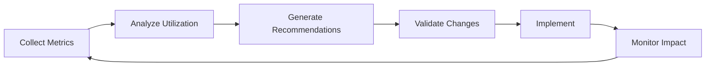
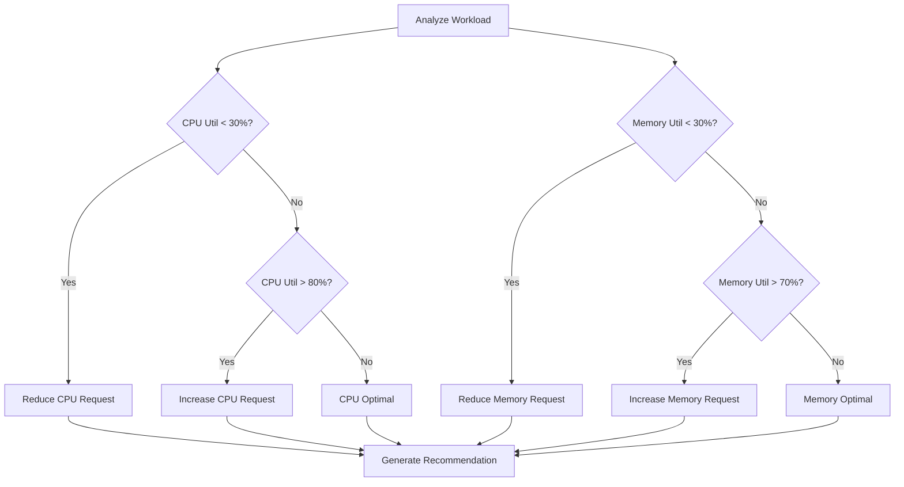
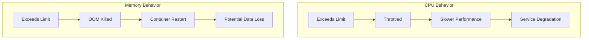
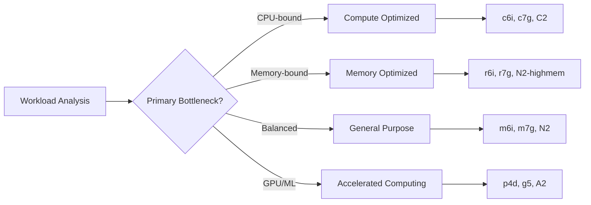
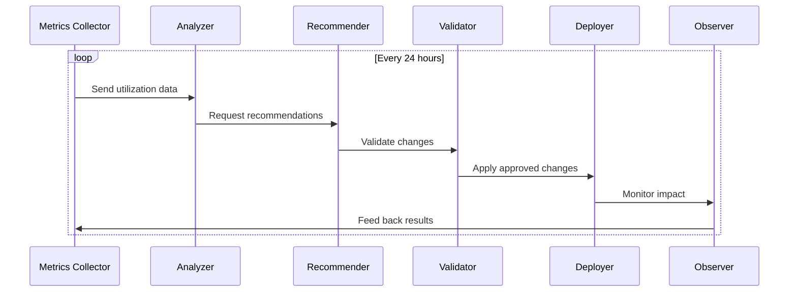
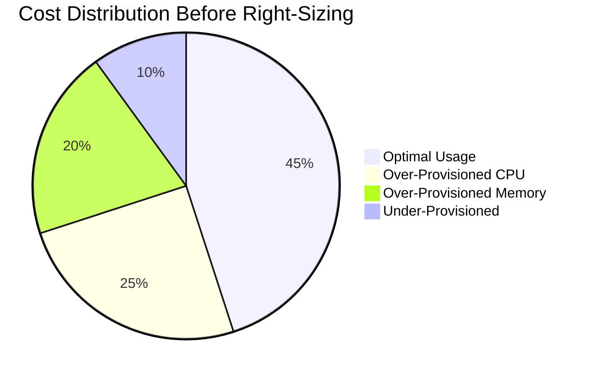

# How to Build Right-Sizing Strategies

Author: [nawazdhandala](https://github.com/nawazdhandala)

Tags: Cost Optimization, FinOps, Infrastructure, Cloud

Description: Learn how to right-size cloud resources for optimal cost and performance balance.

---

Over-provisioned resources silently drain budgets while under-provisioned ones cause outages. Right-sizing finds the sweet spot where cost and performance meet. Here's how to build a systematic approach.

## What Is Right-Sizing?

Right-sizing means matching resource allocations (CPU, memory, storage, network) to actual workload requirements. Most organizations run 30-40% of their cloud resources significantly over-provisioned.



The goal is continuous optimization, not a one-time cleanup.

## 1. Resource Utilization Analysis

Before making changes, understand current usage patterns. Collect at least 2-4 weeks of data to capture normal variations.

### Kubernetes Resource Metrics

Use the metrics server and Prometheus to gather CPU and memory data across your cluster.

```bash
# Get current resource usage for all pods in a namespace
kubectl top pods -n production --containers

# View resource requests vs actual usage
kubectl get pods -n production -o custom-columns=\
"NAME:.metadata.name,\
CPU_REQ:.spec.containers[*].resources.requests.cpu,\
CPU_LIM:.spec.containers[*].resources.limits.cpu,\
MEM_REQ:.spec.containers[*].resources.requests.memory,\
MEM_LIM:.spec.containers[*].resources.limits.memory"
```

### Python Analysis Script

This script collects and analyzes resource utilization data from Kubernetes, calculating statistics to identify right-sizing opportunities.

`analyze_utilization.py`

```python
import subprocess
import json
from datetime import datetime, timedelta
from dataclasses import dataclass
from typing import Optional

@dataclass
class ResourceMetrics:
    """Container for resource utilization metrics."""
    name: str
    namespace: str
    cpu_request_millicores: int
    cpu_usage_millicores: int
    memory_request_bytes: int
    memory_usage_bytes: int

    @property
    def cpu_utilization_percent(self) -> float:
        """Calculate CPU utilization as percentage of request."""
        if self.cpu_request_millicores == 0:
            return 0.0
        return (self.cpu_usage_millicores / self.cpu_request_millicores) * 100

    @property
    def memory_utilization_percent(self) -> float:
        """Calculate memory utilization as percentage of request."""
        if self.memory_request_bytes == 0:
            return 0.0
        return (self.memory_usage_bytes / self.memory_request_bytes) * 100


def parse_cpu(cpu_str: str) -> int:
    """Convert CPU string to millicores."""
    if cpu_str.endswith('m'):
        return int(cpu_str[:-1])
    elif cpu_str.endswith('n'):
        return int(cpu_str[:-1]) // 1_000_000
    else:
        return int(float(cpu_str) * 1000)


def parse_memory(mem_str: str) -> int:
    """Convert memory string to bytes."""
    units = {
        'Ki': 1024,
        'Mi': 1024 ** 2,
        'Gi': 1024 ** 3,
        'K': 1000,
        'M': 1000 ** 2,
        'G': 1000 ** 3,
    }
    for suffix, multiplier in units.items():
        if mem_str.endswith(suffix):
            return int(float(mem_str[:-len(suffix)]) * multiplier)
    return int(mem_str)


def get_pod_metrics(namespace: str) -> list[ResourceMetrics]:
    """Fetch current resource metrics for all pods in a namespace."""
    # Get pod specifications with resource requests
    specs_cmd = [
        'kubectl', 'get', 'pods', '-n', namespace,
        '-o', 'json'
    ]
    specs_result = subprocess.run(specs_cmd, capture_output=True, text=True)
    specs_data = json.loads(specs_result.stdout)

    # Get current usage from metrics API
    usage_cmd = [
        'kubectl', 'top', 'pods', '-n', namespace,
        '--containers', '--no-headers'
    ]
    usage_result = subprocess.run(usage_cmd, capture_output=True, text=True)

    # Parse usage data into a lookup dictionary
    usage_map = {}
    for line in usage_result.stdout.strip().split('\n'):
        if not line:
            continue
        parts = line.split()
        pod_name, container_name = parts[0], parts[1]
        cpu_usage, mem_usage = parts[2], parts[3]
        usage_map[f"{pod_name}/{container_name}"] = {
            'cpu': parse_cpu(cpu_usage),
            'memory': parse_memory(mem_usage)
        }

    metrics = []
    for pod in specs_data.get('items', []):
        pod_name = pod['metadata']['name']
        for container in pod['spec'].get('containers', []):
            container_name = container['name']
            resources = container.get('resources', {})
            requests = resources.get('requests', {})

            key = f"{pod_name}/{container_name}"
            usage = usage_map.get(key, {'cpu': 0, 'memory': 0})

            metrics.append(ResourceMetrics(
                name=f"{pod_name}/{container_name}",
                namespace=namespace,
                cpu_request_millicores=parse_cpu(requests.get('cpu', '0')),
                cpu_usage_millicores=usage['cpu'],
                memory_request_bytes=parse_memory(requests.get('memory', '0')),
                memory_usage_bytes=usage['memory']
            ))

    return metrics


def analyze_utilization(metrics: list[ResourceMetrics]) -> dict:
    """Analyze resource utilization and generate summary statistics."""
    if not metrics:
        return {}

    cpu_utils = [m.cpu_utilization_percent for m in metrics]
    mem_utils = [m.memory_utilization_percent for m in metrics]

    return {
        'total_containers': len(metrics),
        'cpu': {
            'avg_utilization': sum(cpu_utils) / len(cpu_utils),
            'max_utilization': max(cpu_utils),
            'min_utilization': min(cpu_utils),
            'under_20_percent': sum(1 for u in cpu_utils if u < 20),
            'over_80_percent': sum(1 for u in cpu_utils if u > 80),
        },
        'memory': {
            'avg_utilization': sum(mem_utils) / len(mem_utils),
            'max_utilization': max(mem_utils),
            'min_utilization': min(mem_utils),
            'under_20_percent': sum(1 for u in mem_utils if u < 20),
            'over_80_percent': sum(1 for u in mem_utils if u > 80),
        }
    }


if __name__ == '__main__':
    import sys
    namespace = sys.argv[1] if len(sys.argv) > 1 else 'default'

    print(f"Analyzing resource utilization in namespace: {namespace}")
    metrics = get_pod_metrics(namespace)
    summary = analyze_utilization(metrics)

    print(f"\nTotal containers analyzed: {summary['total_containers']}")
    print(f"\nCPU Utilization:")
    print(f"  Average: {summary['cpu']['avg_utilization']:.1f}%")
    print(f"  Under 20%: {summary['cpu']['under_20_percent']} containers")
    print(f"  Over 80%: {summary['cpu']['over_80_percent']} containers")
    print(f"\nMemory Utilization:")
    print(f"  Average: {summary['memory']['avg_utilization']:.1f}%")
    print(f"  Under 20%: {summary['memory']['under_20_percent']} containers")
    print(f"  Over 80%: {summary['memory']['over_80_percent']} containers")
```

## 2. Right-Sizing Recommendations

Based on utilization data, generate specific recommendations for each workload.



### Recommendation Engine

This class generates right-sizing recommendations based on historical utilization data, with configurable thresholds and safety margins.

`recommendation_engine.py`

```python
from dataclasses import dataclass
from enum import Enum
from typing import Optional


class RecommendationType(Enum):
    DECREASE = "decrease"
    INCREASE = "increase"
    OPTIMAL = "optimal"


@dataclass
class Recommendation:
    """A right-sizing recommendation for a container."""
    container_name: str
    resource_type: str  # 'cpu' or 'memory'
    recommendation_type: RecommendationType
    current_value: int
    recommended_value: int
    confidence: float  # 0.0 to 1.0
    potential_savings_percent: float

    def to_dict(self) -> dict:
        return {
            'container': self.container_name,
            'resource': self.resource_type,
            'action': self.recommendation_type.value,
            'current': self.current_value,
            'recommended': self.recommended_value,
            'confidence': f"{self.confidence:.0%}",
            'savings': f"{self.potential_savings_percent:.1f}%"
        }


class RightSizingEngine:
    """Generate right-sizing recommendations based on utilization metrics."""

    def __init__(
        self,
        cpu_low_threshold: float = 30.0,
        cpu_high_threshold: float = 80.0,
        memory_low_threshold: float = 30.0,
        memory_high_threshold: float = 70.0,
        safety_margin: float = 1.2,  # 20% buffer above p95
        min_samples: int = 100
    ):
        self.cpu_low = cpu_low_threshold
        self.cpu_high = cpu_high_threshold
        self.memory_low = memory_low_threshold
        self.memory_high = memory_high_threshold
        self.safety_margin = safety_margin
        self.min_samples = min_samples

    def analyze_cpu(
        self,
        container_name: str,
        current_request: int,
        utilization_samples: list[float]
    ) -> Recommendation:
        """Generate CPU right-sizing recommendation."""
        if len(utilization_samples) < self.min_samples:
            return Recommendation(
                container_name=container_name,
                resource_type='cpu',
                recommendation_type=RecommendationType.OPTIMAL,
                current_value=current_request,
                recommended_value=current_request,
                confidence=0.0,
                potential_savings_percent=0.0
            )

        avg_util = sum(utilization_samples) / len(utilization_samples)
        p95_util = sorted(utilization_samples)[int(len(utilization_samples) * 0.95)]

        # Calculate recommended value based on p95 plus safety margin
        if avg_util < self.cpu_low:
            # Significantly over-provisioned
            recommended = int(current_request * (p95_util / 100) * self.safety_margin)
            recommended = max(recommended, 50)  # Minimum 50m CPU
            savings = ((current_request - recommended) / current_request) * 100

            return Recommendation(
                container_name=container_name,
                resource_type='cpu',
                recommendation_type=RecommendationType.DECREASE,
                current_value=current_request,
                recommended_value=recommended,
                confidence=self._calculate_confidence(utilization_samples),
                potential_savings_percent=savings
            )

        elif avg_util > self.cpu_high:
            # Under-provisioned - risk of throttling
            recommended = int(current_request * (p95_util / 100) * self.safety_margin)

            return Recommendation(
                container_name=container_name,
                resource_type='cpu',
                recommendation_type=RecommendationType.INCREASE,
                current_value=current_request,
                recommended_value=recommended,
                confidence=self._calculate_confidence(utilization_samples),
                potential_savings_percent=0.0  # No savings, but prevents issues
            )

        else:
            return Recommendation(
                container_name=container_name,
                resource_type='cpu',
                recommendation_type=RecommendationType.OPTIMAL,
                current_value=current_request,
                recommended_value=current_request,
                confidence=self._calculate_confidence(utilization_samples),
                potential_savings_percent=0.0
            )

    def analyze_memory(
        self,
        container_name: str,
        current_request: int,
        utilization_samples: list[float]
    ) -> Recommendation:
        """Generate memory right-sizing recommendation."""
        if len(utilization_samples) < self.min_samples:
            return Recommendation(
                container_name=container_name,
                resource_type='memory',
                recommendation_type=RecommendationType.OPTIMAL,
                current_value=current_request,
                recommended_value=current_request,
                confidence=0.0,
                potential_savings_percent=0.0
            )

        avg_util = sum(utilization_samples) / len(utilization_samples)
        # Use p99 for memory since OOM kills are more severe than CPU throttling
        p99_util = sorted(utilization_samples)[int(len(utilization_samples) * 0.99)]

        if avg_util < self.memory_low:
            recommended = int(current_request * (p99_util / 100) * self.safety_margin)
            recommended = max(recommended, 64 * 1024 * 1024)  # Minimum 64Mi
            savings = ((current_request - recommended) / current_request) * 100

            return Recommendation(
                container_name=container_name,
                resource_type='memory',
                recommendation_type=RecommendationType.DECREASE,
                current_value=current_request,
                recommended_value=recommended,
                confidence=self._calculate_confidence(utilization_samples),
                potential_savings_percent=savings
            )

        elif avg_util > self.memory_high:
            recommended = int(current_request * (p99_util / 100) * self.safety_margin)

            return Recommendation(
                container_name=container_name,
                resource_type='memory',
                recommendation_type=RecommendationType.INCREASE,
                current_value=current_request,
                recommended_value=recommended,
                confidence=self._calculate_confidence(utilization_samples),
                potential_savings_percent=0.0
            )

        else:
            return Recommendation(
                container_name=container_name,
                resource_type='memory',
                recommendation_type=RecommendationType.OPTIMAL,
                current_value=current_request,
                recommended_value=current_request,
                confidence=self._calculate_confidence(utilization_samples),
                potential_savings_percent=0.0
            )

    def _calculate_confidence(self, samples: list[float]) -> float:
        """Calculate confidence based on sample size and variance."""
        if len(samples) < self.min_samples:
            return 0.0

        # More samples = higher confidence (up to a point)
        sample_confidence = min(len(samples) / 1000, 1.0)

        # Lower variance = higher confidence
        avg = sum(samples) / len(samples)
        variance = sum((x - avg) ** 2 for x in samples) / len(samples)
        std_dev = variance ** 0.5
        cv = std_dev / avg if avg > 0 else 0  # Coefficient of variation
        variance_confidence = max(0, 1 - cv)

        return (sample_confidence + variance_confidence) / 2
```

## 3. Memory vs CPU Optimization

Memory and CPU require different optimization strategies because they behave differently under pressure.



### Key Differences

| Aspect | CPU | Memory |
|--------|-----|--------|
| Failure Mode | Throttling (graceful) | OOM Kill (abrupt) |
| Recovery | Automatic | Requires restart |
| Recommended Buffer | 20% above p95 | 30% above p99 |
| Safe to Under-provision | Yes, with monitoring | No, avoid at all costs |

### Memory-Safe Configuration

When setting memory limits, always account for garbage collection overhead and unexpected spikes.

`memory_safe_deployment.yaml`

```yaml
apiVersion: apps/v1
kind: Deployment
metadata:
  name: api-server
  namespace: production
spec:
  replicas: 3
  selector:
    matchLabels:
      app: api-server
  template:
    metadata:
      labels:
        app: api-server
    spec:
      containers:
        - name: api
          image: ghcr.io/example/api:2.1.0
          resources:
            requests:
              # Request should match typical usage
              cpu: 250m
              memory: 512Mi
            limits:
              # CPU limit can be higher to handle bursts
              cpu: 1000m
              # Memory limit should have buffer for GC and spikes
              # Request 512Mi + 30% buffer = ~665Mi, round to 768Mi
              memory: 768Mi
          env:
            # Set JVM/runtime heap to leave room for non-heap memory
            - name: JAVA_OPTS
              value: "-Xmx400m -Xms400m"
```

## 4. Instance Family Selection

Choosing the right instance family is as important as sizing within that family.



### Instance Family Selection Script

This script analyzes workload characteristics and recommends appropriate instance families across major cloud providers.

`select_instance_family.py`

```python
from dataclasses import dataclass
from enum import Enum
from typing import Optional


class WorkloadType(Enum):
    CPU_BOUND = "cpu_bound"
    MEMORY_BOUND = "memory_bound"
    BALANCED = "balanced"
    STORAGE_BOUND = "storage_bound"
    GPU_REQUIRED = "gpu_required"


@dataclass
class WorkloadProfile:
    """Profile describing workload characteristics."""
    name: str
    avg_cpu_utilization: float
    avg_memory_utilization: float
    requires_local_ssd: bool = False
    requires_gpu: bool = False
    memory_to_cpu_ratio: float = 4.0  # GB per vCPU

    def classify(self) -> WorkloadType:
        """Determine workload type based on utilization patterns."""
        if self.requires_gpu:
            return WorkloadType.GPU_REQUIRED

        if self.requires_local_ssd:
            return WorkloadType.STORAGE_BOUND

        cpu_pressure = self.avg_cpu_utilization
        mem_pressure = self.avg_memory_utilization

        # High memory usage relative to CPU suggests memory-bound
        if mem_pressure > cpu_pressure * 1.5:
            return WorkloadType.MEMORY_BOUND

        # High CPU usage relative to memory suggests CPU-bound
        if cpu_pressure > mem_pressure * 1.5:
            return WorkloadType.CPU_BOUND

        return WorkloadType.BALANCED


# Instance family recommendations by cloud provider
INSTANCE_FAMILIES = {
    'aws': {
        WorkloadType.CPU_BOUND: {
            'families': ['c7g', 'c6i', 'c6a'],
            'description': 'Compute optimized for CPU-intensive workloads',
            'use_cases': ['Batch processing', 'Gaming servers', 'Scientific modeling']
        },
        WorkloadType.MEMORY_BOUND: {
            'families': ['r7g', 'r6i', 'x2idn'],
            'description': 'Memory optimized for large in-memory datasets',
            'use_cases': ['Databases', 'Caching', 'Real-time analytics']
        },
        WorkloadType.BALANCED: {
            'families': ['m7g', 'm6i', 'm6a'],
            'description': 'General purpose for balanced workloads',
            'use_cases': ['Web servers', 'Development', 'Small databases']
        },
        WorkloadType.STORAGE_BOUND: {
            'families': ['i4i', 'd3', 'i3en'],
            'description': 'Storage optimized with high IOPS NVMe',
            'use_cases': ['Data warehousing', 'Distributed file systems']
        },
        WorkloadType.GPU_REQUIRED: {
            'families': ['p5', 'p4d', 'g5'],
            'description': 'GPU instances for ML and graphics',
            'use_cases': ['ML training', 'Inference', 'Video encoding']
        }
    },
    'gcp': {
        WorkloadType.CPU_BOUND: {
            'families': ['c3', 'c2', 'c2d'],
            'description': 'Compute optimized for CPU-intensive workloads',
            'use_cases': ['HPC', 'Gaming', 'Ad serving']
        },
        WorkloadType.MEMORY_BOUND: {
            'families': ['m3', 'm2', 'n2-highmem'],
            'description': 'Memory optimized instances',
            'use_cases': ['SAP HANA', 'In-memory databases']
        },
        WorkloadType.BALANCED: {
            'families': ['n2', 'n2d', 'e2'],
            'description': 'General purpose balanced instances',
            'use_cases': ['Web serving', 'App backends', 'Dev/test']
        },
        WorkloadType.STORAGE_BOUND: {
            'families': ['z3', 'n2-standard + local SSD'],
            'description': 'Storage optimized configurations',
            'use_cases': ['Databases', 'Analytics']
        },
        WorkloadType.GPU_REQUIRED: {
            'families': ['a3', 'a2', 'g2'],
            'description': 'GPU instances for ML workloads',
            'use_cases': ['ML training', 'Inference', 'Rendering']
        }
    },
    'azure': {
        WorkloadType.CPU_BOUND: {
            'families': ['Fsv2', 'Fx'],
            'description': 'Compute optimized for CPU-intensive workloads',
            'use_cases': ['Batch processing', 'Gaming', 'Analytics']
        },
        WorkloadType.MEMORY_BOUND: {
            'families': ['Esv5', 'Edsv5', 'Msv2'],
            'description': 'Memory optimized instances',
            'use_cases': ['SQL Server', 'SAP', 'Large caches']
        },
        WorkloadType.BALANCED: {
            'families': ['Dsv5', 'Ddsv5', 'Dasv5'],
            'description': 'General purpose instances',
            'use_cases': ['Web servers', 'Dev/test', 'Small DBs']
        },
        WorkloadType.STORAGE_BOUND: {
            'families': ['Lsv3', 'Lasv3'],
            'description': 'Storage optimized with NVMe',
            'use_cases': ['NoSQL', 'Data warehousing']
        },
        WorkloadType.GPU_REQUIRED: {
            'families': ['NCasT4_v3', 'NDasrA100_v4', 'NVadsA10_v5'],
            'description': 'GPU instances for ML and graphics',
            'use_cases': ['Deep learning', 'Inference', 'VDI']
        }
    }
}


def recommend_instance_family(
    profile: WorkloadProfile,
    cloud_provider: str = 'aws'
) -> dict:
    """Generate instance family recommendation based on workload profile."""
    workload_type = profile.classify()

    if cloud_provider not in INSTANCE_FAMILIES:
        raise ValueError(f"Unsupported cloud provider: {cloud_provider}")

    recommendation = INSTANCE_FAMILIES[cloud_provider][workload_type]

    return {
        'workload_name': profile.name,
        'workload_type': workload_type.value,
        'cloud_provider': cloud_provider,
        'recommended_families': recommendation['families'],
        'description': recommendation['description'],
        'typical_use_cases': recommendation['use_cases'],
        'rationale': _generate_rationale(profile, workload_type)
    }


def _generate_rationale(profile: WorkloadProfile, workload_type: WorkloadType) -> str:
    """Generate human-readable rationale for the recommendation."""
    rationales = {
        WorkloadType.CPU_BOUND: (
            f"CPU utilization ({profile.avg_cpu_utilization:.0f}%) significantly "
            f"exceeds memory utilization ({profile.avg_memory_utilization:.0f}%). "
            "Compute-optimized instances provide higher CPU-to-memory ratio at lower cost."
        ),
        WorkloadType.MEMORY_BOUND: (
            f"Memory utilization ({profile.avg_memory_utilization:.0f}%) significantly "
            f"exceeds CPU utilization ({profile.avg_cpu_utilization:.0f}%). "
            "Memory-optimized instances provide more RAM per vCPU."
        ),
        WorkloadType.BALANCED: (
            f"CPU ({profile.avg_cpu_utilization:.0f}%) and memory "
            f"({profile.avg_memory_utilization:.0f}%) utilization are balanced. "
            "General purpose instances offer the best price-performance."
        ),
        WorkloadType.STORAGE_BOUND: (
            "Workload requires high-performance local storage. "
            "Storage-optimized instances include NVMe drives with high IOPS."
        ),
        WorkloadType.GPU_REQUIRED: (
            "Workload requires GPU acceleration for ML or graphics processing."
        )
    }
    return rationales[workload_type]


# Example usage
if __name__ == '__main__':
    profiles = [
        WorkloadProfile(
            name='api-server',
            avg_cpu_utilization=65,
            avg_memory_utilization=40
        ),
        WorkloadProfile(
            name='redis-cache',
            avg_cpu_utilization=15,
            avg_memory_utilization=85
        ),
        WorkloadProfile(
            name='ml-training',
            avg_cpu_utilization=90,
            avg_memory_utilization=70,
            requires_gpu=True
        )
    ]

    for profile in profiles:
        for provider in ['aws', 'gcp', 'azure']:
            rec = recommend_instance_family(profile, provider)
            print(f"\n{rec['workload_name']} on {provider.upper()}:")
            print(f"  Type: {rec['workload_type']}")
            print(f"  Families: {', '.join(rec['recommended_families'])}")
            print(f"  Rationale: {rec['rationale']}")
```

## 5. Continuous Right-Sizing Process

Right-sizing is not a one-time activity. Implement a continuous process that adapts to changing workloads.



### Automated Right-Sizing Pipeline

This class implements an automated pipeline that continuously monitors, analyzes, and applies right-sizing changes with safety guardrails.

`continuous_rightsizing.py`

```python
import json
import subprocess
from dataclasses import dataclass, field
from datetime import datetime, timedelta
from enum import Enum
from typing import Callable, Optional


class ChangeStatus(Enum):
    PENDING = "pending"
    APPROVED = "approved"
    APPLIED = "applied"
    ROLLED_BACK = "rolled_back"
    REJECTED = "rejected"


@dataclass
class RightSizingChange:
    """Represents a pending right-sizing change."""
    id: str
    namespace: str
    deployment: str
    container: str
    resource_type: str
    current_value: int
    new_value: int
    status: ChangeStatus = ChangeStatus.PENDING
    created_at: datetime = field(default_factory=datetime.utcnow)
    applied_at: Optional[datetime] = None
    confidence: float = 0.0

    @property
    def change_percent(self) -> float:
        """Calculate percentage change."""
        if self.current_value == 0:
            return 0.0
        return ((self.new_value - self.current_value) / self.current_value) * 100


class ContinuousRightSizing:
    """Automated right-sizing pipeline with safety guardrails."""

    def __init__(
        self,
        max_change_percent: float = 30.0,
        min_confidence: float = 0.7,
        cooldown_hours: int = 24,
        dry_run: bool = True
    ):
        self.max_change_percent = max_change_percent
        self.min_confidence = min_confidence
        self.cooldown_hours = cooldown_hours
        self.dry_run = dry_run
        self.change_history: list[RightSizingChange] = []
        self.observers: list[Callable[[RightSizingChange], None]] = []

    def register_observer(self, callback: Callable[[RightSizingChange], None]):
        """Register callback for change notifications."""
        self.observers.append(callback)

    def _notify_observers(self, change: RightSizingChange):
        """Notify all registered observers of a change."""
        for observer in self.observers:
            try:
                observer(change)
            except Exception as e:
                print(f"Observer notification failed: {e}")

    def validate_change(self, change: RightSizingChange) -> tuple[bool, str]:
        """Validate a proposed change against safety rules."""
        # Check change magnitude
        if abs(change.change_percent) > self.max_change_percent:
            return False, (
                f"Change of {change.change_percent:.1f}% exceeds "
                f"maximum allowed {self.max_change_percent}%"
            )

        # Check confidence level
        if change.confidence < self.min_confidence:
            return False, (
                f"Confidence {change.confidence:.0%} is below "
                f"minimum threshold {self.min_confidence:.0%}"
            )

        # Check cooldown period
        recent_changes = [
            c for c in self.change_history
            if c.namespace == change.namespace
            and c.deployment == change.deployment
            and c.container == change.container
            and c.resource_type == change.resource_type
            and c.status == ChangeStatus.APPLIED
            and c.applied_at
            and (datetime.utcnow() - c.applied_at) < timedelta(hours=self.cooldown_hours)
        ]

        if recent_changes:
            last_change = max(recent_changes, key=lambda c: c.applied_at)
            hours_ago = (datetime.utcnow() - last_change.applied_at).total_seconds() / 3600
            return False, (
                f"Recent change applied {hours_ago:.1f} hours ago. "
                f"Cooldown period is {self.cooldown_hours} hours."
            )

        return True, "Change validated successfully"

    def apply_change(self, change: RightSizingChange) -> bool:
        """Apply a validated right-sizing change."""
        is_valid, message = self.validate_change(change)

        if not is_valid:
            change.status = ChangeStatus.REJECTED
            self._notify_observers(change)
            print(f"Change rejected: {message}")
            return False

        change.status = ChangeStatus.APPROVED

        if self.dry_run:
            print(f"[DRY RUN] Would apply: {change}")
            return True

        # Build kubectl patch command
        if change.resource_type == 'cpu':
            value = f"{change.new_value}m"
        else:  # memory
            value = f"{change.new_value // (1024 * 1024)}Mi"

        patch = {
            "spec": {
                "template": {
                    "spec": {
                        "containers": [{
                            "name": change.container,
                            "resources": {
                                "requests": {
                                    change.resource_type: value
                                }
                            }
                        }]
                    }
                }
            }
        }

        cmd = [
            'kubectl', 'patch', 'deployment', change.deployment,
            '-n', change.namespace,
            '--type', 'strategic',
            '-p', json.dumps(patch)
        ]

        try:
            result = subprocess.run(cmd, capture_output=True, text=True, check=True)
            change.status = ChangeStatus.APPLIED
            change.applied_at = datetime.utcnow()
            self.change_history.append(change)
            self._notify_observers(change)
            print(f"Successfully applied: {change.deployment}/{change.container}")
            return True

        except subprocess.CalledProcessError as e:
            print(f"Failed to apply change: {e.stderr}")
            return False

    def rollback_change(self, change: RightSizingChange) -> bool:
        """Rollback a previously applied change."""
        if change.status != ChangeStatus.APPLIED:
            print("Can only rollback applied changes")
            return False

        # Create inverse change
        rollback = RightSizingChange(
            id=f"{change.id}-rollback",
            namespace=change.namespace,
            deployment=change.deployment,
            container=change.container,
            resource_type=change.resource_type,
            current_value=change.new_value,
            new_value=change.current_value,
            confidence=1.0  # High confidence for rollbacks
        )

        # Bypass normal validation for rollbacks
        self.max_change_percent = 100.0  # Temporarily allow any change
        result = self.apply_change(rollback)
        self.max_change_percent = 30.0  # Restore limit

        if result:
            change.status = ChangeStatus.ROLLED_BACK
            self._notify_observers(change)

        return result

    def generate_report(self) -> dict:
        """Generate summary report of right-sizing activities."""
        applied = [c for c in self.change_history if c.status == ChangeStatus.APPLIED]
        rolled_back = [c for c in self.change_history if c.status == ChangeStatus.ROLLED_BACK]

        # Calculate total savings (only for decreases)
        cpu_savings = sum(
            c.current_value - c.new_value
            for c in applied
            if c.resource_type == 'cpu' and c.new_value < c.current_value
        )

        memory_savings = sum(
            c.current_value - c.new_value
            for c in applied
            if c.resource_type == 'memory' and c.new_value < c.current_value
        )

        return {
            'period': {
                'start': min((c.created_at for c in self.change_history), default=None),
                'end': datetime.utcnow()
            },
            'changes': {
                'total': len(self.change_history),
                'applied': len(applied),
                'rolled_back': len(rolled_back),
                'success_rate': len(applied) / len(self.change_history) if self.change_history else 0
            },
            'savings': {
                'cpu_millicores': cpu_savings,
                'memory_bytes': memory_savings,
                'memory_gb': memory_savings / (1024 ** 3)
            }
        }
```

## 6. Cost Savings Tracking

Measure and report the financial impact of right-sizing efforts.



### Cost Tracking Dashboard

This class tracks cost savings from right-sizing changes by comparing before and after resource allocations against cloud pricing.

`cost_tracker.py`

```python
from dataclasses import dataclass, field
from datetime import datetime, timedelta
from typing import Optional


@dataclass
class ResourcePricing:
    """Pricing information for cloud resources."""
    cpu_per_core_hour: float  # Cost per vCPU-hour
    memory_per_gb_hour: float  # Cost per GB-hour
    currency: str = "USD"


# Example pricing (varies by region and instance type)
PRICING = {
    'aws-us-east-1': ResourcePricing(
        cpu_per_core_hour=0.0255,
        memory_per_gb_hour=0.0034
    ),
    'gcp-us-central1': ResourcePricing(
        cpu_per_core_hour=0.0212,
        memory_per_gb_hour=0.0028
    ),
    'azure-eastus': ResourcePricing(
        cpu_per_core_hour=0.0248,
        memory_per_gb_hour=0.0032
    )
}


@dataclass
class CostSavingsRecord:
    """Record of cost savings from a right-sizing change."""
    change_id: str
    namespace: str
    deployment: str
    resource_type: str
    previous_allocation: int  # millicores or bytes
    new_allocation: int
    applied_at: datetime
    pricing_region: str

    def calculate_hourly_savings(self) -> float:
        """Calculate hourly cost savings."""
        pricing = PRICING.get(self.pricing_region)
        if not pricing:
            return 0.0

        reduction = self.previous_allocation - self.new_allocation
        if reduction <= 0:
            return 0.0  # No savings for increases

        if self.resource_type == 'cpu':
            # Convert millicores to cores
            cores_saved = reduction / 1000
            return cores_saved * pricing.cpu_per_core_hour
        else:
            # Convert bytes to GB
            gb_saved = reduction / (1024 ** 3)
            return gb_saved * pricing.memory_per_gb_hour

    def calculate_monthly_savings(self) -> float:
        """Calculate monthly cost savings (730 hours)."""
        return self.calculate_hourly_savings() * 730

    def calculate_annual_savings(self) -> float:
        """Calculate annual cost savings."""
        return self.calculate_monthly_savings() * 12


class CostTracker:
    """Track and report cost savings from right-sizing."""

    def __init__(self, pricing_region: str = 'aws-us-east-1'):
        self.pricing_region = pricing_region
        self.records: list[CostSavingsRecord] = []

    def record_change(
        self,
        change_id: str,
        namespace: str,
        deployment: str,
        resource_type: str,
        previous: int,
        new: int
    ):
        """Record a right-sizing change for cost tracking."""
        record = CostSavingsRecord(
            change_id=change_id,
            namespace=namespace,
            deployment=deployment,
            resource_type=resource_type,
            previous_allocation=previous,
            new_allocation=new,
            applied_at=datetime.utcnow(),
            pricing_region=self.pricing_region
        )
        self.records.append(record)
        return record

    def get_total_monthly_savings(self) -> float:
        """Calculate total monthly savings across all changes."""
        return sum(r.calculate_monthly_savings() for r in self.records)

    def get_savings_by_namespace(self) -> dict[str, float]:
        """Break down monthly savings by namespace."""
        savings = {}
        for record in self.records:
            if record.namespace not in savings:
                savings[record.namespace] = 0.0
            savings[record.namespace] += record.calculate_monthly_savings()
        return savings

    def get_savings_by_resource_type(self) -> dict[str, float]:
        """Break down monthly savings by resource type."""
        return {
            'cpu': sum(
                r.calculate_monthly_savings()
                for r in self.records
                if r.resource_type == 'cpu'
            ),
            'memory': sum(
                r.calculate_monthly_savings()
                for r in self.records
                if r.resource_type == 'memory'
            )
        }

    def generate_report(self) -> dict:
        """Generate comprehensive savings report."""
        monthly = self.get_total_monthly_savings()

        return {
            'summary': {
                'total_changes': len(self.records),
                'monthly_savings_usd': round(monthly, 2),
                'annual_savings_usd': round(monthly * 12, 2),
                'pricing_region': self.pricing_region
            },
            'by_namespace': {
                ns: round(savings, 2)
                for ns, savings in self.get_savings_by_namespace().items()
            },
            'by_resource_type': {
                rt: round(savings, 2)
                for rt, savings in self.get_savings_by_resource_type().items()
            },
            'top_savings': [
                {
                    'deployment': f"{r.namespace}/{r.deployment}",
                    'resource': r.resource_type,
                    'monthly_savings': round(r.calculate_monthly_savings(), 2)
                }
                for r in sorted(
                    self.records,
                    key=lambda x: x.calculate_monthly_savings(),
                    reverse=True
                )[:10]
            ]
        }


# Example usage
if __name__ == '__main__':
    tracker = CostTracker('aws-us-east-1')

    # Record some example changes
    tracker.record_change(
        change_id='rs-001',
        namespace='production',
        deployment='api-server',
        resource_type='cpu',
        previous=2000,  # 2 cores
        new=1000        # 1 core
    )

    tracker.record_change(
        change_id='rs-002',
        namespace='production',
        deployment='web-frontend',
        resource_type='memory',
        previous=4 * 1024**3,  # 4 GB
        new=2 * 1024**3        # 2 GB
    )

    tracker.record_change(
        change_id='rs-003',
        namespace='staging',
        deployment='worker',
        resource_type='cpu',
        previous=4000,  # 4 cores
        new=2000        # 2 cores
    )

    report = tracker.generate_report()

    print("=== Right-Sizing Cost Savings Report ===")
    print(f"\nTotal Changes: {report['summary']['total_changes']}")
    print(f"Monthly Savings: ${report['summary']['monthly_savings_usd']}")
    print(f"Annual Savings: ${report['summary']['annual_savings_usd']}")

    print("\nSavings by Namespace:")
    for ns, savings in report['by_namespace'].items():
        print(f"  {ns}: ${savings}/month")

    print("\nSavings by Resource Type:")
    for rt, savings in report['by_resource_type'].items():
        print(f"  {rt}: ${savings}/month")

    print("\nTop Savings Opportunities:")
    for item in report['top_savings']:
        print(f"  {item['deployment']} ({item['resource']}): ${item['monthly_savings']}/month")
```

## Best Practices Summary

1. **Collect sufficient data** - At least 2-4 weeks of metrics before making recommendations
2. **Start conservative** - Use higher safety margins initially, reduce as confidence grows
3. **Implement guardrails** - Limit maximum change percentage and enforce cooldown periods
4. **Treat memory carefully** - OOM kills are more disruptive than CPU throttling
5. **Choose the right instance family** - Match workload characteristics to instance capabilities
6. **Automate the process** - Manual right-sizing doesn't scale
7. **Track and report savings** - Quantify the financial impact to justify continued investment
8. **Monitor after changes** - Watch for performance regressions and be ready to rollback

---

Right-sizing is not about cutting costs at any expense. It's about finding the allocation where you pay for what you need with appropriate headroom for reliability. The techniques above help you build a systematic, data-driven approach that continuously optimizes your infrastructure spend.
