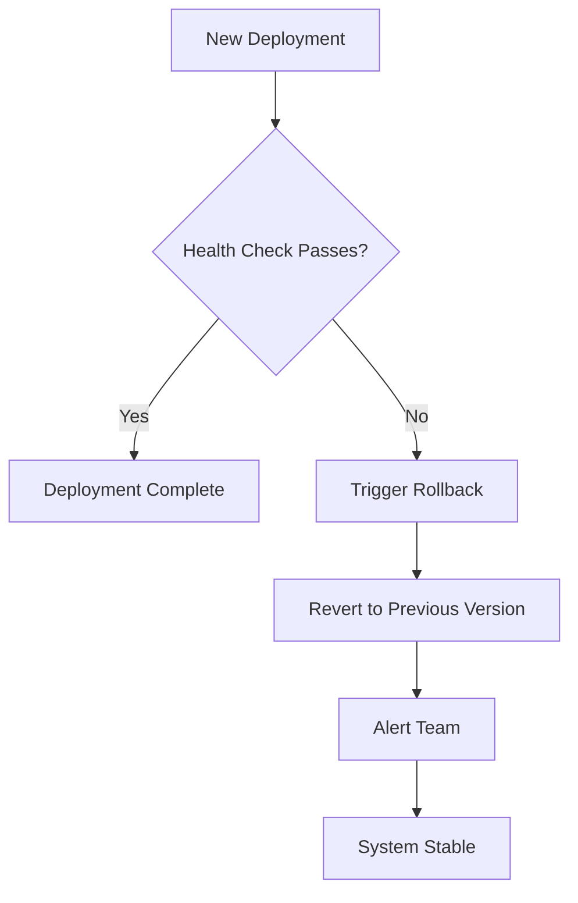
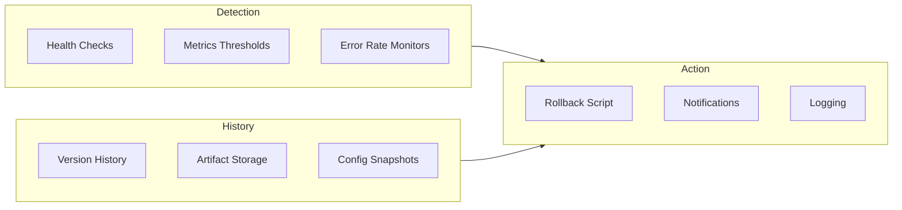

# How to Create Rollback Automation

Author: [nawazdhandala](https://github.com/nawazdhandala)

Tags: DevOps, Rollback, Automation, CI/CD

Description: Learn to create rollback automation for quick recovery from failed deployments.

---

A failed deployment at 2 AM is stressful. A failed deployment without rollback automation is a disaster. When your monitoring detects issues after a release, you need to revert fast. Manual rollbacks introduce human error and waste precious minutes during outages. Automating rollbacks removes the panic and lets you recover in seconds.

## Why Automate Rollbacks?

Every minute of downtime costs money and user trust. Manual rollbacks require someone to wake up, connect to VPN, remember the right commands, and execute them without typos. Automated rollbacks detect failures and revert before most users notice.



The goal is simple: detect failures fast, rollback automatically, and notify the team for investigation later.

## Core Components of Rollback Automation

Rollback automation requires three things working together: health checks that detect failures, deployment history that tracks previous versions, and triggers that connect detection to action.



## Building Health Check Gates

Health checks are the foundation of rollback automation. They tell your system whether a deployment succeeded or failed. Configure your application to expose a health endpoint that validates critical dependencies.

Here is a basic health check endpoint in Node.js that verifies database connectivity and returns appropriate status codes.

```javascript
// health.js - Express health check endpoint
const express = require('express');
const app = express();

app.get('/health', async (req, res) => {
  try {
    // Check database connection
    await db.query('SELECT 1');

    // Check cache connection
    await redis.ping();

    // Check external API dependency
    const apiStatus = await checkExternalApi();

    if (!apiStatus.healthy) {
      // Return 503 to signal unhealthy state
      return res.status(503).json({
        status: 'unhealthy',
        reason: 'External API unavailable'
      });
    }

    // All checks passed
    res.status(200).json({ status: 'healthy' });
  } catch (error) {
    // Any failure means unhealthy
    res.status(503).json({
      status: 'unhealthy',
      reason: error.message
    });
  }
});
```

## Kubernetes Deployment with Rollback Strategy

Kubernetes handles much of the rollback logic for you. Configure your Deployment to fail fast when health checks fail, then use native rollback commands. The key is setting proper readiness probes and deployment strategies.

This Deployment configuration ensures zero downtime during updates and enables quick rollbacks when probes fail.

```yaml
# deployment.yaml - Production deployment with rollback support
apiVersion: apps/v1
kind: Deployment
metadata:
  name: api-server
  annotations:
    # Track deployment history for auditing
    kubernetes.io/change-cause: "Release v2.3.1"
spec:
  replicas: 3
  # Keep last 5 versions for rollback
  revisionHistoryLimit: 5
  strategy:
    type: RollingUpdate
    rollingUpdate:
      # Never reduce capacity during rollout
      maxUnavailable: 0
      # Add one pod at a time
      maxSurge: 1
  selector:
    matchLabels:
      app: api-server
  template:
    metadata:
      labels:
        app: api-server
    spec:
      containers:
        - name: api
          image: myapp:v2.3.1
          ports:
            - containerPort: 8080
          # Readiness probe gates traffic
          readinessProbe:
            httpGet:
              path: /health
              port: 8080
            initialDelaySeconds: 5
            periodSeconds: 10
            failureThreshold: 3
          # Liveness probe triggers restarts
          livenessProbe:
            httpGet:
              path: /health
              port: 8080
            initialDelaySeconds: 15
            periodSeconds: 20
            failureThreshold: 3
```

## CI/CD Pipeline with Automatic Rollback

Your CI/CD pipeline should watch the deployment and trigger rollback when health checks fail. This GitHub Actions workflow deploys to Kubernetes, monitors health, and rolls back automatically on failure.

```yaml
# .github/workflows/deploy.yml
name: Deploy with Rollback

on:
  push:
    branches: [main]

jobs:
  deploy:
    runs-on: ubuntu-latest
    steps:
      - uses: actions/checkout@v4

      - name: Configure kubectl
        uses: azure/k8s-set-context@v3
        with:
          kubeconfig: ${{ secrets.KUBECONFIG }}

      - name: Deploy to Kubernetes
        run: |
          # Apply the new deployment
          kubectl apply -f deployment.yaml

          # Wait for rollout with timeout
          # Exit code 1 triggers rollback step
          kubectl rollout status deployment/api-server \
            --timeout=300s

      - name: Verify Health
        id: health
        run: |
          # Wait for pods to stabilize
          sleep 30

          # Check health endpoint through service
          HEALTH=$(kubectl exec deploy/api-server -- \
            curl -s -o /dev/null -w "%{http_code}" \
            http://localhost:8080/health)

          if [ "$HEALTH" != "200" ]; then
            echo "Health check failed with status $HEALTH"
            exit 1
          fi

          echo "Health check passed"

      - name: Rollback on Failure
        if: failure()
        run: |
          echo "Deployment failed, initiating rollback"

          # Revert to previous revision
          kubectl rollout undo deployment/api-server

          # Wait for rollback to complete
          kubectl rollout status deployment/api-server \
            --timeout=120s

          echo "Rollback complete"

      - name: Notify Team
        if: failure()
        uses: slackapi/slack-github-action@v1
        with:
          channel-id: 'deployments'
          slack-message: |
            Deployment failed and rolled back
            Commit: ${{ github.sha }}
            Author: ${{ github.actor }}
        env:
          SLACK_BOT_TOKEN: ${{ secrets.SLACK_TOKEN }}
```

## Bash Script for Manual Rollback Automation

Sometimes you need rollback automation outside of Kubernetes. This bash script handles Docker-based deployments with automatic health verification and rollback capability.

```bash
#!/bin/bash
# rollback.sh - Automated deployment with rollback support

set -e

# Configuration
APP_NAME="api-server"
HEALTH_URL="http://localhost:8080/health"
MAX_RETRIES=10
RETRY_INTERVAL=5

# Store current version before deploying
PREVIOUS_VERSION=$(docker inspect --format='{{.Config.Image}}' "$APP_NAME" 2>/dev/null || echo "none")

deploy() {
    local new_version=$1
    echo "Deploying $new_version..."

    # Pull new image
    docker pull "$new_version"

    # Stop current container gracefully
    docker stop "$APP_NAME" 2>/dev/null || true
    docker rm "$APP_NAME" 2>/dev/null || true

    # Start new container
    docker run -d \
        --name "$APP_NAME" \
        --restart unless-stopped \
        -p 8080:8080 \
        "$new_version"

    echo "Container started with $new_version"
}

check_health() {
    local retries=0

    while [ $retries -lt $MAX_RETRIES ]; do
        # Check health endpoint
        status=$(curl -s -o /dev/null -w "%{http_code}" "$HEALTH_URL" || echo "000")

        if [ "$status" = "200" ]; then
            echo "Health check passed"
            return 0
        fi

        echo "Health check attempt $((retries + 1)) failed (status: $status)"
        retries=$((retries + 1))
        sleep $RETRY_INTERVAL
    done

    echo "Health check failed after $MAX_RETRIES attempts"
    return 1
}

rollback() {
    if [ "$PREVIOUS_VERSION" = "none" ]; then
        echo "No previous version to rollback to"
        exit 1
    fi

    echo "Rolling back to $PREVIOUS_VERSION..."
    deploy "$PREVIOUS_VERSION"

    if check_health; then
        echo "Rollback successful"
    else
        echo "Rollback failed - manual intervention required"
        exit 1
    fi
}

# Main execution
NEW_VERSION=$1

if [ -z "$NEW_VERSION" ]; then
    echo "Usage: ./rollback.sh <image:tag>"
    exit 1
fi

echo "Previous version: $PREVIOUS_VERSION"

# Deploy new version
deploy "$NEW_VERSION"

# Verify health
if check_health; then
    echo "Deployment successful"
    exit 0
else
    echo "Deployment failed, initiating rollback"
    rollback
    exit 1
fi
```

## Database Migration Rollback Strategy

Database changes add complexity to rollbacks. Structure your migrations to support both forward and backward migrations. This approach ensures you can always revert schema changes alongside code changes.

```sql
-- migrations/001_add_user_preferences.up.sql
-- Forward migration: add new table
CREATE TABLE user_preferences (
    id SERIAL PRIMARY KEY,
    user_id INTEGER REFERENCES users(id),
    theme VARCHAR(50) DEFAULT 'light',
    notifications_enabled BOOLEAN DEFAULT true,
    created_at TIMESTAMP DEFAULT CURRENT_TIMESTAMP
);

-- Create index for fast lookups
CREATE INDEX idx_user_preferences_user_id
    ON user_preferences(user_id);
```

```sql
-- migrations/001_add_user_preferences.down.sql
-- Backward migration: remove table
DROP INDEX IF EXISTS idx_user_preferences_user_id;
DROP TABLE IF EXISTS user_preferences;
```

## Monitoring Integration for Automatic Triggers

Connect your monitoring system to trigger rollbacks based on error rates or latency spikes. This OneUptime webhook configuration detects anomalies and initiates rollback through your deployment pipeline.

```yaml
# oneuptime-webhook.yaml
# Configure alert to trigger on error spike
name: High Error Rate Alert
trigger:
  metric: error_rate
  threshold: 5
  comparison: greater_than
  duration: 2m

action:
  webhook:
    url: https://api.github.com/repos/myorg/myapp/dispatches
    method: POST
    headers:
      Authorization: Bearer ${GITHUB_TOKEN}
      Content-Type: application/json
    body: |
      {
        "event_type": "rollback",
        "client_payload": {
          "reason": "Error rate exceeded 5% for 2 minutes",
          "timestamp": "${ALERT_TIME}"
        }
      }
```

## Testing Your Rollback Automation

Rollback automation must work when you need it most. Test it regularly in staging environments. Inject failures deliberately to verify the system responds correctly.

```bash
#!/bin/bash
# test-rollback.sh - Verify rollback automation works

echo "Deploying known-bad version to test rollback..."

# Deploy a version that fails health checks
kubectl set image deployment/api-server \
    api=myapp:intentionally-broken

# Watch for automatic rollback
echo "Waiting for rollback to trigger..."
sleep 60

# Verify we're back on the previous version
CURRENT=$(kubectl get deployment/api-server \
    -o jsonpath='{.spec.template.spec.containers[0].image}')

if [[ "$CURRENT" == *"intentionally-broken"* ]]; then
    echo "FAIL: Rollback did not trigger"
    exit 1
fi

echo "PASS: Rollback automation working correctly"
echo "Current version: $CURRENT"
```

## Best Practices

Keep these principles in mind when building rollback automation:

1. **Test rollbacks regularly** - A rollback that has never been tested will fail when you need it
2. **Keep deployment history** - Store at least 5 previous versions for quick recovery
3. **Set aggressive health check timeouts** - Detect failures in seconds, not minutes
4. **Automate notifications** - The team should know about rollbacks immediately
5. **Log everything** - Debugging requires knowing exactly what happened and when
6. **Handle database migrations carefully** - Ensure schema changes are backward compatible

---

Rollback automation transforms deployments from high-stress events into routine operations. Build the safety net before you need it. When the next deployment fails at 2 AM, your automated systems will handle it while you sleep.
