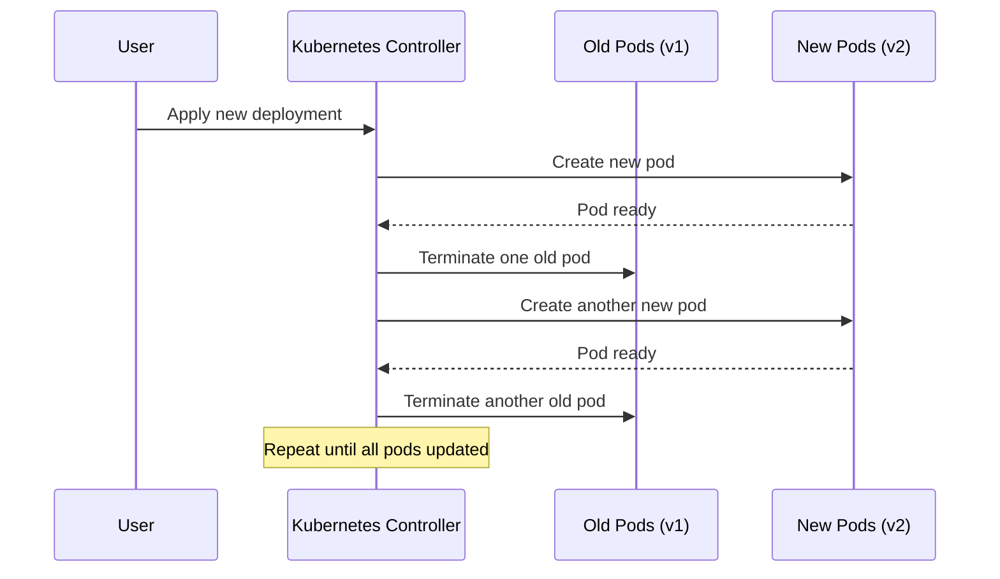
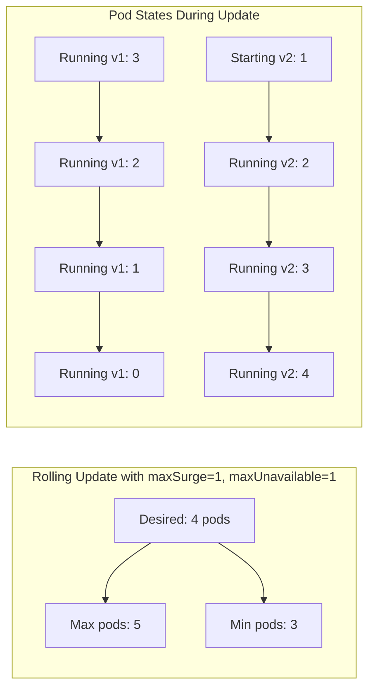

# How to Implement Rolling Update Parameters

Author: [nawazdhandala](https://github.com/nawazdhandala)

Tags: Kubernetes, Deployments, Rolling Updates, DevOps

Description: Learn to implement rolling update parameters for zero-downtime Kubernetes deployments.

---

Rolling updates allow you to update your applications without downtime. Kubernetes handles this by gradually replacing old pods with new ones, ensuring your service remains available throughout the process. This guide walks you through configuring rolling update parameters to achieve smooth, controlled deployments.

## Understanding Rolling Updates

When you update a Deployment in Kubernetes, the controller creates new pods with the updated specification while terminating old pods. The key is controlling how many pods can be unavailable during this transition and how many new pods can be created beyond the desired count.

The following diagram shows how a rolling update progresses from the old version to the new version.



## Key Rolling Update Parameters

Kubernetes provides two parameters to control the rolling update behavior: `maxUnavailable` and `maxSurge`. These parameters determine the pace and safety of your deployments.

### maxUnavailable

This parameter specifies the maximum number of pods that can be unavailable during the update. You can set it as an absolute number or a percentage of desired pods. Setting this to 0 means Kubernetes will never take down a pod until a new one is ready.

### maxSurge

This parameter defines how many pods can be created above the desired replica count. A higher value speeds up deployments but requires more cluster resources temporarily.

The following diagram illustrates how these parameters affect pod counts during a rolling update.



## Basic Rolling Update Configuration

Here is a Deployment manifest with rolling update parameters configured. The strategy section defines how updates should proceed.

```yaml
# Deployment with rolling update strategy
# This configuration ensures zero-downtime updates
apiVersion: apps/v1
kind: Deployment
metadata:
  name: web-application
  labels:
    app: web
spec:
  # Total number of pod replicas to maintain
  replicas: 4
  selector:
    matchLabels:
      app: web
  # Rolling update strategy configuration
  strategy:
    type: RollingUpdate
    rollingUpdate:
      # Maximum pods that can be unavailable during update
      # 25% of 4 replicas = 1 pod can be down at a time
      maxUnavailable: 25%
      # Maximum pods that can exist above desired count
      # 25% of 4 replicas = 1 extra pod during update
      maxSurge: 25%
  template:
    metadata:
      labels:
        app: web
    spec:
      containers:
      - name: web
        image: nginx:1.21
        ports:
        - containerPort: 80
        # Resource limits help scheduler make better decisions
        resources:
          requests:
            memory: "128Mi"
            cpu: "100m"
          limits:
            memory: "256Mi"
            cpu: "200m"
```

## Configuring for Different Scenarios

Different applications have different requirements. Here are configurations for common scenarios.

### High Availability Configuration

When your application cannot tolerate any downtime, use this configuration. It ensures new pods are running before old ones terminate.

```yaml
# Zero-downtime configuration for critical services
# New pods must be ready before old pods are removed
apiVersion: apps/v1
kind: Deployment
metadata:
  name: critical-service
spec:
  replicas: 6
  strategy:
    type: RollingUpdate
    rollingUpdate:
      # Never reduce available pods below desired count
      maxUnavailable: 0
      # Allow up to 2 extra pods during update
      # This speeds up the rollout while maintaining availability
      maxSurge: 2
  template:
    spec:
      containers:
      - name: app
        image: myapp:v2
        # Readiness probe ensures traffic only goes to healthy pods
        readinessProbe:
          httpGet:
            path: /health
            port: 8080
          # Wait 5 seconds before first check
          initialDelaySeconds: 5
          # Check every 10 seconds
          periodSeconds: 10
          # Pod must respond within 3 seconds
          timeoutSeconds: 3
          # Require 2 successful checks before marking ready
          successThreshold: 2
          # Mark unhealthy after 3 failures
          failureThreshold: 3
```

### Resource Constrained Configuration

When cluster resources are limited, minimize the surge to avoid resource pressure during updates.

```yaml
# Configuration for clusters with limited resources
# Minimizes additional resource usage during updates
apiVersion: apps/v1
kind: Deployment
metadata:
  name: resource-conscious-app
spec:
  replicas: 4
  strategy:
    type: RollingUpdate
    rollingUpdate:
      # Allow one pod to be unavailable
      # This frees resources for the new pod
      maxUnavailable: 1
      # Do not create extra pods beyond desired count
      # Update happens by replacing pods one at a time
      maxSurge: 0
  template:
    spec:
      containers:
      - name: app
        image: myapp:v2
```

### Fast Rollout Configuration

When you need to deploy quickly and have sufficient resources, increase both parameters.

```yaml
# Fast deployment configuration
# Use when rapid rollout is more important than gradual transition
apiVersion: apps/v1
kind: Deployment
metadata:
  name: fast-rollout-app
spec:
  replicas: 10
  strategy:
    type: RollingUpdate
    rollingUpdate:
      # Allow up to 3 pods unavailable simultaneously
      maxUnavailable: 3
      # Create up to 5 extra pods during update
      maxSurge: 5
  template:
    spec:
      containers:
      - name: app
        image: myapp:v2
```

## Adding Readiness and Liveness Probes

Rolling updates work best with properly configured health checks. Without them, Kubernetes might route traffic to pods that are not ready or keep unhealthy pods running.

```yaml
# Complete deployment with health checks for safe rolling updates
apiVersion: apps/v1
kind: Deployment
metadata:
  name: production-app
spec:
  replicas: 4
  strategy:
    type: RollingUpdate
    rollingUpdate:
      maxUnavailable: 1
      maxSurge: 1
  template:
    spec:
      containers:
      - name: app
        image: myapp:v2
        ports:
        - containerPort: 8080
        # Readiness probe controls when pod receives traffic
        readinessProbe:
          httpGet:
            path: /ready
            port: 8080
          initialDelaySeconds: 10
          periodSeconds: 5
          timeoutSeconds: 2
          successThreshold: 1
          failureThreshold: 3
        # Liveness probe restarts unhealthy pods
        livenessProbe:
          httpGet:
            path: /health
            port: 8080
          initialDelaySeconds: 30
          periodSeconds: 10
          timeoutSeconds: 5
          failureThreshold: 3
        # Startup probe for slow-starting applications
        startupProbe:
          httpGet:
            path: /health
            port: 8080
          # Allow up to 5 minutes for startup (30 * 10 seconds)
          failureThreshold: 30
          periodSeconds: 10
```

## Monitoring Rolling Updates

You can monitor the progress of a rolling update using kubectl commands.

```bash
# Watch the rollout status in real-time
# This command blocks until the rollout completes or fails
kubectl rollout status deployment/web-application

# View rollout history to see previous revisions
kubectl rollout history deployment/web-application

# Get detailed information about the deployment
# Shows current replicas, updated replicas, and available replicas
kubectl describe deployment web-application

# Watch pods being created and terminated during update
kubectl get pods -l app=web -w
```

## Rolling Back a Deployment

If something goes wrong during or after a rolling update, you can roll back to a previous version.

```bash
# Roll back to the previous revision
kubectl rollout undo deployment/web-application

# Roll back to a specific revision number
# Use 'kubectl rollout history' to find the revision number
kubectl rollout undo deployment/web-application --to-revision=2

# Pause a rollout if you notice issues during deployment
kubectl rollout pause deployment/web-application

# Resume a paused rollout after investigation
kubectl rollout resume deployment/web-application
```

## Best Practices

When implementing rolling updates, keep these guidelines in mind:

1. **Always configure readiness probes** to prevent traffic from reaching pods that are not ready to serve requests.

2. **Start with conservative settings** like `maxUnavailable: 1` and `maxSurge: 1`, then adjust based on your requirements.

3. **Test your rolling update configuration** in a staging environment before applying to production.

4. **Set appropriate resource requests and limits** to help the scheduler place pods effectively during updates.

5. **Use minReadySeconds** to add a delay after a pod becomes ready before continuing the rollout. This catches issues that appear shortly after startup.

```yaml
# Adding minReadySeconds for extra safety
spec:
  # Wait 30 seconds after pod is ready before proceeding
  # Helps catch issues that appear shortly after startup
  minReadySeconds: 30
  strategy:
    type: RollingUpdate
    rollingUpdate:
      maxUnavailable: 1
      maxSurge: 1
```

## Conclusion

Rolling update parameters give you fine-grained control over how Kubernetes deploys new versions of your applications. By configuring `maxUnavailable` and `maxSurge` appropriately and adding proper health checks, you can achieve zero-downtime deployments that match your availability requirements and resource constraints.

Start with the high availability configuration if uptime is critical, or use the resource-constrained approach if cluster resources are limited. Monitor your rollouts and be ready to pause or roll back if issues arise.

**Related Reading:**

- [How to configure MetalLB with Kubernetes (Microk8s)](https://oneuptime.com/blog/post/2023-11-06-configure-metallb-with-kubernetes-microk8s/view)
- [How moving from AWS to Bare-Metal saved us $230,000 /yr.](https://oneuptime.com/blog/post/2023-10-30-moving-from-aws-to-bare-metal/view)
- [Why build open-source DataDog?](https://oneuptime.com/blog/post/2024-08-14-why-build-open-source-datadog/view)
