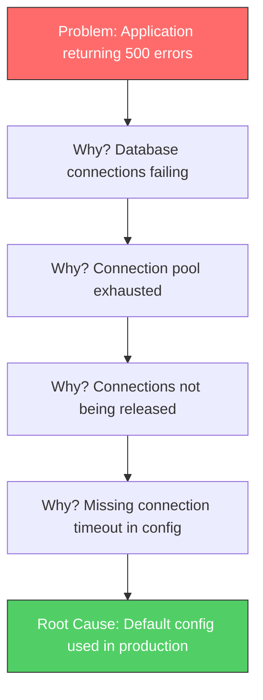
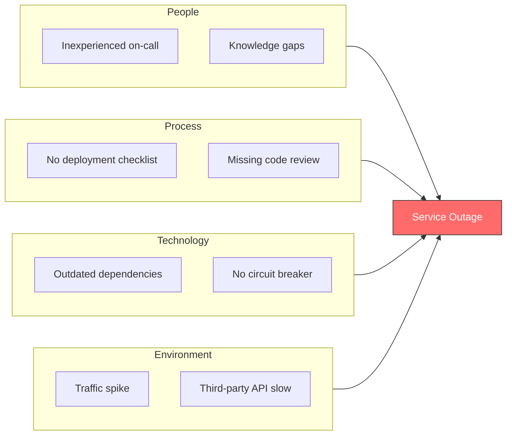

# How to Create Root Cause Analysis

Author: [nawazdhandala](https://github.com/nawazdhandala)

Tags: SRE, RCA, Incidents, Reliability

Description: A practical guide to conducting root cause analysis that uncovers the real reasons behind incidents and prevents them from happening again.

---

When an incident happens, the natural instinct is to fix it and move on. The system is back up, customers are happy again, and there are features to ship. But without understanding why the incident happened in the first place, you are almost guaranteed to see it again. Root Cause Analysis (RCA) is the practice of digging deeper to find the actual causes behind failures, not just the symptoms.

This guide walks you through the techniques, templates, and thought processes that make RCA effective. By the end, you will have practical tools to turn every incident into an opportunity for lasting improvement.

## What is Root Cause Analysis?

Root Cause Analysis is a systematic process for identifying the underlying reasons why an incident occurred. The goal is not to find someone to blame, but to understand the chain of events and conditions that led to the failure. A good RCA answers three questions:

1. What happened?
2. Why did it happen?
3. How do we prevent it from happening again?

The emphasis on "why" is what separates RCA from simple incident reports. You are not looking for the immediate trigger. You are looking for the deeper systemic issues that allowed the trigger to cause a failure.

## The 5-Whys Technique

The 5-Whys is the simplest and most widely used RCA technique. You start with the problem and ask "why" repeatedly until you reach the root cause. The name suggests five iterations, but you might need fewer or more depending on the situation.

### Example: Database Connection Failures

Let us walk through a real example. Your application started returning errors because it could not connect to the database.



**Why 1:** Why is the application returning 500 errors?
Because database connections are failing.

**Why 2:** Why are database connections failing?
Because the connection pool is exhausted.

**Why 3:** Why is the connection pool exhausted?
Because connections are not being released after use.

**Why 4:** Why are connections not being released?
Because the connection timeout configuration was missing.

**Why 5:** Why was the timeout configuration missing?
Because the default configuration template was deployed to production without review.

The root cause is not "database connections failing." That is a symptom. The root cause is that the deployment process allowed default configurations to reach production without proper validation.

### Tips for Effective 5-Whys

- **Stay specific.** Vague answers lead to vague solutions. "Human error" is never a root cause.
- **Follow the evidence.** Each "why" should be supported by logs, metrics, or documented facts.
- **Avoid jumping to conclusions.** Let the evidence guide you, not your assumptions about what went wrong.
- **Know when to stop.** Stop when you reach something actionable that your team can change.

## The Fishbone Diagram (Ishikawa)

For complex incidents with multiple contributing factors, the Fishbone diagram helps organize your analysis. It categorizes potential causes into groups, making it easier to identify patterns and ensure you are not missing anything.



### Common Categories for Technical Incidents

**People:** Training gaps, communication failures, staffing issues, handoff problems

**Process:** Missing procedures, unclear ownership, inadequate testing, deployment practices

**Technology:** Software bugs, infrastructure limitations, monitoring gaps, technical debt

**Environment:** Traffic patterns, third-party dependencies, network conditions, hardware failures

### When to Use Fishbone vs 5-Whys

Use **5-Whys** when:
- The incident has a clear linear progression
- You need a quick analysis
- The cause appears to be singular

Use **Fishbone** when:
- Multiple factors contributed to the incident
- Different teams or systems were involved
- You want to ensure comprehensive coverage

## Contributing Factors vs Root Causes

Not every factor that contributed to an incident is a root cause. Understanding the difference helps you prioritize your remediation efforts.

**Root Cause:** The fundamental reason the incident occurred. Fixing this would have prevented the incident entirely.

**Contributing Factors:** Conditions that made the incident worse or more likely, but were not the primary cause.

### Example Breakdown

Consider an incident where a deployment caused a 30-minute outage:

| Factor | Classification | Reasoning |
|--------|---------------|-----------|
| Bug in the code | Root Cause | This is what actually broke the system |
| No automated tests for that code path | Contributing Factor | Would have caught the bug before deployment |
| Slow rollback process | Contributing Factor | Extended the duration of the outage |
| Alert delay | Contributing Factor | Delayed detection by 5 minutes |

All of these deserve attention, but the bug is the root cause. The others are contributing factors that made the incident worse than it needed to be.

## Identifying Systemic Issues

The most valuable RCAs look beyond the immediate incident to find systemic patterns. These are the organizational, cultural, or architectural issues that create conditions for incidents to occur repeatedly.

### Questions to Uncover Systemic Issues

- Has a similar incident happened before? Why did the previous fix not prevent this one?
- Why did the conditions that allowed this incident exist in the first place?
- What decisions led to the current state of the system?
- Are there other areas of the codebase or infrastructure with similar risks?

### Common Systemic Issues

**Technical Debt Accumulation**
When teams consistently prioritize features over reliability work, technical debt compounds until it causes incidents.

**Knowledge Silos**
Critical system knowledge held by only one person creates single points of failure for incident response.

**Inadequate Testing Environments**
Production-only issues often stem from test environments that do not accurately reflect real conditions.

**Alert Fatigue**
Too many low-priority alerts train teams to ignore notifications, causing real issues to slip through.

**Missing Observability**
You cannot fix what you cannot see. Gaps in monitoring and logging make root cause analysis harder and extend incident duration.

## Prevention Strategies

A root cause analysis is only useful if it leads to action. Prevention strategies should address both the immediate root cause and the systemic issues that enabled it.

### Short-term Fixes

These are tactical changes that directly address the root cause:

- Deploy a code fix for the bug
- Add the missing configuration validation
- Update the runbook with the correct procedure
- Add monitoring for the failure condition

### Long-term Improvements

These address the systemic issues:

- Implement automated testing requirements for deployment
- Create documentation standards and review processes
- Establish regular technical debt reduction sprints
- Build training programs for common failure modes

### Prioritizing Prevention Work

Not all prevention work is equal. Prioritize based on:

1. **Likelihood of recurrence:** How probable is it that this will happen again?
2. **Impact severity:** How bad was the incident? Could it be worse next time?
3. **Cost to fix:** How much effort will prevention require?
4. **Breadth of impact:** Will this fix prevent other potential incidents?

## RCA Template

Here is a template you can use for your own root cause analyses. Copy and customize it for your team.

```markdown
# Root Cause Analysis: [Incident Title]

**Date:** [Incident Date]
**Author:** [Your Name]
**Severity:** [Critical/High/Medium/Low]
**Duration:** [Start Time] to [End Time]

## Summary

[2-3 sentence description of what happened and the business impact]

## Timeline

| Time | Event |
|------|-------|
| HH:MM | First alert triggered |
| HH:MM | On-call engineer notified |
| HH:MM | Root cause identified |
| HH:MM | Fix deployed |
| HH:MM | Service fully recovered |

## Impact

- Users affected: [Number or percentage]
- Revenue impact: [If applicable]
- SLA impact: [Error budget consumed]

## Root Cause

[Clear statement of the root cause, supported by evidence]

## 5-Whys Analysis

1. Why did [symptom] happen?
   Because [reason 1]

2. Why did [reason 1] happen?
   Because [reason 2]

[Continue until you reach the root cause]

## Contributing Factors

- [Factor 1]: [How it contributed]
- [Factor 2]: [How it contributed]

## What Went Well

- [Positive aspect of the response]
- [Another positive aspect]

## What Could Be Improved

- [Area for improvement]
- [Another area]

## Action Items

| Action | Owner | Priority | Due Date |
|--------|-------|----------|----------|
| [Specific action] | [Name] | [P0/P1/P2] | [Date] |

## Systemic Issues Identified

[Description of any broader patterns or organizational issues this incident revealed]

## Related Incidents

- [Link to similar past incidents if applicable]
```

## Common RCA Mistakes to Avoid

**Stopping at the first answer.** The first "why" is almost never the root cause. Keep digging.

**Blaming individuals.** "Engineer X made a mistake" is not a root cause. Ask why the system allowed that mistake to cause an outage.

**Accepting "human error" as a cause.** Every human error has systemic factors behind it. Why was the error possible? Why was there no safeguard?

**Focusing only on technology.** Process and organizational factors often contribute more to incidents than purely technical issues.

**Creating action items with no owner.** Every action item needs a specific person responsible and a deadline. "We should improve monitoring" is not an action item.

**Never following up.** Schedule a follow-up to verify that action items were completed and effective.

## Making RCA a Habit

Root cause analysis works best when it becomes part of your team culture, not a box to check after major incidents.

- **Run RCA for near-misses too.** An incident that was caught before impacting users still has valuable lessons.
- **Make RCAs visible.** Share findings with the broader team. Patterns become easier to spot when everyone can see the data.
- **Celebrate good RCAs.** Recognize thorough analysis and effective prevention work, not just incident response heroics.
- **Review past RCAs periodically.** Are the same root causes showing up repeatedly? That is a sign of systemic issues that need executive attention.

## Conclusion

Root cause analysis transforms incidents from frustrating disruptions into opportunities for improvement. The techniques themselves are straightforward. The hard part is the discipline to dig deep enough, the honesty to acknowledge systemic issues, and the follow-through to implement prevention measures.

Start with your next incident. Ask "why" five times. Document what you find. Assign action items with owners and deadlines. Follow up. Over time, you will see the same types of incidents stop happening, and your systems will become genuinely more reliable.

The goal is not to prevent all incidents. That is impossible. The goal is to stop having the same incident twice.

**Related Reading:**

- [Effective Incident Postmortem Templates](https://oneuptime.com/blog/post/2025-09-09-effective-incident-postmortem-templates-ready-to-use-examples/view)
- [The Five Stages of SRE Maturity](https://oneuptime.com/blog/post/2025-09-01-the-five-stages-of-sre-maturity/view)
- [SRE Best Practices](https://oneuptime.com/blog/post/2025-11-28-sre-best-practices/view)
