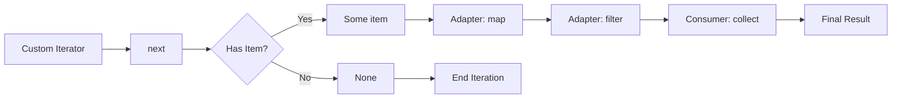

# How to Implement Custom Iterator in Rust

Author: [nawazdhandala](https://www.github.com/nawazdhandala)

Tags: Rust, Iterator, Traits, Systems Programming, Functional Programming

Description: Build custom iterators in Rust by implementing the Iterator trait, with examples for lazy evaluation, infinite sequences, and iterator adapters.

---

One of Rust's most powerful features is its iterator system. While the standard library provides iterators for common collections, you will often need to create your own. Custom iterators let you define exactly how your data structures should be traversed, and they integrate seamlessly with Rust's functional programming features like `map`, `filter`, and `collect`.

## The Iterator Trait

At its core, the `Iterator` trait requires only one method: `next()`. This method returns `Some(item)` while there are items to yield, and `None` when the sequence ends.

```rust
// The Iterator trait definition (simplified)
pub trait Iterator {
    // The type of elements being iterated over
    type Item;

    // Returns the next item in the sequence
    fn next(&mut self) -> Option<Self::Item>;
}
```

Once you implement `next()`, you get dozens of adapter methods for free: `map`, `filter`, `take`, `skip`, `enumerate`, and many more.

## Building a Simple Counter

Let's start with a basic example: a counter that yields numbers from a starting value up to a limit.

```rust
// A simple counter that counts from start to end
struct Counter {
    current: u32,
    end: u32,
}

impl Counter {
    // Create a new counter with specified range
    fn new(start: u32, end: u32) -> Self {
        Counter {
            current: start,
            end,
        }
    }
}

// Implement the Iterator trait for Counter
impl Iterator for Counter {
    // Our iterator yields u32 values
    type Item = u32;

    fn next(&mut self) -> Option<Self::Item> {
        // Check if we have more values to yield
        if self.current < self.end {
            let value = self.current;
            self.current += 1;
            Some(value)
        } else {
            // Signal that iteration is complete
            None
        }
    }
}

fn main() {
    // Create and use the counter
    let counter = Counter::new(1, 6);

    // Collect into a vector
    let numbers: Vec<u32> = counter.collect();
    println!("Numbers: {:?}", numbers);
    // Output: Numbers: [1, 2, 3, 4, 5]

    // Use with iterator adapters
    let sum: u32 = Counter::new(1, 11)
        .filter(|n| n % 2 == 0)  // Keep only even numbers
        .sum();
    println!("Sum of evens 1-10: {}", sum);
    // Output: Sum of evens 1-10: 30
}
```

## Infinite Iterators

Iterators do not have to end. You can create infinite sequences and rely on consumers like `take()` to limit them.

```rust
// Generates an infinite sequence of Fibonacci numbers
struct Fibonacci {
    current: u64,
    next: u64,
}

impl Fibonacci {
    fn new() -> Self {
        Fibonacci {
            current: 0,
            next: 1,
        }
    }
}

impl Iterator for Fibonacci {
    type Item = u64;

    fn next(&mut self) -> Option<Self::Item> {
        let value = self.current;

        // Calculate the next Fibonacci number
        let new_next = self.current + self.next;
        self.current = self.next;
        self.next = new_next;

        // Always return Some - this iterator never ends
        Some(value)
    }
}

fn main() {
    // Take first 10 Fibonacci numbers
    let fibs: Vec<u64> = Fibonacci::new().take(10).collect();
    println!("First 10 Fibonacci: {:?}", fibs);
    // Output: First 10 Fibonacci: [0, 1, 1, 2, 3, 5, 8, 13, 21, 34]

    // Find the first Fibonacci number greater than 1000
    let big_fib = Fibonacci::new()
        .find(|&n| n > 1000)
        .unwrap();
    println!("First Fibonacci > 1000: {}", big_fib);
    // Output: First Fibonacci > 1000: 1597
}
```

## Iterating Over Struct Fields

A common use case is creating an iterator for a custom data structure.

```rust
// A collection of sensor readings
struct SensorData {
    readings: Vec<f64>,
}

// A borrowing iterator over sensor readings
struct SensorIter<'a> {
    data: &'a SensorData,
    index: usize,
}

impl SensorData {
    fn new(readings: Vec<f64>) -> Self {
        SensorData { readings }
    }

    // Return an iterator that borrows the data
    fn iter(&self) -> SensorIter {
        SensorIter {
            data: self,
            index: 0,
        }
    }
}

impl<'a> Iterator for SensorIter<'a> {
    // Yield references to avoid copying
    type Item = &'a f64;

    fn next(&mut self) -> Option<Self::Item> {
        if self.index < self.data.readings.len() {
            let reading = &self.data.readings[self.index];
            self.index += 1;
            Some(reading)
        } else {
            None
        }
    }
}

fn main() {
    let sensor = SensorData::new(vec![23.5, 24.1, 22.8, 25.0, 23.9]);

    // Calculate average reading
    let sum: f64 = sensor.iter().sum();
    let count = sensor.readings.len();
    println!("Average: {:.2}", sum / count as f64);

    // Find readings above threshold
    let high: Vec<&f64> = sensor.iter()
        .filter(|&&r| r > 24.0)
        .collect();
    println!("High readings: {:?}", high);
}
```

## The IntoIterator Trait

To enable the `for item in collection` syntax, implement `IntoIterator`. This trait converts a type into an iterator.

```rust
struct Playlist {
    songs: Vec<String>,
}

// Owning iterator - consumes the playlist
struct PlaylistIntoIter {
    songs: std::vec::IntoIter<String>,
}

impl Playlist {
    fn new(songs: Vec<String>) -> Self {
        Playlist { songs }
    }
}

// Implement IntoIterator for owned Playlist
impl IntoIterator for Playlist {
    type Item = String;
    type IntoIter = PlaylistIntoIter;

    fn into_iter(self) -> Self::IntoIter {
        PlaylistIntoIter {
            songs: self.songs.into_iter(),
        }
    }
}

impl Iterator for PlaylistIntoIter {
    type Item = String;

    fn next(&mut self) -> Option<Self::Item> {
        self.songs.next()
    }
}

fn main() {
    let playlist = Playlist::new(vec![
        String::from("Song A"),
        String::from("Song B"),
        String::from("Song C"),
    ]);

    // Use for-in loop directly on the playlist
    for song in playlist {
        println!("Now playing: {}", song);
    }
}
```

## Optimizing with size_hint

The `size_hint()` method helps consumers allocate memory efficiently. Override it when you know the iterator's size.

```rust
struct Range {
    start: usize,
    end: usize,
}

impl Range {
    fn new(start: usize, end: usize) -> Self {
        Range { start, end }
    }
}

impl Iterator for Range {
    type Item = usize;

    fn next(&mut self) -> Option<Self::Item> {
        if self.start < self.end {
            let val = self.start;
            self.start += 1;
            Some(val)
        } else {
            None
        }
    }

    // Provide size hint for better allocation
    fn size_hint(&self) -> (usize, Option<usize>) {
        let remaining = self.end.saturating_sub(self.start);
        // Return (lower_bound, Some(upper_bound))
        (remaining, Some(remaining))
    }
}

fn main() {
    let range = Range::new(0, 1000);

    // collect() uses size_hint to pre-allocate
    let numbers: Vec<usize> = range.collect();
    println!("Collected {} numbers", numbers.len());
}
```

## How Iterators Work

The following diagram shows how a custom iterator flows through adapter chains:



## Practical Example: Chunk Iterator

Here is a more practical iterator that yields chunks of a slice.

```rust
// Iterator that yields chunks of a slice
struct Chunks<'a, T> {
    data: &'a [T],
    chunk_size: usize,
}

impl<'a, T> Chunks<'a, T> {
    fn new(data: &'a [T], chunk_size: usize) -> Self {
        assert!(chunk_size > 0, "Chunk size must be positive");
        Chunks { data, chunk_size }
    }
}

impl<'a, T> Iterator for Chunks<'a, T> {
    type Item = &'a [T];

    fn next(&mut self) -> Option<Self::Item> {
        if self.data.is_empty() {
            return None;
        }

        // Calculate chunk boundaries
        let chunk_end = self.chunk_size.min(self.data.len());
        let chunk = &self.data[..chunk_end];

        // Advance past this chunk
        self.data = &self.data[chunk_end..];

        Some(chunk)
    }

    fn size_hint(&self) -> (usize, Option<usize>) {
        // Calculate number of chunks
        let len = (self.data.len() + self.chunk_size - 1) / self.chunk_size;
        (len, Some(len))
    }
}

fn main() {
    let data = vec![1, 2, 3, 4, 5, 6, 7, 8, 9, 10];

    // Process in chunks of 3
    for (i, chunk) in Chunks::new(&data, 3).enumerate() {
        println!("Chunk {}: {:?}", i, chunk);
    }
    // Output:
    // Chunk 0: [1, 2, 3]
    // Chunk 1: [4, 5, 6]
    // Chunk 2: [7, 8, 9]
    // Chunk 3: [10]
}
```

## Summary

Custom iterators in Rust are straightforward to implement:

1. Define a struct to hold the iteration state
2. Implement the `Iterator` trait with the `next()` method
3. Optionally implement `size_hint()` for better performance
4. Implement `IntoIterator` to enable `for-in` syntax

The payoff is significant: your custom types integrate with Rust's entire iterator ecosystem. You get lazy evaluation, method chaining, and zero-cost abstractions automatically. Whether you are building a game engine, processing data streams, or working with custom collections, mastering custom iterators will make your Rust code more expressive and efficient.
