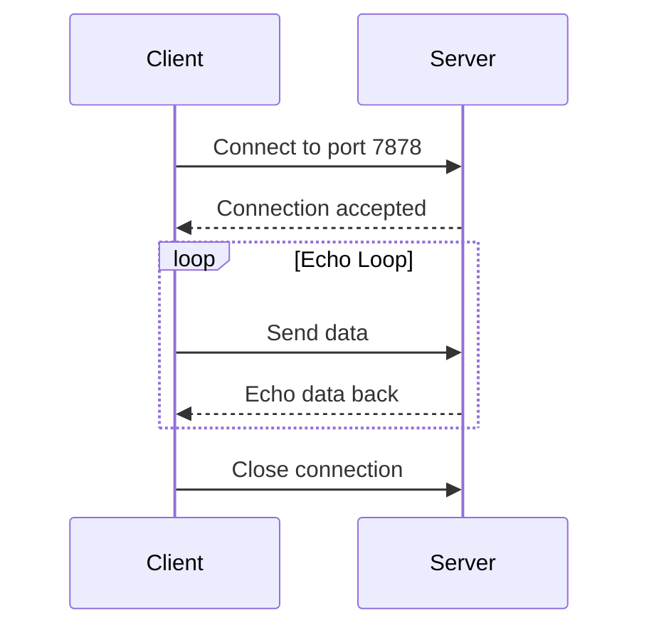

# How to Build a TCP Echo Server in Rust

Author: [nawazdhandala](https://www.github.com/nawazdhandala)

Tags: Rust, TCP, Networking, Systems Programming, Async

Description: Step-by-step guide to building a TCP echo server in Rust, covering both synchronous and async approaches with proper error handling.

---

Building a TCP echo server is one of the best ways to understand network programming fundamentals. An echo server simply receives data from a client and sends it back - straightforward, but it touches on all the core concepts you need for more complex networking applications. In this guide, we will build both a synchronous and asynchronous TCP echo server in Rust, progressively adding features like concurrent connections and proper error handling.

## What We Will Build

Our echo server will:
- Listen for incoming TCP connections on a specified port
- Accept multiple client connections
- Read data from each client and echo it back
- Handle errors gracefully without crashing

Here is the high-level architecture of what we are building:



## Prerequisites

Make sure you have Rust installed. You can verify with:

```bash
rustc --version
cargo --version
```

Create a new project:

```bash
cargo new tcp-echo-server
cd tcp-echo-server
```

## Part 1: Basic Synchronous Echo Server

Let us start with the simplest possible implementation using the standard library's `std::net` module.

```rust
// src/main.rs
use std::io::{Read, Write};
use std::net::{TcpListener, TcpStream};

// Handle a single client connection
fn handle_client(mut stream: TcpStream) -> std::io::Result<()> {
    // Buffer to store incoming data
    let mut buffer = [0u8; 1024];

    // Get client address for logging
    let peer_addr = stream.peer_addr()?;
    println!("New connection from: {}", peer_addr);

    // Read and echo in a loop until client disconnects
    loop {
        // Read data from the client
        let bytes_read = stream.read(&mut buffer)?;

        // If we read 0 bytes, the client has disconnected
        if bytes_read == 0 {
            println!("Client {} disconnected", peer_addr);
            return Ok(());
        }

        // Echo the data back to the client
        stream.write_all(&buffer[..bytes_read])?;

        // Log what we echoed (useful for debugging)
        let received = String::from_utf8_lossy(&buffer[..bytes_read]);
        println!("Echoed {} bytes to {}: {}", bytes_read, peer_addr, received.trim());
    }
}

fn main() -> std::io::Result<()> {
    // Bind to localhost on port 7878
    let listener = TcpListener::bind("127.0.0.1:7878")?;
    println!("Echo server listening on port 7878");

    // Accept connections and handle them sequentially
    for stream in listener.incoming() {
        match stream {
            Ok(stream) => {
                if let Err(e) = handle_client(stream) {
                    eprintln!("Error handling client: {}", e);
                }
            }
            Err(e) => {
                eprintln!("Failed to accept connection: {}", e);
            }
        }
    }

    Ok(())
}
```

Run the server with `cargo run` and test it using netcat:

```bash
# In one terminal
cargo run

# In another terminal
nc localhost 7878
# Type anything and press Enter - you should see it echoed back
```

The problem with this implementation is that it can only handle one client at a time. While one client is connected, all others have to wait.

## Part 2: Multi-threaded Synchronous Server

To handle multiple clients concurrently, we can spawn a new thread for each connection.

```rust
// src/main.rs
use std::io::{Read, Write};
use std::net::{TcpListener, TcpStream};
use std::thread;

fn handle_client(mut stream: TcpStream) -> std::io::Result<()> {
    let mut buffer = [0u8; 1024];
    let peer_addr = stream.peer_addr()?;
    println!("New connection from: {}", peer_addr);

    loop {
        let bytes_read = stream.read(&mut buffer)?;

        if bytes_read == 0 {
            println!("Client {} disconnected", peer_addr);
            return Ok(());
        }

        stream.write_all(&buffer[..bytes_read])?;
    }
}

fn main() -> std::io::Result<()> {
    let listener = TcpListener::bind("127.0.0.1:7878")?;
    println!("Multi-threaded echo server listening on port 7878");

    for stream in listener.incoming() {
        match stream {
            Ok(stream) => {
                // Spawn a new thread for each client connection
                thread::spawn(move || {
                    if let Err(e) = handle_client(stream) {
                        eprintln!("Error handling client: {}", e);
                    }
                });
            }
            Err(e) => {
                eprintln!("Failed to accept connection: {}", e);
            }
        }
    }

    Ok(())
}
```

This works but spawning a thread per connection does not scale well. For thousands of concurrent connections, you would run into resource limits.

## Part 3: Async Echo Server with Tokio

For production-grade servers, async I/O is the way to go. Tokio is the most popular async runtime for Rust.

Add Tokio to your `Cargo.toml`:

```toml
[dependencies]
tokio = { version = "1", features = ["full"] }
```

Here is the async implementation:

```rust
// src/main.rs
use tokio::io::{AsyncReadExt, AsyncWriteExt};
use tokio::net::{TcpListener, TcpStream};

// Handle a single client connection asynchronously
async fn handle_client(mut stream: TcpStream) -> tokio::io::Result<()> {
    let mut buffer = [0u8; 1024];
    let peer_addr = stream.peer_addr()?;
    println!("New connection from: {}", peer_addr);

    loop {
        // Asynchronously read from the stream
        let bytes_read = stream.read(&mut buffer).await?;

        if bytes_read == 0 {
            println!("Client {} disconnected", peer_addr);
            return Ok(());
        }

        // Asynchronously write back to the stream
        stream.write_all(&buffer[..bytes_read]).await?;
    }
}

#[tokio::main]
async fn main() -> tokio::io::Result<()> {
    let listener = TcpListener::bind("127.0.0.1:7878").await?;
    println!("Async echo server listening on port 7878");

    loop {
        // Accept new connections
        let (stream, _) = listener.accept().await?;

        // Spawn a new task for each connection
        // Tasks are much lighter than threads
        tokio::spawn(async move {
            if let Err(e) = handle_client(stream).await {
                eprintln!("Error handling client: {}", e);
            }
        });
    }
}
```

The async version looks similar to the threaded version, but `tokio::spawn` creates lightweight tasks instead of OS threads. A single Tokio runtime can handle hundreds of thousands of concurrent connections.

## Part 4: Production-Ready Version with Graceful Shutdown

For a real-world server, you need graceful shutdown handling. Here is a more complete implementation:

```rust
// src/main.rs
use std::time::Duration;
use tokio::io::{AsyncReadExt, AsyncWriteExt};
use tokio::net::{TcpListener, TcpStream};
use tokio::signal;
use tokio::sync::broadcast;

async fn handle_client(
    mut stream: TcpStream,
    mut shutdown_rx: broadcast::Receiver<()>,
) -> tokio::io::Result<()> {
    let mut buffer = [0u8; 4096];
    let peer_addr = stream.peer_addr()?;
    println!("Connection established: {}", peer_addr);

    loop {
        tokio::select! {
            // Handle incoming data
            result = stream.read(&mut buffer) => {
                let bytes_read = result?;

                if bytes_read == 0 {
                    println!("Client disconnected: {}", peer_addr);
                    return Ok(());
                }

                // Set a write timeout to prevent blocking indefinitely
                match tokio::time::timeout(
                    Duration::from_secs(5),
                    stream.write_all(&buffer[..bytes_read])
                ).await {
                    Ok(result) => result?,
                    Err(_) => {
                        eprintln!("Write timeout for client: {}", peer_addr);
                        return Ok(());
                    }
                }
            }
            // Handle shutdown signal
            _ = shutdown_rx.recv() => {
                println!("Shutting down connection: {}", peer_addr);
                return Ok(());
            }
        }
    }
}

#[tokio::main]
async fn main() -> tokio::io::Result<()> {
    // Create a broadcast channel for shutdown signaling
    let (shutdown_tx, _) = broadcast::channel::<()>(1);

    let listener = TcpListener::bind("127.0.0.1:7878").await?;
    println!("Production echo server listening on port 7878");
    println!("Press Ctrl+C to shutdown gracefully");

    loop {
        tokio::select! {
            // Accept new connections
            result = listener.accept() => {
                let (stream, addr) = result?;
                println!("Accepted connection from: {}", addr);

                let shutdown_rx = shutdown_tx.subscribe();

                tokio::spawn(async move {
                    if let Err(e) = handle_client(stream, shutdown_rx).await {
                        eprintln!("Client error: {}", e);
                    }
                });
            }
            // Wait for Ctrl+C
            _ = signal::ctrl_c() => {
                println!("\nReceived shutdown signal");
                // Notify all clients to disconnect
                let _ = shutdown_tx.send(());
                // Give clients time to disconnect gracefully
                tokio::time::sleep(Duration::from_millis(100)).await;
                println!("Server shutdown complete");
                return Ok(());
            }
        }
    }
}
```

This version includes:
- Graceful shutdown with broadcast channels
- Write timeouts to prevent slow clients from blocking
- Proper cleanup when the server receives SIGINT (Ctrl+C)

## Testing Your Echo Server

You can test the server with multiple tools:

```bash
# Using netcat
nc localhost 7878

# Using telnet
telnet localhost 7878

# Using a simple Rust client
cargo run --example client
```

Here is a simple test client you can add as `examples/client.rs`:

```rust
use std::io::{self, BufRead, Write};
use std::net::TcpStream;

fn main() -> io::Result<()> {
    let mut stream = TcpStream::connect("127.0.0.1:7878")?;
    println!("Connected to echo server. Type messages (Ctrl+D to quit):");

    let stdin = io::stdin();
    for line in stdin.lock().lines() {
        let line = line?;

        // Send the line to the server
        writeln!(stream, "{}", line)?;

        // Read the response
        let mut response = [0u8; 1024];
        let n = std::io::Read::read(&mut stream, &mut response)?;
        print!("Echo: {}", String::from_utf8_lossy(&response[..n]));
    }

    Ok(())
}
```

## Performance Considerations

When building TCP servers in Rust, keep these points in mind:

1. **Buffer Size**: Our 4KB buffer works for most use cases. Larger buffers reduce system calls but use more memory per connection.

2. **Backpressure**: If clients send data faster than you can process it, implement backpressure by limiting read rates or connection counts.

3. **Connection Limits**: Use a semaphore to limit concurrent connections and prevent resource exhaustion.

4. **Keep-Alive**: For long-lived connections, consider implementing TCP keep-alive to detect dead connections.

## Wrapping Up

We have covered three approaches to building a TCP echo server in Rust:
- A basic single-threaded version for understanding the fundamentals
- A multi-threaded version for handling multiple clients
- An async Tokio-based version for production use

The async approach with Tokio is what you would use in production. It scales to handle thousands of concurrent connections efficiently while keeping your code readable and maintainable.

From here, you could extend this foundation to build more complex protocols - perhaps a chat server, a custom RPC system, or a game server. The patterns remain the same: accept connections, spawn handlers, manage state, and handle cleanup gracefully.
