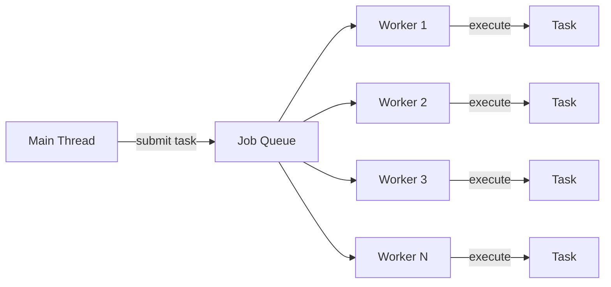

# How to Build a Thread Pool in Rust

Author: [nawazdhandala](https://www.github.com/nawazdhandala)

Tags: Rust, Thread Pool, Concurrency, Systems Programming, Performance

Description: Implement a thread pool from scratch in Rust with channels, worker threads, and graceful shutdown for parallel task execution.

---

Thread pools are fundamental to building high-performance applications. Instead of spawning a new thread for every task (which is expensive), a thread pool maintains a fixed number of worker threads that process tasks from a queue. This approach reduces thread creation overhead and limits resource consumption.

In this guide, we will build a thread pool from scratch in Rust using channels for communication and proper shutdown handling.

## Understanding the Architecture

Before diving into code, let's visualize how a thread pool works:



The main components are:

- **ThreadPool**: Manages workers and distributes tasks
- **Worker**: A struct holding a thread handle and an ID
- **Job**: A boxed closure that workers execute
- **Channel**: Connects the pool to workers for task distribution

## Basic Implementation

Let's start with a minimal thread pool that can execute closures.

```rust
use std::sync::{mpsc, Arc, Mutex};
use std::thread;

// A Job is a boxed closure that can be sent across threads
// FnOnce: can be called once
// Send: can be transferred between threads
// 'static: lives for the entire program duration
type Job = Box<dyn FnOnce() + Send + 'static>;

// Worker holds a thread handle and an identifier
struct Worker {
    id: usize,
    thread: Option<thread::JoinHandle<()>>,
}

impl Worker {
    // Create a new worker that listens for jobs on the receiver
    fn new(id: usize, receiver: Arc<Mutex<mpsc::Receiver<Job>>>) -> Worker {
        let thread = thread::spawn(move || {
            loop {
                // Lock the receiver and wait for a job
                // The lock is released as soon as we get the job
                let job = receiver.lock().unwrap().recv();

                match job {
                    Ok(job) => {
                        println!("Worker {} got a job; executing.", id);
                        job();
                    }
                    Err(_) => {
                        // Channel closed, time to shut down
                        println!("Worker {} shutting down.", id);
                        break;
                    }
                }
            }
        });

        Worker {
            id,
            thread: Some(thread),
        }
    }
}

// The ThreadPool manages workers and job distribution
pub struct ThreadPool {
    workers: Vec<Worker>,
    sender: Option<mpsc::Sender<Job>>,
}

impl ThreadPool {
    /// Create a new ThreadPool with the specified number of workers
    ///
    /// # Panics
    /// Panics if size is zero
    pub fn new(size: usize) -> ThreadPool {
        assert!(size > 0, "Thread pool size must be greater than zero");

        let (sender, receiver) = mpsc::channel();

        // Wrap receiver in Arc<Mutex> so all workers can share it
        let receiver = Arc::new(Mutex::new(receiver));

        let mut workers = Vec::with_capacity(size);

        for id in 0..size {
            workers.push(Worker::new(id, Arc::clone(&receiver)));
        }

        ThreadPool {
            workers,
            sender: Some(sender),
        }
    }

    /// Execute a closure on a worker thread
    pub fn execute<F>(&self, f: F)
    where
        F: FnOnce() + Send + 'static,
    {
        let job = Box::new(f);
        self.sender.as_ref().unwrap().send(job).unwrap();
    }
}

// Graceful shutdown when ThreadPool is dropped
impl Drop for ThreadPool {
    fn drop(&mut self) {
        // Drop the sender to close the channel
        // This signals workers to stop
        drop(self.sender.take());

        // Wait for all workers to finish
        for worker in &mut self.workers {
            println!("Shutting down worker {}", worker.id);
            if let Some(thread) = worker.thread.take() {
                thread.join().unwrap();
            }
        }
    }
}
```

## Using the Thread Pool

Here is how you would use the basic thread pool:

```rust
fn main() {
    let pool = ThreadPool::new(4);

    for i in 0..8 {
        pool.execute(move || {
            println!("Task {} running on thread {:?}", i, thread::current().id());
            thread::sleep(std::time::Duration::from_millis(100));
            println!("Task {} complete", i);
        });
    }

    // Pool is dropped here, triggering graceful shutdown
    // All tasks complete before main exits
}
```

## Adding a Builder Pattern

For more flexibility, let's add a builder that allows configuration options.

```rust
pub struct ThreadPoolBuilder {
    size: usize,
    name_prefix: String,
    stack_size: Option<usize>,
}

impl ThreadPoolBuilder {
    pub fn new() -> Self {
        ThreadPoolBuilder {
            size: num_cpus::get(), // Default to number of CPU cores
            name_prefix: String::from("worker"),
            stack_size: None,
        }
    }

    /// Set the number of worker threads
    pub fn num_threads(mut self, size: usize) -> Self {
        self.size = size;
        self
    }

    /// Set a prefix for worker thread names
    pub fn thread_name_prefix(mut self, prefix: &str) -> Self {
        self.name_prefix = prefix.to_string();
        self
    }

    /// Set the stack size for worker threads
    pub fn stack_size(mut self, size: usize) -> Self {
        self.stack_size = Some(size);
        self
    }

    /// Build the thread pool
    pub fn build(self) -> ThreadPool {
        let (sender, receiver) = mpsc::channel();
        let receiver = Arc::new(Mutex::new(receiver));

        let mut workers = Vec::with_capacity(self.size);

        for id in 0..self.size {
            let name = format!("{}-{}", self.name_prefix, id);
            let receiver_clone = Arc::clone(&receiver);

            // Build thread with custom settings
            let mut builder = thread::Builder::new().name(name);

            if let Some(stack_size) = self.stack_size {
                builder = builder.stack_size(stack_size);
            }

            let thread = builder
                .spawn(move || {
                    loop {
                        let job = receiver_clone.lock().unwrap().recv();
                        match job {
                            Ok(job) => job(),
                            Err(_) => break,
                        }
                    }
                })
                .expect("Failed to spawn worker thread");

            workers.push(Worker {
                id,
                thread: Some(thread),
            });
        }

        ThreadPool {
            workers,
            sender: Some(sender),
        }
    }
}
```

Usage with the builder:

```rust
let pool = ThreadPoolBuilder::new()
    .num_threads(8)
    .thread_name_prefix("my-pool")
    .stack_size(4 * 1024 * 1024) // 4MB stack
    .build();
```

## Handling Panics

Worker threads can panic if a task panics. Let's make workers resilient by catching panics and continuing to process jobs.

```rust
use std::panic::{self, AssertUnwindSafe};

impl Worker {
    fn new_resilient(id: usize, receiver: Arc<Mutex<mpsc::Receiver<Job>>>) -> Worker {
        let thread = thread::spawn(move || {
            loop {
                let job = receiver.lock().unwrap().recv();

                match job {
                    Ok(job) => {
                        // Catch panics so the worker can continue
                        let result = panic::catch_unwind(AssertUnwindSafe(|| {
                            job();
                        }));

                        if let Err(e) = result {
                            eprintln!("Worker {} caught panic: {:?}", id, e);
                            // Worker continues processing next job
                        }
                    }
                    Err(_) => {
                        break;
                    }
                }
            }
        });

        Worker {
            id,
            thread: Some(thread),
        }
    }
}
```

## Adding Task Results

Often you need to get results back from tasks. We can add a mechanism to return values using oneshot channels.

```rust
use std::sync::mpsc as std_mpsc;

pub struct ThreadPoolWithResults {
    workers: Vec<Worker>,
    sender: Option<mpsc::Sender<Job>>,
}

impl ThreadPoolWithResults {
    /// Execute a closure and return a receiver for the result
    pub fn execute_with_result<F, T>(&self, f: F) -> std_mpsc::Receiver<T>
    where
        F: FnOnce() -> T + Send + 'static,
        T: Send + 'static,
    {
        // Create a channel for the result
        let (result_tx, result_rx) = std_mpsc::channel();

        // Wrap the task to send result back
        let job = Box::new(move || {
            let result = f();
            // Ignore send errors (receiver may have been dropped)
            let _ = result_tx.send(result);
        });

        self.sender.as_ref().unwrap().send(job).unwrap();

        result_rx
    }
}
```

Usage:

```rust
let pool = ThreadPoolWithResults::new(4);

// Submit tasks and collect result receivers
let results: Vec<_> = (0..10)
    .map(|i| {
        pool.execute_with_result(move || {
            // Simulate some computation
            thread::sleep(std::time::Duration::from_millis(50));
            i * i
        })
    })
    .collect();

// Collect all results
for (i, rx) in results.into_iter().enumerate() {
    let result = rx.recv().unwrap();
    println!("Task {} result: {}", i, result);
}
```

## Complete Implementation

Here is the full implementation with all features combined:

```rust
use std::panic::{self, AssertUnwindSafe};
use std::sync::{mpsc, Arc, Mutex};
use std::thread;

type Job = Box<dyn FnOnce() + Send + 'static>;

struct Worker {
    id: usize,
    thread: Option<thread::JoinHandle<()>>,
}

pub struct ThreadPool {
    workers: Vec<Worker>,
    sender: Option<mpsc::Sender<Job>>,
}

impl ThreadPool {
    pub fn new(size: usize) -> ThreadPool {
        assert!(size > 0);

        let (sender, receiver) = mpsc::channel();
        let receiver = Arc::new(Mutex::new(receiver));

        let workers = (0..size)
            .map(|id| {
                let receiver = Arc::clone(&receiver);
                let thread = thread::Builder::new()
                    .name(format!("pool-worker-{}", id))
                    .spawn(move || loop {
                        let job = receiver.lock().unwrap().recv();

                        match job {
                            Ok(job) => {
                                if let Err(e) = panic::catch_unwind(AssertUnwindSafe(job)) {
                                    eprintln!("Worker {} task panicked: {:?}", id, e);
                                }
                            }
                            Err(_) => break,
                        }
                    })
                    .expect("Failed to spawn worker");

                Worker {
                    id,
                    thread: Some(thread),
                }
            })
            .collect();

        ThreadPool {
            workers,
            sender: Some(sender),
        }
    }

    pub fn execute<F>(&self, f: F)
    where
        F: FnOnce() + Send + 'static,
    {
        self.sender
            .as_ref()
            .expect("ThreadPool has been shut down")
            .send(Box::new(f))
            .expect("Failed to send job to worker");
    }

    /// Get the number of workers in the pool
    pub fn worker_count(&self) -> usize {
        self.workers.len()
    }
}

impl Drop for ThreadPool {
    fn drop(&mut self) {
        // Close the channel
        drop(self.sender.take());

        // Join all worker threads
        for worker in &mut self.workers {
            if let Some(thread) = worker.thread.take() {
                let _ = thread.join();
            }
        }
    }
}

#[cfg(test)]
mod tests {
    use super::*;
    use std::sync::atomic::{AtomicUsize, Ordering};

    #[test]
    fn test_basic_execution() {
        let pool = ThreadPool::new(4);
        let counter = Arc::new(AtomicUsize::new(0));

        for _ in 0..100 {
            let counter = Arc::clone(&counter);
            pool.execute(move || {
                counter.fetch_add(1, Ordering::SeqCst);
            });
        }

        drop(pool); // Wait for completion
        assert_eq!(counter.load(Ordering::SeqCst), 100);
    }

    #[test]
    fn test_panic_recovery() {
        let pool = ThreadPool::new(2);
        let counter = Arc::new(AtomicUsize::new(0));

        // This task will panic
        pool.execute(|| {
            panic!("Intentional panic");
        });

        // These should still run
        for _ in 0..10 {
            let counter = Arc::clone(&counter);
            pool.execute(move || {
                counter.fetch_add(1, Ordering::SeqCst);
            });
        }

        drop(pool);
        assert_eq!(counter.load(Ordering::SeqCst), 10);
    }
}
```

## When to Use This vs. Existing Crates

Building a thread pool from scratch is educational, but for production code consider using established crates:

- **rayon**: Best for data parallelism with work-stealing
- **tokio**: For async task execution
- **threadpool**: Simple, battle-tested thread pool

Use a custom implementation when you need specific behavior not provided by existing crates, or when learning how concurrent systems work.

## Summary

We built a thread pool with these key components:

- **Channel-based communication**: Workers receive jobs through a shared mpsc channel
- **Arc and Mutex**: Enable safe sharing of the receiver across threads
- **Graceful shutdown**: Dropping the sender signals workers to exit
- **Panic handling**: Workers catch panics and continue processing

Thread pools are essential for building performant systems. Understanding how they work helps you make better decisions about concurrency in your applications, even when using higher-level abstractions.

---

*Building concurrent Rust applications? [OneUptime](https://oneuptime.com) provides observability for Rust services with distributed tracing and performance monitoring to help you identify concurrency bottlenecks and thread contention issues.*
