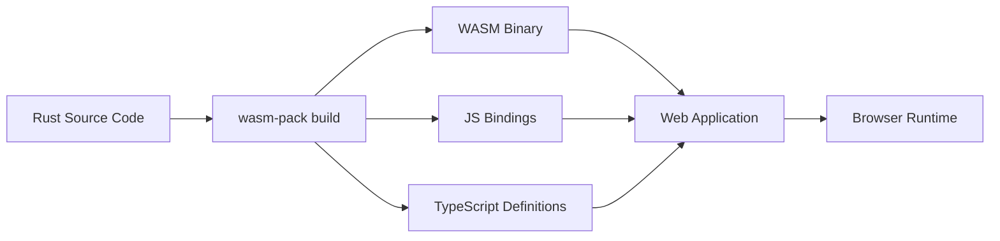

# How to Create WASM Modules with Rust

Author: [nawazdhandala](https://www.github.com/nawazdhandala)

Tags: Rust, WebAssembly, WASM, Web Development, Performance

Description: Build WebAssembly modules in Rust with wasm-pack and wasm-bindgen for high-performance web applications and JavaScript interop.

---

> WebAssembly (WASM) brings near-native performance to web applications. Combined with Rust's memory safety and zero-cost abstractions, you get a powerful toolchain for building high-performance modules that run in browsers, Node.js, and beyond.

Rust has become the go-to language for WebAssembly development. Its lack of garbage collection, small runtime, and excellent tooling make it ideal for producing compact, fast WASM binaries. This guide walks you through building your first Rust WASM module and integrating it with JavaScript.

---

## Prerequisites

Before starting, ensure you have:
- Rust installed (via [rustup](https://rustup.rs))
- Node.js 16+ and npm
- Basic familiarity with Rust and JavaScript

---

## Setting Up Your Environment

First, install `wasm-pack`, the primary tool for building Rust-generated WebAssembly packages.

```bash
# Install wasm-pack - the all-in-one tool for Rust WASM development
# It handles compilation, wasm-bindgen, and npm package generation
cargo install wasm-pack

# Add the WebAssembly target to your Rust toolchain
# This allows rustc to compile to the wasm32 architecture
rustup target add wasm32-unknown-unknown
```

---

## Creating Your First WASM Project

Create a new Rust library project configured for WebAssembly output.

```bash
# Create a new library project (not binary)
# WASM modules are libraries that export functions
cargo new --lib rust-wasm-demo
cd rust-wasm-demo
```

Update your `Cargo.toml` to include the necessary dependencies and configuration.

```toml
[package]
name = "rust-wasm-demo"
version = "0.1.0"
edition = "2021"

# Specify library type for WASM compatibility
# cdylib creates a dynamic library that can be loaded by other languages
[lib]
crate-type = ["cdylib", "rlib"]

[dependencies]
# wasm-bindgen is the bridge between Rust and JavaScript
# It generates the glue code for calling Rust from JS and vice versa
wasm-bindgen = "0.2"

# Optional: For better panic messages during development
console_error_panic_hook = { version = "0.1", optional = true }

[features]
default = ["console_error_panic_hook"]

# Optimize for small binary size in release builds
[profile.release]
opt-level = "z"     # Optimize for size over speed
lto = true          # Enable link-time optimization
codegen-units = 1   # Better optimization at cost of compile time
```

---

## Writing Your WASM Module

Replace the contents of `src/lib.rs` with your WebAssembly module code.

```rust
// src/lib.rs
use wasm_bindgen::prelude::*;

// Initialize panic hook for better error messages in the browser console
// This is optional but extremely helpful during development
#[wasm_bindgen(start)]
pub fn init() {
    #[cfg(feature = "console_error_panic_hook")]
    console_error_panic_hook::set_once();
}

// Export a simple function to JavaScript
// The #[wasm_bindgen] macro generates the necessary bindings
#[wasm_bindgen]
pub fn greet(name: &str) -> String {
    format!("Hello, {}! Welcome to Rust WASM.", name)
}

// Export a computation-heavy function
// This demonstrates where WASM shines - CPU-intensive tasks
#[wasm_bindgen]
pub fn fibonacci(n: u32) -> u64 {
    match n {
        0 => 0,
        1 => 1,
        _ => {
            let mut a: u64 = 0;
            let mut b: u64 = 1;
            for _ in 2..=n {
                let temp = a + b;
                a = b;
                b = temp;
            }
            b
        }
    }
}

// Work with arrays - useful for processing data buffers
// Vec<T> becomes a typed array in JavaScript
#[wasm_bindgen]
pub fn sum_array(numbers: &[i32]) -> i32 {
    numbers.iter().sum()
}

// Return complex data by serializing to JSON
// For complex return types, JSON serialization is often simplest
#[wasm_bindgen]
pub fn process_data(input: &str) -> String {
    // Parse input, process it, return JSON
    let words: Vec<&str> = input.split_whitespace().collect();
    let result = format!(
        r#"{{"word_count": {}, "char_count": {}, "uppercase": "{}"}}"#,
        words.len(),
        input.len(),
        input.to_uppercase()
    );
    result
}
```

---

## Building the WASM Package

Use wasm-pack to compile your Rust code and generate JavaScript bindings.

```bash
# Build for web browsers (ES modules)
# This creates a pkg/ directory with the compiled WASM and JS glue code
wasm-pack build --target web

# Alternative targets:
# --target bundler   # For webpack/rollup/parcel
# --target nodejs    # For Node.js
# --target no-modules # For browsers without ES module support
```

The build produces several files in the `pkg/` directory:

```
pkg/
  rust_wasm_demo_bg.wasm    # The compiled WebAssembly binary
  rust_wasm_demo_bg.wasm.d.ts
  rust_wasm_demo.js         # JavaScript bindings
  rust_wasm_demo.d.ts       # TypeScript type definitions
  package.json              # npm package manifest
```

---

## Using WASM in a Web Application

Create an HTML file to load and use your WASM module.

```html
<!DOCTYPE html>
<html lang="en">
<head>
    <meta charset="UTF-8">
    <title>Rust WASM Demo</title>
</head>
<body>
    <h1>Rust WebAssembly Demo</h1>
    <div id="output"></div>

    <script type="module">
        // Import the initialization function and exported functions
        import init, { greet, fibonacci, sum_array, process_data }
            from './pkg/rust_wasm_demo.js';

        async function run() {
            // Initialize the WASM module - this must be called first
            // It loads the .wasm file and sets up the bindings
            await init();

            const output = document.getElementById('output');

            // Call our Rust functions from JavaScript
            const greeting = greet('Developer');
            output.innerHTML += `<p>${greeting}</p>`;

            // Compute fibonacci - much faster than pure JS for large n
            const fib40 = fibonacci(40);
            output.innerHTML += `<p>Fibonacci(40) = ${fib40}</p>`;

            // Pass an array to Rust
            const numbers = new Int32Array([1, 2, 3, 4, 5]);
            const total = sum_array(numbers);
            output.innerHTML += `<p>Sum of [1,2,3,4,5] = ${total}</p>`;

            // Process string data
            const result = process_data('Hello Rust WASM World');
            output.innerHTML += `<p>Processed: ${result}</p>`;
        }

        run();
    </script>
</body>
</html>
```

---

## Using WASM in Node.js

For server-side applications, you can use the same WASM module in Node.js.

```bash
# Build for Node.js environment
wasm-pack build --target nodejs
```

```javascript
// app.js
const { greet, fibonacci, sum_array } = require('./pkg/rust_wasm_demo.js');

// Functions are immediately available - no async init needed for Node.js
console.log(greet('Node.js'));

// Benchmark: Compare WASM vs pure JavaScript performance
console.time('WASM fibonacci');
const wasmResult = fibonacci(40);
console.timeEnd('WASM fibonacci');
console.log(`Result: ${wasmResult}`);

// Pure JS implementation for comparison
function jsFibonacci(n) {
    if (n <= 1) return BigInt(n);
    let a = 0n, b = 1n;
    for (let i = 2; i <= n; i++) {
        [a, b] = [b, a + b];
    }
    return b;
}

console.time('JS fibonacci');
const jsResult = jsFibonacci(40);
console.timeEnd('JS fibonacci');
console.log(`Result: ${jsResult}`);
```

---

## Advanced: Working with Complex Types

For more complex data structures, use `serde` for JSON serialization.

```toml
# Add to Cargo.toml
[dependencies]
serde = { version = "1.0", features = ["derive"] }
serde_json = "1.0"
wasm-bindgen = { version = "0.2", features = ["serde-serialize"] }
```

```rust
use serde::{Deserialize, Serialize};
use wasm_bindgen::prelude::*;

// Define a struct that can be serialized to/from JSON
#[derive(Serialize, Deserialize)]
pub struct Point {
    x: f64,
    y: f64,
}

#[derive(Serialize, Deserialize)]
pub struct Rectangle {
    top_left: Point,
    bottom_right: Point,
    area: f64,
}

// Accept and return complex types via JSON
#[wasm_bindgen]
pub fn calculate_rectangle(top_left_json: &str, bottom_right_json: &str) -> String {
    // Parse input JSON into Rust structs
    let top_left: Point = serde_json::from_str(top_left_json).unwrap();
    let bottom_right: Point = serde_json::from_str(bottom_right_json).unwrap();

    // Perform calculations
    let width = (bottom_right.x - top_left.x).abs();
    let height = (bottom_right.y - top_left.y).abs();

    let rect = Rectangle {
        top_left,
        bottom_right,
        area: width * height,
    };

    // Return as JSON string
    serde_json::to_string(&rect).unwrap()
}
```

---

## Build and Deployment Pipeline

Here is how the build and deployment flow works:



---

## Performance Tips

### 1. Minimize Boundary Crossings

Every call between JavaScript and WASM has overhead. Batch operations when possible.

```rust
// Good: Process entire array in one call
#[wasm_bindgen]
pub fn process_batch(data: &[f64]) -> Vec<f64> {
    data.iter().map(|x| x * x + 2.0 * x + 1.0).collect()
}

// Avoid: Multiple individual calls from JS
// let results = [];
// for (let x of data) { results.push(wasmProcess(x)); }
```

### 2. Use Typed Arrays

Pass typed arrays instead of regular JavaScript arrays for better performance.

```javascript
// Good: Use typed arrays for numeric data
const data = new Float64Array([1.0, 2.0, 3.0, 4.0]);
const result = process_batch(data);

// Avoid: Regular arrays require conversion
// const data = [1.0, 2.0, 3.0, 4.0];
```

### 3. Keep Binary Size Small

Configure release builds for size optimization and use `wasm-opt` for additional compression.

```bash
# Install wasm-opt from binaryen
# On macOS: brew install binaryen
# Then run after building:
wasm-opt -Oz -o optimized.wasm pkg/rust_wasm_demo_bg.wasm
```

---

## Common Issues and Solutions

**Issue: "wasm-pack build fails with linker errors"**

Solution: Ensure you have the correct target installed:
```bash
rustup target add wasm32-unknown-unknown
```

**Issue: "Module not found in browser"**

Solution: Serve files from an HTTP server. WASM cannot be loaded via `file://` protocol:
```bash
python3 -m http.server 8080
```

**Issue: "Large WASM binary size"**

Solution: Enable LTO and size optimization in `Cargo.toml`, then run `wasm-opt`:
```bash
wasm-opt -Oz pkg/rust_wasm_demo_bg.wasm -o pkg/rust_wasm_demo_bg.wasm
```

---

## Conclusion

Rust and WebAssembly make an excellent combination for building high-performance web modules. The tooling has matured significantly, with wasm-pack handling most of the complexity of building and packaging.

Key takeaways:
- Use `wasm-pack` to streamline the build process and generate JavaScript bindings
- The `#[wasm_bindgen]` macro handles type conversions between Rust and JavaScript
- Batch operations to minimize the overhead of crossing the WASM-JS boundary
- Optimize release builds for size when deploying to production

WASM modules are ideal for CPU-intensive tasks like image processing, cryptography, data parsing, and game logic. Start small, benchmark against pure JavaScript, and expand your WASM usage where you see real performance benefits.

---

*Building performance-critical web applications? [OneUptime](https://oneuptime.com) provides comprehensive observability for your applications, helping you identify bottlenecks and optimize performance across your entire stack.*

**Related Reading:**
- [How to Build a TCP Echo Server in Rust](https://oneuptime.com/blog/post/2026-01-30-rust-tcp-echo-server/view)
- [How to Extend Istio with WebAssembly Plugins](https://oneuptime.com/blog/post/2026-01-07-istio-wasm-plugins/view)
