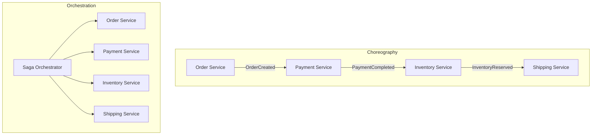

# How to Build Saga Pattern Implementation

Author: [nawazdhandala](https://www.github.com/nawazdhandala)

Tags: Saga Pattern, Microservices, Distributed Transactions, Architecture, Event-Driven

Description: Implement the saga pattern for distributed transactions with choreography and orchestration approaches, compensating transactions, and failure handling.

---

When you break a monolith into microservices, one of the first challenges you hit is handling transactions that span multiple services. Traditional ACID transactions don't work across service boundaries, and that's where the Saga pattern comes in.

A saga is a sequence of local transactions where each service performs its operation and publishes an event. If something fails, compensating transactions roll back the changes in reverse order. Let's build this from scratch.

## Understanding the Two Approaches

There are two ways to coordinate sagas: choreography and orchestration.

**Choreography** is event-driven. Each service listens for events and decides what to do next. There's no central coordinator - services react to what happens around them.

**Orchestration** uses a central controller (the orchestrator) that tells each service what to do and when. It's like having a conductor directing an orchestra.

Here's how they differ visually:



## Building the Core Saga Framework

First, let's define the basic types we need for our saga implementation.

```typescript
// saga-types.ts
// These interfaces define the contract for our saga steps

interface SagaStep<T> {
  name: string;
  // The main action to execute
  execute: (context: T) => Promise<void>;
  // The compensating action to run on failure
  compensate: (context: T) => Promise<void>;
}

interface SagaResult {
  success: boolean;
  completedSteps: string[];
  failedStep?: string;
  error?: Error;
}

// Tracks the current state of a saga execution
interface SagaState<T> {
  context: T;
  executedSteps: string[];
  status: 'pending' | 'running' | 'completed' | 'compensating' | 'failed';
}
```

Now let's build the orchestrator that coordinates saga execution.

```typescript
// saga-orchestrator.ts
// The orchestrator manages step execution and handles failures

class SagaOrchestrator<T> {
  private steps: SagaStep<T>[] = [];

  // Add a step to the saga
  addStep(step: SagaStep<T>): this {
    this.steps.push(step);
    return this;
  }

  async execute(context: T): Promise<SagaResult> {
    const state: SagaState<T> = {
      context,
      executedSteps: [],
      status: 'running'
    };

    try {
      // Execute each step in order
      for (const step of this.steps) {
        console.log(`Executing step: ${step.name}`);
        await step.execute(state.context);
        state.executedSteps.push(step.name);
      }

      state.status = 'completed';
      return {
        success: true,
        completedSteps: state.executedSteps
      };

    } catch (error) {
      // Something failed - time to compensate
      const failedStep = this.steps[state.executedSteps.length].name;
      console.error(`Step "${failedStep}" failed:`, error);

      // Run compensating transactions in reverse order
      await this.compensate(state);

      return {
        success: false,
        completedSteps: state.executedSteps,
        failedStep,
        error: error as Error
      };
    }
  }

  private async compensate(state: SagaState<T>): Promise<void> {
    state.status = 'compensating';

    // Work backwards through completed steps
    for (let i = state.executedSteps.length - 1; i >= 0; i--) {
      const stepName = state.executedSteps[i];
      const step = this.steps.find(s => s.name === stepName);

      if (step) {
        try {
          console.log(`Compensating step: ${step.name}`);
          await step.compensate(state.context);
        } catch (compensationError) {
          // Log but continue - we need to try all compensations
          console.error(`Compensation failed for ${step.name}:`, compensationError);
        }
      }
    }

    state.status = 'failed';
  }
}
```

## Real-World Example: Order Processing Saga

Let's implement a complete order processing saga that handles payment, inventory, and shipping.

```typescript
// order-saga.ts
// A practical example of processing an e-commerce order

interface OrderContext {
  orderId: string;
  userId: string;
  items: { productId: string; quantity: number; price: number }[];
  totalAmount: number;
  paymentId?: string;
  reservationId?: string;
  shipmentId?: string;
}

// Step 1: Create the order record
const createOrderStep: SagaStep<OrderContext> = {
  name: 'createOrder',
  async execute(ctx) {
    // In real code, this would call your order service
    const order = await orderService.create({
      userId: ctx.userId,
      items: ctx.items,
      totalAmount: ctx.totalAmount,
      status: 'pending'
    });
    ctx.orderId = order.id;
  },
  async compensate(ctx) {
    // Cancel the order if something fails later
    await orderService.updateStatus(ctx.orderId, 'cancelled');
  }
};

// Step 2: Process payment
const processPaymentStep: SagaStep<OrderContext> = {
  name: 'processPayment',
  async execute(ctx) {
    const payment = await paymentService.charge({
      userId: ctx.userId,
      orderId: ctx.orderId,
      amount: ctx.totalAmount
    });
    ctx.paymentId = payment.id;
  },
  async compensate(ctx) {
    // Refund if we need to roll back
    if (ctx.paymentId) {
      await paymentService.refund(ctx.paymentId);
    }
  }
};

// Step 3: Reserve inventory
const reserveInventoryStep: SagaStep<OrderContext> = {
  name: 'reserveInventory',
  async execute(ctx) {
    const reservation = await inventoryService.reserve({
      orderId: ctx.orderId,
      items: ctx.items
    });
    ctx.reservationId = reservation.id;
  },
  async compensate(ctx) {
    // Release the reserved items
    if (ctx.reservationId) {
      await inventoryService.release(ctx.reservationId);
    }
  }
};

// Step 4: Create shipment
const createShipmentStep: SagaStep<OrderContext> = {
  name: 'createShipment',
  async execute(ctx) {
    const shipment = await shippingService.create({
      orderId: ctx.orderId,
      items: ctx.items
    });
    ctx.shipmentId = shipment.id;
  },
  async compensate(ctx) {
    // Cancel shipment if created
    if (ctx.shipmentId) {
      await shippingService.cancel(ctx.shipmentId);
    }
  }
};
```

Here's how you'd wire it all together and run the saga:

```typescript
// Running the order saga

async function processOrder(orderData: Omit<OrderContext, 'orderId'>) {
  const saga = new SagaOrchestrator<OrderContext>()
    .addStep(createOrderStep)
    .addStep(processPaymentStep)
    .addStep(reserveInventoryStep)
    .addStep(createShipmentStep);

  const result = await saga.execute(orderData as OrderContext);

  if (result.success) {
    console.log('Order processed successfully');
    return { status: 'completed', orderId: orderData.orderId };
  } else {
    console.log(`Order failed at step: ${result.failedStep}`);
    return { status: 'failed', error: result.error?.message };
  }
}
```

## Implementing Choreography with Events

For the choreography approach, each service publishes events and subscribes to relevant ones.

```typescript
// choreography-saga.ts
// Event-driven saga using pub/sub pattern

import { EventEmitter } from 'events';

class SagaEventBus {
  private emitter = new EventEmitter();

  // Publish an event that other services can react to
  publish(event: string, data: any): void {
    console.log(`Publishing event: ${event}`);
    this.emitter.emit(event, data);
  }

  // Subscribe to events from other services
  subscribe(event: string, handler: (data: any) => Promise<void>): void {
    this.emitter.on(event, async (data) => {
      try {
        await handler(data);
      } catch (error) {
        // Publish a failure event for compensation
        this.publish(`${event}:failed`, { originalData: data, error });
      }
    });
  }
}

// Example: Payment service in choreography mode
class PaymentServiceChoreography {
  constructor(private eventBus: SagaEventBus) {
    // Listen for order creation events
    this.eventBus.subscribe('order:created', this.handleOrderCreated.bind(this));

    // Listen for compensation events
    this.eventBus.subscribe('inventory:failed', this.handleInventoryFailed.bind(this));
  }

  private async handleOrderCreated(data: { orderId: string; amount: number }) {
    const payment = await this.processPayment(data.orderId, data.amount);

    // Notify downstream services
    this.eventBus.publish('payment:completed', {
      orderId: data.orderId,
      paymentId: payment.id
    });
  }

  private async handleInventoryFailed(data: { originalData: any }) {
    // Compensate by refunding the payment
    await this.refundPayment(data.originalData.paymentId);

    this.eventBus.publish('payment:refunded', {
      orderId: data.originalData.orderId
    });
  }

  private async processPayment(orderId: string, amount: number) {
    // Payment processing logic
    return { id: `pay_${Date.now()}` };
  }

  private async refundPayment(paymentId: string) {
    // Refund logic
    console.log(`Refunding payment: ${paymentId}`);
  }
}
```

## Handling Edge Cases

Real-world sagas need to handle several tricky scenarios.

```typescript
// saga-resilience.ts
// Adding retry logic and idempotency

class ResilientSagaStep<T> implements SagaStep<T> {
  constructor(
    public name: string,
    private executeAction: (ctx: T) => Promise<void>,
    private compensateAction: (ctx: T) => Promise<void>,
    private maxRetries: number = 3
  ) {}

  async execute(context: T): Promise<void> {
    let lastError: Error | null = null;

    // Retry with exponential backoff
    for (let attempt = 1; attempt <= this.maxRetries; attempt++) {
      try {
        await this.executeAction(context);
        return;
      } catch (error) {
        lastError = error as Error;

        if (attempt < this.maxRetries) {
          const delay = Math.pow(2, attempt) * 100;
          console.log(`Retry ${attempt}/${this.maxRetries} after ${delay}ms`);
          await this.sleep(delay);
        }
      }
    }

    throw lastError;
  }

  async compensate(context: T): Promise<void> {
    // Compensations should also retry
    for (let attempt = 1; attempt <= this.maxRetries; attempt++) {
      try {
        await this.compensateAction(context);
        return;
      } catch (error) {
        if (attempt === this.maxRetries) {
          // Log for manual intervention
          console.error(`Compensation failed after ${this.maxRetries} attempts`);
        }
      }
    }
  }

  private sleep(ms: number): Promise<void> {
    return new Promise(resolve => setTimeout(resolve, ms));
  }
}
```

## Persisting Saga State

For production systems, you need to persist saga state so you can recover from crashes.

```typescript
// saga-persistence.ts
// Store saga state in a database for recovery

interface PersistedSaga {
  id: string;
  context: any;
  executedSteps: string[];
  status: string;
  createdAt: Date;
  updatedAt: Date;
}

class PersistentSagaOrchestrator<T> extends SagaOrchestrator<T> {
  constructor(private sagaRepository: SagaRepository) {
    super();
  }

  async execute(context: T): Promise<SagaResult> {
    // Create saga record before starting
    const sagaId = await this.sagaRepository.create({
      context,
      executedSteps: [],
      status: 'pending'
    });

    try {
      const result = await super.execute(context);

      // Update final status
      await this.sagaRepository.update(sagaId, {
        status: result.success ? 'completed' : 'failed',
        executedSteps: result.completedSteps
      });

      return result;
    } catch (error) {
      await this.sagaRepository.update(sagaId, { status: 'failed' });
      throw error;
    }
  }

  // Recover and resume incomplete sagas on startup
  async recoverIncomplete(): Promise<void> {
    const incomplete = await this.sagaRepository.findByStatus('running');

    for (const saga of incomplete) {
      console.log(`Recovering saga: ${saga.id}`);
      // Resume from where it left off or compensate
    }
  }
}
```

## When to Use Each Approach

**Use orchestration when:**
- You have complex workflows with many steps
- You need centralized monitoring and control
- The business logic changes frequently
- You want easier debugging and tracing

**Use choreography when:**
- Services need to stay loosely coupled
- You want to avoid a single point of failure
- The workflow is simple and linear
- Teams own their services independently

The saga pattern takes some effort to implement correctly, but it's essential for maintaining data consistency in distributed systems. Start with the orchestration approach if you're new to sagas - it's easier to reason about and debug. Once you're comfortable, you can introduce choreography for scenarios where loose coupling matters more than centralized control.
