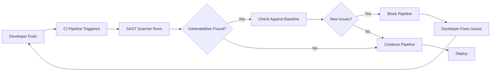
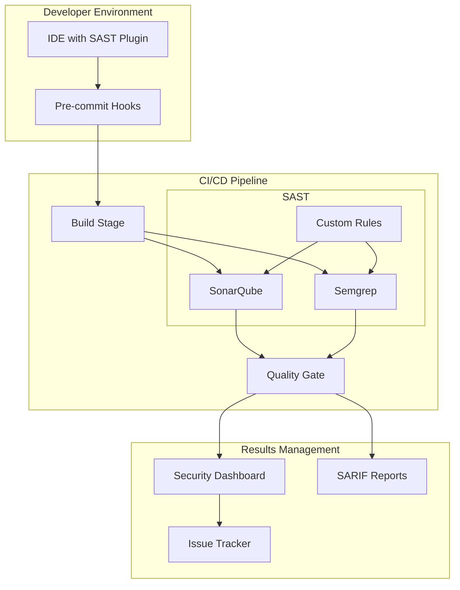
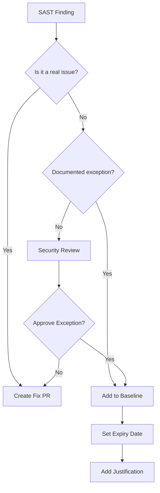

# How to Implement SAST Integration

Author: [nawazdhandala](https://github.com/nawazdhandala)

Tags: Testing, Security, SAST, DevSecOps

Description: A practical guide to integrating Static Application Security Testing (SAST) tools into your CI/CD pipeline for automated code security analysis.

---

Static Application Security Testing (SAST) analyzes source code for security vulnerabilities without executing the program. By integrating SAST into your CI/CD pipeline, you catch security issues before they reach production. This guide covers practical implementations with SonarQube and Semgrep.

## SAST Workflow Overview



## Setting Up SonarQube

SonarQube is a comprehensive code quality and security platform. It supports 30+ languages and integrates with most CI systems.

### Docker Compose Setup

```yaml
# docker-compose.yml
# Defines the SonarQube server and its PostgreSQL database
version: "3.8"
services:
  sonarqube:
    image: sonarqube:lts-community
    container_name: sonarqube
    depends_on:
      - db
    ports:
      - "9000:9000"
    environment:
      # Database connection settings
      SONAR_JDBC_URL: jdbc:postgresql://db:5432/sonar
      SONAR_JDBC_USERNAME: sonar
      SONAR_JDBC_PASSWORD: sonar
    volumes:
      # Persist SonarQube data across restarts
      - sonarqube_data:/opt/sonarqube/data
      - sonarqube_extensions:/opt/sonarqube/extensions
      - sonarqube_logs:/opt/sonarqube/logs

  db:
    image: postgres:15
    container_name: sonarqube-db
    environment:
      POSTGRES_USER: sonar
      POSTGRES_PASSWORD: sonar
      POSTGRES_DB: sonar
    volumes:
      - postgresql_data:/var/lib/postgresql/data

volumes:
  sonarqube_data:
  sonarqube_extensions:
  sonarqube_logs:
  postgresql_data:
```

### SonarQube Project Configuration

Create a `sonar-project.properties` file in your repository root:

```properties
# sonar-project.properties
# Project identification
sonar.projectKey=my-application
sonar.projectName=My Application
sonar.projectVersion=1.0

# Source code location
sonar.sources=src
sonar.tests=tests

# Language-specific settings
sonar.language=js
sonar.sourceEncoding=UTF-8

# Exclusions - files to skip during analysis
sonar.exclusions=**/node_modules/**,**/vendor/**,**/*.min.js,**/dist/**

# Test coverage report location
sonar.javascript.lcov.reportPaths=coverage/lcov.info

# Security-specific rules to enforce
sonar.issue.ignore.multicriteria=e1,e2
# Ignore rule for test files - security rules less relevant in tests
sonar.issue.ignore.multicriteria.e1.ruleKey=javascript:S2068
sonar.issue.ignore.multicriteria.e1.resourceKey=**/*test*/**
# Ignore hardcoded credentials rule in example files
sonar.issue.ignore.multicriteria.e2.ruleKey=javascript:S2068
sonar.issue.ignore.multicriteria.e2.resourceKey=**/examples/**
```

### GitHub Actions Integration

```yaml
# .github/workflows/sonarqube.yml
name: SonarQube Analysis

on:
  push:
    branches: [main, develop]
  pull_request:
    branches: [main]

jobs:
  sonarqube:
    runs-on: ubuntu-latest
    steps:
      - name: Checkout code
        uses: actions/checkout@v4
        with:
          # Full git history needed for blame information
          fetch-depth: 0

      - name: Setup Node.js
        uses: actions/setup-node@v4
        with:
          node-version: '20'

      - name: Install dependencies
        run: npm ci

      - name: Run tests with coverage
        run: npm run test:coverage

      - name: SonarQube Scan
        uses: SonarSource/sonarqube-scan-action@master
        env:
          SONAR_TOKEN: ${{ secrets.SONAR_TOKEN }}
          SONAR_HOST_URL: ${{ secrets.SONAR_HOST_URL }}

      # Quality Gate check - fails the pipeline if issues exceed thresholds
      - name: SonarQube Quality Gate
        uses: SonarSource/sonarqube-quality-gate-action@master
        timeout-minutes: 5
        env:
          SONAR_TOKEN: ${{ secrets.SONAR_TOKEN }}
```

## Setting Up Semgrep

Semgrep is a fast, open-source SAST tool that uses pattern matching. It excels at finding security issues with custom rules.

### Basic Semgrep Configuration

```yaml
# .semgrep.yml
# Semgrep configuration file
rules:
  # Use pre-built security rule packs
  - p/security-audit
  - p/secrets
  - p/owasp-top-ten

  # Custom rule: Detect hardcoded API keys
  - id: hardcoded-api-key
    patterns:
      - pattern-either:
          # Match common API key variable assignments
          - pattern: $VAR = "sk_live_..."
          - pattern: $VAR = "pk_live_..."
          - pattern: api_key = "..."
          - pattern: apiKey = "..."
    message: "Hardcoded API key detected. Use environment variables instead."
    languages: [python, javascript, typescript]
    severity: ERROR
    metadata:
      category: security
      cwe: "CWE-798: Use of Hard-coded Credentials"
      owasp: "A3:2017 Sensitive Data Exposure"

  # Custom rule: SQL injection prevention
  - id: sql-injection-risk
    patterns:
      - pattern-either:
          # Detect string concatenation in SQL queries
          - pattern: |
              $QUERY = "SELECT ... " + $USER_INPUT
          - pattern: |
              $QUERY = f"SELECT ... {$USER_INPUT}"
          - pattern: |
              cursor.execute("SELECT ... " + $VAR)
    message: "Potential SQL injection. Use parameterized queries."
    languages: [python]
    severity: ERROR
    fix: |
      cursor.execute("SELECT ... WHERE id = %s", ($VAR,))
```

### Semgrep GitHub Actions Integration

```yaml
# .github/workflows/semgrep.yml
name: Semgrep Security Scan

on:
  push:
    branches: [main, develop]
  pull_request:
    branches: [main]
  # Run weekly to catch new vulnerability patterns
  schedule:
    - cron: '0 0 * * 0'

jobs:
  semgrep:
    runs-on: ubuntu-latest
    container:
      image: returntocorp/semgrep

    steps:
      - name: Checkout code
        uses: actions/checkout@v4

      - name: Run Semgrep
        run: |
          semgrep ci \
            --config=p/security-audit \
            --config=p/secrets \
            --config=.semgrep.yml \
            --sarif --output=semgrep.sarif
        env:
          # Token for Semgrep App integration (optional)
          SEMGREP_APP_TOKEN: ${{ secrets.SEMGREP_APP_TOKEN }}

      # Upload results to GitHub Security tab
      - name: Upload SARIF file
        uses: github/codeql-action/upload-sarif@v2
        with:
          sarif_file: semgrep.sarif
        if: always()
```

## Rule Customization

### Creating Custom SonarQube Rules

SonarQube uses XPath-based rules for custom patterns. Here is an example for Java:

```xml
<!-- custom-rules.xml -->
<!-- Custom rule to detect insecure random number generation -->
<rules>
  <rule>
    <key>InsecureRandom</key>
    <name>Insecure Random Number Generator</name>
    <description>
      java.util.Random is not cryptographically secure.
      Use java.security.SecureRandom for security-sensitive operations.
    </description>
    <severity>CRITICAL</severity>
    <cardinality>SINGLE</cardinality>
    <tag>security</tag>
    <tag>owasp-a3</tag>
  </rule>
</rules>
```

### Creating Custom Semgrep Rules

Semgrep rules are more intuitive. Here is a comprehensive example:

```yaml
# custom-security-rules.yml
rules:
  # Detect insecure deserialization in Python
  - id: insecure-pickle-load
    patterns:
      - pattern-either:
          - pattern: pickle.load(...)
          - pattern: pickle.loads(...)
          - pattern: cPickle.load(...)
    message: |
      Pickle deserialization can lead to remote code execution.
      Use JSON or a safe serialization format for untrusted data.
    languages: [python]
    severity: ERROR
    metadata:
      cwe: "CWE-502: Deserialization of Untrusted Data"
      references:
        - https://owasp.org/www-project-web-security-testing-guide/

  # Detect missing authentication in Express routes
  - id: express-missing-auth
    patterns:
      # Match routes that handle sensitive operations without auth middleware
      - pattern: |
          app.$METHOD("/admin/...", (req, res) => { ... })
      - pattern-not: |
          app.$METHOD("/admin/...", $AUTH, (req, res) => { ... })
    message: "Admin route without authentication middleware."
    languages: [javascript, typescript]
    severity: WARNING
    fix: |
      app.$METHOD("/admin/...", authMiddleware, (req, res) => { ... })

  # Detect JWT without verification
  - id: jwt-no-verify
    patterns:
      - pattern: jwt.decode($TOKEN)
      - pattern-not: jwt.verify($TOKEN, ...)
    message: |
      JWT decoded without signature verification.
      Use jwt.verify() to validate token authenticity.
    languages: [javascript, typescript]
    severity: ERROR
```

## SAST Integration Architecture



## False Positive Management

False positives waste developer time and erode trust in security tools. Here is how to manage them effectively.

### Baseline Configuration

Create a baseline file to track known issues:

```json
{
  "baseline_id": "v1.0.0",
  "created": "2026-01-30",
  "findings": [
    {
      "id": "fp-001",
      "rule_id": "javascript:S2068",
      "file": "src/config/example.js",
      "line": 15,
      "reason": "Example file with placeholder credentials",
      "reviewed_by": "security-team",
      "expires": "2026-07-30"
    }
  ]
}
```

### Inline Suppressions

Use inline comments to suppress specific findings with justification:

```javascript
// JavaScript - Semgrep suppression
function getConfig() {
  // nosemgrep: hardcoded-api-key
  // Reason: This is a public demo key, not sensitive
  const demoApiKey = "pk_test_demo12345";
  return { demoApiKey };
}
```

```python
# Python - SonarQube suppression
def connect_to_db():
    # NOSONAR - Using environment variable in production
    # This default is only for local development
    password = os.getenv("DB_PASSWORD", "localdev123")
    return create_connection(password)
```

### Centralized False Positive Tracking

```yaml
# .semgrep/ignores.yml
# Centralized false positive management
rules:
  # Ignore specific file patterns
  - id: hardcoded-api-key
    paths:
      ignore:
        - "**/*test*"
        - "**/*spec*"
        - "**/fixtures/**"
        - "**/examples/**"
        - "**/docs/**"

  # Time-limited ignore with review date
  - id: sql-injection-risk
    paths:
      ignore:
        - "src/legacy/old-api.py"  # TODO: Fix by 2026-03-01
```

### False Positive Review Process



## Quality Gates Configuration

Quality gates define the conditions that code must meet before deployment.

### SonarQube Quality Gate

```bash
# Create quality gate via API
curl -u admin:password -X POST \
  "http://sonarqube:9000/api/qualitygates/create" \
  -d "name=Security-First"

# Add conditions to the quality gate
# Block on any new critical security issues
curl -u admin:password -X POST \
  "http://sonarqube:9000/api/qualitygates/create_condition" \
  -d "gateName=Security-First" \
  -d "metric=new_critical_violations" \
  -d "op=GT" \
  -d "error=0"

# Block if security rating drops below A
curl -u admin:password -X POST \
  "http://sonarqube:9000/api/qualitygates/create_condition" \
  -d "gateName=Security-First" \
  -d "metric=new_security_rating" \
  -d "op=GT" \
  -d "error=1"

# Require minimum test coverage on new code
curl -u admin:password -X POST \
  "http://sonarqube:9000/api/qualitygates/create_condition" \
  -d "gateName=Security-First" \
  -d "metric=new_coverage" \
  -d "op=LT" \
  -d "error=80"
```

### Quality Gate as Code

```yaml
# sonar-quality-gate.yml
# Define quality gate in version control
name: Security-First
conditions:
  # Zero new critical vulnerabilities allowed
  - metric: new_critical_violations
    operator: GREATER_THAN
    error_threshold: 0

  # Security rating must be A on new code
  - metric: new_security_rating
    operator: GREATER_THAN
    error_threshold: 1

  # Security hotspots must be reviewed
  - metric: new_security_hotspots_reviewed
    operator: LESS_THAN
    error_threshold: 100

  # No new high-severity bugs
  - metric: new_bugs
    operator: GREATER_THAN
    error_threshold: 0
    severity: HIGH

  # Maintain code coverage
  - metric: new_coverage
    operator: LESS_THAN
    error_threshold: 80
```

### Semgrep Exit Codes Configuration

```yaml
# .semgrep/settings.yml
# Configure how Semgrep affects pipeline status
severity_threshold: error  # Only fail on ERROR severity

# Per-rule failure configuration
rules:
  - id: sql-injection-risk
    fail_open: false  # Must pass to continue pipeline
  - id: debug-logging
    fail_open: true   # Warn but do not block
```

## Pre-commit Integration

Catch issues before they enter version control:

```yaml
# .pre-commit-config.yaml
repos:
  # Semgrep pre-commit hook
  - repo: https://github.com/returntocorp/semgrep
    rev: v1.52.0
    hooks:
      - id: semgrep
        args:
          - --config=p/secrets
          - --config=.semgrep.yml
          - --error
        stages: [commit]

  # Run SonarQube scanner locally
  - repo: local
    hooks:
      - id: sonar-scanner
        name: SonarQube Scanner
        entry: sonar-scanner
        language: system
        pass_filenames: false
        stages: [push]
```

## Complete CI/CD Pipeline Example

```yaml
# .github/workflows/security-pipeline.yml
name: Security Pipeline

on:
  push:
    branches: [main, develop]
  pull_request:
    branches: [main]

jobs:
  # Stage 1: Quick security checks
  quick-scan:
    runs-on: ubuntu-latest
    steps:
      - uses: actions/checkout@v4

      - name: Secret Detection
        uses: trufflesecurity/trufflehog@main
        with:
          path: ./
          base: ${{ github.event.repository.default_branch }}
          head: HEAD

      - name: Dependency Vulnerability Scan
        run: npm audit --audit-level=high

  # Stage 2: Full SAST analysis
  sast-analysis:
    needs: quick-scan
    runs-on: ubuntu-latest
    steps:
      - uses: actions/checkout@v4
        with:
          fetch-depth: 0

      - name: Setup Node.js
        uses: actions/setup-node@v4
        with:
          node-version: '20'

      - name: Install and Test
        run: |
          npm ci
          npm run test:coverage

      # Run both scanners in parallel
      - name: Semgrep Scan
        uses: returntocorp/semgrep-action@v1
        with:
          config: >-
            p/security-audit
            p/secrets
            .semgrep.yml

      - name: SonarQube Scan
        uses: SonarSource/sonarqube-scan-action@master
        env:
          SONAR_TOKEN: ${{ secrets.SONAR_TOKEN }}
          SONAR_HOST_URL: ${{ secrets.SONAR_HOST_URL }}

  # Stage 3: Quality gate check
  quality-gate:
    needs: sast-analysis
    runs-on: ubuntu-latest
    steps:
      - name: SonarQube Quality Gate
        uses: SonarSource/sonarqube-quality-gate-action@master
        timeout-minutes: 5
        env:
          SONAR_TOKEN: ${{ secrets.SONAR_TOKEN }}

  # Stage 4: Deploy if all checks pass
  deploy:
    needs: quality-gate
    runs-on: ubuntu-latest
    if: github.ref == 'refs/heads/main'
    steps:
      - name: Deploy to Production
        run: echo "Deploying secure code..."
```

## Metrics and Reporting

Track SAST effectiveness over time:

```python
# sast_metrics.py
# Script to collect and report SAST metrics

import requests
from datetime import datetime, timedelta

class SASTMetrics:
    def __init__(self, sonar_url, sonar_token):
        self.sonar_url = sonar_url
        self.headers = {"Authorization": f"Bearer {sonar_token}"}

    def get_security_metrics(self, project_key):
        """Fetch security metrics from SonarQube API."""
        metrics = [
            "vulnerabilities",
            "security_hotspots",
            "security_rating",
            "new_vulnerabilities"
        ]

        response = requests.get(
            f"{self.sonar_url}/api/measures/component",
            headers=self.headers,
            params={
                "component": project_key,
                "metricKeys": ",".join(metrics)
            }
        )

        return response.json()

    def calculate_mttr(self, project_key):
        """Calculate Mean Time To Remediate security issues."""
        # Fetch resolved issues from the last 30 days
        response = requests.get(
            f"{self.sonar_url}/api/issues/search",
            headers=self.headers,
            params={
                "componentKeys": project_key,
                "types": "VULNERABILITY",
                "resolved": "true",
                "createdAfter": (datetime.now() - timedelta(days=30)).isoformat()
            }
        )

        issues = response.json().get("issues", [])
        if not issues:
            return 0

        # Calculate average resolution time
        total_hours = 0
        for issue in issues:
            created = datetime.fromisoformat(issue["creationDate"].replace("Z", ""))
            resolved = datetime.fromisoformat(issue["updateDate"].replace("Z", ""))
            total_hours += (resolved - created).total_seconds() / 3600

        return total_hours / len(issues)

    def generate_report(self, project_key):
        """Generate a security metrics report."""
        metrics = self.get_security_metrics(project_key)
        mttr = self.calculate_mttr(project_key)

        return {
            "project": project_key,
            "timestamp": datetime.now().isoformat(),
            "metrics": metrics,
            "mttr_hours": round(mttr, 2),
            "security_score": self._calculate_score(metrics)
        }

    def _calculate_score(self, metrics):
        """Calculate overall security score (0-100)."""
        # Simple scoring based on vulnerability count
        vulns = next(
            (m["value"] for m in metrics.get("component", {}).get("measures", [])
             if m["metric"] == "vulnerabilities"),
            0
        )
        return max(0, 100 - (int(vulns) * 5))
```

## Best Practices Summary

1. **Start with default rule sets** - Enable p/security-audit and p/owasp-top-ten before adding custom rules

2. **Tune incrementally** - Add baseline for existing issues, enforce zero new issues first

3. **Fail fast** - Run quick checks (secrets, dependencies) before full SAST analysis

4. **Document exceptions** - Every suppression needs a justification and expiry date

5. **Track metrics** - Monitor vulnerability counts, MTTR, and false positive rates over time

6. **Shift left** - Use pre-commit hooks and IDE plugins to catch issues early

7. **Review rules quarterly** - Update custom rules based on new vulnerability patterns and false positive feedback

---

SAST integration is not a one-time setup. It requires ongoing tuning to balance security coverage with developer productivity. Start with sensible defaults, measure the false positive rate, and iterate. Your future self will thank you when the next CVE drops and your codebase is already clean.
