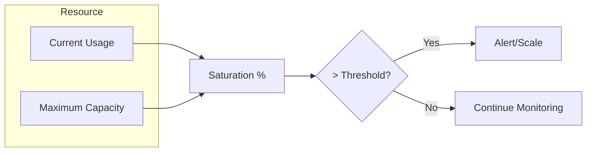
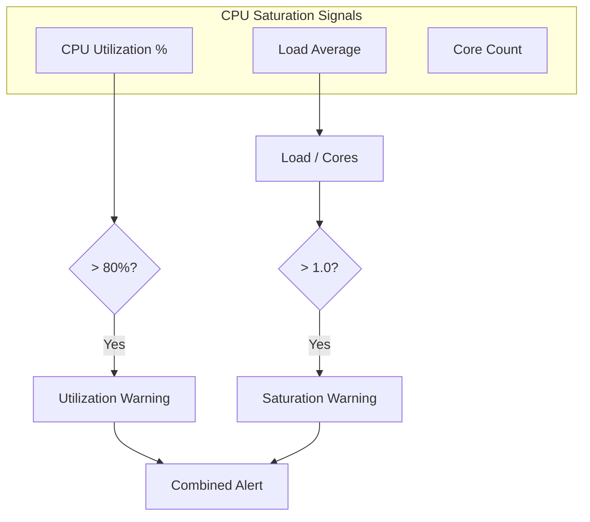
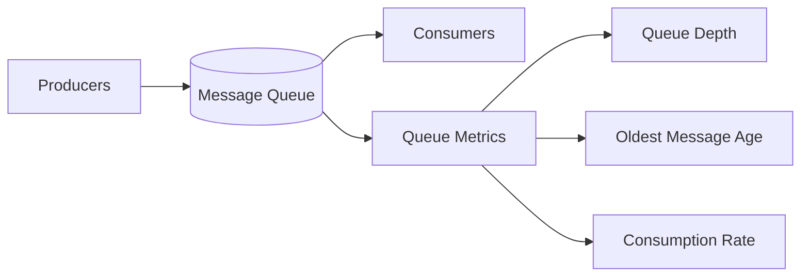
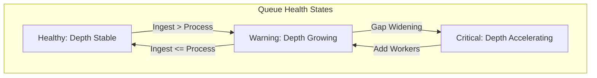
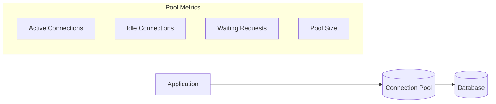
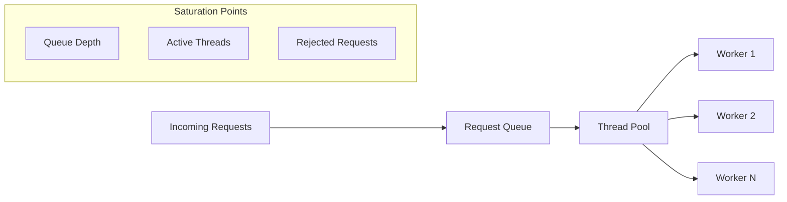

# How to Create Saturation Metrics

Author: [nawazdhandala](https://github.com/nawazdhandala)

Tags: Metrics, Saturation, SRE, Observability

Description: A practical guide to measuring resource saturation, queue depths, and connection pools to catch capacity problems before they become outages.

---

Your service is returning 200s. Latency looks fine. Error rate is zero. Then, without warning, everything falls over.

The culprit? Saturation. Your thread pool was at 98% for an hour. Your message queue had 50,000 items backed up. Your database connection pool ran dry three minutes before the first error surfaced.

Saturation metrics are the early warning system that availability metrics miss. They tell you how *full* your resources are, not just whether they're working. This post covers what saturation metrics are, how to instrument them, and patterns for the most common resource types.

## What is Saturation?

Saturation measures the degree to which a resource is being utilized relative to its capacity. It answers: "How close am I to running out?"

Unlike error rates (which fire after something breaks) or latency (which degrades gradually), saturation metrics give you lead time. A system at 95% CPU utilization is technically working, but one traffic spike away from failure.

Google's SRE book includes saturation as one of the four golden signals:
- **Latency:** How long requests take
- **Traffic:** How much demand exists
- **Errors:** How many requests fail
- **Saturation:** How full your resources are

Most teams nail the first three and ignore the fourth. That's a mistake.

## The Saturation Measurement Pattern

Every saturation metric follows the same formula:

```
Saturation = (Current Usage / Maximum Capacity) * 100
```

The challenge is knowing what to measure and where to find the numbers.



## Resource Saturation

Resource saturation covers the fundamental compute resources: CPU, memory, disk, and network.

### CPU Saturation

CPU utilization is straightforward but often misunderstood. High utilization isn't the problem. High utilization *plus* a run queue is the problem.

```yaml
# Prometheus queries for CPU saturation
# CPU utilization percentage
100 - (avg by(instance) (rate(node_cpu_seconds_total{mode="idle"}[5m])) * 100)

# CPU saturation (run queue length)
node_load1 / count(node_cpu_seconds_total{mode="idle"}) by (instance)
```

A load average greater than the number of CPU cores means processes are waiting. That's saturation.



### Memory Saturation

Memory saturation has two faces: utilization and pressure.

```yaml
# Memory utilization
(node_memory_MemTotal_bytes - node_memory_MemAvailable_bytes)
  / node_memory_MemTotal_bytes * 100

# Memory pressure (page faults per second)
rate(node_vmstat_pgmajfault[5m])
```

High utilization with low page faults is fine. High utilization with climbing page faults means your system is thrashing. That's saturation.

### Disk I/O Saturation

Disk saturation shows up as I/O wait time and queue depth.

```yaml
# Disk I/O utilization (percentage of time disk was busy)
rate(node_disk_io_time_seconds_total[5m]) * 100

# Disk I/O queue depth (average operations waiting)
rate(node_disk_io_time_weighted_seconds_total[5m])
  / rate(node_disk_io_time_seconds_total[5m])
```

An I/O queue depth consistently above 1 indicates the disk can't keep up with demand.

## Queue Saturation

Queues are everywhere: message brokers, job systems, request buffers. Queue saturation is often the first sign of downstream problems.

### Message Queue Depth



Key metrics for any message queue:

| Metric | What It Tells You | Alert Threshold |
|--------|-------------------|-----------------|
| Queue depth | Backlog size | Growing faster than draining |
| Oldest message age | Processing delay | Age > SLA target |
| Consumer lag | How far behind consumers are | Lag increasing over time |
| Dead letter queue size | Failed message accumulation | Any growth |

Example for Kafka:

```yaml
# Consumer lag (messages behind)
kafka_consumer_group_lag

# Queue depth (unconsumed messages per topic)
sum(kafka_topic_partition_current_offset) by (topic)
  - sum(kafka_consumer_group_offset) by (topic)
```

Example for RabbitMQ:

```yaml
# Messages ready to be delivered
rabbitmq_queue_messages_ready

# Messages unacknowledged (in flight)
rabbitmq_queue_messages_unacked

# Consumer utilization (percentage of time consumers are busy)
rabbitmq_queue_consumer_utilization
```

### Job Queue Saturation

Background job systems like Sidekiq, Celery, or Bull follow similar patterns:

```yaml
# Sidekiq queue depth
sidekiq_queue_size

# Jobs waiting longer than expected
sidekiq_queue_latency_seconds

# Worker utilization
sidekiq_busy_workers / sidekiq_total_workers * 100
```

A healthy job queue has stable depth. A saturated queue grows continuously.



## Connection Saturation

Connection pools are fixed-size resources. When they run dry, new requests block or fail.

### Database Connection Pools



Key metrics:

```yaml
# PostgreSQL connection utilization
pg_stat_activity_count / pg_settings_max_connections * 100

# Connection pool saturation (application side)
db_pool_active_connections / db_pool_max_size * 100

# Waiting for connections (bad sign)
db_pool_pending_requests
```

Alert when:
- Active connections consistently above 80% of pool size
- Any requests waiting for connections
- Connection acquisition time increasing

### HTTP Connection Pools

Outbound HTTP clients also use connection pools:

```yaml
# HTTP client pool utilization
http_client_pool_active / http_client_pool_max * 100

# Connection wait time
http_client_connection_acquire_time_seconds
```

## Thread Pool Saturation

Thread pools power web servers, async executors, and parallel processing systems.

### Web Server Thread Pools



For Tomcat/Jetty:

```yaml
# Thread pool utilization
tomcat_threads_busy / tomcat_threads_max * 100

# Request queue depth
tomcat_threads_current_queue_size

# Rejected connections (pool exhausted)
tomcat_rejected_connections_total
```

For Node.js (libuv thread pool):

```yaml
# Event loop lag (indirect saturation signal)
nodejs_eventloop_lag_seconds

# Active handles and requests
nodejs_active_handles
nodejs_active_requests
```

### Executor Service Pools

Java ExecutorService and similar constructs:

```yaml
# Pool utilization
executor_active_threads / executor_pool_size * 100

# Task queue depth
executor_queued_tasks

# Completed vs submitted (backlog indicator)
executor_submitted_tasks_total - executor_completed_tasks_total
```

## Building a Saturation Dashboard

A saturation dashboard should answer one question: "What's about to run out?"

```mermaid
flowchart TD
    subgraph Compute
        CPU[CPU Saturation]
        Memory[Memory Saturation]
        Disk[Disk I/O Saturation]
    end

    subgraph Queues
        MsgQueue[Message Queue Depth]
        JobQueue[Job Queue Depth]
        ReqQueue[Request Queue Depth]
    end

    subgraph Connections
        DBPool[DB Connection Pool]
        HTTPPool[HTTP Client Pool]
        CachePool[Cache Connection Pool]
    end

    subgraph Threads
        WebThreads[Web Server Threads]
        WorkerThreads[Worker Threads]
        AsyncThreads[Async Executor Threads]
    end

    CPU --> Summary[Saturation Summary]
    Memory --> Summary
    Disk --> Summary
    MsgQueue --> Summary
    JobQueue --> Summary
    ReqQueue --> Summary
    DBPool --> Summary
    HTTPPool --> Summary
    CachePool --> Summary
    WebThreads --> Summary
    WorkerThreads --> Summary
    AsyncThreads --> Summary
```



Organize by resource type, not by service. You want to see all connection pools together, all queues together. Patterns across similar resources reveal systemic issues.

## Setting Alert Thresholds

Saturation thresholds depend on resource characteristics:

| Resource Type | Warning | Critical | Notes |
|---------------|---------|----------|-------|
| CPU | 70% | 85% | Include load average |
| Memory | 80% | 90% | Watch for page faults |
| Disk I/O | 70% | 85% | Queue depth matters more |
| Message queues | Depth growing | Depth accelerating | Relative change, not absolute |
| Connection pools | 70% | 85% | Any waiting requests is critical |
| Thread pools | 80% | 90% | Include queue depth |

The key principle: alert on *trends*, not just thresholds. A queue at 1,000 messages is fine if it's been there for a week. A queue at 100 messages is concerning if it was at 10 an hour ago.

```yaml
# Alert on queue growth rate, not absolute size
rate(queue_depth[5m]) > 10  # Growing by 10 messages per second
```

## Instrumenting Your Application

Adding saturation metrics to your application follows a consistent pattern:

```python
# Python example using OpenTelemetry
from opentelemetry import metrics

meter = metrics.get_meter("myapp")

# Connection pool saturation
pool_utilization = meter.create_observable_gauge(
    name="db_pool_utilization",
    description="Database connection pool utilization percentage",
    unit="%",
    callbacks=[lambda: get_pool_utilization()]
)

# Queue depth
queue_depth = meter.create_observable_gauge(
    name="job_queue_depth",
    description="Number of jobs waiting in queue",
    unit="jobs",
    callbacks=[lambda: get_queue_depth()]
)

# Thread pool saturation
thread_utilization = meter.create_observable_gauge(
    name="worker_thread_utilization",
    description="Worker thread pool utilization percentage",
    unit="%",
    callbacks=[lambda: get_thread_utilization()]
)
```

```javascript
// Node.js example using OpenTelemetry
const { metrics } = require('@opentelemetry/api');

const meter = metrics.getMeter('myapp');

// Connection pool gauge
const poolUtilization = meter.createObservableGauge('db_pool_utilization', {
  description: 'Database connection pool utilization percentage',
  unit: '%'
});

poolUtilization.addCallback((result) => {
  const utilization = (pool.activeConnections / pool.maxConnections) * 100;
  result.observe(utilization, { pool: 'primary' });
});

// Queue depth gauge
const queueDepth = meter.createObservableGauge('job_queue_depth', {
  description: 'Number of jobs waiting in queue',
  unit: 'jobs'
});

queueDepth.addCallback((result) => {
  result.observe(queue.length, { queue: 'default' });
});
```

## Common Pitfalls

**Measuring utilization without capacity.** A metric showing "500 active connections" means nothing without knowing the maximum. Always expose both current usage and capacity.

**Ignoring queue age.** Queue depth alone can mislead. A queue of 1,000 items processed in 10 seconds is healthy. A queue of 100 items where the oldest is 5 minutes old is not.

**Static thresholds on dynamic systems.** Auto-scaling systems need relative thresholds. Alert when saturation exceeds X% *and* auto-scaling hasn't triggered, or when you're at max scale.

**Missing the waiting metric.** The most important saturation signal is often "requests waiting for resources." Any non-zero value for connection wait time, thread pool queue depth, or blocked requests is worth investigating.

## OneUptime Integration

OneUptime accepts saturation metrics via OpenTelemetry, making it straightforward to build dashboards and alerts:

1. **Send metrics via OTLP.** Point your OpenTelemetry collector at OneUptime's OTLP endpoint.

2. **Create saturation dashboards.** Group related resources (all connection pools, all queues) for pattern recognition.

3. **Set up SLOs.** Define saturation-based SLOs like "Database connection pool utilization stays below 80% for 99.9% of the time."

4. **Configure alerts.** Use rate-of-change alerts for queues, threshold alerts for fixed-capacity resources.

Saturation metrics complement the error and latency signals you're already collecting. Together, they give you the complete picture: what's broken, what's slow, and what's about to break.

## Action Checklist

1. Audit your services for fixed-capacity resources (pools, queues, buffers)
2. Add saturation metrics for each resource type
3. Build a saturation dashboard grouped by resource category
4. Set up alerts for both absolute thresholds and growth rates
5. Include saturation in your incident response runbooks
6. Review saturation trends in capacity planning sessions

Saturation metrics are the difference between reacting to outages and preventing them. They give you the lead time to scale up, fix bugs, or adjust traffic before users notice anything wrong.

Start with your database connection pools and message queues. Those two alone will catch most capacity-related incidents before they escalate.
