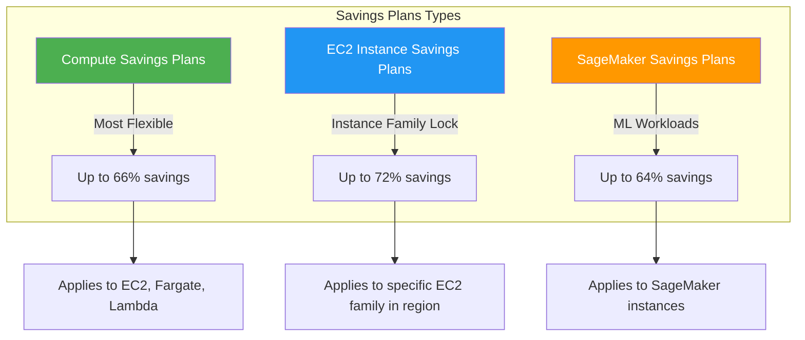
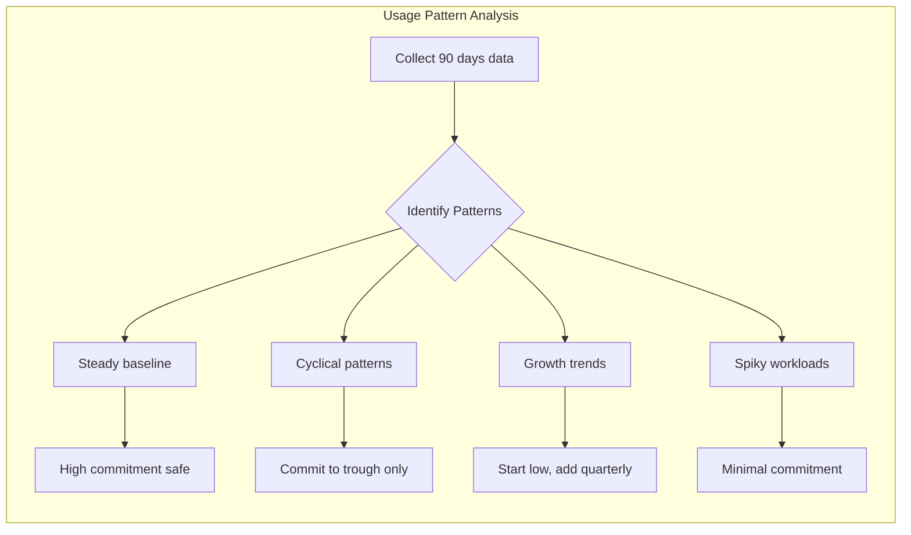
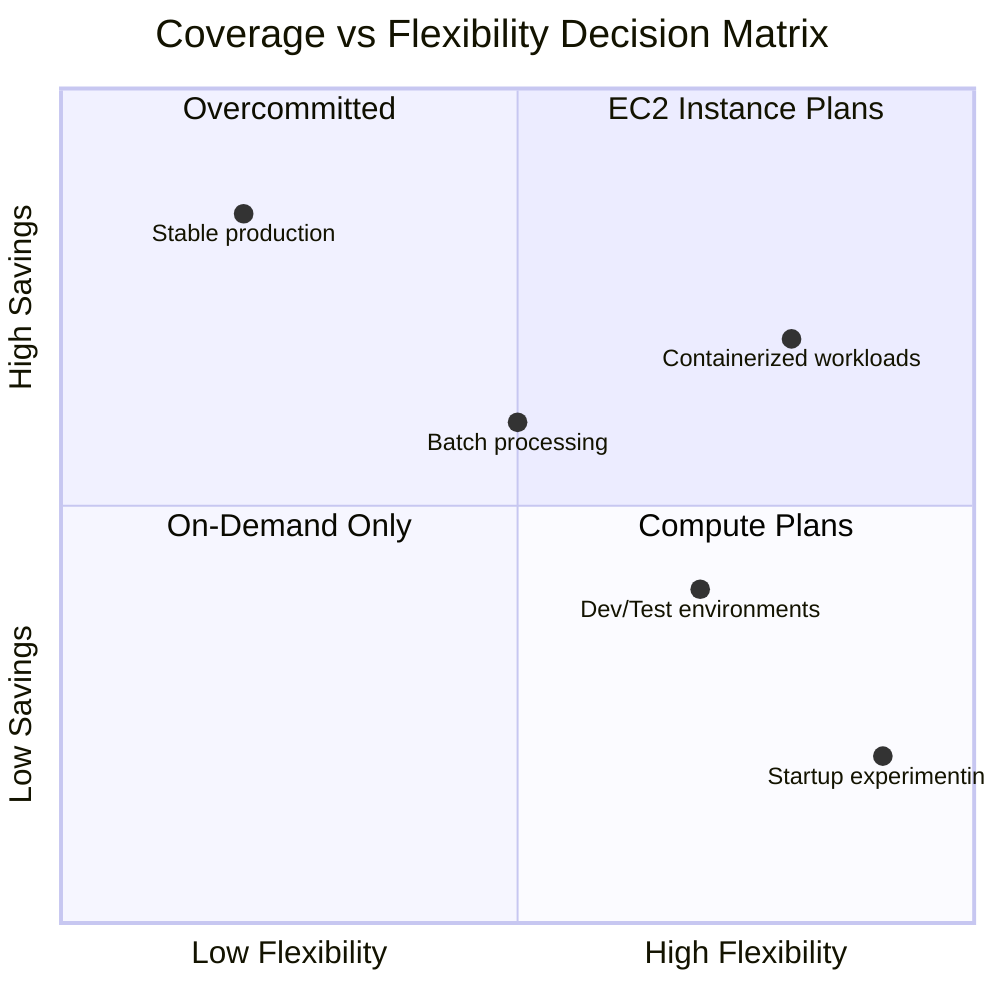
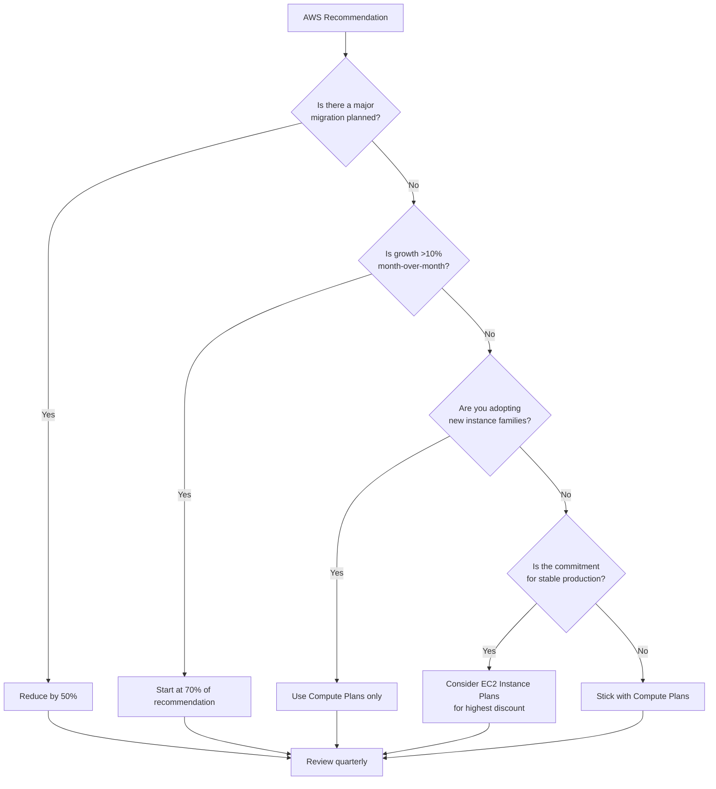
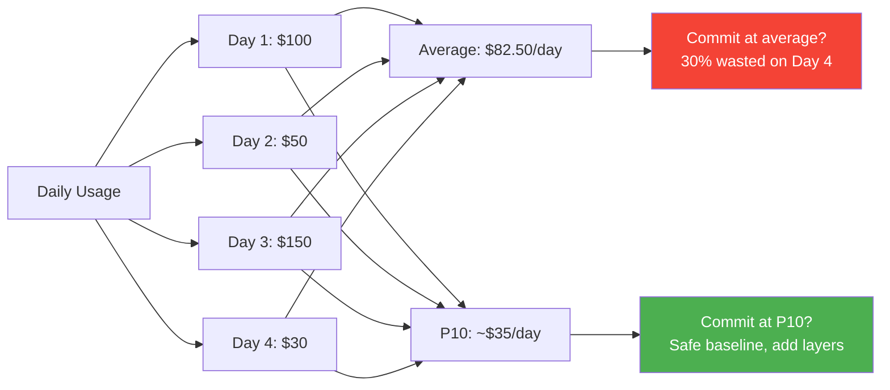
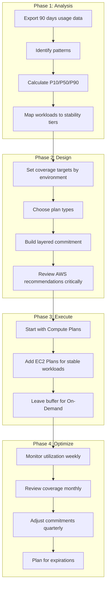

# How to Implement Savings Plan Strategy

Author: [nawazdhandala](https://github.com/nawazdhandala)

Tags: AWS, Cost Optimization, FinOps, Cloud

Description: Learn how to design an effective AWS Savings Plans strategy for cost reduction.

AWS Savings Plans can slash your compute bill by up to 72% compared to On-Demand pricing. But buying commitments without a clear strategy is how organizations end up with unused reservations, coverage gaps, and finance teams asking uncomfortable questions. This guide walks through the practical steps to build a Savings Plans strategy that maximizes savings while preserving the flexibility your engineering teams need.

---

## Understanding Savings Plans Types

AWS offers three types of Savings Plans, each with different flexibility and discount levels:



### Compute Savings Plans

The most flexible option. Discounts apply automatically to:
- EC2 instances (any family, size, OS, tenancy, or region)
- Fargate tasks (ECS and EKS)
- Lambda function duration

This flexibility means you can change instance types, migrate between regions, or shift workloads to containers without losing your discount.

### EC2 Instance Savings Plans

Higher discounts but locked to a specific instance family and region. Choose this when you have predictable, stable workloads that will not migrate. A `c6i` family commitment in `us-west-2` will not cover `c7g` instances or the same family in `eu-west-1`.

### SageMaker Savings Plans

Similar structure to Compute Savings Plans but specifically for SageMaker ML instances. If you run training jobs or inference endpoints consistently, these deliver meaningful savings.

---

## Commitment Analysis: Know Your Baseline

Before purchasing any Savings Plan, you need to understand your actual usage patterns. AWS Cost Explorer provides recommendations, but blindly following them is risky.

### Step 1: Export Your Usage Data

Use the AWS Cost and Usage Report (CUR) or query Cost Explorer programmatically:

```python
import boto3
from datetime import datetime, timedelta

def get_compute_usage_history(days=90):
    """
    Retrieve EC2, Fargate, and Lambda usage history
    to establish baseline for Savings Plans commitment.
    """
    client = boto3.client('ce', region_name='us-east-1')

    end_date = datetime.now()
    start_date = end_date - timedelta(days=days)

    response = client.get_cost_and_usage(
        TimePeriod={
            'Start': start_date.strftime('%Y-%m-%d'),
            'End': end_date.strftime('%Y-%m-%d')
        },
        Granularity='DAILY',
        Metrics=['UnblendedCost', 'UsageQuantity'],
        GroupBy=[
            {'Type': 'DIMENSION', 'Key': 'SERVICE'},
            {'Type': 'DIMENSION', 'Key': 'USAGE_TYPE'}
        ],
        Filter={
            'Dimensions': {
                'Key': 'SERVICE',
                'Values': [
                    'Amazon Elastic Compute Cloud - Compute',
                    'AWS Lambda',
                    'Amazon Elastic Container Service'
                ]
            }
        }
    )

    return response['ResultsByTime']


def calculate_baseline_commitment(usage_data):
    """
    Calculate the safe baseline commitment level.
    Use the minimum sustained usage, not the average.
    """
    daily_costs = []

    for day in usage_data:
        day_total = sum(
            float(group['Metrics']['UnblendedCost']['Amount'])
            for group in day['Groups']
        )
        daily_costs.append(day_total)

    # Sort to find percentiles
    daily_costs.sort()

    # P10 gives you the minimum sustained floor
    p10_index = int(len(daily_costs) * 0.10)
    baseline = daily_costs[p10_index]

    # Convert daily to hourly commitment
    hourly_commitment = baseline / 24

    return {
        'daily_p10': baseline,
        'daily_p50': daily_costs[len(daily_costs) // 2],
        'daily_max': daily_costs[-1],
        'recommended_hourly_commitment': hourly_commitment
    }
```

### Step 2: Identify Usage Patterns

Look for these patterns in your data:



**Steady baseline**: Workloads that run 24/7 with minimal variation. Safe to commit at 80-90% of average.

**Cyclical patterns**: Business hours, weekday vs weekend, monthly batch jobs. Commit only to the trough, cover peaks with On-Demand.

**Growth trends**: If usage is climbing month-over-month, start with a conservative commitment and plan quarterly reviews.

**Spiky workloads**: Unpredictable bursts like viral traffic or incident response. Keep commitments minimal; pay the On-Demand premium for flexibility.

---

## Coverage vs Flexibility Trade-offs

The fundamental tension in Savings Plans strategy is coverage versus flexibility. Higher coverage means more savings but less room to change.



### The Layered Approach

Instead of one large commitment, build layers:

```python
def calculate_layered_commitment(usage_analysis):
    """
    Build a layered Savings Plans strategy.
    Layer 1: Rock-solid baseline (EC2 Instance Plans)
    Layer 2: Flexible coverage (Compute Plans)
    Layer 3: On-Demand for peaks
    """

    # Layer 1: Commit to absolute minimum with highest discount
    # Only for workloads you KNOW will not change
    stable_baseline = usage_analysis['daily_p10'] * 0.7  # Conservative

    # Layer 2: Cover typical usage with flexible plans
    flexible_coverage = (
        usage_analysis['daily_p50'] - stable_baseline
    ) * 0.8

    # Layer 3: Everything above P50 stays On-Demand
    on_demand_buffer = (
        usage_analysis['daily_max'] -
        usage_analysis['daily_p50']
    )

    return {
        'ec2_instance_plan_commitment': stable_baseline / 24,
        'compute_plan_commitment': flexible_coverage / 24,
        'on_demand_expected_daily': on_demand_buffer,
        'total_hourly_commitment': (
            stable_baseline + flexible_coverage
        ) / 24
    }
```

### Coverage Targets by Environment

| Environment | Recommended Coverage | Plan Type |
|-------------|---------------------|-----------|
| Production (stable) | 70-80% | EC2 Instance + Compute |
| Production (variable) | 50-60% | Compute only |
| Staging | 30-40% | Compute (shared commitment) |
| Development | 0-20% | On-Demand or Spot |
| Batch/Analytics | Case-by-case | Depends on predictability |

---

## Compute vs EC2 Instance Plans: When to Use Each

The decision between Compute and EC2 Instance Savings Plans depends on your architectural stability.

### Choose EC2 Instance Savings Plans When:

```bash
# Checklist for EC2 Instance Plans
# Answer YES to all before committing:

# 1. Is the instance family locked for 1-3 years?
aws ec2 describe-instance-types --instance-types c6i.* \
  --query 'InstanceTypes[].InstanceType' | head -5
# If you're on c6i and c7i just launched, think twice

# 2. Is the region fixed?
# Check if workloads might migrate for latency, compliance, or DR

# 3. Is the workload stable?
# Production databases, core services, compliance-mandated systems

# 4. Are you NOT planning container migration?
# EC2 plans don't cover Fargate
```

### Choose Compute Savings Plans When:

- Migrating to containers (ECS, EKS on Fargate)
- Multi-region deployment plans
- Instance family upgrades expected (Graviton migrations)
- Lambda usage is significant
- Architectural flexibility is a priority

### Real-World Example: Hybrid Strategy

```python
def design_hybrid_strategy(workload_inventory):
    """
    Design a hybrid Savings Plans strategy based on workload characteristics.
    """

    ec2_plan_candidates = []
    compute_plan_candidates = []
    on_demand_candidates = []

    for workload in workload_inventory:
        if workload['stability'] == 'rock_solid':
            # Database servers, core APIs that won't change
            if workload['container_migration_planned']:
                compute_plan_candidates.append(workload)
            else:
                ec2_plan_candidates.append(workload)

        elif workload['stability'] == 'moderate':
            # Services that might scale or change instance types
            compute_plan_candidates.append(workload)

        else:
            # Experimental, spiky, or unpredictable
            on_demand_candidates.append(workload)

    return {
        'ec2_instance_plans': {
            'workloads': ec2_plan_candidates,
            'discount_rate': 0.72,  # Up to 72% off
            'flexibility': 'low'
        },
        'compute_plans': {
            'workloads': compute_plan_candidates,
            'discount_rate': 0.66,  # Up to 66% off
            'flexibility': 'high'
        },
        'on_demand': {
            'workloads': on_demand_candidates,
            'discount_rate': 0.0,
            'flexibility': 'maximum'
        }
    }
```

---

## Recommendation Analysis: Beyond AWS Suggestions

AWS Cost Explorer provides Savings Plans recommendations, but they optimize for coverage, not business context.

### Critically Evaluate AWS Recommendations

```python
import boto3

def get_and_analyze_recommendations():
    """
    Fetch AWS recommendations and add business context.
    """
    client = boto3.client('ce', region_name='us-east-1')

    # Get recommendations for different terms
    terms = ['ONE_YEAR', 'THREE_YEAR']
    payment_options = ['NO_UPFRONT', 'PARTIAL_UPFRONT', 'ALL_UPFRONT']

    recommendations = {}

    for term in terms:
        for payment in payment_options:
            response = client.get_savings_plans_purchase_recommendation(
                SavingsPlansType='COMPUTE_SP',
                TermInYears=term,
                PaymentOption=payment,
                LookbackPeriodInDays='SIXTY_DAYS'
            )

            key = f"{term}_{payment}"
            rec = response.get('SavingsPlansPurchaseRecommendation', {})

            recommendations[key] = {
                'hourly_commitment': rec.get(
                    'SavingsPlansPurchaseRecommendationDetails', [{}]
                )[0].get('HourlyCommitmentToPurchase', '0'),
                'estimated_savings': rec.get(
                    'SavingsPlansPurchaseRecommendationSummary', {}
                ).get('EstimatedMonthlySavingsAmount', '0'),
                'estimated_coverage': rec.get(
                    'SavingsPlansPurchaseRecommendationSummary', {}
                ).get('CurrentOnDemandSpend', '0')
            }

    return recommendations


def apply_business_context(recommendations, business_factors):
    """
    Adjust recommendations based on business reality.
    """
    adjusted = {}

    for key, rec in recommendations.items():
        hourly = float(rec['hourly_commitment'])

        # Factor 1: Known upcoming changes
        if business_factors.get('major_migration_planned'):
            hourly *= 0.5  # Cut commitment in half

        # Factor 2: Growth trajectory
        growth_rate = business_factors.get('monthly_growth_rate', 0)
        if growth_rate > 0.1:  # >10% monthly growth
            hourly *= 0.7  # Conservative start

        # Factor 3: Business uncertainty
        if business_factors.get('market_volatility'):
            hourly *= 0.6

        # Factor 4: Team expertise
        if not business_factors.get('finops_team_exists'):
            hourly *= 0.8  # Buffer for learning curve

        adjusted[key] = {
            'aws_recommended': rec['hourly_commitment'],
            'adjusted_recommendation': round(hourly, 2),
            'adjustment_reason': 'Business context applied'
        }

    return adjusted
```

### Questions to Ask Before Committing



---

## Ongoing Optimization

Savings Plans are not set-and-forget. Build a quarterly review process.

### Monthly Monitoring Dashboard

Track these metrics monthly:

```python
def generate_savings_plan_metrics():
    """
    Generate key metrics for Savings Plans monitoring.
    """
    client = boto3.client('ce', region_name='us-east-1')

    # Get utilization report
    utilization = client.get_savings_plans_utilization(
        TimePeriod={
            'Start': '2026-01-01',
            'End': '2026-01-30'
        },
        Granularity='MONTHLY'
    )

    # Get coverage report
    coverage = client.get_savings_plans_coverage(
        TimePeriod={
            'Start': '2026-01-01',
            'End': '2026-01-30'
        },
        Granularity='MONTHLY'
    )

    metrics = {
        'utilization_percentage': utilization['Total']['Utilization'][
            'UtilizationPercentage'
        ],
        'coverage_percentage': coverage['Total']['Coverage'][
            'CoveragePercentage'
        ],
        'total_commitment': utilization['Total']['Utilization'][
            'TotalCommitment'
        ],
        'used_commitment': utilization['Total']['Utilization'][
            'UsedCommitment'
        ],
        'unused_commitment': utilization['Total']['Utilization'][
            'UnusedCommitment'
        ]
    }

    # Alert thresholds
    alerts = []

    if float(metrics['utilization_percentage']) < 80:
        alerts.append({
            'severity': 'WARNING',
            'message': f"Utilization at {metrics['utilization_percentage']}% - "
                      f"you may be overcommitted"
        })

    if float(metrics['coverage_percentage']) < 50:
        alerts.append({
            'severity': 'INFO',
            'message': f"Coverage at {metrics['coverage_percentage']}% - "
                      f"consider additional commitments"
        })

    return metrics, alerts
```

### Quarterly Review Checklist

```markdown
## Savings Plans Quarterly Review

### Utilization Check
- [ ] Current utilization rate: _____%
- [ ] Target: >95%
- [ ] If <90%, investigate cause:
  - [ ] Workload reduction?
  - [ ] Instance family change?
  - [ ] Region migration?

### Coverage Analysis
- [ ] Current coverage rate: _____%
- [ ] On-Demand spend this quarter: $______
- [ ] Potential additional savings: $______

### Upcoming Changes
- [ ] Planned migrations in next quarter?
- [ ] New instance families to adopt?
- [ ] Workloads moving to containers?
- [ ] Region expansions planned?

### Commitment Decisions
- [ ] Additional Compute Plans needed? Amount: $____/hr
- [ ] EC2 Instance Plans expiring? Action: ________
- [ ] Adjust coverage targets? New target: _____%

### Action Items
1. ________________________________
2. ________________________________
3. ________________________________
```

### Automation: Slack Alerts for Utilization

```python
import boto3
import requests
from datetime import datetime, timedelta

def check_utilization_and_alert():
    """
    Check Savings Plans utilization and send Slack alerts
    if utilization drops below threshold.
    """
    ce_client = boto3.client('ce', region_name='us-east-1')

    end_date = datetime.now()
    start_date = end_date - timedelta(days=7)

    response = ce_client.get_savings_plans_utilization(
        TimePeriod={
            'Start': start_date.strftime('%Y-%m-%d'),
            'End': end_date.strftime('%Y-%m-%d')
        },
        Granularity='DAILY'
    )

    # Check each day's utilization
    low_utilization_days = []

    for day in response['SavingsPlansUtilizationsByTime']:
        util_pct = float(
            day['Utilization']['UtilizationPercentage']
        )
        if util_pct < 90:
            low_utilization_days.append({
                'date': day['TimePeriod']['Start'],
                'utilization': util_pct,
                'unused': day['Utilization']['UnusedCommitment']
            })

    if low_utilization_days:
        send_slack_alert(low_utilization_days)


def send_slack_alert(low_utilization_days):
    """
    Send formatted alert to Slack.
    """
    webhook_url = 'YOUR_SLACK_WEBHOOK_URL'

    blocks = [
        {
            "type": "header",
            "text": {
                "type": "plain_text",
                "text": "Savings Plans Utilization Alert"
            }
        },
        {
            "type": "section",
            "text": {
                "type": "mrkdwn",
                "text": f"*{len(low_utilization_days)} days* with "
                       f"utilization below 90% in the past week."
            }
        }
    ]

    for day in low_utilization_days[:5]:  # Limit to 5 entries
        blocks.append({
            "type": "section",
            "fields": [
                {
                    "type": "mrkdwn",
                    "text": f"*Date:* {day['date']}"
                },
                {
                    "type": "mrkdwn",
                    "text": f"*Utilization:* {day['utilization']:.1f}%"
                },
                {
                    "type": "mrkdwn",
                    "text": f"*Unused:* ${day['unused']}"
                }
            ]
        })

    requests.post(webhook_url, json={"blocks": blocks})
```

---

## Common Mistakes to Avoid

### 1. Committing Based on Average Usage



### 2. Ignoring Architectural Changes

Do not buy 3-year EC2 Instance Plans if:
- Graviton migration is on the roadmap
- Container adoption is planned
- Multi-region expansion is likely

### 3. Forgetting About Expiration

Set calendar reminders 90 days before any Savings Plan expires. This gives time to:
- Analyze current usage patterns
- Evaluate if the same commitment makes sense
- Purchase replacement plans before gaps occur

### 4. Over-optimizing for Coverage

100% coverage is not the goal. Some On-Demand spend is healthy because it means you have headroom for:
- Unexpected traffic spikes
- Incident response scaling
- Experimental workloads

Target 70-80% coverage for production, less for other environments.

---

## Summary: The Savings Plans Playbook



**Key Takeaways:**

1. **Start conservative**: It is easier to add commitment than to waste unused reservations.

2. **Layer your approach**: Use EC2 Instance Plans for rock-solid workloads, Compute Plans for flexibility, and On-Demand for peaks.

3. **Automate monitoring**: Low utilization is money burned. Set up alerts before it becomes a quarterly surprise.

4. **Review regularly**: Cloud usage changes. Your commitments should evolve with your architecture.

5. **Think business context**: AWS recommendations optimize for coverage. You need to optimize for business outcomes.

The best Savings Plans strategy is one that saves money today without handcuffing your engineering choices tomorrow. Build for flexibility first, then layer in higher discounts where stability allows.

---

**Related Reading:**

- [How moving from AWS to Bare-Metal saved us $230,000 /yr.](https://oneuptime.com/blog/post/2023-10-30-moving-from-aws-to-bare-metal/view)
- [Datadog Dollars: Why Your Monitoring Bill Is Breaking the Bank](https://oneuptime.com/blog/post/2025-02-01-datadog-dollars-why-monitoring-is-breaking-the-bank/view)
- [Two Years After Leaving AWS for Bare Metal](https://oneuptime.com/blog/post/2025-10-29-aws-to-bare-metal-two-years-later/view)
