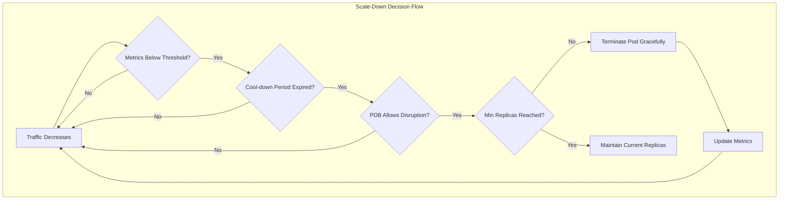
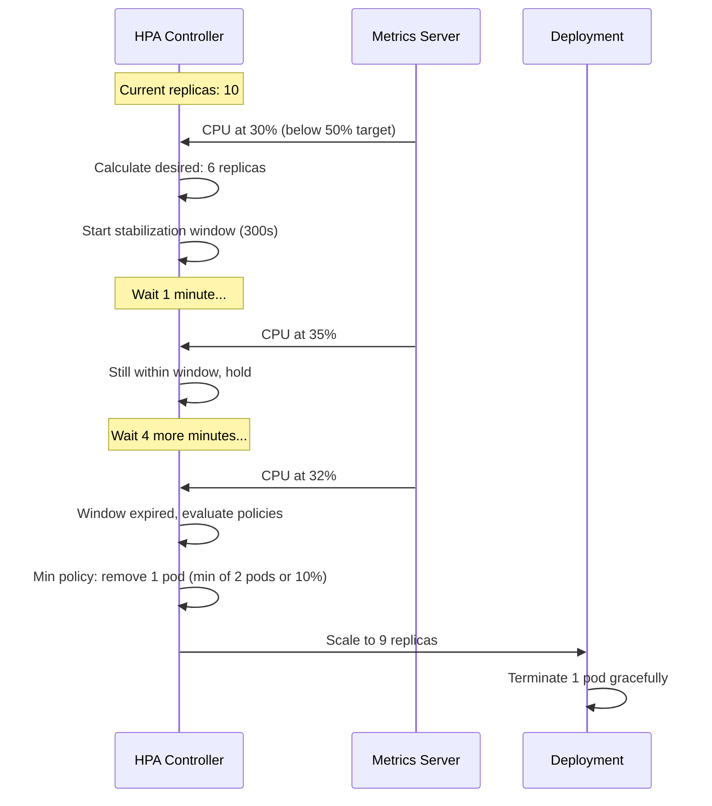
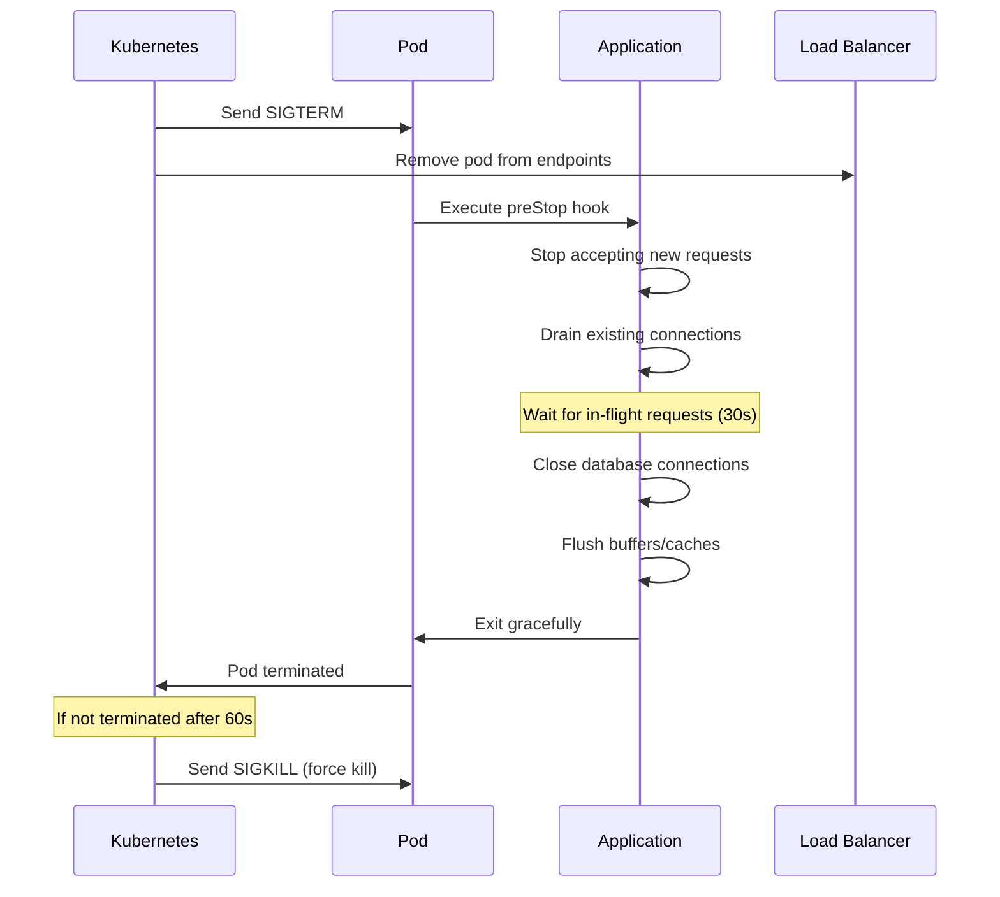
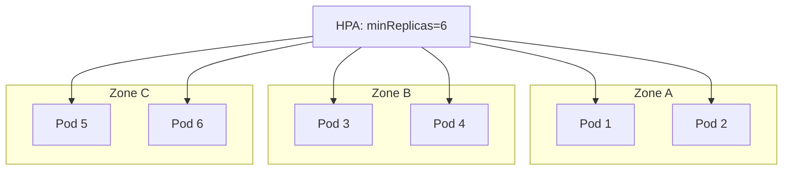
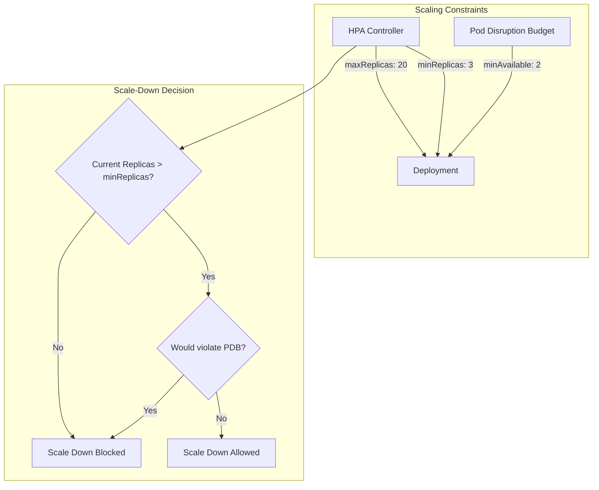
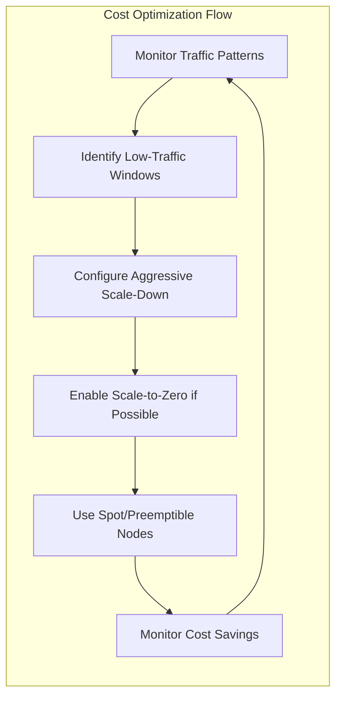

# How to Create Scale-Down Policies

Author: [nawazdhandala](https://github.com/nawazdhandala)

Tags: Auto-Scaling, Kubernetes, Cost Optimization, DevOps

Description: Learn how to configure safe scale-down policies for cost optimization.

---

Scaling up is easy. Scaling down without breaking things takes planning. This guide covers how to configure scale-down policies that save costs while maintaining availability.

## Why Scale-Down Policies Matter

Without proper scale-down policies, you risk:
- Terminating pods handling active requests
- Losing in-flight data or jobs
- Creating service disruptions during traffic lulls
- Paying for capacity you no longer need

A well-designed scale-down policy balances cost savings with reliability.



## 1. Scale-Down Trigger Metrics

The HPA uses metrics to decide when to scale down. Configure thresholds that reflect actual resource utilization patterns.

### CPU-Based Scale-Down

```yaml
apiVersion: autoscaling/v2
kind: HorizontalPodAutoscaler
metadata:
  name: web-hpa
  namespace: production
spec:
  scaleTargetRef:
    apiVersion: apps/v1
    kind: Deployment
    name: web
  minReplicas: 3
  maxReplicas: 20
  metrics:
    - type: Resource
      resource:
        name: cpu
        target:
          type: Utilization
          averageUtilization: 50  # Scale down when avg CPU < 50%
```

When average CPU utilization drops below 50%, the HPA calculates the ideal replica count and begins scaling down.

### Memory-Based Scale-Down

```yaml
metrics:
  - type: Resource
    resource:
      name: memory
      target:
        type: AverageValue
        averageValue: 500Mi  # Scale down when avg memory < 500Mi
```

### Custom Metrics (Prometheus)

For more precise control, use application-specific metrics:

```yaml
apiVersion: autoscaling/v2
kind: HorizontalPodAutoscaler
metadata:
  name: api-hpa
spec:
  scaleTargetRef:
    apiVersion: apps/v1
    kind: Deployment
    name: api
  minReplicas: 2
  maxReplicas: 15
  metrics:
    - type: Pods
      pods:
        metric:
          name: http_requests_per_second  # Custom metric from Prometheus
        target:
          type: AverageValue
          averageValue: "100"  # Scale down when RPS < 100 per pod
```

This requires the Prometheus Adapter to be installed in your cluster.

## 2. Cool-Down Period Configuration

Cool-down periods (stabilization windows) prevent thrashing where the HPA rapidly scales up and down. The `behavior` field gives you fine-grained control.

```yaml
apiVersion: autoscaling/v2
kind: HorizontalPodAutoscaler
metadata:
  name: web-hpa
  namespace: production
spec:
  scaleTargetRef:
    apiVersion: apps/v1
    kind: Deployment
    name: web
  minReplicas: 3
  maxReplicas: 20
  metrics:
    - type: Resource
      resource:
        name: cpu
        target:
          type: Utilization
          averageUtilization: 50
  behavior:
    scaleDown:
      stabilizationWindowSeconds: 300  # Wait 5 minutes before scaling down
      policies:
        - type: Pods
          value: 2              # Remove at most 2 pods
          periodSeconds: 60    # Per 60-second period
        - type: Percent
          value: 10            # Or remove at most 10% of pods
          periodSeconds: 60
      selectPolicy: Min        # Use the more conservative policy
```

### Understanding Stabilization Windows



### Policy Selection Options

| selectPolicy | Behavior |
|--------------|----------|
| `Min` | Use the policy that removes fewer pods (conservative) |
| `Max` | Use the policy that removes more pods (aggressive) |
| `Disabled` | Disable scale-down entirely |

### Conservative vs Aggressive Configurations

**Conservative (for critical services):**

```yaml
behavior:
  scaleDown:
    stabilizationWindowSeconds: 600  # 10-minute stabilization
    policies:
      - type: Pods
        value: 1                     # Remove 1 pod at a time
        periodSeconds: 120           # Every 2 minutes
    selectPolicy: Min
```

**Aggressive (for batch/dev workloads):**

```yaml
behavior:
  scaleDown:
    stabilizationWindowSeconds: 60   # 1-minute stabilization
    policies:
      - type: Percent
        value: 50                    # Remove up to 50% of pods
        periodSeconds: 30            # Every 30 seconds
    selectPolicy: Max
```

## 3. Graceful Termination

When pods are terminated during scale-down, they need time to finish processing requests and clean up.

### Configure terminationGracePeriodSeconds

```yaml
apiVersion: apps/v1
kind: Deployment
metadata:
  name: web
  namespace: production
spec:
  replicas: 5
  selector:
    matchLabels:
      app: web
  template:
    metadata:
      labels:
        app: web
    spec:
      terminationGracePeriodSeconds: 60  # 60 seconds to shut down
      containers:
        - name: web
          image: myapp:1.0
          ports:
            - containerPort: 8080
          lifecycle:
            preStop:
              exec:
                command:
                  - /bin/sh
                  - -c
                  - |
                    # Stop accepting new connections
                    touch /tmp/shutdown
                    # Wait for in-flight requests to complete
                    sleep 30
```

### Graceful Shutdown Flow



### Application-Level Graceful Shutdown

**Node.js example:**

```javascript
const express = require('express');
const app = express();

let isShuttingDown = false;
let server;

// Health check that fails during shutdown
app.get('/health', (req, res) => {
  if (isShuttingDown) {
    res.status(503).send('Shutting down');
  } else {
    res.status(200).send('OK');
  }
});

// Application routes
app.get('/api/data', (req, res) => {
  // Your business logic
  res.json({ data: 'value' });
});

// Start server
server = app.listen(8080, () => {
  console.log('Server running on port 8080');
});

// Handle SIGTERM from Kubernetes
process.on('SIGTERM', () => {
  console.log('SIGTERM received, starting graceful shutdown');
  isShuttingDown = true;

  // Stop accepting new connections
  server.close(() => {
    console.log('HTTP server closed');

    // Close database connections, etc.
    // db.close();

    process.exit(0);
  });

  // Force exit after timeout
  setTimeout(() => {
    console.error('Forced shutdown after timeout');
    process.exit(1);
  }, 55000); // Less than terminationGracePeriodSeconds
});
```

**Python (Flask) example:**

```python
import signal
import sys
from flask import Flask, jsonify

app = Flask(__name__)
is_shutting_down = False

@app.route('/health')
def health():
    if is_shutting_down:
        return 'Shutting down', 503
    return 'OK', 200

@app.route('/api/data')
def get_data():
    return jsonify({'data': 'value'})

def graceful_shutdown(signum, frame):
    global is_shutting_down
    print('SIGTERM received, starting graceful shutdown')
    is_shutting_down = True

    # Perform cleanup
    # close_database_connections()
    # flush_caches()

    sys.exit(0)

signal.signal(signal.SIGTERM, graceful_shutdown)

if __name__ == '__main__':
    app.run(host='0.0.0.0', port=8080)
```

## 4. Minimum Availability Guarantees

Ensure you never scale below a safe threshold that could impact service availability.

### Set minReplicas in HPA

```yaml
apiVersion: autoscaling/v2
kind: HorizontalPodAutoscaler
metadata:
  name: web-hpa
spec:
  scaleTargetRef:
    apiVersion: apps/v1
    kind: Deployment
    name: web
  minReplicas: 3    # Never go below 3 pods
  maxReplicas: 20
  metrics:
    - type: Resource
      resource:
        name: cpu
        target:
          type: Utilization
          averageUtilization: 50
```

### Calculating Minimum Replicas

Consider these factors:

| Factor | Calculation |
|--------|-------------|
| Availability zones | At least 1 pod per AZ |
| Peak latency requirements | Enough capacity to handle burst |
| Failure tolerance | N+1 or N+2 redundancy |
| Pod startup time | Account for cold start delays |

**Example calculation:**

```
Minimum baseline traffic: 100 RPS
Each pod handles: 50 RPS
Pod startup time: 30 seconds
Acceptable cold-start capacity: 80%

Minimum replicas = ceil(100 / (50 * 0.8)) = 3 pods
```

### Zone-Aware Minimum Replicas

```yaml
apiVersion: apps/v1
kind: Deployment
metadata:
  name: web
spec:
  replicas: 6  # 2 per AZ for 3-zone cluster
  template:
    spec:
      topologySpreadConstraints:
        - maxSkew: 1
          topologyKey: topology.kubernetes.io/zone
          whenUnsatisfiable: DoNotSchedule
          labelSelector:
            matchLabels:
              app: web
```



## 5. Pod Disruption Budgets

PDBs protect against excessive scale-down by limiting how many pods can be unavailable simultaneously.

### Basic PDB for Scale-Down Protection

```yaml
apiVersion: policy/v1
kind: PodDisruptionBudget
metadata:
  name: web-pdb
  namespace: production
spec:
  minAvailable: 2  # Always keep at least 2 pods running
  selector:
    matchLabels:
      app: web
```

### Percentage-Based PDB

```yaml
apiVersion: policy/v1
kind: PodDisruptionBudget
metadata:
  name: api-pdb
  namespace: production
spec:
  maxUnavailable: 25%  # Allow up to 25% pods to be unavailable
  selector:
    matchLabels:
      app: api
```

### PDB and HPA Interaction



### Complete Example with HPA and PDB

```yaml
# Deployment
apiVersion: apps/v1
kind: Deployment
metadata:
  name: web
  namespace: production
spec:
  replicas: 5
  selector:
    matchLabels:
      app: web
  template:
    metadata:
      labels:
        app: web
    spec:
      terminationGracePeriodSeconds: 60
      containers:
        - name: web
          image: myapp:1.0
          resources:
            requests:
              cpu: 100m
              memory: 128Mi
            limits:
              cpu: 500m
              memory: 256Mi
---
# HPA
apiVersion: autoscaling/v2
kind: HorizontalPodAutoscaler
metadata:
  name: web-hpa
  namespace: production
spec:
  scaleTargetRef:
    apiVersion: apps/v1
    kind: Deployment
    name: web
  minReplicas: 3
  maxReplicas: 20
  metrics:
    - type: Resource
      resource:
        name: cpu
        target:
          type: Utilization
          averageUtilization: 50
  behavior:
    scaleDown:
      stabilizationWindowSeconds: 300
      policies:
        - type: Pods
          value: 1
          periodSeconds: 60
      selectPolicy: Min
---
# PDB
apiVersion: policy/v1
kind: PodDisruptionBudget
metadata:
  name: web-pdb
  namespace: production
spec:
  minAvailable: 2
  selector:
    matchLabels:
      app: web
```

## 6. Cost-Driven Scale-Down

Optimize your scale-down policies for maximum cost savings without sacrificing reliability.

### Time-Based Scaling with CronJobs

Scale down during known low-traffic periods:

```yaml
apiVersion: batch/v1
kind: CronJob
metadata:
  name: scale-down-night
  namespace: production
spec:
  schedule: "0 22 * * *"  # 10 PM daily
  jobTemplate:
    spec:
      template:
        spec:
          serviceAccountName: hpa-modifier
          containers:
            - name: kubectl
              image: bitnami/kubectl:latest
              command:
                - /bin/sh
                - -c
                - |
                  kubectl patch hpa web-hpa -n production \
                    --patch '{"spec":{"minReplicas":2}}'
          restartPolicy: OnFailure
---
apiVersion: batch/v1
kind: CronJob
metadata:
  name: scale-up-morning
  namespace: production
spec:
  schedule: "0 6 * * *"  # 6 AM daily
  jobTemplate:
    spec:
      template:
        spec:
          serviceAccountName: hpa-modifier
          containers:
            - name: kubectl
              image: bitnami/kubectl:latest
              command:
                - /bin/sh
                - -c
                - |
                  kubectl patch hpa web-hpa -n production \
                    --patch '{"spec":{"minReplicas":5}}'
          restartPolicy: OnFailure
```

### KEDA for Advanced Scaling

KEDA (Kubernetes Event-Driven Autoscaler) provides more sophisticated scale-down options:

```yaml
apiVersion: keda.sh/v1alpha1
kind: ScaledObject
metadata:
  name: web-scaledobject
  namespace: production
spec:
  scaleTargetRef:
    name: web
  minReplicaCount: 0    # Scale to zero when idle!
  maxReplicaCount: 20
  cooldownPeriod: 300   # Wait 5 minutes before scaling down
  triggers:
    - type: prometheus
      metadata:
        serverAddress: http://prometheus:9090
        metricName: http_requests_total
        threshold: "100"
        query: |
          sum(rate(http_requests_total{app="web"}[2m]))
```

### Cost Optimization Strategies



### Spot Instance Considerations

When using spot/preemptible nodes, configure more aggressive scale-down:

```yaml
apiVersion: autoscaling/v2
kind: HorizontalPodAutoscaler
metadata:
  name: batch-hpa
spec:
  scaleTargetRef:
    apiVersion: apps/v1
    kind: Deployment
    name: batch-processor
  minReplicas: 0  # Scale to zero
  maxReplicas: 50
  metrics:
    - type: External
      external:
        metric:
          name: queue_length
          selector:
            matchLabels:
              queue: jobs
        target:
          type: Value
          value: "0"
  behavior:
    scaleDown:
      stabilizationWindowSeconds: 60  # Fast scale-down
      policies:
        - type: Percent
          value: 100
          periodSeconds: 15
```

## Monitoring and Troubleshooting

### Check HPA Status

```bash
# View HPA details
kubectl describe hpa web-hpa -n production

# Watch HPA in real-time
kubectl get hpa web-hpa -n production -w

# Check events
kubectl get events -n production --field-selector involvedObject.name=web-hpa
```

### Common Issues

| Symptom | Likely Cause | Solution |
|---------|--------------|----------|
| HPA won't scale down | Metrics above threshold | Check `kubectl top pods` |
| Scale-down too slow | Long stabilization window | Reduce `stabilizationWindowSeconds` |
| Scale-down too aggressive | Short stabilization window | Increase `stabilizationWindowSeconds` |
| PDB blocking scale-down | minAvailable too high | Adjust PDB or increase replicas first |
| Pods killed mid-request | Short termination grace | Increase `terminationGracePeriodSeconds` |

### Prometheus Metrics to Monitor

```yaml
# HPA replica counts
kube_horizontalpodautoscaler_status_current_replicas
kube_horizontalpodautoscaler_spec_min_replicas
kube_horizontalpodautoscaler_spec_max_replicas

# PDB status
kube_poddisruptionbudget_status_pod_disruptions_allowed
kube_poddisruptionbudget_status_current_healthy

# Pod termination
kube_pod_container_status_terminated_reason
```

### Alert on Scale-Down Issues

```yaml
apiVersion: monitoring.coreos.com/v1
kind: PrometheusRule
metadata:
  name: scaledown-alerts
spec:
  groups:
    - name: scaledown
      rules:
        - alert: HPAAtMinReplicas
          expr: |
            kube_horizontalpodautoscaler_status_current_replicas
            == kube_horizontalpodautoscaler_spec_min_replicas
          for: 30m
          labels:
            severity: info
          annotations:
            summary: "HPA {{ $labels.horizontalpodautoscaler }} at minimum replicas for 30m"

        - alert: ScaleDownBlocked
          expr: |
            kube_poddisruptionbudget_status_pod_disruptions_allowed == 0
          for: 15m
          labels:
            severity: warning
          annotations:
            summary: "PDB {{ $labels.poddisruptionbudget }} blocking disruptions"
```

---

Scale-down policies require balancing cost optimization with service reliability. Start conservative with long stabilization windows and gradually tune based on your traffic patterns. Always combine HPA settings with PDBs and proper graceful shutdown handling to ensure safe scale-down operations.
