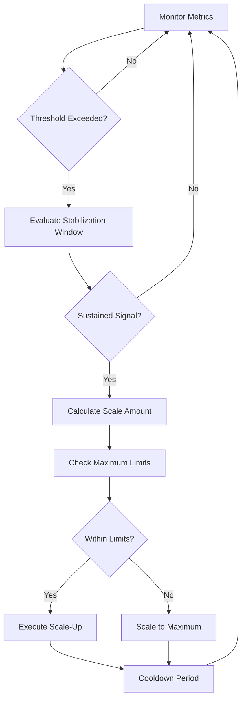
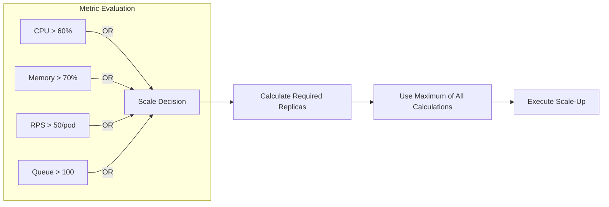
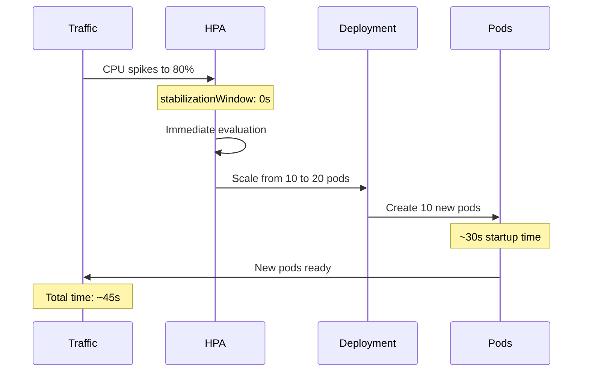
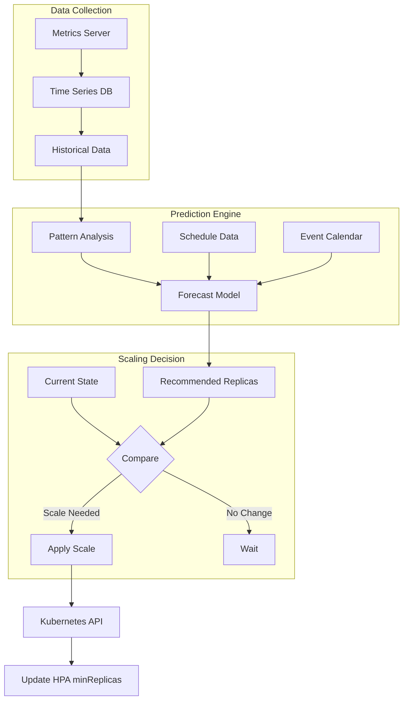
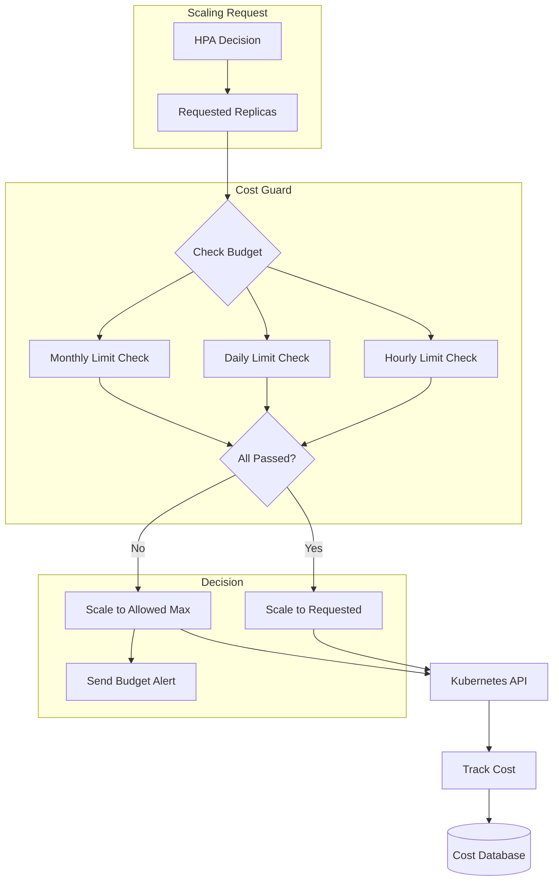

# How to Implement Scale-Up Policies

Author: [nawazdhandala](https://github.com/nawazdhandala)

Tags: Auto-Scaling, Kubernetes, Infrastructure, DevOps

Description: Learn how to configure effective scale-up policies for responsive scaling.

---

When traffic spikes hit your application, the difference between a smooth scale-up and a degraded user experience often comes down to how well you have configured your scale-up policies. In this guide, we will explore how to design and implement scale-up policies that respond quickly to demand while maintaining cost efficiency and system stability.

## Understanding Scale-Up Policies

Scale-up policies define when and how your infrastructure adds capacity in response to increased demand. A well-designed policy balances responsiveness with stability, ensuring you scale fast enough to handle traffic but not so aggressively that you waste resources on false signals.



## Scale-Up Trigger Metrics

Choosing the right metrics to trigger scaling is the foundation of a responsive scale-up policy. Different workloads benefit from different trigger metrics.

### CPU-Based Scaling

CPU utilization is the most common trigger metric. It works well for compute-bound workloads:

```yaml
apiVersion: autoscaling/v2
kind: HorizontalPodAutoscaler
metadata:
  name: api-server
  namespace: production
spec:
  scaleTargetRef:
    apiVersion: apps/v1
    kind: Deployment
    name: api-server
  minReplicas: 3
  maxReplicas: 50
  metrics:
    - type: Resource
      resource:
        name: cpu
        target:
          type: Utilization
          # Scale up when average CPU exceeds 60%
          # Lower threshold = faster response to load
          averageUtilization: 60
```

### Memory-Based Scaling

Memory-based scaling suits applications that accumulate state or cache data:

```yaml
metrics:
  - type: Resource
    resource:
      name: memory
      target:
        type: Utilization
        # Scale when memory usage exceeds 70%
        averageUtilization: 70
  - type: Resource
    resource:
      name: memory
      target:
        type: AverageValue
        # Or use absolute values for predictable behavior
        averageValue: 512Mi
```

### Custom Metrics for Business-Aware Scaling

For more sophisticated scaling, use custom metrics that reflect actual business load:

```yaml
apiVersion: autoscaling/v2
kind: HorizontalPodAutoscaler
metadata:
  name: order-processor
  namespace: production
spec:
  scaleTargetRef:
    apiVersion: apps/v1
    kind: Deployment
    name: order-processor
  minReplicas: 2
  maxReplicas: 100
  metrics:
    # Scale based on queue depth from Prometheus
    - type: External
      external:
        metric:
          name: rabbitmq_queue_messages_ready
          selector:
            matchLabels:
              queue: orders
        target:
          type: AverageValue
          # Each pod should handle ~100 pending messages
          averageValue: "100"
    # Also scale on requests per second
    - type: Pods
      pods:
        metric:
          name: http_requests_per_second
        target:
          type: AverageValue
          # Target 50 RPS per pod
          averageValue: "50"
```

### Multi-Metric Scaling Strategy

Combining multiple metrics ensures you scale on whichever constraint is hit first:



## Threshold Configuration

Setting appropriate thresholds determines how quickly and accurately your system responds to load changes.

### Calculating Optimal Thresholds

The ideal threshold depends on your application's characteristics:

```python
from dataclasses import dataclass
from typing import Optional

@dataclass
class ScalingThresholdCalculator:
    """Calculate optimal scaling thresholds based on application characteristics."""

    # Time it takes for a new pod to become ready (seconds)
    pod_startup_time: float

    # Time for load balancer to include new pod (seconds)
    lb_warmup_time: float

    # Maximum acceptable latency degradation (percentage)
    acceptable_latency_increase: float

    # CPU usage at which latency starts degrading
    latency_degradation_point: float

    def calculate_scale_up_threshold(self) -> float:
        """
        Calculate CPU threshold that triggers scaling early enough
        to prevent latency degradation.

        The threshold should account for:
        1. Time to detect the metric breach
        2. Time to provision new capacity
        3. Time for new capacity to absorb load
        """
        # Total reaction time in seconds
        total_reaction_time = (
            15 +                        # Metric collection interval
            self.pod_startup_time +     # Pod initialization
            self.lb_warmup_time         # Load balancer update
        )

        # CPU headroom needed during scale-up
        # Assumes linear relationship between CPU and request rate
        headroom_factor = total_reaction_time / 60  # Convert to minutes

        # Calculate threshold
        threshold = self.latency_degradation_point - (
            headroom_factor * (100 - self.latency_degradation_point)
        )

        # Ensure threshold is reasonable
        return max(40.0, min(80.0, threshold))

    def calculate_buffer_replicas(
        self,
        current_replicas: int,
        peak_to_average_ratio: float
    ) -> int:
        """
        Calculate buffer replicas to handle traffic spikes
        while new pods are starting.
        """
        # Buffer should handle the peak-to-average spike
        buffer = int(current_replicas * (peak_to_average_ratio - 1))

        # At minimum, have 1 buffer replica
        return max(1, buffer)


# Example calculation for a typical web service
calculator = ScalingThresholdCalculator(
    pod_startup_time=30,           # 30 seconds to start
    lb_warmup_time=10,             # 10 seconds for LB
    acceptable_latency_increase=20, # 20% latency increase OK
    latency_degradation_point=75   # Latency degrades above 75% CPU
)

threshold = calculator.calculate_scale_up_threshold()
print(f"Recommended scale-up threshold: {threshold:.1f}%")

buffer = calculator.calculate_buffer_replicas(
    current_replicas=5,
    peak_to_average_ratio=1.5
)
print(f"Recommended buffer replicas: {buffer}")
```

### Threshold Configuration Example

Apply calculated thresholds in your HPA configuration:

```yaml
apiVersion: autoscaling/v2
kind: HorizontalPodAutoscaler
metadata:
  name: web-frontend
  namespace: production
spec:
  scaleTargetRef:
    apiVersion: apps/v1
    kind: Deployment
    name: web-frontend
  minReplicas: 5
  maxReplicas: 100
  metrics:
    - type: Resource
      resource:
        name: cpu
        target:
          type: Utilization
          # Calculated threshold for 30s startup + 10s LB warmup
          averageUtilization: 55
  behavior:
    scaleUp:
      # Respond quickly to load increases
      stabilizationWindowSeconds: 0
      policies:
        - type: Percent
          value: 100
          periodSeconds: 15
        - type: Pods
          value: 4
          periodSeconds: 15
      selectPolicy: Max
```

## Scaling Speed Optimization

The speed at which you scale up directly impacts user experience during traffic spikes. Optimizing scaling speed involves tuning multiple parameters.

### Aggressive Scale-Up Policy

For latency-sensitive applications, configure aggressive scale-up:

```yaml
apiVersion: autoscaling/v2
kind: HorizontalPodAutoscaler
metadata:
  name: latency-sensitive-api
spec:
  scaleTargetRef:
    apiVersion: apps/v1
    kind: Deployment
    name: api-server
  minReplicas: 10
  maxReplicas: 200
  metrics:
    - type: Resource
      resource:
        name: cpu
        target:
          averageUtilization: 50
  behavior:
    scaleUp:
      # No stabilization delay for scale-up
      stabilizationWindowSeconds: 0
      policies:
        # Double capacity if needed
        - type: Percent
          value: 100
          periodSeconds: 15
        # Or add at least 10 pods
        - type: Pods
          value: 10
          periodSeconds: 15
      # Use the more aggressive option
      selectPolicy: Max
    scaleDown:
      # Conservative scale-down to avoid thrashing
      stabilizationWindowSeconds: 300
      policies:
        - type: Percent
          value: 10
          periodSeconds: 60
```

### Scaling Speed Visualization



### Pod Startup Optimization

Reduce pod startup time to make scaling more effective:

```yaml
apiVersion: apps/v1
kind: Deployment
metadata:
  name: fast-starting-app
spec:
  replicas: 5
  template:
    spec:
      containers:
        - name: app
          image: myapp:latest
          # Reduce startup time with aggressive probes
          startupProbe:
            httpGet:
              path: /healthz
              port: 8080
            # Check every 2 seconds
            periodSeconds: 2
            # Fail fast after 30 seconds
            failureThreshold: 15
          readinessProbe:
            httpGet:
              path: /ready
              port: 8080
            periodSeconds: 5
            successThreshold: 1
          # Pre-pull images for faster starts
          imagePullPolicy: IfNotPresent
          resources:
            requests:
              cpu: 500m
              memory: 512Mi
            limits:
              cpu: 2000m
              memory: 2Gi
      # Use topology spread for better scheduling
      topologySpreadConstraints:
        - maxSkew: 1
          topologyKey: kubernetes.io/hostname
          whenUnsatisfiable: ScheduleAnyway
          labelSelector:
            matchLabels:
              app: fast-starting-app
      # Prioritize scheduling on nodes with pulled images
      affinity:
        nodeAffinity:
          preferredDuringSchedulingIgnoredDuringExecution:
            - weight: 100
              preference:
                matchExpressions:
                  - key: node.kubernetes.io/instance-type
                    operator: In
                    values:
                      - m5.xlarge
                      - m5.2xlarge
```

### Application-Level Warmup

Implement connection pool and cache warmup in your application:

```python
import asyncio
from typing import List, Callable, Awaitable
from dataclasses import dataclass, field
import time

@dataclass
class WarmupTask:
    """Represents a warmup task to execute during startup."""
    name: str
    func: Callable[[], Awaitable[None]]
    timeout_seconds: float = 30.0
    critical: bool = True

class ApplicationWarmer:
    """
    Warm up application resources during startup to reduce
    time-to-first-request latency.
    """

    def __init__(self):
        self.tasks: List[WarmupTask] = []
        self.warmup_complete = False
        self.warmup_duration: float = 0

    def register(
        self,
        name: str,
        func: Callable[[], Awaitable[None]],
        timeout_seconds: float = 30.0,
        critical: bool = True
    ):
        """Register a warmup task."""
        self.tasks.append(WarmupTask(
            name=name,
            func=func,
            timeout_seconds=timeout_seconds,
            critical=critical
        ))

    async def _execute_task(self, task: WarmupTask) -> bool:
        """Execute a single warmup task with timeout."""
        try:
            await asyncio.wait_for(
                task.func(),
                timeout=task.timeout_seconds
            )
            print(f"Warmup task '{task.name}' completed")
            return True
        except asyncio.TimeoutError:
            print(f"Warmup task '{task.name}' timed out")
            return not task.critical
        except Exception as e:
            print(f"Warmup task '{task.name}' failed: {e}")
            return not task.critical

    async def warmup(self) -> bool:
        """
        Execute all warmup tasks in parallel.
        Returns True if all critical tasks succeeded.
        """
        start_time = time.time()

        results = await asyncio.gather(
            *[self._execute_task(task) for task in self.tasks],
            return_exceptions=True
        )

        self.warmup_duration = time.time() - start_time
        self.warmup_complete = all(
            r is True for r in results
            if not isinstance(r, Exception)
        )

        print(f"Warmup completed in {self.warmup_duration:.2f}s")
        return self.warmup_complete


# Example warmup implementation
warmer = ApplicationWarmer()

async def warmup_database_pool():
    """Pre-establish database connections."""
    from app.database import get_pool
    pool = await get_pool()
    # Execute a simple query to establish connections
    async with pool.acquire() as conn:
        await conn.execute("SELECT 1")

async def warmup_redis_connections():
    """Pre-establish Redis connections."""
    from app.cache import get_redis
    redis = await get_redis()
    await redis.ping()

async def warmup_http_clients():
    """Initialize HTTP client connection pools."""
    import aiohttp
    # Create session with pre-established connections
    async with aiohttp.ClientSession() as session:
        # Warm up connections to known endpoints
        endpoints = [
            "https://api.internal.service/health",
            "https://auth.internal.service/health",
        ]
        await asyncio.gather(*[
            session.get(url) for url in endpoints
        ])

async def warmup_ml_models():
    """Load ML models into memory."""
    from app.ml import load_models
    await load_models()

# Register warmup tasks
warmer.register("database", warmup_database_pool, critical=True)
warmer.register("redis", warmup_redis_connections, critical=True)
warmer.register("http_clients", warmup_http_clients, critical=False)
warmer.register("ml_models", warmup_ml_models, timeout_seconds=60, critical=False)

# Execute warmup during startup
async def main():
    success = await warmer.warmup()
    if not success:
        print("Critical warmup tasks failed")
        exit(1)
    print("Application ready to serve traffic")
```

## Predictive Scale-Up

Instead of reacting to load, predictive scaling anticipates demand based on historical patterns.

### Time-Based Predictive Scaling

Schedule capacity increases before known traffic patterns:

```yaml
apiVersion: autoscaling/v2
kind: HorizontalPodAutoscaler
metadata:
  name: scheduled-scaler
  annotations:
    # Custom annotation for scheduled scaling controller
    scaling.example.com/schedule: |
      - cron: "0 8 * * 1-5"
        minReplicas: 20
        description: "Business hours start"
      - cron: "0 12 * * 1-5"
        minReplicas: 30
        description: "Lunch traffic peak"
      - cron: "0 18 * * 1-5"
        minReplicas: 10
        description: "After business hours"
      - cron: "0 0 * * 0,6"
        minReplicas: 5
        description: "Weekend baseline"
spec:
  scaleTargetRef:
    apiVersion: apps/v1
    kind: Deployment
    name: api-server
  minReplicas: 5
  maxReplicas: 100
  metrics:
    - type: Resource
      resource:
        name: cpu
        target:
          averageUtilization: 60
```

### Predictive Scaling Implementation

Build a predictive scaler using historical data:

```python
from dataclasses import dataclass
from datetime import datetime, timedelta
from typing import List, Tuple, Optional
import numpy as np
from collections import defaultdict

@dataclass
class TrafficDataPoint:
    timestamp: datetime
    requests_per_second: float
    cpu_utilization: float
    replica_count: int

class PredictiveScaler:
    """
    Predict future resource needs based on historical patterns.
    Uses time-series decomposition to identify recurring patterns.
    """

    def __init__(
        self,
        history_days: int = 28,
        prediction_horizon_minutes: int = 30
    ):
        self.history_days = history_days
        self.prediction_horizon = prediction_horizon_minutes
        self.historical_data: List[TrafficDataPoint] = []

        # Store patterns by hour-of-week (0-167)
        self.hourly_patterns: defaultdict = defaultdict(list)

    def add_data_point(self, data: TrafficDataPoint):
        """Add a historical data point."""
        self.historical_data.append(data)

        # Index by hour of week for pattern detection
        hour_of_week = (
            data.timestamp.weekday() * 24 +
            data.timestamp.hour
        )
        self.hourly_patterns[hour_of_week].append(data.requests_per_second)

    def _get_hour_of_week(self, dt: datetime) -> int:
        """Convert datetime to hour of week (0-167)."""
        return dt.weekday() * 24 + dt.hour

    def predict_load(
        self,
        target_time: datetime,
        confidence_level: float = 0.95
    ) -> Tuple[float, float, float]:
        """
        Predict traffic load at a future time.

        Returns:
            Tuple of (predicted_rps, lower_bound, upper_bound)
        """
        hour_of_week = self._get_hour_of_week(target_time)

        # Get historical data for this hour of week
        historical_values = self.hourly_patterns.get(hour_of_week, [])

        if not historical_values:
            # No data, return current average
            if self.historical_data:
                avg = np.mean([d.requests_per_second for d in self.historical_data])
                return avg, avg * 0.5, avg * 2.0
            return 0, 0, 0

        # Calculate statistics
        mean = np.mean(historical_values)
        std = np.std(historical_values)

        # Calculate confidence interval
        z_score = 1.96 if confidence_level == 0.95 else 2.58
        lower = max(0, mean - z_score * std)
        upper = mean + z_score * std

        return mean, lower, upper

    def calculate_required_replicas(
        self,
        predicted_rps: float,
        rps_per_pod: float,
        buffer_percentage: float = 20
    ) -> int:
        """
        Calculate required replicas for predicted load.

        Args:
            predicted_rps: Predicted requests per second
            rps_per_pod: Target RPS each pod should handle
            buffer_percentage: Extra capacity buffer
        """
        base_replicas = predicted_rps / rps_per_pod
        buffer = base_replicas * (buffer_percentage / 100)

        return int(np.ceil(base_replicas + buffer))

    def get_scaling_recommendation(
        self,
        current_replicas: int,
        current_time: datetime,
        rps_per_pod: float = 50
    ) -> dict:
        """
        Generate scaling recommendation for the next prediction horizon.
        """
        # Predict load for multiple future points
        predictions = []
        for minutes_ahead in range(0, self.prediction_horizon + 1, 5):
            future_time = current_time + timedelta(minutes=minutes_ahead)
            predicted, lower, upper = self.predict_load(future_time)
            predictions.append({
                'time': future_time,
                'predicted_rps': predicted,
                'lower_bound': lower,
                'upper_bound': upper
            })

        # Use the maximum predicted load for scaling decision
        max_predicted = max(p['upper_bound'] for p in predictions)
        recommended_replicas = self.calculate_required_replicas(
            max_predicted,
            rps_per_pod
        )

        return {
            'current_replicas': current_replicas,
            'recommended_replicas': recommended_replicas,
            'should_scale': recommended_replicas > current_replicas,
            'scale_amount': max(0, recommended_replicas - current_replicas),
            'predictions': predictions,
            'reason': (
                f"Predicted peak of {max_predicted:.0f} RPS "
                f"in next {self.prediction_horizon} minutes"
            )
        }


# Example usage
scaler = PredictiveScaler(history_days=28, prediction_horizon_minutes=30)

# Simulate loading historical data
import random
for day in range(28):
    for hour in range(24):
        # Simulate traffic pattern: higher during business hours
        base_rps = 100
        if 9 <= hour <= 17:  # Business hours
            base_rps = 500
        if hour == 12:  # Lunch peak
            base_rps = 800

        # Add some noise
        rps = base_rps + random.gauss(0, base_rps * 0.1)

        scaler.add_data_point(TrafficDataPoint(
            timestamp=datetime.now() - timedelta(days=28-day, hours=24-hour),
            requests_per_second=rps,
            cpu_utilization=rps / 10,  # Simplified
            replica_count=int(rps / 50)
        ))

# Get recommendation
recommendation = scaler.get_scaling_recommendation(
    current_replicas=10,
    current_time=datetime.now().replace(hour=11, minute=30),
    rps_per_pod=50
)

print(f"Current replicas: {recommendation['current_replicas']}")
print(f"Recommended replicas: {recommendation['recommended_replicas']}")
print(f"Should scale: {recommendation['should_scale']}")
print(f"Reason: {recommendation['reason']}")
```

### Predictive Scaling Architecture



## Maximum Limits

Setting appropriate maximum limits protects your infrastructure and budget while ensuring adequate capacity.

### Calculating Maximum Replicas

Consider multiple factors when setting maximums:

```python
from dataclasses import dataclass
from typing import Optional

@dataclass
class ClusterCapacity:
    """Represents available cluster capacity."""
    total_cpu_cores: float
    total_memory_gb: float
    available_cpu_cores: float
    available_memory_gb: float
    node_count: int
    max_pods_per_node: int

@dataclass
class PodRequirements:
    """Resource requirements for a single pod."""
    cpu_request: float  # cores
    memory_request_gb: float
    cpu_limit: float
    memory_limit_gb: float

class MaxReplicaCalculator:
    """
    Calculate safe maximum replica limits based on
    cluster capacity and cost constraints.
    """

    def __init__(
        self,
        cluster: ClusterCapacity,
        pod_requirements: PodRequirements
    ):
        self.cluster = cluster
        self.pod = pod_requirements

    def calculate_capacity_limit(self) -> int:
        """
        Calculate maximum replicas based on cluster capacity.
        Uses the more restrictive of CPU or memory limits.
        """
        # CPU-based limit
        cpu_limit = int(
            self.cluster.available_cpu_cores / self.pod.cpu_request
        )

        # Memory-based limit
        memory_limit = int(
            self.cluster.available_memory_gb / self.pod.memory_request_gb
        )

        # Pod count limit
        pod_limit = self.cluster.node_count * self.cluster.max_pods_per_node

        # Return the most restrictive limit
        return min(cpu_limit, memory_limit, pod_limit)

    def calculate_cost_limit(
        self,
        cost_per_pod_hour: float,
        max_hourly_budget: float
    ) -> int:
        """Calculate maximum replicas based on cost constraints."""
        return int(max_hourly_budget / cost_per_pod_hour)

    def calculate_safe_limit(
        self,
        cost_per_pod_hour: Optional[float] = None,
        max_hourly_budget: Optional[float] = None,
        headroom_percentage: float = 20
    ) -> dict:
        """
        Calculate a safe maximum replica limit considering
        all constraints and leaving headroom for other workloads.
        """
        capacity_limit = self.calculate_capacity_limit()

        # Apply headroom for other workloads
        safe_capacity_limit = int(
            capacity_limit * (1 - headroom_percentage / 100)
        )

        # Apply cost limit if provided
        cost_limit = None
        if cost_per_pod_hour and max_hourly_budget:
            cost_limit = self.calculate_cost_limit(
                cost_per_pod_hour,
                max_hourly_budget
            )

        # Determine final limit
        if cost_limit:
            final_limit = min(safe_capacity_limit, cost_limit)
            limiting_factor = (
                "cost" if cost_limit < safe_capacity_limit
                else "capacity"
            )
        else:
            final_limit = safe_capacity_limit
            limiting_factor = "capacity"

        return {
            'max_replicas': final_limit,
            'capacity_limit': capacity_limit,
            'safe_capacity_limit': safe_capacity_limit,
            'cost_limit': cost_limit,
            'limiting_factor': limiting_factor,
            'cluster_utilization_at_max': (
                final_limit * self.pod.cpu_request /
                self.cluster.total_cpu_cores * 100
            )
        }


# Example calculation
cluster = ClusterCapacity(
    total_cpu_cores=100,
    total_memory_gb=400,
    available_cpu_cores=80,  # 80% available for this workload
    available_memory_gb=320,
    node_count=10,
    max_pods_per_node=110
)

pod = PodRequirements(
    cpu_request=0.5,
    memory_request_gb=1.0,
    cpu_limit=2.0,
    memory_limit_gb=4.0
)

calculator = MaxReplicaCalculator(cluster, pod)

result = calculator.calculate_safe_limit(
    cost_per_pod_hour=0.05,
    max_hourly_budget=5.0,
    headroom_percentage=20
)

print(f"Recommended max replicas: {result['max_replicas']}")
print(f"Limiting factor: {result['limiting_factor']}")
print(f"Cluster utilization at max: {result['cluster_utilization_at_max']:.1f}%")
```

### Tiered Maximum Limits

Implement tiered limits for different priority levels:

```yaml
# High-priority production service
apiVersion: autoscaling/v2
kind: HorizontalPodAutoscaler
metadata:
  name: critical-api
  labels:
    priority: critical
spec:
  scaleTargetRef:
    apiVersion: apps/v1
    kind: Deployment
    name: critical-api
  minReplicas: 10
  maxReplicas: 200  # High limit for critical services
  metrics:
    - type: Resource
      resource:
        name: cpu
        target:
          averageUtilization: 50

---
# Standard service
apiVersion: autoscaling/v2
kind: HorizontalPodAutoscaler
metadata:
  name: standard-api
  labels:
    priority: standard
spec:
  scaleTargetRef:
    apiVersion: apps/v1
    kind: Deployment
    name: standard-api
  minReplicas: 3
  maxReplicas: 50  # Moderate limit
  metrics:
    - type: Resource
      resource:
        name: cpu
        target:
          averageUtilization: 60

---
# Background worker
apiVersion: autoscaling/v2
kind: HorizontalPodAutoscaler
metadata:
  name: background-worker
  labels:
    priority: low
spec:
  scaleTargetRef:
    apiVersion: apps/v1
    kind: Deployment
    name: background-worker
  minReplicas: 1
  maxReplicas: 20  # Lower limit for non-critical
  metrics:
    - type: Resource
      resource:
        name: cpu
        target:
          averageUtilization: 70
```

## Cost Guards

Implement safeguards to prevent runaway scaling costs.

### Budget-Aware Scaling Controller

```python
from dataclasses import dataclass
from datetime import datetime, timedelta
from typing import Dict, Optional
import asyncio

@dataclass
class ScalingBudget:
    """Represents a scaling cost budget."""
    hourly_limit: float
    daily_limit: float
    monthly_limit: float
    alert_threshold: float = 0.8  # Alert at 80% of budget

@dataclass
class CostTracker:
    """Track scaling costs over time."""
    hourly_costs: Dict[datetime, float]
    daily_costs: Dict[datetime, float]

    def __init__(self):
        self.hourly_costs = {}
        self.daily_costs = {}

    def record_cost(self, timestamp: datetime, cost: float):
        """Record a scaling cost."""
        hour_key = timestamp.replace(minute=0, second=0, microsecond=0)
        day_key = timestamp.replace(hour=0, minute=0, second=0, microsecond=0)

        self.hourly_costs[hour_key] = self.hourly_costs.get(hour_key, 0) + cost
        self.daily_costs[day_key] = self.daily_costs.get(day_key, 0) + cost

    def get_hourly_cost(self, hour: datetime) -> float:
        """Get cost for a specific hour."""
        hour_key = hour.replace(minute=0, second=0, microsecond=0)
        return self.hourly_costs.get(hour_key, 0)

    def get_daily_cost(self, day: datetime) -> float:
        """Get cost for a specific day."""
        day_key = day.replace(hour=0, minute=0, second=0, microsecond=0)
        return self.daily_costs.get(day_key, 0)

class CostGuardedScaler:
    """
    Scaling controller with cost guards to prevent
    runaway infrastructure costs.
    """

    def __init__(
        self,
        budget: ScalingBudget,
        cost_per_pod_hour: float
    ):
        self.budget = budget
        self.cost_per_pod_hour = cost_per_pod_hour
        self.tracker = CostTracker()
        self.alerts_sent: Dict[str, datetime] = {}

    def calculate_scaling_cost(
        self,
        additional_pods: int,
        duration_hours: float = 1.0
    ) -> float:
        """Calculate cost of scaling up by given number of pods."""
        return additional_pods * self.cost_per_pod_hour * duration_hours

    def check_budget(
        self,
        requested_pods: int,
        current_pods: int
    ) -> dict:
        """
        Check if scaling is within budget.

        Returns:
            Dict with allowed_pods, blocked_pods, and reason
        """
        now = datetime.utcnow()
        additional_pods = max(0, requested_pods - current_pods)
        scaling_cost = self.calculate_scaling_cost(additional_pods)

        # Check hourly budget
        current_hourly = self.tracker.get_hourly_cost(now)
        hourly_remaining = self.budget.hourly_limit - current_hourly

        # Check daily budget
        current_daily = self.tracker.get_daily_cost(now)
        daily_remaining = self.budget.daily_limit - current_daily

        # Determine allowed scaling
        max_by_hourly = int(hourly_remaining / self.cost_per_pod_hour)
        max_by_daily = int(daily_remaining / self.cost_per_pod_hour)

        max_additional = min(max_by_hourly, max_by_daily, additional_pods)
        allowed_pods = current_pods + max(0, max_additional)
        blocked_pods = requested_pods - allowed_pods

        # Determine limiting factor
        if blocked_pods > 0:
            if max_by_hourly < max_by_daily:
                reason = f"Hourly budget limit ({self.budget.hourly_limit})"
            else:
                reason = f"Daily budget limit ({self.budget.daily_limit})"
        else:
            reason = "Within budget"

        # Check alert thresholds
        hourly_usage = current_hourly / self.budget.hourly_limit
        daily_usage = current_daily / self.budget.daily_limit

        alerts = []
        if hourly_usage >= self.budget.alert_threshold:
            alerts.append(f"Hourly budget at {hourly_usage*100:.0f}%")
        if daily_usage >= self.budget.alert_threshold:
            alerts.append(f"Daily budget at {daily_usage*100:.0f}%")

        return {
            'requested_pods': requested_pods,
            'allowed_pods': allowed_pods,
            'blocked_pods': blocked_pods,
            'reason': reason,
            'hourly_budget_remaining': hourly_remaining,
            'daily_budget_remaining': daily_remaining,
            'alerts': alerts
        }

    async def scale_with_guard(
        self,
        deployment_name: str,
        requested_replicas: int,
        current_replicas: int,
        kubernetes_client
    ) -> dict:
        """
        Execute scaling with cost guards.

        Returns the actual scaling result.
        """
        budget_check = self.check_budget(requested_replicas, current_replicas)

        if budget_check['blocked_pods'] > 0:
            # Log the budget constraint
            print(
                f"Budget guard: Requested {requested_replicas}, "
                f"allowed {budget_check['allowed_pods']}"
            )

            # Send alerts if needed
            for alert in budget_check['alerts']:
                await self._send_alert(deployment_name, alert)

        # Execute the allowed scaling
        if budget_check['allowed_pods'] > current_replicas:
            await kubernetes_client.scale_deployment(
                deployment_name,
                budget_check['allowed_pods']
            )

            # Record the cost
            additional = budget_check['allowed_pods'] - current_replicas
            cost = self.calculate_scaling_cost(additional)
            self.tracker.record_cost(datetime.utcnow(), cost)

        return {
            'deployment': deployment_name,
            'previous_replicas': current_replicas,
            'new_replicas': budget_check['allowed_pods'],
            'budget_status': budget_check
        }

    async def _send_alert(self, deployment: str, message: str):
        """Send budget alert (implement your alerting logic)."""
        alert_key = f"{deployment}:{message}"
        now = datetime.utcnow()

        # Debounce alerts (one per hour)
        if alert_key in self.alerts_sent:
            if now - self.alerts_sent[alert_key] < timedelta(hours=1):
                return

        self.alerts_sent[alert_key] = now
        print(f"ALERT [{deployment}]: {message}")
        # Implement actual alerting (PagerDuty, Slack, etc.)


# Example usage
budget = ScalingBudget(
    hourly_limit=10.0,   # $10/hour max
    daily_limit=200.0,   # $200/day max
    monthly_limit=5000.0 # $5000/month max
)

scaler = CostGuardedScaler(
    budget=budget,
    cost_per_pod_hour=0.10  # $0.10 per pod per hour
)

# Check if scaling is within budget
result = scaler.check_budget(
    requested_pods=50,
    current_pods=20
)

print(f"Requested: {result['requested_pods']}")
print(f"Allowed: {result['allowed_pods']}")
print(f"Blocked: {result['blocked_pods']}")
print(f"Reason: {result['reason']}")
```

### Cost Guard Architecture



## Putting It All Together

Here is a complete example combining all the concepts into a production-ready scale-up policy:

```yaml
apiVersion: autoscaling/v2
kind: HorizontalPodAutoscaler
metadata:
  name: production-api
  namespace: production
  annotations:
    # Documentation
    scaling.example.com/owner: platform-team
    scaling.example.com/cost-center: engineering
    # Predictive scaling schedule
    scaling.example.com/schedule: |
      - cron: "0 8 * * 1-5"
        minReplicas: 20
      - cron: "0 18 * * 1-5"
        minReplicas: 10
    # Cost limits
    scaling.example.com/hourly-budget: "25.00"
    scaling.example.com/daily-budget: "500.00"
spec:
  scaleTargetRef:
    apiVersion: apps/v1
    kind: Deployment
    name: production-api

  # Replica boundaries
  minReplicas: 10
  maxReplicas: 100

  # Multi-metric scaling
  metrics:
    # Primary: CPU utilization
    - type: Resource
      resource:
        name: cpu
        target:
          type: Utilization
          averageUtilization: 55

    # Secondary: Memory
    - type: Resource
      resource:
        name: memory
        target:
          type: Utilization
          averageUtilization: 70

    # Business metric: Request rate
    - type: Pods
      pods:
        metric:
          name: http_requests_per_second
        target:
          type: AverageValue
          averageValue: "50"

  # Scaling behavior
  behavior:
    scaleUp:
      # Fast scale-up for responsiveness
      stabilizationWindowSeconds: 0
      policies:
        # Double capacity quickly during spikes
        - type: Percent
          value: 100
          periodSeconds: 15
        # Minimum scale-up of 4 pods
        - type: Pods
          value: 4
          periodSeconds: 15
      selectPolicy: Max

    scaleDown:
      # Slow scale-down to prevent thrashing
      stabilizationWindowSeconds: 300
      policies:
        # Remove at most 10% of pods per minute
        - type: Percent
          value: 10
          periodSeconds: 60
        # Remove at most 2 pods at a time
        - type: Pods
          value: 2
          periodSeconds: 60
      selectPolicy: Min
```

## Key Takeaways

Implementing effective scale-up policies requires balancing multiple concerns:

1. **Choose appropriate trigger metrics**: Use CPU for compute-bound workloads, custom metrics for queue-based systems, and multiple metrics for comprehensive coverage.

2. **Set thresholds based on reaction time**: Account for pod startup time, load balancer warmup, and metric collection delays when setting scale-up thresholds.

3. **Optimize scaling speed**: Minimize stabilization windows for scale-up, reduce pod startup time, and implement application-level warmup routines.

4. **Use predictive scaling**: Anticipate known traffic patterns with scheduled scaling and historical analysis to stay ahead of demand.

5. **Set safe maximum limits**: Calculate limits based on cluster capacity, cost constraints, and service priority to prevent resource exhaustion.

6. **Implement cost guards**: Protect against runaway costs with budget tracking and automatic scaling throttling when limits are approached.

By implementing these patterns, you can build scale-up policies that respond quickly to demand while maintaining cost efficiency and system stability.
