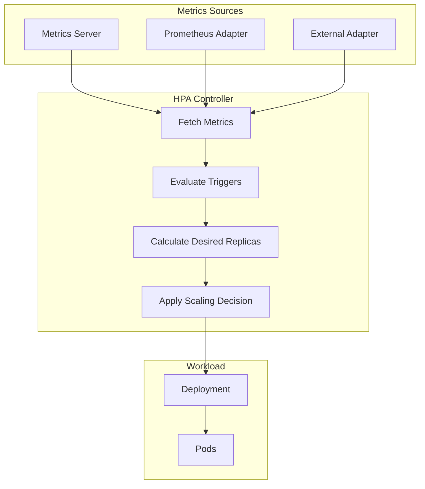
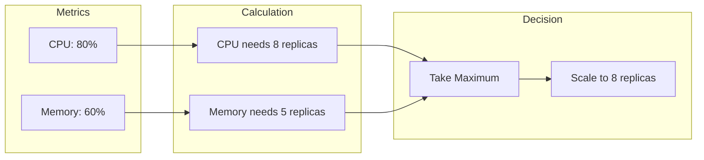
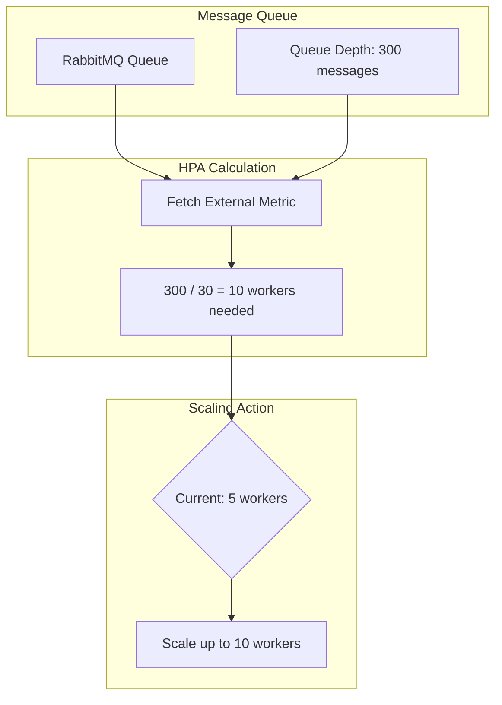
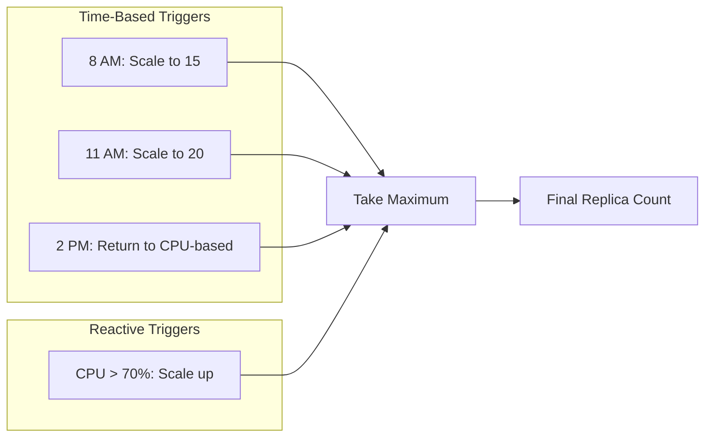

# How to Build Scaling Triggers

Author: [nawazdhandala](https://github.com/nawazdhandala)

Tags: Auto-Scaling, Triggers, Kubernetes, Infrastructure

Description: Learn to configure CPU, memory, custom metrics, and predictive scaling triggers that automatically adjust your workloads based on real demand.

---

Scaling triggers determine when your infrastructure should grow or shrink. Get them right, and your applications handle traffic spikes without manual intervention. Get them wrong, and you either waste money on idle resources or watch your services fall over during peak load.

## Understanding Scaling Triggers

A scaling trigger is a condition that, when met, causes your infrastructure to add or remove capacity. In Kubernetes, the Horizontal Pod Autoscaler (HPA) evaluates these triggers and adjusts replica counts accordingly.



### Types of Scaling Triggers

| Trigger Type | Use Case | Data Source |
|--------------|----------|-------------|
| CPU Utilization | Compute-bound workloads | Metrics Server |
| Memory Utilization | Memory-intensive applications | Metrics Server |
| Custom Metrics | Application-specific indicators | Prometheus Adapter |
| External Metrics | Queue depth, SaaS metrics | External Adapter |
| Predictive | Anticipated load patterns | KEDA + predictive models |

## CPU and Memory Triggers

These are the most common triggers. They rely on resource requests defined in your Pod spec.

### Basic CPU Trigger

```yaml
apiVersion: autoscaling/v2
kind: HorizontalPodAutoscaler
metadata:
  name: api-server
  namespace: production
spec:
  scaleTargetRef:
    apiVersion: apps/v1
    kind: Deployment
    name: api-server
  minReplicas: 3
  maxReplicas: 20
  metrics:
    - type: Resource
      resource:
        name: cpu
        target:
          type: Utilization
          averageUtilization: 70    # Scale when avg CPU > 70%
```

### Memory Trigger

Memory triggers work differently from CPU. Memory usage tends to be stickier, so scaling down based on memory can be tricky.

```yaml
apiVersion: autoscaling/v2
kind: HorizontalPodAutoscaler
metadata:
  name: image-processor
  namespace: production
spec:
  scaleTargetRef:
    apiVersion: apps/v1
    kind: Deployment
    name: image-processor
  minReplicas: 2
  maxReplicas: 15
  metrics:
    - type: Resource
      resource:
        name: memory
        target:
          type: AverageValue
          averageValue: 500Mi       # Scale when avg memory > 500Mi
```

### Combined CPU and Memory Triggers

When you define multiple metrics, the HPA scales based on whichever metric demands the most replicas.

```yaml
apiVersion: autoscaling/v2
kind: HorizontalPodAutoscaler
metadata:
  name: web-frontend
  namespace: production
spec:
  scaleTargetRef:
    apiVersion: apps/v1
    kind: Deployment
    name: web-frontend
  minReplicas: 3
  maxReplicas: 25
  metrics:
    - type: Resource
      resource:
        name: cpu
        target:
          type: Utilization
          averageUtilization: 65
    - type: Resource
      resource:
        name: memory
        target:
          type: Utilization
          averageUtilization: 75
```



## Custom Metrics Triggers

Custom metrics let you scale based on application-specific indicators like requests per second, queue length, or active connections.

### Setting Up Prometheus Adapter

First, install the Prometheus Adapter:

```bash
helm repo add prometheus-community https://prometheus-community.github.io/helm-charts
helm install prometheus-adapter prometheus-community/prometheus-adapter \
  --namespace monitoring \
  --set prometheus.url=http://prometheus-server.monitoring.svc
```

### Configure Custom Metrics Rules

Create a ConfigMap with your custom metrics rules:

```yaml
apiVersion: v1
kind: ConfigMap
metadata:
  name: adapter-config
  namespace: monitoring
data:
  config.yaml: |
    rules:
      - seriesQuery: 'http_requests_total{namespace!="",pod!=""}'
        resources:
          overrides:
            namespace: {resource: "namespace"}
            pod: {resource: "pod"}
        name:
          matches: "^(.*)_total$"
          as: "${1}_per_second"
        metricsQuery: 'sum(rate(<<.Series>>{<<.LabelMatchers>>}[2m])) by (<<.GroupBy>>)'

      - seriesQuery: 'queue_messages_waiting{namespace!="",pod!=""}'
        resources:
          overrides:
            namespace: {resource: "namespace"}
            pod: {resource: "pod"}
        name:
          matches: "^(.*)$"
          as: "${1}"
        metricsQuery: 'avg(<<.Series>>{<<.LabelMatchers>>}) by (<<.GroupBy>>)'
```

### HPA with Custom Metrics

```yaml
apiVersion: autoscaling/v2
kind: HorizontalPodAutoscaler
metadata:
  name: order-processor
  namespace: production
spec:
  scaleTargetRef:
    apiVersion: apps/v1
    kind: Deployment
    name: order-processor
  minReplicas: 2
  maxReplicas: 30
  metrics:
    # Scale based on requests per second per pod
    - type: Pods
      pods:
        metric:
          name: http_requests_per_second
        target:
          type: AverageValue
          averageValue: "100"       # Scale when RPS > 100 per pod

    # Also consider CPU to catch compute-heavy requests
    - type: Resource
      resource:
        name: cpu
        target:
          type: Utilization
          averageUtilization: 70
```

### Queue-Based Scaling

Scale workers based on queue depth:

```yaml
apiVersion: autoscaling/v2
kind: HorizontalPodAutoscaler
metadata:
  name: background-worker
  namespace: production
spec:
  scaleTargetRef:
    apiVersion: apps/v1
    kind: Deployment
    name: background-worker
  minReplicas: 1
  maxReplicas: 50
  metrics:
    - type: External
      external:
        metric:
          name: rabbitmq_queue_messages
          selector:
            matchLabels:
              queue: background-jobs
        target:
          type: AverageValue
          averageValue: "30"        # Each worker handles 30 messages
```



## Scaling Behavior Configuration

Kubernetes 1.18+ lets you fine-tune how aggressively the HPA scales.

### Aggressive Scale-Up, Gradual Scale-Down

```yaml
apiVersion: autoscaling/v2
kind: HorizontalPodAutoscaler
metadata:
  name: api-gateway
  namespace: production
spec:
  scaleTargetRef:
    apiVersion: apps/v1
    kind: Deployment
    name: api-gateway
  minReplicas: 5
  maxReplicas: 100
  metrics:
    - type: Resource
      resource:
        name: cpu
        target:
          type: Utilization
          averageUtilization: 60
  behavior:
    scaleUp:
      stabilizationWindowSeconds: 0       # React immediately
      policies:
        - type: Percent
          value: 100                      # Double capacity if needed
          periodSeconds: 15
        - type: Pods
          value: 10                       # Or add 10 pods
          periodSeconds: 15
      selectPolicy: Max                   # Use whichever adds more
    scaleDown:
      stabilizationWindowSeconds: 300     # Wait 5 min before scaling down
      policies:
        - type: Percent
          value: 10                       # Remove 10% of pods
          periodSeconds: 60
      selectPolicy: Min                   # Scale down conservatively
```

### Prevent Flapping

Flapping occurs when replicas bounce up and down. Use stabilization windows to prevent this:

```yaml
behavior:
  scaleUp:
    stabilizationWindowSeconds: 60        # Wait 1 min to confirm need
    policies:
      - type: Pods
        value: 4
        periodSeconds: 60
  scaleDown:
    stabilizationWindowSeconds: 600       # Wait 10 min before scale-down
    policies:
      - type: Pods
        value: 2
        periodSeconds: 120
```

## Predictive Scaling with KEDA

KEDA (Kubernetes Event-Driven Autoscaling) extends HPA capabilities with more trigger types and predictive scaling.

### Install KEDA

```bash
helm repo add kedacore https://kedacore.github.io/charts
helm install keda kedacore/keda --namespace keda --create-namespace
```

### Cron-Based Predictive Scaling

Scale up before known traffic peaks:

```yaml
apiVersion: keda.sh/v1alpha1
kind: ScaledObject
metadata:
  name: web-app-predictive
  namespace: production
spec:
  scaleTargetRef:
    name: web-app
  minReplicaCount: 3
  maxReplicaCount: 50
  triggers:
    # Base scaling on CPU
    - type: cpu
      metricType: Utilization
      metadata:
        value: "70"

    # Pre-scale for morning traffic (9 AM weekdays)
    - type: cron
      metadata:
        timezone: America/New_York
        start: 0 8 * * 1-5           # 8 AM Mon-Fri
        end: 0 10 * * 1-5            # 10 AM Mon-Fri
        desiredReplicas: "15"

    # Pre-scale for lunch rush
    - type: cron
      metadata:
        timezone: America/New_York
        start: 0 11 * * 1-5
        end: 0 14 * * 1-5
        desiredReplicas: "20"
```



### AWS SQS Trigger

Scale based on AWS SQS queue depth:

```yaml
apiVersion: keda.sh/v1alpha1
kind: ScaledObject
metadata:
  name: sqs-consumer
  namespace: production
spec:
  scaleTargetRef:
    name: sqs-consumer
  minReplicaCount: 0                      # Scale to zero when idle
  maxReplicaCount: 100
  triggers:
    - type: aws-sqs-queue
      metadata:
        queueURL: https://sqs.us-east-1.amazonaws.com/123456789/orders
        queueLength: "5"                  # 5 messages per pod
        awsRegion: us-east-1
        identityOwner: operator           # Use KEDA operator's IAM role
```

### Prometheus Query Trigger

Complex scaling logic using PromQL:

```yaml
apiVersion: keda.sh/v1alpha1
kind: ScaledObject
metadata:
  name: api-server-advanced
  namespace: production
spec:
  scaleTargetRef:
    name: api-server
  minReplicaCount: 3
  maxReplicaCount: 50
  triggers:
    - type: prometheus
      metadata:
        serverAddress: http://prometheus.monitoring.svc:9090
        metricName: http_requests_per_second
        query: |
          sum(rate(http_server_requests_total{namespace="production",service="api-server"}[2m]))
        threshold: "1000"                 # Scale at 1000 RPS total
```

## Building a Complete Scaling Strategy

Here is a production-ready scaling configuration that combines multiple trigger types:

```yaml
apiVersion: autoscaling/v2
kind: HorizontalPodAutoscaler
metadata:
  name: production-api
  namespace: production
  labels:
    app: production-api
spec:
  scaleTargetRef:
    apiVersion: apps/v1
    kind: Deployment
    name: production-api
  minReplicas: 5                          # Never go below 5 for HA
  maxReplicas: 100                        # Cost ceiling
  metrics:
    # Primary: CPU utilization
    - type: Resource
      resource:
        name: cpu
        target:
          type: Utilization
          averageUtilization: 65

    # Secondary: Memory pressure
    - type: Resource
      resource:
        name: memory
        target:
          type: Utilization
          averageUtilization: 80

    # Application metric: Request rate
    - type: Pods
      pods:
        metric:
          name: http_requests_per_second
        target:
          type: AverageValue
          averageValue: "150"

    # Application metric: Response latency
    - type: Pods
      pods:
        metric:
          name: http_request_duration_p95
        target:
          type: AverageValue
          averageValue: "200m"            # 200ms p95 latency target

  behavior:
    scaleUp:
      stabilizationWindowSeconds: 0
      policies:
        - type: Percent
          value: 50
          periodSeconds: 30
        - type: Pods
          value: 5
          periodSeconds: 30
      selectPolicy: Max
    scaleDown:
      stabilizationWindowSeconds: 300
      policies:
        - type: Percent
          value: 10
          periodSeconds: 60
      selectPolicy: Min
```

## Monitoring Your Scaling Triggers

### Grafana Dashboard Queries

Track scaling behavior with these Prometheus queries:

```promql
# Current vs desired replicas
kube_horizontalpodautoscaler_status_current_replicas{hpa="production-api"}
kube_horizontalpodautoscaler_status_desired_replicas{hpa="production-api"}

# Scaling events over time
changes(kube_horizontalpodautoscaler_status_current_replicas{hpa="production-api"}[1h])

# Time at max replicas (potential capacity issue)
avg_over_time(
  (kube_horizontalpodautoscaler_status_current_replicas{hpa="production-api"}
   == kube_horizontalpodautoscaler_spec_max_replicas{hpa="production-api"})[24h:]
)
```

### Alerting Rules

```yaml
apiVersion: monitoring.coreos.com/v1
kind: PrometheusRule
metadata:
  name: scaling-alerts
  namespace: monitoring
spec:
  groups:
    - name: scaling
      rules:
        - alert: HPAAtMaxReplicas
          expr: |
            kube_horizontalpodautoscaler_status_current_replicas
            == kube_horizontalpodautoscaler_spec_max_replicas
          for: 15m
          labels:
            severity: warning
          annotations:
            summary: "HPA {{ $labels.hpa }} is at max replicas"
            description: "Consider increasing maxReplicas or optimizing the workload"

        - alert: HPAScalingTooFrequent
          expr: |
            changes(kube_horizontalpodautoscaler_status_current_replicas[30m]) > 10
          for: 5m
          labels:
            severity: warning
          annotations:
            summary: "HPA {{ $labels.hpa }} is scaling too frequently"
            description: "Check stabilization windows and trigger thresholds"
```

## Common Pitfalls and Solutions

### Missing Resource Requests

The HPA cannot calculate utilization without resource requests:

```yaml
# Wrong: No requests defined
containers:
  - name: app
    image: myapp:latest

# Correct: Requests enable HPA calculation
containers:
  - name: app
    image: myapp:latest
    resources:
      requests:
        cpu: 200m
        memory: 256Mi
      limits:
        cpu: 1000m
        memory: 512Mi
```

### Trigger Threshold Too Sensitive

Setting CPU target too low causes constant scaling:

```yaml
# Too sensitive: will scale frequently
target:
  type: Utilization
  averageUtilization: 30

# Better: leaves headroom for spikes
target:
  type: Utilization
  averageUtilization: 65
```

### Not Accounting for Startup Time

If pods take time to become ready, scale up earlier:

```yaml
behavior:
  scaleUp:
    stabilizationWindowSeconds: 0
    policies:
      - type: Pods
        value: 5                          # Add multiple pods at once
        periodSeconds: 15                 # Check frequently
```

---

Scaling triggers form the foundation of responsive infrastructure. Start with CPU and memory triggers, add custom metrics as you understand your application better, and consider predictive scaling for workloads with known traffic patterns. Monitor your HPAs continuously and adjust thresholds based on real behavior rather than guesswork.
