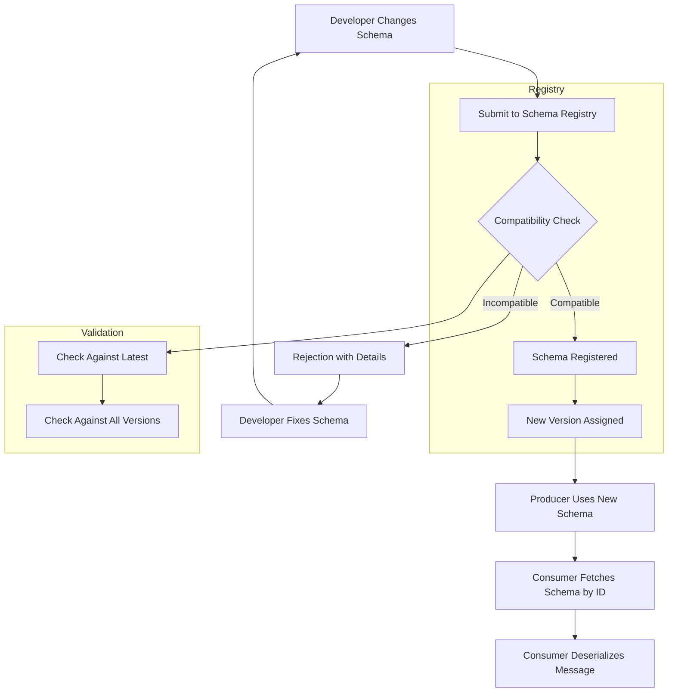
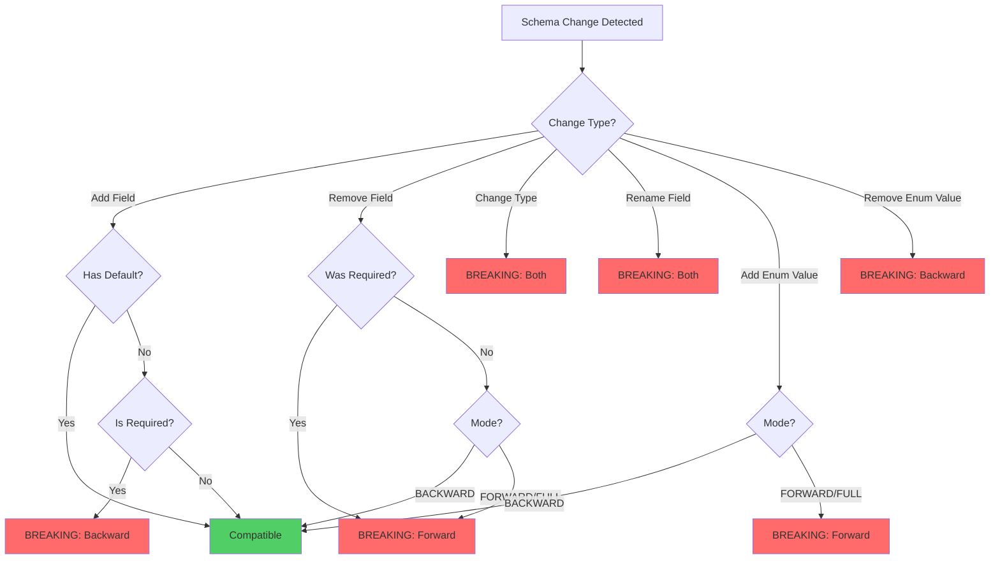
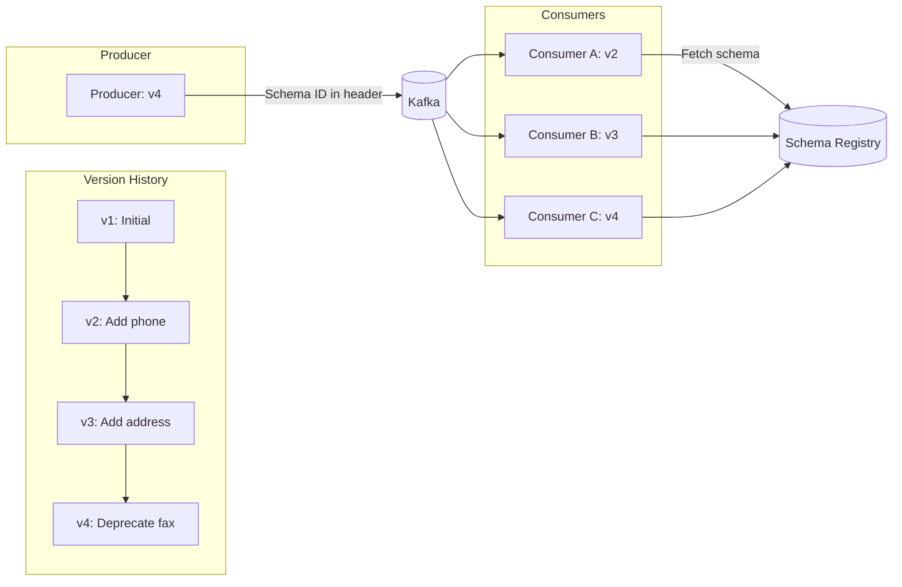

# How to Implement Schema Registry Contract Testing

Author: [nawazdhandala](https://github.com/nawazdhandala)

Tags: Testing, SchemaRegistry, Kafka, Contracts

Description: Learn how to implement schema registry contract testing to prevent breaking changes in event-driven architectures and ensure safe schema evolution.

---

Event-driven architectures rely on producers and consumers agreeing on message formats. When a producer changes a schema without coordination, consumers break. Schema registry contract testing catches these incompatibilities before they reach production.

This guide covers schema compatibility modes, validation techniques for Avro and JSON Schema, breaking change detection, and version management strategies with practical code examples.

---

## Table of Contents

1. Why Schema Registry Contract Testing Matters
2. Schema Compatibility Modes
3. Schema Evolution Flow
4. Avro Schema Validation
5. JSON Schema Validation
6. Breaking Change Detection
7. Schema Version Management
8. CI/CD Integration
9. Testing Strategies
10. Common Pitfalls

---

## 1. Why Schema Registry Contract Testing Matters

In microservices, services communicate through events. Each event has a schema that defines its structure. When schemas change without proper coordination:

- Consumers fail to deserialize messages
- Data gets corrupted or lost
- Downstream services crash
- Debugging becomes difficult across service boundaries

Schema registry contract testing validates that schema changes are compatible with existing consumers before deployment. Think of it as a compile-time check for your event contracts.

| Without Contract Testing | With Contract Testing |
|--------------------------|----------------------|
| Breaking changes discovered in production | Breaking changes caught in CI/CD |
| Manual coordination between teams | Automated compatibility verification |
| Rollback after consumer failures | Prevention before merge |
| Unclear schema ownership | Explicit schema versioning |

---

## 2. Schema Compatibility Modes

Schema registries support different compatibility modes that define what changes are allowed:

| Mode | Description | Safe Changes | Breaking Changes |
|------|-------------|--------------|------------------|
| BACKWARD | New schema can read data from old schema | Remove fields, add optional fields | Add required fields |
| FORWARD | Old schema can read data from new schema | Add fields, remove optional fields | Remove required fields |
| FULL | Both backward and forward compatible | Add/remove optional fields only | Add/remove required fields |
| NONE | No compatibility checking | Any change | N/A |
| BACKWARD_TRANSITIVE | Backward compatible with all previous versions | Same as BACKWARD | Same as BACKWARD |
| FORWARD_TRANSITIVE | Forward compatible with all previous versions | Same as FORWARD | Same as FORWARD |
| FULL_TRANSITIVE | Full compatible with all previous versions | Same as FULL | Same as FULL |

### Choosing the Right Mode

```
BACKWARD: Use when consumers are deployed before producers.
          New consumers can read old messages.

FORWARD:  Use when producers are deployed before consumers.
          Old consumers can read new messages.

FULL:     Use when deployment order is unpredictable.
          Safest but most restrictive.
```

---

## 3. Schema Evolution Flow

The following diagram shows how schema changes flow through the registry and get validated:



---

## 4. Avro Schema Validation

Avro is the most common schema format for Kafka. Here is how to set up contract testing with Avro schemas.

### Schema Definition

```json
// schemas/user-created-v1.avsc
{
  "type": "record",
  "name": "UserCreated",
  "namespace": "com.example.events",
  "fields": [
    {
      "name": "userId",
      "type": "string",
      "doc": "Unique identifier for the user"
    },
    {
      "name": "email",
      "type": "string",
      "doc": "User email address"
    },
    {
      "name": "createdAt",
      "type": "long",
      "logicalType": "timestamp-millis",
      "doc": "Creation timestamp in milliseconds"
    }
  ]
}
```

### Compatibility Testing with Node.js

```typescript
// schema-validator.ts
import { SchemaRegistry } from '@kafkajs/confluent-schema-registry';

// Initialize the schema registry client
const registry = new SchemaRegistry({
  host: process.env.SCHEMA_REGISTRY_URL || 'http://localhost:8081',
});

interface CompatibilityResult {
  isCompatible: boolean;
  errors?: string[];
}

// Check if a new schema is compatible with the existing schema
export async function checkSchemaCompatibility(
  subject: string,
  newSchema: string
): Promise<CompatibilityResult> {
  try {
    // Test compatibility against the latest registered schema
    const isCompatible = await registry.testCompatibility({
      subject,
      schema: newSchema,
    });

    return { isCompatible };
  } catch (error: any) {
    // Parse error response to extract compatibility violations
    return {
      isCompatible: false,
      errors: [error.message],
    };
  }
}

// Register a schema if it passes compatibility checks
export async function registerSchema(
  subject: string,
  schema: string
): Promise<{ id: number; version: number }> {
  // First check compatibility
  const result = await checkSchemaCompatibility(subject, schema);

  if (!result.isCompatible) {
    throw new Error(
      `Schema incompatible: ${result.errors?.join(', ')}`
    );
  }

  // Register the schema and get its ID
  const { id } = await registry.register({
    type: 'AVRO',
    schema,
  }, { subject });

  // Get the version number
  const versions = await registry.getSubjectVersions(subject);
  const version = versions[versions.length - 1];

  return { id, version };
}
```

### Contract Test Example

```typescript
// tests/user-created-schema.contract.test.ts
import { readFileSync } from 'fs';
import { checkSchemaCompatibility } from '../schema-validator';

describe('UserCreated Schema Contract Tests', () => {
  const subject = 'user-created-value';

  // Load the current schema from file
  const currentSchema = readFileSync(
    'schemas/user-created-v1.avsc',
    'utf-8'
  );

  test('schema should be compatible with registry', async () => {
    const result = await checkSchemaCompatibility(
      subject,
      currentSchema
    );

    expect(result.isCompatible).toBe(true);
  });

  test('adding optional field should be compatible', async () => {
    // Parse and modify the schema
    const schema = JSON.parse(currentSchema);
    schema.fields.push({
      name: 'phoneNumber',
      type: ['null', 'string'],  // Optional field with default null
      default: null,
      doc: 'User phone number',
    });

    const result = await checkSchemaCompatibility(
      subject,
      JSON.stringify(schema)
    );

    // Adding optional field with default is BACKWARD compatible
    expect(result.isCompatible).toBe(true);
  });

  test('adding required field should be incompatible', async () => {
    const schema = JSON.parse(currentSchema);
    schema.fields.push({
      name: 'lastName',
      type: 'string',  // Required field without default
      doc: 'User last name',
    });

    const result = await checkSchemaCompatibility(
      subject,
      JSON.stringify(schema)
    );

    // Adding required field breaks BACKWARD compatibility
    expect(result.isCompatible).toBe(false);
  });

  test('removing required field should be incompatible', async () => {
    const schema = JSON.parse(currentSchema);
    // Remove the email field
    schema.fields = schema.fields.filter(
      (f: any) => f.name !== 'email'
    );

    const result = await checkSchemaCompatibility(
      subject,
      JSON.stringify(schema)
    );

    // Removing required field breaks BACKWARD compatibility
    expect(result.isCompatible).toBe(false);
  });
});
```

---

## 5. JSON Schema Validation

For systems using JSON Schema instead of Avro, the validation approach is similar but with different rules.

### JSON Schema Definition

```json
// schemas/order-placed-v1.json
{
  "$schema": "http://json-schema.org/draft-07/schema#",
  "$id": "https://example.com/schemas/order-placed.json",
  "title": "OrderPlaced",
  "type": "object",
  "required": ["orderId", "customerId", "items", "total"],
  "properties": {
    "orderId": {
      "type": "string",
      "description": "Unique order identifier"
    },
    "customerId": {
      "type": "string",
      "description": "Customer who placed the order"
    },
    "items": {
      "type": "array",
      "items": {
        "type": "object",
        "required": ["productId", "quantity", "price"],
        "properties": {
          "productId": { "type": "string" },
          "quantity": { "type": "integer", "minimum": 1 },
          "price": { "type": "number", "minimum": 0 }
        }
      }
    },
    "total": {
      "type": "number",
      "minimum": 0,
      "description": "Total order amount"
    }
  },
  "additionalProperties": false
}
```

### JSON Schema Compatibility Checker

```typescript
// json-schema-validator.ts
import Ajv from 'ajv';
import addFormats from 'ajv-formats';

const ajv = new Ajv({ allErrors: true, strict: false });
addFormats(ajv);

interface JsonSchemaCompatibility {
  isCompatible: boolean;
  breakingChanges: string[];
  warnings: string[];
}

// Compare two JSON schemas for backward compatibility
export function checkJsonSchemaCompatibility(
  oldSchema: object,
  newSchema: object
): JsonSchemaCompatibility {
  const breakingChanges: string[] = [];
  const warnings: string[] = [];

  const oldProps = (oldSchema as any).properties || {};
  const newProps = (newSchema as any).properties || {};
  const oldRequired = new Set((oldSchema as any).required || []);
  const newRequired = new Set((newSchema as any).required || []);

  // Check for removed properties that were required
  for (const prop of Object.keys(oldProps)) {
    if (!(prop in newProps)) {
      if (oldRequired.has(prop)) {
        breakingChanges.push(
          `Required property '${prop}' was removed`
        );
      } else {
        warnings.push(
          `Optional property '${prop}' was removed`
        );
      }
    }
  }

  // Check for new required properties without defaults
  for (const prop of newRequired) {
    if (!oldRequired.has(prop) && !(prop in oldProps)) {
      breakingChanges.push(
        `New required property '${prop}' added without default`
      );
    }
  }

  // Check for type changes
  for (const prop of Object.keys(oldProps)) {
    if (prop in newProps) {
      const oldType = oldProps[prop].type;
      const newType = newProps[prop].type;
      if (oldType !== newType) {
        breakingChanges.push(
          `Property '${prop}' type changed from '${oldType}' to '${newType}'`
        );
      }
    }
  }

  return {
    isCompatible: breakingChanges.length === 0,
    breakingChanges,
    warnings,
  };
}

// Validate a message against a JSON schema
export function validateMessage(
  schema: object,
  message: unknown
): { valid: boolean; errors: string[] } {
  const validate = ajv.compile(schema);
  const valid = validate(message);

  return {
    valid: !!valid,
    errors: validate.errors?.map(
      e => `${e.instancePath} ${e.message}`
    ) || [],
  };
}
```

### JSON Schema Contract Tests

```typescript
// tests/order-placed-schema.contract.test.ts
import { readFileSync } from 'fs';
import {
  checkJsonSchemaCompatibility,
  validateMessage,
} from '../json-schema-validator';

describe('OrderPlaced JSON Schema Contract Tests', () => {
  const currentSchema = JSON.parse(
    readFileSync('schemas/order-placed-v1.json', 'utf-8')
  );

  test('valid message passes validation', () => {
    const message = {
      orderId: 'ord-123',
      customerId: 'cust-456',
      items: [
        { productId: 'prod-1', quantity: 2, price: 29.99 }
      ],
      total: 59.98,
    };

    const result = validateMessage(currentSchema, message);
    expect(result.valid).toBe(true);
  });

  test('message missing required field fails', () => {
    const message = {
      orderId: 'ord-123',
      // Missing customerId
      items: [],
      total: 0,
    };

    const result = validateMessage(currentSchema, message);
    expect(result.valid).toBe(false);
    expect(result.errors).toContain(
      " must have required property 'customerId'"
    );
  });

  test('adding optional property is compatible', () => {
    const newSchema = {
      ...currentSchema,
      properties: {
        ...currentSchema.properties,
        notes: {
          type: 'string',
          description: 'Optional order notes',
        },
      },
    };

    const result = checkJsonSchemaCompatibility(
      currentSchema,
      newSchema
    );

    expect(result.isCompatible).toBe(true);
  });

  test('removing required property is breaking', () => {
    const newSchema = {
      ...currentSchema,
      properties: { ...currentSchema.properties },
      required: currentSchema.required.filter(
        (r: string) => r !== 'total'
      ),
    };
    delete newSchema.properties.total;

    const result = checkJsonSchemaCompatibility(
      currentSchema,
      newSchema
    );

    expect(result.isCompatible).toBe(false);
    expect(result.breakingChanges).toContain(
      "Required property 'total' was removed"
    );
  });
});
```

---

## 6. Breaking Change Detection

The following diagram shows the decision process for detecting breaking changes:



### Breaking Change Detector Implementation

```typescript
// breaking-change-detector.ts

interface SchemaField {
  name: string;
  type: string | string[];
  default?: any;
  doc?: string;
}

interface SchemaChange {
  type: 'ADDED' | 'REMOVED' | 'MODIFIED';
  field: string;
  details: string;
  breaking: boolean;
  severity: 'ERROR' | 'WARNING' | 'INFO';
}

// Analyze changes between two Avro schemas
export function detectBreakingChanges(
  oldSchema: { fields: SchemaField[] },
  newSchema: { fields: SchemaField[] },
  compatibilityMode: 'BACKWARD' | 'FORWARD' | 'FULL'
): SchemaChange[] {
  const changes: SchemaChange[] = [];

  const oldFields = new Map(
    oldSchema.fields.map(f => [f.name, f])
  );
  const newFields = new Map(
    newSchema.fields.map(f => [f.name, f])
  );

  // Check for removed fields
  for (const [name, field] of oldFields) {
    if (!newFields.has(name)) {
      const hasDefault = 'default' in field;
      const isBreaking =
        compatibilityMode === 'FORWARD' ||
        compatibilityMode === 'FULL' ||
        !hasDefault;

      changes.push({
        type: 'REMOVED',
        field: name,
        details: `Field '${name}' was removed`,
        breaking: isBreaking,
        severity: isBreaking ? 'ERROR' : 'WARNING',
      });
    }
  }

  // Check for added fields
  for (const [name, field] of newFields) {
    if (!oldFields.has(name)) {
      const hasDefault = 'default' in field;
      const isOptional =
        Array.isArray(field.type) &&
        field.type.includes('null');
      const isBreaking =
        compatibilityMode !== 'FORWARD' &&
        !hasDefault &&
        !isOptional;

      changes.push({
        type: 'ADDED',
        field: name,
        details: hasDefault || isOptional
          ? `Optional field '${name}' added`
          : `Required field '${name}' added without default`,
        breaking: isBreaking,
        severity: isBreaking ? 'ERROR' : 'INFO',
      });
    }
  }

  // Check for modified fields
  for (const [name, oldField] of oldFields) {
    const newField = newFields.get(name);
    if (newField) {
      // Type change detection
      const oldType = JSON.stringify(oldField.type);
      const newType = JSON.stringify(newField.type);

      if (oldType !== newType) {
        changes.push({
          type: 'MODIFIED',
          field: name,
          details: `Field '${name}' type changed from ${oldType} to ${newType}`,
          breaking: true,
          severity: 'ERROR',
        });
      }
    }
  }

  return changes;
}

// Generate a compatibility report
export function generateCompatibilityReport(
  changes: SchemaChange[]
): string {
  const breaking = changes.filter(c => c.breaking);
  const warnings = changes.filter(
    c => !c.breaking && c.severity === 'WARNING'
  );
  const info = changes.filter(c => c.severity === 'INFO');

  let report = '# Schema Compatibility Report\n\n';

  if (breaking.length > 0) {
    report += '## Breaking Changes\n\n';
    for (const change of breaking) {
      report += `- ${change.details}\n`;
    }
    report += '\n';
  }

  if (warnings.length > 0) {
    report += '## Warnings\n\n';
    for (const change of warnings) {
      report += `- ${change.details}\n`;
    }
    report += '\n';
  }

  if (info.length > 0) {
    report += '## Non-Breaking Changes\n\n';
    for (const change of info) {
      report += `- ${change.details}\n`;
    }
  }

  if (changes.length === 0) {
    report += 'No schema changes detected.\n';
  }

  return report;
}
```

---

## 7. Schema Version Management

Effective schema versioning prevents compatibility issues and enables safe rollbacks.



### Version Manager Implementation

```typescript
// schema-version-manager.ts
import { SchemaRegistry } from '@kafkajs/confluent-schema-registry';

interface SchemaVersion {
  version: number;
  id: number;
  schema: string;
  createdAt: Date;
}

export class SchemaVersionManager {
  private registry: SchemaRegistry;

  constructor(registryUrl: string) {
    this.registry = new SchemaRegistry({ host: registryUrl });
  }

  // Get all versions of a subject
  async getAllVersions(subject: string): Promise<SchemaVersion[]> {
    const versions = await this.registry.getSubjectVersions(subject);
    const schemas: SchemaVersion[] = [];

    for (const version of versions) {
      const { schema, id } = await this.registry.getRegistryId(
        subject,
        version
      );
      schemas.push({
        version,
        id,
        schema: JSON.stringify(schema),
        createdAt: new Date(), // Registry does not store timestamp
      });
    }

    return schemas;
  }

  // Get the latest version
  async getLatestVersion(subject: string): Promise<SchemaVersion> {
    const versions = await this.getAllVersions(subject);
    return versions[versions.length - 1];
  }

  // Delete a specific version (use with caution)
  async deleteVersion(
    subject: string,
    version: number
  ): Promise<void> {
    // Soft delete - marks version as deleted
    await this.registry.deleteSubjectVersion(subject, version);
  }

  // Set compatibility mode for a subject
  async setCompatibility(
    subject: string,
    mode: 'BACKWARD' | 'FORWARD' | 'FULL' | 'NONE'
  ): Promise<void> {
    await this.registry.setSubjectConfig(subject, {
      compatibilityLevel: mode,
    });
  }

  // Get current compatibility mode
  async getCompatibility(subject: string): Promise<string> {
    const config = await this.registry.getSubjectConfig(subject);
    return config.compatibilityLevel;
  }

  // Compare two versions for differences
  async compareVersions(
    subject: string,
    versionA: number,
    versionB: number
  ): Promise<{ added: string[]; removed: string[]; modified: string[] }> {
    const [schemaA, schemaB] = await Promise.all([
      this.registry.getRegistryId(subject, versionA),
      this.registry.getRegistryId(subject, versionB),
    ]);

    const fieldsA = new Set(
      (schemaA.schema as any).fields.map((f: any) => f.name)
    );
    const fieldsB = new Set(
      (schemaB.schema as any).fields.map((f: any) => f.name)
    );

    const added = [...fieldsB].filter(f => !fieldsA.has(f));
    const removed = [...fieldsA].filter(f => !fieldsB.has(f));

    // Check for type modifications
    const modified: string[] = [];
    const schemaAFields = new Map(
      (schemaA.schema as any).fields.map((f: any) => [f.name, f])
    );
    const schemaBFields = new Map(
      (schemaB.schema as any).fields.map((f: any) => [f.name, f])
    );

    for (const [name, fieldA] of schemaAFields) {
      const fieldB = schemaBFields.get(name);
      if (fieldB && JSON.stringify(fieldA.type) !== JSON.stringify(fieldB.type)) {
        modified.push(name);
      }
    }

    return { added, removed, modified };
  }
}
```

### Version Migration Script

```typescript
// scripts/migrate-schema.ts
import { SchemaVersionManager } from '../schema-version-manager';
import { readFileSync } from 'fs';

async function migrateSchema() {
  const manager = new SchemaVersionManager(
    process.env.SCHEMA_REGISTRY_URL || 'http://localhost:8081'
  );

  const subject = process.argv[2];
  const schemaFile = process.argv[3];

  if (!subject || !schemaFile) {
    console.error('Usage: migrate-schema <subject> <schema-file>');
    process.exit(1);
  }

  // Load the new schema
  const newSchema = readFileSync(schemaFile, 'utf-8');

  // Get current compatibility mode
  const compatibility = await manager.getCompatibility(subject);
  console.log(`Current compatibility mode: ${compatibility}`);

  // Get current version for comparison
  const current = await manager.getLatestVersion(subject);
  console.log(`Current version: ${current.version}`);

  // Compare schemas
  const currentFields = JSON.parse(current.schema).fields;
  const newFields = JSON.parse(newSchema).fields;

  console.log('\nSchema comparison:');
  console.log(`Current fields: ${currentFields.map((f: any) => f.name).join(', ')}`);
  console.log(`New fields: ${newFields.map((f: any) => f.name).join(', ')}`);

  // Register new schema (will fail if incompatible)
  try {
    const result = await manager.registerSchema(subject, newSchema);
    console.log(`\nNew version registered: ${result.version}`);
    console.log(`Schema ID: ${result.id}`);
  } catch (error: any) {
    console.error(`\nFailed to register schema: ${error.message}`);
    process.exit(1);
  }
}

migrateSchema().catch(console.error);
```

---

## 8. CI/CD Integration

Integrate schema validation into your deployment pipeline to catch breaking changes early.

### GitHub Actions Workflow

```yaml
# .github/workflows/schema-validation.yml
name: Schema Contract Validation

on:
  pull_request:
    paths:
      - 'schemas/**'
      - 'src/events/**'

jobs:
  validate-schemas:
    runs-on: ubuntu-latest

    services:
      schema-registry:
        image: confluentinc/cp-schema-registry:7.5.0
        ports:
          - 8081:8081
        env:
          SCHEMA_REGISTRY_HOST_NAME: schema-registry
          SCHEMA_REGISTRY_KAFKASTORE_BOOTSTRAP_SERVERS: PLAINTEXT://kafka:9092

    steps:
      - uses: actions/checkout@v4
        with:
          fetch-depth: 0  # Need full history for comparison

      - uses: actions/setup-node@v4
        with:
          node-version: '20'

      - name: Install dependencies
        run: npm ci

      - name: Get changed schema files
        id: changed-schemas
        run: |
          CHANGED=$(git diff --name-only origin/main...HEAD -- 'schemas/*.avsc' 'schemas/*.json')
          echo "files=$CHANGED" >> $GITHUB_OUTPUT

      - name: Validate schema compatibility
        run: |
          for schema in ${{ steps.changed-schemas.outputs.files }}; do
            echo "Validating $schema..."
            npm run schema:validate -- "$schema"
          done

      - name: Run contract tests
        run: npm run test:contracts

      - name: Generate compatibility report
        if: always()
        run: npm run schema:report > compatibility-report.md

      - name: Comment PR with report
        if: always()
        uses: actions/github-script@v7
        with:
          script: |
            const fs = require('fs');
            const report = fs.readFileSync('compatibility-report.md', 'utf8');
            github.rest.issues.createComment({
              issue_number: context.issue.number,
              owner: context.repo.owner,
              repo: context.repo.repo,
              body: report
            });
```

### Pre-commit Hook

```bash
#!/bin/bash
# .git/hooks/pre-commit

# Find changed schema files
CHANGED_SCHEMAS=$(git diff --cached --name-only -- 'schemas/*.avsc' 'schemas/*.json')

if [ -z "$CHANGED_SCHEMAS" ]; then
  exit 0
fi

echo "Validating schema changes..."

for schema in $CHANGED_SCHEMAS; do
  echo "Checking $schema..."

  # Run compatibility check
  if ! npm run schema:validate -- "$schema" --quiet; then
    echo "ERROR: Schema $schema has compatibility issues"
    echo "Run 'npm run schema:report -- $schema' for details"
    exit 1
  fi
done

echo "All schema validations passed"
```

---

## 9. Testing Strategies

### Consumer Contract Tests

Test that consumers can handle all compatible schema versions:

```typescript
// tests/consumer-contracts.test.ts
import { SchemaVersionManager } from '../schema-version-manager';
import { UserCreatedConsumer } from '../consumers/user-created';

describe('UserCreatedConsumer Contract Tests', () => {
  const manager = new SchemaVersionManager('http://localhost:8081');
  const consumer = new UserCreatedConsumer();

  test('consumer handles all schema versions', async () => {
    const versions = await manager.getAllVersions('user-created-value');

    for (const version of versions) {
      // Create a sample message for each version
      const schema = JSON.parse(version.schema);
      const message = createSampleMessage(schema);

      // Verify consumer can process it
      const result = await consumer.process(message);
      expect(result.success).toBe(true);
    }
  });

  test('consumer handles missing optional fields', async () => {
    // Message with only required fields
    const minimalMessage = {
      userId: 'user-123',
      email: 'test@example.com',
      createdAt: Date.now(),
    };

    const result = await consumer.process(minimalMessage);
    expect(result.success).toBe(true);
  });

  test('consumer handles extra unknown fields', async () => {
    // Message with fields from a newer schema version
    const futureMessage = {
      userId: 'user-123',
      email: 'test@example.com',
      createdAt: Date.now(),
      unknownField: 'some value',  // Field from future version
    };

    const result = await consumer.process(futureMessage);
    expect(result.success).toBe(true);
  });
});

// Helper to create sample messages from schema
function createSampleMessage(schema: any): Record<string, any> {
  const message: Record<string, any> = {};

  for (const field of schema.fields) {
    message[field.name] = generateSampleValue(field.type);
  }

  return message;
}

function generateSampleValue(type: string | string[]): any {
  if (Array.isArray(type)) {
    // Union type, use first non-null type
    const nonNullType = type.find(t => t !== 'null');
    return nonNullType ? generateSampleValue(nonNullType) : null;
  }

  switch (type) {
    case 'string': return 'sample-string';
    case 'int':
    case 'long': return 12345;
    case 'float':
    case 'double': return 123.45;
    case 'boolean': return true;
    default: return null;
  }
}
```

### Producer Contract Tests

Test that producers generate valid messages:

```typescript
// tests/producer-contracts.test.ts
import { validateMessage } from '../json-schema-validator';
import { UserService } from '../services/user-service';
import { readFileSync } from 'fs';

describe('UserService Producer Contract Tests', () => {
  const userCreatedSchema = JSON.parse(
    readFileSync('schemas/user-created-v1.avsc', 'utf-8')
  );
  const service = new UserService();

  test('createUser produces valid UserCreated event', async () => {
    // Capture the event that would be published
    const events: any[] = [];
    service.onEvent('UserCreated', (event) => events.push(event));

    await service.createUser({
      email: 'test@example.com',
      name: 'Test User',
    });

    expect(events).toHaveLength(1);

    // Validate against schema
    const result = validateMessage(userCreatedSchema, events[0]);
    expect(result.valid).toBe(true);
  });

  test('all required fields are present', async () => {
    const events: any[] = [];
    service.onEvent('UserCreated', (event) => events.push(event));

    await service.createUser({
      email: 'test@example.com',
      name: 'Test User',
    });

    const event = events[0];
    const requiredFields = ['userId', 'email', 'createdAt'];

    for (const field of requiredFields) {
      expect(event).toHaveProperty(field);
      expect(event[field]).not.toBeNull();
      expect(event[field]).not.toBeUndefined();
    }
  });
});
```

---

## 10. Common Pitfalls

### Pitfall 1: Adding Required Fields Without Defaults

```typescript
// BAD: This breaks backward compatibility
const oldSchema = {
  fields: [
    { name: 'userId', type: 'string' },
  ],
};

const newSchema = {
  fields: [
    { name: 'userId', type: 'string' },
    { name: 'email', type: 'string' },  // Required, no default
  ],
};

// GOOD: Add optional field or provide default
const goodSchema = {
  fields: [
    { name: 'userId', type: 'string' },
    { name: 'email', type: ['null', 'string'], default: null },
  ],
};
```

### Pitfall 2: Changing Field Types

```typescript
// BAD: Type changes are always breaking
const oldSchema = {
  fields: [
    { name: 'quantity', type: 'int' },
  ],
};

const newSchema = {
  fields: [
    { name: 'quantity', type: 'string' },  // Breaking change
  ],
};

// GOOD: Add a new field instead
const goodSchema = {
  fields: [
    { name: 'quantity', type: 'int' },
    { name: 'quantityStr', type: ['null', 'string'], default: null },
  ],
};
```

### Pitfall 3: Not Testing All Consumer Versions

```typescript
// BAD: Only testing against latest schema
test('consumer works', async () => {
  const latestSchema = await registry.getLatest('user-created');
  // Only validates current version
});

// GOOD: Test against all active versions
test('consumer handles all versions', async () => {
  const versions = await registry.getAllVersions('user-created');

  for (const version of versions) {
    const message = createMessage(version.schema);
    const result = await consumer.process(message);
    expect(result.success).toBe(true);
  }
});
```

### Pitfall 4: Ignoring Transitive Compatibility

```typescript
// v1 -> v2: Compatible (add optional field)
// v2 -> v3: Compatible (add optional field)
// v1 -> v3: May NOT be compatible!

// Always test against ALL previous versions, not just the latest
async function checkTransitiveCompatibility(
  subject: string,
  newSchema: string
): Promise<boolean> {
  const versions = await registry.getAllVersions(subject);

  for (const version of versions) {
    const isCompatible = await checkCompatibility(
      version.schema,
      newSchema
    );
    if (!isCompatible) {
      console.error(`Incompatible with v${version.version}`);
      return false;
    }
  }

  return true;
}
```

---

## Summary

| Concept | Key Takeaway |
|---------|-------------|
| Compatibility Modes | Choose based on deployment order: BACKWARD, FORWARD, or FULL |
| Contract Tests | Validate schemas in CI before they reach production |
| Breaking Changes | Adding required fields, removing fields, changing types |
| Version Management | Track all versions, test consumers against historical schemas |
| Validation | Use Avro or JSON Schema validators to catch issues early |

Schema registry contract testing transforms schema evolution from a coordination problem into an automated safety net. By validating compatibility before deployment, teams can evolve their event schemas confidently without breaking downstream consumers.

---

## Related Reading

- [Traces and Spans in OpenTelemetry](/blog/post/2025-08-27-traces-and-spans-in-opentelemetry)
- [How to Structure Logs Properly in OpenTelemetry](/blog/post/2025-08-28-how-to-structure-logs-properly-in-opentelemetry)
- [What is OpenTelemetry Collector and Why Use One](/blog/post/2025-09-18-what-is-opentelemetry-collector-and-why-use-one)
